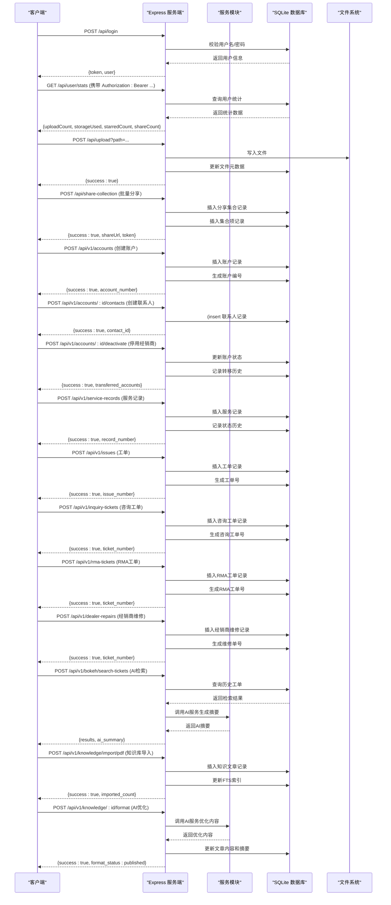
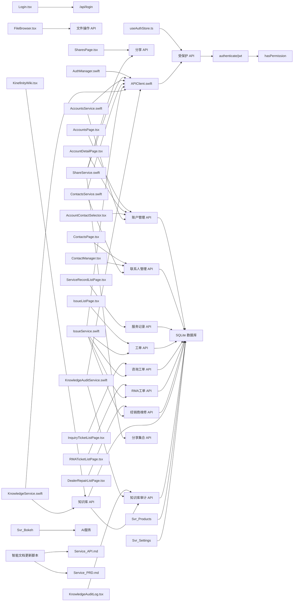

# API 接口文档

<cite>
**本文引用的文件**
- [server/index.js](file://server/index.js)
- [docs/API_DOCUMENTATION.md](file://docs/API_DOCUMENTATION.md)
- [docs/Service_API.md](file://docs/Service_API.md)
- [server/service/index.js](file://server/service/index.js)
- [server/service/routes/accounts.js](file://server/service/routes/accounts.js)
- [server/service/routes/contacts.js](file://server/service/routes/contacts.js)
- [server/service/routes/context.js](file://server/service/routes/context.js)
- [server/service/routes/bokeh.js](file://server/service/routes/bokeh.js)
- [server/service/routes/dealer-repairs.js](file://server/service/routes/dealer-repairs.js)
- [server/service/routes/inquiry-tickets.js](file://server/service/routes/inquiry-tickets.js)
- [server/service/routes/knowledge.js](file://server/service/routes/knowledge.js)
- [server/service/routes/knowledge_audit.js](file://server/service/routes/knowledge_audit.js)
- [server/service/routes/products-admin.js](file://server/service/routes/products-admin.js)
- [server/service/routes/rma-tickets.js](file://server/service/routes/rma-tickets.js)
- [server/service/routes/settings.js](file://server/service/routes/settings.js)
- [scripts/update_service_docs_smart.sh](file://scripts/update_service_docs_smart.sh)
- [server/service/migrations/012_account_contact_architecture.sql](file://server/service/migrations/012_account_contact_architecture.sql)
- [server/service/migrations/013_migrate_to_account_contact.sql](file://server/service/migrations/013_migrate_to_account_contact.sql)
- [server/service/migrations/014_dealer_deactivation.sql](file://server/service/migrations/014_dealer_deactivation.sql)
- [server/service/migrations/015_update_account_types.sql](file://server/service/migrations/015_update_account_types.sql)
- [server/service/migrations/015_update_account_types_v2.sql](file://server/service/migrations/015_update_account_types_v2.sql)
- [server/service/migrations/016_add_account_deleted_fields.sql](file://server/service/migrations/016_add_account_deleted_fields.sql)
- [server/service/migrations/017_fix_dealer_fk_references.sql](file://server/service/migrations/017_fix_dealer_fk_references.sql)
- [server/migrations/migrate_to_accounts.sql](file://server/migrations/migrate_to_accounts.sql)
- [server/migrations/update_product_families.js](file://server/migrations/update_product_families.js)
- [server/scripts/migrate_ticket_product_family.js](file://server/scripts/migrate_ticket_product_family.js)
- [server/check_families.js](file://server/check_families.js)
- [server/migrations/add_knowledge_audit_log.sql](file://server/migrations/add_knowledge_audit_log.sql)
- [server/migrations/add_knowledge_source_fields.sql](file://server/migrations/add_knowledge_source_fields.sql)
- [server/service/migrations/005_knowledge_base.sql](file://server/service/migrations/005_knowledge_base.sql)
- [server/service/migrations/011_ticket_search_index.sql](file://server/service/migrations/011_ticket_search_index.sql)
- [server/service/ai_service.js](file://server/service/ai_service.js)
- [ios/LonghornApp/Services/APIClient.swift](file://ios/LonghornApp/Services/APIClient.swift)
- [ios/LonghornApp/Services/ShareService.swift](file://ios/LonghornApp/Services/ShareService.swift)
- [ios/LonghornApp/Models/ShareLink.swift](file://ios/LonghornApp/Models/ShareLink.swift)
- [ios/LonghornApp/Views/Shares/BatchShareDialogView.swift](file://ios/LonghornApp/Views/Shares/BatchShareDialogView.swift)
- [client/src/components/FileBrowser.tsx](file://client/src/components/FileBrowser.tsx)
- [client/src/components/SharesPage.tsx](file://client/src/components/SharesPage.tsx)
- [client/src/components/ServiceRecords/ServiceRecordListPage.tsx](file://client/src/components/ServiceRecords/ServiceRecordListPage.tsx)
- [client/src/components/Issues/IssueListPage.tsx](file://client/src/components/Issues/IssueListPage.tsx)
- [client/src/components/InquiryTickets/InquiryTicketListPage.tsx](file://client/src/components/InquiryTickets/InquiryTicketListPage.tsx)
- [client/src/components/RMATickets/RMATicketListPage.tsx](file://client/src/components/RMATickets/RMATicketListPage.tsx)
- [client/src/components/DealerRepairs/DealerRepairListPage.tsx](file://client/src/components/DealerRepairs/DealerRepairListPage.tsx)
- [client/src/components/KinefinityWiki.tsx](file://client/src/components/KinefinityWiki.tsx)
- [client/src/components/KnowledgeAuditLog.tsx](file://client/src/components/KnowledgeAuditLog.tsx)
- [ios/LonghornApp/Services/IssueService.swift](file://ios/LonghornApp/Services/IssueService.swift)
- [ios/LonghornApp/Models/Issue.swift](file://ios/LonghornApp/Models/Issue.swift)
- [ios/LonghornApp/Views/Issues/IssueListView.swift](file://ios/LonghornApp/Views/Issues/IssueListView.swift)
- [client/src/components/AccountDetailPage.tsx](file://client/src/components/AccountDetailPage.tsx)
- [client/src/components/ContactManager.tsx](file://client/src/components/ContactManager.tsx)
- [client/src/components/AccountContactSelector.tsx](file://client/src/components/AccountContactSelector.tsx)
</cite>

## 更新摘要
**所做更改**
- 更新以反映知识库系统 API 的大幅扩展，包括增强的搜索功能、URL 参数结构优化、多级可见性控制
- 新增知识库审计日志系统，支持完整的操作追踪和统计分析
- 更新 Bokeh AI 工单检索系统，增强与知识库的集成能力
- 优化知识库导入功能，支持 PDF/DOCX/URL 多种来源
- 新增知识库章节聚合和全文阅读功能
- 更新智能文档更新机制，支持知识库 API 的自动分析和更新

## 目录
1. [简介](#简介)
2. [项目结构](#项目结构)
3. [核心组件](#核心组件)
4. [架构总览](#架构总览)
5. [详细组件分析](#详细组件分析)
6. [依赖关系分析](#依赖关系分析)
7. [性能考量](#性能考量)
8. [故障排查指南](#故障排查指南)
9. [结论](#结论)
10. [附录](#附录)

## 简介
本文件为 Longhorn 项目的完整 API 接口文档，覆盖用户认证、文件操作、权限管理、分享系统、**服务记录管理**、**工单管理**、**三层工单模型**、**账户管理**、**联系人管理**、**Bokeh AI工单检索**、**知识库系统**、**产品管理**和**系统设置**等模块。文档基于后端服务与前后端客户端源码进行梳理，明确各接口的端点、HTTP 方法、请求参数、响应格式、鉴权方式、错误码与典型调用示例，并提供测试与调试建议。

**版本**: 1.5 (0.5.0) (2026-02-11)

**智能文档更新**: 基于代码变更自动分析，支持动态文档生成和外部API文档系统的集成

## 项目结构
Longhorn 采用"服务端 + 前端 Web + iOS 客户端"的三层架构，新增智能文档更新机制和增强的知识库系统：
- 服务端：基于 Node.js + Express，提供 REST API、静态资源与缩略图生成，支持智能文档更新脚本和知识库审计日志
- 前端 Web：React 应用，负责路由、UI 与 API 调用，包含知识库管理界面和审计日志页面
- iOS 客户端：Swift 应用，通过统一的 APIClient 进行网络请求

```mermaid
graph TB
subgraph "智能文档系统"
SmartDocs["智能文档更新脚本<br/>update_service_docs_smart.sh"]
ServiceAPI["Service_API.md<br/>智能模板格式"]
ServicePRD["Service_PRD.md<br/>自动同步"]
end
subgraph "前端 Web"
FE_App["App.tsx<br/>路由与布局"]
FE_Login["Login.tsx<br/>登录表单"]
FE_Store["useAuthStore.ts<br/>状态管理"]
FE_FileBrowser["FileBrowser.tsx<br/>文件浏览器"]
FE_SharePage["SharesPage.tsx<br/>分享管理"]
FE_ServiceRecords["ServiceRecordListPage.tsx<br/>服务记录列表"]
FE_Issues["IssueListPage.tsx<br/>工单列表"]
FE_InquiryTickets["InquiryTicketListPage.tsx<br/>咨询工单列表"]
FE_RMATickets["RMATicketListPage.tsx<br/>RMA工单列表"]
FE_DealerRepairs["DealerRepairListPage.tsx<br/>经销商维修列表"]
FE_Accounts["AccountsPage.tsx<br/>账户管理"]
FE_Contacts["ContactsPage.tsx<br/>联系人管理"]
FE_AccountDetail["AccountDetailPage.tsx<br/>账户详情"]
FE_ContactManager["ContactManager.tsx<br/>联系人管理"]
FE_AccountSelector["AccountContactSelector.tsx<br/>账户选择器"]
FE_KnowledgeWiki["KinefinityWiki.tsx<br/>知识库管理"]
FE_KnowledgeAudit["KnowledgeAuditLog.tsx<br/>知识库审计日志"]
end
subgraph "iOS 客户端"
IOS_APIClient["APIClient.swift<br/>网络请求封装"]
IOS_AuthMgr["AuthManager.swift<br/>认证管理"]
IOS_ShareService["ShareService.swift<br/>分享服务"]
IOS_IssueService["IssueService.swift<br/>工单服务"]
IOS_AccountsService["AccountsService.swift<br/>账户服务"]
IOS_ContactsService["ContactsService.swift<br/>联系人服务"]
IOS_Models["Issue.swift<br/>数据模型"]
IOS_BatchShare["BatchShareDialogView.swift<br/>批量分享对话框"]
end
subgraph "服务端"
Svr_Index["index.js<br/>REST API 与中间件"]
Svr_ServiceIndex["service/index.js<br/>服务模块入口"]
Svr_Sharing["分享系统<br/>单文件/集合分享"]
Svr_Collections["分享集合<br/>批量分享"]
Svr_ServiceRecords["服务记录 API<br/>轻量级服务跟踪"]
Svr_Issues["工单 API<br/>完整工单管理系统"]
Svr_InquiryTickets["咨询工单 API<br/>三层工单模型 - 第一层"]
Svr_RMATickets["RMA工单 API<br/>三层工单模型 - 第二层"]
Svr_DealerRepairs["经销商维修 API<br/>三层工单模型 - 第三层"]
Svr_Accounts["账户管理 API<br/>账户与联系人架构"]
Svr_Contacts["联系人管理 API<br/>独立联系人路由"]
Svr_Bokeh["Bokeh AI API<br/>工单检索与AI摘要"]
Svr_Knowledge["知识库 API<br/>文档管理与检索"]
Svr_KnowledgeAudit["知识库审计 API<br/>操作追踪与统计"]
Svr_Products["产品管理 API<br/>产品信息维护"]
Svr_Settings["系统设置 API<br/>AI配置与备份管理"]
end
SmartDocs --> ServiceAPI
SmartDocs --> ServicePRD
FE_App --> FE_Login
FE_App --> FE_Store
FE_Store --> Svr_Index
FE_FileBrowser --> Svr_Index
FE_SharePage --> Svr_Index
FE_ServiceRecords --> Svr_ServiceRecords
FE_Issues --> Svr_Issues
FE_InquiryTickets --> Svr_InquiryTickets
FE_RMATickets --> Svr_RMATickets
FE_DealerRepairs --> Svr_DealerRepairs
FE_Accounts --> Svr_Accounts
FE_Contacts --> Svr_Contacts
FE_AccountDetail --> Svr_Accounts
FE_ContactManager --> Svr_Contacts
FE_AccountSelector --> Svr_Accounts
FE_KnowledgeWiki --> Svr_Knowledge
FE_KnowledgeAudit --> Svr_KnowledgeAudit
IOS_APIClient --> Svr_Index
IOS_AuthMgr --> IOS_APIClient
IOS_ShareService --> IOS_APIClient
IOS_IssueService --> IOS_APIClient
IOS_AccountsService --> IOS_APIClient
IOS_ContactsService --> IOS_APIClient
IOS_Models --> IOS_IssueService
IOS_BatchShare --> IOS_ShareService
Svr_Index --> Svr_Sharing
Svr_Index --> Svr_Collections
Svr_Index --> Svr_ServiceRecords
Svr_Index --> Svr_Issues
Svr_Index --> Svr_InquiryTickets
Svr_Index --> Svr_RMATickets
Svr_Index --> Svr_DealerRepairs
Svr_Index --> Svr_Accounts
Svr_Index --> Svr_Contacts
Svr_ServiceIndex --> Svr_Bokeh
Svr_ServiceIndex --> Svr_Knowledge
Svr_ServiceIndex --> Svr_KnowledgeAudit
Svr_ServiceIndex --> Svr_Products
Svr_ServiceIndex --> Svr_Settings
```

**图表来源**
- [scripts/update_service_docs_smart.sh](file://scripts/update_service_docs_smart.sh#L1-L291)
- [server/index.js](file://server/index.js#L1-L120)
- [server/service/index.js](file://server/service/index.js#L1-L200)
- [client/src/App.tsx](file://client/src/App.tsx#L66-L126)
- [client/src/components/Login.tsx](file://client/src/components/Login.tsx#L15-L27)
- [client/src/store/useAuthStore.ts](file://client/src/store/useAuthStore.ts#L17-L30)
- [client/src/components/FileBrowser.tsx](file://client/src/components/FileBrowser.tsx#L1917-L1933)
- [client/src/components/SharesPage.tsx](file://client/src/components/SharesPage.tsx#L152-L184)
- [client/src/components/ServiceRecords/ServiceRecordListPage.tsx](file://client/src/components/ServiceRecords/ServiceRecordListPage.tsx#L60-L83)
- [client/src/components/Issues/IssueListPage.tsx](file://client/src/components/Issues/IssueListPage.tsx#L56-L77)
- [client/src/components/InquiryTickets/InquiryTicketListPage.tsx](file://client/src/components/InquiryTickets/InquiryTicketListPage.tsx#L1-L200)
- [client/src/components/RMATickets/RMATicketListPage.tsx](file://client/src/components/RMATickets/RMATicketListPage.tsx#L1-L200)
- [client/src/components/DealerRepairs/DealerRepairListPage.tsx](file://client/src/components/DealerRepairs/DealerRepairListPage.tsx#L1-L200)
- [client/src/components/AccountDetailPage.tsx](file://client/src/components/AccountDetailPage.tsx#L1-L472)
- [client/src/components/ContactManager.tsx](file://client/src/components/ContactManager.tsx#L1-L519)
- [client/src/components/AccountContactSelector.tsx](file://client/src/components/AccountContactSelector.tsx#L1-L463)
- [client/src/components/KinefinityWiki.tsx](file://client/src/components/KinefinityWiki.tsx#L902-L931)
- [client/src/components/KnowledgeAuditLog.tsx](file://client/src/components/KnowledgeAuditLog.tsx#L55-L101)
- [ios/LonghornApp/Services/APIClient.swift](file://ios/LonghornApp/Services/APIClient.swift#L38-L110)
- [ios/LonghornApp/Services/ShareService.swift](file://ios/LonghornApp/Services/ShareService.swift#L1-L86)
- [ios/LonghornApp/Services/IssueService.swift](file://ios/LonghornApp/Services/IssueService.swift#L1-L278)
- [ios/LonghornApp/Models/ShareLink.swift](file://ios/LonghornApp/Models/ShareLink.swift#L1-L137)
- [ios/LonghornApp/Views/Shares/BatchShareDialogView.swift](file://ios/LonghornApp/Views/Shares/BatchShareDialogView.swift#L1-L48)

**章节来源**
- [scripts/update_service_docs_smart.sh](file://scripts/update_service_docs_smart.sh#L1-L291)
- [server/index.js](file://server/index.js#L1-L120)
- [server/service/index.js](file://server/service/index.js#L1-L200)
- [client/src/App.tsx](file://client/src/App.tsx#L66-L126)
- [client/src/components/Login.tsx](file://client/src/components/Login.tsx#L15-L27)
- [client/src/store/useAuthStore.ts](file://client/src/store/useAuthStore.ts#L17-L30)
- [client/src/components/FileBrowser.tsx](file://client/src/components/FileBrowser.tsx#L1917-L1933)
- [client/src/components/SharesPage.tsx](file://client/src/components/SharesPage.tsx#L152-L184)
- [client/src/components/ServiceRecords/ServiceRecordListPage.tsx](file://client/src/components/ServiceRecords/ServiceRecordListPage.tsx#L60-L83)
- [client/src/components/Issues/IssueListPage.tsx](file://client/src/components/Issues/IssueListPage.tsx#L56-L77)
- [client/src/components/InquiryTickets/InquiryTicketListPage.tsx](file://client/src/components/InquiryTickets/InquiryTicketListPage.tsx#L1-L200)
- [client/src/components/RMATickets/RMATicketListPage.tsx](file://client/src/components/RMATickets/RMATicketListPage.tsx#L1-L200)
- [client/src/components/DealerRepairs/DealerRepairListPage.tsx](file://client/src/components/DealerRepairs/DealerRepairListPage.tsx#L1-L200)
- [client/src/components/AccountDetailPage.tsx](file://client/src/components/AccountDetailPage.tsx#L1-L472)
- [client/src/components/ContactManager.tsx](file://client/src/components/ContactManager.tsx#L1-L519)
- [client/src/components/AccountContactSelector.tsx](file://client/src/components/AccountContactSelector.tsx#L1-L463)
- [client/src/components/KinefinityWiki.tsx](file://client/src/components/KinefinityWiki.tsx#L902-L931)
- [client/src/components/KnowledgeAuditLog.tsx](file://client/src/components/KnowledgeAuditLog.tsx#L55-L101)
- [ios/LonghornApp/Services/APIClient.swift](file://ios/LonghornApp/Services/APIClient.swift#L38-L110)
- [ios/LonghornApp/Services/ShareService.swift](file://ios/LonghornApp/Services/ShareService.swift#L1-L86)
- [ios/LonghornApp/Services/IssueService.swift](file://ios/LonghornApp/Services/IssueService.swift#L1-L278)
- [ios/LonghornApp/Models/ShareLink.swift](file://ios/LonghornApp/Models/ShareLink.swift#L1-L137)
- [ios/LonghornApp/Views/Shares/BatchShareDialogView.swift](file://ios/LonghornApp/Views/Shares/BatchShareDialogView.swift#L1-L48)

## 核心组件
- 认证与鉴权
  - JWT 令牌签发与校验；路径级权限控制；管理员/负责人/成员角色区分
- 文件系统 API
  - 单文件/分片上传、批量下载、重命名、复制、回收站、最近文件、搜索、星标、缩略图、预览
- 权限管理 API
  - 用户权限查询、授予与撤销；部门级统计与成员管理
- 分享系统 API
  - 私有分享链接创建、密码保护、过期控制；公开分享页与直链下载；集合分享
- 分享集合 API
  - 批量分享功能，支持多文件集合分享、密码保护、过期控制和多语言支持
- 系统与用户统计 API
  - 用户统计、系统仪表盘统计、部门统计
- **新增** 账户管理 API
  - 完整的账户 CRUD 操作，支持企业/个人/经销商账户类型；账户停用/激活/删除；客户类型转换；账户转移历史追踪
- **新增** 联系人管理 API
  - 独立的联系人 CRUD 操作，支持跨账户查询；联系人状态管理；主要联系人设置
- **新增** 服务记录管理 API
  - 轻量级服务跟踪系统，支持服务记录创建、查询、更新、评论、升级为工单等功能
- **新增** 工单管理 API
  - 完整工单管理系统，支持工单创建、分配、状态更新、评论、附件上传、RMA 号生成等
- **新增** 三层工单模型 API
  - 咨询工单（第一层）：基础客户服务请求，支持升级到 RMA 或经销商维修
  - RMA工单（第二层）：返厂维修申请，支持批量创建、审批、分配
  - 经销商维修（第三层）：现场维修服务，支持配件使用记录和完成状态
- **新增** Bokeh AI工单检索 API
  - 历史工单全文检索，支持AI摘要生成；权限隔离的工单索引化；与知识库系统深度集成
- **新增** 知识库系统 API
  - PDF/DOCX/URL文档导入，全文检索，多级可见性控制，AI内容优化，章节聚合，审计日志
- **新增** 产品管理 API
  - 产品信息维护，工单级联更新，产品统计分析
- **新增** 系统设置 API
  - AI服务配置，备份策略管理，系统健康监控

**章节来源**
- [server/index.js](file://server/index.js#L267-L295)
- [server/index.js](file://server/index.js#L297-L353)
- [server/index.js](file://server/index.js#L683-L713)
- [server/index.js](file://server/index.js#L792-L841)
- [server/index.js](file://server/index.js#L843-L932)
- [server/index.js](file://server/index.js#L1631-L1698)
- [server/index.js](file://server/index.js#L1707-L1755)
- [server/index.js](file://server/index.js#L3270-L3458)
- [server/service/routes/accounts.js](file://server/service/routes/accounts.js#L1-L1162)
- [server/service/routes/contacts.js](file://server/service/routes/contacts.js#L1-L274)
- [server/service/routes/service-records.js](file://server/service/routes/service-records.js#L15-L149)
- [server/service/routes/issues.js](file://server/service/routes/issues.js#L35-L206)
- [server/service/routes/inquiry-tickets.js](file://server/service/routes/inquiry-tickets.js#L1-L707)
- [server/service/routes/rma-tickets.js](file://server/service/routes/rma-tickets.js#L1-L653)
- [server/service/routes/dealer-repairs.js](file://server/service/routes/dealer-repairs.js#L1-L472)
- [server/service/routes/bokeh.js](file://server/service/routes/bokeh.js#L1-L434)
- [server/service/routes/knowledge.js](file://server/service/routes/knowledge.js#L1-L2762)
- [server/service/routes/knowledge_audit.js](file://server/service/routes/knowledge_audit.js#L1-L280)
- [server/service/routes/products-admin.js](file://server/service/routes/products-admin.js#L1-L473)
- [server/service/routes/settings.js](file://server/service/routes/settings.js#L1-L291)

## 架构总览
Longhorn 的 API 以 Express 提供 REST 接口，配合 JWT 中间件进行鉴权，数据库采用 SQLite，文件系统作为存储介质。前端 Web 与 iOS 客户端均通过统一的 HTTP 接口访问服务端能力。新增的智能文档更新机制基于代码变更自动分析，支持动态文档生成和外部API文档系统的集成。新增的账户管理和联系人管理模块提供了完整的客户关系管理能力，支持账户与联系人的双层架构，以及经销商停用和客户转移等高级功能。新增的服务记录、工单管理和三层工单模型模块提供了完整的客户服务生命周期管理。新增的Bokeh AI工单检索系统、知识库系统、产品管理和系统设置模块进一步完善了企业服务管理能力。

**图表来源**
- [server/index.js](file://server/index.js#L683-L713)
- [server/index.js](file://server/index.js#L1632-L1698)
- [server/index.js](file://server/index.js#L792-L841)
- [server/index.js](file://server/index.js#L3270-L3458)
- [server/service/routes/accounts.js](file://server/service/routes/accounts.js#L176-L290)
- [server/service/routes/accounts.js](file://server/service/routes/accounts.js#L509-L587)
- [server/service/routes/accounts.js](file://server/service/routes/accounts.js#L684-L800)
- [server/service/routes/service-records.js](file://server/service/routes/service-records.js#L155-L237)
- [server/service/routes/issues.js](file://server/service/routes/issues.js#L212-L315)
- [server/service/routes/inquiry-tickets.js](file://server/service/routes/inquiry-tickets.js#L458-L530)
- [server/service/routes/rma-tickets.js](file://server/service/routes/rma-tickets.js#L376-L467)
- [server/service/routes/dealer-repairs.js](file://server/service/routes/dealer-repairs.js#L292-L397)
- [server/service/routes/bokeh.js](file://server/service/routes/bokeh.js#L14-L145)
- [server/service/routes/knowledge.js](file://server/service/routes/knowledge.js#L348-L487)
- [server/service/routes/knowledge.js](file://server/service/routes/knowledge.js#L2324-L2491)

**章节来源**
- [server/index.js](file://server/index.js#L683-L713)
- [server/index.js](file://server/index.js#L1632-L1698)
- [server/index.js](file://server/index.js#L792-L841)
- [server/index.js](file://server/index.js#L3270-L3458)
- [server/service/routes/accounts.js](file://server/service/routes/accounts.js#L176-L290)
- [server/service/routes/accounts.js](file://server/service/routes/accounts.js#L509-L587)
- [server/service/routes/accounts.js](file://server/service/routes/accounts.js#L684-L800)
- [server/service/routes/service-records.js](file://server/service/routes/service-records.js#L155-L237)
- [server/service/routes/issues.js](file://server/service/routes/issues.js#L212-L315)
- [server/service/routes/inquiry-tickets.js](file://server/service/routes/inquiry-tickets.js#L458-L530)
- [server/service/routes/rma-tickets.js](file://server/service/routes/rma-tickets.js#L376-L467)
- [server/service/routes/dealer-repairs.js](file://server/service/routes/dealer-repairs.js#L292-L397)
- [server/service/routes/bokeh.js](file://server/service/routes/bokeh.js#L14-L145)
- [server/service/routes/knowledge.js](file://server/service/routes/knowledge.js#L348-L487)
- [server/service/routes/knowledge.js](file://server/service/routes/knowledge.js#L2324-L2491)

## 详细组件分析

### 用户认证 API
- 登录
  - 方法与路径：POST /api/login
  - 请求体字段：username, password
  - 成功响应字段：token, user{id, username, role, department_name}
  - 失败响应：401 无效凭据
  - 示例（Web）：前端在登录表单提交后，调用 /api/login 并将返回的 token 与用户信息写入本地状态
  - 示例（iOS）：AuthManager.login(...) 调用 /api/login，保存 token 到钥匙串，用户信息到 UserDefaults

- 受保护接口鉴权
  - 所有受保护接口需在请求头添加 Authorization: Bearer <token>
  - 服务端中间件校验 JWT，失败返回 403/401

**章节来源**
- [server/index.js](file://server/index.js#L683-L713)
- [client/src/components/Login.tsx](file://client/src/components/Login.tsx#L15-L27)
- [client/src/store/useAuthStore.ts](file://client/src/store/useAuthStore.ts#L17-L30)
- [ios/LonghornApp/Services/AuthManager.swift](file://ios/LonghornApp/Services/AuthManager.swift#L44-L69)
- [ios/LonghornApp/Services/APIClient.swift](file://ios/LonghornApp/Services/APIClient.swift#L247-L269)

### 文件操作 API
- 上传（单文件）
  - 方法与路径：POST /api/upload
  - 查询参数：path（目标目录，可选，默认进入个人空间）
  - 表单字段：files[]（多文件）
  - 成功响应：{success: true}
  - 权限要求：写入目标目录需具备 Full/Contributor 权限
  - 注意：服务端会规范化路径并确保目标目录存在

- 分片上传（接收分片）
  - 方法与路径：POST /api/upload/chunk
  - 表单字段：chunk（文件），uploadId, fileName, chunkIndex, totalChunks, path
  - 成功响应：{success: true, chunkIndex}

- 分片上传（合并）
  - 方法与路径：POST /api/upload/merge
  - 请求体字段：uploadId, fileName, totalChunks, path
  - 成功响应：{success: true, path}

- 批量下载
  - 方法与路径：POST /api/download-batch
  - 请求体字段：paths[]（文件路径数组）
  - 响应：ZIP 流（Content-Disposition: attachment; filename=batch_download.zip）

- 重命名
  - 方法与路径：POST /api/files/rename
  - 请求体字段：path, newName
  - 成功响应：{success: true, newPath}

- 复制
  - 方法与路径：POST /api/files/copy
  - 请求体字段：sourcePath, targetDir
  - 成功响应：{success: true}

- 回收站
  - 方法与路径：POST /api/recycle-bin/delete
  - 请求体字段：paths[]（要删除的路径）
  - 成功响应：{success: true, deletedCount, failedItems[]}

- 最近文件
  - 方法与路径：GET /api/files/recent
  - 成功响应：{items[], userCanWrite: false}

- 搜索
  - 方法与路径：GET /api/search
  - 查询参数：q（关键词）、type（类型过滤）、dept（部门代码）
  - 成功响应：{results[], total}

- 星标
  - 新增星标：POST /api/starred
  - 删除星标：DELETE /api/starred/:id
  - 查询星标：GET /api/starred
  - 检查是否星标：GET /api/starred/check

- 缩略图
  - 方法与路径：GET /api/thumbnail
  - 查询参数：path（必填）、size（默认 200，可选 preview）、type（可选）
  - 成功响应：WebP 图像流

- 预览与下载
  - 方法与路径：GET /api/files?path=...&download=true
  - 成功响应：文件流或 404/403

**章节来源**
- [server/index.js](file://server/index.js#L792-L841)
- [server/index.js](file://server/index.js#L843-L932)
- [server/index.js](file://server/index.js#L2624-L2677)
- [server/index.js](file://server/index.js#L2679-L2748)
- [server/index.js](file://server/index.js#L2875-L2898)
- [server/index.js](file://server/index.js#L1329-L1360)
- [server/index.js](file://server/index.js#L1424-L1521)
- [server/index.js](file://server/index.js#L1531-L1592)
- [server/index.js](file://server/index.js#L481-L679)

### 权限管理 API
- 获取当前用户可访问的部门
  - 方法与路径：GET /api/user/accessible-departments
  - 成功响应：部门列表（Admin 可见全部）

- 获取当前用户权限
  - 方法与路径：GET /api/user/permissions
  - 成功响应：权限列表（过滤过期项）

- 管理员：用户管理
  - 创建用户：POST /api/admin/users
  - 查询用户：GET /api/admin/users
  - 更新用户：PUT /api/admin/users/:id

- 管理员：部门管理
  - 查询部门：GET /api/admin/departments
  - 新增部门：POST /api/admin/departments

- 管理员：动态权限
  - 创建权限：POST /api/admin/permissions
  - 删除权限：DELETE /api/admin/permissions/:id
  - 查询某用户权限：GET /api/admin/users/:id/permissions

- 部门统计与成员
  - 当前用户部门统计：GET /api/department/my-stats
  - 部门概览统计：GET /api/department/stats
  - 部门成员列表：GET /api/department/members
  - 部门权限列表：GET /api/department/permissions

**章节来源**
- [server/index.js](file://server/index.js#L715-L756)
- [server/index.js](file://server/index.js#L1146-L1169)
- [server/index.js](file://server/index.js#L934-L1013)
- [server/index.js](file://server/index.js#L1066-L1080)
- [server/index.js](file://server/index.js#L1315-L1327)
- [server/index.js](file://server/index.js#L1015-L1064)
- [server/index.js](file://server/index.js#L1081-L1142)
- [server/index.js](file://server/index.js#L1757-L1875)

### 分享系统 API
- 创建分享链接
  - 方法与路径：POST /api/shares
  - 请求体字段：path（必填）、password（可选）、expiresIn（可选，天）、language（可选，默认 zh）
  - 成功响应：{success: true, id, token, shareUrl}

- 查询我的分享
  - 方法与路径：GET /api/shares
  - 成功响应：分享列表（含 has_password、file_name、file_size、uploader 等）

- 更新分享
  - 方法与路径：PUT /api/shares/:id
  - 请求体字段：password（可选）、expiresInDays（可选，-1 表示取消过期）、removePassword（可选）
  - 成功响应：{success: true, changes}

- 删除分享
  - 方法与路径：DELETE /api/shares/:id
  - 成功响应：{success: true}

- 公开分享页（带密码）
  - 方法与路径：GET /s/:token
  - 查询参数：password（可选）
  - 成功响应：渲染页面或直接下载文件

- 公开分享直链下载
  - 方法与路径：GET /api/download-share/:token
  - 查询参数：password（可选）、size（可选 preview）
  - 成功响应：图像/视频预览或文件流

- 集合分享（公开）
  - 方法与路径：GET /api/share-collection/:token
  - 查询参数：password（可选）
  - 成功响应：集合内文件清单与大小

**章节来源**
- [server/index.js](file://server/index.js#L1902-L2008)
- [server/index.js](file://server/index.js#L1707-L1755)
- [server/index.js](file://server/index.js#L2010-L2154)
- [server/index.js](file://server/index.js#L2156-L2200)
- [server/index.js](file://server/index.js#L3355-L3381)

### 分享集合 API
- 创建分享集合
  - 方法与路径：POST /api/share-collection
  - 请求体字段：items[] 或 paths[]（文件路径数组）、name（可选）、password（可选）、expiresIn（可选，天）、language（可选，默认 zh）
  - 成功响应：{success: true, shareUrl, token}

- 访问分享集合
  - 方法与路径：GET /api/share-collection/:token
  - 查询参数：password（可选）
  - 成功响应：{name, items[], createdAt, accessCount, language}

- 下载分享集合
  - 方法与路径：GET /api/share-collection/:token/download
  - 查询参数：password（可选）
  - 成功响应：ZIP 流

- 查询我的分享集合
  - 方法与路径：GET /api/my-share-collections
  - 成功响应：集合列表（含 item_count）

- 更新分享集合
  - 方法与路径：PUT /api/share-collection/:id
  - 请求体字段：password（可选）、expiresInDays（可选，-1 表示取消过期）、removePassword（可选）
  - 成功响应：{success: true}

- 删除分享集合
  - 方法与路径：DELETE /api/share-collection/:id
  - 成功响应：{success: true}

**章节来源**
- [server/index.js](file://server/index.js#L3270-L3458)
- [server/index.js](file://server/index.js#L3382-L3458)

### 系统与用户统计 API
- 用户统计
  - 方法与路径：GET /api/user/stats
  - 成功响应：{uploadCount, storageUsed, starredCount, shareCount, lastLogin, accountCreated, username, role}

- 系统仪表盘统计（管理员）
  - 方法与路径：GET /api/admin/stats
  - 成功响应：今日/周/月上传统计、存储使用、Top 上传者、总文件数

- 访问记录（手动上报）
  - 方法与路径：POST /api/files/access
  - 请求体字段：path（必填）
  - 成功响应：{success: true}

**章节来源**
- [server/index.js](file://server/index.js#L1631-L1698)
- [server/index.js](file://server/index.js#L1171-L1269)
- [server/index.js](file://server/index.js#L1271-L1313)

### **新增** 账户管理 API
- 账户列表查询
  - 方法与路径：GET /api/v1/accounts
  - 查询参数：account_type（DEALER/ORGANIZATION/INDIVIDUAL）、service_tier（STANDARD/VIP/VVIP/BLACKLIST）、search（名称/邮箱/电话模糊搜索）、region（地区筛选）、status（active/inactive）、page、page_size
  - 成功响应：账户列表，包含主要联系人信息、经销商特有字段、服务等级等

- 创建账户
  - 方法与路径：POST /api/v1/accounts
  - 请求体字段：name（必填）、account_type（DEALER/ORGANIZATION/INDIVIDUAL，必填）、email、phone、country、province、city、address、service_tier（默认 STANDARD)、industry_tags、credit_limit（默认 0）、dealer_code（经销商特有）、dealer_level（经销商特有）、region（经销商特有）、can_repair（默认 false，经销商特有）、repair_level（经销商特有）、parent_dealer_id（企业客户特有）、primary_contact（创建账户时同时创建主要联系人）
  - 成功响应：{success: true, data: {id, account_number, name, account_type, primary_contact_id}}

- 账户详情
  - 方法与路径：GET /api/v1/accounts/:id
  - 成功响应：账户详细信息，包含联系人列表、设备列表、统计信息、上级经销商信息

- 更新账户
  - 方法与路径：PATCH /api/v1/accounts/:id
  - 请求体字段：name、email、phone、country、province、city、address、service_tier、industry_tags、credit_limit、dealer_code、dealer_level、region、can_repair、repair_level、parent_dealer_id、is_active、notes
  - 成功响应：{success: true, data: {id, updated: true}}

- 联系人列表
  - 方法与路径：GET /api/v1/accounts/:id/contacts
  - 查询参数：status（状态筛选）、include_inactive（是否包含已停用联系人，默认 false）
  - 成功响应：联系人列表，按状态排序

- 创建联系人
  - 方法与路径：POST /api/v1/accounts/:id/contacts
  - 请求体字段：name（必填）、email、phone、wechat、job_title、department、language_preference（默认 zh）、communication_preference（默认 EMAIL）、is_primary（默认 false）、notes
  - 成功响应：{success: true, data: {id, account_id, name, status}}

- 停用经销商
  - 方法与路径：POST /api/v1/accounts/:id/deactivate
  - 权限要求：Admin 或市场部 Lead
  - 请求体字段：reason（必填）、transfer_type（dealer_to_dealer/dealer_to_direct）、successor_account_id、notes
  - 成功响应：{success: true, data: {account_id, deactivated_at, transferred_accounts, inactive_contacts}}
  - 功能说明：停用经销商账户，转移其客户到其他经销商或转为直客，停用所有联系人

- 重新激活经销商
  - 方法与路径：POST /api/v1/accounts/:id/reactivate
  - 权限要求：Admin 或市场部 Lead
  - 请求体字段：reason
  - 成功响应：{success: true, data: {account_id, reactivated_at}}

- 客户类型转换
  - 方法与路径：POST /api/v1/accounts/:id/convert-type
  - 权限要求：Admin 或市场部
  - 请求体字段：new_type（必须为 ORGANIZATION）、reason（必填）、new_fields（包含 industry_tags、address 等新字段）
  - 成功响应：{success: true, data: {id, name, account_type, previous_type, converted_at, converted_by, contacts, message}}

- 删除账户
  - 方法与路径：DELETE /api/v1/accounts/:id
  - 查询参数：permanent（是否永久删除，默认 false）
  - 功能说明：软删除（标记 is_deleted=1）或硬删除（永久删除），删除前检查关联数据

- 账户转移历史
  - 方法与路径：GET /api/v1/accounts/:id/transfer-history
  - 成功响应：客户转移历史记录，包含转移详情、经手人、时间等

**章节来源**
- [server/service/routes/accounts.js](file://server/service/routes/accounts.js#L40-L170)
- [server/service/routes/accounts.js](file://server/service/routes/accounts.js#L176-L290)
- [server/service/routes/accounts.js](file://server/service/routes/accounts.js#L296-L391)
- [server/service/routes/accounts.js](file://server/service/routes/accounts.js#L397-L451)
- [server/service/routes/accounts.js](file://server/service/routes/accounts.js#L458-L503)
- [server/service/routes/accounts.js](file://server/service/routes/accounts.js#L509-L587)
- [server/service/routes/accounts.js](file://server/service/routes/accounts.js#L684-L800)
- [server/service/routes/accounts.js](file://server/service/routes/accounts.js#L807-L866)
- [server/service/routes/accounts.js](file://server/service/routes/accounts.js#L872-L904)
- [server/service/routes/accounts.js](file://server/service/routes/accounts.js#L911-L1025)
- [server/service/routes/accounts.js](file://server/service/routes/accounts.js#L1036-L1158)

### **新增** 联系人管理 API
- 联系人列表查询
  - 方法与路径：GET /api/v1/contacts
  - 查询参数：account_id（按账户筛选）、status（状态筛选 ACTIVE/INACTIVE/PRIMARY）、search（名称/邮箱/电话模糊搜索）、page、page_size
  - 成功响应：联系人列表，包含账户信息

- 联系人详情
  - 方法与路径：GET /api/v1/contacts/:id
  - 成功响应：联系人详细信息，包含账户信息和最近工单历史

- 更新联系人
  - 方法与路径：PATCH /api/v1/contacts/:id
  - 请求体字段：name、email、phone、wechat、job_title、department、language_preference、communication_preference、status、is_primary、notes
  - 功能说明：如果设为 PRIMARY，自动将该账户下其他联系人状态改为 ACTIVE

- 删除联系人
  - 方法与路径：DELETE /api/v1/contacts/:id
  - 功能说明：硬删除（真正从数据库删除），由于 contacts 表有 UNIQUE(account_id, email) 约束，软删除会导致编辑时无法重新创建相同 email 的联系人

**章节来源**
- [server/service/routes/contacts.js](file://server/service/routes/contacts.js#L13-L102)
- [server/service/routes/contacts.js](file://server/service/routes/contacts.js#L108-L159)
- [server/service/routes/contacts.js](file://server/service/routes/contacts.js#L165-L235)
- [server/service/routes/contacts.js](file://server/service/routes/contacts.js#L243-L270)

### **新增** 服务记录管理 API
- 服务记录列表
  - 方法与路径：GET /api/v1/service-records
  - 查询参数：page（页码，默认 1）、page_size（每页条数，默认 20）、status（状态过滤）、service_type（服务类型）、channel（渠道）、dealer_id（经销商ID）、handler_id（处理人ID）、customer_id（客户ID）、serial_number（序列号）、created_from（创建开始日期）、created_to（创建结束日期）、keyword（关键字搜索）
  - 成功响应：{success: true, data: [service_records], meta: {page, page_size, total, total_pages}}

- 创建服务记录
  - 方法与路径：POST /api/v1/service-records
  - 请求体字段：service_mode（服务模式，默认 CustomerService）、customer_name（客户名称）、customer_contact（客户联系方式）、customer_id（客户ID）、dealer_id（经销商ID）、product_id（产品ID）、product_name（产品名称）、serial_number（序列号）、firmware_version（固件版本）、hardware_version（硬件版本）、service_type（服务类型，默认 Consultation）、channel（渠道，默认 Phone）、problem_summary（问题摘要，必填）、problem_category（问题分类）、handler_id（处理人ID）、department（部门）
  - 成功响应：{success: true, data: {id, record_number, status, created_at}}

- 服务记录详情
  - 方法与路径：GET /api/v1/service-records/:id
  - 成功响应：{success: true, data: {...service_record_detail, comments, status_history, linked_issue, permissions}}

- 更新服务记录
  - 方法与路径：PATCH /api/v1/service-records/:id
  - 请求体字段：customer_name、customer_contact、product_name、serial_number、firmware_version、hardware_version、service_type、channel、problem_summary、problem_category、resolution、resolution_type、handler_id、department、status（状态变更时自动记录状态历史）
  - 成功响应：{success: true, data: {id, updated_at}}

- 添加服务记录评论
  - 方法与路径：POST /api/v1/service-records/:id/comments
  - 请求体字段：content（评论内容，必填）、comment_type（评论类型，默认 Staff）、is_internal（是否内部可见，默认 false）、attachments（附件数组）
  - 成功响应：{success: true, data: {id, content, comment_type, is_internal, author_name, created_at}}

- 升级服务记录为工单
  - 方法与路径：POST /api/v1/service-records/:id/upgrade
  - 请求体字段：ticket_type（工单类型，默认 IS）、issue_category（工单分类）、severity（严重程度，默认 3）、upgrade_reason（升级原因）、rma_number（RMA号）
  - 成功响应：{success: true, data: {service_record_id, issue_id, issue_number, ticket_type}}

- 删除服务记录
  - 方法与路径：DELETE /api/v1/service-records/:id
  - 成功响应：{success: true}

- 权限控制
  - Admin/Led：完全访问权限
  - Dealer：仅能访问自己名下的服务记录
  - Customer：仅能访问自己的服务记录
  - Member：可访问自己处理或创建的服务记录

**章节来源**
- [server/service/routes/service-records.js](file://server/service/routes/service-records.js#L15-L149)
- [server/service/routes/service-records.js](file://server/service/routes/service-records.js#L155-L237)
- [server/service/routes/service-records.js](file://server/service/routes/service-records.js#L243-L327)
- [server/service/routes/service-records.js](file://server/service/routes/service-records.js#L333-L417)
- [server/service/routes/service-records.js](file://server/service/routes/service-records.js#L423-L488)
- [server/service/routes/service-records.js](file://server/service/routes/service-records.js#L494-L592)
- [server/service/routes/service-records.js](file://server/service/routes/service-records.js#L598-L629)
- [server/service/routes/service-records.js](file://server/service/routes/service-records.js#L676-L694)

### **新增** 工单管理 API
- 工单列表
  - 方法与路径：GET /api/v1/issues
  - 查询参数：page（页码，默认 1）、page_size（每页条数，默认 20）、sort_by（排序字段，默认 created_at）、sort_order（排序顺序，默认 desc）、status（状态过滤）、issue_type（工单类型）、ticket_type（工单类型，LR/IS）、issue_category（工单分类）、severity（严重程度）、product_id（产品ID）、dealer_id（经销商ID）、region（地区）、assigned_to（处理人，me表示当前用户）、is_warranty（是否保修）、service_priority（服务优先级）、repair_priority（维修优先级）、created_from（创建开始日期）、created_to（创建结束日期）、keyword（关键字搜索）
  - 成功响应：{success: true, data: [issues], meta: {page, page_size, total, total_pages}}

- 创建工单
  - 方法与路径：POST /api/v1/issues
  - 请求体字段：issue_type（工单类型，默认 CustomerReturn）、ticket_type（工单类型，默认 IS）、issue_category（工单分类，必填）、issue_subcategory（工单子分类）、severity（严重程度，默认 3）、service_priority（服务优先级，默认 Normal）、repair_priority（维修优先级，默认 Normal）、product_id（产品ID）、serial_number（序列号）、firmware_version（固件版本）、title（标题）、problem_description（问题描述，必填）、solution_for_customer（客户解决方案）、is_warranty（是否保修，默认 true）、reporter_name（报告人姓名）、reporter_type（报告人类型，默认 Customer）、customer_id（客户ID）、dealer_id（经销商ID）、region（地区，默认 国内）、rma_number（RMA号）、external_link（外部链接）、feedback_date（反馈日期）、source_service_record_id（来源服务记录ID）、preferred_contact_method（首选联系方式，默认 Email）
  - 成功响应：{success: true, data: {id, issue_number, ticket_type, status, created_at}}

- 工单详情
  - 方法与路径：GET /api/v1/issues/:id
  - 成功响应：{success: true, data: {...issue_detail, comments, attachments, permissions}}

- 更新工单
  - 方法与路径：PATCH /api/v1/issues/:id
  - 请求体字段：issue_type、issue_category、issue_subcategory、severity、title、problem_description、solution_for_customer、is_warranty、repair_content（维修内容）、problem_analysis（问题分析）、serial_number、firmware_version、hardware_version、payment_channel（付款渠道）、payment_amount（付款金额）、payment_date（付款日期）、status（状态变更时自动记录状态历史）、resolution（解决方案）、external_link
  - 成功响应：{success: true, data: {id, updated_at}}

- 分配工单
  - 方法与路径：POST /api/v1/issues/:id/assign
  - 请求体字段：assigned_to（处理人ID，必填）、comment（分配备注）
  - 成功响应：{success: true, data: {assigned_to, assigned_to_name, status}}

- 生成 RMA 号
  - 方法与路径：POST /api/v1/issues/:id/rma
  - 请求体字段：product_code（产品代码，默认 09）、channel_code（渠道代码，默认 01）
  - 成功响应：{success: true, data: {rma_number}}

- 添加工单评论
  - 方法与路径：POST /api/v1/issues/:id/comments
  - 请求体字段：content（评论内容，必填）、comment_type（评论类型，默认 Comment）、is_internal（是否内部可见，默认 false）
  - 成功响应：{success: true, data: {id, content, comment_type, is_internal, author_name, created_at}}

- 上传工单附件
  - 方法与路径：POST /api/v1/issues/:id/attachments
  - 请求体字段：files[]（文件数组，最多10个，最大50MB每个）
  - 成功响应：{success: true, data: [{id, file_name, file_size, file_type, file_url}]}

- 删除工单（Admin）
  - 方法与路径：DELETE /api/v1/issues/:id
  - 成功响应：{success: true}

- 权限控制
  - Admin：完全访问权限
  - Dealer：仅能访问自己名下的工单
  - Customer：只能访问自己创建或关联的工单
  - Member：可访问自己处理或创建的工单
  - Lead：具有与Admin类似的权限

**章节来源**
- [server/service/routes/issues.js](file://server/service/routes/issues.js#L35-L206)
- [server/service/routes/issues.js](file://server/service/routes/issues.js#L212-L315)
- [server/service/routes/issues.js](file://server/service/routes/issues.js#L321-L397)
- [server/service/routes/issues.js](file://server/service/routes/issues.js#L403-L486)
- [server/service/routes/issues.js](file://server/service/routes/issues.js#L492-L547)
- [server/service/routes/issues.js](file://server/service/routes/issues.js#L553-L587)
- [server/service/routes/issues.js](file://server/service/routes/issues.js#L593-L644)
- [server/service/routes/issues.js](file://server/service/routes/issues.js#L650-L704)
- [server/service/routes/issues.js](file://server/service/routes/issues.js#L710-L735)
- [server/service/routes/issues.js](file://server/service/routes/issues.js#L804-L826)

### **新增** 三层工单模型 API

#### 咨询工单 API（第一层）
- 咨询工单统计
  - 方法与路径：GET /api/v1/inquiry-tickets/stats
  - 查询参数：status（状态过滤）、service_type（服务类型）、channel（渠道）、dealer_id（经销商ID）、handler_id（处理人ID）、customer_id（客户ID）、serial_number（序列号）、created_from（创建开始日期）、created_to（创建结束日期）、keyword（关键字搜索）、product_id（产品ID）、product_family（产品家族）、time_scope（时间范围：7d/30d）
  - 成功响应：{success: true, data: {total, by_status: {status: count}}}

- 咨询工单列表
  - 方法与路径：GET /api/v1/inquiry-tickets
  - 查询参数：page（页码，默认 1）、page_size（每页条数，默认 20）、sort_by（排序字段，默认 created_at）、sort_order（排序顺序，默认 desc）、status（状态过滤）、service_type（服务类型）、channel（渠道）、dealer_id（经销商ID）、handler_id（处理人，me表示当前用户）、customer_id（客户ID）、serial_number（序列号）、created_from（创建开始日期）、created_to（创建结束日期）、keyword（关键字搜索）、product_id（产品ID）、product_family（产品家族）、service_tier（服务等级）、account_id（账户ID）、contact_id（联系人ID）、time_scope（时间范围：7d/30d）
  - 成功响应：{success: true, data: [inquiry_tickets], meta: {page, page_size, total}}

- 咨询工单详情
  - 方法与路径：GET /api/v1/inquiry-tickets/:id
  - 成功响应：{success: true, data: {...inquiry_ticket_detail, attachments}}

- 创建咨询工单
  - 方法与路径：POST /api/v1/inquiry-tickets
  - 请求体字段：account_id（账户ID，新架构）、contact_id（联系人ID，新架构）、reporter_name（报告人姓名，新架构）、customer_name（客户名称，向后兼容）、customer_contact（客户联系方式，向后兼容）、customer_id（客户ID，向后兼容）、dealer_id（经销商ID）、product_id（产品ID）、serial_number（序列号）、service_type（服务类型，默认 Consultation）、channel（渠道）、problem_summary（问题摘要，必填）、communication_log（沟通记录）
  - 成功响应：{success: true, data: {id, ticket_number, status, created_at}}

- 更新咨询工单
  - 方法与路径：PATCH /api/v1/inquiry-tickets/:id
  - 请求体字段：status（状态）、resolution（解决方案）、communication_log（沟通记录）、handler_id（处理人ID）
  - 成功响应：{success: true, data: {...inquiry_ticket_detail}}

- 升级咨询工单
  - 方法与路径：POST /api/v1/inquiry-tickets/:id/upgrade
  - 请求体字段：upgrade_type（升级类型，'rma' 或 'svc'）、channel_code（渠道代码，用于RMA，默认 D）、issue_category（工单分类）、issue_subcategory（工单子分类）、severity（严重程度）
  - 成功响应：{success: true, data: {inquiry_ticket_id, inquiry_ticket_number, inquiry_ticket_status, upgraded_to: {type, id, ticket_number}}}

- 重新打开工单
  - 方法与路径：POST /api/v1/inquiry-tickets/:id/reopen
  - 成功响应：{success: true, data: {...inquiry_ticket_detail}}

- 删除咨询工单（Admin）
  - 方法与路径：DELETE /api/v1/inquiry-tickets/:id
  - 成功响应：{success: true, data: {deleted: true}}

- 权限控制
  - Admin：完全访问权限
  - Dealer：仅能访问自己名下的咨询工单
  - Customer：仅能访问自己的咨询工单
  - Member：可访问自己处理或创建的咨询工单

**章节来源**
- [server/service/routes/inquiry-tickets.js](file://server/service/routes/inquiry-tickets.js#L142-L253)
- [server/service/routes/inquiry-tickets.js](file://server/service/routes/inquiry-tickets.js#L259-L410)
- [server/service/routes/inquiry-tickets.js](file://server/service/routes/inquiry-tickets.js#L416-L452)
- [server/service/routes/inquiry-tickets.js](file://server/service/routes/inquiry-tickets.js#L458-L530)
- [server/service/routes/inquiry-tickets.js](file://server/service/routes/inquiry-tickets.js#L536-L587)
- [server/service/routes/inquiry-tickets.js](file://server/service/routes/inquiry-tickets.js#L593-L644)
- [server/service/routes/inquiry-tickets.js](file://server/service/routes/inquiry-tickets.js#L650-L680)
- [server/service/routes/inquiry-tickets.js](file://server/service/routes/inquiry-tickets.js#L686-L703)

#### RMA工单 API（第二层）
- RMA工单统计
  - 方法与路径：GET /api/v1/rma-tickets/stats
  - 查询参数：channel_code（渠道代码）、status（状态过滤）、issue_type（工单类型）、issue_category（工单分类）、severity（严重程度）、product_id（产品ID）、dealer_id（经销商ID）、assigned_to（处理人，me表示当前用户）、is_warranty（是否保修）、created_from（创建开始日期）、created_to（创建结束日期）、keyword（关键字搜索）、product_family（产品家族）、time_scope（时间范围：7d/30d）
  - 成功响应：{success: true, data: {total, by_status: {status: count}}}

- RMA工单列表
  - 方法与路径：GET /api/v1/rma-tickets
  - 查询参数：page（页码，默认 1）、page_size（每页条数，默认 20）、sort_by（排序字段，默认 created_at）、sort_order（排序顺序，默认 desc）、channel_code（渠道代码）、status（状态过滤）、issue_type（工单类型）、issue_category（工单分类）、severity（严重程度）、product_id（产品ID）、dealer_id（经销商ID）、assigned_to（处理人，me表示当前用户）、is_warranty（是否保修）、created_from（创建开始日期）、created_to（创建结束日期）、keyword（关键字搜索）、product_family（产品家族）、service_tier（服务等级）、time_scope（时间范围：7d/30d）
  - 成功响应：{success: true, data: [rma_tickets], meta: {page, page_size, total}}

- RMA工单详情
  - 方法与路径：GET /api/v1/rma-tickets/:id
  - 成功响应：{success: true, data: {...rma_ticket_detail, attachments}}

- 创建RMA工单
  - 方法与路径：POST /api/v1/rma-tickets
  - 请求体字段：channel_code（渠道代码，默认 D）、issue_type（工单类型）、issue_category（工单分类）、issue_subcategory（工单子分类）、severity（严重程度，默认 3）、product_id（产品ID）、serial_number（序列号）、firmware_version（固件版本）、problem_description（问题描述，必填）、is_warranty（是否保修，默认 true）、reporter_name（报告人姓名）、customer_id（客户ID）、dealer_id（经销商ID）、inquiry_ticket_id（来源咨询工单ID）
  - 成功响应：{success: true, data: {id, ticket_number, status, created_at}}

- 批量创建RMA工单
  - 方法与路径：POST /api/v1/rma-tickets/batch
  - 请求体字段：channel_code（渠道代码，默认 D）、dealer_id（经销商ID）、devices[]（设备数组，每项包含product_id、serial_number、problem_description、product_name）
  - 成功响应：{success: true, data: {batch_id, rma_tickets[], packing_list: {message, items[], download_pdf_url}}}

- 更新RMA工单
  - 方法与路径：PATCH /api/v1/rma-tickets/:id
  - 请求体字段：status（状态）、solution_for_customer（客户解决方案）、repair_content（维修内容）、problem_analysis（问题分析）、repair_priority（维修优先级）、payment_channel（付款渠道）、payment_amount（付款金额）、payment_date（付款日期）、feedback_date（反馈日期）、received_date（收货日期）、completed_date（完成日期）、assigned_to（处理人ID）
  - 成功响应：{success: true, data: {...rma_ticket_detail}}

- 分配RMA工单
  - 方法与路径：POST /api/v1/rma-tickets/:id/assign
  - 请求体字段：assigned_to（处理人ID，必填）、repair_priority（维修优先级）、comment（分配备注）
  - 成功响应：{success: true, data: {...rma_ticket_detail}}

- 审批RMA工单
  - 方法与路径：POST /api/v1/rma-tickets/:id/approve
  - 请求体字段：action（审批动作，'approve' 或 'reject'）、comment（审批备注）
  - 成功响应：{success: true, data: {...rma_ticket_detail}}

- 删除RMA工单（Admin）
  - 方法与路径：DELETE /api/v1/rma-tickets/:id
  - 成功响应：{success: true, data: {deleted: true}}

- 权限控制
  - Admin：完全访问权限
  - Dealer：仅能访问自己名下的RMA工单
  - Member：可访问自己处理或创建的RMA工单

**章节来源**
- [server/service/routes/rma-tickets.js](file://server/service/routes/rma-tickets.js#L148-L186)
- [server/service/routes/rma-tickets.js](file://server/service/routes/rma-tickets.js#L192-L326)
- [server/service/routes/rma-tickets.js](file://server/service/routes/rma-tickets.js#L332-L370)
- [server/service/routes/rma-tickets.js](file://server/service/routes/rma-tickets.js#L376-L467)
- [server/service/routes/rma-tickets.js](file://server/service/routes/rma-tickets.js#L473-L524)
- [server/service/routes/rma-tickets.js](file://server/service/routes/rma-tickets.js#L530-L567)
- [server/service/routes/rma-tickets.js](file://server/service/routes/rma-tickets.js#L573-L593)
- [server/service/routes/rma-tickets.js](file://server/service/routes/rma-tickets.js#L599-L626)
- [server/service/routes/rma-tickets.js](file://server/service/routes/rma-tickets.js#L632-L649)

#### 经销商维修 API（第三层）
- 经销商维修统计
  - 方法与路径：GET /api/v1/dealer-repairs/stats
  - 查询参数：dealer_id（经销商ID）、product_id（产品ID）、created_from（创建开始日期）、created_to（创建结束日期）、keyword（关键字搜索）、product_family（产品家族）、time_scope（时间范围：7d/30d）
  - 成功响应：{success: true, data: {total, by_status: {status: count}}}

- 经销商维修列表
  - 方法与路径：GET /api/v1/dealer-repairs
  - 查询参数：page（页码，默认 1）、page_size（每页条数，默认 20）、dealer_id（经销商ID）、product_id（产品ID）、created_from（创建开始日期）、created_to（创建结束日期）、keyword（关键字搜索）、product_family（产品家族）、service_tier（服务等级）、time_scope（时间范围：7d/30d）
  - 成功响应：{success: true, data: [dealer_repairs], meta: {page, page_size, total}}

- 经销商维修详情
  - 方法与路径：GET /api/v1/dealer-repairs/:id
  - 成功响应：{success: true, data: {...dealer_repair_detail, parts_used, attachments}}

- 创建经销商维修
  - 方法与路径：POST /api/v1/dealer-repairs
  - 请求体字段：dealer_id（经销商ID，必填）、customer_name（客户名称）、customer_contact（客户联系方式）、customer_id（客户ID）、product_id（产品ID）、serial_number（序列号）、issue_category（问题分类）、issue_subcategory（问题子分类）、problem_description（问题描述）、repair_content（维修内容）、parts_used[]（配件使用数组，每项包含part_id、part_name、quantity、unit_price）、inquiry_ticket_id（来源咨询工单ID）、technician_id（技术员ID，新增）
  - 成功响应：{success: true, data: {id, ticket_number, dealer_id, status, parts_consumed, created_at}}

- 更新经销商维修
  - 方法与路径：PATCH /api/v1/dealer-repairs/:id
  - 请求体字段：repair_content（维修内容）、parts_used[]（配件使用数组）、technician_id（技术员ID，新增）
  - 成功响应：{success: true, data: {...dealer_repair_detail}}

- 删除经销商维修（Admin）
  - 方法与路径：DELETE /api/v1/dealer-repairs/:id
  - 成功响应：{success: true, data: {deleted: true}}

- 权限控制
  - Admin：完全访问权限
  - Dealer：仅能访问自己名下的经销商维修记录
  - Member：可访问自己处理或创建的经销商维修记录

**章节来源**
- [server/service/routes/dealer-repairs.js](file://server/service/routes/dealer-repairs.js#L110-L145)
- [server/service/routes/dealer-repairs.js](file://server/service/routes/dealer-repairs.js#L151-L235)
- [server/service/routes/dealer-repairs.js](file://server/service/routes/dealer-repairs.js#L241-L286)
- [server/service/routes/dealer-repairs.js](file://server/service/routes/dealer-repairs.js#L292-L397)
- [server/service/routes/dealer-repairs.js](file://server/service/routes/dealer-repairs.js#L403-L442)
- [server/service/routes/dealer-repairs.js](file://server/service/routes/dealer-repairs.js#L448-L468)

### **新增** Bokeh AI工单检索 API
- 历史工单检索
  - 方法与路径：POST /api/v1/bokeh/search-tickets
  - 请求体字段：query（检索关键词）、filters（过滤条件对象）、top_k（返回结果数量，默认5）
  - 成功响应：{success: true, results[], ai_summary, sources[], total}
  - 权限控制：经销商用户仅能看到自己名下的工单，内部用户可以看到所有工单

- 工单索引化
  - 方法与路径：POST /api/v1/internal/tickets/index
  - 请求体字段：ticket_type（工单类型 inquiry/rma/dealer_repair）、ticket_id（工单ID）
  - 成功响应：{success: true, message, indexed, ticket_number}

- 批量索引
  - 方法与路径：POST /api/v1/internal/tickets/batch-index
  - 成功响应：{success: true, message, indexed}

- **新增** 知识库集成检索
  - 方法与路径：POST /api/v1/bokeh/search-knowledge
  - 请求体字段：query（检索关键词）、user（用户对象）
  - 成功响应：{success: true, results[], ai_summary}
  - 功能说明：与知识库系统深度集成，支持多源检索

**章节来源**
- [server/service/routes/bokeh.js](file://server/service/routes/bokeh.js#L14-L145)
- [server/service/routes/bokeh.js](file://server/service/routes/bokeh.js#L147-L280)
- [server/service/routes/bokeh.js](file://server/service/routes/bokeh.js#L282-L354)
- [server/service/ai_service.js](file://server/service/ai_service.js#L422-L486)

### **新增** 知识库系统 API
- 知识文章列表
  - 方法与路径：GET /api/v1/knowledge
  - 查询参数：page（页码，默认 1）、page_size（每页条数，默认 20）、category（分类过滤）、product_line（产品线过滤）、visibility（可见性过滤，Admin/Lead可使用）、status（状态，默认 Published）、search（全文搜索关键词）、tag（标签过滤）
  - 成功响应：{success: true, data[], meta: {page, page_size, total, total_pages}}
  - **更新** URL 参数结构优化，支持更精确的过滤和搜索

- 知识文章详情
  - 方法与路径：GET /api/v1/knowledge/:idOrSlug
  - 成功响应：{success: true, data: {...article_detail, author_name, updated_by_name, permissions: {can_edit}}}
  - **更新** 支持通过 ID 或 Slug 访问文章

- 知识文章创建
  - 方法与路径：POST /api/v1/knowledge
  - 权限要求：Admin/Lead
  - 请求体字段：title（必填）、slug、summary、content（必填）、category（必填）、subcategory、tags[]、product_line、product_models[]、firmware_versions[]、visibility（默认 Internal）、department_ids[]、status（默认 Draft）
  - 成功响应：{success: true, data: {...new_article, is_active: true}}

- 知识文章更新
  - 方法与路径：PUT /api/v1/knowledge/:id
  - 权限要求：Admin/Lead/Editor（创建者）
  - 请求体字段：title、slug、summary、content、category、subcategory、tags[]、product_line、product_models[]、firmware_versions[]、visibility、department_ids[]、status、formatted_content、format_status、short_summary
  - 成功响应：{success: true, data: {...updated_article}}

- 知识文章删除
  - 方法与路径：DELETE /api/v1/knowledge/:idOrSlug
  - 权限要求：Admin/Lead
  - 成功响应：{success: true, data: {deleted: true}}

- **新增** 知识库导入功能
  - PDF导入：POST /api/v1/knowledge/import/pdf
    - 权限要求：Admin/Lead
    - 请求体字段：pdf（文件）、title_prefix、category（默认 Manual）、product_line（默认 Cinema）、product_models、visibility（默认 Dealer）、tags
    - 成功响应：{success: true, data: {imported_count, skipped_count, failed_count, article_ids[]}}
  
  - DOCX导入：POST /api/v1/knowledge/import/docx
    - 权限要求：Admin/Lead/Editor
    - 请求体字段：docx（文件）或 mergedFilePath（合并后的文件路径）、title_prefix、category（默认 Manual）、product_line（默认 A）、product_models、visibility（默认 Public）、tags
    - 成功响应：{success: true, data: {imported_count, skipped_count, failed_count, article_ids[], chapter_count, image_count, total_size}}
  
  - URL导入：POST /api/v1/knowledge/import/url
    - 权限要求：Admin/Lead
    - 请求体字段：url（必填）、title、category（默认 Application Note）、product_line、product_models[]、visibility（默认 Public）、tags[]
    - 成功响应：{success: true, data: {imported_count, skipped_count, failed_count, article_ids[]}}

- **新增** AI内容优化功能
  - Bokeh优化：POST /api/v1/knowledge/:id/bokeh-optimize
    - 权限要求：Admin/Lead/Editor
    - 请求体字段：instruction（优化指令）、currentContent（当前内容）
    - 成功响应：{success: true, data: {article_id, article_title, optimized_content, format_status, response_message}}
  
  - AI格式化：POST /api/v1/knowledge/:id/format
    - 权限要求：Admin/Lead/Editor
    - 请求体字段：mode（'full' | 'layout' | 'summary'，默认 'full'）
    - 成功响应：{success: true, data: {id, format_status: 'published', formatted_by: 'ai', formatted_at, summary, image_count}}
  
  - 发布格式化内容：POST /api/v1/knowledge/:id/publish-format
    - 权限要求：Admin/Lead
    - 成功响应：{success: true, data: {id, format_status: 'published', published_at}}

- **新增** 章节管理功能
  - 章节聚合：GET /api/v1/knowledge/chapter-aggregate
    - 查询参数：product_line、product_model、category（默认 Manual）、chapter_number
    - 成功响应：{success: true, data: {chapter_number, main_chapter, sub_sections[], total_articles}}
  
  - 章节全文：GET /api/v1/knowledge/chapter-full
    - 查询参数：product_line、product_model、category（默认 Manual）、chapter_number
    - 成功响应：{success: true, data: {chapter_number, title, toc[], full_content, article_count}}

- **新增** 反馈与版本管理
  - 反馈提交：POST /api/v1/knowledge/:id/feedback
    - 请求体字段：is_helpful（必填）、feedback_text
    - 成功响应：{success: true}
  
  - 版本历史：GET /api/v1/knowledge/:id/versions
    - 成功响应：{success: true, data: {article_id, article_title, versions[]}}
  
  - 版本详情：GET /api/v1/knowledge/:id/versions/:version
    - 成功响应：{success: true, data: {id, version, title, content, change_summary, created_at, created_by}}
  
  - 回滚版本：POST /api/v1/knowledge/:id/rollback/:version
    - 权限要求：Admin/Lead/Editor
    - 成功响应：{success: true, data: {message, new_version}}
  
  - 删除版本：DELETE /api/v1/knowledge/:id/versions/:version
    - 权限要求：Admin/Lead
    - 成功响应：{success: true, data: {message}}

- **新增** 统计与分类
  - 分类统计：GET /api/v1/knowledge/categories/stats
    - 成功响应：{success: true, data: {category, count}[]}

**章节来源**
- [server/service/routes/knowledge.js](file://server/service/routes/knowledge.js#L66-L167)
- [server/service/routes/knowledge.js](file://server/service/routes/knowledge.js#L169-L235)
- [server/service/routes/knowledge.js](file://server/service/routes/knowledge.js#L237-L342)
- [server/service/routes/knowledge.js](file://server/service/routes/knowledge.js#L344-L810)
- [server/service/routes/knowledge.js](file://server/service/routes/knowledge.js#L812-L949)
- [server/service/routes/knowledge.js](file://server/service/routes/knowledge.js#L951-L1064)
- [server/service/routes/knowledge.js](file://server/service/routes/knowledge.js#L1066-L1198)
- [server/service/routes/knowledge.js](file://server/service/routes/knowledge.js#L1200-L1339)
- [server/service/routes/knowledge.js](file://server/service/routes/knowledge.js#L1341-L1416)
- [server/service/routes/knowledge.js](file://server/service/routes/knowledge.js#L1418-L1485)
- [server/service/routes/knowledge.js](file://server/service/routes/knowledge.js#L1487-L1610)
- [server/service/routes/knowledge.js](file://server/service/routes/knowledge.js#L1612-L1775)
- [server/service/routes/knowledge.js](file://server/service/routes/knowledge.js#L1777-L1937)
- [server/service/routes/knowledge.js](file://server/service/routes/knowledge.js#L1939-L2098)
- [server/service/routes/knowledge.js](file://server/service/routes/knowledge.js#L2100-L2171)
- [server/service/routes/knowledge.js](file://server/service/routes/knowledge.js#L2172-L2317)
- [server/service/routes/knowledge.js](file://server/service/routes/knowledge.js#L2319-L2491)
- [server/service/routes/knowledge.js](file://server/service/routes/knowledge.js#L2493-L2569)
- [server/service/routes/knowledge.js](file://server/service/routes/knowledge.js#L2571-L2674)
- [server/service/routes/knowledge.js](file://server/service/routes/knowledge.js#L2676-L2758)

### **新增** 知识库审计日志 API
- 审计日志查询
  - 方法与路径：GET /api/v1/knowledge/audit
  - 权限要求：Admin
  - 查询参数：page、page_size、operation、user_id、product_line、start_date、end_date、search
  - 成功响应：{success: true, data[], meta: {page, page_size, total, total_pages}}

- 审计统计
  - 方法与路径：GET /api/v1/knowledge/audit/stats
  - 权限要求：Admin
  - 成功响应：{success: true, data: {by_operation[], by_user[], by_product_line[], last_7_days, total}}

- **新增** 批量ID生成
  - 方法与路径：GET /api/v1/knowledge/audit/generate-batch-id
  - 权限要求：Admin
  - 成功响应：{success: true, data: {batch_id}}

**章节来源**
- [server/service/routes/knowledge_audit.js](file://server/service/routes/knowledge_audit.js#L1-L280)

### **新增** 产品管理 API
- 产品列表查询
  - 方法与路径：GET /api/v1/admin/products
  - 查询参数：page、page_size、product_family、keyword、is_active
  - 成功响应：{success: true, data[], meta: {page, page_size, total}}

- 产品详情
  - 方法与路径：GET /api/v1/admin/products/:id
  - 成功响应：{success: true, data: {...product_detail, ticket_summary}}

- 创建产品
  - 方法与路径：POST /api/v1/admin/products
  - 权限要求：Admin/Lead
  - 请求体字段：model_name（必填）、internal_name、product_family（A/B/C/D）、product_line、firmware_version、description、is_active
  - 成功响应：{success: true, data: {...new_product, is_active: true}}

- 更新产品
  - 方法与路径：PUT /api/v1/admin/products/:id
  - 权限要求：Admin/Lead
  - 请求体字段：model_name、internal_name、product_family、product_line、firmware_version、description、is_active
  - 成功响应：{success: true, data: {...updated_product}}

- 删除产品
  - 方法与路径：DELETE /api/v1/admin/products/:id
  - 权限要求：Admin/Lead
  - 成功响应：{success: true, data: {deleted: true}}

- 产品工单统计
  - 方法与路径：GET /api/v1/admin/products/:id/tickets
  - 查询参数：page、page_size
  - 成功响应：{success: true, data[], meta: {page, page_size, total}}

**章节来源**
- [server/service/routes/products-admin.js](file://server/service/routes/products-admin.js#L21-L106)
- [server/service/routes/products-admin.js](file://server/service/routes/products-admin.js#L108-L162)
- [server/service/routes/products-admin.js](file://server/service/routes/products-admin.js#L164-L222)
- [server/service/routes/products-admin.js](file://server/service/routes/products-admin.js#L224-L329)
- [server/service/routes/products-admin.js](file://server/service/routes/products-admin.js#L331-L394)
- [server/service/routes/products-admin.js](file://server/service/routes/products-admin.js#L396-L473)

### **新增** 系统设置 API
- 系统设置查询
  - 方法与路径：GET /api/admin/settings
  - 权限要求：Admin
  - 成功响应：{success: true, data: {settings, providers}}

- 系统设置更新
  - 方法与路径：POST /api/admin/settings
  - 权限要求：Admin
  - 请求体字段：settings（系统设置对象）、providers（AI提供商数组）
  - 成功响应：{success: true, message}

- 备份状态查询
  - 方法与路径：GET /api/admin/backup/status
  - 权限要求：Admin
  - 成功响应：{success: true, data: {...backup_status}}

- 触发备份
  - 方法与路径：POST /api/admin/backup/now/:type
  - 权限要求：Admin
  - 参数：type（primary/secondary）
  - 成功响应：{success: true, path, type, label}

- AI使用统计
  - 方法与路径：GET /api/admin/stats/ai
  - 权限要求：Admin
  - 成功响应：{success: true, data: {daily_usage[], total_tokens, estimated_cost_usd}}

**章节来源**
- [server/service/routes/settings.js](file://server/service/routes/settings.js#L20-L65)
- [server/service/routes/settings.js](file://server/service/routes/settings.js#L67-L157)
- [server/service/routes/settings.js](file://server/service/routes/settings.js#L159-L207)
- [server/service/routes/settings.js](file://server/service/routes/settings.js#L208-L220)
- [server/service/routes/settings.js](file://server/service/routes/settings.js#L221-L287)

### **新增** 前端组件集成说明

#### 账户详情页面
- 账户详情展示：显示账户基本信息、联系人列表、设备列表、服务历史
- 联系人管理：通过 ContactManager 组件管理联系人
- 工单历史：显示账户关联的所有工单记录

#### 联系人管理组件
- 联系人列表：显示账户下的所有联系人，支持按状态排序
- 添加联系人：支持设置主要联系人和联系人偏好
- 编辑联系人：支持更新联系人信息和状态
- 删除联系人：支持将联系人标记为离职（INACTIVE）

#### 账户选择器组件
- 账户搜索：支持按名称、邮箱、电话等条件搜索账户
- 级联加载：选择账户后自动加载该账户的联系人
- 快速选择：支持快速选择主要联系人作为报告人

#### **新增** 知识库管理组件
- 知识库主页：显示知识文章列表，支持分类、产品线、可见性过滤
- 文章编辑器：支持富文本编辑、AI优化、版本管理
- 审计日志：显示知识库操作历史，支持统计分析
- 导入工具：支持PDF、DOCX、URL等多种导入方式

**章节来源**
- [client/src/components/AccountDetailPage.tsx](file://client/src/components/AccountDetailPage.tsx#L1-L472)
- [client/src/components/ContactManager.tsx](file://client/src/components/ContactManager.tsx#L1-L519)
- [client/src/components/AccountContactSelector.tsx](file://client/src/components/AccountContactSelector.tsx#L1-L463)
- [client/src/components/KinefinityWiki.tsx](file://client/src/components/KinefinityWiki.tsx#L902-L931)
- [client/src/components/KnowledgeAuditLog.tsx](file://client/src/components/KnowledgeAuditLog.tsx#L55-L101)

### **新增** 智能文档更新机制
- 智能分析代码变更：基于 git diff 自动检测路由文件、组件文件、服务文件变更
- 自动生成文档内容：提取新增/修改的API接口，生成智能模板格式的文档
- 自动更新PRD和API文档：与 Service_PRD.md 和 Service_API.md 同步更新
- 支持外部API文档系统集成：提供标准化的API规范格式

**章节来源**
- [scripts/update_service_docs_smart.sh](file://scripts/update_service_docs_smart.sh#L1-L291)
- [docs/Service_API.md](file://docs/Service_API.md#L1-L174)

## 依赖关系分析
- 前端 Web 与服务端
  - 登录成功后，前端将 token 存储于本地状态，后续请求在请求头附加 Authorization
  - 侧边栏拉取可访问部门列表，用于导航渲染
  - **新增** 账户管理、联系人管理和服务记录、工单和三层工单模型页面通过 /api/v1/* 路径访问新 API
  - **新增** 前端组件 AccountDetailPage、ContactManager、AccountContactSelector 集成了新的账户和联系人管理功能
  - **新增** 知识库管理组件 KinefinityWiki 和审计日志组件 KnowledgeAuditLog 集成了知识库系统
  - **新增** 智能文档更新脚本自动分析代码变更并更新文档
- iOS 客户端与服务端
  - APIClient 统一封装 GET/POST/DELETE/PUT，自动添加 Authorization
  - AuthManager 负责登录、登出、Token 校验与持久化（钥匙串）
  - ShareService 提供分享和分享集合的完整 CRUD 操作
  - **新增** AccountsService 和 ContactsService 提供账户和联系人管理 API 调用封装
  - **新增** IssueService 提供完整的工单管理 API 调用封装
  - **新增** BokehService 提供AI工单检索 API 调用封装
  - **新增** 知识库相关服务：KnowledgeService 提供知识库管理 API 调用封装
  - **新增** 系统设置服务：SettingsService 提供系统配置管理 API 调用封装
- 服务端
  - 中间件 authenticate 校验 JWT；hasPermission 控制路径级访问
  - 文件操作涉及文件系统与数据库双写一致性
  - **新增** 账户管理、联系人管理、服务记录、工单和三层工单模型模块使用独立的路由文件和数据库表结构
  - **新增** 账户-联系人双层架构支持完整的客户关系管理
  - **新增** 经销商停用功能支持客户转移和历史追溯
  - **新增** 软删除支持账户的逻辑删除和恢复
  - **新增** 产品家族字段同步和查询支持，服务等级过滤功能增强
  - **新增** Bokeh AI工单检索系统，支持历史工单全文检索和AI摘要生成
  - **新增** 知识库系统，支持PDF/DOCX/URL文档导入、全文检索、多级可见性控制、AI内容优化
  - **新增** 知识库审计日志系统，支持完整的操作追踪和统计分析
  - **新增** 产品管理后台，支持产品信息维护和工单级联更新
  - **新增** 系统设置管理，支持AI服务配置和备份策略管理
  - **新增** 智能文档更新机制，基于代码变更自动分析并更新文档

**图表来源**
- [client/src/components/Login.tsx](file://client/src/components/Login.tsx#L15-L27)
- [client/src/store/useAuthStore.ts](file://client/src/store/useAuthStore.ts#L17-L30)
- [client/src/components/FileBrowser.tsx](file://client/src/components/FileBrowser.tsx#L1917-L1933)
- [client/src/components/SharesPage.tsx](file://client/src/components/SharesPage.tsx#L152-L184)
- [client/src/components/ServiceRecords/ServiceRecordListPage.tsx](file://client/src/components/ServiceRecords/ServiceRecordListPage.tsx#L60-L83)
- [client/src/components/Issues/IssueListPage.tsx](file://client/src/components/Issues/IssueListPage.tsx#L56-L77)
- [client/src/components/InquiryTickets/InquiryTicketListPage.tsx](file://client/src/components/InquiryTickets/InquiryTicketListPage.tsx#L1-L200)
- [client/src/components/RMATickets/RMATicketListPage.tsx](file://client/src/components/RMATickets/RMATicketListPage.tsx#L1-L200)
- [client/src/components/DealerRepairs/DealerRepairListPage.tsx](file://client/src/components/DealerRepairs/DealerRepairListPage.tsx#L1-L200)
- [client/src/components/AccountDetailPage.tsx](file://client/src/components/AccountDetailPage.tsx#L1-L472)
- [client/src/components/ContactManager.tsx](file://client/src/components/ContactManager.tsx#L1-L519)
- [client/src/components/AccountContactSelector.tsx](file://client/src/components/AccountContactSelector.tsx#L1-L463)
- [client/src/components/KinefinityWiki.tsx](file://client/src/components/KinefinityWiki.tsx#L902-L931)
- [client/src/components/KnowledgeAuditLog.tsx](file://client/src/components/KnowledgeAuditLog.tsx#L55-L101)
- [ios/LonghornApp/Services/AuthManager.swift](file://ios/LonghornApp/Services/AuthManager.swift#L44-L69)
- [ios/LonghornApp/Services/APIClient.swift](file://ios/LonghornApp/Services/APIClient.swift#L68-L108)
- [ios/LonghornApp/Services/ShareService.swift](file://ios/LonghornApp/Services/ShareService.swift#L1-L86)
- [ios/LonghornApp/Services/AccountsService.swift](file://ios/LonghornApp/Services/AccountsService.swift#L1-L278)
- [ios/LonghornApp/Services/ContactsService.swift](file://ios/LonghornApp/Services/ContactsService.swift#L1-L278)
- [ios/LonghornApp/Services/IssueService.swift](file://ios/LonghornApp/Services/IssueService.swift#L1-L278)
- [ios/LonghornApp/Services/KnowledgeService.swift](file://ios/LonghornApp/Services/KnowledgeService.swift#L1-L278)
- [ios/LonghornApp/Services/KnowledgeAuditService.swift](file://ios/LonghornApp/Services/KnowledgeAuditService.swift#L1-L278)
- [server/index.js](file://server/index.js#L267-L295)
- [server/index.js](file://server/index.js#L297-L353)
- [server/service/routes/accounts.js](file://server/service/routes/accounts.js#L1-L1162)
- [server/service/routes/contacts.js](file://server/service/routes/contacts.js#L1-L274)
- [server/service/routes/service-records.js](file://server/service/routes/service-records.js#L8-L9)
- [server/service/routes/issues.js](file://server/service/routes/issues.js#L10-L11)
- [server/service/routes/inquiry-tickets.js](file://server/service/routes/inquiry-tickets.js#L1-L5)
- [server/service/routes/rma-tickets.js](file://server/service/routes/rma-tickets.js#L1-L5)
- [server/service/routes/dealer-repairs.js](file://server/service/routes/dealer-repairs.js#L1-L5)
- [server/service/routes/bokeh.js](file://server/service/routes/bokeh.js#L1-L434)
- [server/service/routes/knowledge.js](file://server/service/routes/knowledge.js#L1-L2762)
- [server/service/routes/knowledge_audit.js](file://server/service/routes/knowledge_audit.js#L1-L280)
- [server/service/routes/products-admin.js](file://server/service/routes/products-admin.js#L1-L473)
- [server/service/routes/settings.js](file://server/service/routes/settings.js#L1-L291)
- [scripts/update_service_docs_smart.sh](file://scripts/update_service_docs_smart.sh#L1-L291)

**章节来源**
- [client/src/components/Login.tsx](file://client/src/components/Login.tsx#L15-L27)
- [client/src/store/useAuthStore.ts](file://client/src/store/useAuthStore.ts#L17-L30)
- [client/src/components/FileBrowser.tsx](file://client/src/components/FileBrowser.tsx#L1917-L1933)
- [client/src/components/SharesPage.tsx](file://client/src/components/SharesPage.tsx#L152-L184)
- [client/src/components/ServiceRecords/ServiceRecordListPage.tsx](file://client/src/components/ServiceRecords/ServiceRecordListPage.tsx#L60-L83)
- [client/src/components/Issues/IssueListPage.tsx](file://client/src/components/Issues/IssueListPage.tsx#L56-L77)
- [client/src/components/InquiryTickets/InquiryTicketListPage.tsx](file://client/src/components/InquiryTickets/InquiryTicketListPage.tsx#L1-L200)
- [client/src/components/RMATickets/RMATicketListPage.tsx](file://client/src/components/RMATickets/RMATicketListPage.tsx#L1-L200)
- [client/src/components/DealerRepairs/DealerRepairListPage.tsx](file://client/src/components/DealerRepairs/DealerRepairListPage.tsx#L1-L200)
- [client/src/components/AccountDetailPage.tsx](file://client/src/components/AccountDetailPage.tsx#L1-L472)
- [client/src/components/ContactManager.tsx](file://client/src/components/ContactManager.tsx#L1-L519)
- [client/src/components/AccountContactSelector.tsx](file://client/src/components/AccountContactSelector.tsx#L1-L463)
- [client/src/components/KinefinityWiki.tsx](file://client/src/components/KinefinityWiki.tsx#L902-L931)
- [client/src/components/KnowledgeAuditLog.tsx](file://client/src/components/KnowledgeAuditLog.tsx#L55-L101)
- [ios/LonghornApp/Services/AuthManager.swift](file://ios/LonghornApp/Services/AuthManager.swift#L44-L69)
- [ios/LonghornApp/Services/APIClient.swift](file://ios/LonghornApp/Services/APIClient.swift#L68-L108)
- [ios/LonghornApp/Services/ShareService.swift](file://ios/LonghornApp/Services/ShareService.swift#L1-L86)
- [ios/LonghornApp/Services/AccountsService.swift](file://ios/LonghornApp/Services/AccountsService.swift#L1-L278)
- [ios/LonghornApp/Services/ContactsService.swift](file://ios/LonghornApp/Services/ContactsService.swift#L1-L278)
- [ios/LonghornApp/Services/IssueService.swift](file://ios/LonghornApp/Services/IssueService.swift#L1-L278)
- [ios/LonghornApp/Services/KnowledgeService.swift](file://ios/LonghornApp/Services/KnowledgeService.swift#L1-L278)
- [ios/LonghornApp/Services/KnowledgeAuditService.swift](file://ios/LonghornApp/Services/KnowledgeAuditService.swift#L1-L278)
- [server/index.js](file://server/index.js#L267-L295)
- [server/index.js](file://server/index.js#L297-L353)
- [server/service/routes/accounts.js](file://server/service/routes/accounts.js#L1-L1162)
- [server/service/routes/contacts.js](file://server/service/routes/contacts.js#L1-L274)
- [server/service/routes/service-records.js](file://server/service/routes/service-records.js#L8-L9)
- [server/service/routes/issues.js](file://server/service/routes/issues.js#L10-L11)
- [server/service/routes/inquiry-tickets.js](file://server/service/routes/inquiry-tickets.js#L1-L5)
- [server/service/routes/rma-tickets.js](file://server/service/routes/rma-tickets.js#L1-L5)
- [server/service/routes/dealer-repairs.js](file://server/service/routes/dealer-repairs.js#L1-L5)
- [server/service/routes/bokeh.js](file://server/service/routes/bokeh.js#L1-L434)
- [server/service/routes/knowledge.js](file://server/service/routes/knowledge.js#L1-L2762)
- [server/service/routes/knowledge_audit.js](file://server/service/routes/knowledge_audit.js#L1-L280)
- [server/service/routes/products-admin.js](file://server/service/routes/products-admin.js#L1-L473)
- [server/service/routes/settings.js](file://server/service/routes/settings.js#L1-L291)
- [scripts/update_service_docs_smart.sh](file://scripts/update_service_docs_smart.sh#L1-L291)

## 性能考量
- 压缩与缓存
  - 服务端启用 gzip 压缩与静态资源缓存策略，提升传输效率
- 缩略图生成
  - 支持 WebP 输出与缓存，限制并发生成数量，避免 CPU/IO 过载
- 批量下载
  - 使用压缩流输出 ZIP，减少内存占用
- 搜索与扫描
  - 对不可访问目录进行容错处理，避免中断；对大目录采用递归扫描，注意权限与异常捕获
- 分享集合优化
  - 支持批量文件集合分享，减少重复请求；提供预览模式优化大文件访问体验
- **新增** 账户管理优化
  - 账户编号生成使用序列表，避免并发冲突；支持按账户类型、服务等级、地区等多维度筛选
  - 联系人状态管理优化，主要联系人切换时自动处理其他联系人状态
  - 经销商停用操作使用事务处理，确保数据一致性；支持客户转移历史记录，便于审计
  - 软删除支持，通过 is_deleted 字段实现逻辑删除，减少数据丢失风险
- **新增** 服务记录和工单查询优化
  - 使用索引优化常见查询条件（status、created_at、customer_id、dealer_id等）
  - 支持分页和排序，避免一次性加载大量数据
  - 附件上传限制单文件大小和数量，防止内存溢出
  - **新增** 产品家族过滤通过 JOIN products 表实现，支持精确匹配和模糊搜索
  - **新增** 时间范围过滤支持 7 天和 30 天两种选项，提升查询效率
  - **新增** 服务等级过滤通过 accounts 表关联查询，支持多等级筛选
- **新增** 三层工单模型优化
  - 咨询工单支持快速升级到RMA或经销商维修，减少重复录入
  - RMA工单支持批量创建，提高批量处理效率
  - 经销商维修支持配件使用记录，便于成本核算
  - **新增** 技术员信息集成，支持技术员分配和管理
  - **新增** 产品家族字段同步，确保工单数据一致性
- **新增** Bokeh AI工单检索优化
  - 使用FTS5全文搜索引擎，支持高性能历史工单检索
  - AI摘要生成异步处理，避免阻塞主线程
  - 权限隔离查询，确保数据安全
  - **新增** 与知识库系统的深度集成，支持多源检索
- **新增** 知识库系统优化
  - PDF/DOCX/URL文档解析异步处理，支持大文件导入
  - 全文检索使用FTS5引擎，支持多级可见性控制
  - AI内容优化，提升文档质量
  - **新增** 章节聚合和全文阅读功能，提升用户体验
  - **新增** 审计日志系统，支持完整的操作追踪和统计分析
- **新增** 智能文档更新优化
  - 增量分析代码变更，避免全量扫描
  - 模板缓存机制，提升文档生成速度
  - 支持并行处理多个文档更新任务

**章节来源**
- [server/index.js](file://server/index.js#L418-L427)
- [server/index.js](file://server/index.js#L481-L679)
- [server/index.js](file://server/index.js#L2624-L2677)
- [server/index.js](file://server/index.js#L1481-L1521)
- [server/index.js](file://server/index.js#L3270-L3458)
- [server/service/routes/accounts.js](file://server/service/routes/accounts.js#L17-L38)
- [server/service/routes/accounts.js](file://server/service/routes/accounts.js#L68-L94)
- [server/service/routes/contacts.js](file://server/service/routes/contacts.js#L209-L215)
- [server/service/routes/service-records.js](file://server/service/routes/service-records.js#L68-L76)
- [server/service/routes/issues.js](file://server/service/routes/issues.js#L13-L21)
- [server/service/routes/inquiry-tickets.js](file://server/service/routes/inquiry-tickets.js#L68-L76)
- [server/service/routes/rma-tickets.js](file://server/service/routes/rma-tickets.js#L68-L76)
- [server/service/routes/dealer-repairs.js](file://server/service/routes/dealer-repairs.js#L68-L76)
- [server/migrations/update_product_families.js](file://server/migrations/update_product_families.js#L1-L121)
- [server/service/routes/bokeh.js](file://server/service/routes/bokeh.js#L58-L87)
- [server/service/routes/knowledge.js](file://server/service/routes/knowledge.js#L19-L47)
- [server/service/routes/knowledge.js](file://server/service/routes/knowledge.js#L91-L121)
- [server/service/routes/knowledge.js](file://server/service/routes/knowledge.js#L1487-L1512)
- [server/service/routes/knowledge.js](file://server/service/routes/knowledge.js#L2571-L2574)
- [server/service/routes/knowledge.js](file://server/service/routes/knowledge.js#L2676-L2680)
- [server/service/routes/knowledge_audit.js](file://server/service/routes/knowledge_audit.js#L196-L269)
- [scripts/update_service_docs_smart.sh](file://scripts/update_service_docs_smart.sh#L31-L60)

## 故障排查指南
- 常见错误码
  - 400：参数缺失或非法（如缺少路径、分片元数据不全、必填字段缺失、无效的升级类型、无效的账户类型、无效的产品家族参数、无效的AI提供商配置、无效的可见性级别、无效的导入类型）
  - 401：未认证或 Token 无效
  - 403：权限不足（无写入/读取权限、停用经销商无权限操作、非管理员访问管理接口、无权编辑知识库文章）
  - 404：资源不存在（文件、分享、用户、服务记录、工单、咨询工单、RMA工单、经销商维修、账户、联系人、知识文章、审计日志）
  - 409：业务冲突（账户有关联数据无法删除、联系人邮箱唯一约束冲突、AI提供商名称冲突、重复的slug）
  - 410：分享链接过期
  - 500：服务器内部错误
  - 503：服务不可用（AI服务、备份服务、知识库导入服务）
- 前端调试
  - Web：检查登录后是否正确设置 token 与用户信息；确认请求头 Authorization 是否携带
  - iOS：查看 APIClient 的调试日志打印；确认 baseURL 与超时配置
  - **新增** 账户管理、联系人管理、服务记录、工单和三层工单模型页面：检查 /api/v1/* 路径的响应格式和错误处理
  - **新增** 前端组件：检查 AccountDetailPage、ContactManager、AccountContactSelector 的数据加载和错误处理
  - **新增** 知识库管理：检查 KinefinityWiki 和 KnowledgeAuditLog 的数据加载和错误处理
  - **新增** 智能文档更新：检查 update_service_docs_smart.sh 脚本执行日志
- 服务端调试
  - 使用 /api/debug/info 查看当前用户、路径解析与权限判定结果
  - 关注日志中的 HEX 输出与缩略图生成错误日志
  - **新增** 账户管理、联系人管理、服务记录、工单和三层工单模型模块：检查数据库连接和事务处理
  - **新增** Bokeh AI工单检索：检查AI服务连接和FTS5索引状态
  - **新增** 知识库系统：检查文档解析、全文检索、AI优化功能
  - **新增** 知识库审计日志：检查审计日志记录和统计查询
  - **新增** 产品管理：检查工单级联更新逻辑
  - **新增** 系统设置：检查AI提供商配置和备份服务状态
  - **新增** 智能文档更新：检查代码变更分析和文档生成过程

**章节来源**
- [server/index.js](file://server/index.js#L758-L790)
- [ios/LonghornApp/Services/APIClient.swift](file://ios/LonghornApp/Services/APIClient.swift#L271-L315)
- [server/service/routes/accounts.js](file://server/service/routes/accounts.js#L142-L148)
- [server/service/routes/contacts.js](file://server/service/routes/contacts.js#L202-L206)
- [server/service/routes/service-records.js](file://server/service/routes/service-records.js#L142-L148)
- [server/service/routes/issues.js](file://server/service/routes/issues.js#L199-L205)
- [server/service/routes/inquiry-tickets.js](file://server/service/routes/inquiry-tickets.js#L142-L148)
- [server/service/routes/rma-tickets.js](file://server/service/routes/rma-tickets.js#L148-L154)
- [server/service/routes/dealer-repairs.js](file://server/service/routes/dealer-repairs.js#L110-L116)
- [server/service/routes/bokeh.js](file://server/service/routes/bokeh.js#L141-L144)
- [server/service/routes/knowledge.js](file://server/service/routes/knowledge.js#L157-L163)
- [server/service/routes/knowledge.js](file://server/service/routes/knowledge.js#L91-L106)
- [server/service/routes/knowledge.js](file://server/service/routes/knowledge.js#L1487-L1512)
- [server/service/routes/knowledge_audit.js](file://server/service/routes/knowledge_audit.js#L196-L269)
- [server/service/routes/products-admin.js](file://server/service/routes/products-admin.js#L336-L394)
- [server/service/routes/settings.js](file://server/service/routes/settings.js#L152-L157)

## 结论
Longhorn 的 API 设计围绕"路径级权限 + JWT 鉴权"展开，覆盖了企业知识库场景下的核心能力：认证、文件操作、权限治理与分享。版本 1.5 新增的账户管理和联系人管理模块，以及经销商停用和客户转移功能，进一步完善了客户关系管理能力。新增的三层工单模型进一步完善了客户服务生命周期管理，从基础的咨询工单到返厂维修再到现场维修，形成了完整的三级服务体系。**新增的工单系统查询参数增强**包括产品家族过滤、服务等级过滤、技术员信息集成、时间范围过滤等功能，显著提升了工单查询和分析能力。**新增的Bokeh AI工单检索系统**提供了智能化的历史工单检索和AI摘要生成功能，大大提升了工单处理效率。**新增的知识库系统**支持PDF/DOCX/URL文档导入、全文检索、多级可见性控制、AI内容优化、章节聚合和审计日志，为企业知识管理提供了强大支撑。**新增的智能文档更新机制**基于代码变更自动分析并更新PRD和API文档，确保文档与代码保持同步。前后端均提供了清晰的调用入口与错误处理机制。建议在生产环境中结合速率限制、CDN 与监控体系进一步增强稳定性与可观测性。

## 附录

### API 版本管理
- 当前服务端路由以 /api/v1 或 /api 形式暴露，账户管理、联系人管理、服务记录、工单和三层工单模型模块使用 /api/v1 前缀
- 咨询工单、RMA工单和经销商维修模块使用独立的编号系统：KYYMM-XXXX、RMA-{C}-YYMM-XXXX、SVC-D-YYMM-XXXX
- 账户管理使用统一的编号系统：ACC-YYYY-XXXX
- 知识库文章使用统一的编号系统：KB-YYYYMMDD-XXXX
- **新增** 章节编号系统：支持产品型号前缀的章节编号，如 "MAVO Edge 6K: 2. 基础设置"
- 建议在新增接口时统一引入版本前缀（如 /api/v1）以便演进

**章节来源**
- [server/service/routes/accounts.js](file://server/service/routes/accounts.js#L1-L1162)
- [server/service/routes/contacts.js](file://server/service/routes/contacts.js#L1-L274)
- [server/service/routes/service-records.js](file://server/service/routes/service-records.js#L12-L14)
- [server/service/routes/issues.js](file://server/service/routes/issues.js#L35-L37)
- [server/service/routes/inquiry-tickets.js](file://server/service/routes/inquiry-tickets.js#L17-L19)
- [server/service/routes/rma-tickets.js](file://server/service/routes/rma-tickets.js#L18-L21)
- [server/service/routes/dealer-repairs.js](file://server/service/routes/dealer-repairs.js#L16-L19)
- [server/service/routes/knowledge.js](file://server/service/routes/knowledge.js#L1-L2762)

### 速率限制与安全验证
- 速率限制：未在服务端发现内置的速率限制中间件。建议在网关层或反向代理层增加限流策略
- 安全验证：JWT 密钥由环境变量提供；建议定期轮换密钥并启用 HTTPS；对敏感接口（上传/删除/权限变更）进行二次校验与审计日志
- **新增** AI服务安全：对AI提供商API密钥进行加密存储，支持动态配置更新
- **新增** 知识库安全：对上传的PDF/DOCX文档进行病毒扫描和内容过滤，支持多级可见性控制
- **新增** 备份安全：对备份文件进行加密存储，支持多级备份策略
- **新增** 审计日志安全：对知识库操作进行完整追踪，支持权限控制和数据脱敏

**章节来源**
- [server/index.js](file://server/index.js#L22-L22)
- [server/index.js](file://server/index.js#L267-L295)
- [server/service/routes/settings.js](file://server/service/routes/settings.js#L118-L150)
- [server/service/routes/knowledge.js](file://server/service/routes/knowledge.js#L19-L47)
- [server/migrations/add_knowledge_audit_log.sql](file://server/migrations/add_knowledge_audit_log.sql#L1-L50)

### 前端与 iOS 调用示例与最佳实践
- 前端 Web
  - 登录：调用 /api/login，成功后将 token 写入状态；后续请求在请求头添加 Authorization
  - 获取部门列表：GET /api/user/accessible-departments
  - 上传文件：POST /api/upload，附带 path 查询参数与 files[] 表单字段
  - 批量分享：使用 ShareService.createShareCollection(...) 创建分享集合
  - **新增** 账户管理：GET /api/v1/accounts 查询账户列表，POST /api/v1/accounts 创建账户，GET /api/v1/accounts/:id 获取账户详情
  - **新增** 联系人管理：GET /api/v1/accounts/:id/contacts 查询联系人列表，POST /api/v1/accounts/:id/contacts 创建联系人，PATCH /api/v1/contacts/:id 更新联系人
  - **新增** 服务记录：GET /api/v1/service-records 查询列表，POST /api/v1/service-records 创建记录
  - **新增** 工单管理：GET /api/v1/issues 查询列表，POST /api/v1/issues 创建工单
  - **新增** 三层工单模型：GET /api/v1/inquiry-tickets 查询咨询工单，POST /api/v1/rma-tickets 创建RMA工单，POST /api/v1/dealer-repairs 创建经销商维修
  - **新增** Bokeh AI检索：POST /api/v1/bokeh/search-tickets 进行历史工单检索，POST /api/v1/bokeh/search-knowledge 进行知识库检索
  - **新增** 知识库管理：GET /api/v1/knowledge 查询文章列表，POST /api/v1/knowledge 创建文章，POST /api/v1/knowledge/import/pdf 导入PDF，POST /api/v1/knowledge/:id/format AI优化
  - **新增** 知识库审计：GET /api/v1/knowledge/audit 查询审计日志，GET /api/v1/knowledge/audit/stats 获取统计信息
  - **新增** 产品管理：GET /api/v1/admin/products 查询产品列表，POST /api/v1/admin/products 创建产品
  - **新增** 系统设置：GET /api/admin/settings 查询设置，POST /api/admin/settings 更新设置
  - **新增** 前端组件：AccountDetailPage、ContactManager、AccountContactSelector、KinefinityWiki、KnowledgeAuditLog 的集成使用
- iOS
  - 使用 APIClient 的 get/post/delete/put 方法，自动添加 Authorization
  - 下载文件：downloadFile(path:progress:)；批量下载：downloadBatchFiles(paths:)
  - 登录流程：AuthManager.login(...) 完成后保存 Token 与用户信息
  - 分享管理：ShareService 提供完整的分享和分享集合 CRUD 操作
  - **新增** 账户管理：AccountsService 提供完整的账户 CRUD 操作和停用/激活功能
  - **新增** 联系人管理：ContactsService 提供完整的联系人 CRUD 操作
  - **新增** 工单管理：IssueService 提供完整的工单 CRUD 操作和附件上传功能
  - **新增** Bokeh AI检索：BokehService 提供AI工单检索和知识库检索功能
  - **新增** 知识库管理：KnowledgeService 提供知识库文章管理、导入、优化功能
  - **新增** 知识库审计：KnowledgeAuditService 提供审计日志查询和统计功能
  - **新增** 产品管理：ProductsService 提供产品信息维护功能
  - **新增** 系统设置：SettingsService 提供系统配置管理功能

**章节来源**
- [client/src/components/Login.tsx](file://client/src/components/Login.tsx#L15-L27)
- [client/src/App.tsx](file://client/src/App.tsx#L134-L150)
- [client/src/components/FileBrowser.tsx](file://client/src/components/FileBrowser.tsx#L1917-L1933)
- [client/src/components/SharesPage.tsx](file://client/src/components/SharesPage.tsx#L152-L184)
- [client/src/components/ServiceRecords/ServiceRecordListPage.tsx](file://client/src/components/ServiceRecords/ServiceRecordListPage.tsx#L60-L83)
- [client/src/components/Issues/IssueListPage.tsx](file://client/src/components/Issues/IssueListPage.tsx#L56-L77)
- [client/src/components/InquiryTickets/InquiryTicketListPage.tsx](file://client/src/components/InquiryTickets/InquiryTicketListPage.tsx#L1-L200)
- [client/src/components/RMATickets/RMATicketListPage.tsx](file://client/src/components/RMATickets/RMATicketListPage.tsx#L1-L200)
- [client/src/components/DealerRepairs/DealerRepairListPage.tsx](file://client/src/components/DealerRepairs/DealerRepairListPage.tsx#L1-L200)
- [client/src/components/AccountDetailPage.tsx](file://client/src/components/AccountDetailPage.tsx#L1-L472)
- [client/src/components/ContactManager.tsx](file://client/src/components/ContactManager.tsx#L1-L519)
- [client/src/components/AccountContactSelector.tsx](file://client/src/components/AccountContactSelector.tsx#L1-L463)
- [client/src/components/KinefinityWiki.tsx](file://client/src/components/KinefinityWiki.tsx#L902-L931)
- [client/src/components/KnowledgeAuditLog.tsx](file://client/src/components/KnowledgeAuditLog.tsx#L55-L101)
- [ios/LonghornApp/Services/APIClient.swift](file://ios/LonghornApp/Services/APIClient.swift#L68-L108)
- [ios/LonghornApp/Services/AuthManager.swift](file://ios/LonghornApp/Services/AuthManager.swift#L44-L69)
- [ios/LonghornApp/Services/ShareService.swift](file://ios/LonghornApp/Services/ShareService.swift#L1-L86)
- [ios/LonghornApp/Services/AccountsService.swift](file://ios/LonghornApp/Services/AccountsService.swift#L1-L278)
- [ios/LonghornApp/Services/ContactsService.swift](file://ios/LonghornApp/Services/ContactsService.swift#L1-L278)
- [ios/LonghornApp/Services/IssueService.swift](file://ios/LonghornApp/Services/IssueService.swift#L1-L278)
- [ios/LonghornApp/Services/BokehService.swift](file://ios/LonghornApp/Services/BokehService.swift#L1-L278)
- [ios/LonghornApp/Services/KnowledgeService.swift](file://ios/LonghornApp/Services/KnowledgeService.swift#L1-L278)
- [ios/LonghornApp/Services/KnowledgeAuditService.swift](file://ios/LonghornApp/Services/KnowledgeAuditService.swift#L1-L278)
- [ios/LonghornApp/Services/ProductsService.swift](file://ios/LonghornApp/Services/ProductsService.swift#L1-L278)
- [ios/LonghornApp/Services/SettingsService.swift](file://ios/LonghornApp/Services/SettingsService.swift#L1-L278)

### API 测试指南与调试工具
- Postman/Insomnia
  - 设置 Authorization: Bearer <token>；按接口定义构造请求体/查询参数
  - **新增** 测试账户管理、联系人管理、服务记录、工单和三层工单模型 API 时，注意 /api/v1 前缀和新的字段要求
  - **新增** 测试 Bokeh AI检索、知识库、知识库审计、产品管理、系统设置 API 时，注意权限要求和特殊参数
  - **新增** 测试工单查询参数：product_family、service_tier、time_scope 等新参数的正确使用
  - **新增** 测试知识库导入：PDF/DOCX/URL导入的正确使用和错误处理
  - **新增** 测试知识库优化：AI格式化、Bokeh优化的正确使用和响应验证
- curl
  - 示例：curl -H "Authorization: Bearer $TOKEN" http://localhost:4000/api/user/stats
  - **新增** curl 测试新 API：curl -H "Authorization: Bearer $TOKEN" http://localhost:4000/api/v1/accounts
  - **新增** curl 测试智能文档更新：bash scripts/update_service_docs_smart.sh
  - **新增** curl 测试知识库导入：curl -H "Authorization: Bearer $TOKEN" -F "pdf=@file.pdf" http://localhost:4000/api/v1/knowledge/import/pdf
- 日志与诊断
  - 服务端全局中间件会打印请求方法、URL 与客户端 IP；/api/debug/info 可查看当前用户与权限判定
  - iOS 调试模式下，APIClient 会在控制台打印请求与响应摘要
  - **新增** 账户管理、联系人管理、服务记录、工单和三层工单模型模块：检查数据库连接和事务处理日志
  - **新增** Bokeh AI工单检索：检查FTS5索引状态和AI服务连接
  - **新增** 知识库系统：检查文档解析、全文检索、AI优化、章节聚合日志
  - **新增** 知识库审计：检查审计日志记录和统计查询日志
  - **新增** 产品管理：检查工单级联更新日志
  - **新增** 系统设置：检查AI提供商配置和备份服务日志
  - **新增** 智能文档更新：检查代码变更分析和文档生成日志

**章节来源**
- [server/index.js](file://server/index.js#L424-L427)
- [server/index.js](file://server/index.js#L758-L790)
- [ios/LonghornApp/Services/APIClient.swift](file://ios/LonghornApp/Services/APIClient.swift#L279-L285)
- [scripts/update_service_docs_smart.sh](file://scripts/update_service_docs_smart.sh#L1-L291)

### 国际化支持
- 分享页面支持多语言（中文、英文、德文、日文）
- 分享集合创建时可指定语言（language 参数）
- 服务端根据语言参数返回对应的本地化错误信息和界面文本
- **新增** 账户管理、联系人管理、服务记录和工单模块：支持中文显示和本地化字段
- **新增** 三层工单模型：支持中文显示和本地化字段
- **新增** Bokeh AI工单检索：支持中文AI摘要生成
- **新增** 知识库系统：支持多语言文档导入和检索，多级可见性控制
- **新增** 产品管理：支持多语言产品信息维护
- **新增** 系统设置：支持多语言界面显示

**章节来源**
- [server/index.js](file://server/index.js#L181-L275)
- [server/index.js](file://server/index.js#L2242-L2294)
- [server/index.js](file://server/index.js#L3270-L3458)
- [server/service/routes/accounts.js](file://server/service/routes/accounts.js#L140-L174)
- [server/service/routes/contacts.js](file://server/service/routes/contacts.js#L1-L274)
- [server/service/routes/service-records.js](file://server/service/routes/service-records.js#L140-L174)
- [server/service/routes/issues.js](file://server/service/routes/issues.js#L108-L129)
- [server/service/routes/inquiry-tickets.js](file://server/service/routes/inquiry-tickets.js#L1-L5)
- [server/service/routes/rma-tickets.js](file://server/service/routes/rma-tickets.js#L1-L5)
- [server/service/routes/dealer-repairs.js](file://server/service/routes/dealer-repairs.js#L1-L5)
- [server/service/routes/bokeh.js](file://server/service/routes/bokeh.js#L89-L107)
- [server/service/routes/knowledge.js](file://server/service/routes/knowledge.js#L190-L196)
- [server/service/routes/knowledge.js](file://server/service/routes/knowledge.js#L1487-L1512)

### 数据库设计与迁移
- **新增** 账户-联系人双层架构数据库结构
  - accounts 表：存储账户基本信息，支持 DEALER/ORGANIZATION/INDIVIDUAL 三种类型
  - contacts 表：存储联系人信息，支持 ACTIVE/INACTIVE/PRIMARY 三种状态
  - account_devices 表：存储账户设备关联信息
  - account_sequences 表：账户编号序列生成
  - account_transfers 表：客户转移历史记录
  - account_type_history 表：账户类型转换历史记录
  - account_sequences 表：账户编号序列
- **新增** 工单表关联字段
  - inquiry_tickets 表：新增 account_id、contact_id、product_family 字段
  - rma_tickets 表：新增 account_id、contact_id、product_family 字段
  - dealer_repairs 表：新增 account_id、contact_id、product_family、technician_id 字段
- **新增** 经销商停用功能支持
  - accounts 表新增 deactivated_at、deactivated_reason、successor_account_id 字段
  - 新增 account_transfers 表记录客户转移历史
- **新增** 软删除支持
  - accounts 表新增 is_deleted、deleted_at 字段
- **新增** 客户类型转换支持
  - 新增 account_type_history 表记录类型转换历史
- **新增** 产品家族字段同步
  - 通过迁移脚本为现有工单表添加 product_family 字段
  - 基于产品模型名称和代码自动推导产品家族
  - 支持 MAVO、TERRA、Monitoring、Accessories 等产品家族识别
- **新增** Bokeh AI工单检索数据库结构
  - ticket_search_index 表：存储工单索引化数据
  - ticket_search_fts 表：存储FTS5全文检索索引
  - ai_usage_logs 表：记录AI服务使用统计
- **新增** 知识库系统数据库结构
  - knowledge_articles 表：存储知识文章，支持多级可见性控制
  - knowledge_articles_fts 表：存储FTS5全文检索索引
  - knowledge_audit_log 表：记录知识库操作审计
  - knowledge_article_versions 表：存储文章版本历史
  - knowledge_article_feedback 表：存储用户反馈
  - knowledge_article_links 表：存储相关文章链接
  - compatibility_tests 表：存储兼容性测试结果
- **新增** 系统设置数据库结构
  - system_settings 表：存储系统配置
  - ai_providers 表：存储AI提供商配置
- **新增** 知识库来源字段
  - knowledge_articles 表新增 source_type、source_reference、source_url 字段
  - 为查询优化添加索引

**章节来源**
- [server/service/migrations/012_account_contact_architecture.sql](file://server/service/migrations/012_account_contact_architecture.sql#L6-L131)
- [server/service/migrations/013_migrate_to_account_contact.sql](file://server/service/migrations/013_migrate_to_account_contact.sql#L1-L284)
- [server/service/migrations/014_dealer_deactivation.sql](file://server/service/migrations/014_dealer_deactivation.sql#L5-L35)
- [server/service/migrations/015_update_account_types.sql](file://server/service/migrations/015_update_account_types.sql#L5-L30)
- [server/service/migrations/015_update_account_types_v2.sql](file://server/service/migrations/015_update_account_types_v2.sql#L26-L71)
- [server/service/migrations/016_add_account_deleted_fields.sql](file://server/service/migrations/016_add_account_deleted_fields.sql#L4-L12)
- [server/service/migrations/017_fix_dealer_fk_references.sql](file://server/service/migrations/017_fix_dealer_fk_references.sql#L11-L60)
- [server/migrations/migrate_to_accounts.sql](file://server/migrations/migrate_to_accounts.sql#L1-L175)
- [server/migrations/update_product_families.js](file://server/migrations/update_product_families.js#L1-L121)
- [server/scripts/migrate_ticket_product_family.js](file://server/scripts/migrate_ticket_product_family.js#L1-L120)
- [server/service/routes/bokeh.js](file://server/service/routes/bokeh.js#L359-L433)
- [server/service/migrations/005_knowledge_base.sql](file://server/service/migrations/005_knowledge_base.sql#L1-L214)
- [server/migrations/add_knowledge_audit_log.sql](file://server/migrations/add_knowledge_audit_log.sql#L1-L50)
- [server/migrations/add_knowledge_source_fields.sql](file://server/migrations/add_knowledge_source_fields.sql#L1-L16)
- [server/service/migrations/011_ticket_search_index.sql](file://server/service/migrations/011_ticket_search_index.sql#L1-L72)

### 编号系统与版本规范
- **账户编号**：ACC-YYYY-XXXX（ACC = Account，YYYY 年份，XXXX 序列号）
- **服务记录编号**：SR-YYYYMMDD-XXX（SR = Service Record，YYYYMMDD 日期，XXX 序列号）
- **工单编号**：LR-YYYYMMDD-XXX 或 IS-YYYYMMDD-XXX（LR = Local Repair，IS = Internal Service）
- **咨询工单编号**：KYYMM-XXXX（K = Inquiry Ticket，YYMM 月份，XXXX 序列号）
- **RMA工单编号**：RMA-{C}-YYMM-XXXX（RMA = Return Merchandise Authorization，C = 渠道代码，YYMM 月份，XXXX 序列号）
- **经销商维修编号**：SVC-D-YYMM-XXXX（SVC = Service，D = Dealer，YYMM 月份，XXXX 序列号）
- **知识文章编号**：KB-YYYYMMDD-XXXX（KB = Knowledge Base，YYYYMMDD 日期，XXXX 序列号）
- **章节编号**：产品型号前缀 + 章节号，如 "MAVO Edge 6K: 2. 基础设置"
- **版本编号**：文章版本使用递增数字，支持版本历史追踪
- **批次编号**：知识库批量导入使用随机生成的批次ID
- **版本规范**：API 版本从 0.4.0 升级到 0.5.0，采用语义化版本控制
- **智能文档版本**：基于代码变更自动更新，支持增量版本管理

**章节来源**
- [server/service/routes/accounts.js](file://server/service/routes/accounts.js#L17-L38)
- [server/service/routes/service-records.js](file://server/service/routes/service-records.js#L632-L652)
- [server/service/routes/issues.js](file://server/service/routes/issues.js#L744-L776)
- [server/service/routes/inquiry-tickets.js](file://server/service/routes/inquiry-tickets.js#L20-L47)
- [server/service/routes/rma-tickets.js](file://server/service/routes/rma-tickets.js#L22-L55)
- [server/service/routes/dealer-repairs.js](file://server/service/routes/dealer-repairs.js#L20-L47)
- [server/service/routes/knowledge.js](file://server/service/routes/knowledge.js#L1-L2762)
- [server/service/routes/knowledge.js](file://server/service/routes/knowledge.js#L1200-L1271)
- [server/service/routes/knowledge.js](file://server/service/routes/knowledge.js#L2571-L2574)
- [docs/Service_API.md](file://docs/Service_API.md#L3-L7)

### 工单系统查询参数增强详解

#### 产品家族过滤（product_family）
- **适用接口**：咨询工单、RMA工单、经销商维修工单的统计和列表查询
- **实现原理**：通过 JOIN products 表，基于产品模型名称和代码自动推导产品家族
- **支持值**：MAVO、TERRA、Monitoring、Accessories、Other
- **使用示例**：GET /api/v1/inquiry-tickets?product_family=MAVO

#### 服务等级过滤（service_tier）
- **适用接口**：咨询工单、RMA工单、经销商维修工单的列表查询
- **实现原理**：通过 JOIN accounts 表，基于账户服务等级进行过滤
- **支持值**：STANDARD、VIP、VVIP、BLACKLIST
- **使用示例**：GET /api/v1/rma-tickets?service_tier=VVIP

#### 时间范围过滤（time_scope）
- **适用接口**：咨询工单、RMA工单、经销商维修工单的统计查询
- **实现原理**：根据 time_scope 参数计算起始日期，过滤工单创建时间
- **支持值**：7d（最近7天）、30d（最近30天）
- **使用示例**：GET /api/v1/dealer-repairs/stats?time_scope=30d

#### 技术员信息集成（technician）
- **适用接口**：经销商维修工单的创建、更新、详情查询
- **实现原理**：通过 contacts 表关联技术员信息，支持技术员分配和管理
- **支持字段**：technician_id、technician_name、technician_job_title、technician_email、technician_phone
- **使用示例**：POST /api/v1/dealer-repairs?technician_id=123

**章节来源**
- [server/service/routes/inquiry-tickets.js](file://server/service/routes/inquiry-tickets.js#L242-L246)
- [server/service/routes/inquiry-tickets.js](file://server/service/routes/inquiry-tickets.js#L421-L425)
- [server/service/routes/rma-tickets.js](file://server/service/routes/rma-tickets.js#L222-L226)
- [server/service/routes/rma-tickets.js](file://server/service/routes/rma-tickets.js#L378-L382)
- [server/service/routes/dealer-repairs.js](file://server/service/routes/dealer-repairs.js#L190-L194)
- [server/service/routes/dealer-repairs.js](file://server/service/routes/dealer-repairs.js#L298-L302)
- [server/migrations/update_product_families.js](file://server/migrations/update_product_families.js#L24-L45)
- [server/scripts/migrate_ticket_product_family.js](file://server/scripts/migrate_ticket_product_family.js#L1-L120)

### **新增** 知识库系统增强功能详解

#### 多级可见性控制
- **可见性级别**：Public（公开）、Dealer（经销商）、Internal（内部）、Department（部门）
- **权限控制**：Admin拥有全部权限，Dealer只能看到Public和Dealer，Internal员工能看到Public、Dealer、Internal及部门文章
- **部门可见性**：Department级别的文章需要在创建时指定允许访问的部门ID数组
- **使用示例**：GET /api/v1/knowledge?visibility=Dealer

#### 全文检索优化
- **FTS5引擎**：使用SQLite FTS5虚拟表实现高性能全文检索
- **搜索语法**：支持短语搜索（用双引号包围）、通配符、布尔运算
- **权重排序**：基于相关性评分进行结果排序
- **索引同步**：通过触发器自动维护FTS5索引与主表的数据一致性

#### 章节聚合与全文阅读
- **章节聚合**：支持按产品型号和章节号聚合相关文章，提供主章节和子章节的层次化展示
- **全文阅读**：支持将同一章节的所有子文章合并为完整的阅读体验
- **锚点导航**：为每个子章节生成锚点，支持快速跳转
- **使用示例**：GET /api/v1/knowledge/chapter-aggregate?product_line=Cinema&product_model=Edge6K&chapter_number=2

#### AI内容优化集成
- **Bokeh优化**：支持基于用户指令的实时内容优化，直接修改编辑器中的HTML内容
- **格式化优化**：AI自动优化文章结构、段落格式、列表格式等
- **摘要生成**：AI自动生成详细摘要和简短摘要
- **样式优化**：支持颜色、字体、布局等样式的AI优化

#### 审计日志系统
- **操作追踪**：完整记录所有知识库写操作，包括创建、更新、删除、导入、发布等
- **统计分析**：提供按操作类型、用户、产品线的统计分析
- **权限控制**：仅Admin可访问审计日志和统计信息
- **批量操作**：支持批量导入的批次追踪和审计

**章节来源**
- [server/service/routes/knowledge.js](file://server/service/routes/knowledge.js#L91-L121)
- [server/service/routes/knowledge.js](file://server/service/routes/knowledge.js#L1487-L1512)
- [server/service/routes/knowledge.js](file://server/service/routes/knowledge.js#L2571-L2574)
- [server/service/routes/knowledge.js](file://server/service/routes/knowledge.js#L2676-L2680)
- [server/service/routes/knowledge.js](file://server/service/routes/knowledge.js#L2172-L2317)
- [server/service/routes/knowledge.js](file://server/service/routes/knowledge.js#L2319-L2491)
- [server/service/routes/knowledge.js](file://server/service/routes/knowledge.js#L1200-L1339)
- [server/service/routes/knowledge_audit.js](file://server/service/routes/knowledge_audit.js#L196-L269)

### **新增** 智能文档更新机制详解

#### 自动代码变更分析
- **变更检测**：基于 git diff 自动分析最近一次提交的文件变更
- **文件类型识别**：统计路由文件、组件文件、服务文件、数据模型、API相关文件的变更数量
- **变更摘要**：生成智能更新分析报告，包含变更文件列表和影响范围

#### 智能文档模板生成
- **模板格式**：采用智能模板格式，支持动态内容插入和外部系统集成
- **内容提取**：自动提取新增和修改的API接口定义
- **版本管理**：自动更新文档版本号，支持增量版本控制

#### 外部系统集成
- **PRD同步**：自动更新 Service_PRD.md，确保产品需求文档与API文档一致
- **场景同步**：自动更新 Service_UserScenarios.md，确保用户场景与API实现一致
- **测试用例**：生成待完善的测试用例清单，指导API测试工作

**章节来源**
- [scripts/update_service_docs_smart.sh](file://scripts/update_service_docs_smart.sh#L20-L60)
- [scripts/update_service_docs_smart.sh](file://scripts/update_service_docs_smart.sh#L167-L257)
- [docs/Service_API.md](file://docs/Service_API.md#L9-L28)