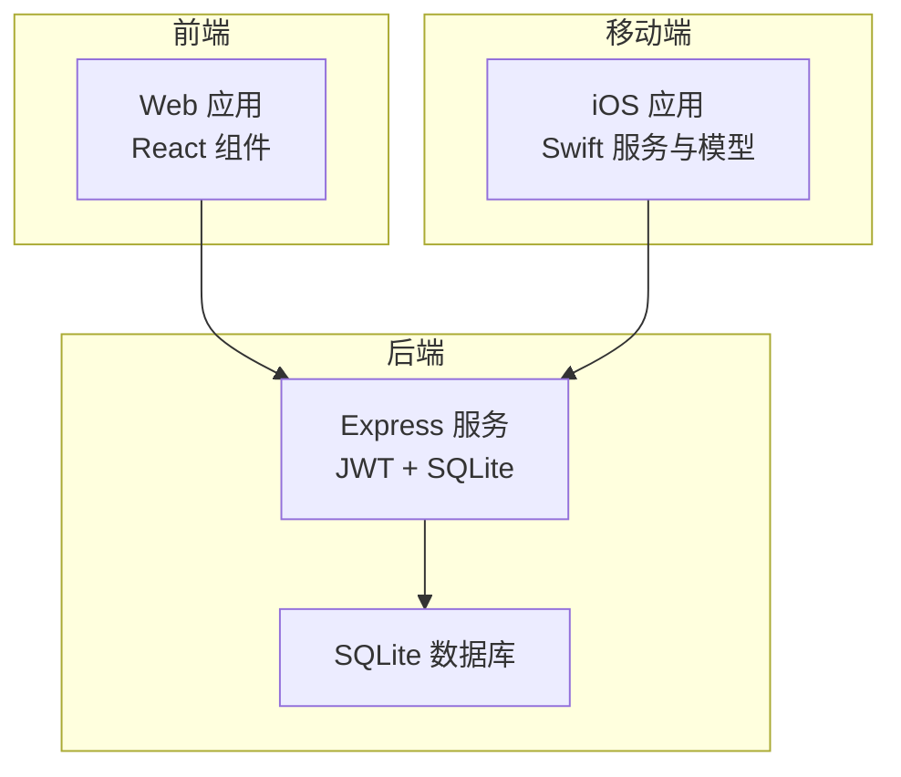
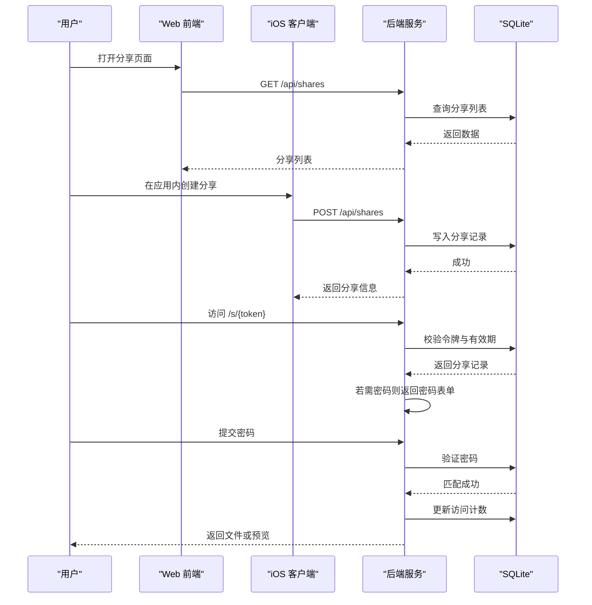
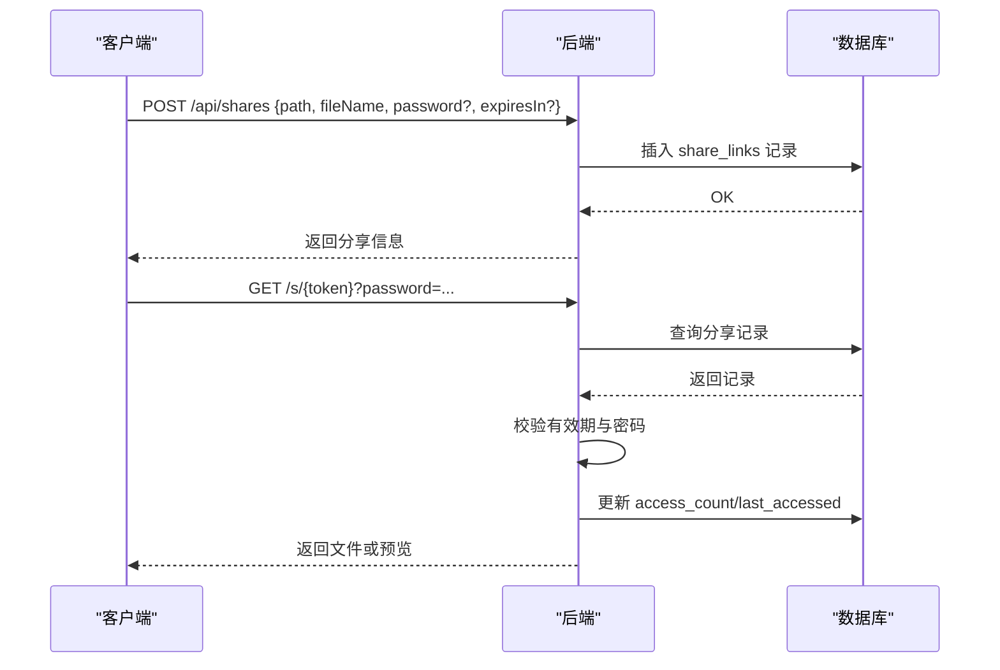
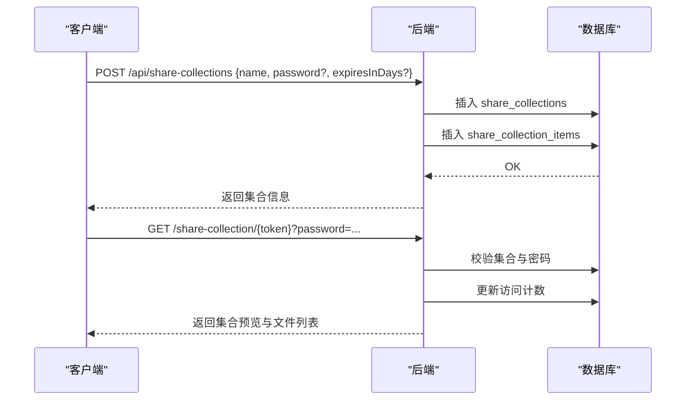
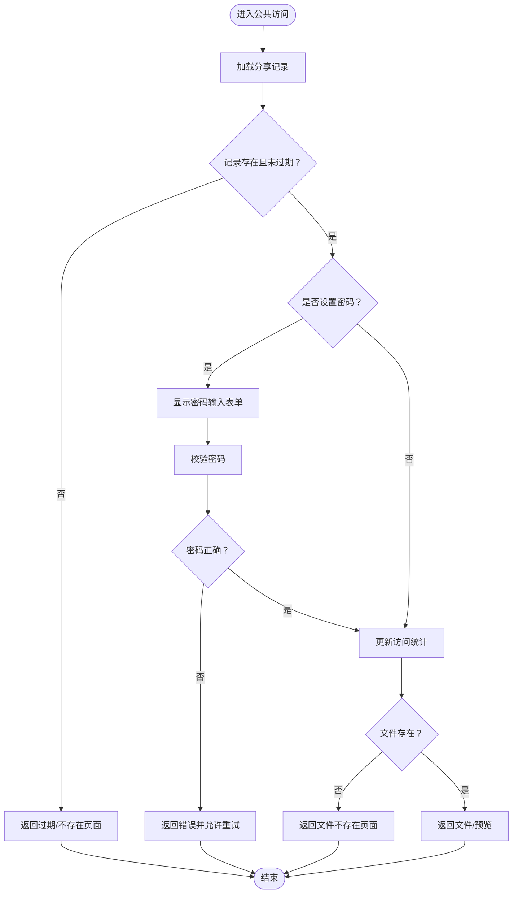
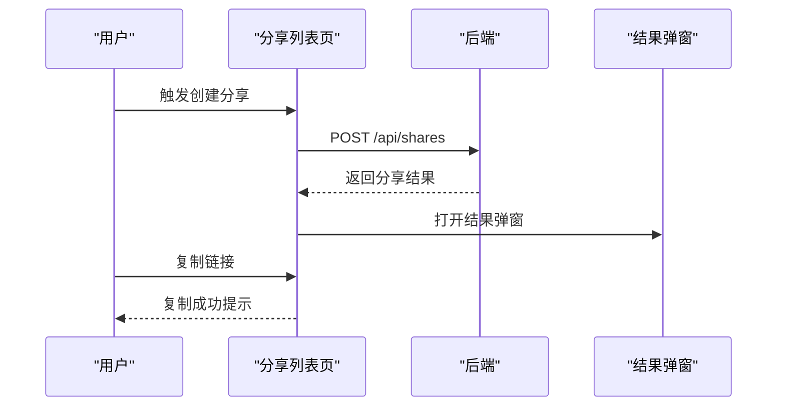
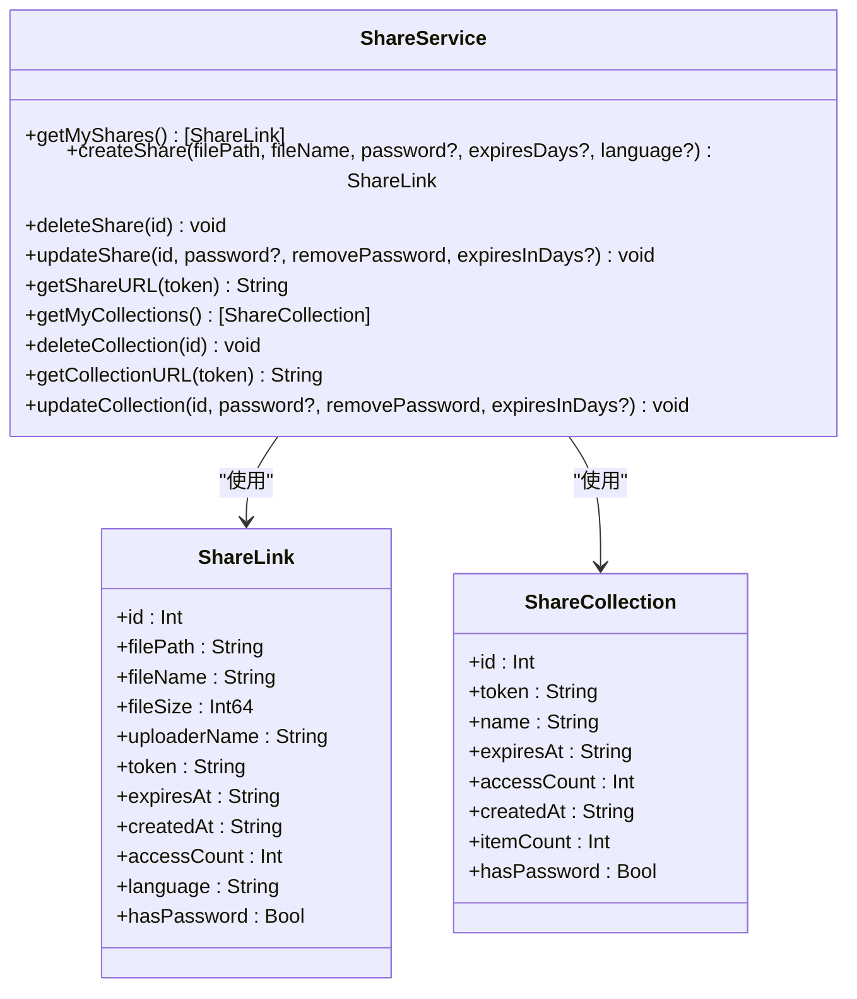
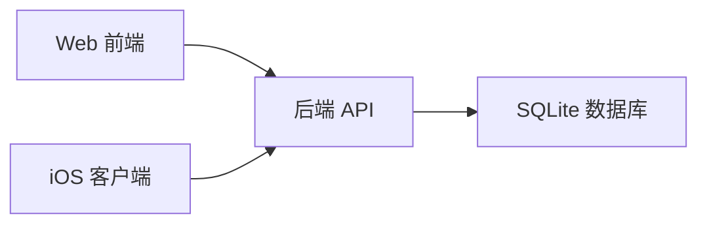

# 分享系统 API

<cite>
**本文引用的文件**
- [server/index.js](file://server/index.js)
- [server/migrations/phase2.sql](file://server/migrations/phase2.sql)
- [server/migrations/add_share_collections.sql](file://server/migrations/add_share_collections.sql)
- [client/src/components/SharesPage.tsx](file://client/src/components/SharesPage.tsx)
- [client/src/components/ShareResultModal.tsx](file://client/src/components/ShareResultModal.tsx)
- [ios/LonghornApp/Services/ShareService.swift](file://ios/LonghornApp/Services/ShareService.swift)
- [ios/LonghornApp/Models/ShareLink.swift](file://ios/LonghornApp/Models/ShareLink.swift)
</cite>

## 目录
1. [简介](#简介)
2. [项目结构](#项目结构)
3. [核心组件](#核心组件)
4. [架构总览](#架构总览)
5. [详细组件分析](#详细组件分析)
6. [依赖关系分析](#依赖关系分析)
7. [性能考量](#性能考量)
8. [故障排查指南](#故障排查指南)
9. [结论](#结论)
10. [附录](#附录)

## 简介
本文件为“分享系统 API”的完整技术文档，覆盖以下能力与范围：
- 分享链接生成与管理：单文件分享、密码保护、有效期控制、访问统计
- 分享集合管理：批量分享集合的创建、更新、删除与访问统计
- 公共访问流程：公开页面渲染、密码校验、访问计数与文件下载
- 生命周期管理：创建、到期、删除与访问统计
- 安全机制：JWT 认证、路径权限校验、密码哈希存储
- 国际化支持：分享页面多语言文案
- 前端与移动端集成：Web 端分享页、结果弹窗、iOS 端分享服务与模型

## 项目结构
分享系统由三部分组成：
- 后端（Node.js + SQLite）：提供认证、权限校验、分享与集合的 CRUD、公共访问与统计
- 前端（React）：展示分享列表、集合列表、复制链接、批量删除、详情预览
- 移动端（Swift）：iOS 端通过服务封装调用后端 API，管理分享与集合

图表来源
- [server/index.js](file://server/index.js#L1-L80)
- [client/src/components/SharesPage.tsx](file://client/src/components/SharesPage.tsx#L1-L658)
- [ios/LonghornApp/Services/ShareService.swift](file://ios/LonghornApp/Services/ShareService.swift#L1-L86)

章节来源
- [server/index.js](file://server/index.js#L1-L80)
- [client/src/components/SharesPage.tsx](file://client/src/components/SharesPage.tsx#L1-L658)
- [ios/LonghornApp/Services/ShareService.swift](file://ios/LonghornApp/Services/ShareService.swift#L1-L86)

## 核心组件
- 分享链接表（share_links）：存储单文件分享的令牌、密码、有效期、访问统计等
- 分享集合表（share_collections）：存储批量分享集合的令牌、名称、密码、有效期、访问统计等
- 集合项表（share_collection_items）：记录集合中包含的文件路径与类型
- 路由与控制器：
  - 用户认证与权限校验中间件
  - 分享与集合的增删改查
  - 公共访问页面与密码校验
  - 访问统计更新
- 前端组件：分享列表页、结果弹窗
- iOS 服务与模型：封装分享与集合的 API 调用与数据模型

章节来源
- [server/migrations/phase2.sql](file://server/migrations/phase2.sql#L13-L25)
- [server/migrations/add_share_collections.sql](file://server/migrations/add_share_collections.sql#L4-L29)
- [server/index.js](file://server/index.js#L267-L295)
- [client/src/components/SharesPage.tsx](file://client/src/components/SharesPage.tsx#L11-L49)
- [ios/LonghornApp/Services/ShareService.swift](file://ios/LonghornApp/Services/ShareService.swift#L11-L79)
- [ios/LonghornApp/Models/ShareLink.swift](file://ios/LonghornApp/Models/ShareLink.swift#L11-L135)

## 架构总览
分享系统采用前后端分离架构，后端提供 REST 风格 API，前端与移动端分别消费这些接口。

图表来源
- [server/index.js](file://server/index.js#L1902-L1960)
- [server/index.js](file://server/index.js#L2010-L2132)
- [client/src/components/SharesPage.tsx](file://client/src/components/SharesPage.tsx#L70-L92)
- [ios/LonghornApp/Services/ShareService.swift](file://ios/LonghornApp/Services/ShareService.swift#L18-L39)

## 详细组件分析

### 1) 分享链接管理 API
- 接口定义
  - 创建分享：POST /api/shares
  - 列表查询：GET /api/shares
  - 更新分享：PUT /api/shares/{id}
  - 删除分享：DELETE /api/shares/{id}
- 请求体字段（创建）
  - path：目标文件路径
  - fileName：文件名
  - password：可选，加密存储
  - expiresIn：可选，有效期天数
  - language：可选，用于公共页面国际化
- 响应字段
  - id、user_id、file_path、file_name、file_size、uploader_name、share_token、expires_at、created_at、access_count、has_password
- 安全与权限
  - 需要 JWT 认证
  - 路径权限校验：仅允许对用户所在部门或个人空间内的文件进行分享
- 生命周期
  - 创建时可设置 expires_at
  - 访问计数与最后访问时间自动更新
- 访问控制
  - 公共访问：GET /s/{token}
  - 密码保护：若存在密码，先返回密码表单，提交正确密码后方可访问
  - 文件不存在或已过期返回相应错误页面

图表来源
- [server/index.js](file://server/index.js#L1902-L1960)
- [server/index.js](file://server/index.js#L2010-L2132)
- [server/index.js](file://server/index.js#L2044-L2049)

章节来源
- [server/index.js](file://server/index.js#L1902-L1960)
- [server/index.js](file://server/index.js#L2010-L2132)
- [server/index.js](file://server/index.js#L2044-L2049)
- [server/migrations/phase2.sql](file://server/migrations/phase2.sql#L13-L25)

### 2) 分享集合管理 API
- 接口定义
  - 创建集合：POST /api/share-collections
  - 列表查询：GET /api/my-share-collections
  - 更新集合：PUT /api/share-collection/{id}
  - 删除集合：DELETE /api/share-collection/{id}
- 请求体字段（创建/更新）
  - name：集合名称
  - password：可选，加密存储
  - removePassword：可选，移除密码
  - expiresInDays：可选，有效期天数
- 响应字段
  - id、token、name、expires_at、access_count、created_at、item_count
- 集合项
  - 通过 share_collection_items 关联集合与文件路径
- 公共访问
  - GET /share-collection/{token}
  - 密码保护逻辑同上

图表来源
- [server/index.js](file://server/index.js#L3242-L3258)
- [server/index.js](file://server/index.js#L3260-L3270)
- [server/index.js](file://server/index.js#L3272-L3320)
- [server/migrations/add_share_collections.sql](file://server/migrations/add_share_collections.sql#L4-L29)

章节来源
- [server/index.js](file://server/index.js#L3242-L3258)
- [server/index.js](file://server/index.js#L3260-L3270)
- [server/index.js](file://server/index.js#L3272-L3320)
- [server/migrations/add_share_collections.sql](file://server/migrations/add_share_collections.sql#L4-L29)

### 3) 公共访问与密码校验流程
- 公共入口
  - 单文件：GET /s/{token}
  - 批量集合：GET /share-collection/{token}
- 流程要点
  - 校验令牌是否存在与未过期
  - 若设置密码：返回密码表单；提交正确密码后继续
  - 更新访问计数与最后访问时间
  - 校验目标文件是否存在，否则返回对应错误页面
- 国际化
  - 支持中文、英文、德文、日文的错误提示与按钮文案

图表来源
- [server/index.js](file://server/index.js#L2010-L2132)
- [server/index.js](file://server/index.js#L2113-L2132)

章节来源
- [server/index.js](file://server/index.js#L2010-L2132)
- [server/index.js](file://server/index.js#L2113-L2132)

### 4) 前端集成与交互
- 分享列表页（React）
  - 加载分享与集合列表
  - 复制分享链接（/s/{token} 或 /share-collection/{token}）
  - 批量删除分享与集合
  - 详情弹窗：展示访问次数、过期时间、最后访问、密码保护状态，并支持复制链接与删除
- 结果弹窗（React）
  - 展示新创建的分享链接与有效期信息，支持一键复制

图表来源
- [client/src/components/SharesPage.tsx](file://client/src/components/SharesPage.tsx#L70-L92)
- [client/src/components/ShareResultModal.tsx](file://client/src/components/ShareResultModal.tsx#L1-L40)

章节来源
- [client/src/components/SharesPage.tsx](file://client/src/components/SharesPage.tsx#L1-L658)
- [client/src/components/ShareResultModal.tsx](file://client/src/components/ShareResultModal.tsx#L1-L40)

### 5) iOS 集成与模型
- 服务封装
  - 获取我的分享列表：GET /api/shares
  - 创建分享：POST /api/shares
  - 删除分享：DELETE /api/shares/{id}
  - 更新分享：PUT /api/shares/{id}
  - 获取我的分享集合：GET /api/my-share-collections
  - 删除分享集合：DELETE /api/share-collection/{id}
  - 更新分享集合：PUT /api/share-collection/{id}
- 数据模型
  - ShareLink：id、filePath、fileName、fileSize、uploaderName、token、expiresAt、createdAt、accessCount、language、hasPassword
  - ShareCollection：id、token、name、expiresAt、accessCount、createdAt、itemCount、hasPassword
  - CreateShareRequest：path、fileName、password、expiresIn、language

图表来源
- [ios/LonghornApp/Services/ShareService.swift](file://ios/LonghornApp/Services/ShareService.swift#L11-L79)
- [ios/LonghornApp/Models/ShareLink.swift](file://ios/LonghornApp/Models/ShareLink.swift#L11-L135)

章节来源
- [ios/LonghornApp/Services/ShareService.swift](file://ios/LonghornApp/Services/ShareService.swift#L1-L86)
- [ios/LonghornApp/Models/ShareLink.swift](file://ios/LonghornApp/Models/ShareLink.swift#L1-L137)

## 依赖关系分析
- 组件耦合
  - 前端与后端通过 REST API 通信，无直接模块耦合
  - iOS 通过服务层封装 API，避免直接依赖网络实现
- 外部依赖
  - 后端：Express、better-sqlite3、bcrypt、multer、sharp、archiver
  - 前端：axios、lucide-react、date-fns
  - iOS：Foundation（网络与序列化）
- 数据一致性
  - 分享与集合均通过外键关联用户，访问统计在公共访问时原子性更新

图表来源
- [server/index.js](file://server/index.js#L1-L80)
- [client/src/components/SharesPage.tsx](file://client/src/components/SharesPage.tsx#L1-L658)
- [ios/LonghornApp/Services/ShareService.swift](file://ios/LonghornApp/Services/ShareService.swift#L1-L86)

章节来源
- [server/index.js](file://server/index.js#L1-L80)
- [client/src/components/SharesPage.tsx](file://client/src/components/SharesPage.tsx#L1-L658)
- [ios/LonghornApp/Services/ShareService.swift](file://ios/LonghornApp/Services/ShareService.swift#L1-L86)

## 性能考量
- 缩略图生成与缓存
  - 使用队列限制并发，防止 CPU/IO 过载
  - 缓存生成的 WebP 缩略图，命中缓存直接返回
- 压缩与范围请求
  - 预览静态资源启用 gzip 压缩与 Range 请求，提升移动端体验
- 数据库索引
  - 对分享令牌、用户 ID、集合令牌建立索引，加速查询

章节来源
- [server/index.js](file://server/index.js#L481-L679)
- [server/index.js](file://server/index.js#L30-L31)
- [server/migrations/phase2.sql](file://server/migrations/phase2.sql#L27-L31)
- [server/migrations/add_share_collections.sql](file://server/migrations/add_share_collections.sql#L18-L29)

## 故障排查指南
- 公共访问返回“链接不存在/已过期”
  - 检查令牌是否存在与是否过期
  - 确认分享记录的 expires_at 字段
- 密码保护无法访问
  - 确认前端传递的密码参数是否正确
  - 后端会比对哈希后的密码
- 文件不存在
  - 检查源文件是否仍存在于磁盘路径
- 权限不足
  - 确认用户角色与部门路径权限
  - 使用 hasPermission 校验逻辑进行定位

章节来源
- [server/index.js](file://server/index.js#L2010-L2132)
- [server/index.js](file://server/index.js#L2044-L2049)
- [server/index.js](file://server/index.js#L297-L353)

## 结论
本分享系统以简洁的 API 设计实现了从创建到访问的完整闭环，具备密码保护、有效期控制、访问统计与国际化支持。前后端与移动端通过统一的数据模型与接口协作，满足企业内部文件分享与批量分发场景的需求。

## 附录

### A. API 端点一览
- 分享链接
  - POST /api/shares：创建分享
  - GET /api/shares：获取分享列表
  - PUT /api/shares/{id}：更新分享
  - DELETE /api/shares/{id}：删除分享
  - GET /s/{token}：公共访问（含密码校验）
- 分享集合
  - POST /api/share-collections：创建集合
  - GET /api/my-share-collections：获取我的集合
  - PUT /api/share-collection/{id}：更新集合
  - DELETE /api/share-collection/{id}：删除集合
  - GET /share-collection/{token}：公共访问（含密码校验）

章节来源
- [server/index.js](file://server/index.js#L1902-L1960)
- [server/index.js](file://server/index.js#L3242-L3258)
- [server/index.js](file://server/index.js#L3260-L3270)
- [server/index.js](file://server/index.js#L2010-L2132)
- [server/index.js](file://server/index.js#L3272-L3320)

### B. 数据模型与字段说明
- 分享链接（share_links）
  - user_id、file_path、share_token、password、expires_at、access_count、last_accessed、created_at
- 分享集合（share_collections）
  - user_id、token、name、password、expires_at、access_count、last_accessed、created_at
- 集合项（share_collection_items）
  - collection_id、file_path、is_directory、added_at

章节来源
- [server/migrations/phase2.sql](file://server/migrations/phase2.sql#L13-L25)
- [server/migrations/add_share_collections.sql](file://server/migrations/add_share_collections.sql#L4-L29)