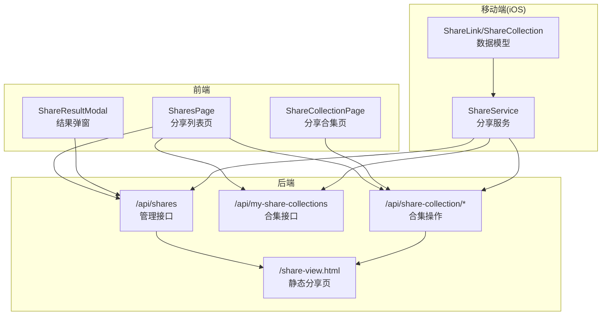
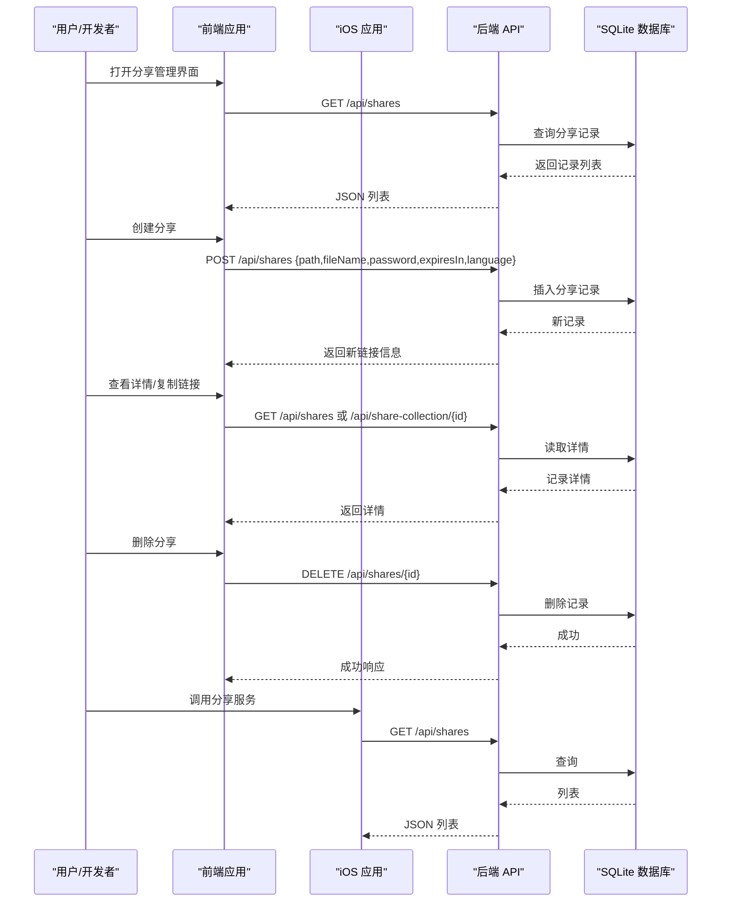
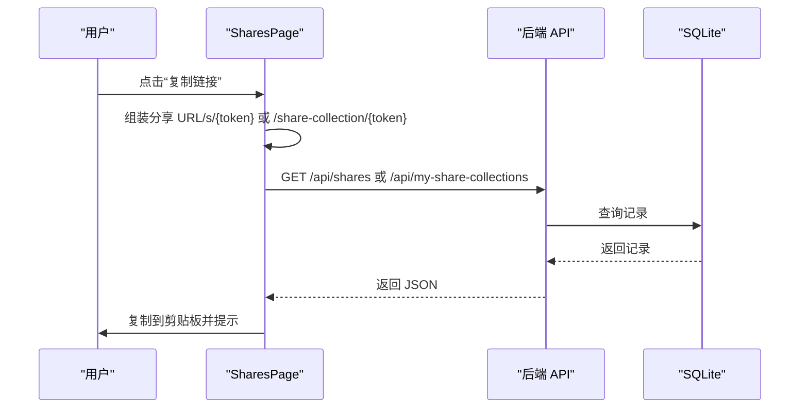
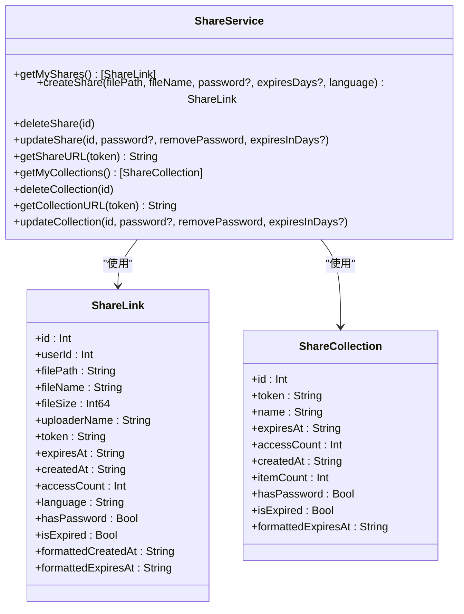
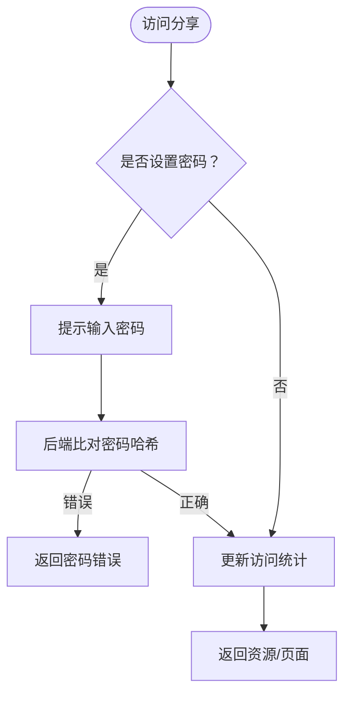
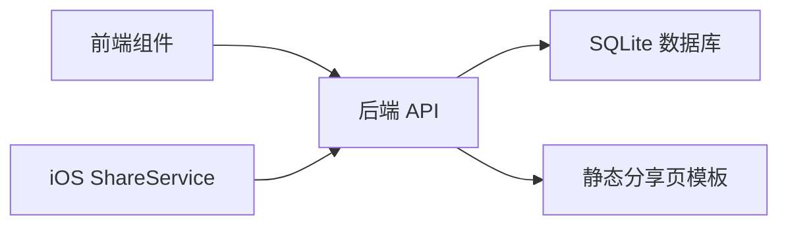

# 分享链接管理

<cite>
**本文档引用的文件**
- [server/index.js](file://server/index.js)
- [server/migrations/add_share_collections.sql](file://server/migrations/add_share_collections.sql)
- [server/public/share-view.html](file://server/public/share-view.html)
- [client/src/components/SharesPage.tsx](file://client/src/components/SharesPage.tsx)
- [client/src/components/ShareCollectionPage.tsx](file://client/src/components/ShareCollectionPage.tsx)
- [client/src/components/ShareResultModal.tsx](file://client/src/components/ShareResultModal.tsx)
- [ios/LonghornApp/Services/ShareService.swift](file://ios/LonghornApp/Services/ShareService.swift)
- [ios/LonghornApp/Models/ShareLink.swift](file://ios/LonghornApp/Models/ShareLink.swift)
</cite>

## 目录
1. [简介](#简介)
2. [项目结构](#项目结构)
3. [核心组件](#核心组件)
4. [架构总览](#架构总览)
5. [详细组件分析](#详细组件分析)
6. [依赖关系分析](#依赖关系分析)
7. [性能考虑](#性能考虑)
8. [故障排除指南](#故障排除指南)
9. [结论](#结论)
10. [附录](#附录)

## 简介
本文件系统性地记录了“分享链接管理”API与相关前端/移动端组件的实现与使用方法。内容涵盖：
- 分享链接的创建、更新、删除与查询接口
- 分享链接的数据结构（字段定义、状态管理）
- 权限验证与密码保护机制
- 过期处理与访问统计
- 前端分享页面组件与移动端集成示例

## 项目结构
分享链接功能由三部分组成：
- 后端服务：提供 REST API、数据库表结构与静态页面模板
- 前端应用：管理分享列表、展示详情、密码输入与复制链接
- 移动端应用：通过服务层调用后端 API 并解析数据模型



图表来源
- [server/index.js](file://server/index.js#L1707-L2008)
- [server/public/share-view.html](file://server/public/share-view.html#L357-L481)
- [client/src/components/SharesPage.tsx](file://client/src/components/SharesPage.tsx#L70-L92)
- [client/src/components/ShareCollectionPage.tsx](file://client/src/components/ShareCollectionPage.tsx#L42-L65)
- [ios/LonghornApp/Services/ShareService.swift](file://ios/LonghornApp/Services/ShareService.swift#L18-L78)

章节来源
- [server/index.js](file://server/index.js#L1707-L2008)
- [server/public/share-view.html](file://server/public/share-view.html#L357-L481)
- [client/src/components/SharesPage.tsx](file://client/src/components/SharesPage.tsx#L51-L92)
- [client/src/components/ShareCollectionPage.tsx](file://client/src/components/ShareCollectionPage.tsx#L31-L65)
- [ios/LonghornApp/Services/ShareService.swift](file://ios/LonghornApp/Services/ShareService.swift#L18-L78)

## 核心组件
- 后端 API
  - 分享链接管理：GET/POST/PUT/DELETE /api/shares
  - 分享合集管理：GET /api/my-share-collections；DELETE /api/share-collection/{id}
  - 合集访问：GET /api/share-collection/{token}；GET /api/share-collection/{token}/download
  - 公共分享访问：GET /share/{token}（含密码校验）
- 前端组件
  - 分享列表页：展示、复制、删除、批量删除、详情查看
  - 分享合集页：密码输入、列表渲染、下载全部
  - 结果弹窗：显示生成链接、可选密码与有效期
- 移动端服务
  - ShareService：封装分享与合集的增删改查与 URL 生成
  - 数据模型：ShareLink、ShareCollection 及其格式化属性

章节来源
- [server/index.js](file://server/index.js#L1707-L2008)
- [client/src/components/SharesPage.tsx](file://client/src/components/SharesPage.tsx#L51-L92)
- [client/src/components/ShareCollectionPage.tsx](file://client/src/components/ShareCollectionPage.tsx#L31-L65)
- [ios/LonghornApp/Services/ShareService.swift](file://ios/LonghornApp/Services/ShareService.swift#L18-L78)

## 架构总览
分享链接的生命周期从“创建”开始，经过“查询/更新/删除”，最终在“访问”阶段进行权限校验与统计。



图表来源
- [server/index.js](file://server/index.js#L1707-L2008)
- [client/src/components/SharesPage.tsx](file://client/src/components/SharesPage.tsx#L70-L92)
- [ios/LonghornApp/Services/ShareService.swift](file://ios/LonghornApp/Services/ShareService.swift#L18-L21)

## 详细组件分析

### 后端 API 设计与实现
- 认证中间件
  - 所有分享相关 API 均需携带 Bearer Token，后端通过 JWT 验证用户身份
- 分享链接管理
  - GET /api/shares：返回当前用户的分享列表，包含文件路径、分享令牌、过期时间、访问次数、创建时间、是否设密码等
  - POST /api/shares：创建新的分享链接，支持设置密码与有效期（以天为单位），语言参数用于前端展示
  - PUT /api/shares/{id}：更新现有分享，支持修改密码（或移除密码）、调整有效期
  - DELETE /api/shares/{id}：删除指定分享
- 分享合集管理
  - GET /api/my-share-collections：返回当前用户的分享合集列表
  - DELETE /api/share-collection/{id}：删除指定合集
  - GET /api/share-collection/{token}：访问分享合集，若需要密码则返回提示
  - GET /api/share-collection/{token}/download：下载合集为 ZIP，支持带密码参数
- 公共分享访问
  - GET /share/{token}：公开访问入口，若受保护则返回密码表单；成功后更新访问统计

```mermaid
flowchart TD
Start(["请求进入"]) --> Route{"路由匹配"}
Route --> |/api/shares| SharesAPI["分享管理 API"]
Route --> |/api/my-share-collections| CollectionsAPI["合集列表 API"]
Route --> |/api/share-collection/*| CollectionOps["合集操作 API"]
Route --> |/share/{token}| PublicShare["公共分享访问"]
SharesAPI --> Auth["JWT 认证"]
CollectionsAPI --> Auth
CollectionOps --> Auth
PublicShare --> CheckPwd{"是否需要密码？"}
CheckPwd --> |是| ShowForm["返回密码表单"]
CheckPwd --> |否| UpdateStat["更新访问统计"]
UpdateStat --> ServeFile["返回文件/目录内容"]
Auth --> ExecDB["执行数据库操作"]
ExecDB --> Resp["返回 JSON 响应"]
```

图表来源
- [server/index.js](file://server/index.js#L1707-L2008)
- [server/index.js](file://server/index.js#L2010-L2132)

章节来源
- [server/index.js](file://server/index.js#L1707-L2008)
- [server/index.js](file://server/index.js#L2010-L2132)

### 数据模型与字段定义
- 分享链接（ShareLink）
  - 字段：id、user_id、file_path、file_name、file_size、uploader_name、share_token、expires_at、created_at、access_count、language、has_password
  - 状态：是否过期（基于 expires_at 与当前时间比较）
  - 统计：access_count、last_accessed
- 分享合集（ShareCollection）
  - 字段：id、token、name、expires_at、access_count、created_at、item_count、has_password
  - 状态：是否过期（基于 expires_at 与当前时间比较）

章节来源
- [ios/LonghornApp/Models/ShareLink.swift](file://ios/LonghornApp/Models/ShareLink.swift#L10-L73)
- [ios/LonghornApp/Models/ShareLink.swift](file://ios/LonghornApp/Models/ShareLink.swift#L92-L135)

### 前端组件与交互
- 分享列表页（SharesPage）
  - 功能：拉取分享与合集列表、复制链接、删除、批量删除、详情查看、过期状态高亮
  - 接口：/api/shares、/api/my-share-collections、/api/shares/{id}、/api/share-collection/{id}
- 分享合集页（ShareCollectionPage）
  - 功能：密码输入、加载合集详情、下载全部、语言切换
  - 接口：/api/share-collection/{token}、/api/share-collection/{token}/download
- 结果弹窗（ShareResultModal）
  - 功能：展示生成链接、可选密码与有效期，并支持一键复制



图表来源
- [client/src/components/SharesPage.tsx](file://client/src/components/SharesPage.tsx#L94-L150)
- [client/src/components/ShareCollectionPage.tsx](file://client/src/components/ShareCollectionPage.tsx#L84-L87)

章节来源
- [client/src/components/SharesPage.tsx](file://client/src/components/SharesPage.tsx#L51-L92)
- [client/src/components/ShareCollectionPage.tsx](file://client/src/components/ShareCollectionPage.tsx#L31-L65)
- [client/src/components/ShareResultModal.tsx](file://client/src/components/ShareResultModal.tsx#L15-L146)

### 移动端集成示例（iOS）
- ShareService
  - 提供获取分享列表、创建分享、删除分享、更新分享、获取分享 URL 等方法
  - 提供获取分享合集列表、删除合集、更新合集设置、获取合集 URL 等方法
- 数据模型
  - ShareLink：包含 id、user_id、file_path、file_name、file_size、uploader_name、token、expiresAt、createdAt、accessCount、language、hasPassword
  - ShareCollection：包含 id、token、name、expiresAt、accessCount、createdAt、itemCount、hasPassword



图表来源
- [ios/LonghornApp/Services/ShareService.swift](file://ios/LonghornApp/Services/ShareService.swift#L11-L79)
- [ios/LonghornApp/Models/ShareLink.swift](file://ios/LonghornApp/Models/ShareLink.swift#L10-L73)
- [ios/LonghornApp/Models/ShareLink.swift](file://ios/LonghornApp/Models/ShareLink.swift#L92-L135)

章节来源
- [ios/LonghornApp/Services/ShareService.swift](file://ios/LonghornApp/Services/ShareService.swift#L18-L78)
- [ios/LonghornApp/Models/ShareLink.swift](file://ios/LonghornApp/Models/ShareLink.swift#L10-L73)

### 权限验证与密码保护机制
- 认证流程
  - 所有管理类 API 需要 Bearer Token；后端通过 JWT 解析用户身份
- 密码保护
  - 若分享链接设置了密码，访问时需提供正确密码；后端使用哈希比对
  - 前端在访问合集时，若返回需要密码，则弹出输入框并重新请求
- 过期处理
  - 访问时检查 expires_at；若已过期返回相应错误页面或状态码
- 访问统计
  - 每次成功访问均更新 access_count 与 last_accessed



图表来源
- [server/index.js](file://server/index.js#L2068-L2132)
- [client/src/components/ShareCollectionPage.tsx](file://client/src/components/ShareCollectionPage.tsx#L56-L74)

章节来源
- [server/index.js](file://server/index.js#L2068-L2132)
- [client/src/components/ShareCollectionPage.tsx](file://client/src/components/ShareCollectionPage.tsx#L56-L74)

### 数据库结构与迁移
- 分享合集迁移脚本
  - share_collections 表：存储合集基本信息（token、name、password、expires_at、access_count、last_accessed、created_at）
  - share_collection_items 表：存储合集内的文件/目录项
  - 索引：按 token 与 user_id 建立索引以提升查询性能

章节来源
- [server/migrations/add_share_collections.sql](file://server/migrations/add_share_collections.sql#L4-L31)

## 依赖关系分析
- 前端依赖后端 API 提供的数据结构与接口契约
- 移动端通过 ShareService 封装 API 调用，避免直接处理网络细节
- 后端依赖 SQLite 存储分享元数据，静态页面模板用于公共分享访问



图表来源
- [server/index.js](file://server/index.js#L1707-L2008)
- [server/public/share-view.html](file://server/public/share-view.html#L357-L481)
- [ios/LonghornApp/Services/ShareService.swift](file://ios/LonghornApp/Services/ShareService.swift#L18-L78)

章节来源
- [server/index.js](file://server/index.js#L1707-L2008)
- [server/public/share-view.html](file://server/public/share-view.html#L357-L481)
- [ios/LonghornApp/Services/ShareService.swift](file://ios/LonghornApp/Services/ShareService.swift#L18-L78)

## 性能考虑
- 数据库索引
  - 对 share_collections(token)、share_collections(user_id)、share_collection_items(collection_id) 建立索引，减少查询延迟
- 缓存与压缩
  - 后端启用压缩中间件，降低传输体积
- 文件访问
  - 直接下载文件而非二次处理，避免额外 CPU 开销
- 前端渲染
  - 使用虚拟滚动与懒加载优化长列表渲染

## 故障排除指南
- 无法访问分享链接
  - 检查链接是否过期（expires_at）
  - 若提示需要密码，确认是否提供了正确的密码
- 复制链接失败
  - 前端采用同步方式写入剪贴板，部分浏览器可能限制；建议手动复制或更换浏览器
- 删除失败
  - 确认用户已登录且拥有对应权限；检查网络请求状态码
- 合集下载异常
  - 确认密码正确且已传入 password 参数；检查后端日志定位具体错误

章节来源
- [client/src/components/SharesPage.tsx](file://client/src/components/SharesPage.tsx#L94-L150)
- [client/src/components/ShareCollectionPage.tsx](file://client/src/components/ShareCollectionPage.tsx#L84-L87)
- [server/index.js](file://server/index.js#L2068-L2132)

## 结论
本系统通过前后端协同实现了完整的分享链接生命周期管理：从创建、更新、删除到查询与访问统计，覆盖了密码保护、过期控制与多平台集成需求。建议在生产环境中进一步完善：
- 增加访问日志审计
- 引入 CDN 与缓存策略
- 完善目录分享能力与并发下载优化

## 附录

### API 规范概览
- 分享链接管理
  - GET /api/shares：返回当前用户的所有分享链接
  - POST /api/shares：创建分享链接（支持密码与有效期）
  - PUT /api/shares/{id}：更新分享设置（密码/有效期）
  - DELETE /api/shares/{id}：删除分享
- 分享合集管理
  - GET /api/my-share-collections：返回当前用户的分享合集
  - DELETE /api/share-collection/{id}：删除合集
  - GET /api/share-collection/{token}：访问合集详情（可带密码）
  - GET /api/share-collection/{token}/download：下载合集 ZIP（可带密码）
- 公共分享访问
  - GET /share/{token}：公开访问入口（含密码表单与资源返回）

章节来源
- [server/index.js](file://server/index.js#L1707-L2008)
- [server/index.js](file://server/index.js#L2010-L2132)