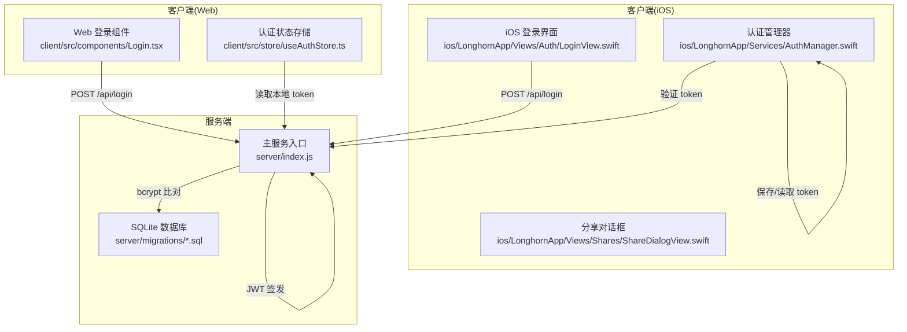
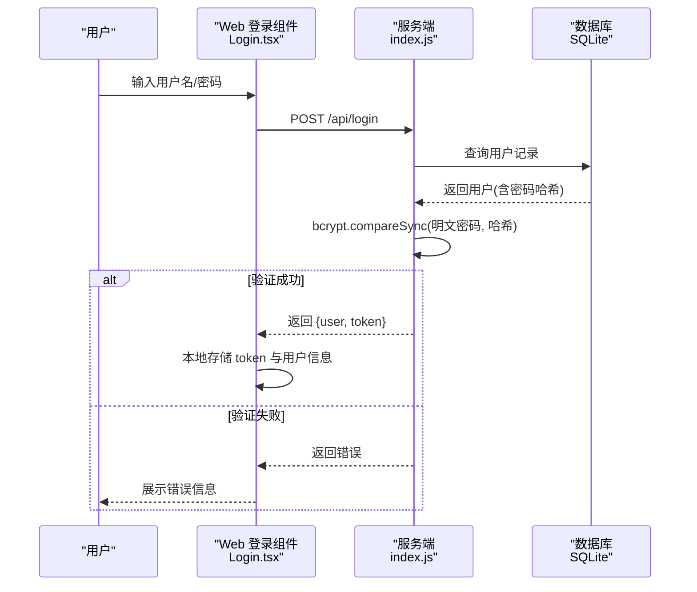
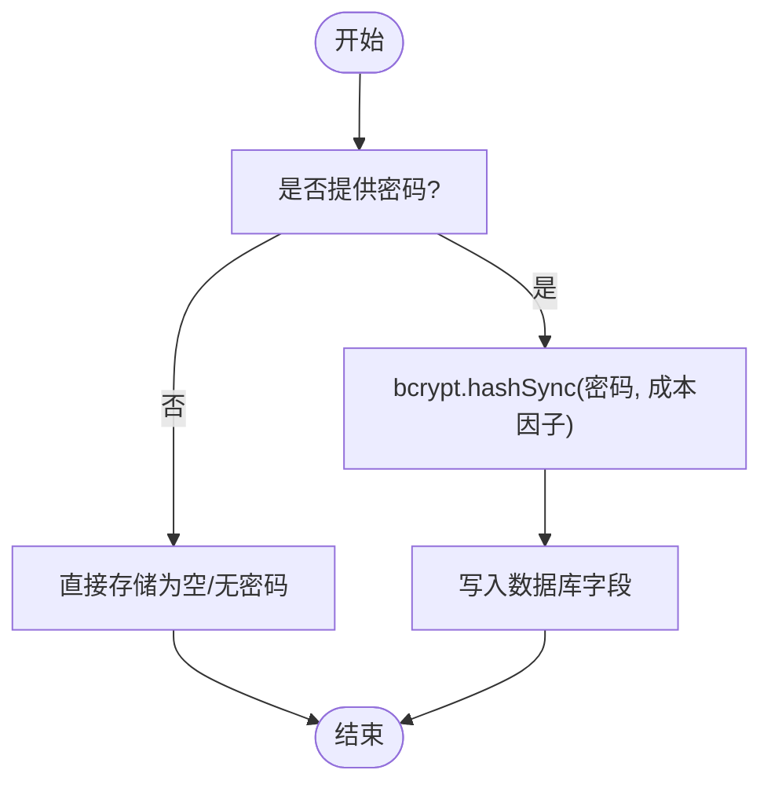
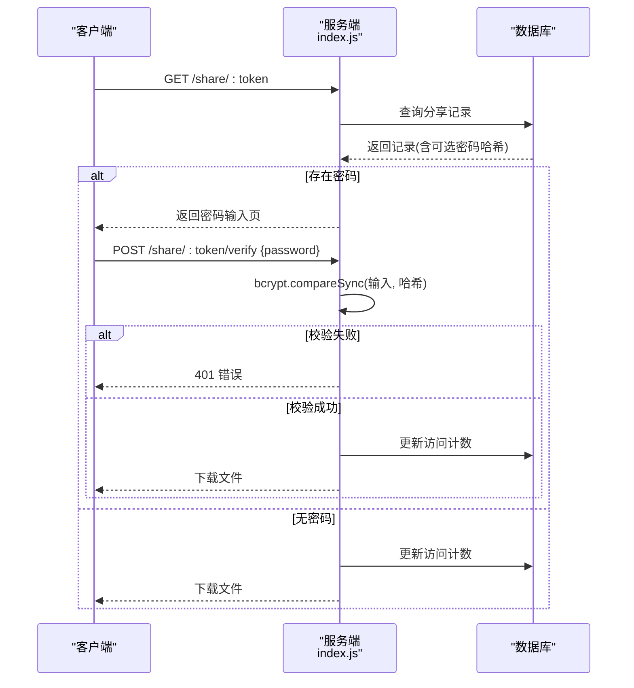
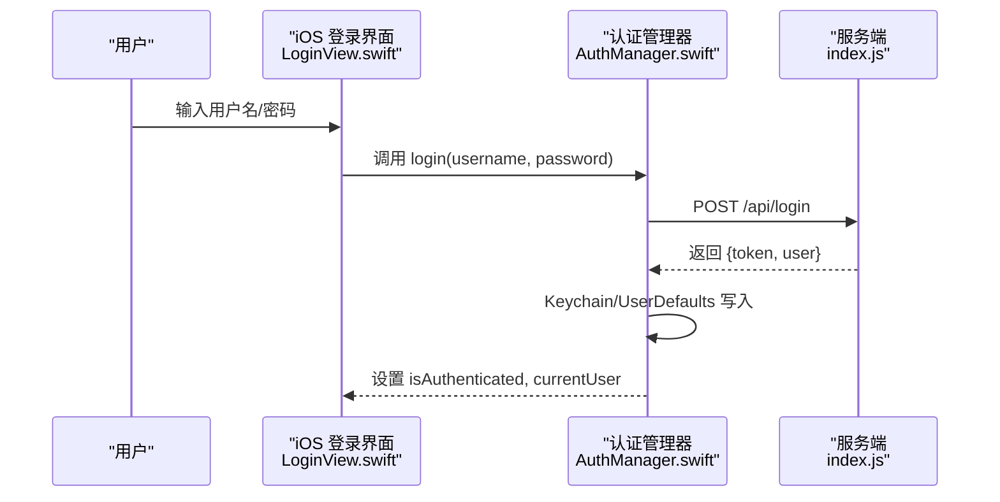
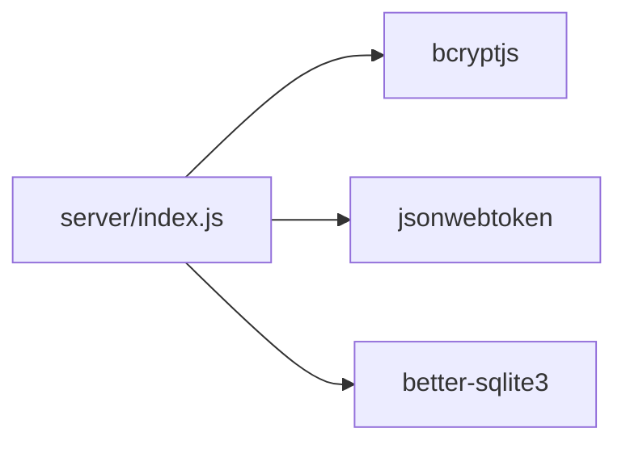

# 密码保护机制

<cite>
**本文引用的文件**
- [server/index.js](file://server/index.js)
- [server/migrations/phase2.sql](file://server/migrations/phase2.sql)
- [server/migrations/add_share_collections.sql](file://server/migrations/add_share_collections.sql)
- [client/src/components/Login.tsx](file://client/src/components/Login.tsx)
- [client/src/store/useAuthStore.ts](file://client/src/store/useAuthStore.ts)
- [ios/LonghornApp/Services/AuthManager.swift](file://ios/LonghornApp/Services/AuthManager.swift)
- [ios/LonghornApp/Views/Auth/LoginView.swift](file://ios/LonghornApp/Views/Auth/LoginView.swift)
- [ios/LonghornApp/Views/Shares/ShareDialogView.swift](file://ios/LonghornApp/Views/Shares/ShareDialogView.swift)
- [client/src/components/ShareResultModal.tsx](file://client/src/components/ShareResultModal.tsx)
- [client/src/components/ShareCollectionPage.tsx](file://client/src/components/ShareCollectionPage.tsx)
- [server/public/share-view.html](file://server/public/share-view.html)
- [client/src/components/UserManagement.tsx](file://client/src/components/UserManagement.tsx)
</cite>

## 目录
1. [简介](#简介)
2. [项目结构](#项目结构)
3. [核心组件](#核心组件)
4. [架构总览](#架构总览)
5. [详细组件分析](#详细组件分析)
6. [依赖关系分析](#依赖关系分析)
7. [性能考量](#性能考量)
8. [故障排查指南](#故障排查指南)
9. [结论](#结论)
10. [附录](#附录)

## 简介
本文件系统性记录长桥（Longhorn）项目的密码保护机制，覆盖以下方面：
- 分享链接密码的加密存储与盐值管理（基于 bcrypt）
- 密码验证流程（从前端输入到后端比对）
- 密码修改、重置与“忘记密码”的处理机制
- 密码强度要求、安全策略与防暴力破解措施
- 前端密码输入组件与移动端密码验证界面的实现要点与用户体验优化

## 项目结构
本项目采用前后端分离架构，密码保护相关逻辑主要分布在：
- 服务端：Express + better-sqlite3 数据库，bcrypt 用于密码哈希，JWT 用于认证令牌
- 客户端（Web）：React + TypeScript，本地持久化 token 与用户信息
- 客户端（iOS）：SwiftUI + Swift，Keychain 存储 token，UserDefaults 缓存用户信息

图表来源
- [server/index.js](file://server/index.js#L684-L694)
- [client/src/components/Login.tsx](file://client/src/components/Login.tsx#L15-L27)
- [client/src/store/useAuthStore.ts](file://client/src/store/useAuthStore.ts#L17-L30)
- [ios/LonghornApp/Services/AuthManager.swift](file://ios/LonghornApp/Services/AuthManager.swift#L44-L69)

章节来源
- [server/index.js](file://server/index.js#L1-L200)
- [server/migrations/phase2.sql](file://server/migrations/phase2.sql#L13-L25)
- [client/src/components/Login.tsx](file://client/src/components/Login.tsx#L1-L161)
- [client/src/store/useAuthStore.ts](file://client/src/store/useAuthStore.ts#L1-L31)
- [ios/LonghornApp/Services/AuthManager.swift](file://ios/LonghornApp/Services/AuthManager.swift#L1-L195)

## 核心组件
- 服务端密码存储与验证
  - 使用 bcrypt 对密码进行哈希存储；比较阶段使用 bcrypt.compareSync 进行同步比对
  - 支持分享链接密码与集合密码的独立存储与校验
- 客户端认证与持久化
  - Web：登录成功后将用户与 token 写入 localStorage，并通过全局状态管理更新
  - iOS：登录成功后将 token 写入 Keychain，用户信息写入 UserDefaults，并在启动时尝试恢复会话
- 分享链接密码验证
  - 服务端在访问分享链接时，若存在密码则渲染密码输入页面或返回错误
  - 用户提交密码后，服务端使用 bcrypt 比对并通过访问计数更新

章节来源
- [server/index.js](file://server/index.js#L684-L694)
- [server/index.js](file://server/index.js#L2011-L2066)
- [server/index.js](file://server/index.js#L2069-L2100)
- [client/src/store/useAuthStore.ts](file://client/src/store/useAuthStore.ts#L17-L30)
- [ios/LonghornApp/Services/AuthManager.swift](file://ios/LonghornApp/Services/AuthManager.swift#L44-L69)

## 架构总览
下图展示了从用户输入密码到服务端验证的关键交互路径。

图表来源
- [client/src/components/Login.tsx](file://client/src/components/Login.tsx#L15-L27)
- [server/index.js](file://server/index.js#L684-L694)

## 详细组件分析

### 服务端密码存储与验证（bcrypt）
- 存储策略
  - 创建分享链接或集合时，若提供密码，则使用 bcrypt.hashSync(password, 10) 生成哈希并存储于 share_links.password 或 share_collections.password 字段
- 验证策略
  - 登录时使用 bcrypt.compareSync(明文密码, 用户记录中的密码哈希) 进行比对
  - 访问分享链接时，若存在密码字段，同样使用 bcrypt.compareSync(用户输入, 数据库中哈希) 校验
- 盐值管理
  - bcrypt.hashSync 的第二参数为成本因子（如 10），内部自动生成盐值并混入哈希结果，无需额外管理盐值

图表来源
- [server/index.js](file://server/index.js#L1977-L1981)
- [server/index.js](file://server/index.js#L3147-L3148)
- [server/index.js](file://server/index.js#L3335-L3336)

章节来源
- [server/index.js](file://server/index.js#L1977-L1981)
- [server/index.js](file://server/index.js#L3147-L3148)
- [server/index.js](file://server/index.js#L3335-L3336)

### 分享链接密码验证流程
- 访问公开分享链接
  - 若分享链接设置了密码，服务端返回带密码输入的页面；用户提交密码后，服务端再次使用 bcrypt.compareSync 校验
  - 校验通过后更新访问计数并返回文件
- 集合分享密码验证
  - 访问集合接口时，若集合设置了密码且未提供查询参数 password，则返回需要密码
  - 提供错误时同样使用 bcrypt.compareSync 校验

图表来源
- [server/index.js](file://server/index.js#L2011-L2066)
- [server/index.js](file://server/index.js#L2069-L2100)
- [server/index.js](file://server/index.js#L2103-L2132)

章节来源
- [server/index.js](file://server/index.js#L2011-L2066)
- [server/index.js](file://server/index.js#L2069-L2100)
- [server/index.js](file://server/index.js#L2103-L2132)

### 客户端认证与持久化
- Web 端
  - 登录成功后，将用户信息与 token 写入 localStorage，并通过全局状态管理更新
  - 后续请求可通过本地 token 与服务端交互
- iOS 端
  - 登录成功后，将 token 写入 Keychain，用户信息写入 UserDefaults
  - 应用启动时尝试恢复会话，并异步验证 token 有效性

图表来源
- [ios/LonghornApp/Views/Auth/LoginView.swift](file://ios/LonghornApp/Views/Auth/LoginView.swift#L277-L281)
- [ios/LonghornApp/Services/AuthManager.swift](file://ios/LonghornApp/Services/AuthManager.swift#L44-L69)

章节来源
- [client/src/store/useAuthStore.ts](file://client/src/store/useAuthStore.ts#L17-L30)
- [ios/LonghornApp/Services/AuthManager.swift](file://ios/LonghornApp/Services/AuthManager.swift#L134-L180)

### 分享密码的前端展示与复制
- Web 端
  - 创建分享后，弹窗展示分享链接与密码（若设置），支持复制密码
- iOS 端
  - 分享对话框中展示密码并提供一键复制到剪贴板的功能

章节来源
- [client/src/components/ShareResultModal.tsx](file://client/src/components/ShareResultModal.tsx#L60-L78)
- [ios/LonghornApp/Views/Shares/ShareDialogView.swift](file://ios/LonghornApp/Views/Shares/ShareDialogView.swift#L206-L218)

### 忘记密码与密码重置
- 当前代码库未发现“忘记密码”邮件发送与重置流程的实现
- 在用户管理界面中存在“重置密码”的输入项，但未见对应后端路由或流程

建议实现思路（概念性，非代码引用）：
- 前端触发“忘记密码”，调用后端发送重置邮件的接口
- 服务端生成一次性重置令牌并发送至邮箱
- 用户点击邮件链接进入重置页，输入新密码并提交
- 服务端验证令牌并更新用户密码（仍使用 bcrypt 哈希）

[本节为概念性说明，不直接分析具体文件，故无章节来源]

## 依赖关系分析
- bcrypt
  - 用于密码哈希与比对，成本因子为 10
- jsonwebtoken
  - 用于签发与验证 JWT 令牌
- better-sqlite3
  - 作为数据库驱动，存储用户与分享记录（含密码哈希）

图表来源
- [server/index.js](file://server/index.js#L9-L9)

章节来源
- [server/index.js](file://server/index.js#L9-L9)

## 性能考量
- bcrypt 成本因子
  - 当前使用成本因子 10，平衡了安全性与性能；若用户量增长，可考虑提升成本因子并配合异步哈希以避免阻塞主线程
- 数据库索引
  - 分享链接与集合表均建立 token 与用户索引，有助于快速定位分享记录
- 压缩与缓存
  - 服务端启用 gzip 压缩，静态资源设置缓存头，有助于降低网络传输与服务器压力

章节来源
- [server/index.js](file://server/index.js#L418-L418)
- [server/migrations/phase2.sql](file://server/migrations/phase2.sql#L27-L31)
- [server/migrations/add_share_collections.sql](file://server/migrations/add_share_collections.sql#L18-L19)

## 故障排查指南
- 登录失败
  - 检查用户名是否存在且密码正确；服务端使用 bcrypt.compareSync 进行比对
  - 查看客户端错误提示与网络请求响应
- 分享链接访问失败
  - 若返回“密码错误”，确认输入的密码与创建时一致；服务端使用 bcrypt.compareSync 校验
  - 若返回“链接不存在/已过期”，确认分享 token 与有效期
- iOS 登录后无法自动恢复会话
  - 检查 Keychain 与 UserDefaults 中的 token 与用户数据是否正确写入
  - 观察启动时的会话恢复与 token 验证流程

章节来源
- [server/index.js](file://server/index.js#L693-L693)
- [server/index.js](file://server/index.js#L2079-L2082)
- [ios/LonghornApp/Services/AuthManager.swift](file://ios/LonghornApp/Services/AuthManager.swift#L94-L123)

## 结论
本项目在密码保护方面采用了成熟的 bcrypt 哈希与 JWT 令牌机制，结合数据库层面的索引优化，实现了分享链接密码的安全存储与验证。前端与移动端分别采用本地存储与 Keychain/UserDefaults 进行会话持久化，整体方案具备较好的安全性与可用性。建议后续补充“忘记密码”与密码重置流程，进一步完善用户账户生命周期管理。

## 附录

### 密码强度要求与安全策略（建议）
- 强度建议
  - 最小长度：8 位；推荐 12 位以上
  - 包含大小写字母、数字与特殊字符
  - 排除常见弱口令与连续/重复字符
- 安全策略
  - 登录失败记录与限流（如 5 分钟内最多 5 次失败即锁定）
  - 密码历史与不可复用策略
  - 定期强制修改密码（如每 90 天）
  - 双因素认证（2FA）可选增强

[本节为通用安全建议，不直接分析具体文件，故无章节来源]

### 前端密码输入组件与移动端密码验证界面实现要点
- Web 端
  - 登录表单使用受控组件收集用户名与密码，提交时禁用按钮防止重复提交
  - 错误信息统一展示，避免泄露过多细节
- iOS 端
  - 登录界面提供显示/隐藏密码切换，SecureField 与 textContentType 优化输入体验
  - 分享密码界面提供一键复制到剪贴板功能，提升易用性

章节来源
- [client/src/components/Login.tsx](file://client/src/components/Login.tsx#L15-L27)
- [ios/LonghornApp/Views/Auth/LoginView.swift](file://ios/LonghornApp/Views/Auth/LoginView.swift#L173-L214)
- [ios/LonghornApp/Views/Shares/ShareDialogView.swift](file://ios/LonghornApp/Views/Shares/ShareDialogView.swift#L206-L218)