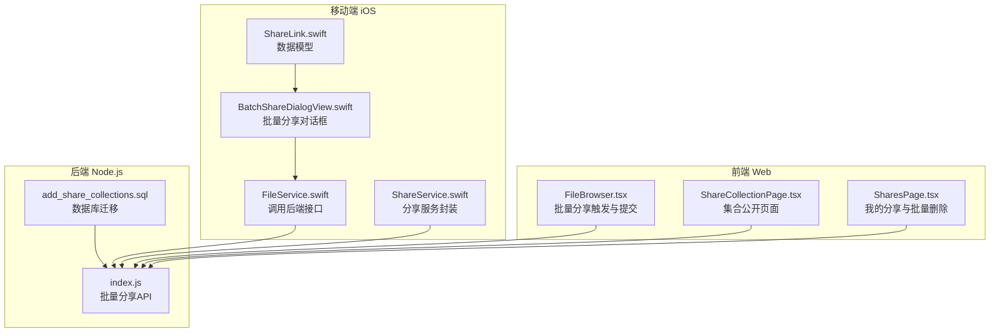
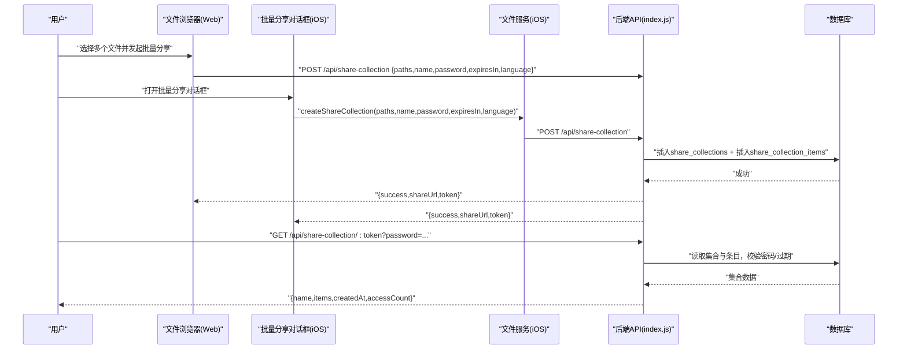
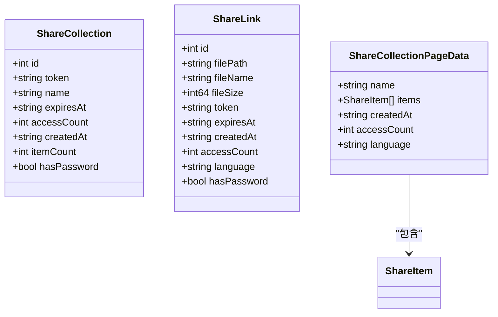
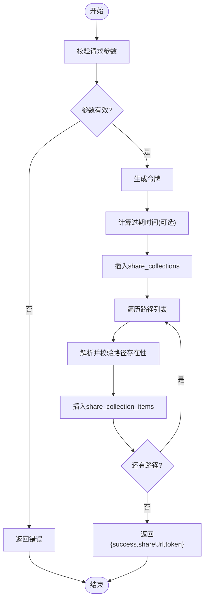
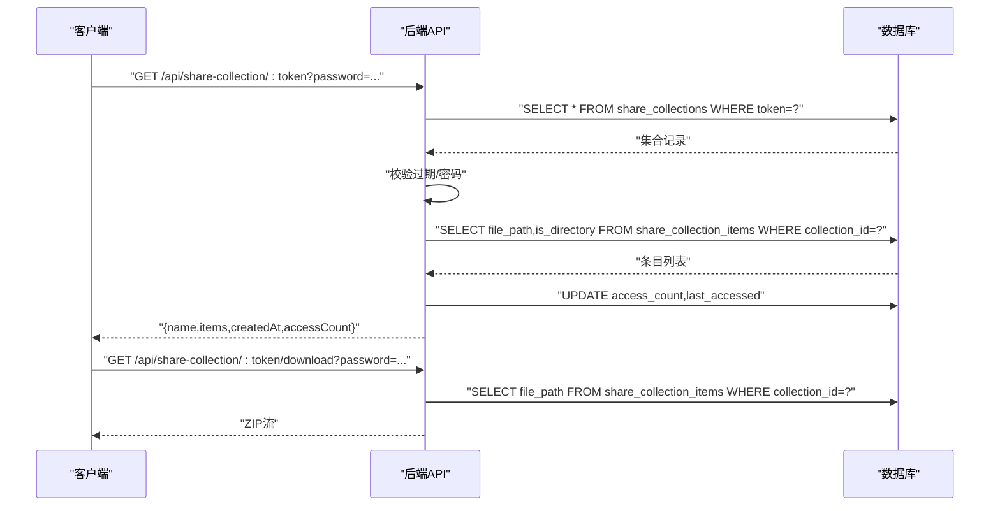
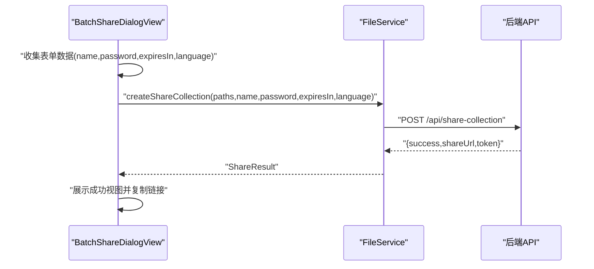
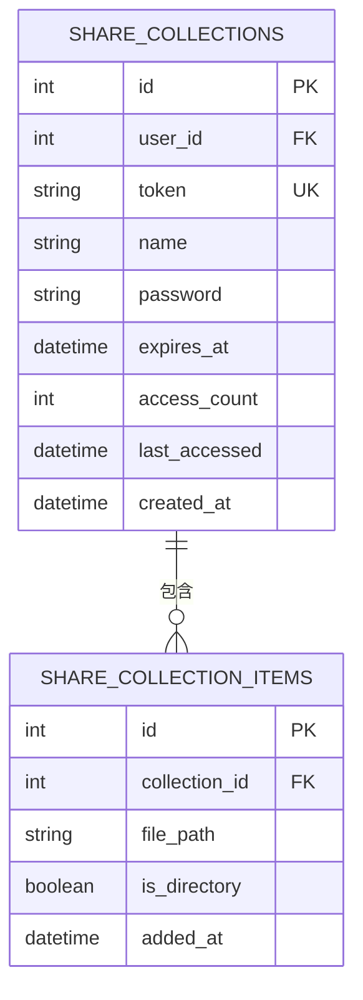
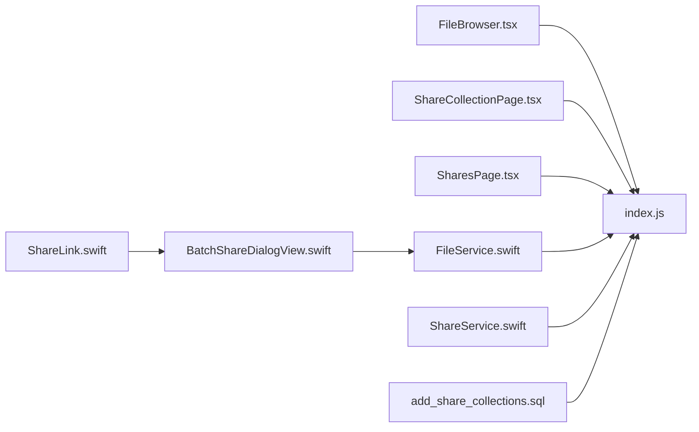

# 批量分享功能

<cite>
**本文档引用的文件**
- [ShareCollectionPage.tsx](file://client/src/components/ShareCollectionPage.tsx)
- [SharesPage.tsx](file://client/src/components/SharesPage.tsx)
- [FileBrowser.tsx](file://client/src/components/FileBrowser.tsx)
- [BatchShareDialogView.swift](file://ios/LonghornApp/Views/Shares/BatchShareDialogView.swift)
- [ShareService.swift](file://ios/LonghornApp/Services/ShareService.swift)
- [FileService.swift](file://ios/LonghornApp/Services/FileService.swift)
- [ShareLink.swift](file://ios/LonghornApp/Models/ShareLink.swift)
- [add_share_collections.sql](file://server/migrations/add_share_collections.sql)
- [index.js](file://server/index.js)
</cite>

## 目录
1. [简介](#简介)
2. [项目结构](#项目结构)
3. [核心组件](#核心组件)
4. [架构总览](#架构总览)
5. [详细组件分析](#详细组件分析)
6. [依赖关系分析](#依赖关系分析)
7. [性能考虑](#性能考虑)
8. [故障排除指南](#故障排除指南)
9. [结论](#结论)

## 简介
本技术文档聚焦于系统中的批量分享功能，涵盖批量分享集合的创建与管理接口、多文件同时分享的处理流程、数据结构定义、事务一致性保障、权限与访问控制策略，以及前端与移动端的交互体验设计。通过前后端协同的架构，用户可以一次性将多个文件加入一个分享集合，生成统一的分享链接，并在移动端提供便捷的批量分享对话框。

## 项目结构
批量分享功能涉及三层：
- 前端 Web（React）：负责批量选择、表单配置、批量删除与集合详情展示。
- 移动端 iOS（SwiftUI + Swift）：提供批量分享对话框与结果反馈。
- 后端 Node.js：提供批量分享集合的创建、查询、更新、删除与公开访问接口。

**图表来源**
- [FileBrowser.tsx](file://client/src/components/FileBrowser.tsx#L643-L699)
- [ShareCollectionPage.tsx](file://client/src/components/ShareCollectionPage.tsx#L31-L121)
- [SharesPage.tsx](file://client/src/components/SharesPage.tsx#L51-L92)
- [BatchShareDialogView.swift](file://ios/LonghornApp/Views/Shares/BatchShareDialogView.swift#L25-L107)
- [FileService.swift](file://ios/LonghornApp/Services/FileService.swift#L216-L226)
- [ShareService.swift](file://ios/LonghornApp/Services/ShareService.swift#L57-L78)
- [ShareLink.swift](file://ios/LonghornApp/Models/ShareLink.swift#L92-L135)
- [index.js](file://server/index.js#L3318-L3428)
- [add_share_collections.sql](file://server/migrations/add_share_collections.sql#L4-L31)

**章节来源**
- [FileBrowser.tsx](file://client/src/components/FileBrowser.tsx#L643-L699)
- [ShareCollectionPage.tsx](file://client/src/components/ShareCollectionPage.tsx#L31-L121)
- [SharesPage.tsx](file://client/src/components/SharesPage.tsx#L51-L92)
- [BatchShareDialogView.swift](file://ios/LonghornApp/Views/Shares/BatchShareDialogView.swift#L25-L107)
- [FileService.swift](file://ios/LonghornApp/Services/FileService.swift#L216-L226)
- [ShareService.swift](file://ios/LonghornApp/Services/ShareService.swift#L57-L78)
- [ShareLink.swift](file://ios/LonghornApp/Models/ShareLink.swift#L92-L135)
- [index.js](file://server/index.js#L3318-L3428)
- [add_share_collections.sql](file://server/migrations/add_share_collections.sql#L4-L31)

## 核心组件
- 批量分享集合数据模型（iOS）
  - 集合模型：包含集合标识、令牌、名称、过期时间、访问计数、创建时间、条目数量、密码保护标记等字段。
  - 分享链接模型：包含文件路径、令牌、过期时间、访问计数、创建时间、密码保护标记等字段。
- 批量分享对话框（iOS）
  - 支持设置集合名称、密码开关、有效期选项、界面语言，提交后调用服务层创建集合。
- 批量分享触发器（Web）
  - 在文件浏览器中选择多个文件，弹出或集成批量分享对话框，提交后调用后端接口创建集合。
- 公开集合页面（Web）
  - 展示集合内文件清单、下载入口、密码验证与访问统计。
- 我的分享页面（Web）
  - 展示文件分享与集合分享，支持批量勾选与批量删除。

**章节来源**
- [ShareLink.swift](file://ios/LonghornApp/Models/ShareLink.swift#L92-L135)
- [BatchShareDialogView.swift](file://ios/LonghornApp/Views/Shares/BatchShareDialogView.swift#L10-L22)
- [FileBrowser.tsx](file://client/src/components/FileBrowser.tsx#L643-L699)
- [ShareCollectionPage.tsx](file://client/src/components/ShareCollectionPage.tsx#L16-L29)
- [SharesPage.tsx](file://client/src/components/SharesPage.tsx#L22-L49)

## 架构总览
批量分享采用“前端表单配置 + 后端原子性写入”的模式。前端负责收集用户输入（名称、密码、有效期、语言），后端负责校验路径有效性、插入集合主表与条目表，并返回分享链接。公开访问时，后端根据密码与过期时间进行鉴权，聚合集合内的文件信息并更新访问计数。

**图表来源**
- [FileBrowser.tsx](file://client/src/components/FileBrowser.tsx#L643-L699)
- [BatchShareDialogView.swift](file://ios/LonghornApp/Views/Shares/BatchShareDialogView.swift#L185-L210)
- [FileService.swift](file://ios/LonghornApp/Services/FileService.swift#L216-L226)
- [index.js](file://server/index.js#L3320-L3353)

## 详细组件分析

### 数据模型与字段定义
- 批量分享集合（iOS）
  - 字段：id、token、name、expiresAt、accessCount、createdAt、itemCount、hasPassword
  - 用途：展示集合基本信息与访问统计
- 分享链接（iOS）
  - 字段：id、filePath、fileName、fileSize、token、expiresAt、createdAt、accessCount、language、hasPassword
  - 用途：单文件分享与集合分享的统一展示
- 公开集合数据（Web）
  - 字段：name、items（path/name/isDirectory/size）、createdAt、accessCount、language
  - 用途：渲染集合公开页与下载统计

**图表来源**
- [ShareLink.swift](file://ios/LonghornApp/Models/ShareLink.swift#L92-L135)
- [ShareCollectionPage.tsx](file://client/src/components/ShareCollectionPage.tsx#L16-L29)

**章节来源**
- [ShareLink.swift](file://ios/LonghornApp/Models/ShareLink.swift#L92-L135)
- [ShareCollectionPage.tsx](file://client/src/components/ShareCollectionPage.tsx#L16-L29)

### 批量分享集合创建流程（Web）
- 用户在文件浏览器中选择多个文件，填写集合名称、可选密码、有效期与语言，提交请求。
- 前端将请求发送至后端的批量分享集合接口，后端执行以下步骤：
  - 校验请求体参数（路径数组、名称、密码、有效期、语言）。
  - 生成唯一令牌，计算过期时间（若指定）。
  - 写入集合主表（share_collections），获取集合ID。
  - 遍历每个路径，解析并校验存在性，写入集合条目表（share_collection_items）。
  - 返回分享URL与令牌。

**图表来源**
- [index.js](file://server/index.js#L3320-L3353)
- [FileBrowser.tsx](file://client/src/components/FileBrowser.tsx#L643-L699)

**章节来源**
- [index.js](file://server/index.js#L3320-L3353)
- [FileBrowser.tsx](file://client/src/components/FileBrowser.tsx#L643-L699)

### 批量分享集合公开访问流程（Web）
- 公开访问接口根据令牌检索集合，校验过期时间与密码，随后读取集合条目并聚合文件信息（含大小），更新访问计数与最后访问时间，返回集合数据。
- 下载接口支持按集合打包下载，校验密码与过期时间后，逐条将文件或目录加入压缩包并输出流。

**图表来源**
- [index.js](file://server/index.js#L3355-L3428)
- [ShareCollectionPage.tsx](file://client/src/components/ShareCollectionPage.tsx#L42-L87)

**章节来源**
- [index.js](file://server/index.js#L3355-L3428)
- [ShareCollectionPage.tsx](file://client/src/components/ShareCollectionPage.tsx#L42-L87)

### 批量分享对话框（iOS）
- 对话框提供集合名称、密码开关、有效期选项与界面语言选择；点击完成按钮后，调用文件服务创建分享集合，成功后展示分享链接并支持复制。
- 服务层封装了创建集合的请求体与网络调用，便于上层视图使用。

**图表来源**
- [BatchShareDialogView.swift](file://ios/LonghornApp/Views/Shares/BatchShareDialogView.swift#L185-L210)
- [FileService.swift](file://ios/LonghornApp/Services/FileService.swift#L216-L226)
- [ShareService.swift](file://ios/LonghornApp/Services/ShareService.swift#L57-L78)

**章节来源**
- [BatchShareDialogView.swift](file://ios/LonghornApp/Views/Shares/BatchShareDialogView.swift#L10-L22)
- [FileService.swift](file://ios/LonghornApp/Services/FileService.swift#L216-L226)
- [ShareService.swift](file://ios/LonghornApp/Services/ShareService.swift#L57-L78)

### 权限与访问控制策略
- 密码保护
  - 创建时可设置密码，后端存储哈希值；公开访问时需提供正确密码才允许查看集合与下载。
- 有效期
  - 支持设置有效期天数，过期后公开访问返回失效；更新接口支持移除密码或修改有效期。
- 语言设置
  - 创建时可指定界面语言，公开页面可切换语言显示。
- 批量删除
  - 我的分享页面支持批量勾选文件分享与集合分享，统一发起删除请求，保证操作一致性。

**章节来源**
- [index.js](file://server/index.js#L3320-L3353)
- [index.js](file://server/index.js#L3355-L3428)
- [SharesPage.tsx](file://client/src/components/SharesPage.tsx#L181-L228)
- [BatchShareDialogView.swift](file://ios/LonghornApp/Views/Shares/BatchShareDialogView.swift#L60-L78)

### 数据库结构与事务特性
- 表结构
  - share_collections：集合主表，包含用户ID、令牌、名称、密码哈希、过期时间、访问计数、最后访问时间、创建时间等。
  - share_collection_items：集合条目表，包含集合ID、文件路径、是否目录等。
- 事务与一致性
  - 当前实现为顺序插入集合与条目，未显式包裹在数据库事务中。若需强一致，建议在创建集合与批量插入条目时使用事务包裹，确保任一环节失败回滚。

**图表来源**
- [add_share_collections.sql](file://server/migrations/add_share_collections.sql#L4-L31)

**章节来源**
- [add_share_collections.sql](file://server/migrations/add_share_collections.sql#L4-L31)

## 依赖关系分析
- 前端依赖
  - FileBrowser.tsx 依赖后端批量分享接口，提交路径列表与配置。
  - ShareCollectionPage.tsx 依赖公开访问接口，渲染集合与下载。
  - SharesPage.tsx 依赖我的分享与集合列表接口，支持批量删除。
- 移动端依赖
  - BatchShareDialogView 依赖 FileService 的创建方法。
  - ShareService 封装通用分享操作，供其他模块复用。
- 后端依赖
  - index.js 提供批量分享集合的增删改查与公开访问接口。
  - add_share_collections.sql 定义表结构与索引。

**图表来源**
- [FileBrowser.tsx](file://client/src/components/FileBrowser.tsx#L643-L699)
- [ShareCollectionPage.tsx](file://client/src/components/ShareCollectionPage.tsx#L42-L87)
- [SharesPage.tsx](file://client/src/components/SharesPage.tsx#L51-L92)
- [BatchShareDialogView.swift](file://ios/LonghornApp/Views/Shares/BatchShareDialogView.swift#L185-L210)
- [FileService.swift](file://ios/LonghornApp/Services/FileService.swift#L216-L226)
- [ShareService.swift](file://ios/LonghornApp/Services/ShareService.swift#L57-L78)
- [ShareLink.swift](file://ios/LonghornApp/Models/ShareLink.swift#L92-L135)
- [add_share_collections.sql](file://server/migrations/add_share_collections.sql#L4-L31)
- [index.js](file://server/index.js#L3318-L3428)

**章节来源**
- [FileBrowser.tsx](file://client/src/components/FileBrowser.tsx#L643-L699)
- [ShareCollectionPage.tsx](file://client/src/components/ShareCollectionPage.tsx#L42-L87)
- [SharesPage.tsx](file://client/src/components/SharesPage.tsx#L51-L92)
- [BatchShareDialogView.swift](file://ios/LonghornApp/Views/Shares/BatchShareDialogView.swift#L185-L210)
- [FileService.swift](file://ios/LonghornApp/Services/FileService.swift#L216-L226)
- [ShareService.swift](file://ios/LonghornApp/Services/ShareService.swift#L57-L78)
- [ShareLink.swift](file://ios/LonghornApp/Models/ShareLink.swift#L92-L135)
- [add_share_collections.sql](file://server/migrations/add_share_collections.sql#L4-L31)
- [index.js](file://server/index.js#L3318-L3428)

## 性能考虑
- 批量下载
  - 后端使用压缩流逐条添加文件/目录，避免一次性加载全部内容到内存，降低峰值内存占用。
- 访问统计
  - 公开访问时仅更新访问计数与最后访问时间，避免复杂查询。
- 前端复制
  - Web端优先使用现代剪贴板API，兼容降级方案，减少失败重试成本。
- 数据库
  - 建议在集合ID与令牌上建立索引，加速查询；批量插入条目时可考虑批量语句以减少往返。

[本节为通用性能建议，无需特定文件引用]

## 故障排除指南
- 公开访问提示需要密码
  - 若集合设置了密码，公开访问接口会返回需要密码的提示；前端应引导用户输入密码后重试。
- 过期或不存在
  - 过期或不存在的集合访问会返回相应错误；检查有效期与令牌。
- 批量删除无响应
  - 确认至少勾选了一个文件或集合；检查确认对话框与网络状态。
- iOS 复制链接失败
  - 优先尝试现代剪贴板API，若失败则回落到文本域选择复制；检查应用权限与系统版本。

**章节来源**
- [ShareCollectionPage.tsx](file://client/src/components/ShareCollectionPage.tsx#L56-L64)
- [SharesPage.tsx](file://client/src/components/SharesPage.tsx#L181-L228)
- [index.js](file://server/index.js#L3355-L3428)

## 结论
批量分享功能通过前后端协作实现了高效的一次性分享多个文件的能力。前端提供直观的批量选择与配置入口，移动端提供简洁的对话框体验，后端以原子性写入保障集合与条目的完整性。建议在后续迭代中引入数据库事务以进一步增强一致性，并持续优化批量下载与访问统计的性能表现。