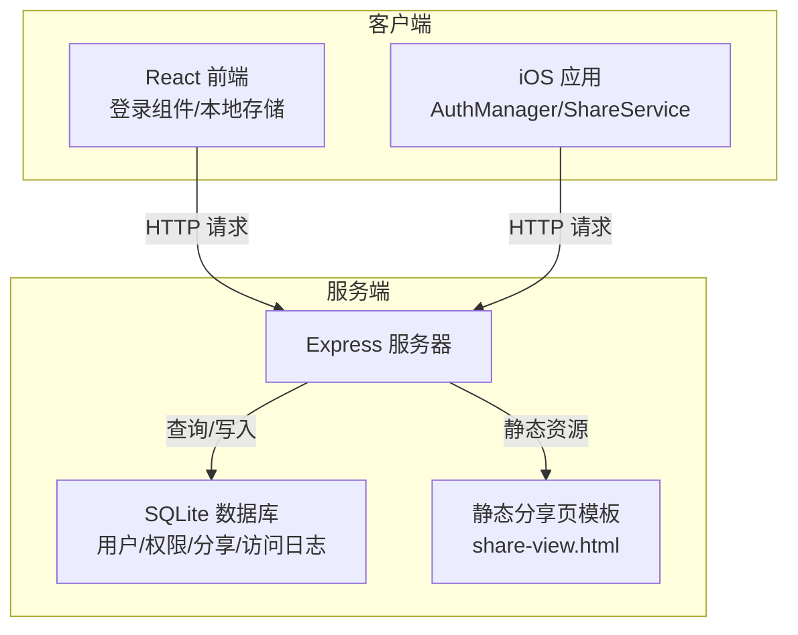
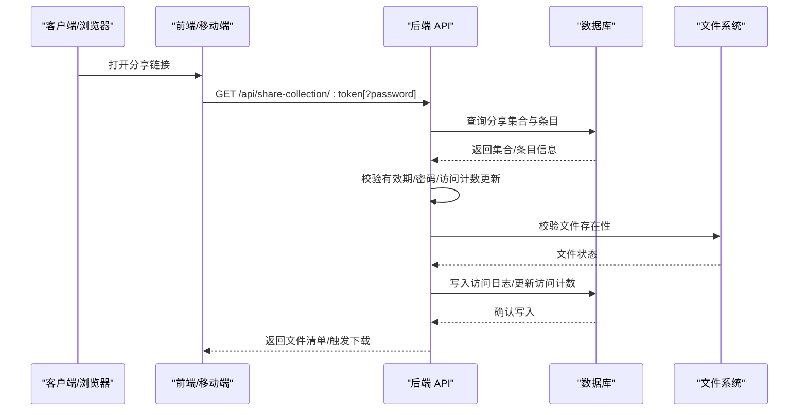
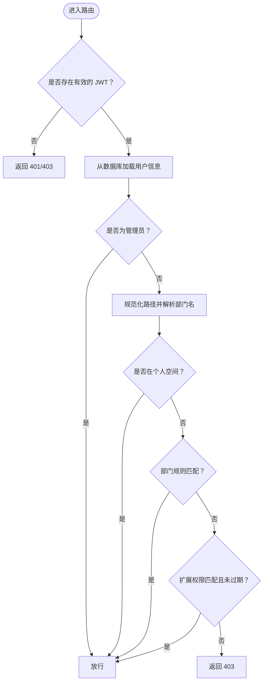
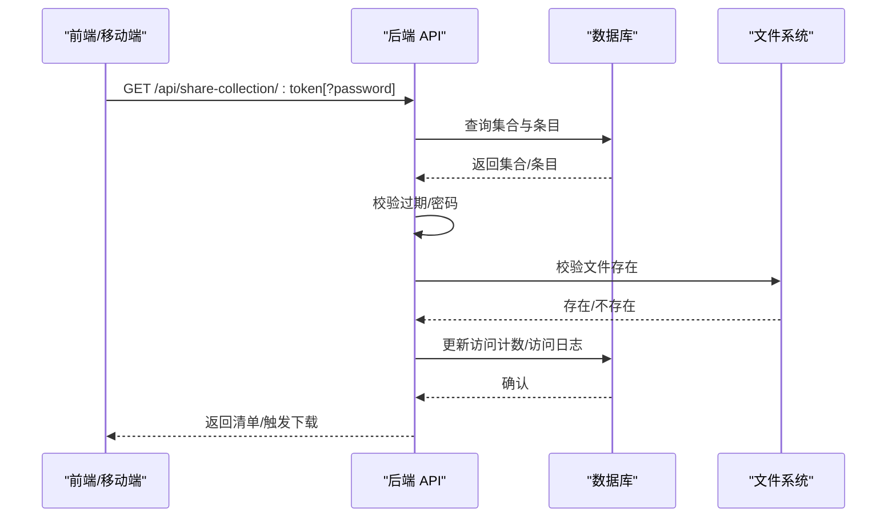
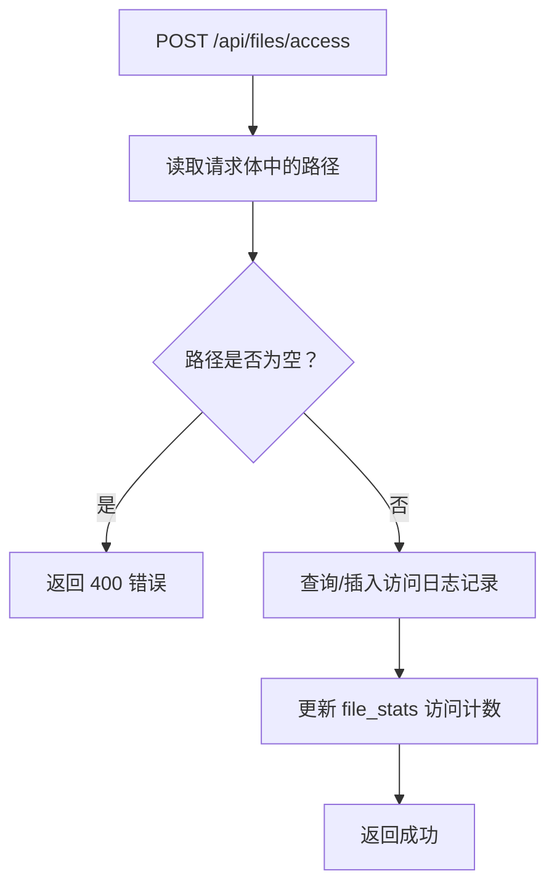
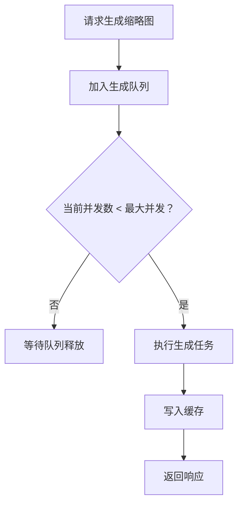
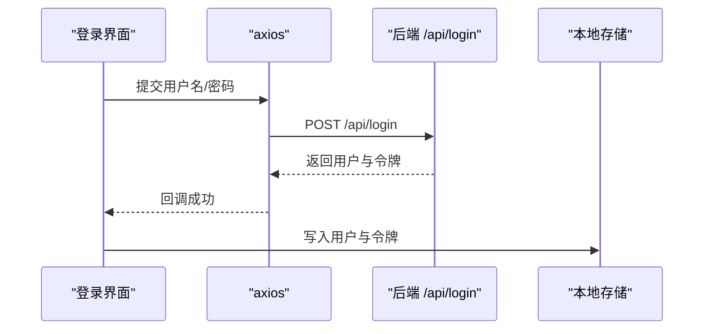
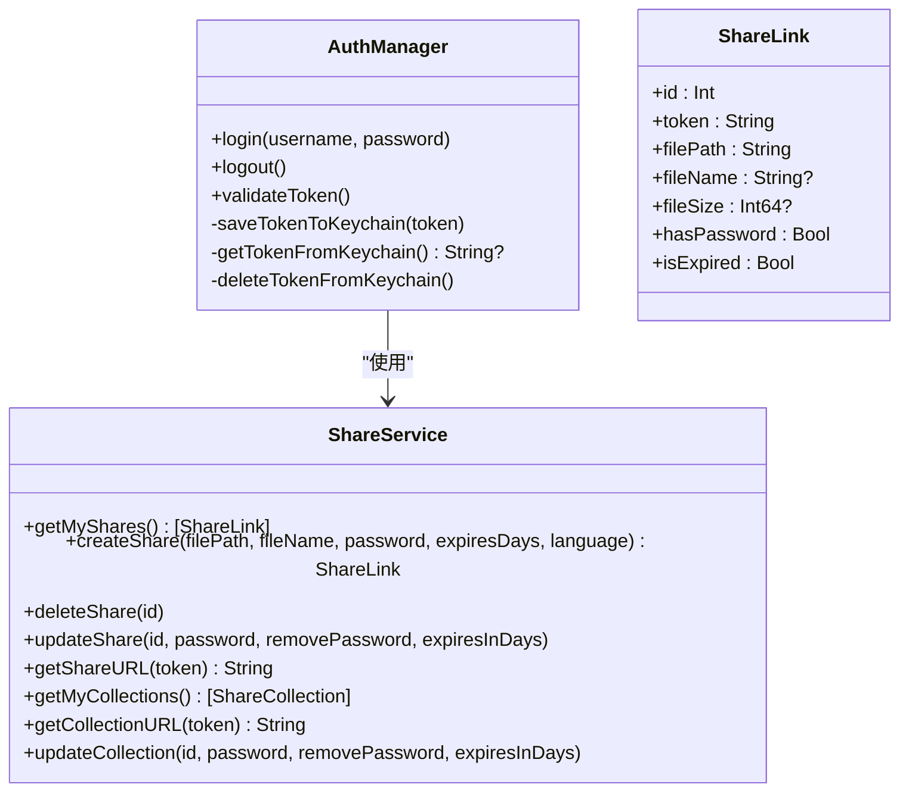
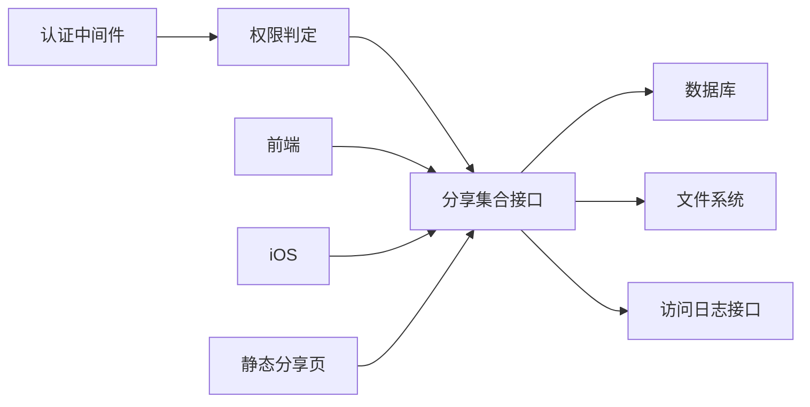

# 访问控制验证

<cite>
**本文引用的文件**
- [server/index.js](file://server/index.js)
- [server/public/share-view.html](file://server/public/share-view.html)
- [server/migrations/add_share_collections.sql](file://server/migrations/add_share_collections.sql)
- [client/src/components/Login.tsx](file://client/src/components/Login.tsx)
- [client/src/store/useAuthStore.ts](file://client/src/store/useAuthStore.ts)
- [ios/LonghornApp/Services/AuthManager.swift](file://ios/LonghornApp/Services/AuthManager.swift)
- [ios/LonghornApp/Services/ShareService.swift](file://ios/LonghornApp/Services/ShareService.swift)
- [ios/LonghornApp/Models/ShareLink.swift](file://ios/LonghornApp/Models/ShareLink.swift)
</cite>

## 目录
1. [简介](#简介)
2. [项目结构](#项目结构)
3. [核心组件](#核心组件)
4. [架构总览](#架构总览)
5. [详细组件分析](#详细组件分析)
6. [依赖关系分析](#依赖关系分析)
7. [性能考量](#性能考量)
8. [故障排查指南](#故障排查指南)
9. [结论](#结论)
10. [附录](#附录)

## 简介
本文件面向“访问控制验证系统”的技术文档，聚焦于分享链接访问权限的验证流程与策略，涵盖用户身份验证、文件存在性检查、权限范围验证、访问日志记录、并发与速率控制、异常访问检测以及前端与移动端的集成要点。文档以代码为依据，结合架构图与流程图，帮助开发者与运维人员快速理解与落地。

## 项目结构
后端采用 Node.js + Express 提供 API 与静态资源；前端使用 React（Vite）；iOS 使用 Swift。访问控制相关的关键位置如下：
- 后端：认证中间件、权限判定、分享集合接口、访问日志与统计接口、静态分享页模板
- 前端：登录组件与本地令牌存储
- 移动端：认证管理器与分享服务

图表来源
- [server/index.js](file://server/index.js#L1-L200)
- [server/public/share-view.html](file://server/public/share-view.html#L1-L120)

章节来源
- [server/index.js](file://server/index.js#L1-L200)
- [client/src/components/Login.tsx](file://client/src/components/Login.tsx#L1-L161)
- [ios/LonghornApp/Services/AuthManager.swift](file://ios/LonghornApp/Services/AuthManager.swift#L1-L120)

## 核心组件
- 身份认证中间件：基于 JWT 的认证与用户信息注入
- 权限判定函数：根据角色、部门、扩展权限进行路径级访问控制
- 分享集合接口：公开/密码/受限访问的统一入口与校验
- 访问日志与统计：记录访问次数、最后访问时间、用户维度统计
- 并发与生成：缩略图生成队列与并发限制
- 前端与移动端：登录态维护、分享链接访问与展示

章节来源
- [server/index.js](file://server/index.js#L318-L404)
- [server/index.js](file://server/index.js#L1406-L1447)
- [server/index.js](file://server/index.js#L3490-L3526)
- [server/index.js](file://server/index.js#L617-L800)
- [client/src/store/useAuthStore.ts](file://client/src/store/useAuthStore.ts#L1-L31)
- [ios/LonghornApp/Services/AuthManager.swift](file://ios/LonghornApp/Services/AuthManager.swift#L1-L120)

## 架构总览
下图展示了从客户端发起分享访问请求，到后端执行权限校验、日志记录与资源返回的整体流程。

图表来源
- [server/index.js](file://server/index.js#L3490-L3526)
- [server/index.js](file://server/index.js#L3529-L3562)
- [server/index.js](file://server/index.js#L1406-L1447)

## 详细组件分析

### 组件一：身份认证与权限判定
- 认证中间件负责解析 Authorization 头中的 JWT，校验失败返回 403/401；成功则从数据库刷新用户最新角色与部门信息，并注入到请求上下文
- 权限判定 hasPermission 支持管理员直通、个人空间、部门空间、领导/成员规则以及扩展权限表（含过期时间）
- 路由层通过 authenticate 中间件保护受控接口；hasPermission 在文件夹树、批量下载等场景用于细粒度控制

图表来源
- [server/index.js](file://server/index.js#L318-L346)
- [server/index.js](file://server/index.js#L351-L404)

章节来源
- [server/index.js](file://server/index.js#L318-L346)
- [server/index.js](file://server/index.js#L351-L404)

### 组件二：分享集合访问控制策略
- 公开访问：直接返回集合条目清单
- 密码访问：若集合配置密码，需在查询参数中提供正确密码；错误密码返回 401
- 受限访问：结合有效期与密码双重校验；过期返回 410
- 下载打包：支持将集合内文件打包下载，同样遵循密码与有效期校验

图表来源
- [server/index.js](file://server/index.js#L3490-L3526)
- [server/index.js](file://server/index.js#L3529-L3562)

章节来源
- [server/index.js](file://server/index.js#L3490-L3526)
- [server/index.js](file://server/index.js#L3529-L3562)
- [server/public/share-view.html](file://server/public/share-view.html#L357-L481)

### 组件三：访问日志与统计
- 接口 /api/files/access：记录单个文件的访问次数与最后访问时间，同时更新 file_stats
- 访问日志按路径与用户维度去重更新，确保同一用户对同一文件的多次访问只增加计数
- 日志可用于后续统计与审计，例如最近访问统计、访问趋势分析

图表来源
- [server/index.js](file://server/index.js#L1406-L1447)

章节来源
- [server/index.js](file://server/index.js#L1406-L1447)

### 组件四：并发与生成控制（缩略图）
- 缩略图生成采用队列与并发上限控制，避免 CPU/IO 过载
- 对视频与 HEIC 等格式采用外部工具生成首帧，再统一转 WebP 输出
- 缓存命中优先，缓存失效或损坏自动重建

图表来源
- [server/index.js](file://server/index.js#L689-L711)
- [server/index.js](file://server/index.js#L713-L780)
- [server/index.js](file://server/index.js#L794-L800)

章节来源
- [server/index.js](file://server/index.js#L689-L711)
- [server/index.js](file://server/index.js#L713-L780)
- [server/index.js](file://server/index.js#L794-L800)

### 组件五：前端登录与认证态维护
- 登录组件通过 /api/login 获取用户与令牌，写入本地存储
- 前端状态管理持久化用户与令牌，便于页面刷新后保持登录态

图表来源
- [client/src/components/Login.tsx](file://client/src/components/Login.tsx#L15-L27)
- [client/src/store/useAuthStore.ts](file://client/src/store/useAuthStore.ts#L17-L30)

章节来源
- [client/src/components/Login.tsx](file://client/src/components/Login.tsx#L1-L161)
- [client/src/store/useAuthStore.ts](file://client/src/store/useAuthStore.ts#L1-L31)

### 组件六：移动端认证与分享集成
- AuthManager 负责登录、登出、Token 持久化与有效性验证
- ShareService 提供分享集合/链接的创建、更新、删除与 URL 生成
- iOS 展示层可直接打开分享链接，或在需要时弹出密码输入框

图表来源
- [ios/LonghornApp/Services/AuthManager.swift](file://ios/LonghornApp/Services/AuthManager.swift#L1-L120)
- [ios/LonghornApp/Services/ShareService.swift](file://ios/LonghornApp/Services/ShareService.swift#L1-L86)
- [ios/LonghornApp/Models/ShareLink.swift](file://ios/LonghornApp/Models/ShareLink.swift#L1-L137)

章节来源
- [ios/LonghornApp/Services/AuthManager.swift](file://ios/LonghornApp/Services/AuthManager.swift#L1-L120)
- [ios/LonghornApp/Services/ShareService.swift](file://ios/LonghornApp/Services/ShareService.swift#L1-L86)
- [ios/LonghornApp/Models/ShareLink.swift](file://ios/LonghornApp/Models/ShareLink.swift#L1-L137)

## 依赖关系分析
- 认证中间件依赖 JWT 解密与数据库用户查询
- 权限判定依赖部门映射、扩展权限表与路径规范化
- 分享集合接口依赖数据库集合/条目表、文件系统存在性检查、bcrypt 密码校验
- 访问日志接口依赖 access_logs 与 file_stats 表
- 移动端依赖后端分享接口与静态分享页模板

图表来源
- [server/index.js](file://server/index.js#L318-L404)
- [server/index.js](file://server/index.js#L3490-L3562)
- [server/index.js](file://server/index.js#L1406-L1447)
- [server/public/share-view.html](file://server/public/share-view.html#L357-L481)

章节来源
- [server/index.js](file://server/index.js#L318-L404)
- [server/index.js](file://server/index.js#L3490-L3562)
- [server/index.js](file://server/index.js#L1406-L1447)
- [server/public/share-view.html](file://server/public/share-view.html#L357-L481)

## 性能考量
- 缩略图生成并发限制：通过队列与最大并发数控制 CPU/IO 峰值
- 静态资源缓存：预览与缩略图设置合理的 Cache-Control 与 ETag
- 数据库索引：分享集合 token、用户维度索引提升查询效率
- 压缩与范围请求：预览静态资源启用压缩与 Range 请求，优化移动端体验

章节来源
- [server/index.js](file://server/index.js#L689-L711)
- [server/index.js](file://server/index.js#L448-L471)
- [server/migrations/add_share_collections.sql](file://server/migrations/add_share_collections.sql#L1-L32)

## 故障排查指南
- 认证失败
  - 检查 Authorization 头是否携带 Bearer 令牌
  - 校验 JWT 是否过期或签名错误
  - 确认用户是否存在且角色/部门信息正确
- 权限不足
  - 确认路径是否在个人空间或部门空间范围内
  - 检查扩展权限表是否授予相应访问类型且未过期
- 分享访问异常
  - 密码错误：确认密码是否正确，注意大小写与特殊字符
  - 链接过期：检查 expires_at 字段
  - 文件不存在：确认磁盘路径与文件存在性
- 访问日志缺失
  - 确认 /api/files/access 是否被调用
  - 检查 access_logs 与 file_stats 表写入是否成功

章节来源
- [server/index.js](file://server/index.js#L318-L346)
- [server/index.js](file://server/index.js#L351-L404)
- [server/index.js](file://server/index.js#L3490-L3526)
- [server/index.js](file://server/index.js#L1406-L1447)

## 结论
本系统通过“JWT 认证 + 路径级权限判定 + 分享集合访问控制 + 访问日志统计”的组合，实现了对分享链接访问的全链路安全与可观测性。配合移动端与前端的认证态维护与分享集成，能够满足公开、密码、受限等多策略访问需求。建议在生产环境进一步引入速率限制与异常访问检测机制，以增强抗压与风控能力。

## 附录
- 数据库迁移：分享集合相关表结构与索引定义
- 静态分享页：浏览器端分享集合展示与交互逻辑

章节来源
- [server/migrations/add_share_collections.sql](file://server/migrations/add_share_collections.sql#L1-L32)
- [server/public/share-view.html](file://server/public/share-view.html#L357-L481)