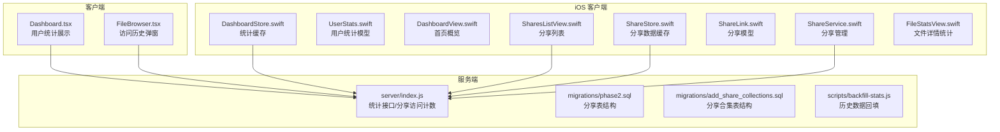
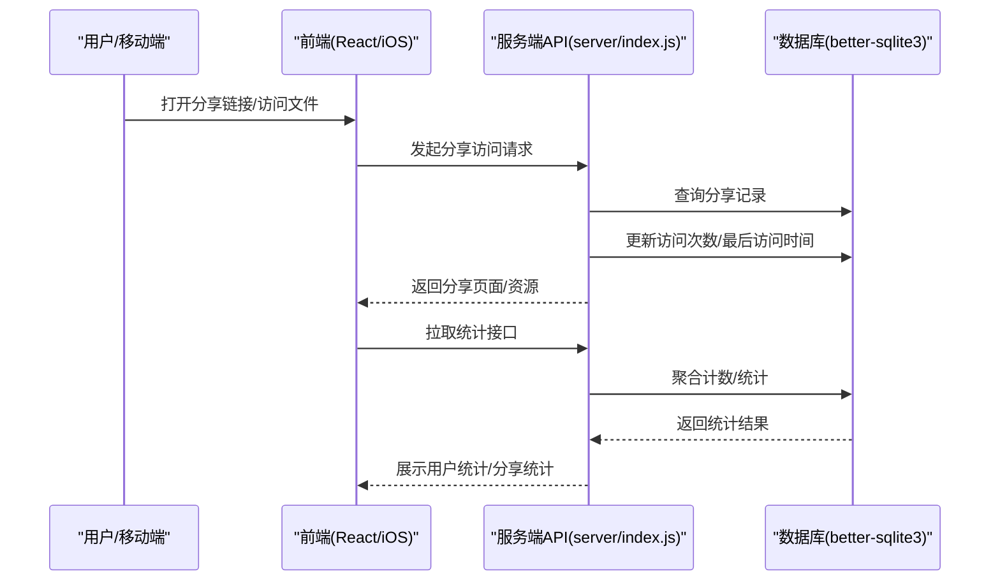
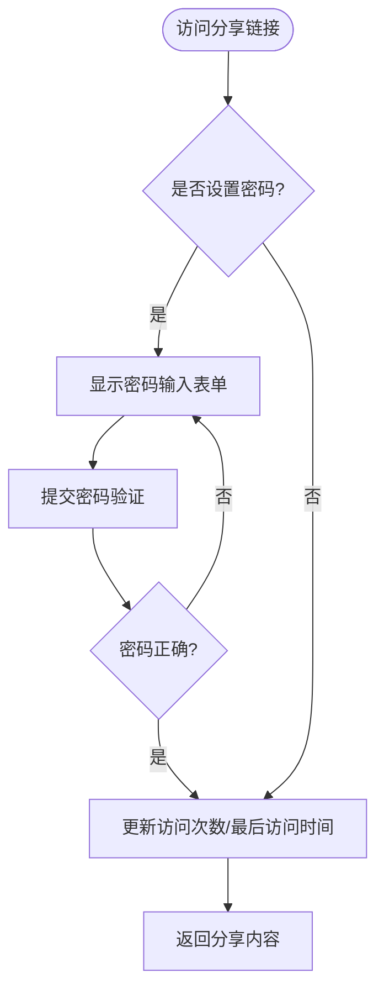
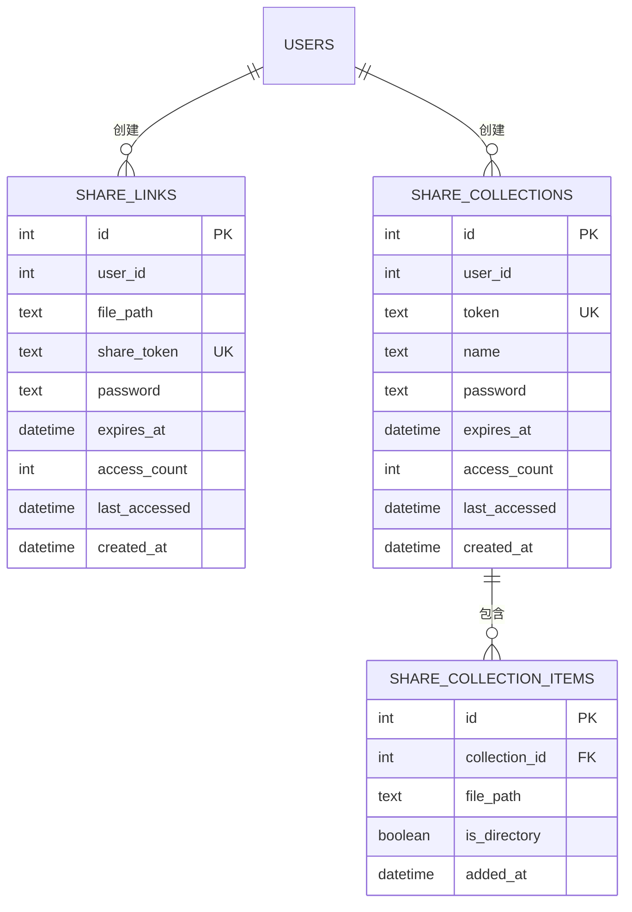
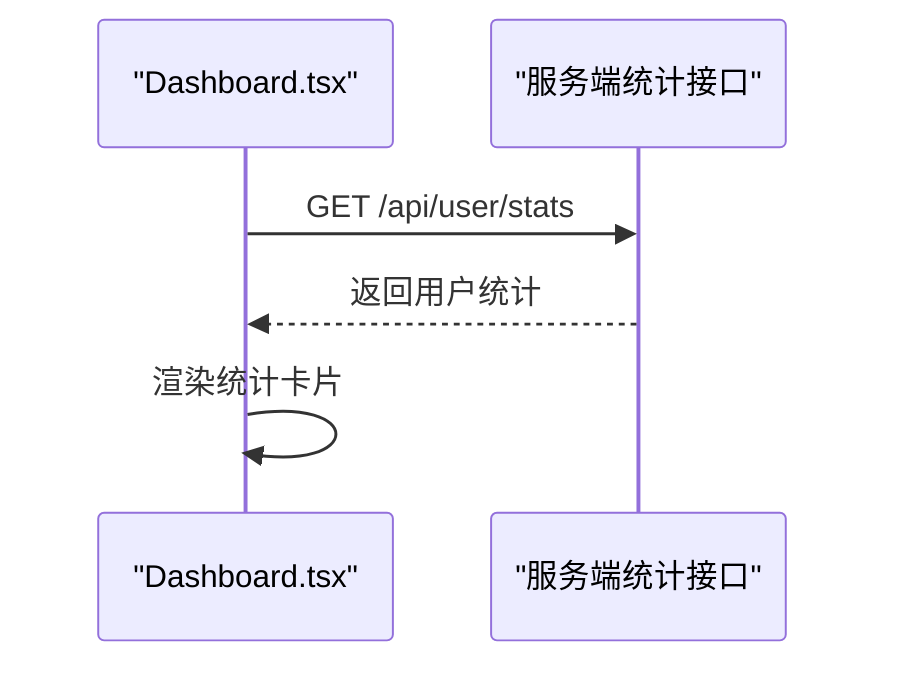
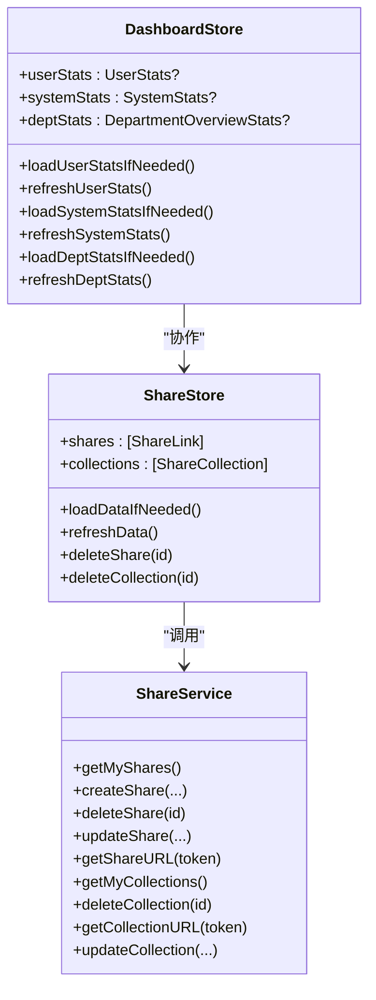
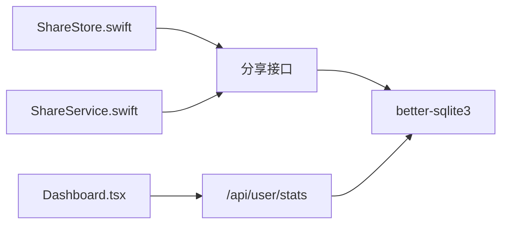

# 访问统计监控

<cite>
**本文档引用的文件**
- [server/index.js](file://server/index.js)
- [server/migrations/phase2.sql](file://server/migrations/phase2.sql)
- [server/migrations/add_share_collections.sql](file://server/migrations/add_share_collections.sql)
- [server/scripts/backfill-stats.js](file://server/scripts/backfill-stats.js)
- [client/src/components/Dashboard.tsx](file://client/src/components/Dashboard.tsx)
- [client/src/components/FileBrowser.tsx](file://client/src/components/FileBrowser.tsx)
- [ios/LonghornApp/Services/DashboardStore.swift](file://ios/LonghornApp/Services/DashboardStore.swift)
- [ios/LonghornApp/Models/UserStats.swift](file://ios/LonghornApp/Models/UserStats.swift)
- [ios/LonghornApp/Views/Main/DashboardView.swift](file://ios/LonghornApp/Views/Main/DashboardView.swift)
- [ios/LonghornApp/Services/ShareService.swift](file://ios/LonghornApp/Services/ShareService.swift)
- [ios/LonghornApp/Services/ShareStore.swift](file://ios/LonghornApp/Services/ShareStore.swift)
- [ios/LonghornApp/Models/ShareLink.swift](file://ios/LonghornApp/Models/ShareLink.swift)
- [ios/LonghornApp/Views/Shares/SharesListView.swift](file://ios/LonghornApp/Views/Shares/SharesListView.swift)
- [ios/LonghornApp/Views/Files/FileStatsView.swift](file://ios/LonghornApp/Views/Files/FileStatsView.swift)
</cite>

## 目录
1. [简介](#简介)
2. [项目结构](#项目结构)
3. [核心组件](#核心组件)
4. [架构总览](#架构总览)
5. [详细组件分析](#详细组件分析)
6. [依赖关系分析](#依赖关系分析)
7. [性能考虑](#性能考虑)
8. [故障排除指南](#故障排除指南)
9. [结论](#结论)
10. [附录](#附录)

## 简介
本文件系统性梳理访问统计监控的实现机制与可视化方案，覆盖以下方面：
- 分享链接访问统计：访问次数统计、首次访问时间、最后访问时间等指标的采集与更新
- 统计数据存储结构与查询优化策略
- 实时监控能力：在线用户统计、热门链接排行、访问趋势分析
- 可视化展示：图表生成、报表导出、管理员仪表板组件
- 移动端统计数据同步机制与展示组件

## 项目结构
系统由三部分组成：
- 服务端（Node.js + better-sqlite3）：提供统计接口、维护统计表、处理分享访问计数
- 客户端（React）：用户仪表板、文件浏览器访问历史查看
- iOS 客户端（SwiftUI）：分享管理、统计缓存与展示

**图表来源**
- [server/index.js](file://server/index.js#L1672-L2049)
- [server/migrations/phase2.sql](file://server/migrations/phase2.sql#L1-L32)
- [server/migrations/add_share_collections.sql](file://server/migrations/add_share_collections.sql#L1-L32)
- [server/scripts/backfill-stats.js](file://server/scripts/backfill-stats.js#L1-L46)
- [client/src/components/Dashboard.tsx](file://client/src/components/Dashboard.tsx#L1-L378)
- [client/src/components/FileBrowser.tsx](file://client/src/components/FileBrowser.tsx#L1254-L1283)
- [ios/LonghornApp/Services/DashboardStore.swift](file://ios/LonghornApp/Services/DashboardStore.swift#L1-L157)
- [ios/LonghornApp/Models/UserStats.swift](file://ios/LonghornApp/Models/UserStats.swift#L1-L18)
- [ios/LonghornApp/Views/Main/DashboardView.swift](file://ios/LonghornApp/Views/Main/DashboardView.swift#L1-L256)
- [ios/LonghornApp/Services/ShareService.swift](file://ios/LonghornApp/Services/ShareService.swift#L1-L86)
- [ios/LonghornApp/Services/ShareStore.swift](file://ios/LonghornApp/Services/ShareStore.swift#L1-L130)
- [ios/LonghornApp/Models/ShareLink.swift](file://ios/LonghornApp/Models/ShareLink.swift#L1-L137)
- [ios/LonghornApp/Views/Shares/SharesListView.swift](file://ios/LonghornApp/Views/Shares/SharesListView.swift#L1-L843)
- [ios/LonghornApp/Views/Files/FileStatsView.swift](file://ios/LonghornApp/Views/Files/FileStatsView.swift#L1-L18)

**章节来源**
- [server/index.js](file://server/index.js#L1-L800)
- [client/src/components/Dashboard.tsx](file://client/src/components/Dashboard.tsx#L1-L378)
- [ios/LonghornApp/Services/DashboardStore.swift](file://ios/LonghornApp/Services/DashboardStore.swift#L1-L157)

## 核心组件
- 服务端统计接口与分享访问计数
  - 用户统计接口：聚合上传数、存储用量、星标数、分享数、最近登录时间等
  - 分享访问计数：单文件分享与分享合集均支持访问次数与最后访问时间更新
- 数据库存储结构
  - 分享表与分享合集表：包含访问次数与最后访问时间字段
  - 历史数据回填脚本：为现有记录补充文件大小与上传日期
- 客户端展示
  - React 仪表板：展示用户统计卡片
  - 文件浏览器：访问历史弹窗展示访问明细
- iOS 客户端
  - DashboardStore：统计缓存与刷新控制
  - ShareStore：分享列表缓存与异步加载
  - ShareLink/ShareCollection：分享数据模型与过期判断

**章节来源**
- [server/index.js](file://server/index.js#L1672-L2049)
- [server/migrations/phase2.sql](file://server/migrations/phase2.sql#L13-L31)
- [server/migrations/add_share_collections.sql](file://server/migrations/add_share_collections.sql#L4-L31)
- [server/scripts/backfill-stats.js](file://server/scripts/backfill-stats.js#L10-L43)
- [client/src/components/Dashboard.tsx](file://client/src/components/Dashboard.tsx#L18-L378)
- [client/src/components/FileBrowser.tsx](file://client/src/components/FileBrowser.tsx#L1254-L1283)
- [ios/LonghornApp/Services/DashboardStore.swift](file://ios/LonghornApp/Services/DashboardStore.swift#L11-L135)
- [ios/LonghornApp/Services/ShareStore.swift](file://ios/LonghornApp/Services/ShareStore.swift#L11-L129)
- [ios/LonghornApp/Models/ShareLink.swift](file://ios/LonghornApp/Models/ShareLink.swift#L10-L73)

## 架构总览
访问统计监控的端到端流程如下：

**图表来源**
- [server/index.js](file://server/index.js#L1672-L2049)
- [ios/LonghornApp/Services/ShareService.swift](file://ios/LonghornApp/Services/ShareService.swift#L18-L50)
- [ios/LonghornApp/Services/ShareStore.swift](file://ios/LonghornApp/Services/ShareStore.swift#L56-L89)

## 详细组件分析

### 服务端统计接口与分享访问计数
- 用户统计接口
  - 接口路径：/api/user/stats
  - 返回字段：上传数、存储使用量、星标数、分享数、最近登录时间、账号创建时间、用户名、角色
  - 统计逻辑：基于用户维度聚合，便于前端仪表板展示
- 分享访问计数
  - 单文件分享：访问时更新 access_count 与 last_accessed
  - 分享合集：访问时同样更新访问次数与最后访问时间
  - 密码保护：若需密码验证，先返回密码表单，验证通过后进行计数更新

**图表来源**
- [server/index.js](file://server/index.js#L2026-L2049)

**章节来源**
- [server/index.js](file://server/index.js#L1672-L1698)
- [server/index.js](file://server/index.js#L2026-L2049)

### 数据库存储结构与查询优化
- 分享表与分享合集表
  - 字段：访问次数、最后访问时间、创建时间、过期时间、密码等
  - 索引：按 token、user_id 建立索引，提升查询效率
- 历史数据回填
  - 为 file_stats 表补充 size 与 upload_date 字段，确保统计准确性
- 查询优化建议
  - 对高频查询字段建立索引（如 token、user_id、expires_at）
  - 使用分页与条件过滤减少一次性返回大量数据
  - 对统计类接口采用缓存（见客户端缓存策略）

**图表来源**
- [server/migrations/phase2.sql](file://server/migrations/phase2.sql#L13-L31)
- [server/migrations/add_share_collections.sql](file://server/migrations/add_share_collections.sql#L4-L31)

**章节来源**
- [server/migrations/phase2.sql](file://server/migrations/phase2.sql#L1-L32)
- [server/migrations/add_share_collections.sql](file://server/migrations/add_share_collections.sql#L1-L32)
- [server/scripts/backfill-stats.js](file://server/scripts/backfill-stats.js#L10-L43)

### 客户端统计展示
- React 仪表板
  - 展示上传数、存储使用量、星标数、分享数、最近登录时间等
  - 支持点击跳转至个人空间、星标页、分享页
- 文件浏览器访问历史弹窗
  - 展示访问用户的用户名、最后访问时间、累计访问次数
  - 提供“访问分析”入口，便于查看详细历史

**图表来源**
- [client/src/components/Dashboard.tsx](file://client/src/components/Dashboard.tsx#L41-L55)

**章节来源**
- [client/src/components/Dashboard.tsx](file://client/src/components/Dashboard.tsx#L18-L378)
- [client/src/components/FileBrowser.tsx](file://client/src/components/FileBrowser.tsx#L1254-L1283)

### iOS 客户端统计缓存与展示
- DashboardStore
  - 缓存用户统计、系统统计、部门统计，5分钟有效期
  - 智能加载：缓存有效则不请求，否则刷新
- ShareStore
  - 并发加载分享列表与分享合集，支持下拉刷新与批量操作
  - 乐观更新：删除成功后再刷新，失败则回滚
- ShareService
  - 提供分享创建、编辑、删除、URL 生成等能力
- ShareLink/ShareCollection
  - 包含访问次数、过期时间、密码保护等字段，支持格式化显示

**图表来源**
- [ios/LonghornApp/Services/DashboardStore.swift](file://ios/LonghornApp/Services/DashboardStore.swift#L11-L135)
- [ios/LonghornApp/Services/ShareStore.swift](file://ios/LonghornApp/Services/ShareStore.swift#L11-L129)
- [ios/LonghornApp/Services/ShareService.swift](file://ios/LonghornApp/Services/ShareService.swift#L10-L86)

**章节来源**
- [ios/LonghornApp/Services/DashboardStore.swift](file://ios/LonghornApp/Services/DashboardStore.swift#L11-L135)
- [ios/LonghornApp/Services/ShareStore.swift](file://ios/LonghornApp/Services/ShareStore.swift#L11-L129)
- [ios/LonghornApp/Services/ShareService.swift](file://ios/LonghornApp/Services/ShareService.swift#L10-L86)
- [ios/LonghornApp/Models/ShareLink.swift](file://ios/LonghornApp/Models/ShareLink.swift#L10-L73)

### 实时监控与可视化
- 在线用户统计
  - 可通过系统统计接口（管理员视角）获取在线用户数与系统总体统计
- 热门链接排行
  - 基于分享表的访问次数字段进行排序，支持按时间窗口筛选
- 访问趋势分析
  - 可结合 last_accessed 字段按日/周/月聚合趋势
- 图表生成与报表导出
  - 建议在前端使用图表库（如 ECharts/Chart.js）渲染趋势图
  - 报表导出可采用 CSV/PDF 方案，结合后端接口批量拉取数据

[本节为概念性说明，不直接分析具体文件]

### 管理员仪表板与移动端同步
- 管理员仪表板
  - DashboardStore 提供系统级统计缓存，支持定时刷新与错误处理
  - iOS 端通过 AdminService 获取系统统计，展示文件总数、存储使用等
- 移动端统计数据同步
  - DashboardStore 与 ShareStore 采用 5 分钟缓存策略，避免频繁请求
  - 通过通知中心监听分享变更，触发自动刷新

**章节来源**
- [ios/LonghornApp/Services/DashboardStore.swift](file://ios/LonghornApp/Services/DashboardStore.swift#L36-L123)
- [ios/LonghornApp/Views/Main/DashboardView.swift](file://ios/LonghornApp/Views/Main/DashboardView.swift#L1-L256)

## 依赖关系分析
- 组件耦合
  - 前端 Dashboard.tsx 与服务端统计接口强耦合，负责用户维度统计展示
  - iOS ShareStore 与 ShareService 解耦良好，便于并发与缓存管理
- 外部依赖
  - better-sqlite3：高性能本地数据库，适合中小规模部署
  - better-sqlite3 索引：对 token、user_id、expires_at 建立索引以提升查询性能

**图表来源**
- [client/src/components/Dashboard.tsx](file://client/src/components/Dashboard.tsx#L41-L55)
- [ios/LonghornApp/Services/ShareStore.swift](file://ios/LonghornApp/Services/ShareStore.swift#L64-L89)
- [ios/LonghornApp/Services/ShareService.swift](file://ios/LonghornApp/Services/ShareService.swift#L18-L50)
- [server/index.js](file://server/index.js#L1672-L1698)

**章节来源**
- [server/index.js](file://server/index.js#L1672-L1698)
- [ios/LonghornApp/Services/ShareStore.swift](file://ios/LonghornApp/Services/ShareStore.swift#L64-L89)

## 性能考虑
- 数据库层面
  - 为高频查询字段建立索引，避免全表扫描
  - 使用事务批量更新访问计数，减少锁竞争
- 接口层面
  - 对统计接口增加缓存（如 5 分钟），降低数据库压力
  - 分页与条件过滤，避免一次性返回大量数据
- 客户端层面
  - DashboardStore 与 ShareStore 的缓存策略减少重复请求
  - 并发加载多个接口，缩短首屏等待时间

[本节提供通用指导，不直接分析具体文件]

## 故障排除指南
- 分享访问计数未更新
  - 检查分享记录是否存在且未过期
  - 确认访问路径是否命中更新逻辑（密码校验通过后才会更新）
- 统计数据异常
  - 核对 file_stats 表回填脚本执行情况
  - 检查数据库索引是否生效
- 客户端缓存问题
  - iOS 端可通过 DashboardStore.clearAll 或 ShareStore.clearCache 清空缓存
  - 触发下拉刷新或重新进入页面以强制刷新

**章节来源**
- [server/scripts/backfill-stats.js](file://server/scripts/backfill-stats.js#L22-L43)
- [ios/LonghornApp/Services/DashboardStore.swift](file://ios/LonghornApp/Services/DashboardStore.swift#L127-L134)
- [ios/LonghornApp/Services/ShareStore.swift](file://ios/LonghornApp/Services/ShareStore.swift#L121-L129)

## 结论
本系统通过服务端统计接口与分享访问计数，结合客户端缓存与可视化组件，实现了从访问统计到实时监控的完整闭环。建议后续扩展：
- 增加访问趋势与热门排行的可视化图表
- 提供报表导出能力与更细粒度的时间窗口筛选
- 对大体量数据引入分页与增量更新策略，持续优化查询性能

[本节为总结性内容，不直接分析具体文件]

## 附录
- 关键接口与字段
  - /api/user/stats：用户统计（上传数、存储使用、星标数、分享数、最近登录时间）
  - 分享表：access_count、last_accessed、expires_at、password
  - 分享合集表：同上，支持批量文件访问统计
- 前端组件
  - React 仪表板与文件浏览器访问历史弹窗
  - iOS DashboardStore、ShareStore、ShareService、ShareLink 模型与分享列表视图

**章节来源**
- [server/index.js](file://server/index.js#L1672-L1698)
- [server/migrations/phase2.sql](file://server/migrations/phase2.sql#L13-L31)
- [server/migrations/add_share_collections.sql](file://server/migrations/add_share_collections.sql#L4-L31)
- [client/src/components/Dashboard.tsx](file://client/src/components/Dashboard.tsx#L18-L378)
- [client/src/components/FileBrowser.tsx](file://client/src/components/FileBrowser.tsx#L1254-L1283)
- [ios/LonghornApp/Services/DashboardStore.swift](file://ios/LonghornApp/Services/DashboardStore.swift#L11-L135)
- [ios/LonghornApp/Services/ShareStore.swift](file://ios/LonghornApp/Services/ShareStore.swift#L11-L129)
- [ios/LonghornApp/Services/ShareService.swift](file://ios/LonghornApp/Services/ShareService.swift#L10-L86)
- [ios/LonghornApp/Models/ShareLink.swift](file://ios/LonghornApp/Models/ShareLink.swift#L10-L73)
- [ios/LonghornApp/Views/Shares/SharesListView.swift](file://ios/LonghornApp/Views/Shares/SharesListView.swift#L1-L843)
- [ios/LonghornApp/Views/Files/FileStatsView.swift](file://ios/LonghornApp/Views/Files/FileStatsView.swift#L1-L18)