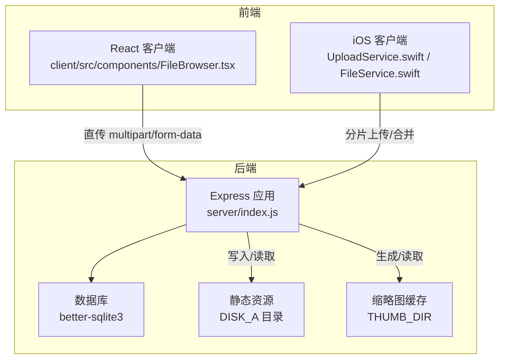
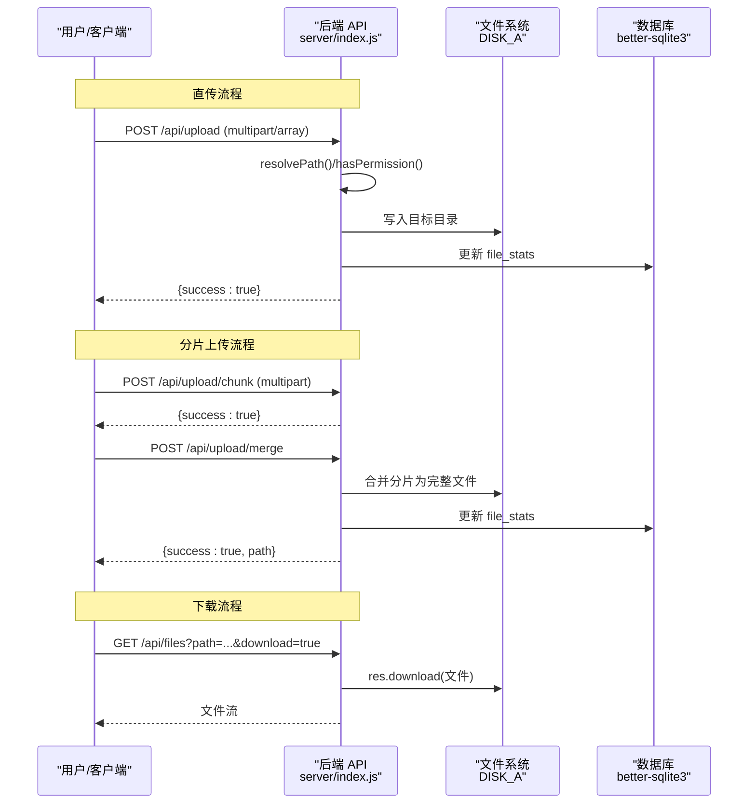
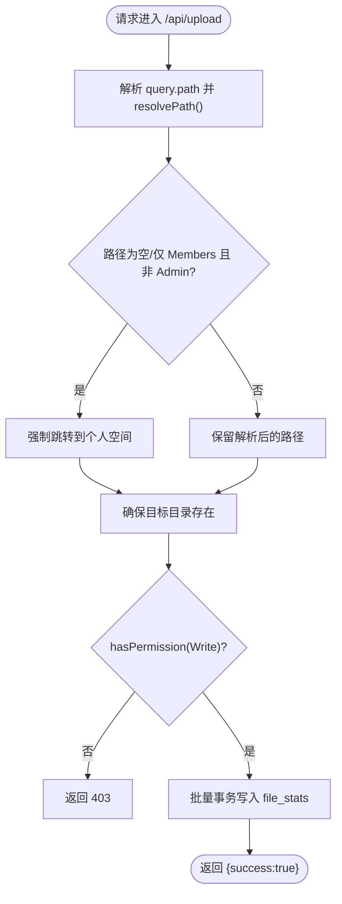
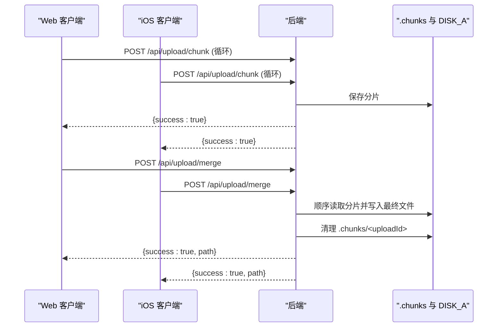
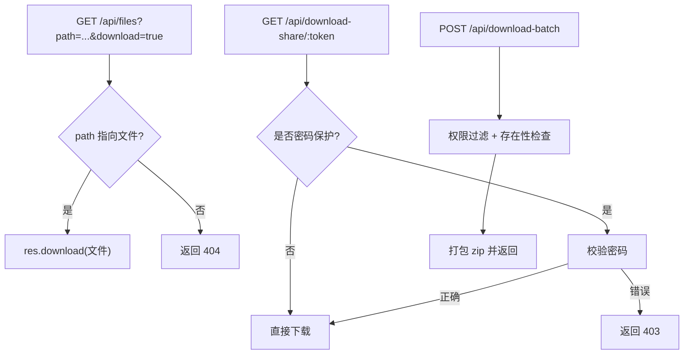
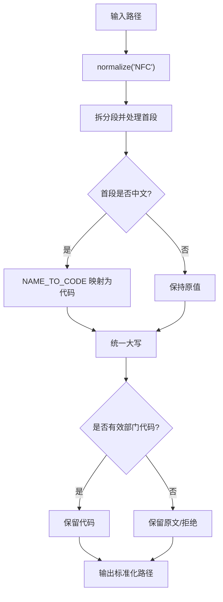
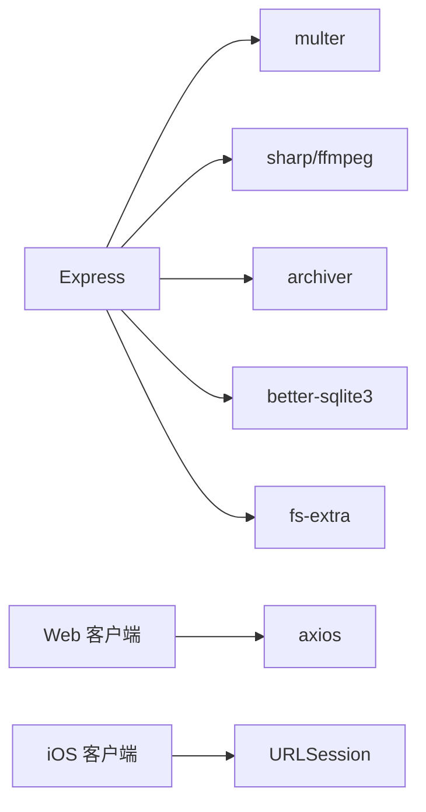

# 文件上传下载

<cite>
**本文引用的文件**
- [server/index.js](file://server/index.js)
- [server/migrations/phase2.sql](file://server/migrations/phase2.sql)
- [server/fix_missing_files.js](file://server/fix_missing_files.js)
- [ios/LonghornApp/Services/UploadService.swift](file://ios/LonghornApp/Services/UploadService.swift)
- [ios/LonghornApp/Services/FileService.swift](file://ios/LonghornApp/Services/FileService.swift)
- [ios/LonghornApp/Services/APIClient.swift](file://ios/LonghornApp/Services/APIClient.swift)
- [client/src/components/FileBrowser.tsx](file://client/src/components/FileBrowser.tsx)
- [client/src/utils/pathTranslator.ts](file://client/src/utils/pathTranslator.ts)
- [client/package.json](file://client/package.json)
</cite>

## 目录
1. [简介](#简介)
2. [项目结构](#项目结构)
3. [核心组件](#核心组件)
4. [架构总览](#架构总览)
5. [详细组件分析](#详细组件分析)
6. [依赖关系分析](#依赖关系分析)
7. [性能考量](#性能考量)
8. [故障排查指南](#故障排查指南)
9. [结论](#结论)
10. [附录](#附录)

## 简介
本文件围绕“文件上传下载”能力进行系统化说明，覆盖以下目标：
- 详解 /api/upload 端点的实现，包括多文件上传、路径解析与权限校验、存储路径处理、以及分片上传/合并流程。
- 记录文件下载机制，包括直链下载与公开分享下载两种方式及访问控制。
- 解释文件路径解析逻辑、部门路径映射与用户个人空间的自动创建。
- 提供客户端集成示例，涵盖进度跟踪、错误处理与并发上传管理。
- 总结安全考虑、性能优化建议与常见问题解决方案。

## 项目结构
后端采用 Node.js + Express，使用 better-sqlite3 作为轻量数据库，结合 multer 进行文件上传，使用 sharp/ffmpeg 生成缩略图，并通过静态文件中间件提供预览与下载。前端包含 React 客户端与 iOS Swift 客户端，分别演示直传与分片上传流程。

图表来源
- [server/index.js](file://server/index.js#L1-L120)
- [client/src/components/FileBrowser.tsx](file://client/src/components/FileBrowser.tsx#L375-L424)
- [ios/LonghornApp/Services/UploadService.swift](file://ios/LonghornApp/Services/UploadService.swift#L59-L159)

章节来源
- [server/index.js](file://server/index.js#L1-L120)

## 核心组件
- 上传端点与权限控制
  - 单文件多文件上传：/api/upload（multipart/array），路径解析与权限校验，目标目录确保存在。
  - 分片上传：/api/upload/chunk 接收分片；/api/upload/merge 合并分片为完整文件。
- 下载端点与分享
  - 直链下载：/api/files?path=...&download=true
  - 公开分享下载：/api/download-share/:token
  - 批量下载：/api/download-batch
- 路径解析与权限
  - resolvePath 将前端输入标准化为部门代码或中文名称，统一大小写与 NFC 规范。
  - hasPermission 综合管理员、部门成员、个人空间、扩展权限判断。
- 存储与用户空间
  - DISK_A 为根存储目录，用户首次登录会自动创建个人空间目录。
- 缩略图与预览
  - /api/thumbnail 生成 WebP 缩略图并缓存，支持图片与视频（含 HEIC/HEVC）。

章节来源
- [server/index.js](file://server/index.js#L232-L259)
- [server/index.js](file://server/index.js#L300-L353)
- [server/index.js](file://server/index.js#L792-L841)
- [server/index.js](file://server/index.js#L843-L932)
- [server/index.js](file://server/index.js#L2297-L2304)
- [server/index.js](file://server/index.js#L2156-L2216)
- [server/index.js](file://server/index.js#L481-L679)

## 架构总览
下图展示从客户端到后端的典型上传/下载流程，包括直传、分片上传、权限校验、存储落盘与缩略图生成。

图表来源
- [server/index.js](file://server/index.js#L792-L841)
- [server/index.js](file://server/index.js#L843-L932)
- [server/index.js](file://server/index.js#L2297-L2304)

## 详细组件分析

### 上传端点：/api/upload（多文件直传）
- 功能要点
  - 使用数组形式接收多个文件，路径参数 path 通过查询字符串传入。
  - resolvePath 将前端路径标准化为部门代码或中文名称，统一大小写与 NFC。
  - 若路径为空或仅“Members”，且当前用户非 Admin，则强制进入其个人空间。
  - hasPermission 校验 Full/Contributor 权限，确保可写。
  - 目标目录不存在时自动创建。
  - 数据库存储：批量事务写入 file_stats，记录上传者、时间等。
- 错误处理
  - 权限不足返回 403；数据库错误返回 500。
- 性能与可靠性
  - 使用事务批量插入，减少 IO 次数。
  - 上传完成后记录耗时日志，便于监控。

图表来源
- [server/index.js](file://server/index.js#L792-L841)

章节来源
- [server/index.js](file://server/index.js#L792-L841)

### 分片上传：/api/upload/chunk 与 /api/upload/merge
- 流程说明
  - /api/upload/chunk：接收单个分片，按 uploadId + chunkIndex 命名保存至 .chunks 目录。
  - /api/upload/merge：按顺序拼接分片，写入最终文件，清理临时目录，更新 file_stats。
- 客户端实现（iOS）
  - UploadService.swift 实现分片读取、进度计算、合并阶段状态切换。
  - 支持取消、速率格式化、失败回退。
- 客户端实现（Web）
  - FileBrowser.tsx 展示分片上传流程：构造 FormData，逐片上传，最后调用合并接口。

图表来源
- [server/index.js](file://server/index.js#L843-L932)
- [ios/LonghornApp/Services/UploadService.swift](file://ios/LonghornApp/Services/UploadService.swift#L92-L159)
- [client/src/components/FileBrowser.tsx](file://client/src/components/FileBrowser.tsx#L375-L424)

章节来源
- [server/index.js](file://server/index.js#L843-L932)
- [ios/LonghornApp/Services/UploadService.swift](file://ios/LonghornApp/Services/UploadService.swift#L59-L159)
- [client/src/components/FileBrowser.tsx](file://client/src/components/FileBrowser.tsx#L375-L424)

### 下载机制：直链下载与公开分享
- 直链下载
  - /api/files?path=...&download=true：当请求包含 download=true 且目标为文件时，直接返回 res.download。
  - 该端点同时支持目录浏览与权限校验。
- 公开分享下载
  - /api/download-share/:token：支持密码保护与预览模式（WebP）。
  - /s/:token：服务端渲染的分享页，支持语言国际化与密码输入。
- 批量下载
  - /api/download-batch：对多个路径进行权限过滤与存在性检查，打包为 zip 返回。

图表来源
- [server/index.js](file://server/index.js#L2297-L2304)
- [server/index.js](file://server/index.js#L2010-L2154)
- [server/index.js](file://server/index.js#L2156-L2216)
- [server/index.js](file://server/index.js#L2624-L2677)

章节来源
- [server/index.js](file://server/index.js#L2297-L2304)
- [server/index.js](file://server/index.js#L2010-L2154)
- [server/index.js](file://server/index.js#L2156-L2216)
- [server/index.js](file://server/index.js#L2624-L2677)

### 路径解析与权限校验
- 路径解析
  - resolvePath 将前端输入规范化：NFC、首段中文名称映射为代码、统一大写、校验有效部门代码集合。
- 权限判定
  - hasPermission 综合管理员、部门层级、个人空间、扩展权限（permissions 表）四类规则。
- 用户个人空间
  - 登录成功后 ensureUserFolders 自动创建 Members/<username> 目录。

图表来源
- [server/index.js](file://server/index.js#L232-L259)
- [server/index.js](file://server/index.js#L300-L353)
- [server/index.js](file://server/index.js#L355-L367)

章节来源
- [server/index.js](file://server/index.js#L232-L259)
- [server/index.js](file://server/index.js#L300-L353)
- [server/index.js](file://server/index.js#L355-L367)

### 客户端集成示例

#### Web 客户端（React + Axios）
- 分片上传
  - 读取文件，按固定分片大小切片，逐片上传 /api/upload/chunk，最后调用 /api/upload/merge。
  - onUploadProgress 中累计百分比并显示速率。
- 直传（多文件）
  - 构造 FormData，append 多个 files 字段，发送到 /api/upload。
- 下载
  - 直链下载：GET /api/files?path=...&download=true。
  - 批量下载：POST /api/download-batch。

章节来源
- [client/src/components/FileBrowser.tsx](file://client/src/components/FileBrowser.tsx#L375-L424)
- [client/package.json](file://client/package.json#L12-L29)

#### iOS 客户端（Swift）
- UploadService
  - 以 5MB 分片上传，实时更新进度、速度与状态；支持取消。
  - 合并阶段切换状态并调用 /api/upload/merge。
- FileService
  - 封装 /api/files、/api/download-batch 等调用，返回结构化模型。

章节来源
- [ios/LonghornApp/Services/UploadService.swift](file://ios/LonghornApp/Services/UploadService.swift#L59-L159)
- [ios/LonghornApp/Services/FileService.swift](file://ios/LonghornApp/Services/FileService.swift#L18-L39)
- [ios/LonghornApp/Services/APIClient.swift](file://ios/LonghornApp/Services/APIClient.swift#L147-L171)

## 依赖关系分析
- 后端依赖
  - Express、multer、sharp、archiver、better-sqlite3、bcrypt、jsonwebtoken、fs-extra。
- 前端依赖（Web）
  - axios、react、react-router-dom、zustand 等。
- 数据库结构
  - file_stats、starred_files、share_links、permissions 等表，配合索引提升查询性能。

图表来源
- [server/index.js](file://server/index.js#L1-L14)
- [client/package.json](file://client/package.json#L12-L29)

章节来源
- [server/index.js](file://server/index.js#L1-L14)
- [client/package.json](file://client/package.json#L12-L29)

## 性能考量
- 上传性能
  - 分片上传降低单次请求体积，提高稳定性与断点续传能力。
  - 服务端分片合并采用顺序读写，避免随机 IO。
- 数据库性能
  - 上传时使用事务批量写入 file_stats，减少提交次数。
  - permissions 表建立索引，加速权限查询。
- 缓存与预览
  - 缩略图缓存（THUMB_DIR）命中则直接返回，显著降低 CPU 与带宽消耗。
- 压缩与传输
  - 批量下载使用高压缩等级打包，减少网络传输。
- I/O 与并发
  - 缩略图生成队列限制并发，避免服务器过载。
  - 建议：根据硬件能力调整并发阈值与分片大小。

章节来源
- [server/index.js](file://server/index.js#L823-L830)
- [server/index.js](file://server/index.js#L555-L577)
- [server/migrations/phase2.sql](file://server/migrations/phase2.sql#L27-L32)

## 故障排查指南
- 上传失败（403）
  - 检查路径是否为个人空间或具备 Full/Contributor 权限。
  - 确认 resolvePath 是否将中文名称映射为有效部门代码。
- 上传失败（500）
  - 查看数据库事务执行日志，确认 file_stats 插入是否异常。
- 分片合并失败
  - 确认所有分片均已到达且 .chunks/<uploadId> 目录完整。
  - 检查磁盘空间与权限。
- 下载 404
  - 确认路径存在且为文件；检查权限是否允许 Read。
- 缩略图生成失败
  - 检查 ffmpeg/sips 可用性与缓存目录权限。
- 路径编码问题
  - 前端需对路径进行 URL 编码；后端 resolvePath 已做 NFC 规范化。

章节来源
- [server/index.js](file://server/index.js#L792-L841)
- [server/index.js](file://server/index.js#L843-L932)
- [server/index.js](file://server/index.js#L2297-L2304)
- [server/index.js](file://server/index.js#L481-L679)

## 结论
本系统提供了完善的文件上传下载能力：既支持直传也支持分片上传，具备严格的路径解析与权限控制，结合缩略图缓存与批量下载，兼顾易用性与性能。通过明确的错误处理与日志记录，有助于快速定位与解决问题。建议在生产环境中结合监控与容量规划，持续优化并发与缓存策略。

## 附录

### 安全考虑
- 认证与授权
  - 所有写操作均需携带 JWT，服务端重新加载用户角色与部门信息。
  - 权限校验覆盖管理员、部门成员、个人空间与扩展权限。
- 输入校验
  - 路径解析严格限定有效部门代码集合，防止越权访问。
  - 文件名禁止包含路径分隔符，避免目录穿越。
- 公开分享
  - 支持密码保护与过期时间，避免敏感文件泄露。
- 存储隔离
  - DISK_A 为唯一存储根目录，缩略图与回收站独立目录，避免交叉污染。

章节来源
- [server/index.js](file://server/index.js#L267-L295)
- [server/index.js](file://server/index.js#L300-L353)
- [server/index.js](file://server/index.js#L2010-L2154)
- [server/index.js](file://server/index.js#L2156-L2216)

### 数据库模式与一致性
- file_stats：记录文件路径、上传者、访问计数与最后访问时间。
- starred_files：用户收藏文件路径去重。
- share_links：分享链接、密码、过期时间与访问统计。
- fix_missing_files.js：扫描磁盘与数据库不一致，补齐缺失条目。

章节来源
- [server/migrations/phase2.sql](file://server/migrations/phase2.sql#L1-L32)
- [server/fix_missing_files.js](file://server/fix_missing_files.js#L35-L66)

### 前端路径翻译工具
- pathTranslator.ts：将部门代码与中文名称互译，用于 UI 展示与本地化。

章节来源
- [client/src/utils/pathTranslator.ts](file://client/src/utils/pathTranslator.ts#L1-L52)