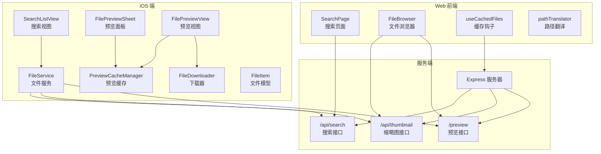
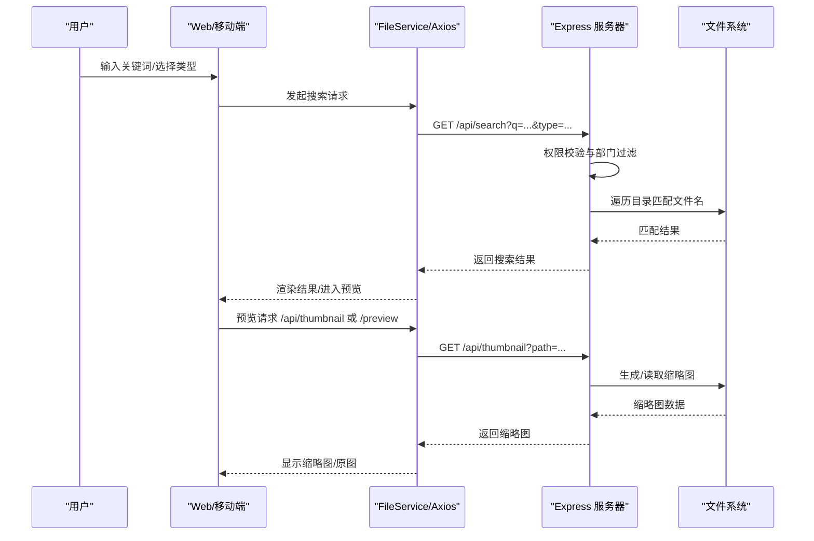
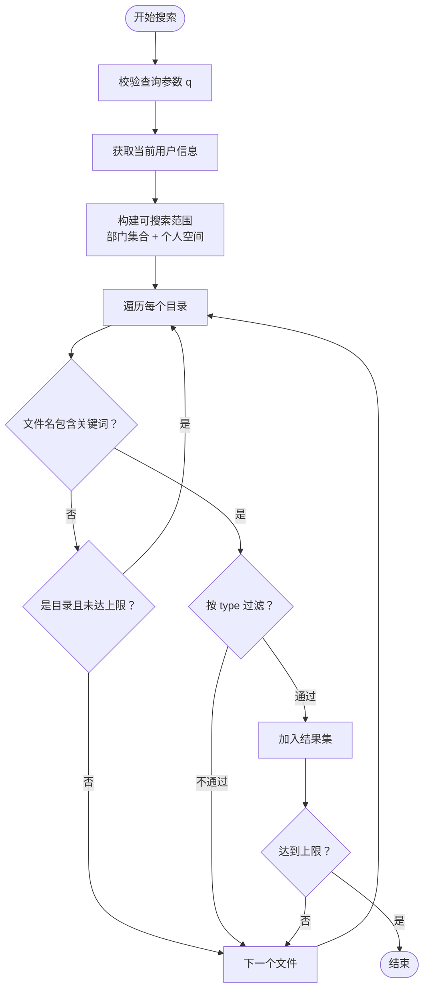
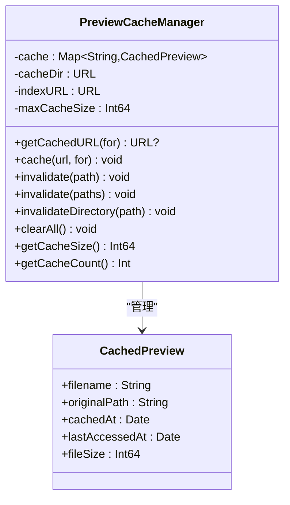
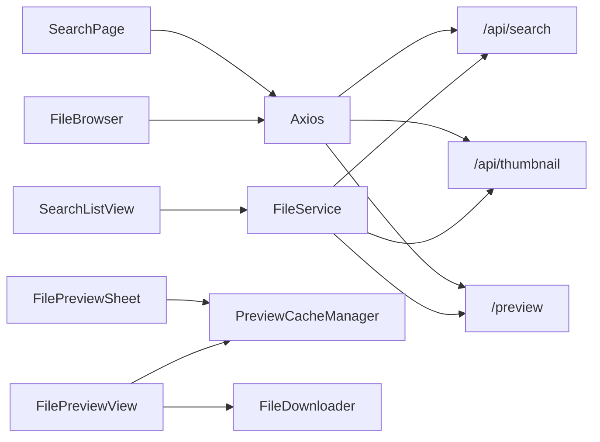

# 文件搜索预览

<cite>
**本文档引用的文件**
- [client/src/components/SearchPage.tsx](file://client/src/components/SearchPage.tsx)
- [client/src/components/FileBrowser.tsx](file://client/src/components/FileBrowser.tsx)
- [client/src/hooks/useCachedFiles.ts](file://client/src/hooks/useCachedFiles.ts)
- [client/src/utils/pathTranslator.ts](file://client/src/utils/pathTranslator.ts)
- [server/index.js](file://server/index.js)
- [ios/LonghornApp/Views/Files/SearchListView.swift](file://ios/LonghornApp/Views/Files/SearchListView.swift)
- [ios/LonghornApp/Services/FileService.swift](file://ios/LonghornApp/Services/FileService.swift)
- [ios/LonghornApp/Views/Components/FilePreviewSheet.swift](file://ios/LonghornApp/Views/Components/FilePreviewSheet.swift)
- [ios/LonghornApp/Views/Files/FilePreviewView.swift](file://ios/LonghornApp/Views/Files/FilePreviewView.swift)
- [ios/LonghornApp/Services/PreviewCacheManager.swift](file://ios/LonghornApp/Services/PreviewCacheManager.swift)
- [ios/LonghornApp/Services/FileDownloader.swift](file://ios/LonghornApp/Services/FileDownloader.swift)
- [ios/LonghornApp/Models/FileItem.swift](file://ios/LonghornApp/Models/FileItem.swift)
</cite>

## 目录
1. [简介](#简介)
2. [项目结构](#项目结构)
3. [核心组件](#核心组件)
4. [架构总览](#架构总览)
5. [详细组件分析](#详细组件分析)
6. [依赖关系分析](#依赖关系分析)
7. [性能考虑](#性能考虑)
8. [故障排除指南](#故障排除指南)
9. [结论](#结论)

## 简介
本文件系统提供完整的文件搜索与预览能力，覆盖 Web 端与 iOS 端。搜索功能基于关键词在受权限控制的部门空间与个人空间内进行目录遍历匹配，并支持按文件类型过滤；预览功能涵盖图片、视频、PDF、文本等多类型文件的在线浏览与缓存机制，同时提供移动端手势交互体验与离线缓存策略。

## 项目结构
前端采用 React + TypeScript，后端采用 Node.js + Express，iOS 采用 Swift + SwiftUI。整体采用“前后端分离 + 服务端静态资源直出”的架构，搜索与预览通过 REST API 完成，静态资源（缩略图、预览）由服务端直接提供。

图表来源
- [client/src/components/SearchPage.tsx](file://client/src/components/SearchPage.tsx#L19-L49)
- [client/src/components/FileBrowser.tsx](file://client/src/components/FileBrowser.tsx#L273-L294)
- [server/index.js](file://server/index.js#L1424-L1479)
- [ios/LonghornApp/Views/Files/SearchListView.swift](file://ios/LonghornApp/Views/Files/SearchListView.swift#L133-L151)
- [ios/LonghornApp/Services/FileService.swift](file://ios/LonghornApp/Services/FileService.swift#L58-L69)

章节来源
- [client/src/components/SearchPage.tsx](file://client/src/components/SearchPage.tsx#L1-L230)
- [client/src/components/FileBrowser.tsx](file://client/src/components/FileBrowser.tsx#L1-L800)
- [server/index.js](file://server/index.js#L1-L800)

## 核心组件
- 搜索页面（Web）：负责接收关键词输入、类型过滤、调用 /api/search 并渲染结果。
- 文件浏览器（Web）：提供目录浏览、文件列表、预览入口与缓存策略。
- 搜索视图（iOS）：提供搜索栏与类型筛选，调用 FileService 进行搜索。
- 文件服务（iOS）：封装 /api/search、/api/thumbnail、/preview 等 API。
- 预览面板（iOS）：支持图片、视频、PDF、文本等类型，集成缓存与手势交互。
- 预览缓存管理（iOS）：基于 LRU 的本地缓存，按大小上限清理。
- 缩略图与预览（服务端）：生成 WebP 缩略图、直出预览文件流。

章节来源
- [client/src/components/SearchPage.tsx](file://client/src/components/SearchPage.tsx#L19-L49)
- [client/src/components/FileBrowser.tsx](file://client/src/components/FileBrowser.tsx#L273-L294)
- [ios/LonghornApp/Views/Files/SearchListView.swift](file://ios/LonghornApp/Views/Files/SearchListView.swift#L133-L151)
- [ios/LonghornApp/Services/FileService.swift](file://ios/LonghornApp/Services/FileService.swift#L58-L69)
- [ios/LonghornApp/Views/Components/FilePreviewSheet.swift](file://ios/LonghornApp/Views/Components/FilePreviewSheet.swift#L1-L800)
- [ios/LonghornApp/Services/PreviewCacheManager.swift](file://ios/LonghornApp/Services/PreviewCacheManager.swift#L1-L219)
- [server/index.js](file://server/index.js#L481-L679)

## 架构总览
Web 与 iOS 均通过 FileService 或 Axios 调用 /api/search、/api/thumbnail、/preview 等端点。服务端根据用户权限确定可搜索范围（部门 + 个人空间），执行目录遍历匹配并返回结果。预览时优先使用缩略图快速加载，大图或原图按需下载并缓存。

图表来源
- [client/src/components/SearchPage.tsx](file://client/src/components/SearchPage.tsx#L30-L49)
- [ios/LonghornApp/Services/FileService.swift](file://ios/LonghornApp/Services/FileService.swift#L58-L69)
- [server/index.js](file://server/index.js#L1424-L1479)

## 详细组件分析

### 搜索实现与关键词匹配
- 查询参数
  - q：必填，搜索关键词
  - type：可选，文件类型过滤（image/video/document）
  - dept：可选，按部门代码过滤（如 MS/OP/RD/GE）
- 权限与范围
  - 管理员：可搜索所有部门与个人空间
  - 普通用户：仅限自身部门及授权部门的个人空间
- 匹配逻辑
  - 基于文件名包含匹配（不区分大小写）
  - 目录命中时递归搜索（最多返回 100 条）
  - 支持按扩展名进行类型过滤
- 结果结构
  - name、path、isDirectory、size、modified

图表来源
- [server/index.js](file://server/index.js#L1424-L1479)
- [server/index.js](file://server/index.js#L1481-L1521)

章节来源
- [server/index.js](file://server/index.js#L1424-L1479)
- [server/index.js](file://server/index.js#L1481-L1521)

### 搜索端点与参数说明
- 端点：GET /api/search
- 查询参数
  - q：字符串，必填
  - type：字符串，可选（image/video/document）
  - dept：字符串，可选（MS/OP/RD/GE）
- 响应
  - results：数组，每项包含 name、path、isDirectory、size、modified
  - total：整数，结果总数

章节来源
- [server/index.js](file://server/index.js#L1424-L1479)

### 文件预览与类型支持
- Web 端
  - 支持类型：图片（jpg/jpeg/png/gif/webp/heic/heif）、视频（mp4/mov/m4v/avi/hevc）、PDF、DOCX、XLSX/XLS、TXT/MD/JS/TS/CSS 等
  - 预览流程：根据扩展名判断，调用 /preview 或 /api/thumbnail 获取数据
- iOS 端
  - 支持类型：图片（jpg/jpeg/png/gif/webp/heic/heif）、视频（mp4/mov/m4v/avi/hevc）、PDF、文本（txt/md/json/xml/log/swift/js/ts/py）
  - 预览流程：优先使用缩略图快速展示，大图或原图按需下载并缓存

章节来源
- [client/src/components/FileBrowser.tsx](file://client/src/components/FileBrowser.tsx#L273-L294)
- [client/src/components/FileBrowser.tsx](file://client/src/components/FileBrowser.tsx#L482-L487)
- [ios/LonghornApp/Views/Components/FilePreviewSheet.swift](file://ios/LonghornApp/Views/Components/FilePreviewSheet.swift#L477-L695)
- [ios/LonghornApp/Views/Files/FilePreviewView.swift](file://ios/LonghornApp/Views/Files/FilePreviewView.swift#L40-L118)

### 预览缓存与离线策略（iOS）
- 缓存策略
  - LRU：按最后访问时间淘汰
  - 大小上限：默认 500MB，淘汰至 80%
  - 异步持久化：使用 JSON 存储索引，定期去孤儿文件
- 缓存接口
  - getCachedURL：获取缓存路径
  - cache：写入缓存并更新索引
  - invalidate/invalidateDirectory：失效指定路径或目录
- 下载器
  - FileDownloader：支持进度、速度计算与取消

图表来源
- [ios/LonghornApp/Services/PreviewCacheManager.swift](file://ios/LonghornApp/Services/PreviewCacheManager.swift#L10-L219)

章节来源
- [ios/LonghornApp/Services/PreviewCacheManager.swift](file://ios/LonghornApp/Services/PreviewCacheManager.swift#L1-L219)
- [ios/LonghornApp/Services/FileDownloader.swift](file://ios/LonghornApp/Services/FileDownloader.swift#L1-L106)

### 缩略图与预览服务（服务端）
- 缩略图接口：/api/thumbnail
  - 参数：path（必填）、size（可选，默认 200，preview=1200）
  - 支持格式：jpg/jpeg/png/gif/webp/bmp/tiff（图像）与视频/HEIC/HEIF（转码）
  - 缓存：磁盘缓存，命中则直接返回；否则生成后写入缓存
- 预览接口：/preview
  - 直接输出原始文件流，支持 Range 请求与缓存头

章节来源
- [server/index.js](file://server/index.js#L481-L679)
- [server/index.js](file://server/index.js#L397-L416)

### Web 端预览与缓存（补充）
- 缓存钩子：useCachedFiles 提供 SWR 缓存、去重与轮询刷新
- 预览渲染：根据扩展名选择渲染方式，支持 DOCX/XLSX/TXT/MD 等

章节来源
- [client/src/hooks/useCachedFiles.ts](file://client/src/hooks/useCachedFiles.ts#L1-L102)
- [client/src/components/FileBrowser.tsx](file://client/src/components/FileBrowser.tsx#L273-L294)

### iOS 搜索与预览联动
- 搜索视图：支持类型筛选，触发 FileService.searchFiles
- 文件模型：FileItem 统一字段映射，含扩展名、大小、上传者等
- 预览面板：支持左右滑动、下拉关闭、上拉详情，集成缓存与下载

章节来源
- [ios/LonghornApp/Views/Files/SearchListView.swift](file://ios/LonghornApp/Views/Files/SearchListView.swift#L1-L187)
- [ios/LonghornApp/Services/FileService.swift](file://ios/LonghornApp/Services/FileService.swift#L58-L69)
- [ios/LonghornApp/Models/FileItem.swift](file://ios/LonghornApp/Models/FileItem.swift#L1-L288)
- [ios/LonghornApp/Views/Components/FilePreviewSheet.swift](file://ios/LonghornApp/Views/Components/FilePreviewSheet.swift#L1-L800)

## 依赖关系分析
- Web 端
  - SearchPage 依赖 useAuthStore、useToast、useLanguage，调用 /api/search
  - FileBrowser 依赖 useCachedFiles，调用 /api/thumbnail 与 /preview
- 服务端
  - /api/search 依赖权限校验与目录遍历
  - /api/thumbnail 依赖 sharp/ffmpeg/sips，生成 WebP 缩略图
- iOS 端
  - FileService 统一封装 API 调用
  - FilePreviewSheet/View 依赖 PreviewCacheManager 与 FileDownloader

图表来源
- [client/src/components/SearchPage.tsx](file://client/src/components/SearchPage.tsx#L30-L49)
- [client/src/components/FileBrowser.tsx](file://client/src/components/FileBrowser.tsx#L273-L294)
- [ios/LonghornApp/Views/Files/SearchListView.swift](file://ios/LonghornApp/Views/Files/SearchListView.swift#L133-L151)
- [ios/LonghornApp/Services/FileService.swift](file://ios/LonghornApp/Services/FileService.swift#L58-L69)
- [ios/LonghornApp/Views/Components/FilePreviewSheet.swift](file://ios/LonghornApp/Views/Components/FilePreviewSheet.swift#L1-L800)
- [ios/LonghornApp/Views/Files/FilePreviewView.swift](file://ios/LonghornApp/Views/Files/FilePreviewView.swift#L1-L366)

章节来源
- [client/src/components/SearchPage.tsx](file://client/src/components/SearchPage.tsx#L1-L230)
- [client/src/components/FileBrowser.tsx](file://client/src/components/FileBrowser.tsx#L1-L800)
- [ios/LonghornApp/Views/Files/SearchListView.swift](file://ios/LonghornApp/Views/Files/SearchListView.swift#L1-L187)
- [ios/LonghornApp/Services/FileService.swift](file://ios/LonghornApp/Services/FileService.swift#L1-L419)
- [ios/LonghornApp/Views/Components/FilePreviewSheet.swift](file://ios/LonghornApp/Views/Components/FilePreviewSheet.swift#L1-L800)
- [ios/LonghornApp/Views/Files/FilePreviewView.swift](file://ios/LonghornApp/Views/Files/FilePreviewView.swift#L1-L366)

## 性能考虑
- 服务端
  - 缩略图并发队列：限制同时处理数量，避免 CPU/IO 抖动
  - 缓存策略：磁盘缓存 + ETag/Last-Modified，支持 Range 请求
  - 搜索上限：最多返回 100 条，降低 IO 压力
- 客户端
  - Web：SWR 去重与轮询，keepPreviousData 提升导航体验
  - iOS：LRU 缓存上限与异步持久化，避免占用过多存储

章节来源
- [server/index.js](file://server/index.js#L555-L577)
- [server/index.js](file://server/index.js#L481-L679)
- [client/src/hooks/useCachedFiles.ts](file://client/src/hooks/useCachedFiles.ts#L58-L85)
- [ios/LonghornApp/Services/PreviewCacheManager.swift](file://ios/LonghornApp/Services/PreviewCacheManager.swift#L147-L166)

## 故障排除指南
- 搜索无结果
  - 确认 q 参数非空
  - 检查 type/dept 参数是否正确
  - 确认当前用户对目标部门/个人空间有访问权限
- 预览失败
  - Web：检查 /api/thumbnail 与 /preview 的网络连通性与权限
  - iOS：确认缓存是否命中，必要时清理缓存后重试
- 缩略图异常
  - 检查 ffmpeg/sips 是否可用，确认源文件格式支持
  - 清理损坏缓存文件后重试

章节来源
- [server/index.js](file://server/index.js#L1424-L1479)
- [server/index.js](file://server/index.js#L580-L645)
- [ios/LonghornApp/Services/PreviewCacheManager.swift](file://ios/LonghornApp/Services/PreviewCacheManager.swift#L65-L80)

## 结论
本系统在 Web 与 iOS 端提供了统一的搜索与预览能力，服务端通过权限控制与目录遍历实现灵活的搜索，结合缩略图与缓存策略提升性能与用户体验。未来可在搜索算法层面引入权重排序、分页与高级过滤，以进一步增强检索效率与准确性。