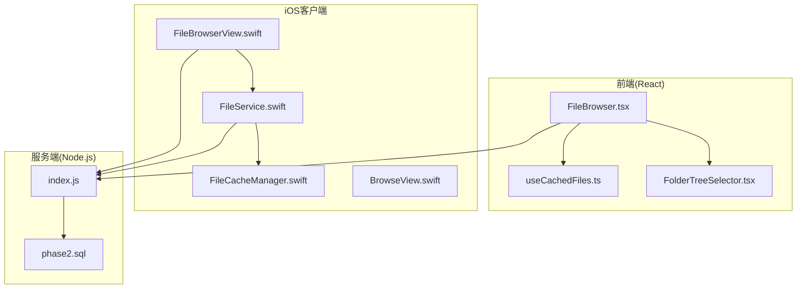
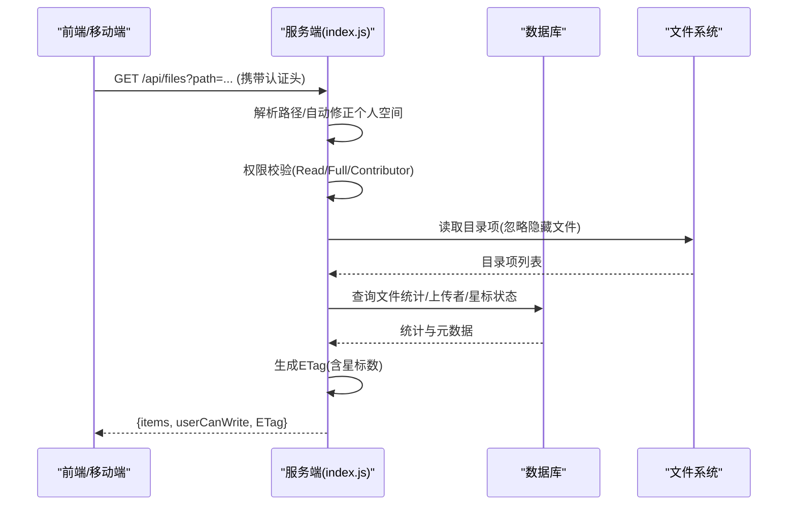
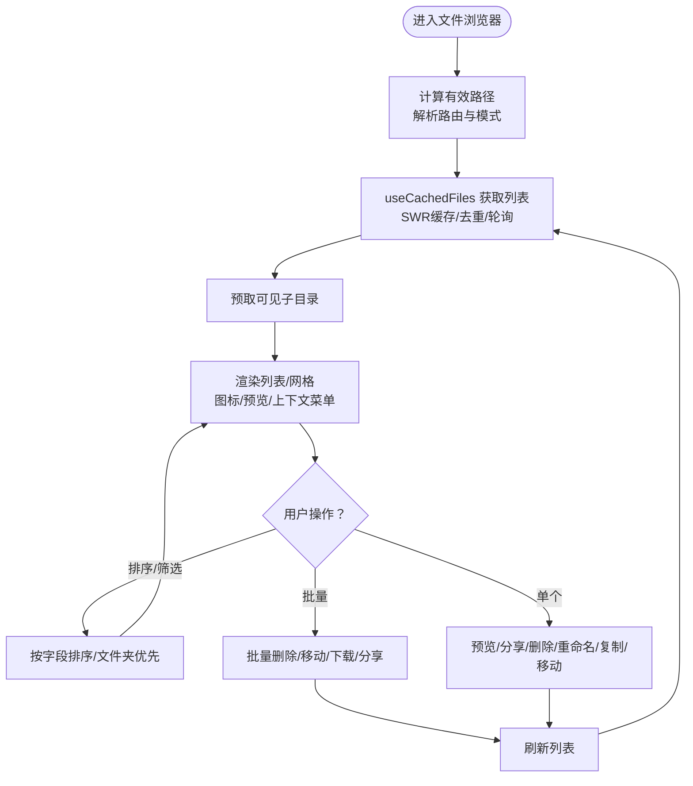
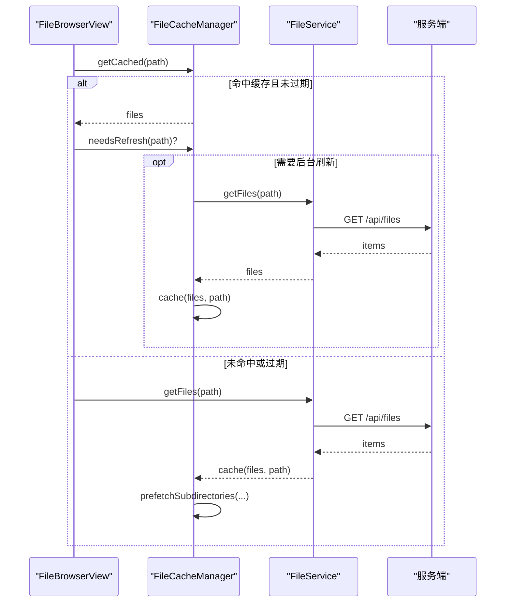
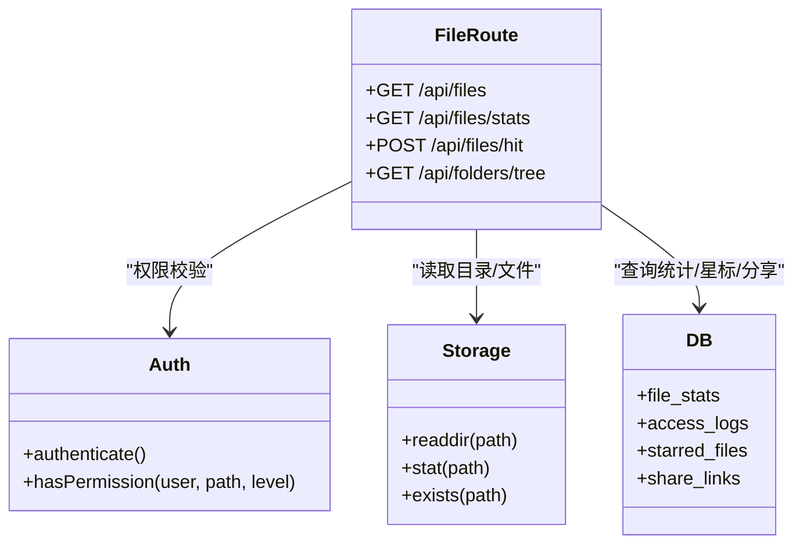
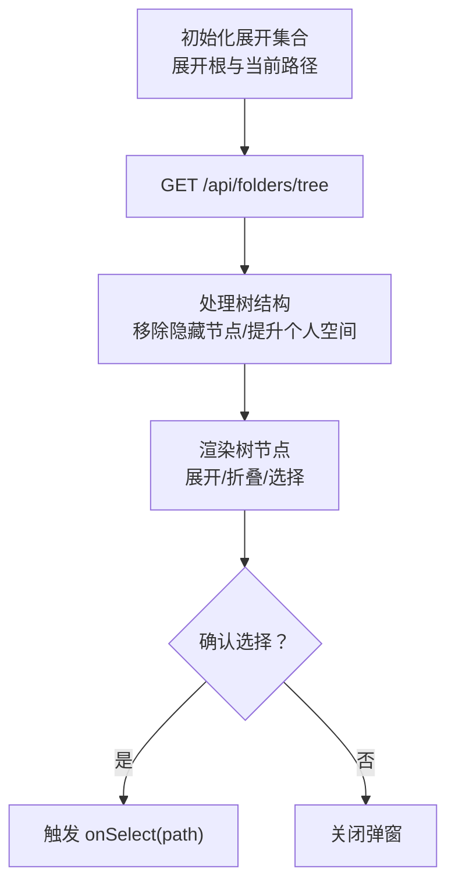
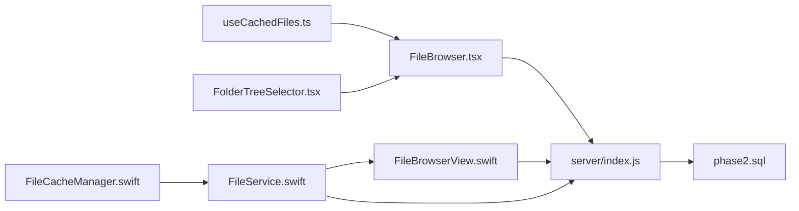

# 文件浏览导航

<cite>
**本文引用的文件**
- [client/src/components/FileBrowser.tsx](file://client/src/components/FileBrowser.tsx)
- [client/src/hooks/useCachedFiles.ts](file://client/src/hooks/useCachedFiles.ts)
- [client/src/components/FolderTreeSelector.tsx](file://client/src/components/FolderTreeSelector.tsx)
- [ios/LonghornApp/Services/FileService.swift](file://ios/LonghornApp/Services/FileService.swift)
- [ios/LonghornApp/Services/FileCacheManager.swift](file://ios/LonghornApp/Services/FileCacheManager.swift)
- [ios/LonghornApp/Views/Files/FileBrowserView.swift](file://ios/LonghornApp/Views/Files/FileBrowserView.swift)
- [ios/LonghornApp/Views/Main/BrowseView.swift](file://ios/LonghornApp/Views/Main/BrowseView.swift)
- [server/index.js](file://server/index.js)
- [server/migrations/phase2.sql](file://server/migrations/phase2.sql)
</cite>

## 目录
1. [简介](#简介)
2. [项目结构](#项目结构)
3. [核心组件](#核心组件)
4. [架构总览](#架构总览)
5. [详细组件分析](#详细组件分析)
6. [依赖关系分析](#依赖关系分析)
7. [性能考量](#性能考量)
8. [故障排查指南](#故障排查指南)
9. [结论](#结论)
10. [附录](#附录)

## 简介
本文件浏览导航系统为跨平台应用，提供统一的文件列表获取、目录遍历与文件夹树形结构展示能力，并通过 /api/files/* 系列端点实现目录读取、文件元数据获取与权限验证。系统支持文件排序、过滤与批量操作，具备图标显示、类型识别与特殊文件处理（如缩略图生成、大图预览、视频与HEIC处理）。移动端与Web端在交互方式与导航体验上有所差异，同时内置缓存与预取策略以提升性能与用户体验。

## 项目结构
系统由三部分组成：
- 前端（React + TypeScript）：负责文件列表渲染、交互、权限控制、批量操作与缓存预取。
- iOS 客户端（SwiftUI + Swift）：提供原生文件浏览、缓存与预取、上下文菜单与预览体验。
- 服务端（Node.js）：提供 /api/files/* 接口，执行权限校验、目录读取、元数据聚合与缩略图生成。

图表来源
- [client/src/components/FileBrowser.tsx](file://client/src/components/FileBrowser.tsx#L1-L200)
- [client/src/hooks/useCachedFiles.ts](file://client/src/hooks/useCachedFiles.ts#L1-L102)
- [client/src/components/FolderTreeSelector.tsx](file://client/src/components/FolderTreeSelector.tsx#L1-L120)
- [ios/LonghornApp/Services/FileService.swift](file://ios/LonghornApp/Services/FileService.swift#L1-L120)
- [ios/LonghornApp/Services/FileCacheManager.swift](file://ios/LonghornApp/Services/FileCacheManager.swift#L1-L80)
- [ios/LonghornApp/Views/Files/FileBrowserView.swift](file://ios/LonghornApp/Views/Files/FileBrowserView.swift#L1-L120)
- [ios/LonghornApp/Views/Main/BrowseView.swift](file://ios/LonghornApp/Views/Main/BrowseView.swift#L1-L120)
- [server/index.js](file://server/index.js#L2269-L2468)
- [server/migrations/phase2.sql](file://server/migrations/phase2.sql#L1-L32)

章节来源
- [client/src/components/FileBrowser.tsx](file://client/src/components/FileBrowser.tsx#L1-L200)
- [ios/LonghornApp/Services/FileService.swift](file://ios/LonghornApp/Services/FileService.swift#L1-L120)
- [server/index.js](file://server/index.js#L2269-L2468)

## 核心组件
- 文件浏览器（Web）：负责路径解析、文件列表获取、排序与筛选、图标与预览、批量操作、权限控制与缓存预取。
- 文件浏览器（iOS）：提供列表/网格视图、上下文菜单、预览与缩放、缓存与预取、搜索与权限控制。
- 文件服务与缓存（iOS）：封装网络请求、实现本地缓存与预取队列、后台刷新与过期管理。
- 服务端接口：提供 /api/files、/api/files/stats、/api/files/hit、/api/folders/tree 等端点，执行权限校验、目录读取、元数据聚合与缩略图生成。

章节来源
- [client/src/components/FileBrowser.tsx](file://client/src/components/FileBrowser.tsx#L72-L120)
- [client/src/hooks/useCachedFiles.ts](file://client/src/hooks/useCachedFiles.ts#L40-L86)
- [ios/LonghornApp/Services/FileService.swift](file://ios/LonghornApp/Services/FileService.swift#L18-L40)
- [ios/LonghornApp/Services/FileCacheManager.swift](file://ios/LonghornApp/Services/FileCacheManager.swift#L29-L82)
- [server/index.js](file://server/index.js#L2269-L2468)

## 架构总览
系统采用“前端/移动端 + 服务端”的分层架构：
- 前端/移动端通过认证令牌调用 /api/files/* 端点，服务端根据用户权限与路径解析规则返回目录项与元数据。
- 服务端对目录读取、权限校验、ETag 缓存与缩略图生成进行统一处理。
- iOS 端额外引入本地缓存与预取队列，提升导航与预览性能。

图表来源
- [server/index.js](file://server/index.js#L2269-L2440)

章节来源
- [server/index.js](file://server/index.js#L2269-L2440)

## 详细组件分析

### Web 文件浏览器（FileBrowser.tsx）
- 路径计算与模式：根据路由参数与模式（全部/个人/最近/星标）计算有效路径，支持个人空间导航跳转。
- 列表获取与缓存：通过 useCachedFiles Hook 使用 SWR 进行缓存、去重与轮询刷新，支持预取子目录。
- 排序与筛选：支持按名称、修改时间、大小、访问次数、上传者排序；文件夹优先于文件。
- 图标与预览：根据扩展名选择图标；图片使用缩略图 API；DOCX/XLSX/TXT/MD 等支持在线预览；大图提供缩放与原始图选项。
- 批量操作：支持批量删除、移动、下载与分享；提供选择全选/反选与上下文菜单。
- 权限与安全：所有请求均携带认证头；服务端对读取与写入权限进行校验；删除/移动/合并上传等操作均受控。

图表来源
- [client/src/components/FileBrowser.tsx](file://client/src/components/FileBrowser.tsx#L72-L120)
- [client/src/hooks/useCachedFiles.ts](file://client/src/hooks/useCachedFiles.ts#L40-L86)

章节来源
- [client/src/components/FileBrowser.tsx](file://client/src/components/FileBrowser.tsx#L72-L120)
- [client/src/hooks/useCachedFiles.ts](file://client/src/hooks/useCachedFiles.ts#L40-L86)

### iOS 文件浏览器（FileBrowserView.swift）
- 视图与模式：支持列表/网格视图与排序；提供搜索、刷新与批量操作栏。
- 缓存与预取：通过 FileCacheManager 实现本地缓存、后台刷新与子目录预取；采用“过期/完全过期”策略。
- 预览与缩放：支持图片缩放与双击放大；视频/HEIC 使用系统或 ffmpeg/sips 生成缩略图。
- 权限与导航：根据用户角色与授权位置动态展示部门与个人空间；支持上下文菜单与操作确认。

图表来源
- [ios/LonghornApp/Views/Files/FileBrowserView.swift](file://ios/LonghornApp/Views/Files/FileBrowserView.swift#L130-L144)
- [ios/LonghornApp/Services/FileCacheManager.swift](file://ios/LonghornApp/Services/FileCacheManager.swift#L137-L184)
- [ios/LonghornApp/Services/FileService.swift](file://ios/LonghornApp/Services/FileService.swift#L18-L40)

章节来源
- [ios/LonghornApp/Views/Files/FileBrowserView.swift](file://ios/LonghornApp/Views/Files/FileBrowserView.swift#L130-L144)
- [ios/LonghornApp/Services/FileCacheManager.swift](file://ios/LonghornApp/Services/FileCacheManager.swift#L137-L184)
- [ios/LonghornApp/Services/FileService.swift](file://ios/LonghornApp/Services/FileService.swift#L18-L40)

### 服务端接口与权限校验（server/index.js）
- /api/files：解析路径、自动修正个人空间、权限校验（Read）、读取目录、生成 ETag、聚合文件统计与上传者、返回 items 与 userCanWrite。
- /api/files/stats：基于路径查询访问日志，仅文件拥有者或具有 Full 权限用户可访问。
- /api/files/hit：记录访问统计（全局与用户级）。
- /api/folders/tree：返回文件夹树形结构，供选择器使用。
- 缩略图生成：支持图片与视频/HEIC，采用 sharp 与 ffmpeg/sips，带并发队列与缓存。

图表来源
- [server/index.js](file://server/index.js#L2269-L2468)
- [server/migrations/phase2.sql](file://server/migrations/phase2.sql#L1-L32)

章节来源
- [server/index.js](file://server/index.js#L2269-L2468)
- [server/migrations/phase2.sql](file://server/migrations/phase2.sql#L1-L32)

### 文件夹树形选择器（FolderTreeSelector.tsx）
- 功能：拉取 /api/folders/tree，构建树形结构，支持自动展开当前路径与父路径，允许用户选择目标目录。
- 逻辑：根据当前路径初始化展开集合；处理个人空间节点；提供确认与关闭回调。

图表来源
- [client/src/components/FolderTreeSelector.tsx](file://client/src/components/FolderTreeSelector.tsx#L21-L120)

章节来源
- [client/src/components/FolderTreeSelector.tsx](file://client/src/components/FolderTreeSelector.tsx#L21-L120)

### iOS 导航与权限入口（BrowseView.swift）
- 功能：根据用户角色与授权位置展示部门与特殊权限目录；提供搜索、最近文件、星标与分享等快捷入口。
- 交互：导航至 FileBrowserView 并传递路径与搜索范围。

章节来源
- [ios/LonghornApp/Views/Main/BrowseView.swift](file://ios/LonghornApp/Views/Main/BrowseView.swift#L41-L142)

## 依赖关系分析
- 前端依赖：
  - useCachedFiles：封装 SWR，统一缓存策略与预取。
  - FileBrowser：组合 useCachedFiles 与 UI 逻辑，处理排序、筛选、图标与预览。
  - FolderTreeSelector：依赖 /api/folders/tree。
- iOS 依赖：
  - FileService：封装 APIClient，统一请求与模型映射。
  - FileCacheManager：Actor 级缓存与预取队列，实现 stale-while-revalidate。
  - FileBrowserView：组合缓存与服务层，提供 UI 与交互。
- 服务端依赖：
  - 权限模块：hasPermission(user, path, level)。
  - 数据库：file_stats、access_logs、starred_files、share_links。
  - 文件系统：readdir/stat/exists。

图表来源
- [client/src/hooks/useCachedFiles.ts](file://client/src/hooks/useCachedFiles.ts#L40-L86)
- [client/src/components/FileBrowser.tsx](file://client/src/components/FileBrowser.tsx#L72-L120)
- [client/src/components/FolderTreeSelector.tsx](file://client/src/components/FolderTreeSelector.tsx#L21-L120)
- [ios/LonghornApp/Services/FileService.swift](file://ios/LonghornApp/Services/FileService.swift#L18-L40)
- [ios/LonghornApp/Services/FileCacheManager.swift](file://ios/LonghornApp/Services/FileCacheManager.swift#L29-L82)
- [ios/LonghornApp/Views/Files/FileBrowserView.swift](file://ios/LonghornApp/Views/Files/FileBrowserView.swift#L130-L144)
- [server/index.js](file://server/index.js#L2269-L2468)
- [server/migrations/phase2.sql](file://server/migrations/phase2.sql#L1-L32)

章节来源
- [client/src/hooks/useCachedFiles.ts](file://client/src/hooks/useCachedFiles.ts#L40-L86)
- [ios/LonghornApp/Services/FileCacheManager.swift](file://ios/LonghornApp/Services/FileCacheManager.swift#L29-L82)
- [server/index.js](file://server/index.js#L2269-L2468)

## 性能考量
- 前端缓存与去重：SWR 默认去重间隔 5 秒，保持旧数据即时显示，后台刷新，降低网络压力。
- iOS 缓存策略：本地缓存 5 分钟（stale），30 分钟完全过期；后台刷新与预取子目录，减少首屏等待。
- 缩略图与预览：图片使用 WebP 缓存与队列生成；视频/HEIC 使用 ffmpeg/sips；大图提供“预览尺寸”API，小图直接渲染。
- 目录遍历优化：忽略隐藏文件；深度目录的文件夹大小计算采用 ETag 排除目录大小，提升响应速度。
- 并发限制：缩略图生成最大并发 2，避免资源争用。

章节来源
- [client/src/hooks/useCachedFiles.ts](file://client/src/hooks/useCachedFiles.ts#L40-L86)
- [ios/LonghornApp/Services/FileCacheManager.swift](file://ios/LonghornApp/Services/FileCacheManager.swift#L16-L25)
- [server/index.js](file://server/index.js#L490-L658)

## 故障排查指南
- 无文件或权限不足
  - 现象：返回 403 或空列表。
  - 排查：确认路径解析与个人空间修正逻辑；检查用户角色与权限级别（Read/Full/Contributor）。
- 缩略图生成失败
  - 现象：缩略图 404 或失败。
  - 排查：检查 ffmpeg/sips 是否可用；查看缓存目录权限与磁盘空间；确认格式支持列表。
- 访问统计异常
  - 现象：访问次数未更新或查询失败。
  - 排查：确认 /api/files/hit 与 /api/files/stats 的权限要求（文件拥有者或 Full 权限）。
- 预览加载慢
  - 现象：图片/视频预览卡顿。
  - 排查：优先使用缩略图 API；检查网络与缓存命中率；确认并发队列未被占满。

章节来源
- [server/index.js](file://server/index.js#L2269-L2468)
- [server/index.js](file://server/index.js#L490-L658)

## 结论
该文件浏览导航系统通过前后端协同与缓存预取策略，在保证权限安全的前提下，实现了高效、一致的文件浏览体验。Web 与 iOS 在交互细节与缓存策略上各有侧重，但共享同一套服务端接口与权限模型，确保跨平台一致性与可维护性。

## 附录
- 端点清单与用途
  - GET /api/files：获取目录项与用户写权限。
  - GET /api/files/stats：获取文件访问统计（需拥有者或 Full 权限）。
  - POST /api/files/hit：记录访问统计。
  - GET /api/folders/tree：获取文件夹树形结构。
- 关键数据模型（服务端）
  - file_stats：文件访问统计与上传者。
  - access_logs：用户级访问日志。
  - starred_files：用户星标文件。
  - share_links：分享链接与访问计数。

章节来源
- [server/index.js](file://server/index.js#L2269-L2468)
- [server/migrations/phase2.sql](file://server/migrations/phase2.sql#L1-L32)