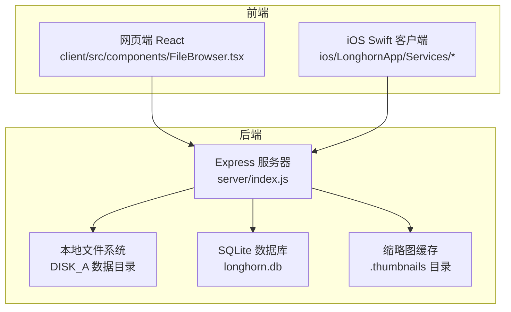
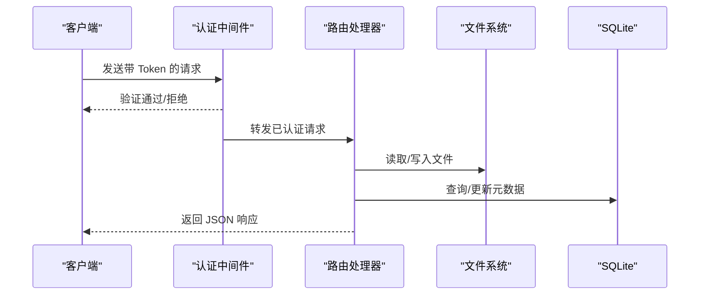
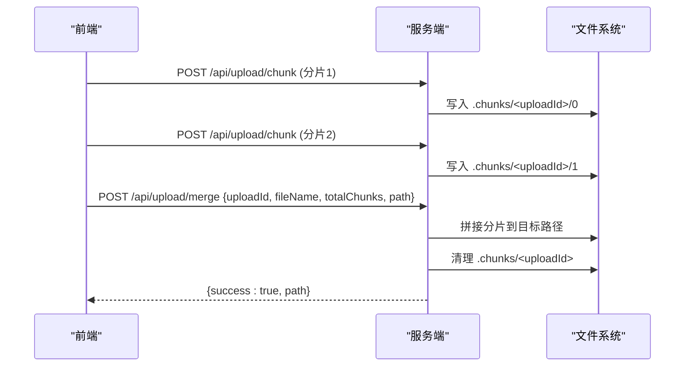
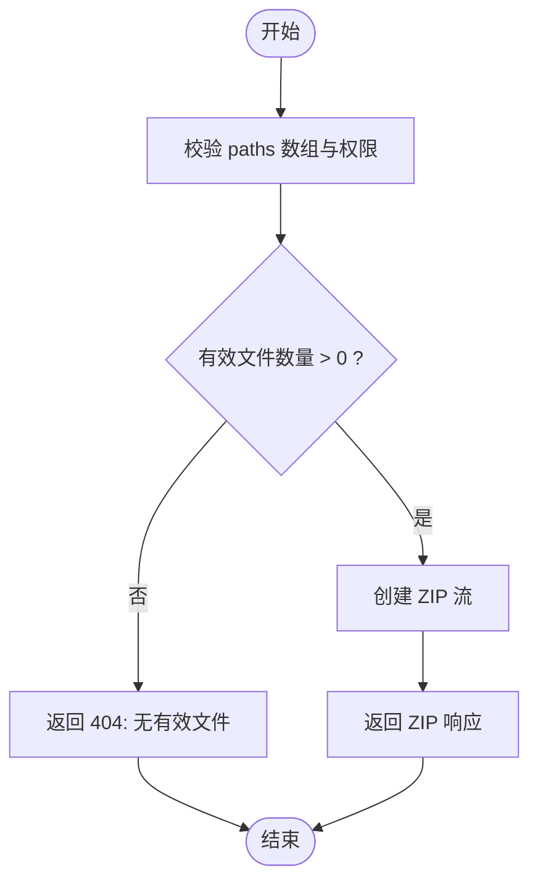
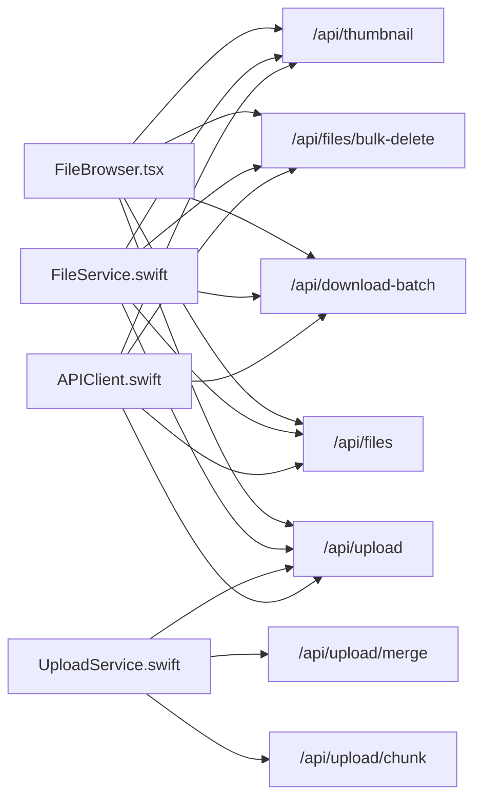

# 文件管理 API

<cite>
**本文档引用的文件**
- [server/index.js](file://server/index.js)
- [client/src/components/FileBrowser.tsx](file://client/src/components/FileBrowser.tsx)
- [client/src/hooks/useCachedFiles.ts](file://client/src/hooks/useCachedFiles.ts)
- [ios/LonghornApp/Services/FileService.swift](file://ios/LonghornApp/Services/FileService.swift)
- [ios/LonghornApp/Services/UploadService.swift](file://ios/LonghornApp/Services/UploadService.swift)
- [ios/LonghornApp/Services/APIClient.swift](file://ios/LonghornApp/Services/APIClient.swift)
- [client/README.md](file://client/README.md)
</cite>

## 目录
1. [简介](#简介)
2. [项目结构](#项目结构)
3. [核心组件](#核心组件)
4. [架构总览](#架构总览)
5. [详细组件分析](#详细组件分析)
6. [依赖关系分析](#依赖关系分析)
7. [性能考虑](#性能考虑)
8. [故障排除指南](#故障排除指南)
9. [结论](#结论)
10. [附录](#附录)

## 简介
本文件管理 API 文档系统性地梳理了后端服务与前端客户端之间的文件管理能力，覆盖上传、下载、浏览、搜索、删除、批量操作、分片上传与断点续传、缩略图生成与预览、权限验证与路径解析等核心功能。文档同时提供错误码定义、性能优化建议以及客户端集成示例，帮助开发者快速理解并正确使用接口。

## 项目结构
- 服务端采用 Node.js + Express，数据库为 SQLite，文件存储在本地磁盘，提供 RESTful 接口。
- 前端包含网页端 React 应用与 iOS Swift 应用，分别通过 HTTP 接口与服务端交互。
- 服务端提供统一的静态资源托管，支持 SPA 路由回退。

图表来源
- [server/index.js](file://server/index.js#L1-L50)
- [client/src/components/FileBrowser.tsx](file://client/src/components/FileBrowser.tsx#L1-L50)
- [ios/LonghornApp/Services/APIClient.swift](file://ios/LonghornApp/Services/APIClient.swift#L1-L60)

章节来源
- [server/index.js](file://server/index.js#L1-L50)
- [client/README.md](file://client/README.md#L1-L35)

## 核心组件
- 文件浏览与列表：支持按路径列出目录项，返回文件名、类型、大小、修改时间、访问计数、上传者、是否收藏等信息，并根据用户权限决定写入权限。
- 文件下载：支持单文件下载与批量打包下载；支持预览模式与真实下载。
- 文件上传：支持普通多文件上传与分片上传（分片接收与合并），并进行权限校验与元数据入库。
- 搜索：支持按关键词、类型、部门范围搜索，返回匹配结果。
- 删除与回收站：支持单个与批量删除，移至回收站并清理统计关联。
- 缩略图与预览：支持图片与视频缩略图生成与缓存，提供预览尺寸与质量控制。
- 权限与路径解析：支持中文部门名映射、路径规范化、部门级与个人空间权限控制、扩展权限表。
- 批量操作：支持批量移动、复制、删除、分享集合等。

章节来源
- [server/index.js](file://server/index.js#L2269-L2440)
- [server/index.js](file://server/index.js#L843-L932)
- [server/index.js](file://server/index.js#L1424-L1521)
- [server/index.js](file://server/index.js#L2585-L2622)
- [server/index.js](file://server/index.js#L482-L679)

## 架构总览
服务端通过中间件处理认证、CORS、压缩与静态资源；路由层按功能划分，包括文件操作、搜索、缩略图、权限、回收站、分享等。前端通过 Axios 或 URLSession 发起请求，后端对路径进行解析与权限校验，再访问文件系统与数据库。

图表来源
- [server/index.js](file://server/index.js#L267-L295)
- [server/index.js](file://server/index.js#L2269-L2440)

## 详细组件分析

### 文件上传 API
- 普通上传
  - 方法与路径：POST /api/upload
  - 查询参数：path（目标目录，可选，默认进入个人空间）
  - 请求体：multipart/form-data，字段 files[] 为多个文件
  - 权限：需具备目标目录 Full/Contributor 权限
  - 行为：解析路径、检查权限、确保目录存在、批量写入元数据
  - 响应：成功时返回 { success: true }
- 分片上传（客户端分片 + 服务端合并）
  - 分片接收：POST /api/upload/chunk
    - 请求体：multipart/form-data，字段包括 uploadId、fileName、chunkIndex、totalChunks、path
    - 行为：将分片保存到 DISK_A/.chunks/<uploadId>/<chunkIndex>
  - 分片合并：POST /api/upload/merge
    - 请求体：JSON，字段 uploadId、fileName、totalChunks、path
    - 行为：顺序拼接分片到目标路径，清理临时目录，更新 file_stats 元数据
- 断点续传
  - 客户端在中断后可重新上传缺失分片，服务端按索引顺序拼接
  - 通过 totalChunks 与实际分片数量比对判断完整性

图表来源
- [server/index.js](file://server/index.js#L843-L866)
- [server/index.js](file://server/index.js#L868-L932)
- [client/src/components/FileBrowser.tsx](file://client/src/components/FileBrowser.tsx#L340-L449)
- [ios/LonghornApp/Services/UploadService.swift](file://ios/LonghornApp/Services/UploadService.swift#L91-L159)

章节来源
- [server/index.js](file://server/index.js#L792-L841)
- [server/index.js](file://server/index.js#L843-L932)
- [client/src/components/FileBrowser.tsx](file://client/src/components/FileBrowser.tsx#L340-L449)
- [ios/LonghornApp/Services/UploadService.swift](file://ios/LonghornApp/Services/UploadService.swift#L59-L159)

### 文件下载与批量下载 API
- 单文件下载：GET /api/files?path=...&download=true
  - 权限：需具备 Read 权限
  - 行为：直接返回文件流
- 批量下载：POST /api/download-batch
  - 请求体：JSON，字段 paths 为文件路径数组
  - 行为：过滤有效且有权限的文件，打包为 zip 流返回
- 前端调用示例：
  - 网页端：POST /api/download-batch，响应为 blob，创建下载链接
  - iOS：APIClient.downloadBatchFiles 返回缓存路径

图表来源
- [server/index.js](file://server/index.js#L2624-L2677)
- [ios/LonghornApp/Services/APIClient.swift](file://ios/LonghornApp/Services/APIClient.swift#L147-L192)

章节来源
- [server/index.js](file://server/index.js#L2297-L2304)
- [server/index.js](file://server/index.js#L2624-L2677)
- [ios/LonghornApp/Services/APIClient.swift](file://ios/LonghornApp/Services/APIClient.swift#L147-L192)

### 文件浏览与列表 API
- 路径解析：resolvePath 将中文部门名映射为代码，统一大小写，规范化路径
- 权限校验：hasPermission 支持 Admin、Lead、Member、个人空间、扩展权限
- 列表接口：GET /api/files?path=...
  - 返回 items（含 name、isDirectory、path、size、mtime、access_count、uploader、starred）与 userCanWrite
  - 使用 ETag 缓存，基于文件名、修改时间、大小与收藏数生成
- 最近文件：GET /api/files/recent
- 星标文件：GET /api/starred

章节来源
- [server/index.js](file://server/index.js#L233-L259)
- [server/index.js](file://server/index.js#L300-L353)
- [server/index.js](file://server/index.js#L1329-L1360)
- [server/index.js](file://server/index.js#L1531-L1592)
- [server/index.js](file://server/index.js#L2269-L2440)

### 搜索 API
- GET /api/search?q=...&type=...&dept=...
  - 支持关键词、类型（image/video/document）、部门范围过滤
  - 递归遍历允许访问的部门与个人空间，限制返回数量上限
- 词汇表接口：GET /api/vocabulary/batch（批量随机）

章节来源
- [server/index.js](file://server/index.js#L1424-L1521)
- [server/index.js](file://server/index.js#L431-L475)

### 删除与回收站 API
- 单个删除：DELETE /api/files?path=...
- 批量删除：POST /api/files/bulk-delete
- 回收站：GET /api/recycle-bin，恢复：POST /api/recycle-bin/restore/:id，清空：DELETE /api/recycle-bin-clear

章节来源
- [server/index.js](file://server/index.js#L2585-L2622)
- [server/index.js](file://server/index.js#L2875-L2957)

### 缩略图与预览 API
- 缩略图：GET /api/thumbnail?path=...&size=...
  - 支持图片与视频/HEIC/HEIF；图片用 sharp，视频/HEIC 用 ffmpeg/sips
  - 缓存策略：基于源文件 mtime 与缓存文件大小判断有效性
  - 预览模式：size=preview 使用更高分辨率与质量
- 回收站缩略图：GET /api/recycle-bin/thumbnail?path=...&size=...

章节来源
- [server/index.js](file://server/index.js#L482-L679)
- [server/index.js](file://server/index.js#L2959-L3049)

### 权限与路径解析
- 路径解析：resolvePath 将中文部门名映射为代码，统一大小写，规范化 NFC
- 权限判定：hasPermission 支持 Admin、个人空间、部门级（Lead/Member）、扩展权限表
- 部门显示映射：DEPT_DISPLAY_MAP 与 NAME_TO_CODE

章节来源
- [server/index.js](file://server/index.js#L233-L259)
- [server/index.js](file://server/index.js#L300-L353)
- [server/index.js](file://server/index.js#L114-L122)

### 前端集成示例

#### 网页端（React）
- 文件列表：useCachedFiles 提供 SWR 缓存、去重与轮询
- 上传：支持分片上传，前端按 5MB 分片，逐片上传并合并
- 批量操作：批量删除、移动、下载、分享集合
- 预览：DOCX/XLSX/文本等在线预览，缩略图优先

章节来源
- [client/src/hooks/useCachedFiles.ts](file://client/src/hooks/useCachedFiles.ts#L40-L86)
- [client/src/components/FileBrowser.tsx](file://client/src/components/FileBrowser.tsx#L340-L449)
- [client/src/components/FileBrowser.tsx](file://client/src/components/FileBrowser.tsx#L536-L562)
- [client/README.md](file://client/README.md#L11-L17)

#### iOS 端（Swift）
- APIClient：统一封装 GET/POST/DELETE/PUT，自动添加 Authorization 头
- FileService：封装文件列表、搜索、删除、批量删除、移动、重命名、复制、收藏、分享、回收站等
- UploadService：分片上传（5MB 分片）、进度回调、取消、合并

章节来源
- [ios/LonghornApp/Services/APIClient.swift](file://ios/LonghornApp/Services/APIClient.swift#L68-L108)
- [ios/LonghornApp/Services/FileService.swift](file://ios/LonghornApp/Services/FileService.swift#L18-L84)
- [ios/LonghornApp/Services/UploadService.swift](file://ios/LonghornApp/Services/UploadService.swift#L59-L159)

## 依赖关系分析

图表来源
- [client/src/components/FileBrowser.tsx](file://client/src/components/FileBrowser.tsx#L340-L449)
- [ios/LonghornApp/Services/FileService.swift](file://ios/LonghornApp/Services/FileService.swift#L18-L84)
- [ios/LonghornApp/Services/UploadService.swift](file://ios/LonghornApp/Services/UploadService.swift#L59-L159)
- [ios/LonghornApp/Services/APIClient.swift](file://ios/LonghornApp/Services/APIClient.swift#L68-L108)

章节来源
- [client/src/components/FileBrowser.tsx](file://client/src/components/FileBrowser.tsx#L340-L449)
- [ios/LonghornApp/Services/FileService.swift](file://ios/LonghornApp/Services/FileService.swift#L18-L84)
- [ios/LonghornApp/Services/UploadService.swift](file://ios/LonghornApp/Services/UploadService.swift#L59-L159)
- [ios/LonghornApp/Services/APIClient.swift](file://ios/LonghornApp/Services/APIClient.swift#L68-L108)

## 性能考虑
- 缓存与压缩：启用 gzip 压缩与静态资源缓存；目录列表使用 ETag 实现条件请求
- 缩略图并发控制：缩略图生成队列限制并发数，避免 CPU/IO 过载
- 分片上传：客户端默认 5MB 分片，减少网络波动影响；服务端顺序拼接，保证一致性
- 批量操作：批量删除/移动使用循环与事务，减少多次 IO
- 预览与缩略图：优先使用缓存，缓存失效时再生成；视频缩略图使用 ffmpeg/sips 并限制并发

章节来源
- [server/index.js](file://server/index.js#L418-L427)
- [server/index.js](file://server/index.js#L555-L577)
- [client/src/components/FileBrowser.tsx](file://client/src/components/FileBrowser.tsx#L349-L406)
- [ios/LonghornApp/Services/UploadService.swift](file://ios/LonghornApp/Services/UploadService.swift#L55-L159)

## 故障排除指南
- 400 参数错误：缺少必要参数（如分片元数据、路径、查询参数）
- 401 未认证：Authorization 头缺失或无效
- 403 权限不足：无读/写/删除权限或非本人上传文件重命名
- 404 资源不存在：文件/路径不存在或分享链接过期
- 500 服务器内部错误：缩略图生成失败、分片合并异常、数据库操作失败
- 常见问题定位：
  - 路径编码：前端需对路径进行 URL 编码
  - 中文路径：服务端使用 NFC 规范化，注意 NFD/NFC 差异
  - 权限边界：个人空间与部门空间权限不同，扩展权限需检查过期时间

章节来源
- [server/index.js](file://server/index.js#L843-L866)
- [server/index.js](file://server/index.js#L868-L932)
- [server/index.js](file://server/index.js#L2585-L2622)
- [server/index.js](file://server/index.js#L482-L679)

## 结论
本文件管理 API 在权限控制、路径解析、缩略图与预览、批量与分片上传等方面提供了完善的实现。前后端通过清晰的 RESTful 接口协作，结合缓存与并发控制，能够满足企业级文件管理场景的需求。建议在生产环境中配合 CDN、监控与日志体系进一步提升稳定性与可观测性。

## 附录

### 接口清单与规范

- 文件浏览
  - GET /api/files?path=...&download=false
  - 返回 items 与 userCanWrite
- 文件下载
  - GET /api/files?path=...&download=true
  - POST /api/download-batch
- 文件上传
  - POST /api/upload?path=...
  - POST /api/upload/chunk
  - POST /api/upload/merge
- 文件操作
  - DELETE /api/files?path=...
  - POST /api/files/bulk-delete
  - POST /api/files/rename
  - POST /api/files/copy
  - POST /api/files/bulk-move
- 缩略图与预览
  - GET /api/thumbnail?path=...&size=...
  - GET /api/recycle-bin/thumbnail?path=...&size=...
- 搜索
  - GET /api/search?q=...&type=...&dept=...
- 收藏
  - GET /api/starred
  - POST /api/starred
  - DELETE /api/starred/:id
  - GET /api/starred/check?path=...
- 回收站
  - GET /api/recycle-bin
  - POST /api/recycle-bin/restore/:id
  - DELETE /api/recycle-bin/:id
  - DELETE /api/recycle-bin-clear

章节来源
- [server/index.js](file://server/index.js#L2269-L2440)
- [server/index.js](file://server/index.js#L2585-L2622)
- [server/index.js](file://server/index.js#L2624-L2677)
- [server/index.js](file://server/index.js#L843-L932)
- [server/index.js](file://server/index.js#L482-L679)
- [server/index.js](file://server/index.js#L1424-L1521)
- [server/index.js](file://server/index.js#L1531-L1592)
- [server/index.js](file://server/index.js#L2875-L2957)