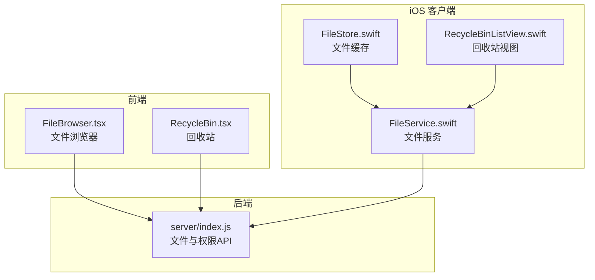
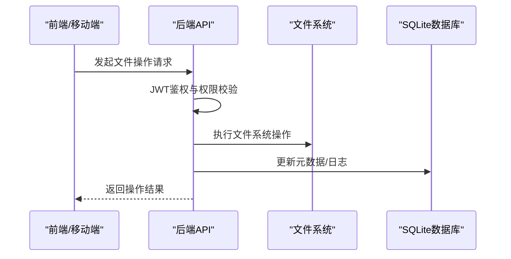
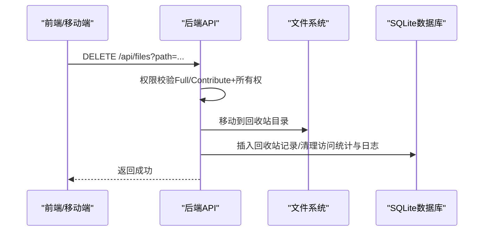
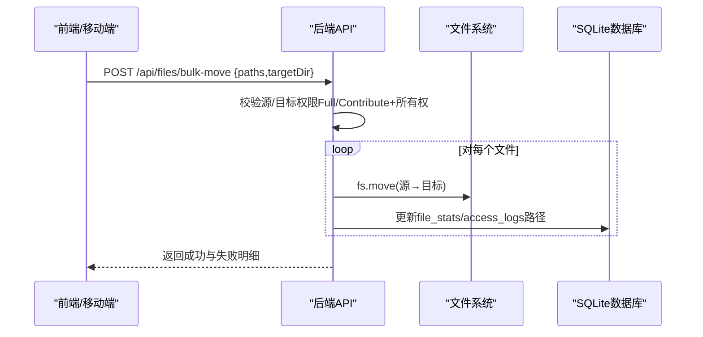
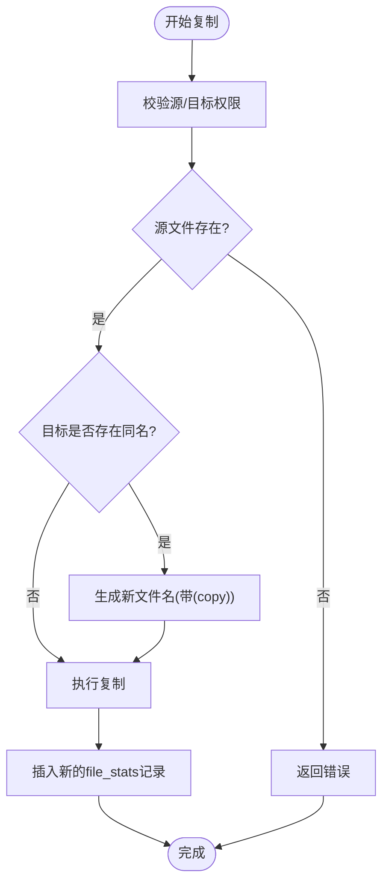
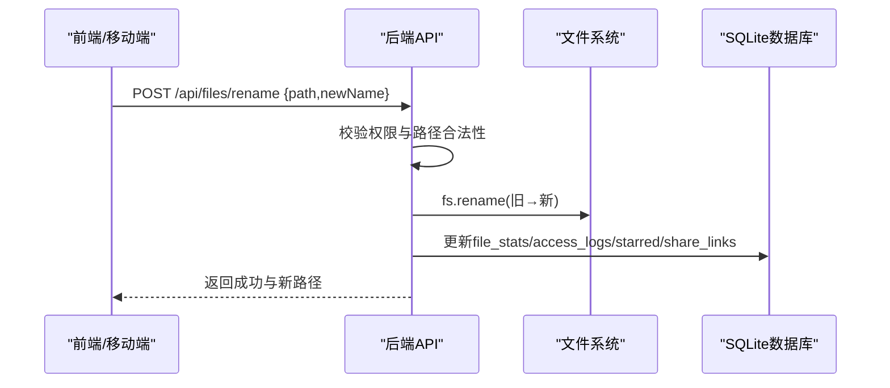
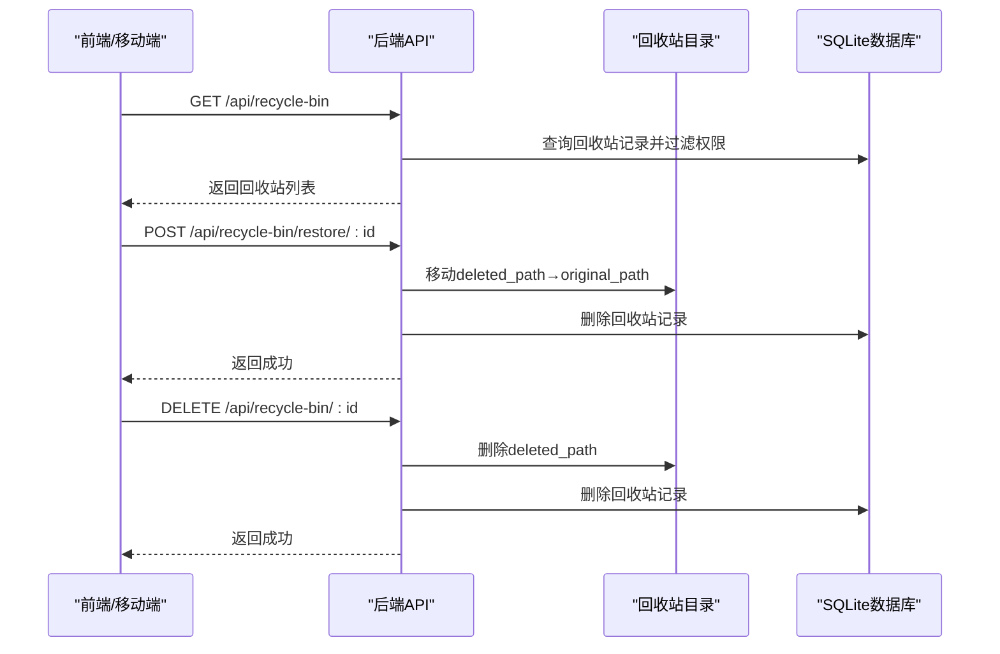
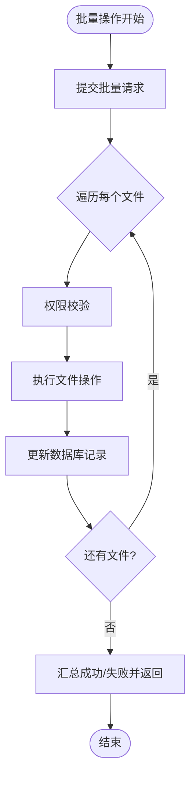
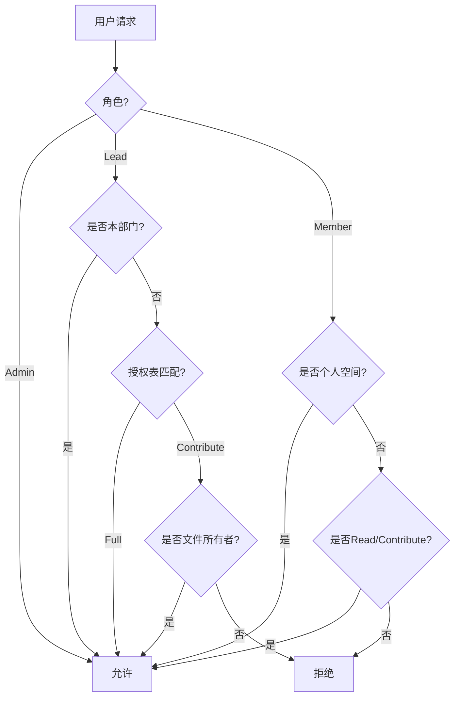
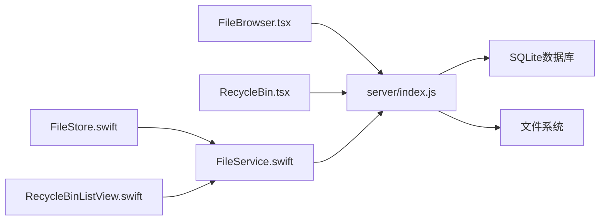

# 文件管理操作

<cite>
**本文档引用的文件**
- [client/src/components/FileBrowser.tsx](file://client/src/components/FileBrowser.tsx)
- [client/src/components/RecycleBin.tsx](file://client/src/components/RecycleBin.tsx)
- [ios/LonghornApp/Services/FileService.swift](file://ios/LonghornApp/Services/FileService.swift)
- [ios/LonghornApp/Services/FileStore.swift](file://ios/LonghornApp/Services/FileStore.swift)
- [ios/LonghornApp/Views/RecycleBin/RecycleBinListView.swift](file://ios/LonghornApp/Views/RecycleBin/RecycleBinListView.swift)
- [server/index.js](file://server/index.js)
- [docs/CONTRIBUTE_PERMISSION_IMPLEMENTATION.md](file://docs/CONTRIBUTE_PERMISSION_IMPLEMENTATION.md)
</cite>

## 目录
1. [简介](#简介)
2. [项目结构](#项目结构)
3. [核心组件](#核心组件)
4. [架构总览](#架构总览)
5. [详细组件分析](#详细组件分析)
6. [依赖关系分析](#依赖关系分析)
7. [性能考虑](#性能考虑)
8. [故障排除指南](#故障排除指南)
9. [结论](#结论)

## 简介
本文件面向文件管理操作的技术文档，围绕删除、移动、复制、重命名等核心操作进行深入解析，并覆盖回收站软删除、永久删除与恢复机制；同时阐述批量操作支持、权限验证与安全检查、并发访问控制与数据一致性保障、版本管理与历史审计、以及性能监控与优化建议。文档基于前端 React/Ts、iOS Swift 与 Node.js 后端的实际实现进行梳理，确保读者能够准确理解各模块职责与交互流程。

## 项目结构
Longhorn 采用前后端分离架构：
- 前端（React + TypeScript）：负责文件浏览、批量操作、预览、分享、回收站等 UI 与交互。
- iOS 客户端（Swift）：提供文件操作服务封装、缓存与批量操作支持。
- 后端（Node.js + better-sqlite3）：提供文件 API、权限校验、回收站、访问统计、分享集合等能力。

**图表来源**
- [client/src/components/FileBrowser.tsx](file://client/src/components/FileBrowser.tsx#L1-L200)
- [client/src/components/RecycleBin.tsx](file://client/src/components/RecycleBin.tsx#L1-L120)
- [ios/LonghornApp/Services/FileService.swift](file://ios/LonghornApp/Services/FileService.swift#L1-L120)
- [ios/LonghornApp/Services/FileStore.swift](file://ios/LonghornApp/Services/FileStore.swift#L1-L80)
- [ios/LonghornApp/Views/RecycleBin/RecycleBinListView.swift](file://ios/LonghornApp/Views/RecycleBin/RecycleBinListView.swift#L1-L120)
- [server/index.js](file://server/index.js#L1-L120)

**章节来源**
- [client/src/components/FileBrowser.tsx](file://client/src/components/FileBrowser.tsx#L1-L200)
- [client/src/components/RecycleBin.tsx](file://client/src/components/RecycleBin.tsx#L1-L120)
- [ios/LonghornApp/Services/FileService.swift](file://ios/LonghornApp/Services/FileService.swift#L1-L120)
- [ios/LonghornApp/Services/FileStore.swift](file://ios/LonghornApp/Services/FileStore.swift#L1-L80)
- [ios/LonghornApp/Views/RecycleBin/RecycleBinListView.swift](file://ios/LonghornApp/Views/RecycleBin/RecycleBinListView.swift#L1-L120)
- [server/index.js](file://server/index.js#L1-L120)

## 核心组件
- 文件浏览器（前端）：提供文件列表、预览、上传、删除、移动、复制、重命名、批量操作、收藏、分享等功能入口。
- 回收站（前端）：列出回收站条目，支持批量恢复与永久删除。
- 文件服务（iOS）：封装文件操作 API（删除、批量删除、移动、复制、重命名、回收站操作），并提供访问统计与分享接口。
- 文件缓存（iOS）：维护文件列表缓存、加载状态与乐观更新，提升浏览与操作体验。
- 回收站视图（iOS）：支持批量选择、滑动操作、清空回收站等。
- 文件 API（后端）：实现文件 CRUD、批量操作、回收站、权限校验、访问统计、分享集合等。

**章节来源**
- [client/src/components/FileBrowser.tsx](file://client/src/components/FileBrowser.tsx#L524-L642)
- [client/src/components/RecycleBin.tsx](file://client/src/components/RecycleBin.tsx#L60-L120)
- [ios/LonghornApp/Services/FileService.swift](file://ios/LonghornApp/Services/FileService.swift#L81-L175)
- [ios/LonghornApp/Services/FileStore.swift](file://ios/LonghornApp/Services/FileStore.swift#L46-L120)
- [ios/LonghornApp/Views/RecycleBin/RecycleBinListView.swift](file://ios/LonghornApp/Views/RecycleBin/RecycleBinListView.swift#L118-L238)
- [server/index.js](file://server/index.js#L2700-L2795)

## 架构总览
文件管理操作遵循“前端/移动端发起请求 → 后端鉴权与权限校验 → 文件系统与数据库操作 → 返回结果”的统一流程。权限体系支持 Admin、Lead、Member 与授权目录三种维度，结合“只读/贡献/完全”三级权限，确保细粒度的安全控制。

**图表来源**
- [server/index.js](file://server/index.js#L268-L295)
- [server/index.js](file://server/index.js#L298-L353)
- [server/index.js](file://server/index.js#L2737-L2795)

**章节来源**
- [server/index.js](file://server/index.js#L268-L353)

## 详细组件分析

### 文件删除操作
- 前端删除：调用删除 API，传入文件路径，删除后刷新列表。
- iOS 删除：通过文件服务调用删除 API，支持批量删除。
- 后端删除：执行软删除（移动到回收站），记录回收站条目与清理访问统计与日志。

**图表来源**
- [client/src/components/FileBrowser.tsx](file://client/src/components/FileBrowser.tsx#L524-L534)
- [ios/LonghornApp/Services/FileService.swift](file://ios/LonghornApp/Services/FileService.swift#L81-L91)
- [server/index.js](file://server/index.js#L369-L389)

**章节来源**
- [client/src/components/FileBrowser.tsx](file://client/src/components/FileBrowser.tsx#L524-L534)
- [ios/LonghornApp/Services/FileService.swift](file://ios/LonghornApp/Services/FileService.swift#L81-L91)
- [server/index.js](file://server/index.js#L369-L389)

### 文件移动操作
- 前端移动：选择多个文件与目标目录，提交批量移动请求。
- iOS 移动：通过文件服务提交批量移动请求。
- 后端移动：校验源与目标权限，逐项移动并更新数据库路径字段。

**图表来源**
- [client/src/components/FileBrowser.tsx](file://client/src/components/FileBrowser.tsx#L564-L598)
- [ios/LonghornApp/Services/FileService.swift](file://ios/LonghornApp/Services/FileService.swift#L93-L97)
- [server/index.js](file://server/index.js#L2797-L2845)

**章节来源**
- [client/src/components/FileBrowser.tsx](file://client/src/components/FileBrowser.tsx#L564-L598)
- [ios/LonghornApp/Services/FileService.swift](file://ios/LonghornApp/Services/FileService.swift#L93-L97)
- [server/index.js](file://server/index.js#L2797-L2845)

### 文件复制操作
- 前端复制：提交源路径与目标目录，后端自动处理重名冲突。
- iOS 复制：通过文件服务提交复制请求。
- 后端复制：检测目标重名并追加“(copy)”后缀，复制文件并插入新的文件统计记录。

**图表来源**
- [server/index.js](file://server/index.js#L2737-L2795)

**章节来源**
- [server/index.js](file://server/index.js#L2737-L2795)

### 文件重命名操作
- 前端重命名：提交旧路径与新名称，后端执行重命名并更新数据库关联记录。
- iOS 重命名：通过文件服务提交重命名请求。
- 后端重命名：校验源存在与目标不冲突，执行重命名并同步更新多张表的路径。

**图表来源**
- [server/index.js](file://server/index.js#L2700-L2734)

**章节来源**
- [server/index.js](file://server/index.js#L2700-L2734)

### 回收站功能
- 前端回收站：展示回收站条目，支持批量恢复与永久删除，清空回收站。
- iOS 回收站：支持批量选择、滑动操作、清空回收站。
- 后端回收站：软删除时写入回收站表；恢复时移动回原路径；永久删除时物理删除并清理记录；支持定时清理超期条目。

**图表来源**
- [client/src/components/RecycleBin.tsx](file://client/src/components/RecycleBin.tsx#L60-L120)
- [ios/LonghornApp/Views/RecycleBin/RecycleBinListView.swift](file://ios/LonghornApp/Views/RecycleBin/RecycleBinListView.swift#L162-L238)
- [server/index.js](file://server/index.js#L2876-L2957)

**章节来源**
- [client/src/components/RecycleBin.tsx](file://client/src/components/RecycleBin.tsx#L60-L120)
- [ios/LonghornApp/Views/RecycleBin/RecycleBinListView.swift](file://ios/LonghornApp/Views/RecycleBin/RecycleBinListView.swift#L162-L238)
- [server/index.js](file://server/index.js#L2876-L2957)

### 批量操作支持与错误回滚
- 前端批量：选择多个文件后统一提交批量删除/移动请求，后端返回成功计数与失败明细，前端提示部分成功。
- iOS 批量：通过文件服务逐项提交，支持批量恢复/永久删除。
- 错误回滚：后端对每个文件逐一处理，失败项单独记录，不因个别失败影响整体流程。

**图表来源**
- [client/src/components/FileBrowser.tsx](file://client/src/components/FileBrowser.tsx#L536-L562)
- [ios/LonghornApp/Views/RecycleBin/RecycleBinListView.swift](file://ios/LonghornApp/Views/RecycleBin/RecycleBinListView.swift#L218-L238)
- [server/index.js](file://server/index.js#L2797-L2845)

**章节来源**
- [client/src/components/FileBrowser.tsx](file://client/src/components/FileBrowser.tsx#L536-L562)
- [ios/LonghornApp/Views/RecycleBin/RecycleBinListView.swift](file://ios/LonghornApp/Views/RecycleBin/RecycleBinListView.swift#L218-L238)
- [server/index.js](file://server/index.js#L2797-L2845)

### 权限验证与安全检查
- 角色与部门：Admin 全权限；Lead 在本部门内拥有部分权限；Member 默认只读或贡献。
- 授权目录：通过 permissions 表授予 Read/Contribute/Full 权限，支持过期时间。
- 文件所有权：删除/移动等 Full 权限操作需校验文件上传者是否为当前用户。
- 前端/移动端：均携带 JWT Token，后端统一鉴权与权限校验。

**图表来源**
- [server/index.js](file://server/index.js#L298-L353)
- [docs/CONTRIBUTE_PERMISSION_IMPLEMENTATION.md](file://docs/CONTRIBUTE_PERMISSION_IMPLEMENTATION.md#L92-L133)

**章节来源**
- [server/index.js](file://server/index.js#L298-L353)
- [docs/CONTRIBUTE_PERMISSION_IMPLEMENTATION.md](file://docs/CONTRIBUTE_PERMISSION_IMPLEMENTATION.md#L31-L192)

### 并发访问控制与数据一致性
- 并发控制：前端/移动端通过请求队列与确认对话框避免误操作；后端对批量操作逐项处理，失败不影响其他项。
- 数据一致性：文件系统与数据库双写，路径变更同步更新多张表；删除/移动/复制均在事务中更新元数据。
- 缓存一致性：iOS 文件缓存支持乐观更新与失效，确保 UI 与后端一致。

**章节来源**
- [client/src/components/FileBrowser.tsx](file://client/src/components/FileBrowser.tsx#L536-L598)
- [ios/LonghornApp/Services/FileStore.swift](file://ios/LonghornApp/Services/FileStore.swift#L87-L139)
- [server/index.js](file://server/index.js#L2737-L2795)

### 文件版本管理、历史记录与审计日志
- 版本与历史：后端未实现传统“版本文件”机制，但通过 file_stats、access_logs、starred_files、share_links 等表记录访问、收藏、分享等历史信息。
- 审计日志：access_logs 记录每次访问的用户、次数与最近访问时间；删除/移动/复制等操作伴随数据库记录变更，便于审计追踪。

**章节来源**
- [server/index.js](file://server/index.js#L1271-L1313)
- [server/index.js](file://server/index.js#L1530-L1592)

### 性能监控与优化
- 前端：分片上传（5MB 块）、进度回调、速率显示；缩略图缓存与压缩；预取子目录加速导航。
- 后端：WAL 模式数据库、压缩中间件、静态资源缓存；缩略图生成队列限制 CPU/IO；回收站定时清理。
- iOS：文件缓存与加载状态管理，避免重复请求；批量操作异步执行并反馈进度。

**章节来源**
- [client/src/components/FileBrowser.tsx](file://client/src/components/FileBrowser.tsx#L340-L449)
- [server/index.js](file://server/index.js#L418-L475)
- [server/index.js](file://server/index.js#L555-L577)
- [server/index.js](file://server/index.js#L3051-L3070)
- [ios/LonghornApp/Services/FileStore.swift](file://ios/LonghornApp/Services/FileStore.swift#L46-L85)

## 依赖关系分析

**图表来源**
- [client/src/components/FileBrowser.tsx](file://client/src/components/FileBrowser.tsx#L1-L120)
- [client/src/components/RecycleBin.tsx](file://client/src/components/RecycleBin.tsx#L1-L120)
- [ios/LonghornApp/Services/FileService.swift](file://ios/LonghornApp/Services/FileService.swift#L1-L120)
- [ios/LonghornApp/Services/FileStore.swift](file://ios/LonghornApp/Services/FileStore.swift#L1-L80)
- [ios/LonghornApp/Views/RecycleBin/RecycleBinListView.swift](file://ios/LonghornApp/Views/RecycleBin/RecycleBinListView.swift#L1-L120)
- [server/index.js](file://server/index.js#L1-L120)

**章节来源**
- [client/src/components/FileBrowser.tsx](file://client/src/components/FileBrowser.tsx#L1-L120)
- [client/src/components/RecycleBin.tsx](file://client/src/components/RecycleBin.tsx#L1-L120)
- [ios/LonghornApp/Services/FileService.swift](file://ios/LonghornApp/Services/FileService.swift#L1-L120)
- [ios/LonghornApp/Services/FileStore.swift](file://ios/LonghornApp/Services/FileStore.swift#L1-L80)
- [ios/LonghornApp/Views/RecycleBin/RecycleBinListView.swift](file://ios/LonghornApp/Views/RecycleBin/RecycleBinListView.swift#L1-L120)
- [server/index.js](file://server/index.js#L1-L120)

## 性能考虑
- 前端分片上传与进度反馈，降低大文件失败风险。
- 后端缩略图生成队列与缓存，避免高并发导致的 CPU/IO 泄漏。
- SQLite WAL 模式与压缩中间件，提升并发读写与网络传输效率。
- iOS 文件缓存与懒加载，减少重复请求与渲染开销。

[本节为通用指导，无需具体文件分析]

## 故障排除指南
- 删除/移动失败：检查权限（角色/部门/授权/所有权），确认文件是否存在，查看后端错误日志。
- 批量操作部分成功：根据返回的失败明细逐项排查权限与路径问题。
- 回收站无法恢复：确认用户权限与原始路径访问权限，检查回收站条目状态。
- iOS 加载异常：检查缓存状态与网络请求，必要时强制刷新缓存。

**章节来源**
- [client/src/components/FileBrowser.tsx](file://client/src/components/FileBrowser.tsx#L536-L598)
- [client/src/components/RecycleBin.tsx](file://client/src/components/RecycleBin.tsx#L90-L118)
- [ios/LonghornApp/Views/RecycleBin/RecycleBinListView.swift](file://ios/LonghornApp/Views/RecycleBin/RecycleBinListView.swift#L162-L238)
- [server/index.js](file://server/index.js#L298-L353)

## 结论
Longhorn 的文件管理操作在权限模型、批量处理、回收站机制与跨端一致性方面具备清晰的设计与实现。通过严格的权限校验、细粒度的批量回滚策略、完善的回收站生命周期管理，以及前后端的性能优化手段，系统在易用性与安全性之间取得了良好平衡。建议后续可考虑引入版本化存储与更丰富的审计指标，以进一步增强合规与追溯能力。