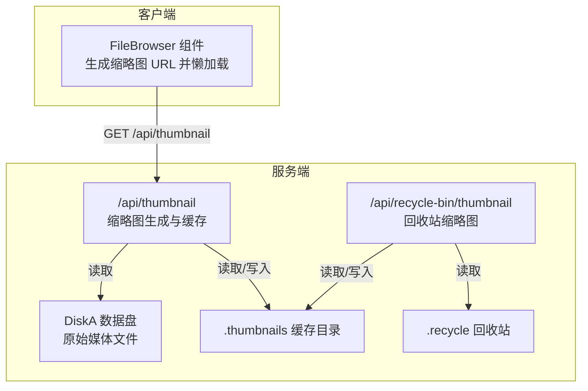
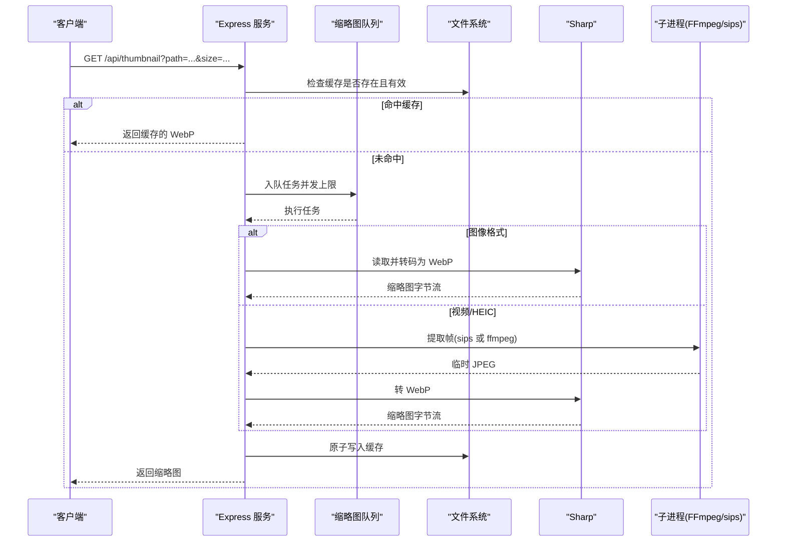
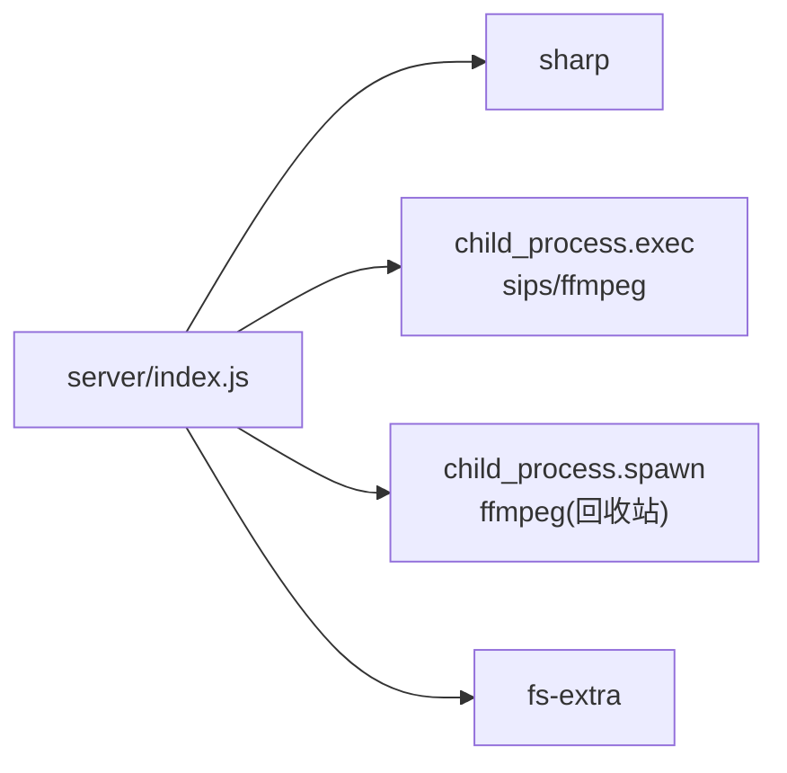

# 缩略图生成

<cite>
**本文引用的文件**
- [server/index.js](file://server/index.js)
- [server/package.json](file://server/package.json)
- [client/src/components/FileBrowser.tsx](file://client/src/components/FileBrowser.tsx)
</cite>

## 目录
1. [简介](#简介)
2. [项目结构](#项目结构)
3. [核心组件](#核心组件)
4. [架构总览](#架构总览)
5. [详细组件分析](#详细组件分析)
6. [依赖关系分析](#依赖关系分析)
7. [性能考量](#性能考量)
8. [故障排除指南](#故障排除指南)
9. [结论](#结论)

## 简介
本文件面向缩略图生成功能的技术文档，聚焦于后端 /api/thumbnail 端点的实现原理与工程实践，覆盖以下主题：
- 图片与视频缩略图的生成算法与流程
- 支持的文件格式、尺寸参数与质量控制策略
- 缓存策略、文件系统存储与内存管理
- HEIC/HEIF 的 macOS 原生 sips 集成与 FFmpeg 视频帧提取
- 缩略图队列管理、并发控制与性能优化
- 错误处理、日志记录与故障排除

## 项目结构
缩略图功能主要由服务端 Express 应用提供，前端通过静态资源与 API 调用配合展示缩略图。

图表来源
- [server/index.js](file://server/index.js#L617-L813)
- [server/index.js](file://server/index.js#L3094-L3183)
- [client/src/components/FileBrowser.tsx](file://client/src/components/FileBrowser.tsx#L774-L795)

章节来源
- [server/index.js](file://server/index.js#L19-L22)
- [client/src/components/FileBrowser.tsx](file://client/src/components/FileBrowser.tsx#L774-L795)

## 核心组件
- 缩略图 API（主站数据盘）：/api/thumbnail
- 回收站缩略图 API：/api/recycle-bin/thumbnail
- 前端懒加载缩略图：FileBrowser 组件在列表中以 /api/thumbnail?path=...&size=200 加载缩略图，并在失败时回退到 /preview 原始预览

章节来源
- [server/index.js](file://server/index.js#L617-L813)
- [server/index.js](file://server/index.js#L3094-L3183)
- [client/src/components/FileBrowser.tsx](file://client/src/components/FileBrowser.tsx#L774-L795)

## 架构总览
缩略图生成采用“请求触发 + 队列化 + 缓存优先”的设计，兼顾并发控制与稳定性。

图表来源
- [server/index.js](file://server/index.js#L617-L813)
- [server/index.js](file://server/index.js#L713-L792)

## 详细组件分析

### /api/thumbnail 实现要点
- 参数与尺寸
  - size 默认 200；当 size=preview 时使用更大尺寸与更高质量
  - fit 模式：preview 使用保留宽高比的 inside，常规使用 cover 裁剪
  - 质量：preview 85，常规 75
- 支持格式
  - 图像：.jpg, .jpeg, .png, .gif, .webp, .bmp, .tiff
  - 视频/HEIF：.mov, .mp4, .m4v, .avi, .mkv, .hevc, .heic, .heif
- 路径与权限
  - 解码路径，拼接 DISK_A 根目录
  - 文件存在性校验，不存在返回 404
- 缓存策略
  - 缓存键：基于解码后的文件路径与尺寸
  - 缓存目录：THUMB_DIR（.thumbnails）
  - 命中条件：缓存文件大小>0 且 mtime 新于源文件
  - 命中则直接返回，设置长缓存头
- 队列与并发
  - 自定义队列，限制最大并发（默认 2），避免 CPU/IO 过载
  - 任务执行完成后自动推进队列
- 生成流程
  - 图像：直接使用 sharp 处理，旋转（EXIF 方向）、缩放、WebP 转码
  - 视频/HEIC：
    - HEIC：macOS 原生 sips 转 JPEG
    - 视频：优先尝试 1 秒帧，失败回退起始帧；使用 scale+crop 保证目标尺寸与比例
  - 临时文件：生成后删除
  - 原子写入缓存：先写临时文件再 rename，避免竞态
- 错误处理
  - FFmpeg 日志写入专用日志文件
  - 输出为空或失败时返回 404/500
  - 缓存损坏文件自动清理

章节来源
- [server/index.js](file://server/index.js#L617-L642)
- [server/index.js](file://server/index.js#L644-L649)
- [server/index.js](file://server/index.js#L651-L685)
- [server/index.js](file://server/index.js#L689-L711)
- [server/index.js](file://server/index.js#L713-L792)
- [server/index.js](file://server/index.js#L794-L807)

### /api/recycle-bin/thumbnail 实现要点
- 与主站缩略图 API 类似，但读取 RECYCLE_DIR 下的回收站文件
- 缓存键带 recycle_ 前缀，避免与主站冲突
- 视频路径使用 spawn 调用 ffmpeg，提取 1 秒帧或首帧

章节来源
- [server/index.js](file://server/index.js#L3094-L3183)

### 前端调用与回退机制
- 列表视图：懒加载 /api/thumbnail?path=...&size=200
- 大图预览：当文件大于 1MB 时使用 size=preview
- 错误回退：缩略图加载失败时回退到 /preview 原始预览

章节来源
- [client/src/components/FileBrowser.tsx](file://client/src/components/FileBrowser.tsx#L774-L795)
- [client/src/components/FileBrowser.tsx](file://client/src/components/FileBrowser.tsx#L817-L824)

### HEIC/HEIF 与 FFmpeg 集成细节
- HEIC：优先使用 macOS 原生 sips 将 HEIC 转换为 JPEG，再交由 sharp 转 WebP
- 视频：优先使用 ffmpeg 在 1 秒处抽取帧，失败回退至起始帧；通过滤镜 scale+crop 保证目标尺寸与比例一致
- 日志：FFmpeg 错误写入 THUMB_DIR/ffmpeg_error.log，便于定位问题

章节来源
- [server/index.js](file://server/index.js#L738-L745)
- [server/index.js](file://server/index.js#L748-L760)
- [server/index.js](file://server/index.js#L717-L717)

### 缓存策略与文件系统
- 缓存目录：THUMB_DIR（.thumbnails）
- 命中即返回，未命中才生成；生成后原子写入缓存
- 缓存失效：当源文件更新时间晚于缓存时，重新生成
- 回收站缓存：独立键空间，避免与主站冲突

章节来源
- [server/index.js](file://server/index.js#L651-L685)
- [server/index.js](file://server/index.js#L3120-L3138)

### 内存管理与并发控制
- 队列化：自定义数组队列 + 计数器，限制并发数量
- 任务粒度：每个缩略图生成作为一个任务，串行推进
- 临时文件：生成后立即删除，避免磁盘占用累积
- 原子写入：先写临时文件再 rename，避免部分写入导致的缓存损坏

章节来源
- [server/index.js](file://server/index.js#L689-L711)
- [server/index.js](file://server/index.js#L794-L802)

## 依赖关系分析
- 依赖 sharp 进行图像处理与 WebP 转码
- 依赖 child_process（exec/spawn）调用 sips/ffmpeg
- 依赖 fs-extra 进行文件系统操作（读写、移动、删除）

图表来源
- [server/index.js](file://server/index.js#L12)
- [server/index.js](file://server/index.js#L715)
- [server/index.js](file://server/index.js#L3155)
- [server/package.json](file://server/package.json#L28)

章节来源
- [server/package.json](file://server/package.json#L15-L29)

## 性能考量
- 缩略图尺寸与质量
  - 常规 200×200，质量 75；大图模式 1200×1200，质量 85
  - fit 模式：inside 保持比例，cover 裁剪填充
- 并发控制
  - 默认最大并发 2，适合树莓派/迷你 PC 等资源受限场景
  - 可根据硬件能力调整（需修改常量）
- 缓存命中率
  - 命中缓存可显著降低 CPU/IO 开销
  - 建议前端批量请求时复用相同尺寸，提升命中率
- 临时文件与磁盘
  - 生成后立即删除临时文件，避免磁盘压力
  - 原子写入减少竞态与损坏风险
- FFmpeg 选择
  - 优先 sips 处理 HEIC，更稳定
  - 视频帧提取优先 1 秒帧，失败回退首帧

章节来源
- [server/index.js](file://server/index.js#L627-L630)
- [server/index.js](file://server/index.js#L689-L711)
- [server/index.js](file://server/index.js#L738-L745)

## 故障排除指南
- 常见错误与定位
  - 不支持的格式：检查扩展名是否在支持列表内
  - 文件不存在：确认 path 是否正确、文件是否存在于 DISK_A
  - FFmpeg 失败：查看 THUMB_DIR/ffmpeg_error.log 中的错误信息与时间戳
  - 缓存损坏：当缓存文件大小为 0 时会自动清理并重新生成
- 前端回退
  - 缩略图加载失败时自动回退到 /preview 原始预览，确保可用性
- 排查步骤建议
  - 检查服务端日志与 ffmpeg_error.log
  - 确认 ffmpeg/sips 可执行文件路径与权限
  - 验证 THUMB_DIR 与 DISK_A 权限
  - 适当提高并发或降低并发以平衡性能与稳定性

章节来源
- [server/index.js](file://server/index.js#L640-L642)
- [server/index.js](file://server/index.js#L646-L649)
- [server/index.js](file://server/index.js#L751-L758)
- [server/index.js](file://server/index.js#L762-L779)
- [client/src/components/FileBrowser.tsx](file://client/src/components/FileBrowser.tsx#L783-L792)

## 结论
本实现以“缓存优先 + 队列化 + 原子写入”为核心，结合 sharp 与 FFmpeg/sips，实现了对多格式媒体的稳定缩略图生成。通过合理的并发控制与错误处理，能够在资源受限设备上保持良好性能与可靠性。建议在生产环境中持续监控 ffmpeg_error.log 与缓存命中率，并根据业务规模调整并发与缓存策略。