# 服务API文档

<cite>
**本文档引用的文件**
- [API_DOCUMENTATION.md](file://docs/API_DOCUMENTATION.md)
- [Service_API.md](file://docs/Service_API.md)
- [index.js](file://server/index.js)
- [App.tsx](file://client/src/App.tsx)
- [package.json](file://server/package.json)
- [tickets.js](file://server/service/routes/tickets.js)
- [auth.js](file://server/service/routes/auth.js)
- [products.js](file://server/service/routes/products.js)
- [dealers.js](file://server/service/routes/dealers.js)
- [settings.js](file://server/service/routes/settings.js)
- [warranty.js](file://server/service/routes/warranty.js)
- [parts.js](file://server/service/routes/parts.js)
- [permission.js](file://server/service/middleware/permission.js)
- [useAuthStore.ts](file://client/src/store/useAuthStore.ts)
</cite>

## 目录
1. [简介](#简介)
2. [项目结构](#项目结构)
3. [核心组件](#核心组件)
4. [架构概览](#架构概览)
5. [详细组件分析](#详细组件分析)
6. [依赖关系分析](#依赖关系分析)
7. [性能考虑](#性能考虑)
8. [故障排除指南](#故障排除指南)
9. [结论](#结论)

## 简介

Longhorn是一个企业级服务管理系统，提供完整的工单管理、客户服务、产品管理和配件管理功能。该系统采用前后端分离架构，后端基于Node.js + Express，前端使用React + TypeScript构建。

### 系统特性
- **统一工单管理**：支持咨询工单、RMA返厂单、经销商维修单等多种工单类型
- **多部门协作**：基于部门的权限控制系统，支持跨部门协作
- **产品生命周期管理**：从产品注册到保修计算的完整流程
- **配件库存管理**：完整的配件目录和报价系统
- **AI集成**：内置AI助手，支持智能问答和文档处理

## 项目结构

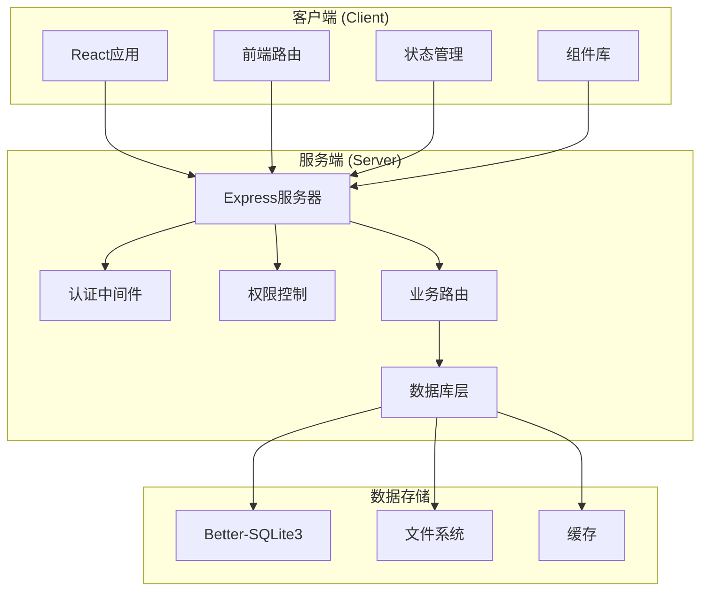

**图表来源**
- [index.js:1-800](file://server/index.js#L1-800)
- [App.tsx:1-800](file://client/src/App.tsx#L1-800)

**章节来源**
- [index.js:1-800](file://server/index.js#L1-800)
- [App.tsx:1-800](file://client/src/App.tsx#L1-800)

## 核心组件

### 1. 认证系统

系统采用JWT令牌认证机制，支持员工、经销商和客户三种用户类型：

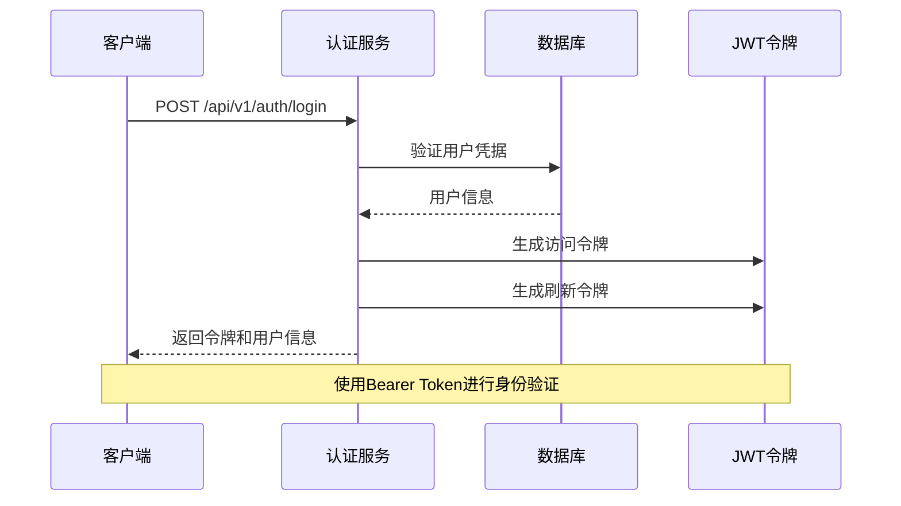

**图表来源**
- [auth.js:17-103](file://server/service/routes/auth.js#L17-103)

### 2. 工单管理系统

统一的工单API，支持多种工单类型和复杂的权限控制：

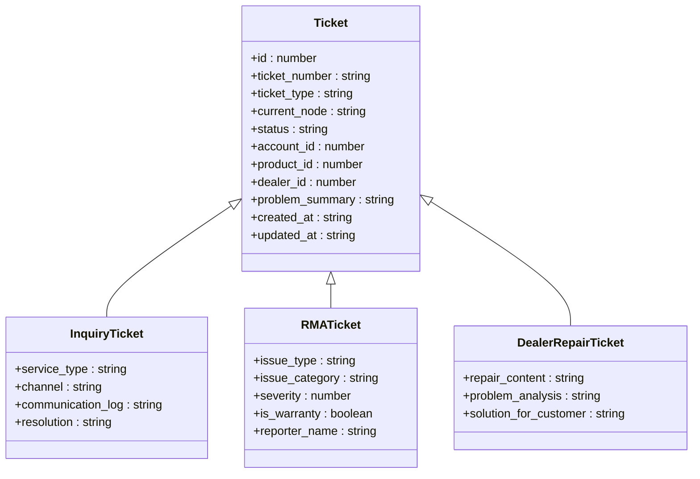

**图表来源**
- [tickets.js:18-551](file://server/service/routes/tickets.js#L18-551)

### 3. 权限控制系统

基于部门和角色的细粒度权限管理：

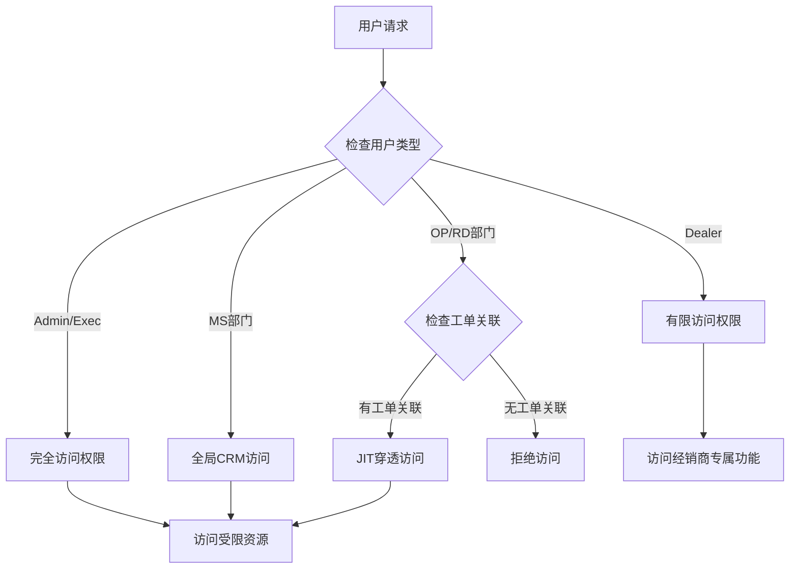

**图表来源**
- [permission.js:34-138](file://server/service/middleware/permission.js#L34-138)

**章节来源**
- [auth.js:17-282](file://server/service/routes/auth.js#L17-282)
- [tickets.js:18-800](file://server/service/routes/tickets.js#L18-800)
- [permission.js:1-232](file://server/service/middleware/permission.js#L1-232)

## 架构概览

### 系统架构图

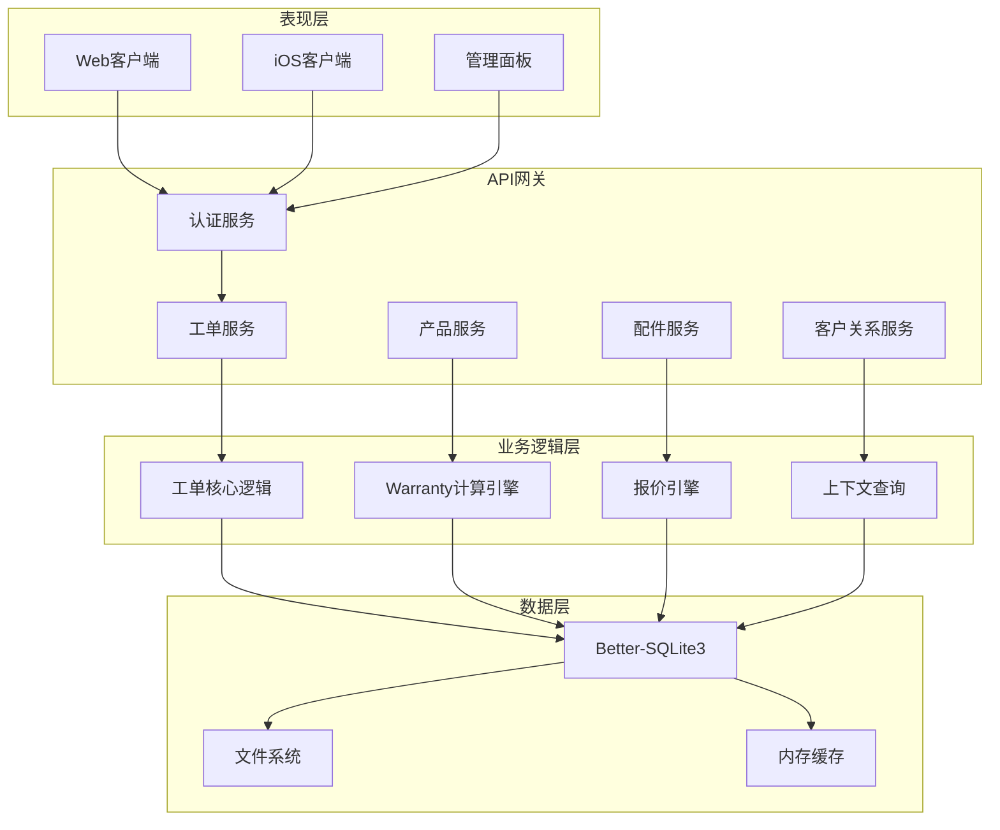

**图表来源**
- [index.js:1-800](file://server/index.js#L1-800)
- [tickets.js:1-800](file://server/service/routes/tickets.js#L1-800)

### 数据流图

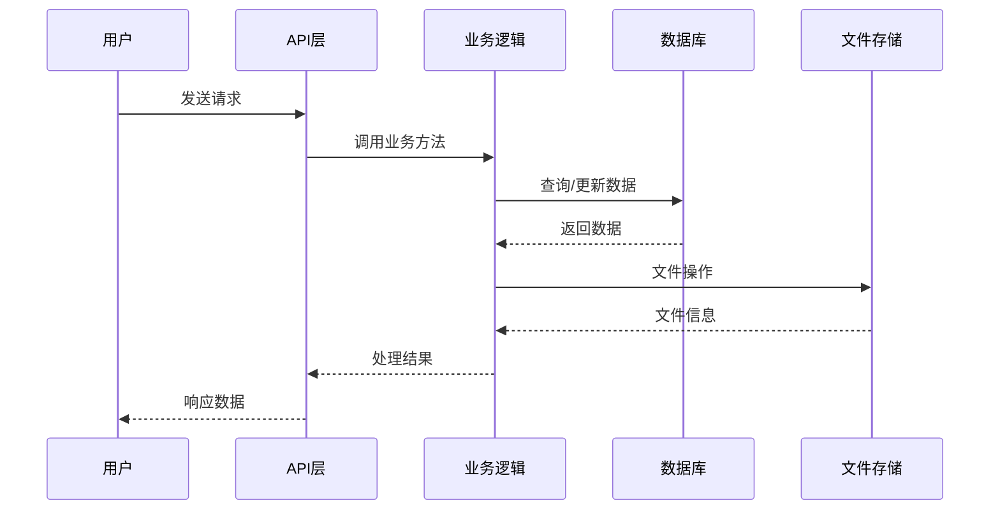

**图表来源**
- [index.js:655-729](file://server/index.js#L655-729)

**章节来源**
- [index.js:1-800](file://server/index.js#L1-800)

## 详细组件分析

### 认证与授权组件

#### JWT令牌管理

系统使用JWT进行身份验证，支持访问令牌和刷新令牌：

| 组件 | 功能 | 安全特性 |
|------|------|----------|
| 访问令牌 | 短期身份验证 | 24小时有效期 |
| 刷新令牌 | 获取新的访问令牌 | 7天有效期 |
| 用户信息 | 包含角色、部门、权限 | 动态权限加载 |

#### 权限控制机制

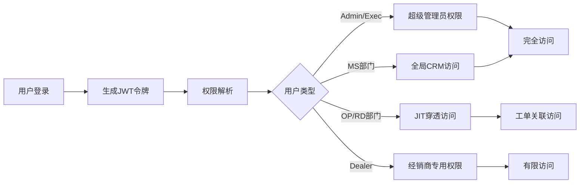

**图表来源**
- [auth.js:213-278](file://server/service/routes/auth.js#L213-278)
- [permission.js:34-138](file://server/service/middleware/permission.js#L34-138)

**章节来源**
- [auth.js:17-282](file://server/service/routes/auth.js#L17-282)
- [permission.js:1-232](file://server/service/middleware/permission.js#L1-232)

### 工单管理组件

#### 工单类型与生命周期

系统支持三种主要工单类型：

| 工单类型 | 编号格式 | 用途 | 关键字段 |
|----------|----------|------|----------|
| 咨询工单 | KYYMM-XXXX | 问题咨询、技术支持 | service_type, channel, problem_summary |
| RMA返厂单 | RMA-{C/D}-YYMM-XXXX | 设备返厂维修 | issue_type, issue_category, severity |
| 经销商维修单 | SVC-D-YYMM-XXXX | 经销商现场维修 | repair_content, problem_analysis |

#### 工单状态流转

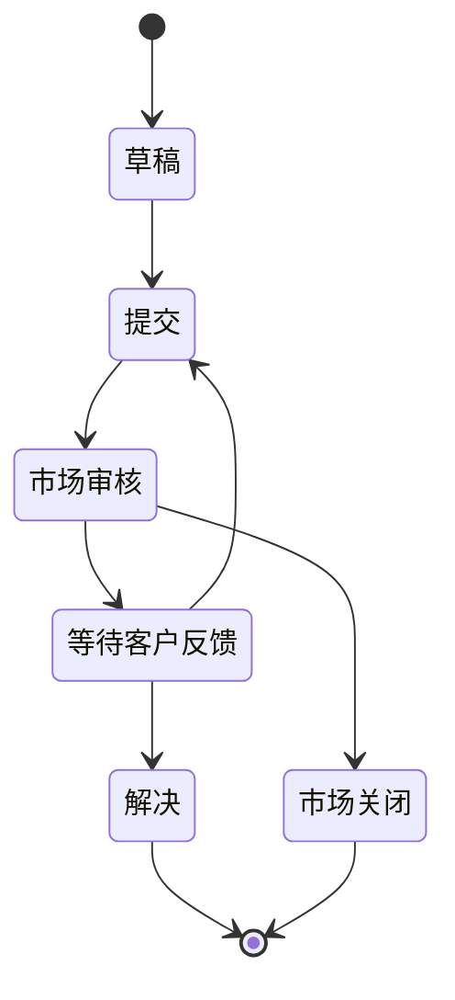

**图表来源**
- [tickets.js:371-397](file://server/service/routes/tickets.js#L371-397)

**章节来源**
- [tickets.js:1-800](file://server/service/routes/tickets.js#L1-800)

### 产品管理组件

#### 保修计算引擎

系统实现了复杂的保修计算逻辑，支持五级优先级：

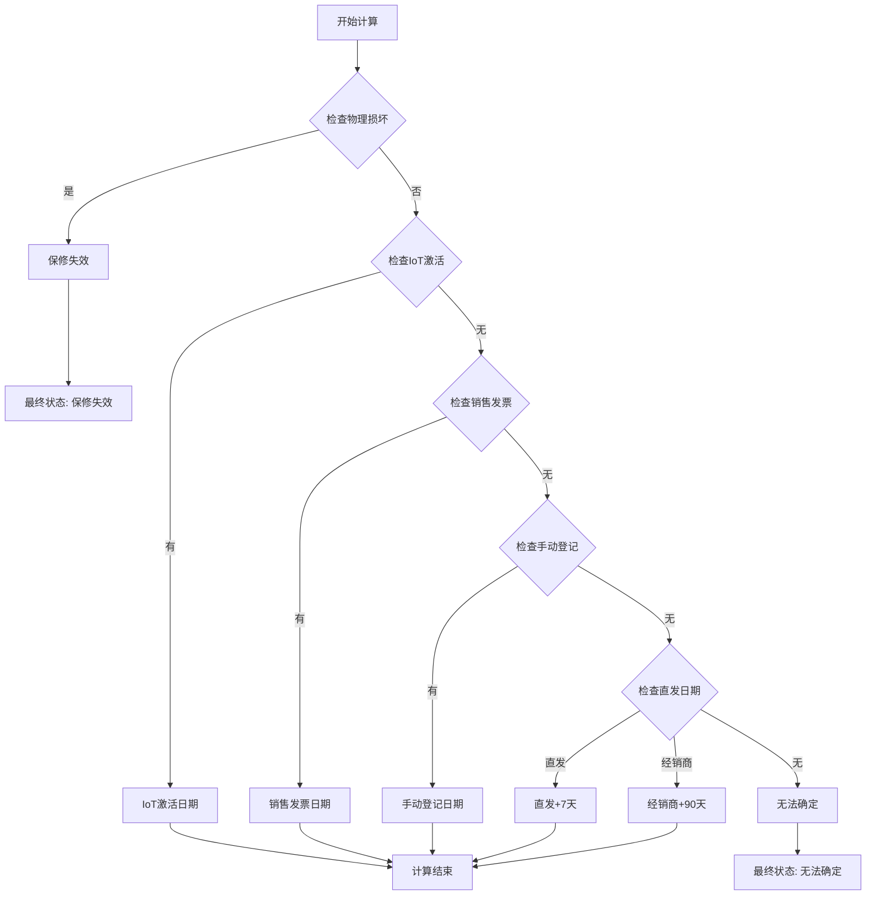

**图表来源**
- [warranty.js:211-285](file://server/service/routes/warranty.js#L211-285)

#### 产品注册流程

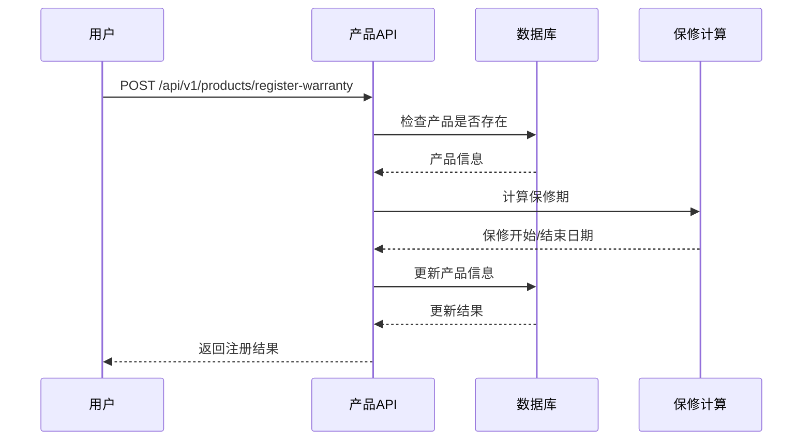

**图表来源**
- [products.js:136-332](file://server/service/routes/products.js#L136-332)

**章节来源**
- [products.js:1-388](file://server/service/routes/products.js#L1-388)
- [warranty.js:1-286](file://server/service/routes/warranty.js#L1-286)

### 配件管理组件

#### 配件目录管理

系统提供完整的配件目录管理功能：

| 功能模块 | 描述 | 关键特性 |
|----------|------|----------|
| 配件查询 | 支持按分类、型号、关键词搜索 | 多维度过滤、分页支持 |
| 价格管理 | 成本价、零售价、经销商价 | 多价格体系 |
| 库存控制 | 最低库存预警、补货提醒 | 自动化库存管理 |
| 适用性管理 | 适配产品型号列表 | 智能匹配算法 |

#### 报价系统

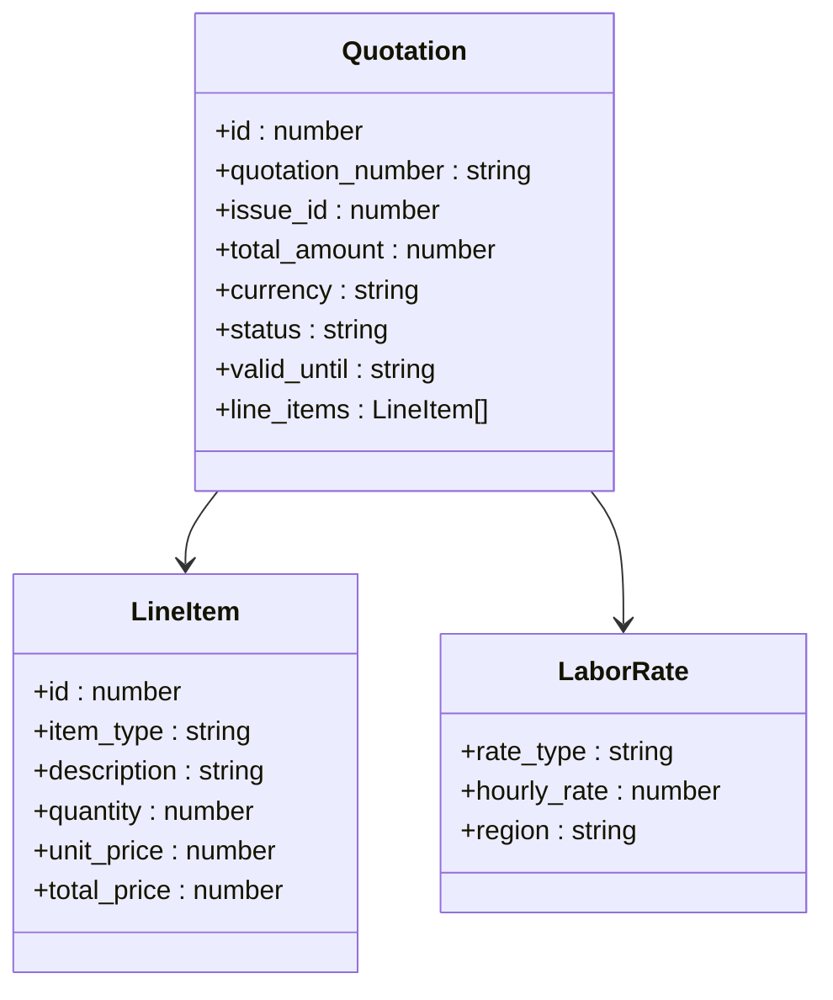

**图表来源**
- [parts.js:257-475](file://server/service/routes/parts.js#L257-475)

**章节来源**
- [parts.js:1-660](file://server/service/routes/parts.js#L1-660)

### 系统设置组件

#### 备份管理

系统提供自动备份功能，支持主备份和次备份：

| 备份类型 | 频率 | 保留天数 | 触发方式 |
|----------|------|----------|----------|
| 主备份 | 默认180分钟 | 7天 | 自动/手动 |
| 次备份 | 默认1440分钟 | 30天 | 自动/手动 |

#### AI集成

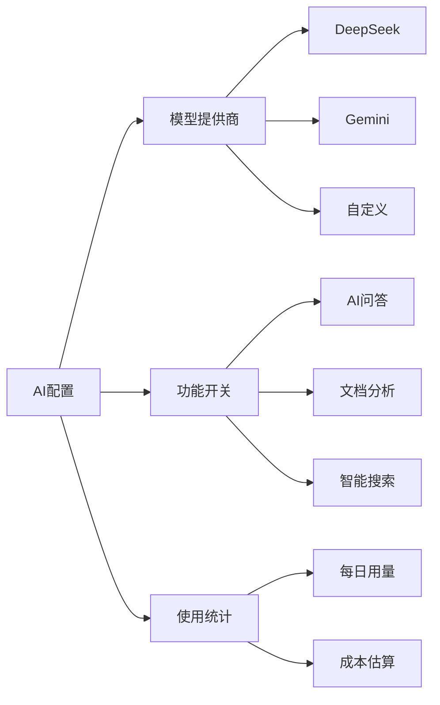

**图表来源**
- [settings.js:20-334](file://server/service/routes/settings.js#L20-334)

**章节来源**
- [settings.js:1-334](file://server/service/routes/settings.js#L1-334)

## 依赖关系分析

### 服务端依赖

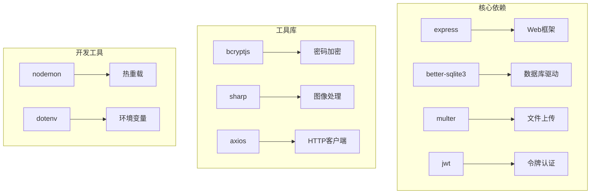

**图表来源**
- [package.json:15-39](file://server/package.json#L15-39)

### 前端依赖

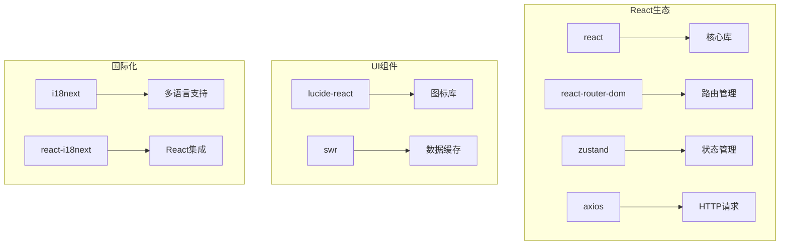

**图表来源**
- [App.tsx:1-800](file://client/src/App.tsx#L1-800)

**章节来源**
- [package.json:1-41](file://server/package.json#L1-41)
- [App.tsx:1-800](file://client/src/App.tsx#L1-800)

## 性能考虑

### 缓存策略

系统采用了多层次的缓存机制：

1. **数据库查询缓存**：使用SQLite的查询缓存机制
2. **文件系统缓存**：缩略图和预览文件缓存
3. **前端数据缓存**：SWR实现的智能缓存策略
4. **内存缓存**：热点数据的内存缓存

### 性能优化

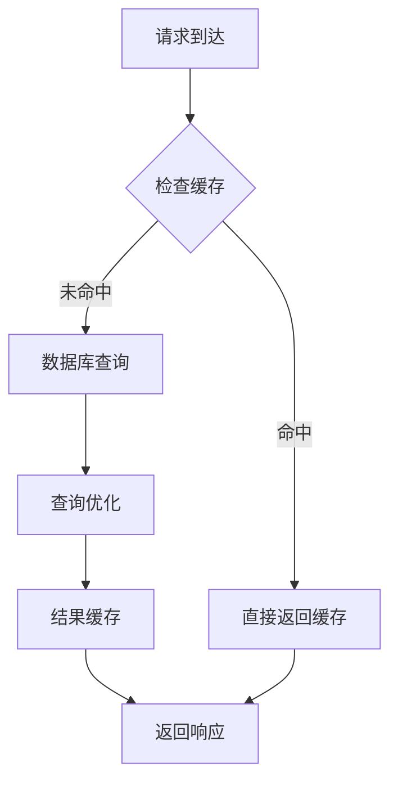

### 扩展性设计

- **微服务架构**：每个功能模块独立部署
- **水平扩展**：支持多实例部署
- **异步处理**：大量数据处理采用队列机制
- **CDN集成**：静态资源通过CDN加速

## 故障排除指南

### 常见问题

#### 认证问题

| 问题 | 可能原因 | 解决方案 |
|------|----------|----------|
| 401未认证 | 令牌过期或无效 | 使用刷新令牌获取新令牌 |
| 403权限不足 | 用户权限不足 | 检查用户角色和部门权限 |
| 404用户不存在 | 用户ID错误 | 验证用户ID的有效性 |

#### 数据库连接问题

| 问题 | 可能原因 | 解决方案 |
|------|----------|----------|
| 连接超时 | 数据库繁忙 | 增加连接池大小 |
| 查询缓慢 | 缺少索引 | 添加必要的数据库索引 |
| 内存溢出 | 大数据集处理 | 实施分页和流式处理 |

#### 文件上传问题

| 问题 | 可能原因 | 解决方案 |
|------|----------|----------|
| 上传失败 | 磁盘空间不足 | 清理磁盘空间 |
| 分片上传错误 | 网络中断 | 实现断点续传机制 |
| 文件损坏 | 编码问题 | 检查文件编码和格式 |

**章节来源**
- [index.js:655-729](file://server/index.js#L655-729)

## 结论

Longhorn服务管理系统是一个功能完整、架构清晰的企业级解决方案。系统的主要优势包括：

### 核心优势

1. **完整的业务覆盖**：从客户服务到产品管理的全流程支持
2. **灵活的权限控制**：基于角色和工单关联的细粒度权限管理
3. **强大的扩展性**：模块化的架构设计支持功能扩展
4. **优秀的用户体验**：直观的界面和高效的响应速度

### 技术亮点

1. **统一的工单管理**：支持多种工单类型的统一处理
2. **智能的保修计算**：基于复杂逻辑的保修期计算
3. **完善的配件管理**：从采购到使用的完整生命周期管理
4. **AI集成能力**：内置AI助手提升工作效率

### 发展建议

1. **API版本控制**：建议引入API版本控制机制
2. **错误码标准化**：统一错误响应格式
3. **实时通信**：考虑WebSocket或推送通知减少服务器负载
4. **监控告警**：完善系统监控和告警机制

该系统为企业提供了强大的数字化服务能力，能够有效提升客户服务质量和运营效率。