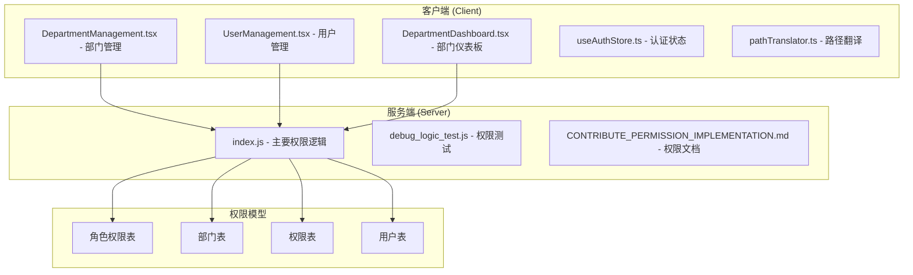
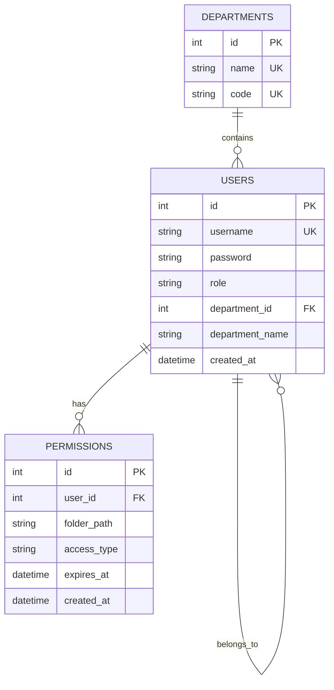
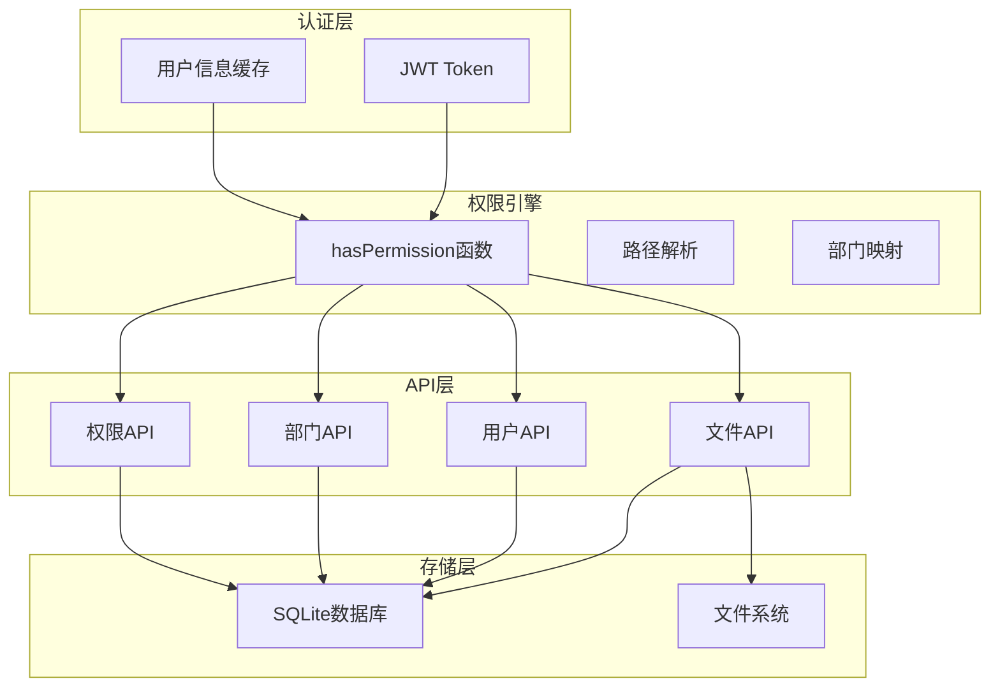
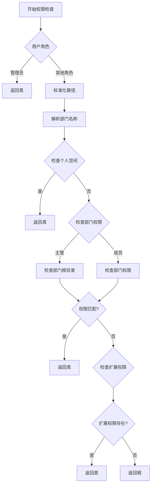
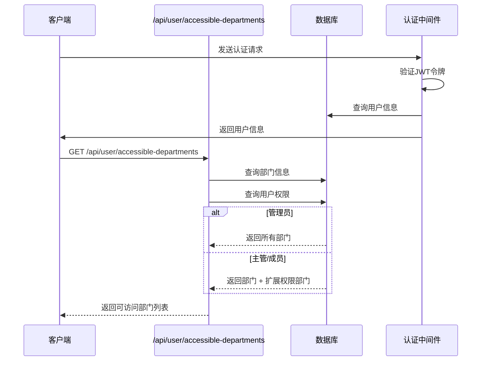
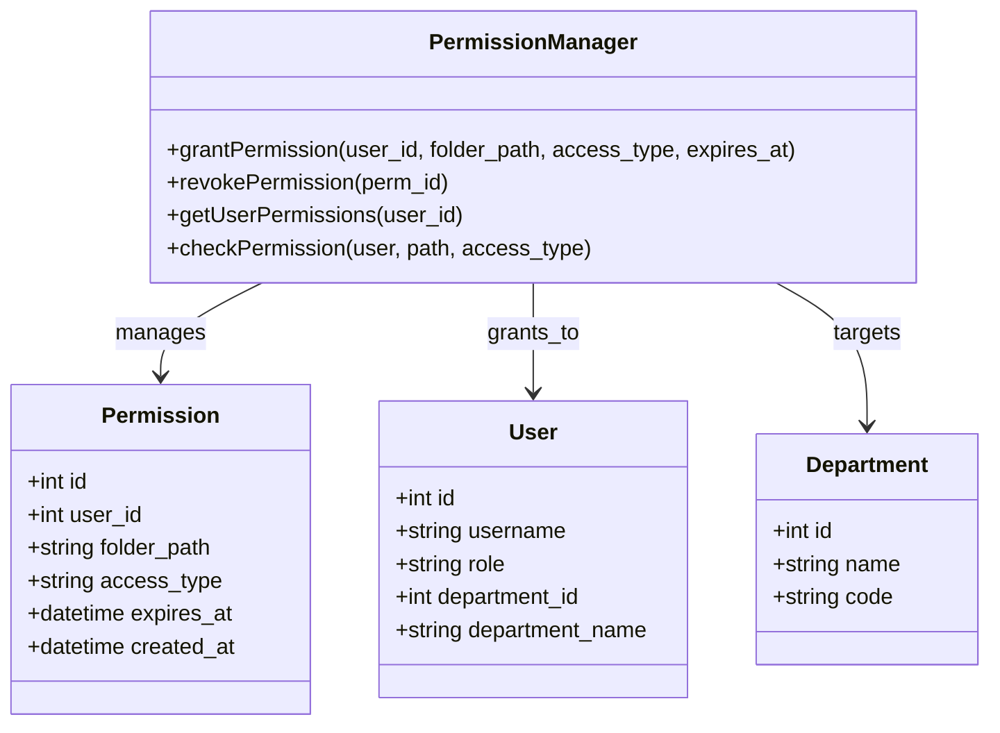
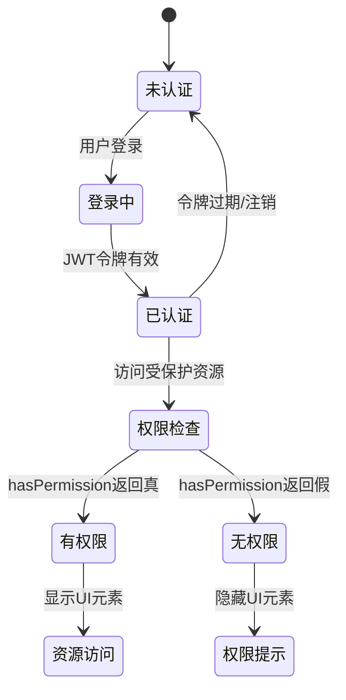
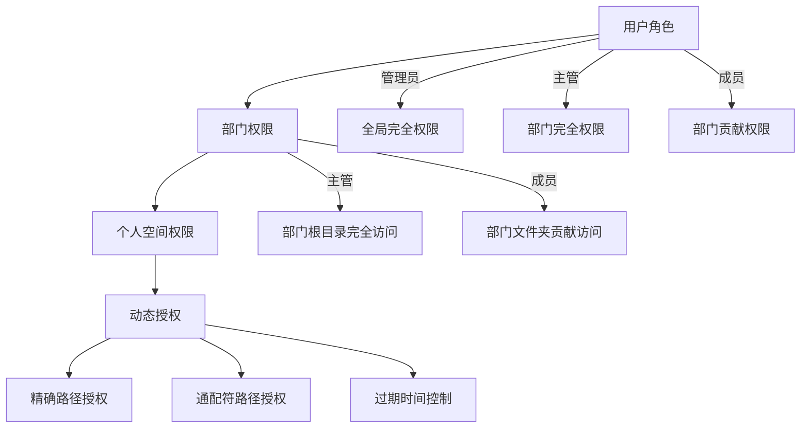
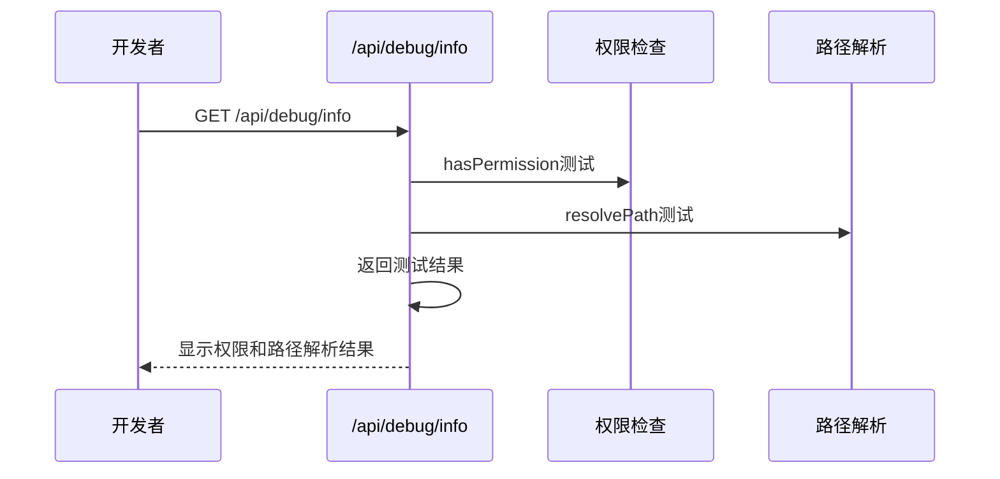

# 权限控制 API

<cite>
**本文档引用的文件**
- [server/index.js](file://server/index.js)
- [docs/CONTRIBUTE_PERMISSION_IMPLEMENTATION.md](file://docs/CONTRIBUTE_PERMISSION_IMPLEMENTATION.md)
- [client/src/components/DepartmentManagement.tsx](file://client/src/components/DepartmentManagement.tsx)
- [client/src/components/UserManagement.tsx](file://client/src/components/UserManagement.tsx)
- [client/src/components/DepartmentDashboard.tsx](file://client/src/components/DepartmentDashboard.tsx)
- [client/src/store/useAuthStore.ts](file://client/src/store/useAuthStore.ts)
- [client/src/utils/pathTranslator.ts](file://client/src/utils/pathTranslator.ts)
- [server/debug_logic_test.js](file://server/debug_logic_test.js)
</cite>

## 目录
1. [简介](#简介)
2. [项目结构](#项目结构)
3. [核心组件](#核心组件)
4. [架构概览](#架构概览)
5. [详细组件分析](#详细组件分析)
6. [依赖关系分析](#依赖关系分析)
7. [性能考量](#性能考量)
8. [故障排除指南](#故障排除指南)
9. [结论](#结论)

## 简介

Longhorn 项目实现了完整的三级权限控制系统，包括管理员、主管和成员三个角色层级，以及动态授权机制。该系统支持基于路径的细粒度权限控制，涵盖文件上传、下载、删除、移动等核心操作。

## 项目结构

权限控制相关的核心文件分布如下：



**图表来源**
- [server/index.js](file://server/index.js#L34-L78)
- [client/src/components/DepartmentManagement.tsx](file://client/src/components/DepartmentManagement.tsx#L1-L119)

**章节来源**
- [server/index.js](file://server/index.js#L1-L120)
- [client/src/components/DepartmentManagement.tsx](file://client/src/components/DepartmentManagement.tsx#L1-L119)

## 核心组件

### 权限模型数据结构

系统采用以下核心数据表结构：



**图表来源**
- [server/index.js](file://server/index.js#L34-L78)

### 角色权限体系

| 角色 | 个人空间 | 本部门 | 被授权目录 |
|:---|:---|:---|:---|
| **管理员** | 完全读写 | 完全读写（所有部门） | - |
| **主管** | 完全读写 | 完全读写 | 根据授权类型 |
| **成员** | 完全读写 | 贡献（新增） | 根据授权类型 |

### 权限类型定义

| 权限类型 | 英文代码 | 能力范围 |
|:---|:---|:---|
| **只读** | `Read` | 只能查看和下载文件，不能做任何修改 |
| **贡献** | `Contribute` | 可以创建文件夹、上传文件，但**只能修改/删除自己创建的内容** |
| **完全** | `Full` | 可以修改/删除任何内容，包括他人的文件 |

**章节来源**
- [docs/CONTRIBUTE_PERMISSION_IMPLEMENTATION.md](file://docs/CONTRIBUTE_PERMISSION_IMPLEMENTATION.md#L13-L28)
- [docs/CONTRIBUTE_PERMISSION_IMPLEMENTATION.md](file://docs/CONTRIBUTE_PERMISSION_IMPLEMENTATION.md#L35-L45)

## 架构概览



**图表来源**
- [server/index.js](file://server/index.js#L267-L295)
- [server/index.js](file://server/index.js#L297-L353)

## 详细组件分析

### hasPermission 函数实现

hasPermission 函数是权限控制系统的核心，实现了复杂的权限判断逻辑：



**图表来源**
- [server/index.js](file://server/index.js#L300-L353)

#### 权限检查流程详解

1. **管理员特权**：管理员拥有最高权限，直接返回真
2. **个人空间检查**：用户可以访问自己的个人空间
3. **部门权限检查**：
   - 主管：可以访问整个部门目录
   - 成员：默认具有贡献权限
4. **扩展权限检查**：检查动态授权配置

**章节来源**
- [server/index.js](file://server/index.js#L300-L353)

### 部门管理 API

#### 获取可访问部门列表



**图表来源**
- [server/index.js](file://server/index.js#L715-L756)

#### 动态权限管理

系统支持灵活的动态权限分配机制：



**图表来源**
- [server/index.js](file://server/index.js#L1015-L1064)
- [server/index.js](file://server/index.js#L1315-L1327)

**章节来源**
- [server/index.js](file://server/index.js#L715-L756)
- [server/index.js](file://server/index.js#L1015-L1064)
- [server/index.js](file://server/index.js#L1315-L1327)

### 前端权限控制实现

#### 权限状态管理



**图表来源**
- [client/src/store/useAuthStore.ts](file://client/src/store/useAuthStore.ts#L17-L31)

#### 路径翻译和本地化

前端实现了智能的路径翻译功能，支持多语言显示：

| 路径段 | 翻译前 | 翻译后 |
|:---|:---|:---|
| "MS" | "MS" | "市场部 (MS)" |
| "OP" | "OP" | "运营部 (OP)" |
| "RD" | "RD" | "研发中心 (RD)" |
| "RE" | "RE" | "通用台面 (RE)" |

**章节来源**
- [client/src/store/useAuthStore.ts](file://client/src/store/useAuthStore.ts#L1-L31)
- [client/src/utils/pathTranslator.ts](file://client/src/utils/pathTranslator.ts#L14-L36)

### 权限继承规则

系统实现了层次化的权限继承机制：



**图表来源**
- [docs/CONTRIBUTE_PERMISSION_IMPLEMENTATION.md](file://docs/CONTRIBUTE_PERMISSION_IMPLEMENTATION.md#L21-L28)

**章节来源**
- [docs/CONTRIBUTE_PERMISSION_IMPLEMENTATION.md](file://docs/CONTRIBUTE_PERMISSION_IMPLEMENTATION.md#L92-L134)

## 依赖关系分析

```mermaid
graph LR
subgraph "权限相关模块"
A[hasPermission函数]
B[authenticate中间件]
C[isAdmin中间件]
D[路径解析函数]
end
subgraph "API接口"
E[/api/files]
F[/api/upload]
G[/api/user/accessible-departments]
H[/api/admin/permissions]
end
subgraph "数据模型"
I[users表]
J[departments表]
K[permissions表]
L[file_stats表]
end
A --> I
A --> J
A --> K
B --> I
E --> A
F --> A
G --> A
H --> A
E --> L
```

**图表来源**
- [server/index.js](file://server/index.js#L267-L295)
- [server/index.js](file://server/index.js#L297-L353)

**章节来源**
- [server/index.js](file://server/index.js#L267-L353)

## 性能考量

### 权限检查优化

1. **路径标准化**：统一处理路径格式，避免重复计算
2. **部门名称映射**：缓存部门代码到名称的映射关系
3. **权限缓存策略**：在认证中间件中缓存用户最新信息

### 数据库查询优化

1. **索引设计**：对常用查询字段建立索引
2. **批量查询**：使用IN语句减少数据库往返
3. **查询缓存**：缓存热门部门和用户信息

## 故障排除指南

### 常见权限问题

| 问题类型 | 症状 | 解决方案 |
|:---|:---|:---|
| 权限不足 | 403 Forbidden错误 | 检查用户角色和部门归属 |
| 路径解析错误 | 文件找不到 | 验证路径编码和部门代码 |
| 动态授权失效 | 授权不生效 | 检查授权过期时间和路径匹配 |
| 个人空间访问失败 | 无法访问个人文件 | 确认用户部门信息正确 |

### 调试工具

系统提供了专门的调试接口：



**图表来源**
- [server/index.js](file://server/index.js#L758-L790)

**章节来源**
- [server/index.js](file://server/index.js#L758-L790)

## 结论

Longhorn 项目的权限控制系统实现了企业级的细粒度访问控制，通过三级角色体系和动态授权机制，为不同用户群体提供了合适的权限范围。系统的设计充分考虑了易用性和安全性，在保证功能完整性的同时，也便于维护和扩展。

主要优势包括：
- 清晰的角色权限分离
- 灵活的动态授权机制
- 完善的前端权限控制
- 可扩展的权限模型设计
- 详细的调试和监控能力

该权限系统为类似的企业文件管理系统提供了良好的参考实现。