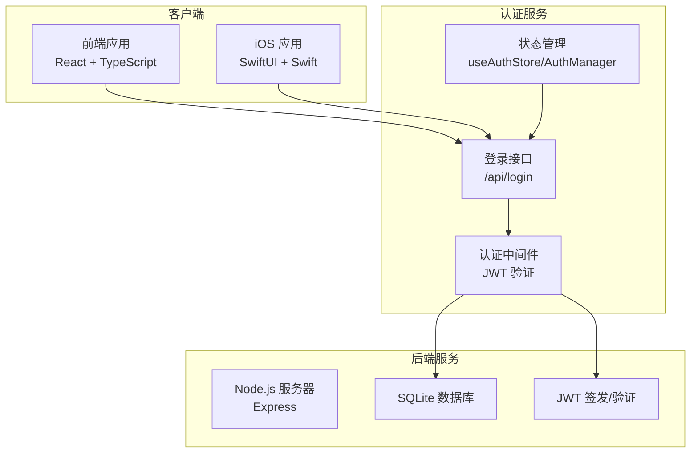
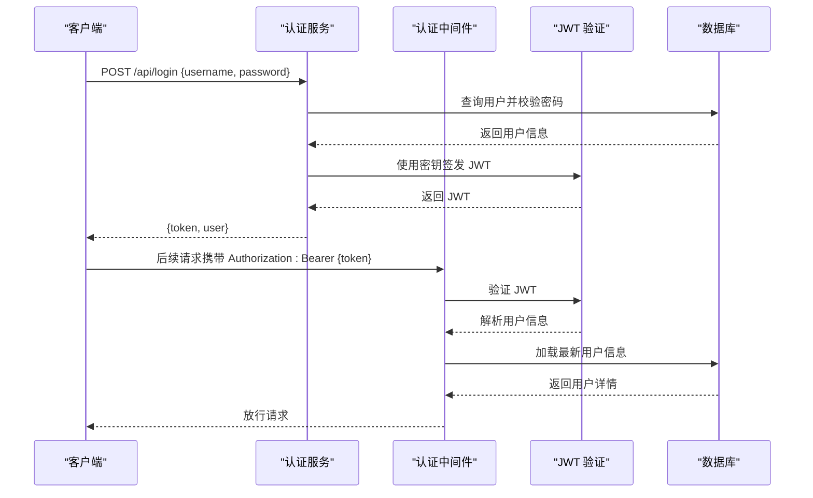
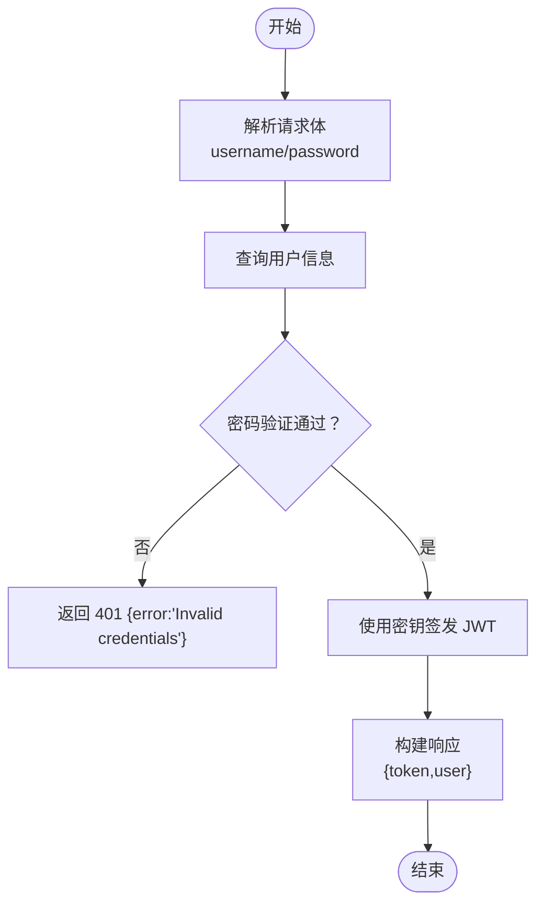
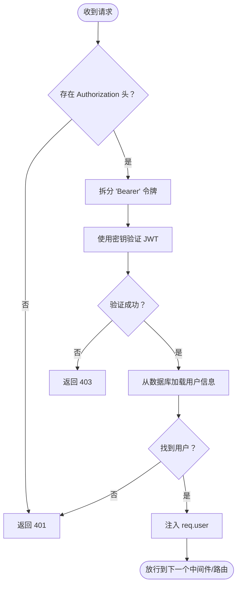
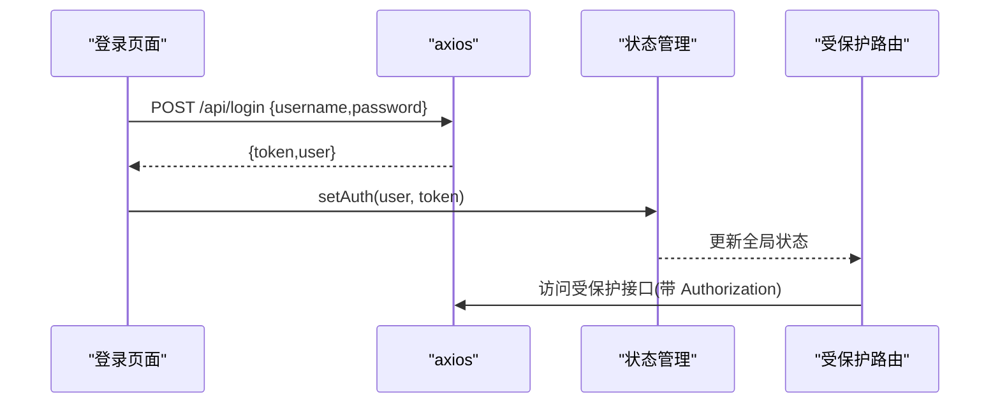
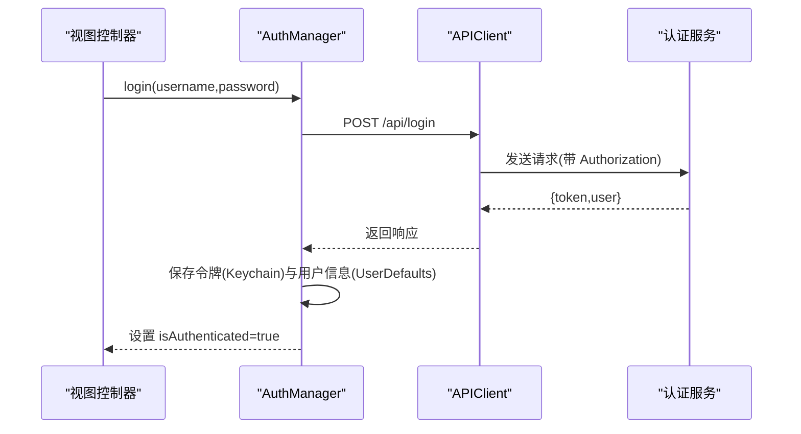
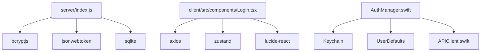

# 用户认证 API

<cite>
**本文档引用的文件**
- [server/index.js](file://server/index.js)
- [client/src/components/Login.tsx](file://client/src/components/Login.tsx)
- [client/src/store/useAuthStore.ts](file://client/src/store/useAuthStore.ts)
- [client/src/App.tsx](file://client/src/App.tsx)
- [ios/LonghornApp/Services/AuthManager.swift](file://ios/LonghornApp/Services/AuthManager.swift)
- [ios/LonghornApp/Services/APIClient.swift](file://ios/LonghornApp/Services/APIClient.swift)
</cite>

## 目录
1. [简介](#简介)
2. [项目结构](#项目结构)
3. [核心组件](#核心组件)
4. [架构概览](#架构概览)
5. [详细组件分析](#详细组件分析)
6. [依赖关系分析](#依赖关系分析)
7. [性能考虑](#性能考虑)
8. [故障排除指南](#故障排除指南)
9. [结论](#结论)

## 简介
本文件详细记录了 Longhorn 应用的用户认证 API，重点覆盖 `/api/login` 端点的完整规范。该系统采用基于 JWT 的认证机制，支持前后端分离的单点登录体验。文档内容包括：
- 请求参数与响应格式
- 错误处理策略
- 安全验证机制
- 前端与 iOS 客户端的集成示例
- 认证中间件的工作原理与安全考虑

## 项目结构
认证相关的核心文件分布于服务端和客户端：
- 服务端：`server/index.js` 实现了登录接口、JWT 签发与验证、认证中间件
- 前端：`client/src/components/Login.tsx` 提供登录表单与调用逻辑；`client/src/store/useAuthStore.ts` 管理本地认证状态；`client/src/App.tsx` 展示受保护路由与权限控制
- iOS 客户端：`ios/LonghornApp/Services/AuthManager.swift` 管理登录状态与令牌持久化；`ios/LonghornApp/Services/APIClient.swift` 统一处理网络请求与认证头

**图表来源**
- [server/index.js](file://server/index.js#L267-L295)
- [client/src/components/Login.tsx](file://client/src/components/Login.tsx#L15-L27)
- [ios/LonghornApp/Services/AuthManager.swift](file://ios/LonghornApp/Services/AuthManager.swift#L44-L69)

**章节来源**
- [server/index.js](file://server/index.js#L267-L295)
- [client/src/components/Login.tsx](file://client/src/components/Login.tsx#L1-L161)
- [client/src/store/useAuthStore.ts](file://client/src/store/useAuthStore.ts#L1-L31)
- [client/src/App.tsx](file://client/src/App.tsx#L66-L126)
- [ios/LonghornApp/Services/AuthManager.swift](file://ios/LonghornApp/Services/AuthManager.swift#L1-L195)
- [ios/LonghornApp/Services/APIClient.swift](file://ios/LonghornApp/Services/APIClient.swift#L1-L326)

## 核心组件
- 登录接口：接收用户名与密码，验证通过后签发 JWT 并返回用户信息
- 认证中间件：从请求头提取并验证 JWT，注入用户上下文
- 前端状态管理：存储令牌与用户信息，统一设置请求头
- iOS 认证管理：Keychain 存储令牌，UserDefaults 缓存用户信息，自动验证令牌有效性

**章节来源**
- [server/index.js](file://server/index.js#L684-L713)
- [server/index.js](file://server/index.js#L267-L295)
- [client/src/store/useAuthStore.ts](file://client/src/store/useAuthStore.ts#L17-L30)
- [ios/LonghornApp/Services/AuthManager.swift](file://ios/LonghornApp/Services/AuthManager.swift#L21-L34)

## 架构概览
认证流程在服务端与客户端之间形成闭环：
- 客户端提交登录请求
- 服务端验证凭据，签发 JWT
- 客户端保存令牌并在后续请求中附带 Authorization 头
- 服务端中间件验证令牌并注入用户信息
- iOS 客户端使用 Keychain 与 UserDefaults 管理令牌与用户信息，并在必要时进行令牌有效性验证

**图表来源**
- [server/index.js](file://server/index.js#L684-L713)
- [server/index.js](file://server/index.js#L267-L295)

## 详细组件分析

### 登录接口规范
- 端点：`POST /api/login`
- 请求体字段：
  - username: 字符串，必填
  - password: 字符串，必填
- 成功响应：
  - token: JWT 字符串
  - user: 包含 id、username、role、department_name 的对象
- 失败响应：
  - 401 未授权：返回 { error: "Invalid credentials" }

**图表来源**
- [server/index.js](file://server/index.js#L684-L713)

**章节来源**
- [server/index.js](file://server/index.js#L684-L713)

### 认证中间件工作原理
- 从 Authorization 头提取 Bearer 令牌
- 使用密钥验证 JWT 有效性
- 从数据库加载最新用户信息并注入到请求对象
- 未提供或无效令牌时返回相应状态码

**图表来源**
- [server/index.js](file://server/index.js#L267-L295)

**章节来源**
- [server/index.js](file://server/index.js#L267-L295)

### 前端集成示例
- 登录页面通过 axios 调用 `/api/login`，成功后将用户信息与令牌保存至本地存储
- 受保护路由在渲染前检查是否存在用户信息，不存在则重定向至登录页
- 侧边栏与统计卡片等组件在需要时通过 Authorization 头访问受保护接口

**图表来源**
- [client/src/components/Login.tsx](file://client/src/components/Login.tsx#L15-L27)
- [client/src/store/useAuthStore.ts](file://client/src/store/useAuthStore.ts#L17-L30)
- [client/src/App.tsx](file://client/src/App.tsx#L75-L84)

**章节来源**
- [client/src/components/Login.tsx](file://client/src/components/Login.tsx#L1-L161)
- [client/src/store/useAuthStore.ts](file://client/src/store/useAuthStore.ts#L1-L31)
- [client/src/App.tsx](file://client/src/App.tsx#L66-L126)

### iOS 客户端集成示例
- 使用 APIClient 统一发起请求，自动在请求头添加 Authorization: Bearer {token}
- AuthManager 负责令牌的 Keychain 存储与恢复，以及用户信息的 UserDefaults 缓存
- 在启动时尝试恢复会话，并异步验证令牌有效性

**图表来源**
- [ios/LonghornApp/Services/AuthManager.swift](file://ios/LonghornApp/Services/AuthManager.swift#L44-L69)
- [ios/LonghornApp/Services/APIClient.swift](file://ios/LonghornApp/Services/APIClient.swift#L68-L88)

**章节来源**
- [ios/LonghornApp/Services/AuthManager.swift](file://ios/LonghornApp/Services/AuthManager.swift#L1-L195)
- [ios/LonghornApp/Services/APIClient.swift](file://ios/LonghornApp/Services/APIClient.swift#L1-L326)

### JWT 令牌生成、验证与刷新
- 生成：服务端使用密钥对包含用户标识与角色的负载签发 JWT
- 验证：中间件从请求头提取令牌并使用相同密钥验证其有效性
- 刷新：当前代码库未实现专用的令牌刷新端点；建议采用短期访问令牌 + 长期刷新令牌的模式，并在服务端实现 `/api/token/refresh` 接口以提升安全性

**章节来源**
- [server/index.js](file://server/index.js#L694-L694)
- [server/index.js](file://server/index.js#L272-L272)

## 依赖关系分析
- 服务端依赖：
  - bcryptjs：密码哈希与比较
  - jsonwebtoken：JWT 签发与验证
  - sqlite：用户与权限数据存储
- 客户端依赖：
  - axios：HTTP 请求
  - zustand：状态管理
  - lucide-react：图标库

**图表来源**
- [server/index.js](file://server/index.js#L8-L8)
- [server/index.js](file://server/index.js#L21-L21)
- [client/src/components/Login.tsx](file://client/src/components/Login.tsx#L1-L6)
- [client/src/store/useAuthStore.ts](file://client/src/store/useAuthStore.ts#L1-L3)
- [ios/LonghornApp/Services/AuthManager.swift](file://ios/LonghornApp/Services/AuthManager.swift#L8-L9)
- [ios/LonghornApp/Services/APIClient.swift](file://ios/LonghornApp/Services/APIClient.swift#L8-L8)

**章节来源**
- [server/index.js](file://server/index.js#L8-L21)
- [client/src/components/Login.tsx](file://client/src/components/Login.tsx#L1-L6)
- [client/src/store/useAuthStore.ts](file://client/src/store/useAuthStore.ts#L1-L3)
- [ios/LonghornApp/Services/AuthManager.swift](file://ios/LonghornApp/Services/AuthManager.swift#L8-L9)
- [ios/LonghornApp/Services/APIClient.swift](file://ios/LonghornApp/Services/APIClient.swift#L8-L8)

## 性能考虑
- 密码验证：bcrypt 比较在内存中完成，避免了明文存储风险
- JWT 验证：中间件直接验证令牌，无需额外数据库查询
- 令牌持久化：前端使用本地存储，iOS 使用 Keychain 与 UserDefaults，减少重复登录成本
- 建议优化：
  - 对频繁访问的受保护接口增加缓存策略
  - 为登录接口增加速率限制，防止暴力破解
  - 使用短期访问令牌与长期刷新令牌，降低令牌泄露风险

[本节为通用指导，不直接分析具体文件]

## 故障排除指南
- 登录失败（401）：
  - 检查用户名与密码是否正确
  - 确认服务端 JWT 密钥配置
- 403 未授权：
  - 检查 Authorization 头格式是否为 Bearer 令牌
  - 确认令牌未过期且签名有效
- iOS 登录后立即被登出：
  - 检查 Keychain 写入状态与读取逻辑
  - 确认 APIClient 在 401 时触发了 AuthManager.logout()

**章节来源**
- [server/index.js](file://server/index.js#L272-L272)
- [ios/LonghornApp/Services/APIClient.swift](file://ios/LonghornApp/Services/APIClient.swift#L287-L293)

## 结论
Longhorn 的认证体系以 JWT 为核心，结合服务端中间件与客户端状态管理，实现了简洁高效的单点登录体验。建议在未来版本中引入令牌刷新机制与更严格的令牌轮换策略，进一步提升安全性与用户体验。