# 知识库API接口

<cite>
**本文档引用的文件**
- [server/service/routes/knowledge.js](file://server/service/routes/knowledge.js)
- [server/service/routes/knowledge_audit.js](file://server/service/routes/knowledge_audit.js)
- [server/migrations/add_knowledge_audit_log.sql](file://server/migrations/add_knowledge_audit_log.sql)
- [server/service/migrations/005_knowledge_base.sql](file://server/service/migrations/005_knowledge_base.sql)
- [server/index.js](file://server/index.js)
- [client/src/components/KnowledgeAuditLog.tsx](file://client/src/components/KnowledgeAuditLog.tsx)
- [docs/Service_API.md](file://docs/Service_API.md)
- [docs/API_DOCUMENTATION.md](file://docs/API_DOCUMENTATION.md)
- [server/service/migrations/011_add_knowledge_source.sql](file://server/service/migrations/011_add_knowledge_source.sql)
- [server/scripts/docx_to_markdown.py](file://server/scripts/docx_to_markdown.py)
- [server/service/index.js](file://server/service/index.js)
- [server/scripts/extract_pdf_images.py](file://server/scripts/extract_pdf_images.py)
- [server/scripts/optimize_images.py](file://server/scripts/optimize_images.py)
- [client/src/components/Knowledge/WikiEditor/TipTapEditor.tsx](file://client/src/components/Knowledge/WikiEditor/TipTapEditor.tsx)
- [client/src/components/Knowledge/WikiEditor/markdownUtils.ts](file://client/src/components/Knowledge/WikiEditor/markdownUtils.ts)
- [client/src/components/Knowledge/WikiEditor/index.ts](file://client/src/components/Knowledge/WikiEditor/index.ts)
- [client/src/components/Bokeh/BokehContainer.tsx](file://client/src/components/Bokeh/BokehContainer.tsx)
- [client/src/components/Bokeh/BokehEditorPanel.tsx](file://client/src/components/Bokeh/BokehEditorPanel.tsx)
- [client/src/store/useBokehContext.ts](file://client/src/store/useBokehContext.ts)
- [client/src/components/KinefinityWiki.tsx](file://client/src/components/KinefinityWiki.tsx)
- [server/service/ai_service.js](file://server/service/ai_service.js)
</cite>

## 更新摘要
**所做更改**
- 新增了完整的WYSIWYG编辑器支持，包括TipTap富文本编辑器和Markdown双向转换
- 集成了AI内容优化功能，支持Bokeh智能排版和内容优化
- 改进了内容格式化能力，支持智能章节检测和结构优化
- 增强了图像处理功能，支持PDF图像提取和WebP格式优化
- 新增了Bokeh编辑器面板，提供AI驱动的内容修改和预览功能
- **更新** 知识库API搜索功能得到显著增强，包括FTS5全文搜索、URL参数过滤、权限控制等
- **新增** AI内容优化相关接口，支持智能排版、内容优化和草稿发布功能
- **新增** Bokeh内容优化功能，提供编辑器内AI助手和草稿管理
- **新增** 格式化内容发布功能，支持AI优化内容的正式发布

## 目录
1. [简介](#简介)
2. [项目结构](#项目结构)
3. [核心组件](#核心组件)
4. [架构概览](#架构概览)
5. [详细组件分析](#详细组件分析)
6. [AI内容优化功能](#ai内容优化功能)
7. [WYSIWYG编辑器系统](#wysiwyg编辑器系统)
8. [图像处理增强](#图像处理增强)
9. [审计日志功能](#审计日志功能)
10. [依赖关系分析](#依赖关系分析)
11. [性能考虑](#性能考虑)
12. [故障排除指南](#故障排除指南)
13. [结论](#结论)

## 简介

Longhorn项目中的知识库API接口是一个完整的知识管理系统，支持多层级可见性控制、多种内容导入方式、全文搜索和版本管理。该系统为Kinefinity公司的产品文档、故障排查指南和常见问题提供了统一的知识管理平台。

**更新** 系统现已集成先进的AI内容优化功能和现代化的WYSIWYG编辑器，提供智能化的文章排版、内容优化和实时编辑体验。通过Bokeh AI助手，用户可以轻松实现内容格式化、图片优化和结构改进，显著提升了知识库内容的质量和可读性。**新增的AI内容优化功能**包括智能排版优化、内容修改优化和草稿管理，支持编辑器内AI助手的实时交互。**增强的搜索功能**包括FTS5全文搜索、URL参数过滤和复杂的权限控制，支持更精细的产品家族和模型过滤，以及增强的搜索结果处理。

## 项目结构

知识库API接口主要分布在以下位置：

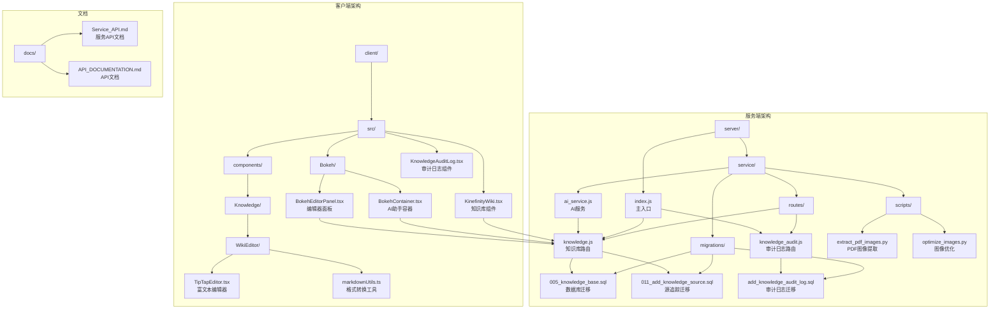

**图表来源**
- [server/service/routes/knowledge.js](file://server/service/routes/knowledge.js#L1-L50)
- [server/service/routes/knowledge_audit.js](file://server/service/routes/knowledge_audit.js#L1-L50)
- [server/migrations/add_knowledge_audit_log.sql](file://server/migrations/add_knowledge_audit_log.sql#L1-L50)
- [server/index.js](file://server/index.js#L21-L25)
- [server/scripts/extract_pdf_images.py](file://server/scripts/extract_pdf_images.py#L1-L50)
- [server/scripts/optimize_images.py](file://server/scripts/optimize_images.py#L1-L50)

**章节来源**
- [server/service/routes/knowledge.js](file://server/service/routes/knowledge.js#L1-L50)
- [server/service/routes/knowledge_audit.js](file://server/service/routes/knowledge_audit.js#L1-L50)
- [server/index.js](file://server/index.js#L21-L25)

## 核心组件

### 知识库路由模块

知识库API的核心路由模块提供了完整的RESTful接口，现已集成AI优化和WYSIWYG编辑功能：

| 端点 | 方法 | 描述 | 权限要求 |
|------|------|------|----------|
| `/api/v1/knowledge` | GET | 获取知识库文章列表 | 认证用户 |
| `/api/v1/knowledge/:idOrSlug` | GET | 获取文章详情 | 认证用户 |
| `/api/v1/knowledge` | POST | 创建新文章 | 内部员工 |
| `/api/v1/knowledge/:id` | PATCH | 更新文章 | 文章作者/管理员 |
| `/api/v1/knowledge/:id/feedback` | POST | 提交反馈 | 认证用户 |
| `/api/v1/knowledge/import/pdf` | POST | 从PDF导入 | 内部员工 |
| `/api/v1/knowledge/import/docx` | POST | 从DOCX导入 | 编辑者/管理员 |
| `/api/v1/knowledge/import/url` | POST | 从网页导入 | 内部员工 |
| `/api/v1/knowledge/categories/stats` | GET | 获取分类统计 | 认证用户 |
| `/api/v1/knowledge/:id/format` | POST | AI智能排版优化 | 编辑者/管理员 |
| `/api/v1/knowledge/:id/bokeh-optimize` | POST | Bokeh内容优化 | 编辑者/管理员 |
| `/api/v1/knowledge/:id/publish-format` | POST | 发布格式化内容 | 管理员 |

**更新** 新增了AI内容优化相关接口，支持智能排版、内容优化和草稿发布功能。

**章节来源**
- [server/service/routes/knowledge.js](file://server/service/routes/knowledge.js#L52-L151)
- [server/service/routes/knowledge.js](file://server/service/routes/knowledge.js#L153-L219)
- [server/service/routes/knowledge.js](file://server/service/routes/knowledge.js#L221-L307)
- [server/service/routes/knowledge.js](file://server/service/routes/knowledge.js#L1924-L2047)
- [server/service/routes/knowledge.js](file://server/service/routes/knowledge.js#L2054-L2300)
- [server/service/routes/knowledge.js](file://server/service/routes/knowledge.js#L2700-L2945)
- [server/service/routes/knowledge.js](file://server/service/routes/knowledge.js#L2947-L3022)

### 审计日志路由模块

新增的审计日志路由模块提供了完整的审计功能：

| 端点 | 方法 | 描述 | 权限要求 |
|------|------|------|----------|
| `/api/v1/knowledge/audit` | GET | 获取审计日志列表 | 管理员 |
| `/api/v1/knowledge/audit/stats` | GET | 获取审计统计信息 | 管理员 |

**章节来源**
- [server/service/routes/knowledge_audit.js](file://server/service/routes/knowledge_audit.js#L76-L190)
- [server/service/routes/knowledge_audit.js](file://server/service/routes/knowledge_audit.js#L196-L269)

### 数据库架构

知识库系统使用SQLite数据库，支持全文搜索、版本管理和审计追踪：

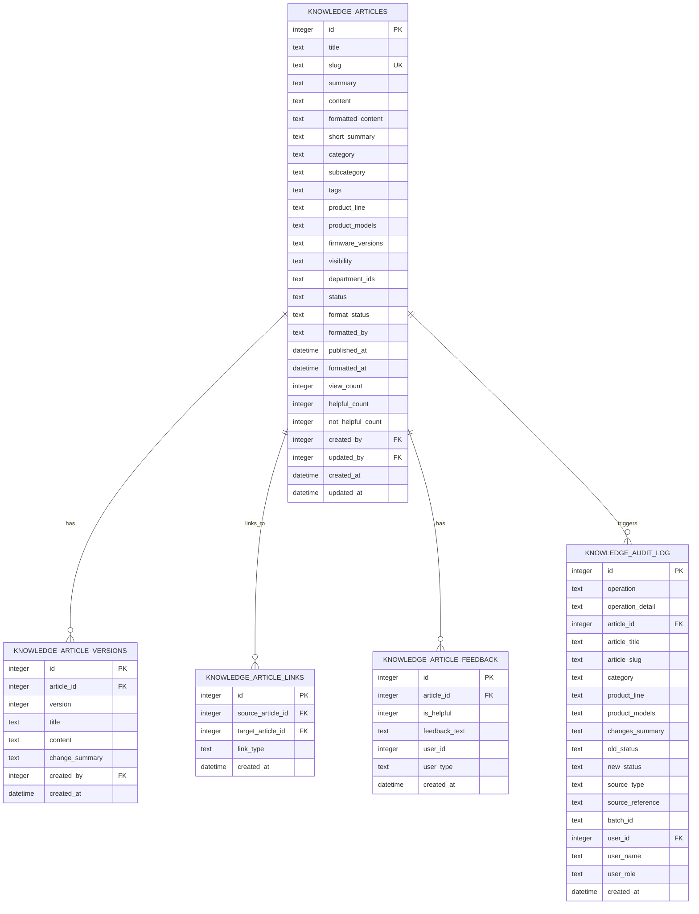

**图表来源**
- [server/service/migrations/005_knowledge_base.sql](file://server/service/migrations/005_knowledge_base.sql#L10-L80)
- [server/migrations/add_knowledge_audit_log.sql](file://server/migrations/add_knowledge_audit_log.sql#L4-L41)

**章节来源**
- [server/service/migrations/005_knowledge_base.sql](file://server/service/migrations/005_knowledge_base.sql#L10-L80)
- [server/migrations/add_knowledge_audit_log.sql](file://server/migrations/add_knowledge_audit_log.sql#L4-L41)

## 架构概览

知识库API采用分层架构设计，确保了良好的可维护性、扩展性和合规性。新增的AI优化和WYSIWYG编辑功能进一步增强了系统的智能化水平：

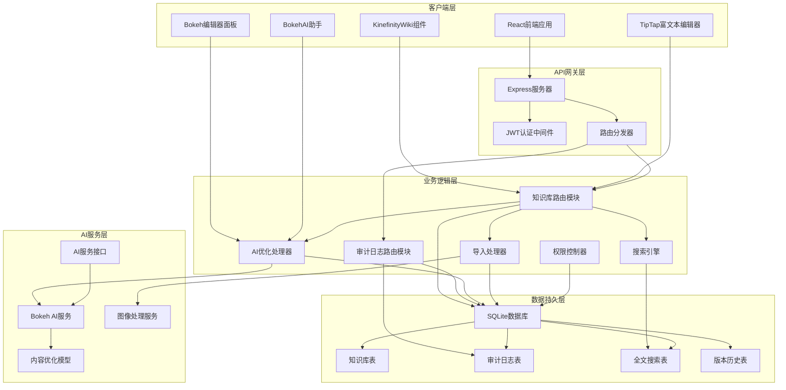

**图表来源**
- [server/index.js](file://server/index.js#L21-L25)
- [server/service/routes/knowledge.js](file://server/service/routes/knowledge.js#L49-L50)
- [server/service/routes/knowledge_audit.js](file://server/service/routes/knowledge_audit.js#L9-L10)
- [server/index.js](file://server/index.js#L524-L553)

## 详细组件分析

### 认证与权限系统

知识库API实现了多层级的权限控制系统：

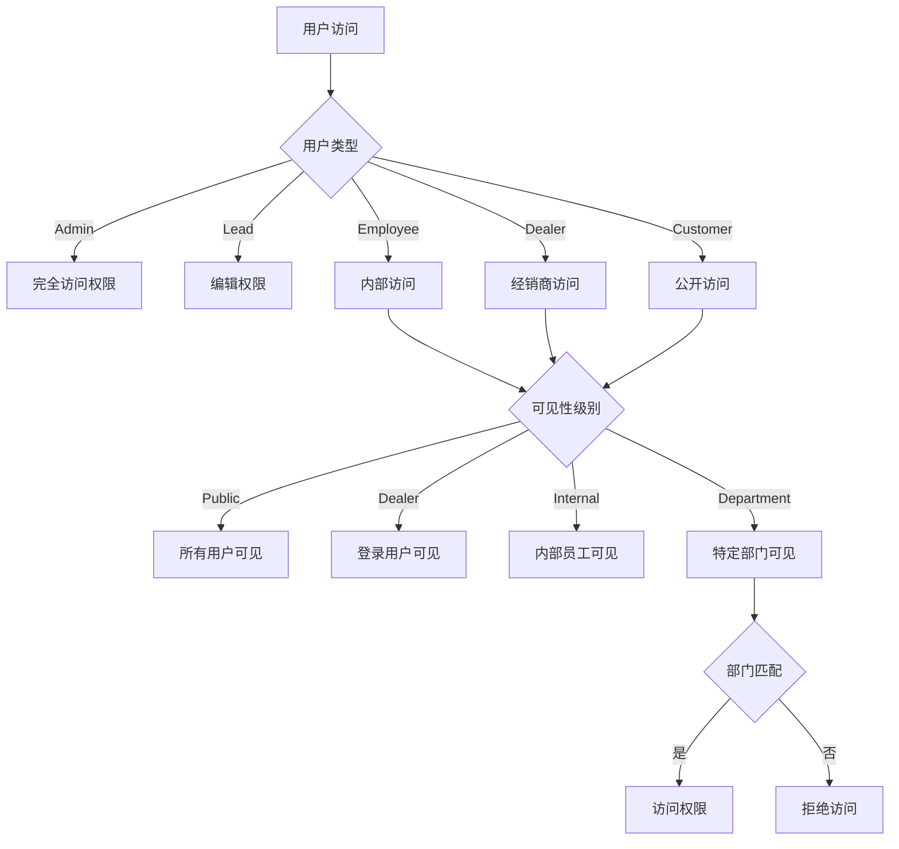

**图表来源**
- [server/service/routes/knowledge.js](file://server/service/routes/knowledge.js#L981-L1017)

权限控制的关键实现包括：

1. **可见性条件构建**：根据用户角色动态生成SQL查询条件
2. **文章访问验证**：在获取文章详情时检查用户权限
3. **编辑权限控制**：管理员、主管和文章作者具有编辑权限

**章节来源**
- [server/service/routes/knowledge.js](file://server/service/routes/knowledge.js#L981-L1023)

### 全文搜索功能

**更新** 知识库系统集成了增强的SQLite FTS5全文搜索引擎，支持更复杂的搜索功能：

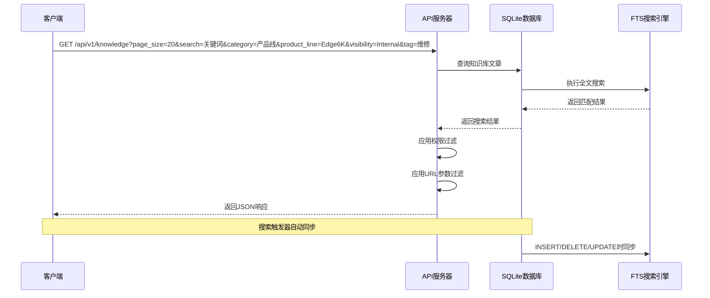

**图表来源**
- [server/service/migrations/005_knowledge_base.sql](file://server/service/migrations/005_knowledge_base.sql#L52-L75)

**更新** 全文搜索的关键特性：

- **实时同步**：通过触发器自动保持FTS表与主表同步
- **多字段搜索**：支持标题、摘要、内容和标签的联合搜索
- **智能排序**：基于相关性评分进行结果排序
- **URL参数过滤**：支持category、product_line、visibility、tag等参数的精确过滤
- **权限控制集成**：搜索结果自动应用用户权限过滤

**章节来源**
- [server/service/migrations/005_knowledge_base.sql](file://server/service/migrations/005_knowledge_base.sql#L52-L75)

### 多格式内容导入

知识库支持多种内容导入方式，每种方式都有专门的处理流程：

#### PDF导入流程

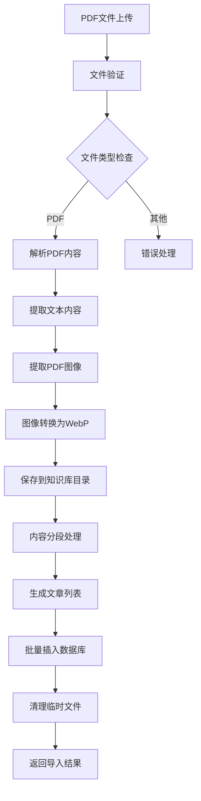

**图表来源**
- [server/service/routes/knowledge.js](file://server/service/routes/knowledge.js#L313-L446)

#### DOCX导入流程

**更新** DOCX导入流程已简化，移除了分块上传功能，并集成了审计日志记录：

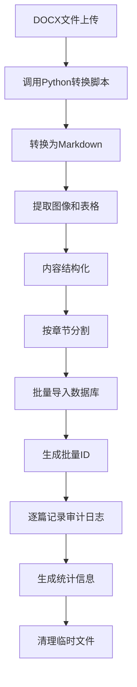

**图表来源**
- [server/service/routes/knowledge.js](file://server/service/routes/knowledge.js#L455-L680)

#### 网页导入流程

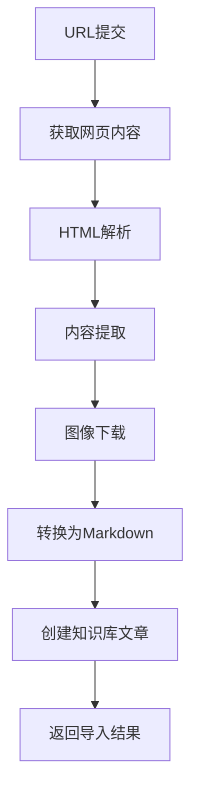

**图表来源**
- [server/service/routes/knowledge.js](file://server/service/routes/knowledge.js#L686-L825)

**章节来源**
- [server/service/routes/knowledge.js](file://server/service/routes/knowledge.js#L313-L825)

### 版本管理与历史追踪

知识库系统实现了完整的版本管理功能：

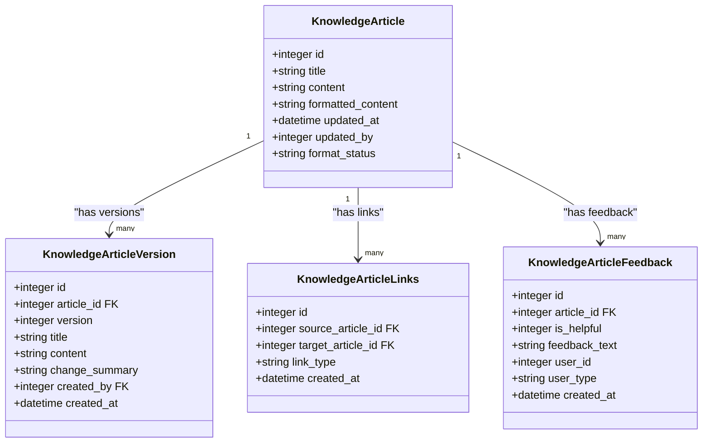

**图表来源**
- [server/service/migrations/005_knowledge_base.sql](file://server/service/migrations/005_knowledge_base.sql#L86-L98)
- [server/service/migrations/005_knowledge_base.sql](file://server/service/migrations/005_knowledge_base.sql#L106-L116)
- [server/service/migrations/005_knowledge_base.sql](file://server/service/migrations/005_knowledge_base.sql#L122-L132)

**章节来源**
- [server/service/migrations/005_knowledge_base.sql](file://server/service/migrations/005_knowledge_base.sql#L86-L132)

### 前端集成与用户体验

客户端知识库组件提供了丰富的交互体验：

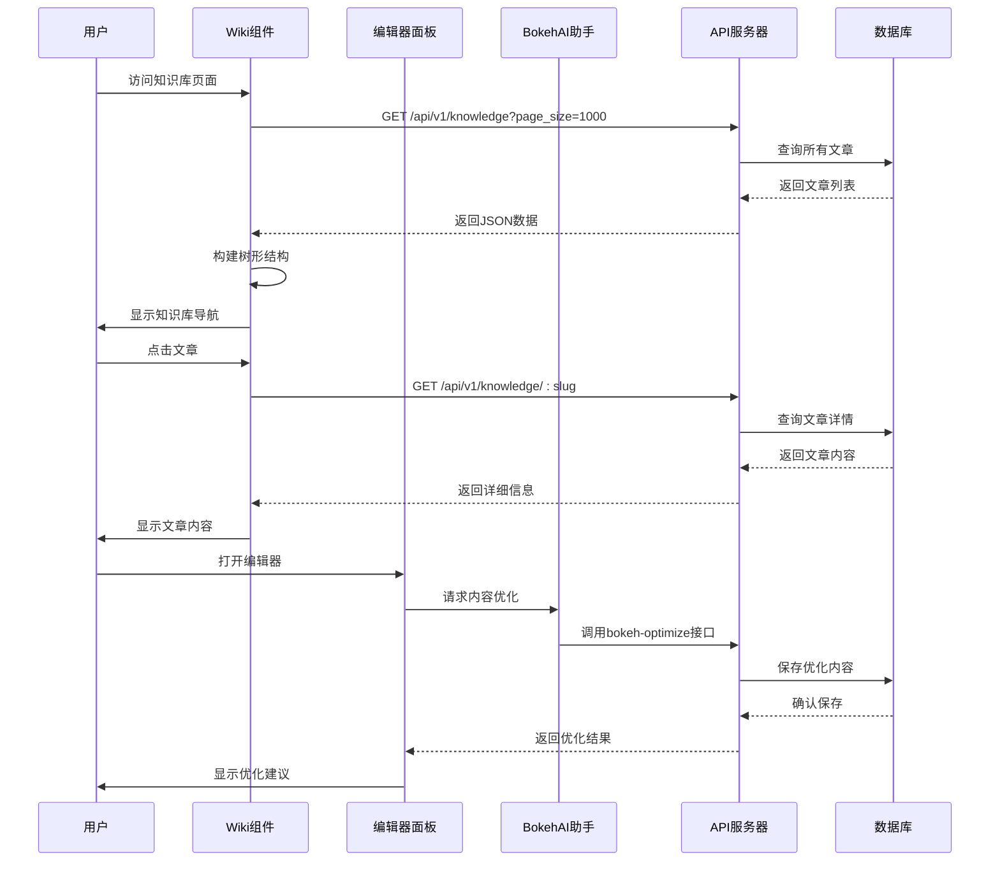

**图表来源**
- [client/src/components/KinefinityWiki.tsx](file://client/src/components/KinefinityWiki.tsx#L232-L304)
- [client/src/components/Bokeh/BokehEditorPanel.tsx](file://client/src/components/Bokeh/BokehEditorPanel.tsx#L1-L150)

前端组件的关键特性：

- **树形导航**：按产品线和类别组织知识库内容
- **响应式设计**：支持桌面和移动设备访问
- **实时搜索**：集成增强的全文搜索功能
- **面包屑导航**：提供清晰的页面路径指示
- **审计面板**：管理员专用的审计日志查看界面
- **AI编辑器**：集成Bokeh助手的智能编辑功能

**章节来源**
- [client/src/components/KinefinityWiki.tsx](file://client/src/components/KinefinityWiki.tsx#L232-L304)
- [client/src/components/Bokeh/BokehEditorPanel.tsx](file://client/src/components/Bokeh/BokehEditorPanel.tsx#L1-L150)

## AI内容优化功能

### Bokeh智能排版系统

系统集成了完整的AI内容优化功能，通过Bokeh助手提供智能化的文章处理能力：

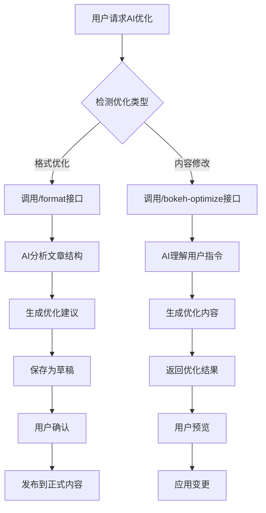

**图表来源**
- [server/service/routes/knowledge.js](file://server/service/routes/knowledge.js#L2054-L2300)
- [server/service/routes/knowledge.js](file://server/service/routes/knowledge.js#L1924-L2047)

### AI优化功能特性

1. **智能排版优化**：自动识别文章结构，优化标题层级和段落格式
2. **内容精简**：删除冗余内容，保持技术准确性
3. **格式修复**：自动修复Markdown格式问题
4. **草稿管理**：支持AI生成内容的草稿保存和发布
5. **用户反馈**：支持基于用户指令的精确内容修改

**章节来源**
- [server/service/routes/knowledge.js](file://server/service/routes/knowledge.js#L2054-L2300)
- [server/service/routes/knowledge.js](file://server/service/routes/knowledge.js#L1924-L2047)

### AI内容优化接口详解

#### 智能排版优化接口

**POST /api/v1/knowledge/:id/format**

该接口提供AI驱动的智能排版优化功能，支持以下模式：

- **full模式**：同时优化摘要和正文
- **layout模式**：仅优化正文排版
- **summary模式**：仅生成优化摘要

接口特点：
- 自动翻译外文内容为中文
- 优化文章结构和标题层级
- 生成详细的中文摘要（300字以内）
- 保持技术参数和操作指令的准确性
- 自动处理图片引用和格式

#### Bokeh内容优化接口

**POST /api/v1/knowledge/:id/bokeh-optimize**

该接口提供编辑器内AI助手的实时内容优化功能：

- 支持用户指令驱动的内容修改
- 实时预览优化效果
- 草稿管理模式
- 编辑器内直接应用变更

#### 格式化内容发布接口

**POST /api/v1/knowledge/:id/publish-format**

该接口用于发布AI优化的格式化内容：

- 将草稿内容正式发布
- 生成版本历史记录
- 更新文章状态为已发布
- 记录审计日志

**章节来源**
- [server/service/routes/knowledge.js](file://server/service/routes/knowledge.js#L2700-L2945)
- [server/service/routes/knowledge.js](file://server/service/routes/knowledge.js#L2947-L3022)

## WYSIWYG编辑器系统

### TipTap富文本编辑器

系统集成了现代化的TipTap富文本编辑器，提供所见即所得的编辑体验：

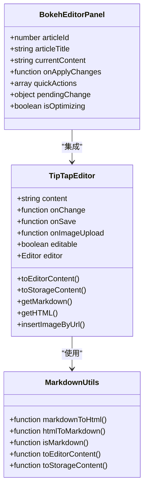

**图表来源**
- [client/src/components/Knowledge/WikiEditor/TipTapEditor.tsx](file://client/src/components/Knowledge/WikiEditor/TipTapEditor.tsx#L1-L486)
- [client/src/components/Knowledge/WikiEditor/markdownUtils.ts](file://client/src/components/Knowledge/WikiEditor/markdownUtils.ts#L1-L212)
- [client/src/components/Bokeh/BokehEditorPanel.tsx](file://client/src/components/Bokeh/BokehEditorPanel.tsx#L1-L452)

### 编辑器核心功能

1. **双向格式转换**：支持Markdown和HTML之间的智能转换
2. **实时预览**：编辑时实时显示内容效果
3. **图片处理**：支持图片插入、缩放和格式控制
4. **快捷键支持**：提供完整的键盘快捷键操作
5. **AI集成**：与Bokeh助手无缝集成，支持智能编辑建议

**章节来源**
- [client/src/components/Knowledge/WikiEditor/TipTapEditor.tsx](file://client/src/components/Knowledge/WikiEditor/TipTapEditor.tsx#L1-L486)
- [client/src/components/Knowledge/WikiEditor/markdownUtils.ts](file://client/src/components/Knowledge/WikiEditor/markdownUtils.ts#L1-L212)
- [client/src/components/Bokeh/BokehEditorPanel.tsx](file://client/src/components/Bokeh/BokehEditorPanel.tsx#L1-L452)

## 图像处理增强

### PDF图像提取系统

系统提供了完整的PDF图像提取和处理功能：

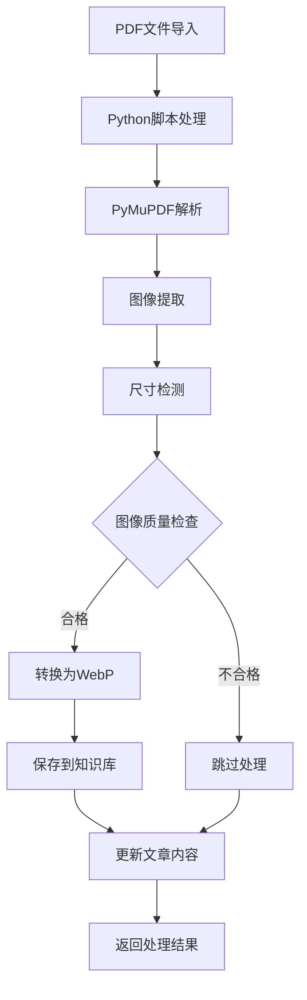

**图表来源**
- [server/service/routes/knowledge.js](file://server/service/routes/knowledge.js#L1847-L1917)
- [server/scripts/extract_pdf_images.py](file://server/scripts/extract_pdf_images.py#L1-L100)

### 图像优化功能

1. **自动图像检测**：从PDF中自动提取相关图像
2. **格式转换**：将图像转换为WebP格式以优化存储
3. **质量控制**：过滤过小或低质量的图像
4. **智能布局**：为提取的图像生成合适的布局元数据
5. **内容关联**：将图像与相应的内容章节关联

**章节来源**
- [server/service/routes/knowledge.js](file://server/service/routes/knowledge.js#L1847-L1917)
- [server/scripts/extract_pdf_images.py](file://server/scripts/extract_pdf_images.py#L1-L100)

## 审计日志功能

### 审计日志表结构

新增的审计日志表提供了完整的操作追踪能力：

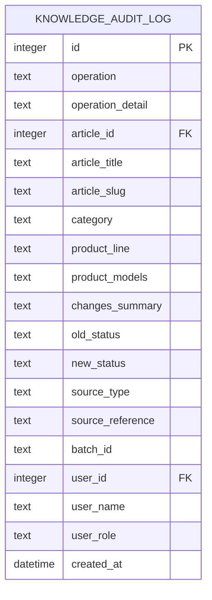

**图表来源**
- [server/migrations/add_knowledge_audit_log.sql](file://server/migrations/add_knowledge_audit_log.sql#L4-L41)

### 审计日志记录机制

审计日志功能通过函数注入机制实现：

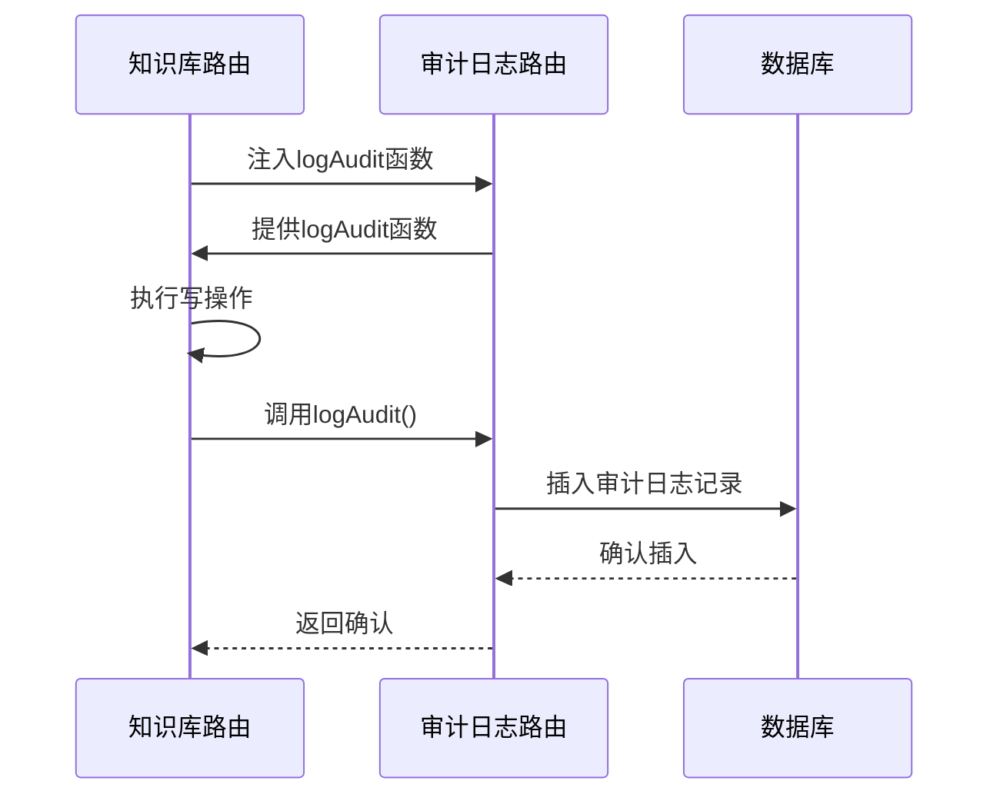

**图表来源**
- [server/service/routes/knowledge.js](file://server/service/routes/knowledge.js#L56-L60)
- [server/service/routes/knowledge_audit.js](file://server/service/routes/knowledge_audit.js#L271-L272)

### 审计日志记录范围

系统会自动记录以下操作的审计日志：

1. **文章创建**：记录创建者、创建时间、初始状态
2. **文章更新**：记录修改字段、修改摘要、状态变化
3. **批量导入**：记录批量ID、导入来源、导入文件
4. **格式优化**：记录AI优化操作、优化内容和用户
5. **草稿发布**：记录发布操作、发布内容和审批人
6. **状态变更**：记录状态变化前后的对比
7. **权限操作**：记录权限相关的操作

**章节来源**
- [server/service/routes/knowledge.js](file://server/service/routes/knowledge.js#L295-L312)
- [server/service/routes/knowledge.js](file://server/service/routes/knowledge.js#L953-L986)
- [server/service/routes/knowledge.js](file://server/service/routes/knowledge.js#L685-L714)

### 审计日志查询功能

审计日志模块提供了完整的查询和统计功能：

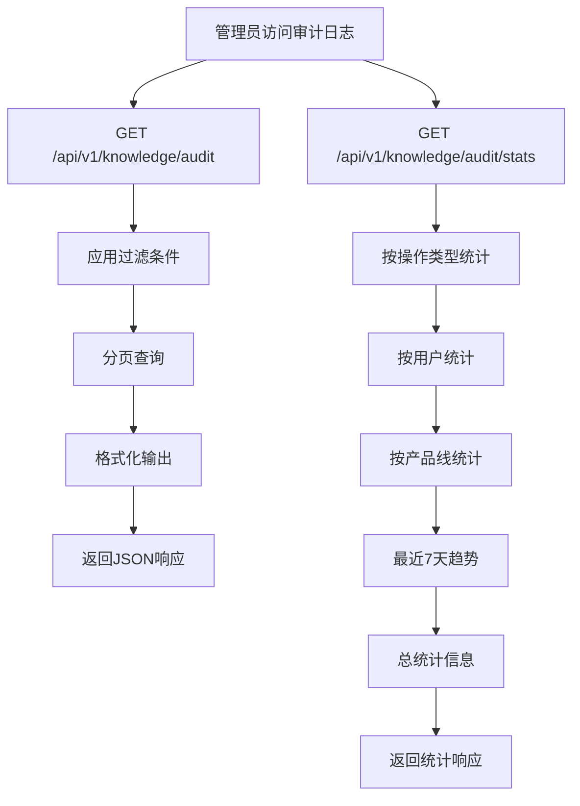

**图表来源**
- [server/service/routes/knowledge_audit.js](file://server/service/routes/knowledge_audit.js#L142-L190)
- [server/service/routes/knowledge_audit.js](file://server/service/routes/knowledge_audit.js#L205-L269)

**章节来源**
- [server/service/routes/knowledge_audit.js](file://server/service/routes/knowledge_audit.js#L142-L190)
- [server/service/routes/knowledge_audit.js](file://server/service/routes/knowledge_audit.js#L205-L269)

## 依赖关系分析

知识库API的依赖关系体现了清晰的分层架构和模块化设计：

```mermaid
graph TB
subgraph "外部依赖"
A[Express.js]
B[Multer]
C[PDF-parse]
D[Axios]
E[Cheerio]
F[Turndown]
G[Sharp]
H[Crypto]
I[Child_process]
J[@tiptap/react]
K[@tiptap/starter-kit]
L[turndown]
M[framer-motion]
N[zustand]
O[OpenAI SDK]
end
subgraph "内部模块"
P[JWT认证]
Q[数据库连接]
R[权限控制]
S[文件处理]
T[搜索引擎]
U[审计日志注入]
V[Bokeh AI服务]
W[AI服务接口]
end
subgraph "核心功能"
X[知识库路由]
Y[审计日志路由]
Z[AI优化处理器]
AA[导入处理器]
BB[搜索功能]
CC[权限验证]
DD[WYSIWYG编辑器]
EE[图像处理]
FF[格式化内容发布]
end
A --> X
A --> Y
B --> AA
C --> AA
D --> AA
E --> AA
F --> AA
G --> EE
H --> Y
I --> AA
P --> X
P --> Y
Q --> X
Q --> Y
R --> X
S --> AA
T --> BB
U --> X
U --> Y
V --> Z
W --> V
X --> AA
X --> BB
X --> CC
Y --> U
Z --> V
DD --> J
DD --> K
DD --> L
EE --> G
FF --> DD
```

**图表来源**
- [server/service/routes/knowledge.js](file://server/service/routes/knowledge.js#L7-L17)
- [server/service/routes/knowledge_audit.js](file://server/service/routes/knowledge_audit.js#L6-L8)
- [server/index.js](file://server/index.js#L1-L13)

**章节来源**
- [server/service/routes/knowledge.js](file://server/service/routes/knowledge.js#L7-L17)
- [server/service/routes/knowledge_audit.js](file://server/service/routes/knowledge_audit.js#L6-L8)

## 性能考虑

### 数据库优化策略

1. **索引优化**：为常用查询字段建立索引
2. **全文搜索**：使用FTS5提高搜索性能
3. **分页查询**：默认限制每页20条记录
4. **审计日志索引**：为审计日志表建立专门的查询索引
5. **缓存策略**：静态资源使用CDN缓存

### 文件处理优化

1. **异步处理**：PDF和DOCX导入使用异步处理
2. **图像压缩**：自动转换为WebP格式
3. **临时文件管理**：及时清理导入过程中的临时文件
4. **并发限制**：设置文件大小和数量限制
5. **AI处理缓存**：智能缓存AI优化结果

### 前端性能优化

1. **懒加载**：文章内容按需加载
2. **本地存储**：缓存展开状态和浏览历史
3. **虚拟滚动**：大量文章时使用虚拟滚动
4. **防抖搜索**：搜索输入添加防抖机制
5. **审计日志分页**：审计日志使用分页加载
6. **编辑器性能**：TipTap编辑器使用高效的渲染策略
7. **AI优化性能**：Bokeh编辑器面板使用轻量级UI组件

### AI优化性能优化

1. **批量处理**：支持批量AI优化操作
2. **异步执行**：AI处理不影响主要业务流程
3. **结果缓存**：智能缓存优化结果
4. **资源管理**：合理管理AI服务资源
5. **草稿管理**：优化草稿的存储和检索
6. **流式处理**：支持AI响应的流式处理

## 故障排除指南

### 常见问题及解决方案

#### 认证失败
- **症状**：401未授权错误
- **原因**：JWT令牌无效或过期
- **解决**：重新登录获取新令牌

#### 权限不足
- **症状**：403禁止访问
- **原因**：用户角色不满足可见性要求
- **解决**：联系管理员调整用户权限

#### 文件导入失败
- **症状**：导入API返回错误
- **原因**：文件格式不支持或文件损坏
- **解决**：检查文件格式和完整性

#### 搜索无结果
- **症状**：搜索返回空结果
- **原因**：内容未同步到FTS索引
- **解决**：等待自动同步完成或手动重建索引

#### 审计日志访问失败
- **症状**：403禁止访问审计日志
- **原因**：用户非管理员角色
- **解决**：使用管理员账户登录

#### AI优化失败
- **症状**：AI优化接口返回错误
- **原因**：AI服务不可用或网络问题
- **解决**：检查AI服务状态和网络连接

#### 编辑器加载失败
- **症状**：编辑器无法正常加载
- **原因**：JavaScript资源加载失败
- **解决**：刷新页面或检查浏览器兼容性

#### Bokeh优化异常
- **症状**：编辑器内AI助手无响应
- **原因**：AI服务配置错误或网络问题
- **解决**：检查AI服务配置和连接状态

#### 格式化内容发布失败
- **症状**：发布格式化内容返回错误
- **原因**：草稿内容不存在或权限不足
- **解决**：确认草稿状态和管理员权限

**章节来源**
- [server/service/routes/knowledge.js](file://server/service/routes/knowledge.js#L144-L150)
- [server/service/routes/knowledge.js](file://server/service/routes/knowledge.js#L294-L306)
- [server/service/routes/knowledge_audit.js](file://server/service/routes/knowledge_audit.js#L196-L203)

### 错误代码参考

| 错误代码 | 描述 | 建议解决方案 |
|----------|------|-------------|
| SERVER_ERROR | 服务器内部错误 | 检查服务器日志，重启服务 |
| FORBIDDEN | 权限不足 | 验证用户角色和权限 |
| NOT_FOUND | 资源不存在 | 检查URL参数和资源状态 |
| DUPLICATE_SLUG | 别名重复 | 修改文章标题生成新的别名 |
| IMPORT_ERROR | 导入失败 | 检查文件格式和内容质量 |
| VALIDATION_ERROR | 参数验证失败 | 检查请求参数的完整性和格式 |
| AUDIT_ACCESS_DENIED | 审计日志访问被拒绝 | 确保用户具有管理员权限 |
| AI_NOT_AVAILABLE | AI服务未配置 | 检查AI服务配置和可用性 |
| FORMAT_ERROR | 格式化失败 | 检查内容质量和AI服务状态 |
| OPTIMIZE_ERROR | 优化失败 | 检查用户指令和内容格式 |
| PUBLISH_ERROR | 发布失败 | 检查草稿状态和权限 |
| NO_DRAFT | 无草稿内容 | 确认AI优化已完成 |

## 结论

Longhorn项目的知识库API接口展现了现代Web应用的最佳实践，经过重大升级后具备了更强的智能化和用户体验：

1. **完整的功能覆盖**：从基础的CRUD操作到高级的全文搜索、版本管理和审计追踪
2. **智能化内容处理**：通过Bokeh AI助手实现智能排版、内容优化和草稿管理
3. **现代化编辑体验**：集成TipTap富文本编辑器，提供所见即所得的编辑功能
4. **灵活的权限控制**：多层级可见性系统满足不同用户群体的需求
5. **强大的内容处理能力**：支持多种格式的内容导入和处理，包括PDF图像提取
6. **优秀的用户体验**：直观的前端界面和流畅的交互体验
7. **良好的架构设计**：清晰的分层结构和模块化的组件设计
8. **合规性保障**：完整的审计日志功能确保所有操作可追溯
9. **管理员支持**：专业的审计日志管理界面便于监督和审查
10. **AI驱动的智能优化**：全新的AI内容优化功能，支持实时编辑和草稿管理

**更新** 新增的AI内容优化功能和WYSIWYG编辑器系统显著提升了知识库的智能化水平和用户体验。通过Bokeh助手，用户可以轻松实现内容格式化、图片优化和结构改进，而TipTap编辑器则提供了专业级的编辑体验。**增强的搜索功能**包括FTS5全文搜索、URL参数过滤和复杂的权限控制，支持更精细的产品家族和模型过滤，以及增强的搜索结果处理，使系统能够更好地满足企业级知识管理的需求。**格式化内容发布功能**为AI优化内容提供了标准化的发布流程，确保内容质量和一致性。

该系统为Kinefinity公司提供了可靠的知识管理基础设施，支持产品文档、故障排查和技术支持等多种应用场景。通过持续的优化和扩展，特别是新增的AI优化功能、现代化编辑器和增强的搜索功能，该系统将继续为企业的发展提供强有力的技术支撑，同时满足日益严格的合规性要求和用户体验标准。