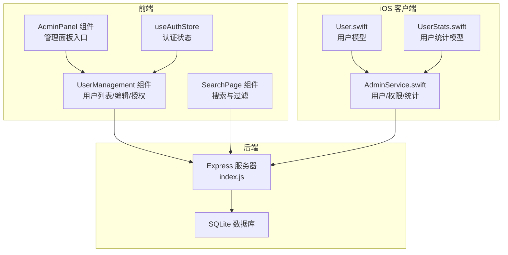
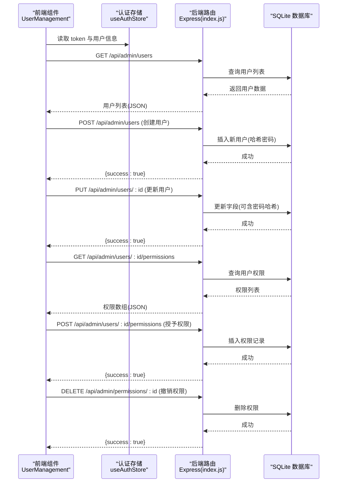
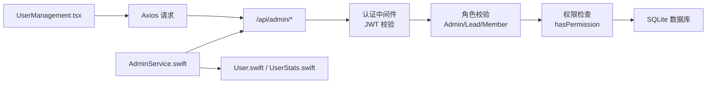

# 用户管理 API

<cite>
**本文档引用的文件**
- [client/src/components/UserManagement.tsx](file://client/src/components/UserManagement.tsx)
- [server/index.js](file://server/index.js)
- [ios/LonghornApp/Services/AdminService.swift](file://ios/LonghornApp/Services/AdminService.swift)
- [ios/LonghornApp/Models/User.swift](file://ios/LonghornApp/Models/User.swift)
- [client/src/store/useAuthStore.ts](file://client/src/store/useAuthStore.ts)
- [client/src/components/AdminPanel.tsx](file://client/src/components/AdminPanel.tsx)
- [client/src/components/SearchPage.tsx](file://client/src/components/SearchPage.tsx)
- [ios/LonghornApp/Models/UserStats.swift](file://ios/LonghornApp/Models/UserStats.swift)
</cite>

## 目录
1. [简介](#简介)
2. [项目结构](#项目结构)
3. [核心组件](#核心组件)
4. [架构总览](#架构总览)
5. [详细组件分析](#详细组件分析)
6. [依赖关系分析](#依赖关系分析)
7. [性能考虑](#性能考虑)
8. [故障排除指南](#故障排除指南)
9. [结论](#结论)

## 简介
本文件系统化梳理了用户管理 API 的设计与实现，覆盖用户 CRUD 操作、状态管理、角色权限变更、动态授权、用户信息更新、用户列表查询与搜索过滤、分页策略、管理面板数据展示、批量操作以及权限验证机制，并补充了用户统计、活跃度监控与异常行为检测相关接口说明。

## 项目结构
- 前端采用 React + TypeScript，后端采用 Node.js + Express，数据库使用 SQLite。
- 用户管理功能由前端组件负责交互与调用，后端提供 RESTful API，iOS 客户端通过 Swift 服务封装调用。

图表来源
- [client/src/components/UserManagement.tsx](file://client/src/components/UserManagement.tsx#L129-L319)
- [server/index.js](file://server/index.js#L988-L1064)
- [ios/LonghornApp/Services/AdminService.swift](file://ios/LonghornApp/Services/AdminService.swift#L1-L155)

章节来源
- [client/src/components/UserManagement.tsx](file://client/src/components/UserManagement.tsx#L129-L319)
- [server/index.js](file://server/index.js#L988-L1064)
- [ios/LonghornApp/Services/AdminService.swift](file://ios/LonghornApp/Services/AdminService.swift#L1-L155)

## 核心组件
- 用户管理前端组件：负责用户列表展示、搜索过滤、创建/更新用户、动态授权与撤销授权、个人空间跳转等。
- 后端用户管理路由：提供用户 CRUD、权限管理、部门管理、系统统计、搜索与访问日志等接口。
- iOS 管理服务：封装用户、权限、系统统计的网络请求，提供类型安全的数据模型。
- 认证与权限中间件：基于 JWT 的鉴权与角色校验（Admin/Lead/Member）。

章节来源
- [client/src/components/UserManagement.tsx](file://client/src/components/UserManagement.tsx#L129-L319)
- [server/index.js](file://server/index.js#L988-L1064)
- [ios/LonghornApp/Services/AdminService.swift](file://ios/LonghornApp/Services/AdminService.swift#L1-L155)
- [client/src/store/useAuthStore.ts](file://client/src/store/useAuthStore.ts#L1-L31)

## 架构总览
用户管理 API 的调用链路如下：

图表来源
- [client/src/components/UserManagement.tsx](file://client/src/components/UserManagement.tsx#L297-L315)
- [server/index.js](file://server/index.js#L988-L1064)

## 详细组件分析

### 用户管理前端组件（UserManagement）
- 职责
  - 加载用户列表与部门列表
  - 支持按用户名本地搜索过滤
  - 创建新用户（Admin/Lead）
  - 更新用户信息（用户名、角色、部门、密码）
  - 查看与管理用户动态权限（授予/撤销）
  - 跳转到用户个人空间
- 关键交互
  - 并发加载用户与部门：Promise.all
  - 权限授予流程：选择目录、选择权限类型、设置过期时间、提交授权
  - 撤销权限前确认对话框
- 数据流
  - 通过 Axios 发起带 Bearer Token 的请求
  - 使用 useAuthStore 提供的 token 与用户角色进行条件渲染与操作按钮显示

章节来源
- [client/src/components/UserManagement.tsx](file://client/src/components/UserManagement.tsx#L129-L319)
- [client/src/components/UserManagement.tsx](file://client/src/components/UserManagement.tsx#L230-L315)

### 后端用户管理路由（Express）
- 用户 CRUD
  - GET /api/admin/users：返回用户列表；Lead 角色仅能查看同部门成员
  - POST /api/admin/users：创建用户（Admin/Lead）
  - PUT /api/admin/users/:id：更新用户（Admin）
  - DELETE /api/admin/users/:id：删除用户（Admin）
- 动态权限管理
  - GET /api/admin/users/:id/permissions：获取用户权限（Admin/Lead）
  - POST /api/admin/users/:id/permissions：授予权限（Admin/Lead）
  - DELETE /api/admin/permissions/:id：撤销权限（Admin/Lead）
- 部门管理
  - GET /api/admin/departments：获取部门列表（Admin）
  - POST /api/admin/departments：新增部门（Admin）
- 系统统计与访问日志
  - GET /api/admin/stats：系统统计（Admin）
  - POST /api/files/access：记录文件访问（用于活跃度监控）

章节来源
- [server/index.js](file://server/index.js#L960-L1064)
- [server/index.js](file://server/index.js#L1171-L1269)
- [server/index.js](file://server/index.js#L1271-L1313)

### iOS 管理服务（AdminService）
- 职责
  - 获取用户列表、部门列表
  - 获取系统统计
  - 获取用户权限、撤销权限
  - 更新用户信息、授予权限
  - 文件浏览（用于权限授予时选择目录）
- 数据模型
  - User、UserRole、Department、SystemStats、UserStats 等

章节来源
- [ios/LonghornApp/Services/AdminService.swift](file://ios/LonghornApp/Services/AdminService.swift#L1-L155)
- [ios/LonghornApp/Models/User.swift](file://ios/LonghornApp/Models/User.swift#L1-L85)
- [ios/LonghornApp/Models/UserStats.swift](file://ios/LonghornApp/Models/UserStats.swift#L1-L18)

### 认证与权限中间件
- 认证中间件：解析 Authorization 头中的 Bearer Token，校验 JWT 并从数据库刷新用户最新角色/部门信息
- 角色校验：isAdmin 仅允许 Admin；部分权限接口要求 Admin 或 Lead
- 路径权限检查：hasPermission 用于判断用户对路径的访问权限（含个人空间、部门空间、扩展权限）

章节来源
- [server/index.js](file://server/index.js#L267-L295)
- [server/index.js](file://server/index.js#L391-L394)
- [server/index.js](file://server/index.js#L297-L353)

### 用户列表查询、搜索过滤与分页
- 列表查询
  - 前端本地搜索：在用户列表上按用户名进行大小写无关的过滤
  - 后端查询：GET /api/admin/users 返回用户列表；Lead 只能看到同部门成员
- 分页
  - 当前实现未提供后端分页参数（如 page/limit），前端通过本地数组切片或一次性加载全量数据
- 搜索过滤
  - 前端搜索：SearchPage 组件支持按名称与类型过滤（image/video/document）
  - 后端搜索：GET /api/search 支持按关键词、类型与部门过滤，限制结果数量上限

章节来源
- [client/src/components/UserManagement.tsx](file://client/src/components/UserManagement.tsx#L317-L319)
- [server/index.js](file://server/index.js#L960-L986)
- [client/src/components/SearchPage.tsx](file://client/src/components/SearchPage.tsx#L19-L49)
- [server/index.js](file://server/index.js#L1424-L1479)

### 用户管理面板与批量操作
- 管理面板入口：AdminPanel 提供“仪表盘/成员/部门/设置”菜单
- 批量操作
  - 前端当前未实现批量勾选与批量操作
  - 建议：在用户列表增加复选框，结合后端批量接口（如批量更新角色/撤销权限）以提升效率

章节来源
- [client/src/components/AdminPanel.tsx](file://client/src/components/AdminPanel.tsx#L1-L66)

### 权限验证机制
- 基于角色的访问控制：Admin/Lead/Member
- 路径权限：hasPermission 综合个人空间、部门空间、扩展权限与过期时间
- 授权范围：Lead 仅能对本部门路径进行授权，且只能授予本部门成员

章节来源
- [server/index.js](file://server/index.js#L1016-L1064)
- [server/index.js](file://server/index.js#L297-L353)

### 用户统计、活跃度监控与异常行为检测
- 用户统计
  - GET /api/user/stats：返回上传数量、存储用量、收藏数量、分享数量、最后登录时间、账户创建时间等
- 系统统计
  - GET /api/admin/stats：返回今日/本周/本月上传统计、存储使用率、Top 上传者、总文件数等
- 活跃度监控
  - POST /api/files/access：记录文件访问，可用于统计用户最近活跃度
  - GET /api/department/stats：部门维度统计，包含近一周活跃成员数
- 异常行为检测
  - 可基于 access_logs 与 file_stats 的访问计数、最近访问时间、上传频率等指标进行规则化检测（建议在后端实现独立的审计/风控模块）

章节来源
- [server/index.js](file://server/index.js#L1631-L1698)
- [server/index.js](file://server/index.js#L1171-L1269)
- [server/index.js](file://server/index.js#L1271-L1313)
- [server/index.js](file://server/index.js#L1777-L1840)

## 依赖关系分析

图表来源
- [client/src/components/UserManagement.tsx](file://client/src/components/UserManagement.tsx#L170-L188)
- [server/index.js](file://server/index.js#L267-L295)
- [server/index.js](file://server/index.js#L391-L394)
- [server/index.js](file://server/index.js#L297-L353)
- [ios/LonghornApp/Services/AdminService.swift](file://ios/LonghornApp/Services/AdminService.swift#L1-L155)
- [ios/LonghornApp/Models/User.swift](file://ios/LonghornApp/Models/User.swift#L1-L85)
- [ios/LonghornApp/Models/UserStats.swift](file://ios/LonghornApp/Models/UserStats.swift#L1-L18)

章节来源
- [client/src/components/UserManagement.tsx](file://client/src/components/UserManagement.tsx#L170-L188)
- [server/index.js](file://server/index.js#L267-L295)
- [server/index.js](file://server/index.js#L391-L394)
- [server/index.js](file://server/index.js#L297-L353)
- [ios/LonghornApp/Services/AdminService.swift](file://ios/LonghornApp/Services/AdminService.swift#L1-L155)

## 性能考虑
- 前端搜索为本地过滤，适合中小规模用户集；大规模场景建议后端分页与模糊索引
- 权限检查 hasPermission 在每次访问时进行，建议缓存用户权限集合以减少数据库查询
- 系统统计与部门统计涉及磁盘扫描，建议异步任务与缓存策略降低实时计算压力
- 图片缩略图生成使用队列与并发限制，避免 CPU/IO 过载

## 故障排除指南
- 401 未认证：检查 Authorization 头是否携带 Bearer Token，确认 JWT 未过期
- 403 权限不足：确认当前用户角色是否满足 Admin/Lead 要求，或是否越权访问他人数据
- 404 用户/权限不存在：确认用户 ID 或权限 ID 是否正确
- 搜索无结果：确认关键词、类型过滤与部门过滤是否合理，后端限制最多 100 条结果
- 访问日志失败：确认文件路径存在且用户有相应权限

章节来源
- [server/index.js](file://server/index.js#L267-L295)
- [server/index.js](file://server/index.js#L1016-L1064)
- [server/index.js](file://server/index.js#L1424-L1479)
- [server/index.js](file://server/index.js#L1271-L1313)

## 结论
用户管理 API 已具备完整的用户 CRUD、动态授权与权限验证能力，并提供了系统统计与活跃度监控接口。前端与 iOS 客户端通过统一的后端接口实现一致的用户体验。建议后续增强后端分页、批量操作与异常行为检测能力，进一步提升可维护性与安全性。