# 管理员管理 API

<cite>
**本文档引用的文件**
- [server/index.js](file://server/index.js)
- [client/src/components/AdminPanel.tsx](file://client/src/components/AdminPanel.tsx)
- [client/src/components/UserManagement.tsx](file://client/src/components/UserManagement.tsx)
- [client/src/components/DepartmentManagement.tsx](file://client/src/components/DepartmentManagement.tsx)
- [client/src/components/SystemDashboard.tsx](file://client/src/components/SystemDashboard.tsx)
- [client/src/components/Admin/AdminSettings.tsx](file://client/src/components/Admin/AdminSettings.tsx)
- [client/src/components/KnowledgeAuditLog.tsx](file://client/src/components/KnowledgeAuditLog.tsx)
- [client/src/components/DepartmentDashboard.tsx](file://client/src/components/DepartmentDashboard.tsx)
- [client/src/components/ProductManagement.tsx](file://client/src/components/ProductManagement.tsx)
- [client/src/components/ProductModelsManagement.tsx](file://client/src/components/ProductModelsManagement.tsx)
- [client/src/components/ProductDetailPage.tsx](file://client/src/components/ProductDetailPage.tsx)
- [server/service/routes/settings.js](file://server/service/routes/settings.js)
- [server/service/routes/knowledge_audit.js](file://server/service/routes/knowledge_audit.js)
- [server/service/routes/products-admin.js](file://server/service/routes/products-admin.js)
- [server/service/routes/product-models-admin.js](file://server/service/routes/product-models-admin.js)
- [server/migrations/add_knowledge_audit_log.sql](file://server/migrations/add_knowledge_audit_log.sql)
- [server/migrations/016_add_product_models.sql](file://server/migrations/016_add_product_models.sql)
- [server/migrations/017_add_product_status.sql](file://server/migrations/017_add_product_status.sql)
- [server/migrations/015_extend_products_data.js](file://server/migrations/015_extend_products_data.js)
- [server/service/ai_service.js](file://server/service/ai_service.js)
- [ios/LonghornApp/Services/AdminService.swift](file://ios/LonghornApp/Services/AdminService.swift)
- [client/src/store/useAuthStore.ts](file://client/src/store/useAuthStore.ts)
- [client/src/i18n/translations.ts](file://client/src/i18n/translations.ts)
- [client/src/App.tsx](file://client/src/App.tsx)
- [server/scripts/migrate_ai.js](file://server/scripts/migrate_ai.js)
- [server/scripts/verify_ai.js](file://server/scripts/verify_ai.js)
- [server/service/index.js](file://server/service/index.js)
- [server/reset_user_passwords.js](file://server/reset_user_passwords.js)
</cite>

## 更新摘要
**所做更改**
- 新增全面的产品管理 CRUD 操作支持，包括产品台账和产品型号管理
- 新增按产品家族和状态的高级过滤功能
- 新增跨字段关键字搜索和可配置页面大小的分页
- 新增 Lead 角色支持和权限控制机制
- 改进的管理员面板功能，支持 Lead 角色动态菜单显示
- 服务模块移除 dashboard 选项，文件模块保留 dashboard 功能
- 增强默认标签页选择逻辑，区分 Admin/Lead/Service 角色
- 新增部门主管专用的部门仪表板功能

## 目录
1. [简介](#简介)
2. [项目结构](#项目结构)
3. [核心组件](#核心组件)
4. [架构总览](#架构总览)
5. [详细组件分析](#详细组件分析)
6. [依赖关系分析](#依赖关系分析)
7. [性能考虑](#性能考虑)
8. [故障排除指南](#故障排除指南)
9. [结论](#结论)

## 简介
本文件为 Longhorn 企业文件管理系统的管理员管理 API 详细文档，聚焦管理员专用的用户管理、部门管理、系统配置与统计监控接口规范。文档涵盖管理员 CRUD 操作、批量管理功能、系统维护接口，以及权限分配、角色变更、系统设置更新等管理能力。特别关注最新的管理员设置系统重构，从简单的占位符实现升级为完整的AdminSettings组件，包含通用设置、AI智能中心、系统健康监控和知识库审计功能。同时提供管理员面板的数据展示、操作权限与安全验证机制说明，并包含系统监控、日志管理与故障排除相关的 API 接口。

**新增** 最新的更新引入了 Lead 角色支持，为部门主管提供精细化的管理权限控制。AdminPanel 现在能够根据用户角色动态调整菜单项显示，服务模块移除 dashboard 选项，文件模块保留 dashboard 功能，增强了默认标签页选择逻辑以区分不同角色的使用场景。

**新增** 服务端管理员路由大幅扩展，新增全面的CRUD操作支持产品管理，API端点支持按产品家族和状态高级过滤、跨字段关键字搜索和可配置页面大小的分页。产品管理功能包括产品台账（Installed Base）和产品型号管理两大模块，为设备生命周期管理和产品线维护提供完整的API支持。

## 项目结构
Longhorn 采用前后端分离架构：前端使用 React/Vite，后端基于 Node.js + Express + SQLite；iOS 客户端通过 Swift 服务层调用后端 API。管理员功能主要分布在前端管理面板组件与后端路由中，配合认证中间件与权限校验函数实现细粒度的管理控制。新增的AdminSettings组件提供统一的系统配置管理界面，支持AI智能中心、系统健康监控、通用设置和知识库审计的综合管理。

```mermaid
graph TB
subgraph "前端"
AdminPanel["AdminPanel.tsx<br/>管理面板入口"]
UserMgmt["UserManagement.tsx<br/>用户管理"]
DeptMgmt["DepartmentManagement.tsx<br/>部门管理"]
SysDash["SystemDashboard.tsx<br/>系统仪表盘"]
AdminSettings["AdminSettings.tsx<br/>管理员设置系统"]
KnowledgeAudit["KnowledgeAuditLog.tsx<br/>知识库审计日志"]
DeptDashboard["DepartmentDashboard.tsx<br/>部门仪表板"]
ProductMgmt["ProductManagement.tsx<br/>产品管理"]
ProductModels["ProductModelsManagement.tsx<br/>产品型号管理"]
ProductDetail["ProductDetailPage.tsx<br/>产品详情"]
AuthStore["useAuthStore.ts<br/>认证状态"]
end
subgraph "后端"
Server["server/index.js<br/>Express 服务器"]
AuthMW["authenticate()<br/>JWT 认证"]
AdminMW["isAdmin()/requireAdmin()<br/>管理员校验"]
PermFn["hasPermission()<br/>权限判断"]
SettingsRouter["settings.js<br/>系统设置路由"]
AuditRouter["knowledge_audit.js<br/>审计日志路由"]
ProductsRouter["products-admin.js<br/>产品管理路由"]
ModelsRouter["product-models-admin.js<br/>产品型号路由"]
AuditTable["knowledge_audit_log<br/>审计日志表"]
ProductsTable["products<br/>产品表"]
ModelsTable["product_models<br/>产品型号表"]
AIService["ai_service.js<br/>AI服务"]
ResetScript["reset_user_passwords.js<br/>密码重置脚本"]
end
subgraph "iOS 客户端"
AdminSvc["AdminService.swift<br/>管理服务"]
end
AdminPanel --> UserMgmt
AdminPanel --> DeptMgmt
AdminPanel --> SysDash
AdminPanel --> AdminSettings
AdminPanel --> KnowledgeAudit
AdminPanel --> DeptDashboard
AdminPanel --> ProductMgmt
AdminPanel --> ProductModels
UserMgmt --> AuthStore
DeptMgmt --> AuthStore
SysDash --> AuthStore
AdminSettings --> AuthStore
KnowledgeAudit --> AuthStore
DeptDashboard --> AuthStore
ProductMgmt --> AuthStore
ProductModels --> AuthStore
ProductDetail --> AuthStore
UserMgmt --> Server
DeptMgmt --> Server
SysDash --> Server
AdminSettings --> SettingsRouter
AdminSettings --> AuditRouter
KnowledgeAudit --> AuditRouter
ProductMgmt --> ProductsRouter
ProductModels --> ModelsRouter
SettingsRouter --> AIService
AuditRouter --> AuditTable
ProductsRouter --> ProductsTable
ModelsRouter --> ModelsTable
ResetScript --> Server
AdminSvc --> Server
Server --> AuthMW
Server --> AdminMW
Server --> PermFn
```

**图表来源**
- [server/index.js](file://server/index.js#L267-L394)
- [client/src/components/AdminPanel.tsx](file://client/src/components/AdminPanel.tsx#L10-L33)
- [client/src/components/Admin/AdminSettings.tsx](file://client/src/components/Admin/AdminSettings.tsx#L1-L649)
- [client/src/components/KnowledgeAuditLog.tsx](file://client/src/components/KnowledgeAuditLog.tsx#L64-L153)
- [client/src/components/DepartmentDashboard.tsx](file://client/src/components/DepartmentDashboard.tsx#L1-L200)
- [client/src/components/ProductManagement.tsx](file://client/src/components/ProductManagement.tsx#L1-L800)
- [client/src/components/ProductModelsManagement.tsx](file://client/src/components/ProductModelsManagement.tsx#L1-L700)
- [client/src/components/ProductDetailPage.tsx](file://client/src/components/ProductDetailPage.tsx#L1-L599)
- [server/service/routes/settings.js](file://server/service/routes/settings.js#L1-L200)
- [server/service/routes/knowledge_audit.js](file://server/service/routes/knowledge_audit.js#L1-L281)
- [server/service/routes/products-admin.js](file://server/service/routes/products-admin.js#L1-L600)
- [server/service/routes/product-models-admin.js](file://server/service/routes/product-models-admin.js#L1-L249)
- [server/migrations/add_knowledge_audit_log.sql](file://server/migrations/add_knowledge_audit_log.sql#L1-L50)
- [server/migrations/016_add_product_models.sql](file://server/migrations/016_add_product_models.sql#L1-L31)
- [server/migrations/017_add_product_status.sql](file://server/migrations/017_add_product_status.sql#L1-L17)
- [server/migrations/015_extend_products_data.js](file://server/migrations/015_extend_products_data.js#L1-L201)
- [server/service/ai_service.js](file://server/service/ai_service.js#L47-L77)
- [client/src/store/useAuthStore.ts](file://client/src/store/useAuthStore.ts#L17-L30)
- [ios/LonghornApp/Services/AdminService.swift](file://ios/LonghornApp/Services/AdminService.swift#L5-L92)
- [server/reset_user_passwords.js](file://server/reset_user_passwords.js#L1-L59)

**章节来源**
- [client/src/components/AdminPanel.tsx](file://client/src/components/AdminPanel.tsx#L10-L33)
- [client/src/components/Admin/AdminSettings.tsx](file://client/src/components/Admin/AdminSettings.tsx#L19-L649)
- [server/service/routes/settings.js](file://server/service/routes/settings.js#L1-L200)
- [server/service/routes/knowledge_audit.js](file://server/service/routes/knowledge_audit.js#L1-L281)
- [server/service/routes/products-admin.js](file://server/service/routes/products-admin.js#L1-L600)
- [server/service/routes/product-models-admin.js](file://server/service/routes/product-models-admin.js#L1-L249)

## 核心组件
- 管理员认证与权限中间件
  - 认证中间件：解析 Authorization 头，验证 JWT 并从数据库刷新用户最新角色与部门信息。
  - 管理员校验：仅允许 Admin 角色访问管理员专属路由。
  - 权限判断：根据用户角色、部门、个人空间、扩展权限与路径解析规则进行细粒度校验。
- 管理面板前端组件
  - 管理面板入口：提供仪表盘、用户管理、部门管理、系统设置四个子面板。
  - 用户管理：支持用户列表、创建、编辑、权限授予与撤销、个人空间导航。
  - 部门管理：支持部门授权、目录选择器、权限类型与有效期配置。
  - 系统仪表盘：展示系统统计、存储分布、贡献者排行等。
  - **新增** 管理员设置系统：提供通用设置、AI智能中心、系统健康监控和知识库审计的完整配置界面。
  - **新增** 部门仪表板：为 Lead 角色提供部门级别的统计和管理功能。
  - **新增** 产品管理：支持产品台账（Installed Base）的完整 CRUD 操作，包括产品状态管理、关联工单查询等。
  - **新增** 产品型号管理：支持产品型号定义、规格参数及配件兼容性的管理。
- 系统设置管理
  - **新增** 系统设置API：支持获取和更新系统配置，包括AI模型设置、工作模式和提供商配置。
  - **新增** 实时健康监控API：提供CPU负载、内存使用、平台信息等系统状态监控。
  - **新增** AI使用统计API：支持历史使用趋势和成本估算统计。
  - **新增** AI提供商删除API：支持删除非激活的自定义提供商。
- **新增** 知识库审计日志系统
  - 审计日志API：支持获取知识库操作日志、统计分析和批量操作追踪。
  - 审计日志表：记录所有知识库写操作的详细信息，包括创建、更新、删除、批量导入等。
  - 权限控制：仅Admin角色可访问审计日志功能。
- **新增** 批量重置用户密码功能
  - 密码重置脚本：提供独立的安全脚本，支持批量重置指定用户组的密码
  - 用户组支持：内置支持 vista123 和 mavo123 用户组的密码重置
  - 安全机制：使用 bcrypt 进行密码哈希加密，确保密码安全
- iOS 管理服务
  - 封装管理 API 调用，包括用户与部门数据获取、权限管理、系统统计、文件浏览等。

**章节来源**
- [server/index.js](file://server/index.js#L267-L394)
- [client/src/components/AdminPanel.tsx](file://client/src/components/AdminPanel.tsx#L10-L33)
- [client/src/components/Admin/AdminSettings.tsx](file://client/src/components/Admin/AdminSettings.tsx#L19-L649)
- [server/service/routes/settings.js](file://server/service/routes/settings.js#L1-L200)
- [server/service/routes/knowledge_audit.js](file://server/service/routes/knowledge_audit.js#L1-L281)
- [server/migrations/add_knowledge_audit_log.sql](file://server/migrations/add_knowledge_audit_log.sql#L1-L50)
- [server/service/ai_service.js](file://server/service/ai_service.js#L47-L77)
- [ios/LonghornApp/Services/AdminService.swift](file://ios/LonghornApp/Services/AdminService.swift#L5-L92)
- [server/reset_user_passwords.js](file://server/reset_user_passwords.js#L1-L59)

## 架构总览
管理员管理 API 的请求流程遵循"前端组件 → 认证中间件 → 管理员校验 → 权限判断 → 业务路由"的模式。管理员通过 JWT 认证，后端根据角色与路径权限决定访问范围；前端组件通过 Axios/自定义服务封装调用后端接口。新增的AdminSettings组件通过并行API调用同时获取系统设置和健康状态数据，新增的审计功能通过独立的API路由提供完整的知识库操作追踪。**新增的批量密码重置功能通过独立脚本执行，不经过常规API路由，提供更安全的批量密码管理机制**。

**新增** Lead 角色的引入改变了权限控制架构，AdminPanel 现在能够根据用户角色动态调整菜单项显示。服务模块（moduleType='service'）移除了 dashboard 选项，因为服务模块的统计功能与文件管理无关；文件模块（moduleType='files'）保留 dashboard 功能，提供文件统计和概览信息。默认标签页选择逻辑也进行了相应调整，确保不同角色用户获得最佳的初始体验。

**新增** 产品管理功能的架构设计支持两种权限级别：产品台账管理需要 Admin 或 Lead 角色，产品型号管理需要 Admin、Exec 或 MS Lead 角色。产品管理API提供完整的CRUD操作，包括高级过滤、关键字搜索和分页功能，满足大规模产品数据的管理需求。

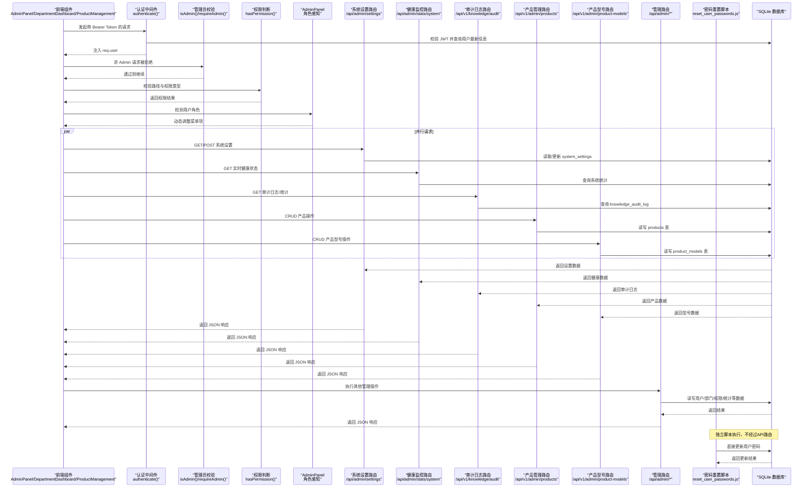

**图表来源**
- [server/index.js](file://server/index.js#L267-L394)
- [client/src/components/Admin/AdminSettings.tsx](file://client/src/components/Admin/AdminSettings.tsx#L111-L130)
- [server/service/routes/settings.js](file://server/service/routes/settings.js#L19-L200)
- [server/service/routes/knowledge_audit.js](file://server/service/routes/knowledge_audit.js#L76-L190)
- [server/service/routes/products-admin.js](file://server/service/routes/products-admin.js#L25-L106)
- [server/service/routes/product-models-admin.js](file://server/service/routes/product-models-admin.js#L30-L72)
- [server/reset_user_passwords.js](file://server/reset_user_passwords.js#L1-L59)

## 详细组件分析

### 用户管理 API
- 获取用户列表（管理员/部门主管）
  - 方法：GET /api/admin/users
  - 权限：Admin 或 Lead；Lead 仅能查看本部门用户
  - 返回：用户基础信息与文件统计（文件数量、总大小）
- 创建用户（管理员）
  - 方法：POST /api/admin/users
  - 权限：Admin
  - 参数：username、password、role、department_id
  - 行为：创建用户并初始化个人空间
- 更新用户（管理员/部门主管）
  - 方法：PUT /api/admin/users/:id
  - 权限：Admin 或 Lead；Lead 仅能更新本部门成员且只能调整 Lead/Member 角色
  - 参数：username、role、department_id、password（可选）
  - **新增** 密码重置功能：当提供 password 参数时，使用 bcrypt 进行哈希加密
- 获取用户权限（管理员/部门主管）
  - 方法：GET /api/admin/users/:id/permissions
  - 权限：Admin 或 Lead；Lead 仅能查看本部门成员权限
- 授权用户目录（管理员/部门主管）
  - 方法：POST /api/admin/users/:id/permissions
  - 权限：Admin 或 Lead；Lead 仅能授权给本部门成员且目录必须在本部门范围内
  - 参数：folder_path、access_type（Read/Contribute/Full）、expires_at
- 撤销权限（管理员/部门主管）
  - 方法：DELETE /api/admin/permissions/:id
  - 权限：Admin 或 Lead；Lead 仅能撤销本部门成员的权限
- 批量删除文件（管理员）
  - 方法：POST /api/files/bulk-delete
  - 权限：Admin
  - 参数：paths 数组
  - 行为：逐项检查 Full 权限并移入回收站

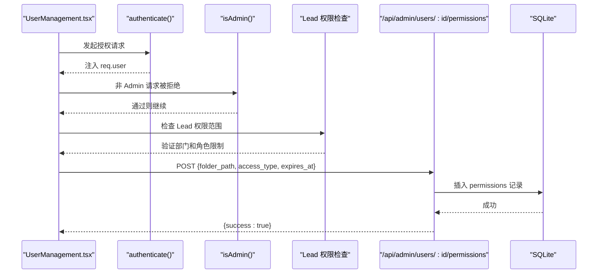

**图表来源**
- [client/src/components/UserManagement.tsx](file://client/src/components/UserManagement.tsx#L261-L283)
- [server/index.js](file://server/index.js#L1031-L1051)

**章节来源**
- [server/index.js](file://server/index.js#L934-L1064)
- [client/src/components/UserManagement.tsx](file://client/src/components/UserManagement.tsx#L170-L188)
- [client/src/components/UserManagement.tsx](file://client/src/components/UserManagement.tsx#L261-L283)

### 部门管理 API
- 获取部门列表（管理员）
  - 方法：GET /api/admin/departments
  - 权限：Admin
- 创建部门（管理员）
  - 方法：POST /api/admin/departments
  - 权限：Admin
  - 参数：name（格式："部门名 (CODE)"）
- 授权目录（管理员）
  - 方法：POST /api/admin/permissions
  - 权限：Admin
  - 参数：user_id、folder_path、access_type、expiry_option（7days/1month/permanent）

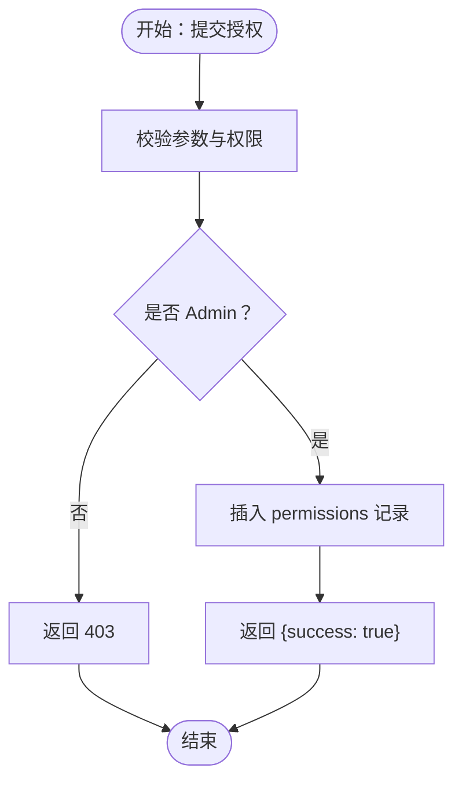

**图表来源**
- [server/index.js](file://server/index.js#L1066-L1079)
- [server/index.js](file://server/index.js#L1315-L1327)

**章节来源**
- [server/index.js](file://server/index.js#L1066-L1079)
- [server/index.js](file://server/index.js#L1315-L1327)
- [client/src/components/DepartmentManagement.tsx](file://client/src/components/DepartmentManagement.tsx#L46-L68)
- [client/src/components/DepartmentManagement.tsx](file://client/src/components/DepartmentManagement.tsx#L70-L82)

### 系统统计与监控 API
- 系统统计（管理员）
  - 方法：GET /api/admin/stats
  - 权限：Admin
  - 返回：今日/周/月上传统计、存储使用、Top 上传者、总文件数等
- **新增** 系统设置管理（管理员）
  - 方法：GET/POST /api/admin/settings
  - 权限：Admin
  - GET 返回：系统名称、AI启用状态、工作模式、提供商配置、模型路由等
  - POST 参数：完整的系统设置对象，支持AI模型配置、温度设置等
- **新增** 实时系统健康监控（管理员）
  - 方法：GET /api/admin/stats/system
  - 权限：Admin
  - 返回：系统运行时间、CPU负载、内存使用、平台信息等实时状态
- **新增** AI使用统计监控（管理员）
  - 方法：GET /api/admin/stats/ai
  - 权限：Admin
  - 返回：30天使用趋势、总令牌数、估算成本等AI使用统计
- **新增** AI提供商删除（管理员）
  - 方法：POST /api/admin/providers/delete
  - 权限：Admin
  - 参数：name（提供商名称）
  - 限制：仅能删除 `is_active = 0` 的非激活提供商
- 访问日志记录（通用）
  - 方法：POST /api/files/access
  - 权限：登录用户
  - 参数：path
  - 行为：更新 access_logs 与 file_stats

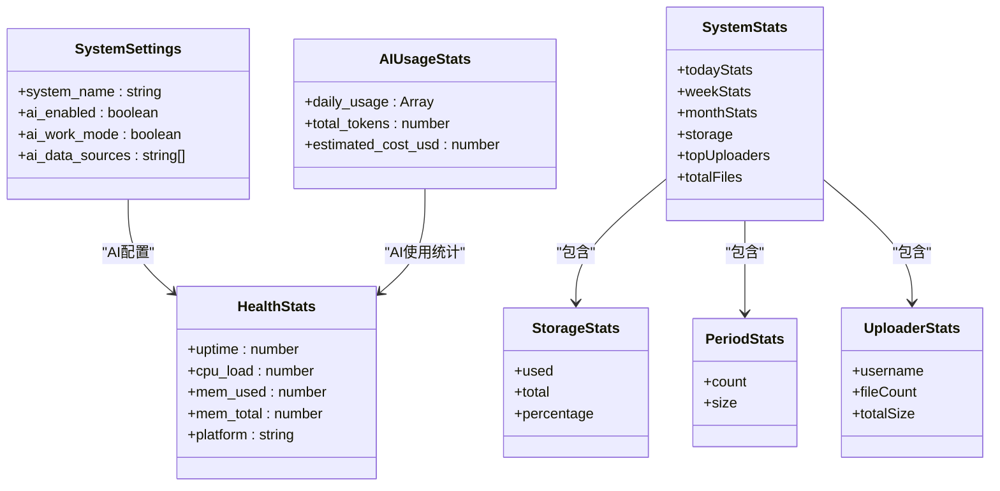

**图表来源**
- [client/src/components/Admin/AdminSettings.tsx](file://client/src/components/Admin/AdminSettings.tsx#L22-L26)
- [server/service/routes/settings.js](file://server/service/routes/settings.js#L20-L49)
- [server/service/routes/settings.js](file://server/service/routes/settings.js#L169-L196)

**章节来源**
- [client/src/components/SystemDashboard.tsx](file://client/src/components/SystemDashboard.tsx#L42-L56)
- [client/src/components/Admin/AdminSettings.tsx](file://client/src/components/Admin/AdminSettings.tsx#L111-L130)
- [server/service/routes/settings.js](file://server/service/routes/settings.js#L19-L196)
- [server/index.js](file://server/index.js#L1172-L1269)
- [server/index.js](file://server/index.js#L1271-L1313)

### 知识库审计日志系统
**新增** 知识库审计日志系统提供完整的知识库写操作追踪功能：

#### 审计日志 API
- 获取审计日志列表（管理员）
  - 方法：GET /api/v1/knowledge/audit
  - 权限：Admin
  - 查询参数：page、page_size、operation、user_id、product_line、batch_id、start_date、end_date、search
  - 返回：分页的审计日志列表，包含操作类型、文章信息、操作人、时间戳等
- 获取审计统计（管理员）
  - 方法：GET /api/v1/knowledge/audit/stats
  - 权限：Admin
  - 返回：按操作类型、用户、产品线分布的统计信息，以及最近7天操作趋势
- 审计日志记录（内部使用）
  - 方法：内部调用 knowledge_audit_routes.logAudit()
  - 功能：记录所有知识库写操作的详细信息

#### 审计日志表结构
- knowledge_audit_log 表包含以下字段：
  - operation：操作类型（create、update、delete、import、publish、archive）
  - article_id/article_title/article_slug：文章相关信息快照
  - category/product_line/product_models：分类和产品线信息
  - changes_summary：变更摘要（JSON格式）
  - old_status/new_status：状态变更前后对比
  - source_type/source_reference/batch_id：导入来源和批量操作标识
  - user_id/user_name/user_role：操作人信息快照
  - created_at：操作时间戳

#### 审计日志功能特性
- **操作类型覆盖**：完整记录创建、更新、删除、批量导入、发布、归档等所有写操作
- **批量操作追踪**：通过 batch_id 关联同一批量操作中的多个文章
- **权限控制**：仅Admin角色可访问审计日志功能
- **过滤搜索**：支持按操作类型、用户、产品线、时间范围等条件过滤
- **统计分析**：提供操作分布、用户活跃度、产品线统计等多维度分析

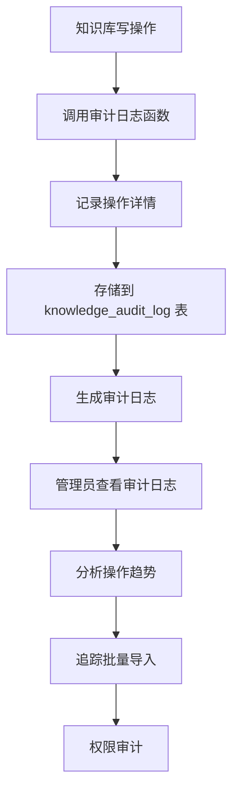

**图表来源**
- [server/service/routes/knowledge_audit.js](file://server/service/routes/knowledge_audit.js#L16-L74)
- [server/migrations/add_knowledge_audit_log.sql](file://server/migrations/add_knowledge_audit_log.sql#L4-L41)

**章节来源**
- [server/service/routes/knowledge_audit.js](file://server/service/routes/knowledge_audit.js#L76-L281)
- [server/migrations/add_knowledge_audit_log.sql](file://server/migrations/add_knowledge_audit_log.sql#L1-L50)
- [client/src/components/KnowledgeAuditLog.tsx](file://client/src/components/KnowledgeAuditLog.tsx#L64-L153)

### 管理员设置系统
**新增** 管理员设置系统提供四个主要功能模块：

#### 通用设置模块
- 系统名称配置：支持自定义系统显示名称
- 安全设置：包含维护模式等高级系统操作
- 危险区域：集中管理影响整个系统的高级操作

#### AI智能中心模块
- **模型策略配置**：支持严格工作模式和网络搜索功能
- **提供商配置**：支持DeepSeek、OpenAI、Google Gemini等AI提供商
- **温度调节**：可调节AI响应的创造性程度（0-1范围）
- **模型路由**：针对不同任务类型配置专门的AI模型
  - 聊天/通用任务：默认模型
  - 复杂推理任务：逻辑分析模型
  - 视觉/多模态任务：视觉理解模型
- **预定义模型支持**：内置DeepSeek、Gemini、OpenAI的标准模型列表
- **自定义提供商**：支持添加和管理自定义AI服务提供商

#### 系统健康监控模块
- **实时状态监控**：每5秒自动刷新系统状态
- **资源使用情况**：CPU负载、内存使用率、磁盘空间
- **系统信息**：运行时间、平台版本、架构信息
- **可视化仪表板**：进度条显示内存使用率等关键指标

#### **新增** 知识库审计模块
- **审计日志查看**：查看知识库所有写操作的历史记录
- **操作类型统计**：按创建、更新、删除、导入等类型统计
- **用户操作追踪**：追踪特定用户的知识库操作行为
- **批量导入监控**：监控批量导入操作的执行情况
- **权限审计**：确保只有授权用户才能访问和修改知识库内容

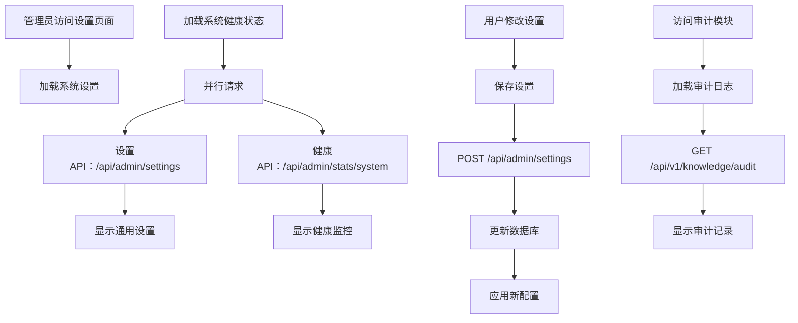

**图表来源**
- [client/src/components/Admin/AdminSettings.tsx](file://client/src/components/Admin/AdminSettings.tsx#L111-L130)
- [server/service/routes/settings.js](file://server/service/routes/settings.js#L20-L49)
- [server/service/routes/knowledge_audit.js](file://server/service/routes/knowledge_audit.js#L76-L190)

**章节来源**
- [client/src/components/Admin/AdminSettings.tsx](file://client/src/components/Admin/AdminSettings.tsx#L19-L649)
- [server/service/routes/settings.js](file://server/service/routes/settings.js#L19-L196)
- [server/service/routes/knowledge_audit.js](file://server/service/routes/knowledge_audit.js#L1-L281)
- [server/service/ai_service.js](file://server/service/ai_service.js#L47-L77)

### **新增** 批量重置用户密码功能
**新增** 批量重置用户密码功能提供安全的批量密码管理机制：

#### 密码重置脚本
- 独立执行：通过独立的 Node.js 脚本执行，不经过常规 API 路由
- 用户组支持：内置支持 vista123 和 mavo123 两个用户组
- 安全机制：使用 bcrypt 进行密码哈希加密，确保密码安全
- 日志记录：详细的执行日志，包括成功更新和用户不存在的情况

#### 支持的用户组
- **vista123 用户组**：包含 Cathy、Effy、Sherry、李雨健、吴琪萌 五名用户
- **mavo123 用户组**：包含伍帅、张工、张平娇、陈高松、汪蒙、Bishan、张承、郭建辉、时春杰 九名用户

#### 执行流程
1. 连接数据库并验证用户存在性
2. 为每个用户组生成对应的密码哈希
3. 逐个更新用户密码，跳过不存在的用户
4. 输出详细的执行统计和结果

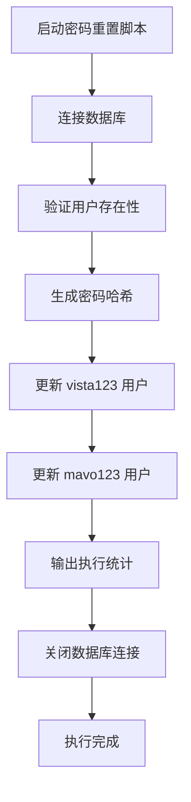

**图表来源**
- [server/reset_user_passwords.js](file://server/reset_user_passwords.js#L1-L59)

**章节来源**
- [server/reset_user_passwords.js](file://server/reset_user_passwords.js#L1-L59)

### 管理员面板与权限控制
**更新** 管理员面板现在支持 Lead 角色的动态菜单显示和增强的默认标签页选择逻辑：

#### 管理面板入口
- 管理员可切换仪表盘、用户管理、部门管理、系统设置四个子面板
- **新增** 系统设置面板集成完整的AdminSettings组件，包含审计功能
- **新增** 审计功能通过独立的审计标签页提供完整的知识库操作追踪
- **新增** Lead 角色专用的部门仪表板功能
- **新增** 服务模块（moduleType='service'）移除 dashboard 选项，因为服务模块不需要文件统计
- **新增** 文件模块（moduleType='files'）保留 dashboard 功能，提供文件统计和概览
- **新增** 产品管理模块集成产品台账和产品型号管理功能

#### 默认标签页选择逻辑
- Admin/Exec 用户：默认进入 dashboard（文件统计相关）
- Lead 用户：默认进入 settings（系统设置相关）
- Service 用户：默认进入 settings（服务模块不需要 dashboard）

#### 权限控制
- 管理员可查看所有部门与用户
- 部门主管仅能查看本部门用户与授权目录
- 个人空间权限：Members/{username} 自动授权 Full
- 路径解析：支持中文部门名与代码互转，确保权限匹配
- **新增** 设置管理权限：仅Admin角色可访问和修改系统设置
- **新增** 审计日志权限：仅Admin角色可访问审计功能
- **新增** 密码重置权限：独立脚本执行，不经过常规 API 路由
- **新增** Lead 角色权限：仅能管理本部门用户，且只能调整 Lead/Member 角色
- **新增** 产品管理权限：产品台账管理需要 Admin 或 Lead 角色，产品型号管理需要 Admin、Exec 或 MS Lead 角色

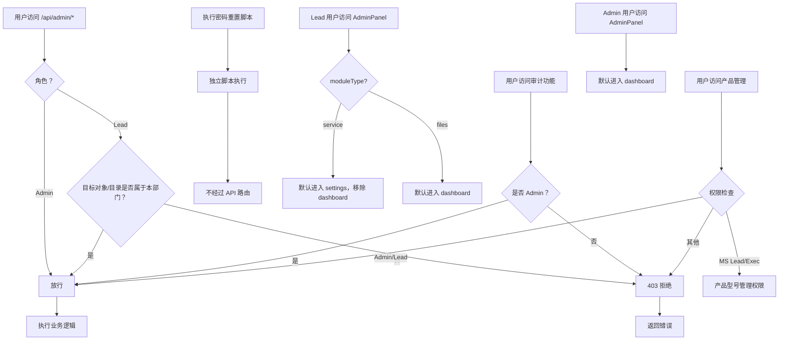

**图表来源**
- [server/index.js](file://server/index.js#L950-L986)
- [server/index.js](file://server/index.js#L1016-L1064)
- [client/src/components/Admin/AdminSettings.tsx](file://client/src/components/Admin/AdminSettings.tsx#L30-L30)
- [server/reset_user_passwords.js](file://server/reset_user_passwords.js#L1-L59)
- [server/service/routes/products-admin.js](file://server/service/routes/products-admin.js#L10-L19)
- [server/service/routes/product-models-admin.js](file://server/service/routes/product-models-admin.js#L10-L24)

**章节来源**
- [client/src/components/AdminPanel.tsx](file://client/src/components/AdminPanel.tsx#L10-L33)
- [server/index.js](file://server/index.js#L950-L986)
- [server/index.js](file://server/index.js#L1016-L1064)

### **新增** 部门仪表板功能
**新增** 部门仪表板为 Lead 角色提供专门的部门管理界面：

#### 部门仪表板功能
- **部门概览**：显示部门成员总数、活跃成员数、文件总数、存储使用量
- **成员管理**：查看部门成员列表，管理成员权限和角色
- **权限管理**：查看和管理部门内文件访问权限
- **数据统计**：按成员统计存储使用情况和文件数量
- **最近活动**：显示部门内的最近文件操作记录

#### 部门仪表板 API
- 获取部门统计信息：GET /api/department/stats
- 获取部门成员列表：GET /api/department/members
- 获取部门权限列表：GET /api/department/permissions

#### 权限控制
- 仅 Lead 角色可访问部门仪表板
- 仅能查看本部门的数据和权限
- 不能访问其他部门的信息

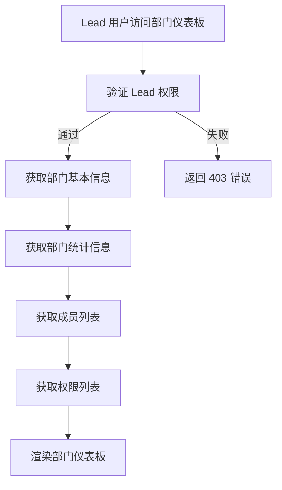

**图表来源**
- [client/src/components/DepartmentDashboard.tsx](file://client/src/components/DepartmentDashboard.tsx#L74-L115)

**章节来源**
- [client/src/components/DepartmentDashboard.tsx](file://client/src/components/DepartmentDashboard.tsx#L1-L200)

### **新增** 产品管理 API
**新增** 产品管理 API 提供完整的 Installed Base（产品台账）管理功能，支持产品生命周期的全链路跟踪：

#### 产品台账管理
- **产品列表查询**：GET /api/v1/admin/products
  - 支持按产品家族（A/B/C/D）过滤
  - 支持按状态（ACTIVE/IN_REPAIR/STOLEN/SCRAPPED）过滤
  - 支持跨字段关键字搜索（型号、内部名称、序列号）
  - 支持分页查询，可配置页面大小
  - 返回产品基本信息、关联工单统计和状态
- **产品详情查询**：GET /api/v1/admin/products/:id
  - 返回产品基础信息和关联工单统计
- **产品详细信息**：GET /api/v1/admin/products/:id/detail
  - 返回产品完整信息，包括销售和所有权信息
- **产品创建**：POST /api/v1/admin/products
  - 支持完整的产品信息录入，包括销售轨迹、所有权和保修信息
  - 自动计算保修期限和状态
  - 自动升级账户生命周期状态
- **产品更新**：PUT /api/v1/admin/products/:id
  - 支持部分字段更新
  - 自动重新计算保修信息
  - 自动升级账户生命周期状态
- **产品删除**：DELETE /api/v1/admin/products/:id
  - 支持软删除，检查是否有相关工单
  - 无法删除仍有相关工单的产品
- **关联工单查询**：GET /api/v1/admin/products/:id/tickets
  - 查询产品的所有关联工单
  - 支持分页查询

#### 产品型号管理
- **型号列表查询**：GET /api/v1/admin/product-models
  - 支持按产品家族过滤
  - 支持关键字搜索（型号名称、内部名称）
- **型号创建**：POST /api/v1/admin/product-models
  - 需要 Admin、Exec 或 MS Lead 角色
  - 防止重复型号名称
- **型号更新**：PUT /api/v1/admin/product-models/:id
  - 支持部分字段更新
  - 防止重复型号名称（排除当前型号）
- **型号删除**：DELETE /api/v1/admin/product-models/:id
  - 仅能删除无产品实例使用的型号
  - 检查实例数量防止误删

#### 权限控制
- 产品台账管理：Admin 或 Lead 角色
- 产品型号管理：Admin、Exec 或 MS Lead 角色
- 产品状态变更：仅 Admin 或 Lead 角色
- 产品删除：仅 Admin 或 Lead 角色，且需无关联工单

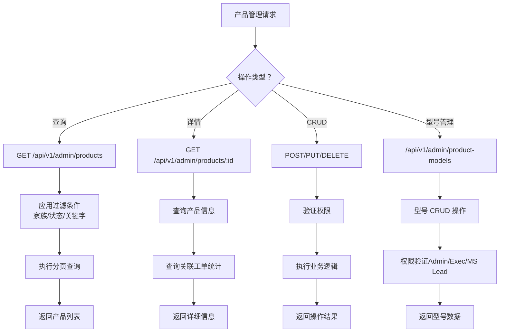

**图表来源**
- [server/service/routes/products-admin.js](file://server/service/routes/products-admin.js#L25-L106)
- [server/service/routes/products-admin.js](file://server/service/routes/products-admin.js#L112-L162)
- [server/service/routes/products-admin.js](file://server/service/routes/products-admin.js#L168-L270)
- [server/service/routes/products-admin.js](file://server/service/routes/products-admin.js#L276-L413)
- [server/service/routes/products-admin.js](file://server/service/routes/products-admin.js#L419-L478)
- [server/service/routes/products-admin.js](file://server/service/routes/products-admin.js#L484-L533)
- [server/service/routes/products-admin.js](file://server/service/routes/products-admin.js#L539-L596)
- [server/service/routes/product-models-admin.js](file://server/service/routes/product-models-admin.js#L30-L72)
- [server/service/routes/product-models-admin.js](file://server/service/routes/product-models-admin.js#L78-L133)
- [server/service/routes/product-models-admin.js](file://server/service/routes/product-models-admin.js#L139-L204)
- [server/service/routes/product-models-admin.js](file://server/service/routes/product-models-admin.js#L210-L245)

**章节来源**
- [server/service/routes/products-admin.js](file://server/service/routes/products-admin.js#L1-L600)
- [server/service/routes/product-models-admin.js](file://server/service/routes/product-models-admin.js#L1-L249)
- [client/src/components/ProductManagement.tsx](file://client/src/components/ProductManagement.tsx#L160-L190)
- [client/src/components/ProductModelsManagement.tsx](file://client/src/components/ProductModelsManagement.tsx#L88-L112)
- [client/src/components/ProductDetailPage.tsx](file://client/src/components/ProductDetailPage.tsx#L102-L122)

### iOS 管理服务集成
- 管理服务封装了用户、部门、权限与系统统计的 API 调用，提供结构化数据模型（如 SystemStats、PeriodStats、StorageStats、UploaderStats）供视图层使用
- **新增** 管理员设置服务：支持系统设置获取和更新
- **新增** 健康监控服务：提供实时系统状态监控
- **新增** 审计日志服务：提供知识库操作追踪功能
- **新增** 密码重置服务：通过独立脚本执行，不经过常规 API 路由
- **新增** 部门仪表板服务：为 Lead 角色提供部门级别的数据访问
- **新增** 产品管理服务：支持产品台账和产品型号的完整 CRUD 操作
- 文件浏览：通过编码后的路径参数调用 /api/files 获取目录树与文件列表

**章节来源**
- [ios/LonghornApp/Services/AdminService.swift](file://ios/LonghornApp/Services/AdminService.swift#L5-L92)
- [ios/LonghornApp/Services/AdminService.swift](file://ios/LonghornApp/Services/AdminService.swift#L87-L91)

## 依赖关系分析
- 前端依赖
  - 管理面板组件依赖认证状态（useAuthStore）与后端 API
  - 用户管理与部门管理组件分别调用不同的管理路由
  - **新增** AdminSettings组件依赖系统设置API、健康监控API和审计日志API
  - **新增** KnowledgeAuditLog组件依赖审计日志API和统计API
  - **新增** DepartmentDashboard组件依赖部门统计API和权限API
  - **新增** ProductManagement组件依赖产品管理API和产品型号API
  - **新增** ProductModelsManagement组件依赖产品型号管理API
  - **新增** ProductDetailPage组件依赖产品详情API
- 后端依赖
  - 认证中间件依赖 JWT 密钥与数据库用户表
  - 权限判断依赖部门表、用户表与权限表
  - 管理员校验依赖用户角色字段
  - **新增** 系统设置路由依赖system_settings表和ai_usage_logs表
  - **新增** 审计日志路由依赖knowledge_audit_log表和索引优化
  - **新增** 产品管理路由依赖products表和tickets表
  - **新增** 产品型号路由依赖product_models表和products表
  - **新增** AI服务依赖系统设置进行模型路由决策
  - **新增** 密码重置脚本依赖 better-sqlite3 和 bcryptjs 库
  - **新增** 部门仪表板路由依赖部门统计和权限表
- iOS 依赖
  - 管理服务依赖 APIClient 与 Codable 模型

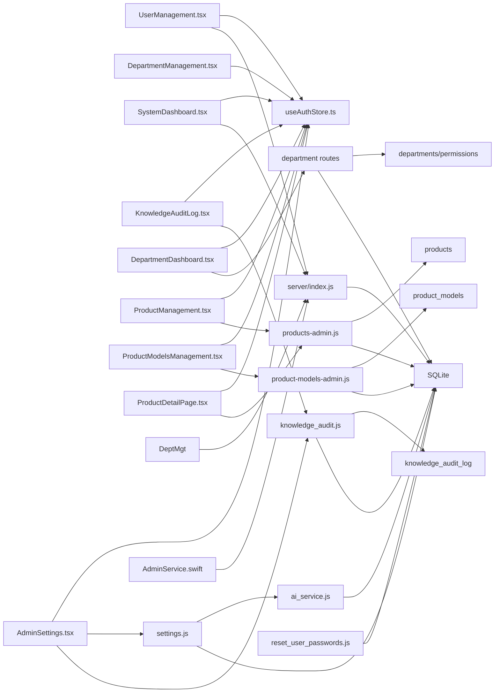

**图表来源**
- [client/src/store/useAuthStore.ts](file://client/src/store/useAuthStore.ts#L17-L30)
- [client/src/components/UserManagement.tsx](file://client/src/components/UserManagement.tsx#L170-L188)
- [client/src/components/DepartmentManagement.tsx](file://client/src/components/DepartmentManagement.tsx#L32-L44)
- [client/src/components/SystemDashboard.tsx](file://client/src/components/SystemDashboard.tsx#L42-L56)
- [client/src/components/Admin/AdminSettings.tsx](file://client/src/components/Admin/AdminSettings.tsx#L1-L649)
- [client/src/components/KnowledgeAuditLog.tsx](file://client/src/components/KnowledgeAuditLog.tsx#L64-L153)
- [client/src/components/DepartmentDashboard.tsx](file://client/src/components/DepartmentDashboard.tsx#L1-L200)
- [client/src/components/ProductManagement.tsx](file://client/src/components/ProductManagement.tsx#L1-L800)
- [client/src/components/ProductModelsManagement.tsx](file://client/src/components/ProductModelsManagement.tsx#L1-L700)
- [client/src/components/ProductDetailPage.tsx](file://client/src/components/ProductDetailPage.tsx#L1-L599)
- [server/service/routes/settings.js](file://server/service/routes/settings.js#L1-L200)
- [server/service/routes/knowledge_audit.js](file://server/service/routes/knowledge_audit.js#L1-L281)
- [server/service/routes/products-admin.js](file://server/service/routes/products-admin.js#L1-L600)
- [server/service/routes/product-models-admin.js](file://server/service/routes/product-models-admin.js#L1-L249)
- [server/service/ai_service.js](file://server/service/ai_service.js#L47-L77)
- [ios/LonghornApp/Services/AdminService.swift](file://ios/LonghornApp/Services/AdminService.swift#L5-L92)
- [server/index.js](file://server/index.js#L267-L394)
- [server/reset_user_passwords.js](file://server/reset_user_passwords.js#L1-L59)

**章节来源**
- [client/src/store/useAuthStore.ts](file://client/src/store/useAuthStore.ts#L17-L30)
- [client/src/components/Admin/AdminSettings.tsx](file://client/src/components/Admin/AdminSettings.tsx#L1-L649)
- [client/src/components/KnowledgeAuditLog.tsx](file://client/src/components/KnowledgeAuditLog.tsx#L64-L153)
- [client/src/components/DepartmentDashboard.tsx](file://client/src/components/DepartmentDashboard.tsx#L1-L200)
- [client/src/components/ProductManagement.tsx](file://client/src/components/ProductManagement.tsx#L1-L800)
- [client/src/components/ProductModelsManagement.tsx](file://client/src/components/ProductModelsManagement.tsx#L1-L700)
- [client/src/components/ProductDetailPage.tsx](file://client/src/components/ProductDetailPage.tsx#L1-L599)
- [server/service/routes/settings.js](file://server/service/routes/settings.js#L1-L200)
- [server/service/routes/knowledge_audit.js](file://server/service/routes/knowledge_audit.js#L1-L281)
- [server/service/routes/products-admin.js](file://server/service/routes/products-admin.js#L1-L600)
- [server/service/routes/product-models-admin.js](file://server/service/routes/product-models-admin.js#L1-L249)
- [server/index.js](file://server/index.js#L267-L394)
- [server/reset_user_passwords.js](file://server/reset_user_passwords.js#L1-L59)

## 性能考虑
- 权限判断与路径解析
  - 使用部门代码映射与路径规范化减少权限匹配开销
  - 对于深层目录，文件夹大小计算采用递归扫描，建议在前端缓存与懒加载
- 批量操作
  - 批量删除与批量移动通过循环逐项处理，建议在前端限制单次批量数量以避免长时间阻塞
- **新增** 系统设置并发处理
  - AdminSettings组件使用Promise.all并行加载设置和健康数据，提升用户体验
  - 健康监控采用5秒轮询策略，在保证实时性的同时控制服务器负载
- **新增** 审计日志查询优化
  - 审计日志表包含多个索引（operation、article_id、user_id、created_at、batch_id、product_line），优化查询性能
  - 支持分页查询和条件过滤，避免一次性加载大量数据
  - 统计查询使用专用SQL语句，减少复杂聚合操作
- **新增** AI使用统计优化
  - 健康监控API跳过磁盘空间检查以避免额外依赖，使用简化方案确保稳定性
  - AI使用统计查询使用索引优化，支持大日期范围的高效查询
  - AI提供商管理优化：删除操作仅允许删除非激活状态的提供商
- **新增** 产品管理查询优化
  - 产品表包含状态索引，支持快速状态过滤
  - 产品型号表包含家族和激活状态索引，支持快速筛选
  - 关键字搜索使用LIKE操作符，建议在高频查询字段上建立索引
  - 分页查询使用LIMIT和OFFSET，支持大数据集的高效分页
- **新增** 产品型号管理优化
  - 型号名称唯一约束防止重复，减少数据冗余
  - 实例数量统计使用子查询，建议在产品表上建立型号索引
  - 删除前检查实例数量，避免级联删除的性能问题
- **新增** 审计日志并发处理
  - 审计日志记录采用异步方式，避免影响主业务流程
  - 批量导入操作通过批次ID关联，便于后续追踪和统计
- **新增** 密码重置性能优化
  - 独立脚本执行，不占用 API 路由资源
  - 使用数据库事务批量更新，提高执行效率
  - 逐个用户验证和更新，确保操作的原子性和安全性
- **新增** Lead 角色权限控制优化
  - 后端直接在查询中限制 Lead 用户只能访问本部门数据，减少前端过滤开销
  - AdminPanel 动态菜单生成，避免不必要的组件渲染
  - 服务模块和文件模块的差异化默认标签页选择，提升用户体验
- 缩略图生成
  - 服务端对缩略图进行缓存与并发队列控制，避免 CPU/IO 过载
- ETag 与条件请求
  - 文件列表接口使用 ETag 减少不必要的传输
- **新增** AI服务性能优化
  - AI客户端缓存机制，避免重复创建OpenAI实例
  - 使用连接池和超时控制，提高API调用稳定性
  - 异步记录使用日志，不影响主流程性能

**章节来源**
- [server/index.js](file://server/index.js#L2323-L2342)
- [server/index.js](file://server/index.js#L556-L577)
- [server/index.js](file://server/index.js#L2602-L2622)
- [server/index.js](file://server/index.js#L2797-L2845)
- [client/src/components/Admin/AdminSettings.tsx](file://client/src/components/Admin/AdminSettings.tsx#L111-L130)
- [server/service/routes/settings.js](file://server/service/routes/settings.js#L93-L130)
- [server/service/ai_service.js](file://server/service/ai_service.js#L50-L71)
- [server/migrations/add_knowledge_audit_log.sql](file://server/migrations/add_knowledge_audit_log.sql#L43-L49)
- [server/service/routes/knowledge_audit.js](file://server/service/routes/knowledge_audit.js#L192-L269)
- [server/reset_user_passwords.js](file://server/reset_user_passwords.js#L1-L59)
- [server/index.js](file://server/index.js#L1587-L1605)
- [server/migrations/017_add_product_status.sql](file://server/migrations/017_add_product_status.sql#L9-L10)
- [server/migrations/016_add_product_models.sql](file://server/migrations/016_add_product_models.sql#L17-L19)

## 故障排除指南
- 认证失败（401/403）
  - 检查 Authorization 头是否包含有效的 Bearer Token
  - 确认用户角色与目标接口权限匹配（Admin/Lead/Member）
- 权限不足（403）
  - 管理员仅能对本部门成员进行授权（Lead）
  - 个人空间仅允许 Full/Contributor 写入
  - **新增** 系统设置仅Admin角色可访问
  - **新增** 审计日志仅Admin角色可访问
  - **新增** Lead 角色只能管理本部门用户，且只能调整 Lead/Member 角色
  - **新增** 产品管理需要相应角色权限：产品台账Admin/Lead，产品型号Admin/Exec/MS Lead
- 路径解析异常
  - 确保中文部门名与代码一致，避免权限误判
- 批量操作失败
  - 检查每个路径的权限与存在性，失败项会返回到 failedItems
- **新增** 系统设置更新失败
  - 检查设置数据格式是否符合SystemSettings接口定义
  - 确认AI模型名称和提供商配置的有效性
  - 验证温度设置值在0-1范围内的有效性
- **新增** 健康监控数据异常
  - 检查服务器系统资源可用性
  - 确认操作系统负载平均值和内存统计的准确性
  - 验证磁盘空间检查依赖的安装状态
- **新增** AI提供商管理错误
  - 删除提供商时确认其 is_active 状态为 0
  - 检查API密钥格式和Base URL的有效性
  - 验证模型名称在预定义列表中或正确配置为自定义模型
- **新增** AI使用统计查询失败
  - 确认 ai_usage_logs 表存在且包含数据
  - 检查数据库连接和查询权限
  - 验证时间范围参数的合理性
- **新增** AI服务调用失败
  - 检查Active Provider的API Key配置
  - 验证Base URL和网络连接状态
  - 确认模型名称在提供商处有效
- **新增** AI使用日志记录失败
  - 检查ai_usage_logs表结构完整性
  - 验证数据库写入权限
  - 确认异步日志记录机制正常工作
- **新增** 审计日志查询失败
  - 检查knowledge_audit_log表是否存在且结构正确
  - 确认审计日志索引是否创建成功
  - 验证查询条件和分页参数的合法性
  - 检查数据库连接权限和查询超时设置
- **新增** 审计日志统计异常
  - 确认统计查询SQL语句的正确性
  - 检查时间范围参数的格式和有效性
  - 验证用户权限和数据访问范围
- **新增** 密码重置脚本执行失败
  - 检查数据库连接字符串和路径配置
  - 确认用户列表中的用户名拼写正确
  - 验证 bcrypt 库的版本兼容性
  - 检查数据库写入权限和事务处理
- **新增** 密码重置用户不存在
  - 确认用户在数据库中存在且未被删除
  - 检查用户名大小写和特殊字符
  - 验证数据库连接和查询语句
- **新增** Lead 角色权限控制问题
  - 检查 Lead 用户的部门ID是否正确设置
  - 确认 Lead 用户只能访问本部门数据
  - 验证 Lead 用户的角色权限范围
- **新增** AdminPanel 菜单显示异常
  - 检查 moduleType 参数是否正确传递
  - 确认 Lead 用户的默认标签页选择逻辑
  - 验证服务模块和文件模块的菜单差异
- **新增** 部门仪表板访问失败
  - 检查 Lead 用户的部门权限
  - 确认部门统计API的可用性
  - 验证部门数据的完整性
- **新增** 产品管理功能异常
  - 检查产品台账权限：Admin/Lead 角色
  - 检查产品型号权限：Admin/Exec/MS Lead 角色
  - 验证产品状态枚举值：ACTIVE/IN_REPAIR/STOLEN/SCRAPPED
  - 确认产品型号唯一性约束
  - 验证产品删除前的关联工单检查
- **新增** 产品查询性能问题
  - 检查产品表状态索引是否创建
  - 确认产品型号表家族和激活状态索引
  - 验证关键字搜索的LIKE操作符性能
  - 检查分页查询的LIMIT/OFFSET参数
- **新增** 产品型号删除失败
  - 确认型号实例数量为0
  - 检查产品表中的型号关联
  - 验证删除前的实例检查逻辑
- 数据库恢复
  - 管理员可通过 /api/admin/restore-db 上传备份数据库文件进行恢复

**章节来源**
- [server/index.js](file://server/index.js#L267-L295)
- [server/index.js](file://server/index.js#L1031-L1064)
- [server/index.js](file://server/index.js#L2585-L2622)
- [server/index.js](file://server/index.js#L3083-L3118)
- [client/src/components/Admin/AdminSettings.tsx](file://client/src/components/Admin/AdminSettings.tsx#L178-L194)
- [server/service/routes/settings.js](file://server/service/routes/settings.js#L49-L91)
- [server/service/ai_service.js](file://server/service/ai_service.js#L106-L138)
- [server/scripts/verify_ai.js](file://server/scripts/verify_ai.js#L1-L48)
- [server/service/routes/knowledge_audit.js](file://server/service/routes/knowledge_audit.js#L183-L189)
- [server/migrations/add_knowledge_audit_log.sql](file://server/migrations/add_knowledge_audit_log.sql#L43-L49)
- [server/reset_user_passwords.js](file://server/reset_user_passwords.js#L1-L59)
- [server/index.js](file://server/index.js#L1587-L1605)
- [server/service/routes/products-admin.js](file://server/service/routes/products-admin.js#L192-L204)
- [server/service/routes/product-models-admin.js](file://server/service/routes/product-models-admin.js#L223-L230)

## 结论
管理员管理 API 通过严格的认证与权限控制，结合前端管理面板与 iOS 服务层，提供了完善的用户与部门管理、目录授权、系统统计与监控能力。最新的管理员设置系统重构将系统配置管理提升到全新的水平，集成了通用设置、AI智能中心、系统健康监控和知识库审计四大功能模块。

**新增功能总结**：
- **AI智能中心**：支持多服务商集成、模型路由配置、参数调优
- **系统健康监控**：实时资源监控、性能指标可视化
- **AI使用统计**：历史趋势分析、成本估算、使用优化
- **AI服务验证**：自动化测试脚本确保功能正常
- **知识库审计系统**：完整的写操作追踪、权限审计、批量操作监控
- **批量重置用户密码**：独立安全脚本，支持 vista123 和 mavo123 用户组的批量密码管理
- **Lead 角色支持**：为部门主管提供精细化的管理权限控制
- **动态菜单显示**：AdminPanel 能够根据用户角色动态调整菜单项显示
- **模块化默认标签页**：服务模块移除 dashboard，文件模块保留 dashboard，增强用户体验
- **部门仪表板**：为 Lead 角色提供专门的部门管理界面
- **产品管理功能**：完整的 Installed Base 管理，支持产品台账和产品型号的CRUD操作
- **高级查询功能**：支持按产品家族和状态过滤、跨字段关键字搜索和可配置分页
- **权限分级控制**：产品台账和产品型号采用不同的权限级别，确保数据安全

**新增** Lead 角色的引入显著提升了系统的权限控制精细度。AdminPanel 现在能够根据用户角色动态调整菜单项显示，服务模块（moduleType='service'）移除了 dashboard 选项，因为服务模块的统计功能与文件管理无关；文件模块（moduleType='files'）保留 dashboard 功能，提供文件统计和概览信息。默认标签页选择逻辑也进行了相应调整，确保不同角色用户获得最佳的初始体验。

**新增** 产品管理功能的引入标志着 Longhorn 系统从文件管理向设备生命周期管理的重要升级。产品台账功能支持完整的 Installed Base 管理，包括销售轨迹、所有权转移、保修管理等关键业务流程。产品型号管理功能为企业提供了标准化的产品线管理体系，支持多品类、多规格的产品统一管理。

建议在生产环境中：
- 严格区分 Admin 与 Lead 权限边界
- 对批量操作与缩略图生成进行容量与超时控制
- **新增** 合理配置AI模型和温度参数，平衡性能与准确性
- **新增** 定期监控系统健康状态，及时发现潜在问题
- **新增** 建立AI提供商的备份和切换机制，确保服务连续性
- **新增** 定期验证AI服务功能，使用verify_ai.js脚本进行功能测试
- **新增** 监控AI使用成本，优化模型选择和参数配置
- **新增** 定期检查审计日志完整性，确保所有写操作都被正确记录
- **新增** 建立审计日志的定期清理策略，避免数据库膨胀
- **新增** 监控审计日志查询性能，必要时调整索引策略
- **新增** 定期执行密码重置脚本，确保用户密码安全
- **新增** 建立密码重置的审计机制，记录每次批量密码更新操作
- **新增** 定期验证用户组配置，确保密码重置的准确性和安全性
- **新增** 定期检查 Lead 角色权限控制，确保权限边界正确
- **新增** 监控 AdminPanel 的动态菜单功能，确保角色权限正确应用
- **新增** 定期验证部门仪表板功能，确保 Lead 用户的部门数据访问正常
- **新增** 定期检查产品管理权限，确保产品台账和型号管理的安全性
- **新增** 监控产品查询性能，优化索引和查询条件
- **新增** 建立产品数据的定期备份和恢复流程
- 定期备份数据库并测试恢复流程
- 使用 ETag 与缓存策略优化前端性能
- **新增** 利用AI使用统计监控控制成本，优化模型配置
- **新增** 建立AI提供商的性能基准和SLA监控
- **新增** 定期分析审计日志，发现异常操作模式和安全风险
- **新增** 建立 Lead 角色的权限审计机制，确保权限使用的合规性
- **新增** 建立产品管理的变更审计机制，确保产品数据的完整性和可追溯性