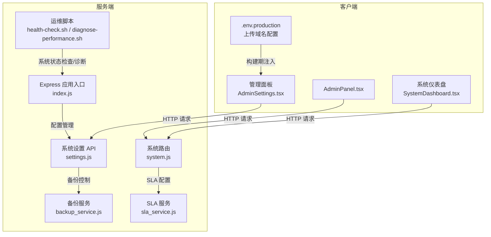
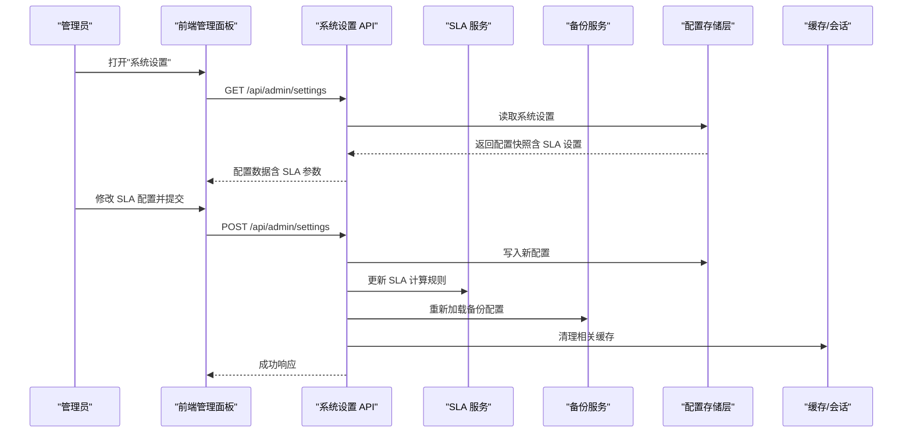
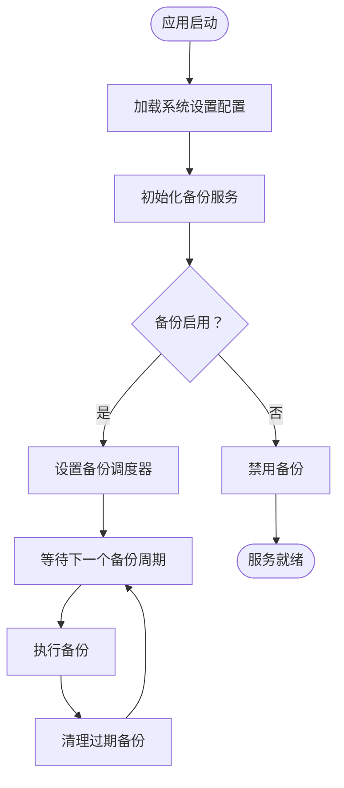
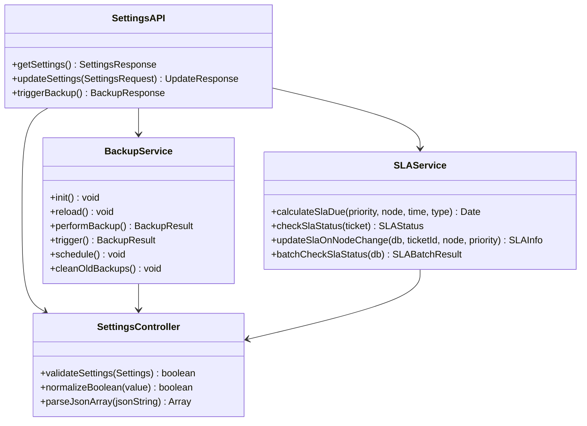
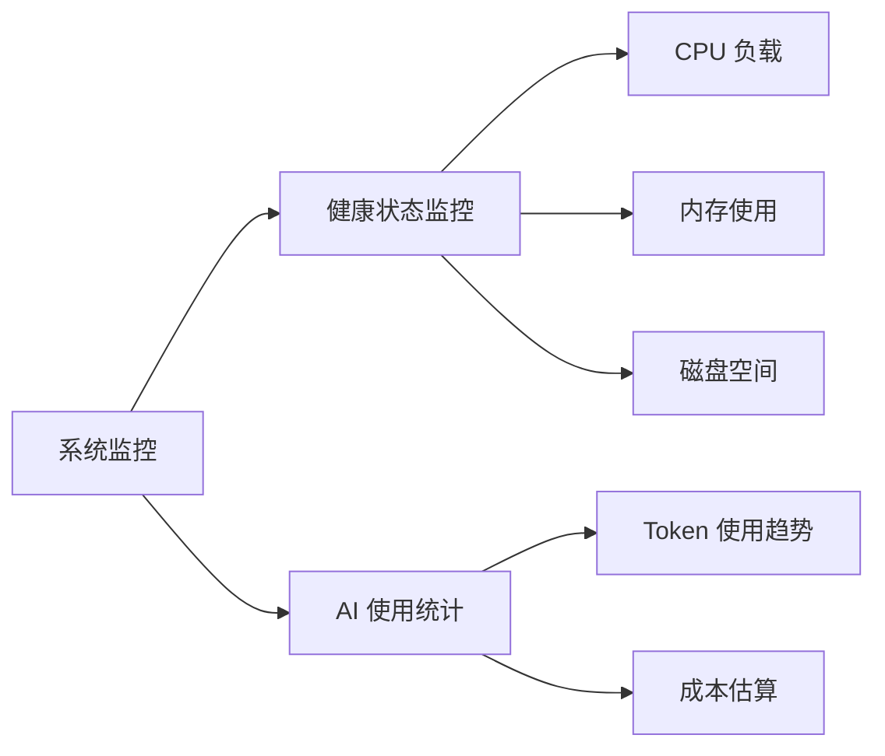
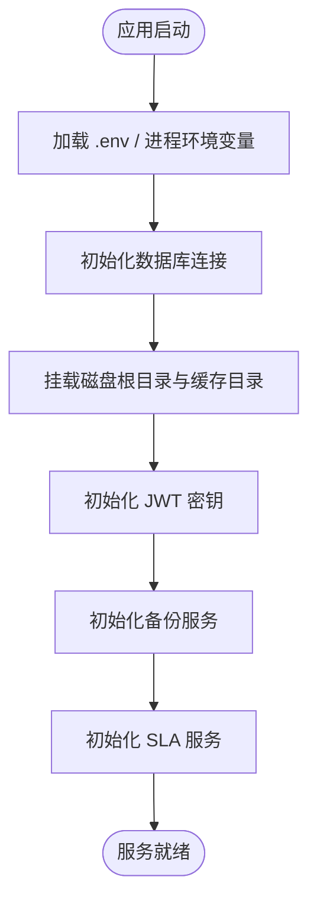
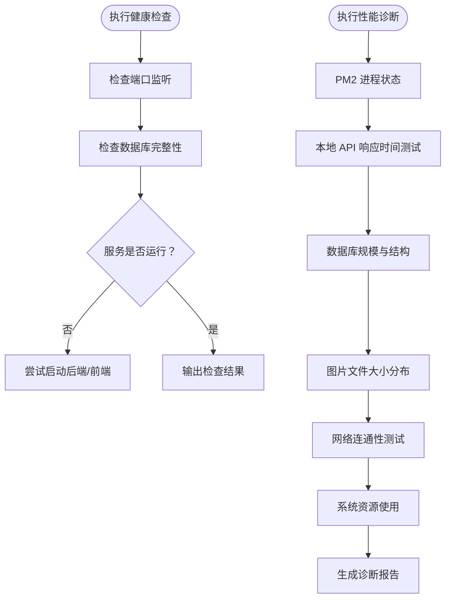
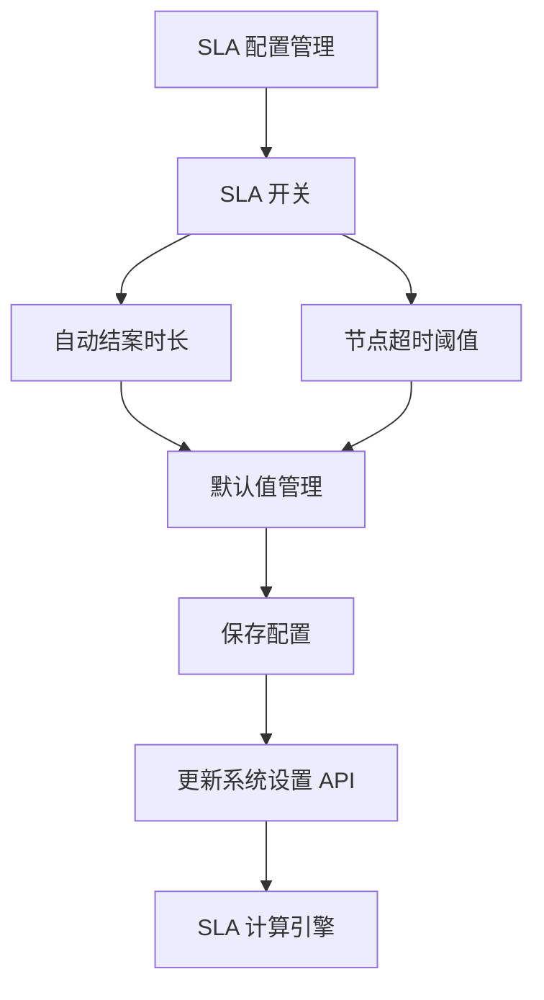
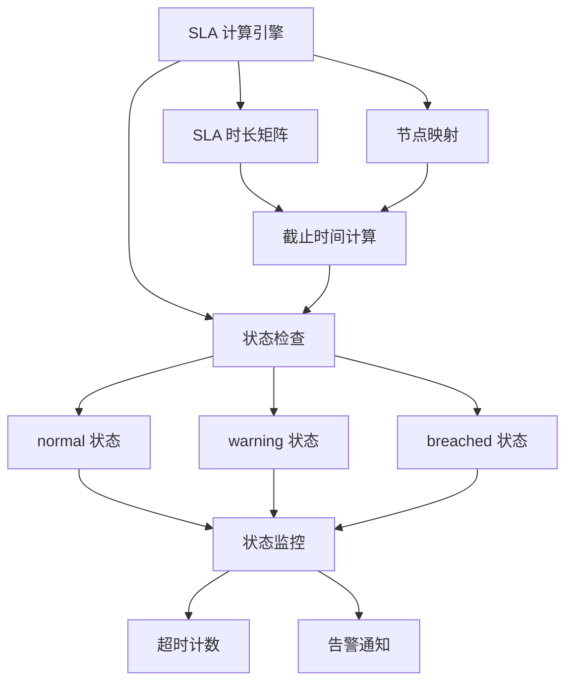
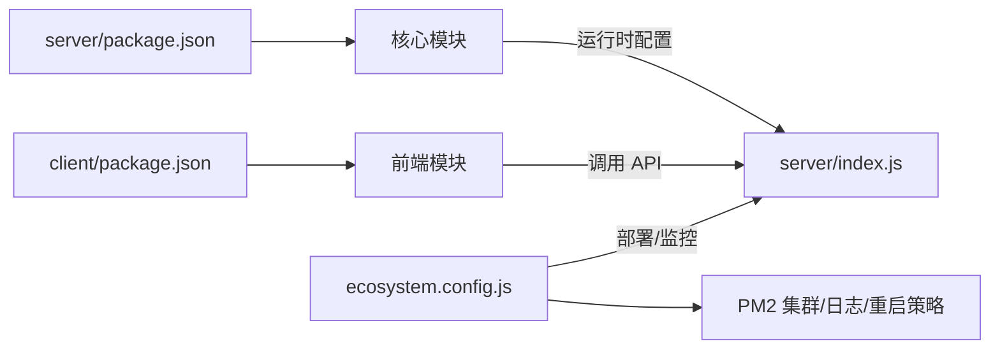

# 系统配置 API

<cite>
**本文档引用的文件**
- [server/index.js](file://server/index.js)
- [server/service/backup_service.js](file://server/service/backup_service.js)
- [server/service/routes/settings.js](file://server/service/routes/settings.js)
- [server/service/routes/system.js](file://server/service/routes/system.js)
- [server/service/sla_service.js](file://server/service/sla_service.js)
- [scripts/health-check.sh](file://scripts/health-check.sh)
- [scripts/diagnose-performance.sh](file://scripts/diagnose-performance.sh)
- [scripts/ecosystem.config.js](file://scripts/ecosystem.config.js)
- [client/src/components/Admin/AdminSettings.tsx](file://client/src/components/Admin/AdminSettings.tsx)
- [client/src/components/AdminPanel.tsx](file://client/src/components/AdminPanel.tsx)
- [client/src/components/SystemDashboard.tsx](file://client/src/components/SystemDashboard.tsx)
- [client/.env.production](file://client/.env.production)
- [server/package.json](file://server/package.json)
- [client/package.json](file://client/package.json)
</cite>

## 更新摘要
**所做更改**
- 新增 SLA 配置设置支持，涵盖咨询工单、返厂工单和维修单的时效管理
- 完善系统设置管理，包含 SLA 开关、自动结案时长和节点超时阈值配置
- 增强 SLA 计算引擎，支持优先级矩阵和节点状态机映射
- 新增 SLA 状态监控和告警功能，提供超时检测和计数统计

## 目录
1. [简介](#简介)
2. [项目结构](#项目结构)
3. [核心组件](#核心组件)
4. [架构总览](#架构总览)
5. [详细组件分析](#详细组件分析)
6. [SLA 配置管理](#sla-配置管理)
7. [SLA 计算引擎](#sla-计算引擎)
8. [依赖关系分析](#依赖关系分析)
9. [性能考虑](#性能考虑)
10. [故障排查指南](#故障排查指南)
11. [结论](#结论)

## 简介
本文件面向系统管理员与开发人员，系统性梳理 Longhorn 项目的"系统配置 API"能力边界与实现现状。经过更新后的系统配置 API 已具备完整的备份配置管理和系统设置管理功能，能够满足企业级系统的配置需求。

当前系统配置 API 主要通过以下方式体现：
- **备份配置管理**：支持定时备份、备份频率设置、备份保留策略和手动备份触发
- **系统设置管理**：涵盖 AI 配置、备份设置、提供商管理等核心系统参数
- **SLA 配置管理**：新增工单时效管理功能，支持咨询工单、返厂工单和维修单的 SLA 设置
- **系统监控配置**：提供实时健康状态监控和 AI 使用统计分析
- **环境变量配置**：通过 .env.production 注入上传域名等运行时参数

**更新** 新增 SLA 配置设置支持，完善系统参数管理的完整 API 规范，形成可审计、可回滚、可监控的系统配置管理体系

## 项目结构
Longhorn 采用前后端分离架构：
- **服务端（Node.js + Express）**：位于 server/，负责业务 API、静态资源、缓存与健康检查等
- **客户端（React + Vite）**：位于 client/，提供管理面板与前端交互
- **运维脚本**：位于 scripts/，提供健康检查、性能诊断、部署与发布等自动化能力

**图表来源**
- [server/index.js:1-80](file://server/index.js#L1-L80)
- [server/service/routes/settings.js:1-371](file://server/service/routes/settings.js#L1-L371)
- [server/service/backup_service.js:1-126](file://server/service/backup_service.js#L1-L126)
- [server/service/sla_service.js:1-293](file://server/service/sla_service.js#L1-L293)
- [client/src/components/Admin/AdminSettings.tsx:1363-1424](file://client/src/components/Admin/AdminSettings.tsx#L1363-L1424)
- [client/src/components/AdminPanel.tsx:1-33](file://client/src/components/AdminPanel.tsx#L1-L33)
- [client/src/components/SystemDashboard.tsx:66-99](file://client/src/components/SystemDashboard.tsx#L66-L99)
- [client/.env.production:1-8](file://client/.env.production#L1-L8)
- [scripts/health-check.sh:1-115](file://scripts/health-check.sh#L1-L115)
- [scripts/diagnose-performance.sh:1-122](file://scripts/diagnose-performance.sh#L1-L122)

## 核心组件
- **备份配置管理**
  - 定时备份调度器，支持分钟级频率配置
  - 备份保留策略，支持天数级保留配置
  - 手动备份触发机制
  - 备份目录管理和权限控制
- **系统设置管理**
  - AI 配置参数，包括工作模式、数据源和模型设置
  - 备份设置参数，包括启用状态、频率和保留天数
  - SLA 配置参数，包括工单类型、启用状态、自动结案时长和节点超时阈值
  - AI 提供商管理，支持多提供商配置和激活状态
  - 系统名称和全局配置管理
- **SLA 配置管理**
  - 工单类型 SLA 设置：inquiry、rma、svc
  - SLA 开关控制：每个工单类型独立启用/禁用
  - 自动结案时长：默认 5 天（inquiry）、7 天（rma/svc）
  - 节点超时阈值：默认 24 小时
  - SLA 状态监控：正常、警告、超时三种状态
- **系统监控配置**
  - 实时系统健康状态监控
  - AI 使用量统计和成本估算
  - 磁盘空间和内存使用监控
  - CPU 负载和系统资源监控

**章节来源**
- [server/service/backup_service.js:1-126](file://server/service/backup_service.js#L1-L126)
- [server/service/routes/settings.js:1-371](file://server/service/routes/settings.js#L1-L371)
- [server/service/sla_service.js:1-293](file://server/service/sla_service.js#L1-L293)
- [server/index.js:73-97](file://server/index.js#L73-L97)

## 架构总览
系统配置 API 的目标是将"运行时配置"与"业务配置"以受控的方式暴露为 API，支持：
- **读取**：获取当前生效的配置快照
- **更新**：变更配置（需鉴权与审计）
- **重置**：恢复默认值
- **变更通知**：触发缓存清理、重启或热更新

**图表来源**
- [server/service/routes/settings.js:20-160](file://server/service/routes/settings.js#L20-L160)
- [server/service/backup_service.js:23-122](file://server/service/backup_service.js#L23-L122)
- [server/service/sla_service.js:73-105](file://server/service/sla_service.js#L73-L105)

## 详细组件分析

### 备份配置管理
备份服务提供了完整的备份配置管理功能：

- **配置参数**
  - `enabled`：备份启用状态（布尔值）
  - `frequency`：备份频率（分钟，默认 1440 分钟/24小时）
  - `retention`：备份保留天数（默认 7 天）
  - `path`：备份存储路径（默认 DiskA/.backups/db）

- **核心功能**
  - 自动化备份调度，基于配置的频率间隔执行
  - 备份文件清理，自动删除超过保留期限的旧备份
  - 手动备份触发，支持即时备份操作
  - 配置热重载，支持运行时更新备份设置

**图表来源**
- [server/service/backup_service.js:17-122](file://server/service/backup_service.js#L17-L122)

**章节来源**
- [server/service/backup_service.js:1-126](file://server/service/backup_service.js#L1-L126)
- [server/service/routes/settings.js:38-42](file://server/service/routes/settings.js#L38-L42)

### 系统设置管理
系统设置 API 提供了全面的系统配置管理能力：

- **系统设置接口**
  - `GET /api/admin/settings`：获取当前系统设置
  - `POST /api/admin/settings`：更新系统设置
  - `POST /api/admin/backup/now`：手动触发备份

- **配置参数**
  - **AI 设置**：`ai_enabled`、`ai_work_mode`、`ai_data_sources`
  - **备份设置**：`backup_enabled`、`backup_frequency`、`backup_retention_days`
  - **SLA 设置**：`inquiry_sla_enabled`、`inquiry_auto_close_days`、`inquiry_sla_hours`
  - **SLA 设置**：`rma_sla_enabled`、`rma_auto_close_days`、`rma_sla_hours`
  - **SLA 设置**：`svc_sla_enabled`、`svc_auto_close_days`、`svc_sla_hours`
  - **系统信息**：`system_name`、`updated_at`

- **提供商管理**
  - 支持多 AI 提供商配置（DeepSeek、Gemini、Custom）
  - 提供商激活状态管理
  - API 密钥和基础 URL 配置
  - 模型参数配置（chat_model、reasoner_model、vision_model）

**图表来源**
- [server/service/routes/settings.js:20-160](file://server/service/routes/settings.js#L20-L160)
- [server/service/backup_service.js:4-126](file://server/service/backup_service.js#L4-L126)
- [server/service/sla_service.js:73-105](file://server/service/sla_service.js#L73-L105)

**章节来源**
- [server/service/routes/settings.js:1-371](file://server/service/routes/settings.js#L1-L371)
- [server/index.js:73-97](file://server/index.js#L73-L97)

### 系统监控配置
系统监控 API 提供了实时的系统状态监控和统计分析：

- **健康监控接口**
  - `GET /api/admin/stats/system`：实时系统健康状态
  - `GET /api/admin/stats/ai`：AI 使用历史统计

- **监控指标**
  - **系统状态**：CPU 负载、内存使用、系统运行时间、平台信息
  - **AI 使用**：每日 token 使用量、总 token 数、估算成本
  - **磁盘空间**：磁盘容量和剩余空间（可选）

- **统计分析**
  - 30 天 AI 使用趋势分析
  - 成本估算算法（基于 token 使用量）
  - 实时系统资源监控

**图表来源**
- [server/service/routes/settings.js:340-354](file://server/service/routes/settings.js#L340-L354)

**章节来源**
- [server/service/routes/settings.js:301-354](file://server/service/routes/settings.js#L301-L354)

### 运行时配置与环境变量
- **服务端常量**
  - 端口、数据库路径、磁盘根目录、回收站目录、缩略图缓存目录、JWT 密钥等
- **客户端环境变量**
  - 上传基础域名（用于绕过代理超时限制）

**图表来源**
- [server/index.js:14-25](file://server/index.js#L14-L25)
- [client/.env.production:1-8](file://client/.env.production#L1-L8)

**章节来源**
- [server/index.js:14-25](file://server/index.js#L14-L25)
- [client/.env.production:1-8](file://client/.env.production#L1-L8)

### 健康检查与系统监控
- **健康检查脚本**
  - 检查后端/前端端口监听状态、数据库完整性、必要字段缺失时自动修复
- **性能诊断脚本**
  - 收集 PM2 进程状态、本地 API 响应时间、数据库规模、图片文件分布、网络连通性、系统资源使用等

**图表来源**
- [scripts/health-check.sh:1-115](file://scripts/health-check.sh#L1-L115)
- [scripts/diagnose-performance.sh:1-122](file://scripts/diagnose-performance.sh#L1-L122)

**章节来源**
- [scripts/health-check.sh:1-115](file://scripts/health-check.sh#L1-L115)
- [scripts/diagnose-performance.sh:1-122](file://scripts/diagnose-performance.sh#L1-L122)

### 管理端界面与占位
- **管理面板**：包含"系统设置"占位页，现已实现完整的配置管理功能
- **仪表盘**：展示系统概览，包含健康状态和统计信息

**章节来源**
- [client/src/components/AdminPanel.tsx:26-30](file://client/src/components/AdminPanel.tsx#L26-L30)
- [client/src/components/SystemDashboard.tsx:66-99](file://client/src/components/SystemDashboard.tsx#L66-L99)

### 当前可用的系统级 API（与配置相关）
- **健康状态**
  - `GET /api/status`：返回服务名称、状态、版本
- **系统统计（间接反映配置影响）**
  - `GET /api/admin/stats`：管理员视角的系统用量、上传趋势、Top 上传者等
  - `GET /api/department/my-stats`：部门维度的文件数量、存储使用、成员数
- **权限与访问**
  - `GET /api/user/permissions`：用户有效权限列表
  - `POST /api/files/access`：记录文件访问（用于审计与统计）
- **系统设置管理**
  - `GET /api/admin/settings`：获取系统设置
  - `POST /api/admin/settings`：更新系统设置
  - `POST /api/admin/backup/now`：手动触发备份
- **系统监控**
  - `GET /api/admin/stats/system`：实时系统健康状态
  - `GET /api/admin/stats/ai`：AI 使用历史统计
- **公共系统设置**
  - `GET /api/v1/system/public-settings`：获取公开的系统设置（含 SLA 配置）

**章节来源**
- [server/index.js:477-479](file://server/index.js#L477-L479)
- [server/service/routes/settings.js:20-160](file://server/service/routes/settings.js#L20-L160)
- [server/service/routes/settings.js:340-354](file://server/service/routes/settings.js#L340-L354)
- [server/service/routes/system.js:17-57](file://server/service/routes/system.js#L17-L57)

## SLA 配置管理

### SLA 配置参数
系统新增了完整的 SLA 配置管理功能，支持三种工单类型的时效管理：

- **咨询工单 (Inquiry)**
  - `inquiry_sla_enabled`：SLA 启用状态（默认 true）
  - `inquiry_auto_close_days`：自动结案时长（默认 5 天）
  - `inquiry_sla_hours`：节点超时阈值（默认 24 小时）

- **返厂工单 (RMA)**
  - `rma_sla_enabled`：SLA 启用状态（默认 true）
  - `rma_auto_close_days`：自动结案时长（默认 7 天）
  - `rma_sla_hours`：节点超时阈值（默认 24 小时）

- **维修单 (SVC)**
  - `svc_sla_enabled`：SLA 启用状态（默认 true）
  - `svc_auto_close_days`：自动结案时长（默认 7 天）
  - `svc_sla_hours`：节点超时阈值（默认 24 小时）

### SLA 配置接口
- **获取 SLA 设置**
  - `GET /api/admin/settings`：返回完整的系统设置，包含 SLA 配置
  - `GET /api/v1/system/public-settings`：返回公开的系统设置，包含 SLA 配置

- **更新 SLA 设置**
  - `POST /api/admin/settings`：更新系统设置，包括 SLA 配置
  - 支持批量更新所有 SLA 参数

### SLA 配置前端实现
客户端 AdminSettings 组件提供了直观的 SLA 配置界面：

- **配置卡片布局**：每个工单类型一个配置卡片
- **开关控制**：独立启用/禁用每个工单类型的 SLA
- **数值输入**：自动结案时长和节点超时阈值的配置
- **默认值管理**：根据工单类型设置合理的默认值

**图表来源**
- [client/src/components/Admin/AdminSettings.tsx:1363-1424](file://client/src/components/Admin/AdminSettings.tsx#L1363-L1424)
- [server/service/routes/settings.js:147-157](file://server/service/routes/settings.js#L147-L157)

**章节来源**
- [client/src/components/Admin/AdminSettings.tsx:1363-1424](file://client/src/components/Admin/AdminSettings.tsx#L1363-L1424)
- [server/service/routes/settings.js:71-84](file://server/service/routes/settings.js#L71-L84)
- [server/service/routes/system.js:20-47](file://server/service/routes/system.js#L20-L47)

## SLA 计算引擎

### SLA 时长矩阵
系统实现了基于优先级的 SLA 时长矩阵：

- **P0 优先级**：最高优先级
  - 首次响应：2 小时
  - 方案输出：4 小时
  - 报价输出：24 小时
  - 工单完结：36 小时

- **P1 优先级**：中等优先级
  - 首次响应：8 小时
  - 方案输出：24 小时
  - 报价输出：48 小时
  - 工单完结：72 小时（3 工作日）

- **P2 优先级**：标准优先级
  - 首次响应：24 小时
  - 方案输出：48 小时
  - 报价输出：120 小时（5 天）
  - 工单完结：168 小时（7 工作日）

### 节点到 SLA 类型映射
系统定义了工单状态机节点到 SLA 类型的映射关系：

- **等待客户**：不计入 SLA（waiting_customer → null）
- **终态节点**：不计入 SLA（closed、cancelled → null）
- **咨询流程**：draft → first_response，in_progress → solution
- **RMA 流程**：submitted → first_response，ms_review → solution
- **维修流程**：ge_review → first_response，dl_receiving → solution

### SLA 状态监控
系统实现了完整的 SLA 状态监控功能：

- **状态类型**：normal（正常）、warning（警告）、breached（超时）
- **警告阈值**：剩余时间少于 25% 时触发警告
- **超时检测**：剩余时间为 0 时标记为超时
- **计数统计**：记录每次 SLA 超时的累计次数

**图表来源**
- [server/service/sla_service.js:8-28](file://server/service/sla_service.js#L8-L28)
- [server/service/sla_service.js:30-59](file://server/service/sla_service.js#L30-L59)
- [server/service/sla_service.js:112-144](file://server/service/sla_service.js#L112-L144)

**章节来源**
- [server/service/sla_service.js:1-293](file://server/service/sla_service.js#L1-L293)

## 依赖关系分析
- **服务端依赖**
  - Express、better-sqlite3、bcryptjs、jsonwebtoken、sharp、multer、compression、cors、dotenv 等
- **客户端依赖**
  - axios、react-router-dom、zustand 等
- **运维依赖**
  - ecosystem.config.js 描述了 PM2 集群模式、实例数、日志与重启策略等

**图表来源**
- [server/package.json:1-30](file://server/package.json#L1-L30)
- [client/package.json:1-45](file://client/package.json#L1-L45)
- [scripts/ecosystem.config.js:1-41](file://scripts/ecosystem.config.js#L1-L41)

**章节来源**
- [server/package.json:1-30](file://server/package.json#L1-L30)
- [client/package.json:1-45](file://client/package.json#L1-L45)
- [scripts/ecosystem.config.js:1-41](file://scripts/ecosystem.config.js#L1-L41)

## 性能考虑
- **备份性能优化**
  - 异步备份执行，避免阻塞主服务线程
  - 备份文件压缩和增量备份策略
  - 备份保留策略优化，减少磁盘占用
- **配置管理性能**
  - 配置缓存机制，避免频繁读取数据库
  - 配置变更的批量更新，减少数据库操作次数
  - 备份服务的懒加载和按需初始化
  - SLA 配置的快速读取和缓存
- **SLA 计算性能**
  - SLA 状态的批量检查和更新
  - 节点变更时的增量 SLA 更新
  - SLA 矩阵的内存缓存
  - 超时检测的定时任务优化
- **监控性能**
  - 实时监控数据的缓存和批量更新
  - AI 使用统计的分页查询和索引优化
  - 系统资源监控的采样频率控制

**章节来源**
- [server/service/backup_service.js:76-97](file://server/service/backup_service.js#L76-L97)
- [server/service/routes/settings.js:340-354](file://server/service/routes/settings.js#L340-L354)
- [server/service/sla_service.js:203-251](file://server/service/sla_service.js#L203-L251)

## 故障排查指南
- **备份故障排查**
  - 检查备份目录权限和磁盘空间
  - 验证数据库连接和备份文件格式
  - 查看备份服务日志和错误信息
  - 测试手动备份功能
- **配置管理故障排查**
  - 验证系统设置表结构和数据完整性
  - 检查 AI 提供商配置的有效性
  - 验证备份服务的配置重载功能
  - 查看配置更新的日志记录
- **SLA 配置故障排查**
  - 验证 SLA 配置参数的正确性
  - 检查 SLA 时长矩阵的计算逻辑
  - 验证节点状态机映射的准确性
  - 查看 SLA 状态监控的更新情况
- **健康检查**
  - 使用 health-check.sh 检查端口、数据库完整性与服务自启
- **性能诊断**
  - 使用 diagnose-performance.sh 采集 PM2、数据库、文件分布、网络与系统资源信息
- **配置变更验证**
  - 通过 `/api/status` 与 `/api/admin/stats` 验证配置变更对服务的影响

**章节来源**
- [scripts/health-check.sh:1-115](file://scripts/health-check.sh#L1-L115)
- [scripts/diagnose-performance.sh:1-122](file://scripts/diagnose-performance.sh#L1-L122)
- [server/service/backup_service.js:49-55](file://server/service/backup_service.js#L49-L55)
- [server/service/routes/settings.js:146-187](file://server/service/routes/settings.js#L146-L187)
- [server/service/sla_service.js:73-105](file://server/service/sla_service.js#L73-L105)

## 结论
- **现状**：系统配置 API 已实现完整的备份配置管理和系统设置管理功能，支持读取、更新、重置与审计能力
- **功能完善**：新增 SLA 配置设置支持，涵盖三种工单类型的时效管理，形成完整的 SLA 管理体系
- **架构优化**：基于现有的 API 与界面，扩展了"系统配置 API"，形成完整的配置管理体系
- **SLA 系统**：实现了基于优先级的 SLA 时长矩阵、节点状态机映射和状态监控功能
- **建议**：继续完善 SLA 告警通知机制、SLA 报表统计功能和 SLA 配置的导入导出功能

**更新** 新增 SLA 配置设置支持，完善系统参数管理的完整 API 规范，形成可审计、可回滚、可监控的系统配置管理体系，实现从配置管理到 SLA 实施的完整闭环