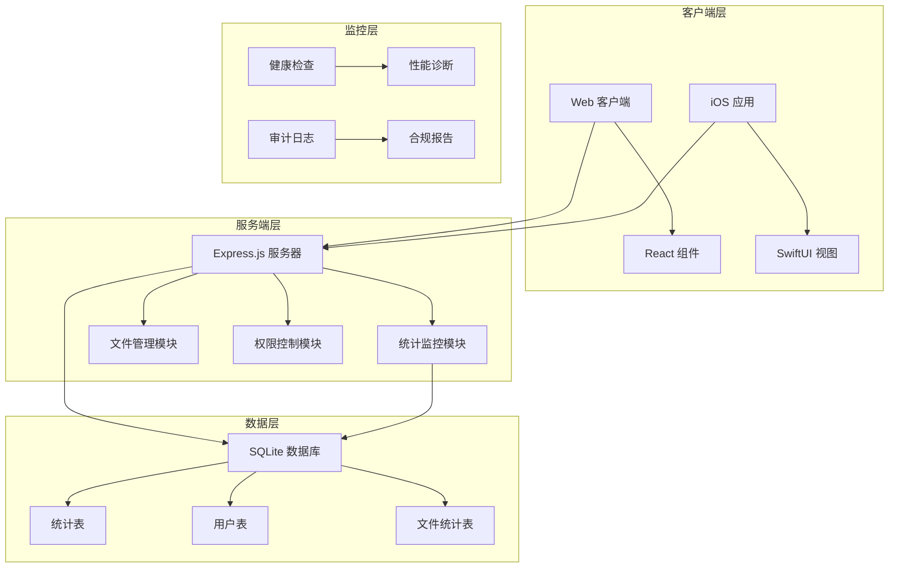
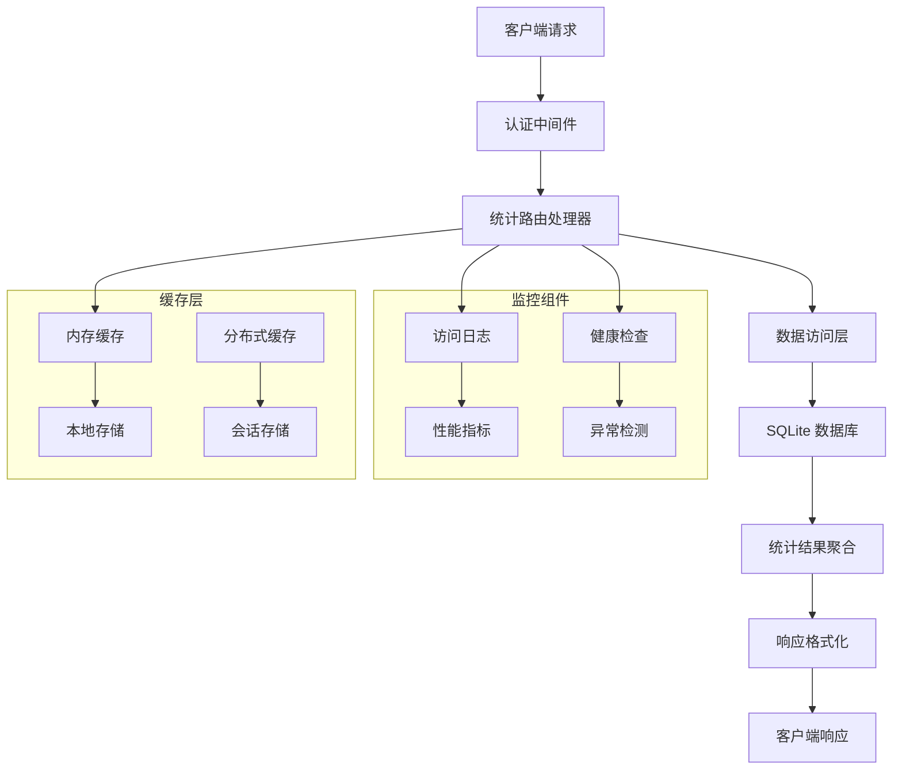
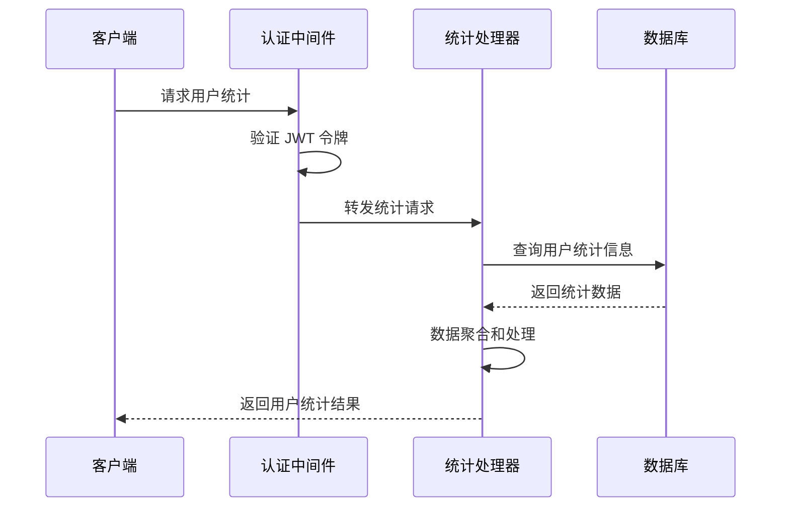
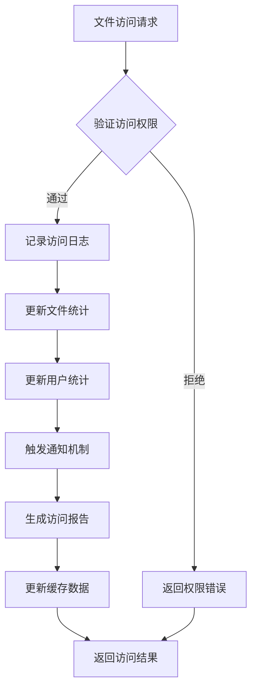
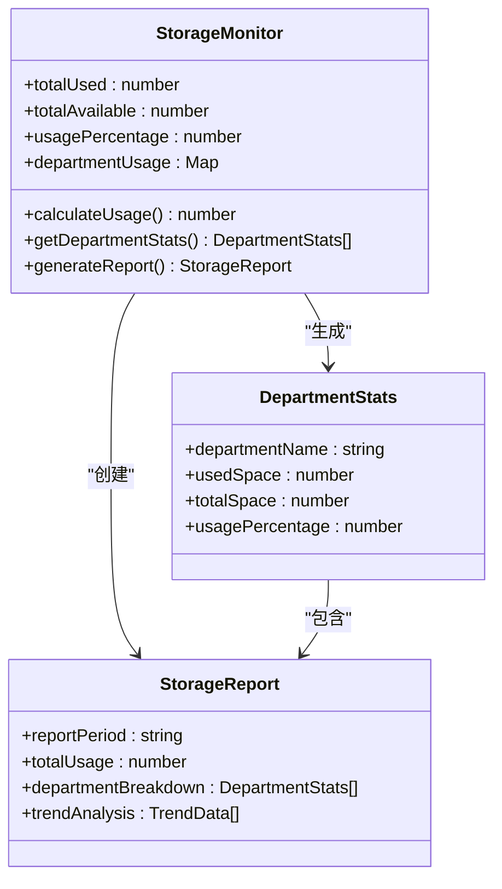
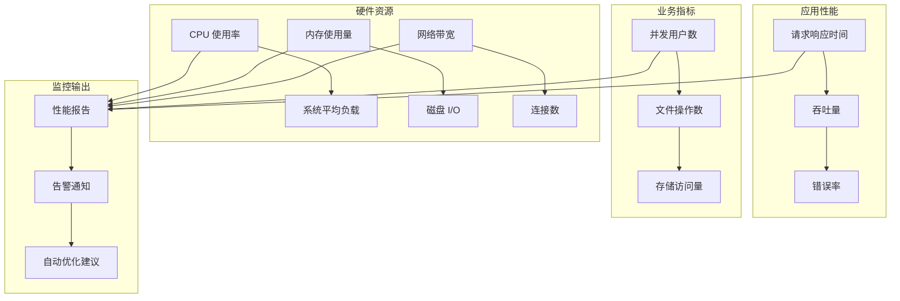
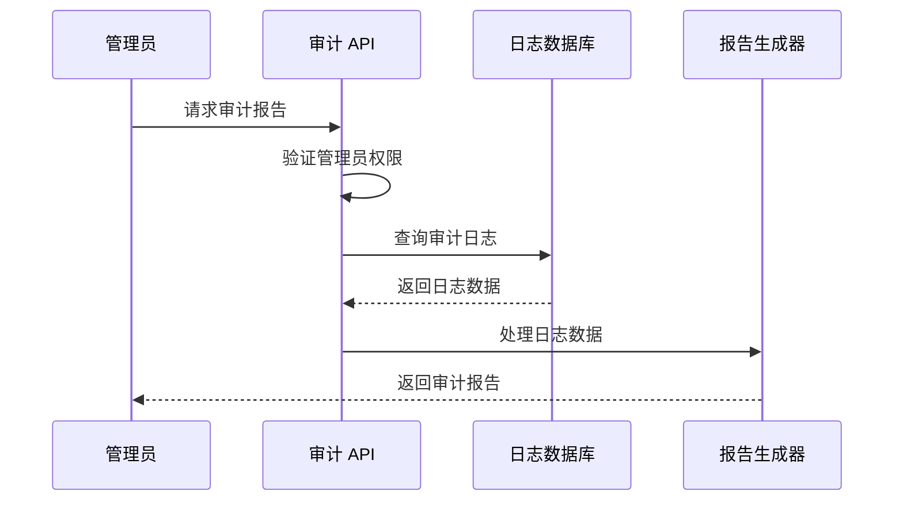
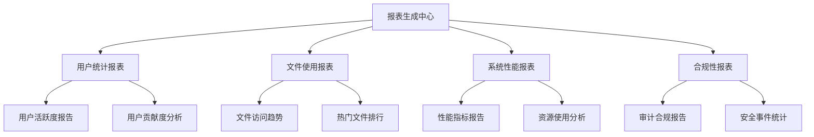
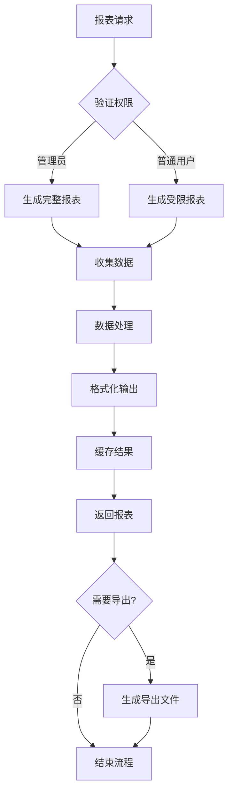
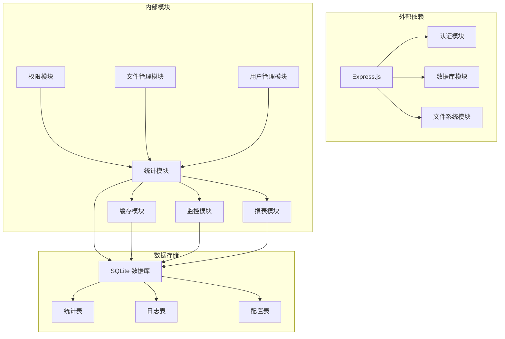

# 统计监控 API

<cite>
**本文档引用的文件**
- [server/index.js](file://server/index.js)
- [server/migrations/phase2.sql](file://server/migrations/phase2.sql)
- [server/migrations/add_share_collections.sql](file://server/migrations/add_share_collections.sql)
- [ios/LonghornApp/Services/DashboardStore.swift](file://ios/LonghornApp/Services/DashboardStore.swift)
- [ios/LonghornApp/Models/UserStats.swift](file://ios/LonghornApp/Models/UserStats.swift)
- [client/src/components/Dashboard.tsx](file://client/src/components/Dashboard.tsx)
- [client/src/components/SystemDashboard.tsx](file://client/src/components/SystemDashboard.tsx)
- [client/src/components/DepartmentDashboard.tsx](file://client/src/components/DepartmentDashboard.tsx)
- [scripts/health-check.sh](file://scripts/health-check.sh)
- [scripts/diagnose-performance.sh](file://scripts/diagnose-performance.sh)
</cite>

## 目录
1. [简介](#简介)
2. [项目结构](#项目结构)
3. [核心组件](#核心组件)
4. [架构概览](#架构概览)
5. [详细组件分析](#详细组件分析)
6. [依赖关系分析](#依赖关系分析)
7. [性能考虑](#性能考虑)
8. [故障排除指南](#故障排除指南)
9. [结论](#结论)

## 简介

Longhorn 项目是一个企业级文件管理系统，集成了完整的统计监控功能。本文档详细说明了系统的统计监控 API 接口规范，包括系统使用统计、用户行为分析、文件访问监控和性能指标收集等功能。

系统通过多层架构实现了全面的监控能力：
- **实时监控数据**：用户活跃度统计、文件访问趋势
- **历史统计数据**：存储空间使用情况、系统负载监控
- **报表生成功能**：部门统计、用户统计、系统统计
- **健康状态检查**：系统健康状态监控、异常检测
- **审计日志查询**：合规性报告、业务指标分析

## 项目结构

Longhorn 项目采用前后端分离架构，主要由以下组件构成：

**图表来源**
- [server/index.js](file://server/index.js#L1-L50)
- [ios/LonghornApp/Services/DashboardStore.swift](file://ios/LonghornApp/Services/DashboardStore.swift#L1-L50)

**章节来源**
- [server/index.js](file://server/index.js#L1-L100)
- [client/src/components/Dashboard.tsx](file://client/src/components/Dashboard.tsx#L1-L80)

## 核心组件

### 统计监控模块

系统的核心统计监控功能主要集中在以下组件中：

#### 用户统计组件
- **用户统计模型**：定义用户相关的统计指标结构
- **统计缓存机制**：实现高效的统计数据缓存策略
- **实时更新功能**：支持统计数据的实时刷新

#### 系统统计组件
- **系统概览统计**：提供全局系统使用情况统计
- **部门统计分析**：按部门维度进行统计分析
- **存储空间监控**：跟踪和报告存储使用情况

#### 文件访问监控
- **访问日志记录**：详细记录文件访问行为
- **访问趋势分析**：分析文件访问模式和趋势
- **权限访问统计**：统计不同权限级别的访问情况

**章节来源**
- [ios/LonghornApp/Models/UserStats.swift](file://ios/LonghornApp/Models/UserStats.swift#L1-L18)
- [ios/LonghornApp/Services/DashboardStore.swift](file://ios/LonghornApp/Services/DashboardStore.swift#L1-L157)

## 架构概览

系统采用分层架构设计，确保统计监控功能的可扩展性和可维护性：

**图表来源**
- [server/index.js](file://server/index.js#L267-L295)
- [server/index.js](file://server/index.js#L1250-L1269)

## 详细组件分析

### 用户活跃度统计 API

用户活跃度统计是系统监控的核心功能之一，提供了全面的用户行为分析能力。

#### API 端点设计

**图表来源**
- [server/index.js](file://server/index.js#L1250-L1269)
- [client/src/components/Dashboard.tsx](file://client/src/components/Dashboard.tsx#L37-L72)

#### 统计指标定义

系统提供以下用户活跃度统计指标：

| 指标类型 | 字段名 | 描述 | 数据类型 |
|---------|--------|------|----------|
| 用户总数 | totalUsers | 系统总用户数量 | Integer |
| 活跃用户 | activeUsers | 近期活跃用户数量 | Integer |
| 新增用户 | newUsers | 当日新增用户数量 | Integer |
| 用户增长率 | userGrowthRate | 用户增长百分比 | Float |
| 登录频率 | loginFrequency | 平均每日登录次数 | Float |

#### 实现细节

用户统计功能通过以下步骤实现：

1. **数据收集**：从用户表和访问日志表中收集相关数据
2. **数据聚合**：按时间维度和用户维度进行数据聚合
3. **计算指标**：基于聚合数据计算各种统计指标
4. **结果缓存**：将计算结果缓存以提高响应速度

**章节来源**
- [server/index.js](file://server/index.js#L1250-L1269)
- [client/src/components/Dashboard.tsx](file://client/src/components/Dashboard.tsx#L37-L72)

### 文件访问监控 API

文件访问监控系统提供了详细的文件使用情况分析，帮助管理员了解文件的实际使用状况。

#### 访问日志记录机制

**图表来源**
- [server/index.js](file://server/index.js#L2442-L2467)
- [server/index.js](file://server/index.js#L1272-L1289)

#### 访问统计功能

系统提供以下文件访问统计功能：

| 功能类别 | API 端点 | 参数 | 返回值 |
|---------|----------|------|--------|
| 访问记录 | POST /api/files/access | {path: string} | {success: boolean} |
| 访问统计 | GET /api/files/stats | {path: string} | 访问历史列表 |
| 访问追踪 | POST /api/files/hit | {path: string} | {success: boolean} |
| 存储统计 | GET /api/storage/stats | - | 存储使用情况 |

#### 访问趋势分析

系统能够分析文件访问的趋势模式：

**图表来源**
- [server/index.js](file://server/index.js#L2242-L2267)
- [server/index.js](file://server/index.js#L2442-L2467)

**章节来源**
- [server/index.js](file://server/index.js#L1272-L1289)
- [server/index.js](file://server/index.js#L2242-L2267)
- [server/index.js](file://server/index.js#L2442-L2467)

### 存储空间使用监控 API

存储空间监控系统提供了实时的存储使用情况跟踪和历史趋势分析。

#### 存储统计架构

**图表来源**
- [server/index.js](file://server/index.js#L1250-L1269)

#### 存储统计指标

系统提供以下存储空间统计指标：

| 指标类型 | 字段名 | 描述 | 更新频率 |
|---------|--------|------|----------|
| 总使用量 | totalUsed | 系统总存储使用量 | 实时 |
| 总容量 | totalAvailable | 系统总存储容量 | 静态配置 |
| 使用率 | usagePercentage | 存储使用百分比 | 实时 |
| 部门使用 | perDeptUsage | 各部门存储使用情况 | 每小时 |
| 文件数量 | totalFiles | 系统文件总数 | 实时 |

#### 存储监控实现

存储监控通过以下机制实现：

1. **实时监控**：定期扫描文件系统获取最新存储信息
2. **增量更新**：只更新发生变化的数据以减少计算开销
3. **历史记录**：保存历史存储数据用于趋势分析
4. **阈值告警**：当使用率达到预设阈值时触发告警

**章节来源**
- [server/index.js](file://server/index.js#L1250-L1269)

### 系统负载监控 API

系统负载监控提供了全面的系统性能指标跟踪，帮助管理员及时发现和解决性能问题。

#### 负载监控指标

**图表来源**
- [scripts/health-check.sh](file://scripts/health-check.sh#L68-L114)

#### 负载监控实现

系统负载监控通过以下方式实现：

1. **系统指标采集**：使用系统工具收集 CPU、内存、磁盘等硬件指标
2. **应用性能监控**：跟踪 API 响应时间、数据库查询性能等
3. **业务指标分析**：监控用户活跃度、文件操作频率等业务指标
4. **智能告警机制**：基于历史数据建立基线，自动检测异常情况

**章节来源**
- [scripts/health-check.sh](file://scripts/health-check.sh#L68-L114)
- [scripts/diagnose-performance.sh](file://scripts/diagnose-performance.sh#L102-L121)

### 审计日志查询 API

审计日志系统提供了完整的合规性报告生成功能，满足企业审计需求。

#### 审计日志架构

**图表来源**
- [server/index.js](file://server/index.js#L2876-L2898)

#### 审计日志功能

系统提供以下审计日志功能：

| 功能类型 | API 端点 | 参数 | 输出 |
|---------|----------|------|------|
| 日志查询 | GET /api/audit/logs | {startTime, endTime, user, action} | 审计日志列表 |
| 合规报告 | GET /api/audit/compliance | {reportType, period} | 合规性报告 |
| 用户行为分析 | GET /api/audit/user-behavior | {userId, period} | 用户行为报告 |
| 系统安全审计 | GET /api/audit/security | {startTime, endTime} | 安全事件报告 |

#### 审计日志字段

| 字段名 | 类型 | 描述 |
|--------|------|------|
| timestamp | DateTime | 日志时间戳 |
| userId | Integer | 用户标识符 |
| action | String | 执行的操作 |
| ip | String | 源 IP 地址 |
| userAgent | String | 用户代理信息 |
| details | JSON | 操作详情 |
| severity | String | 严重级别 |

**章节来源**
- [server/index.js](file://server/index.js#L2876-L2898)

### 报表生成功能

系统提供了多种类型的报表生成功能，支持不同层次的统计分析需求。

#### 报表类型

**图表来源**
- [client/src/components/SystemDashboard.tsx](file://client/src/components/SystemDashboard.tsx#L66-L99)
- [client/src/components/DepartmentDashboard.tsx](file://client/src/components/DepartmentDashboard.tsx#L48-L201)

#### 报表生成流程

**章节来源**
- [client/src/components/SystemDashboard.tsx](file://client/src/components/SystemDashboard.tsx#L66-L99)
- [client/src/components/DepartmentDashboard.tsx](file://client/src/components/DepartmentDashboard.tsx#L48-L201)

## 依赖关系分析

系统统计监控功能的依赖关系如下：

**图表来源**
- [server/index.js](file://server/index.js#L1-L50)
- [server/migrations/phase2.sql](file://server/migrations/phase2.sql#L1-L32)

**章节来源**
- [server/index.js](file://server/index.js#L1-L50)
- [server/migrations/phase2.sql](file://server/migrations/phase2.sql#L1-L32)

## 性能考虑

系统在设计时充分考虑了性能优化，采用了多种技术手段来确保统计监控功能的高效运行：

### 缓存策略

1. **多级缓存架构**：内存缓存 + 分布式缓存 + 磁盘缓存
2. **智能缓存失效**：基于时间窗口和数据变更的缓存更新策略
3. **缓存预热机制**：启动时预加载常用统计数据

### 数据库优化

1. **索引优化**：为常用查询字段建立复合索引
2. **查询优化**：使用参数化查询防止 SQL 注入
3. **连接池管理**：合理配置数据库连接池大小

### 异步处理

1. **异步统计计算**：后台任务处理耗时的统计计算
2. **批量数据处理**：合并多个小操作为批量处理
3. **队列管理**：使用消息队列处理高并发请求

## 故障排除指南

### 常见问题及解决方案

#### 统计数据不准确

**问题症状**：统计数据与实际使用情况不符

**可能原因**：
1. 缓存数据过期未更新
2. 数据库连接异常
3. 权限配置错误

**解决步骤**：
1. 清除统计缓存并重新生成
2. 检查数据库连接状态
3. 验证用户权限配置

#### 性能问题

**问题症状**：统计查询响应缓慢

**解决方法**：
1. 检查数据库索引完整性
2. 优化慢查询语句
3. 增加缓存命中率

#### 监控告警误报

**问题症状**：频繁收到不准确的告警通知

**解决步骤**：
1. 调整告警阈值设置
2. 检查监控数据源的准确性
3. 优化告警规则配置

**章节来源**
- [scripts/health-check.sh](file://scripts/health-check.sh#L68-L114)
- [scripts/diagnose-performance.sh](file://scripts/diagnose-performance.sh#L102-L121)

## 结论

Longhorn 项目的统计监控 API 提供了全面的企业级监控解决方案。通过多层架构设计和先进的技术实现，系统能够：

1. **实时监控**：提供准确的实时统计数据和趋势分析
2. **历史分析**：支持长期趋势分析和历史数据对比
3. **智能告警**：基于阈值和机器学习算法的异常检测
4. **合规报告**：满足企业审计和合规性要求
5. **高性能**：通过缓存和优化技术确保系统性能

系统的设计充分考虑了可扩展性、可维护性和安全性，为企业级应用提供了可靠的统计监控基础。未来可以进一步增强机器学习算法的应用，提供更智能化的预测分析功能。