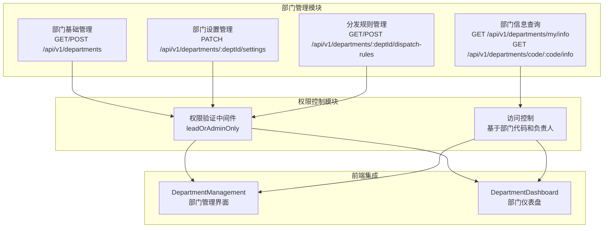

# 部门管理 API

<cite>
**本文档引用的文件**
- [server/service/routes/departments.js](file://server/service/routes/departments.js)
- [server/service/migrations/027_add_department_lead.sql](file://server/service/migrations/027_add_department_lead.sql)
- [server/service/migrations/028_add_department_code.sql](file://server/service/migrations/028_add_department_code.sql)
- [server/migrations/fix_departments_permissions.sql](file://server/migrations/fix_departments_permissions.sql)
- [client/src/components/DepartmentManagement.tsx](file://client/src/components/DepartmentManagement.tsx)
- [client/src/components/DepartmentDashboard.tsx](file://client/src/components/DepartmentDashboard.tsx)
- [server/index.js](file://server/index.js)
</cite>

## 更新摘要
**所做更改**
- 新增部门代码管理功能，支持部门唯一标识符
- 新增部门负责人管理功能，支持明确的部门领导指定
- 新增部门设置管理，支持自动分发开关等配置
- 新增部门分发规则管理功能
- 更新部门 API 路由结构，采用 v1 版本规范
- 完善部门权限系统，支持基于代码的精确权限控制

## 目录
1. [简介](#简介)
2. [架构总览](#架构总览)
3. [部门基础 API](#部门基础-api)
4. [部门设置管理](#部门设置管理)
5. [部门分发规则](#部门分发规则)
6. [权限系统](#权限系统)
7. [前端集成](#前端集成)
8. [数据库结构](#数据库结构)
9. [迁移脚本](#迁移脚本)
10. [最佳实践](#最佳实践)

## 简介
本文件详细介绍 Longhorn 系统中的部门管理 API，涵盖部门 CRUD 操作、部门代码和负责人管理、部门设置配置、分发规则管理以及权限控制系统。系统现已支持基于部门代码的精确权限控制和部门负责人的明确管理。

## 架构总览
部门管理系统采用模块化设计，包含基础部门管理、设置配置、分发规则和权限控制四大核心模块：



**图表来源**
- [server/service/routes/departments.js](file://server/service/routes/departments.js#L1-L164)
- [client/src/components/DepartmentManagement.tsx](file://client/src/components/DepartmentManagement.tsx#L1-L430)
- [client/src/components/DepartmentDashboard.tsx](file://client/src/components/DepartmentDashboard.tsx#L1-L367)

## 部门基础 API

### 获取当前用户部门信息
- **方法与路径**: GET /api/v1/departments/my/info
- **认证**: 需要登录
- **响应**: 包含部门 ID、名称、代码、自动分发开关和负责人 ID
- **用途**: 获取当前登录用户的部门基本信息

### 根据代码获取部门信息
- **方法与路径**: GET /api/v1/departments/code/:code/info
- **参数**: code (部门代码)
- **认证**: 需要登录
- **响应**: 部门详细信息，包含自动分发开关和负责人 ID
- **用途**: 通过部门代码精确查询部门信息

### 创建部门
- **方法与路径**: POST /api/v1/departments
- **认证**: 需要管理员权限
- **请求体**: { name: "部门全名 (代码)" }
- **响应**: { success: true }
- **注意**: 部门名称格式为 "部门全名 (代码)"

**章节来源**
- [server/service/routes/departments.js](file://server/service/routes/departments.js#L97-L142)
- [client/src/components/DepartmentManagement.tsx](file://client/src/components/DepartmentManagement.tsx#L46-L68)

## 部门设置管理

### 更新部门设置
- **方法与路径**: PATCH /api/v1/departments/:deptId/settings
- **认证**: 需要部门负责人或管理员权限
- **参数**: deptId (部门 ID)
- **请求体**: { auto_dispatch_enabled: boolean }
- **响应**: { success: true, message: "Department settings updated" }
- **权限控制**: 部门负责人只能修改自己部门的设置

### 设置权限验证中间件
系统内置 `leadOrAdminOnly` 中间件，确保：
- 管理员可以访问所有部门
- 部门负责人只能访问和修改自己的部门
- 自动验证用户部门归属

**章节来源**
- [server/service/routes/departments.js](file://server/service/routes/departments.js#L14-L28)
- [server/service/routes/departments.js](file://server/service/routes/departments.js#L144-L160)

## 部门分发规则

### 获取分发规则
- **方法与路径**: GET /api/v1/departments/:deptId/dispatch-rules
- **认证**: 需要部门负责人或管理员权限
- **参数**: deptId (部门 ID)
- **响应**: 分发规则数组，包含默认负责人姓名
- **用途**: 查看部门的工单分发配置

### 批量更新分发规则
- **方法与路径**: POST /api/v1/departments/:deptId/dispatch-rules
- **认证**: 需要部门负责人或管理员权限
- **参数**: deptId (部门 ID)
- **请求体**: { rules: Array }
- **规则格式**: 
  ```javascript
  {
    ticket_type: string,
    node_key: string,
    default_assignee_id: number,
    is_enabled: boolean
  }
  ```
- **响应**: { success: true, message: "Dispatch rules updated" }
- **特性**: 使用 UPSERT 操作，支持批量创建和更新

**章节来源**
- [server/service/routes/departments.js](file://server/service/routes/departments.js#L30-L95)

## 权限系统

### 部门权限验证
系统采用多层权限控制：
- **角色权限**: Admin/Exec 拥有最高权限
- **部门权限**: Lead 只能管理本部门
- **路径权限**: 基于部门代码的精确路径控制

### 路径匹配规则
- 部门路径使用部门代码进行匹配
- 支持精确匹配和前缀匹配
- 自动分发功能通过 `auto_dispatch_enabled` 字段控制

### 权限继承机制
- 部门负责人自动获得部门内 Full 权限
- 部门成员获得 Read 权限
- 支持自定义权限覆盖

**章节来源**
- [server/service/routes/departments.js](file://server/service/routes/departments.js#L13-L28)
- [server/migrations/fix_departments_permissions.sql](file://server/migrations/fix_departments_permissions.sql#L28-L55)

## 前端集成

### 部门管理界面
- **组件**: DepartmentManagement
- **功能**:
  - 创建部门（支持部门代码验证）
  - 授权管理（用户、文件夹、权限类型、有效期）
  - 部门列表展示
- **代码验证**: 部门代码必须为 2-3 个大写字母

### 部门仪表盘
- **组件**: DepartmentDashboard
- **标签页**:
  - 概览: 成员数、文件数、存储使用、近期活动
  - 成员: 成员列表和统计
  - 权限: 权限管理界面
- **国际化**: 支持部门代码到中文名称的映射

### 文件夹选择器
- **组件**: FolderTreeSelector
- **功能**: 提供可视化的文件夹选择界面
- **集成**: 与部门授权流程深度集成

**章节来源**
- [client/src/components/DepartmentManagement.tsx](file://client/src/components/DepartmentManagement.tsx#L15-L430)
- [client/src/components/DepartmentDashboard.tsx](file://client/src/components/DepartmentDashboard.tsx#L50-L367)

## 数据库结构

### 部门表结构
```sql
CREATE TABLE departments (
    id INTEGER PRIMARY KEY AUTOINCREMENT,
    name TEXT NOT NULL,
    code TEXT,  -- 新增：部门代码
    lead_id INTEGER REFERENCES users(id),  -- 新增：部门负责人
    auto_dispatch_enabled BOOLEAN DEFAULT 0,  -- 新增：自动分发开关
    created_at DATETIME DEFAULT CURRENT_TIMESTAMP,
    updated_at DATETIME DEFAULT CURRENT_TIMESTAMP
);
```

### 用户表关联
- `users.department_id` 引用 `departments.id`
- `departments.lead_id` 引用 `users.id`

### 权限表结构
```sql
CREATE TABLE permissions (
    id INTEGER PRIMARY KEY AUTOINCREMENT,
    user_id INTEGER,
    folder_path TEXT,
    access_type TEXT,
    expires_at DATETIME,
    created_at DATETIME DEFAULT CURRENT_TIMESTAMP,
    FOREIGN KEY(user_id) REFERENCES users(id)
);
```

**章节来源**
- [server/service/migrations/027_add_department_lead.sql](file://server/service/migrations/027_add_department_lead.sql#L1-L11)
- [server/service/migrations/028_add_department_code.sql](file://server/service/migrations/028_add_department_code.sql#L1-L8)

## 迁移脚本

### 部门代码迁移
```sql
-- 添加 code 列
ALTER TABLE departments ADD COLUMN code TEXT;

-- 初始化代码值
UPDATE departments SET code = name;
```

### 部门负责人迁移
```sql
-- 添加 lead_id 列
ALTER TABLE departments ADD COLUMN lead_id INTEGER REFERENCES users(id);

-- 更新现有部门负责人
UPDATE departments SET lead_id = (SELECT id FROM users WHERE username = 'Cathy') WHERE code = 'MS';
UPDATE departments SET lead_id = (SELECT id FROM users WHERE username = 'SherryFin') WHERE code = 'GE';
```

### 权限修复迁移
- 标准化部门 ID 和代码
- 清理重复数据
- 重新建立部门权限
- 为部门负责人和成员授予相应权限

**章节来源**
- [server/service/migrations/027_add_department_lead.sql](file://server/service/migrations/027_add_department_lead.sql#L1-L11)
- [server/service/migrations/028_add_department_code.sql](file://server/service/migrations/028_add_department_code.sql#L1-L8)
- [server/migrations/fix_departments_permissions.sql](file://server/migrations/fix_departments_permissions.sql#L1-L58)

## 最佳实践

### 部门代码规范
- 使用 2-3 个大写字母
- 具有唯一性和可读性
- 建议使用部门英文缩写

### 权限管理策略
- 遵循最小权限原则
- 定期审查部门权限
- 及时清理过期权限

### 自动分发配置
- 根据部门工作流程配置分发规则
- 设置合理的默认负责人
- 监控分发效果并及时调整

### 安全注意事项
- 部门负责人权限受限于其部门
- 定期审计权限变更
- 实施权限变更审批流程

### 性能优化
- 使用部门代码进行权限匹配比路径匹配更高效
- 合理设置权限过期时间
- 定期清理无用权限记录

**章节来源**
- [client/src/components/DepartmentManagement.tsx](file://client/src/components/DepartmentManagement.tsx#L53-L58)
- [server/service/routes/departments.js](file://server/service/routes/departments.js#L14-L28)