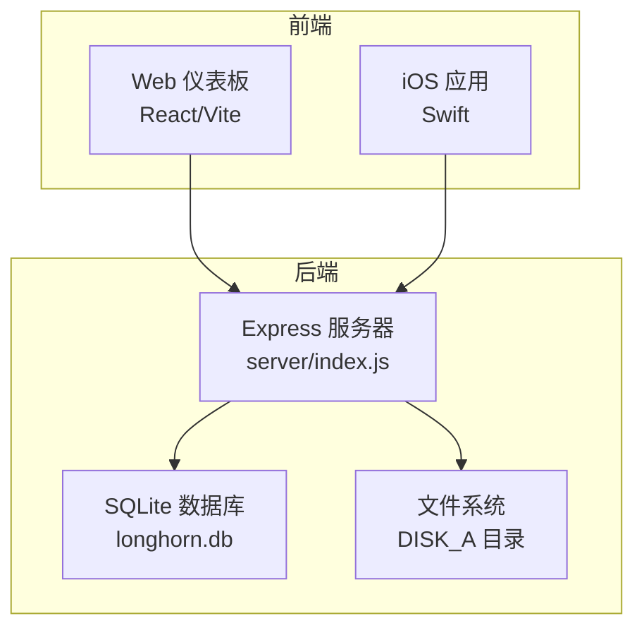
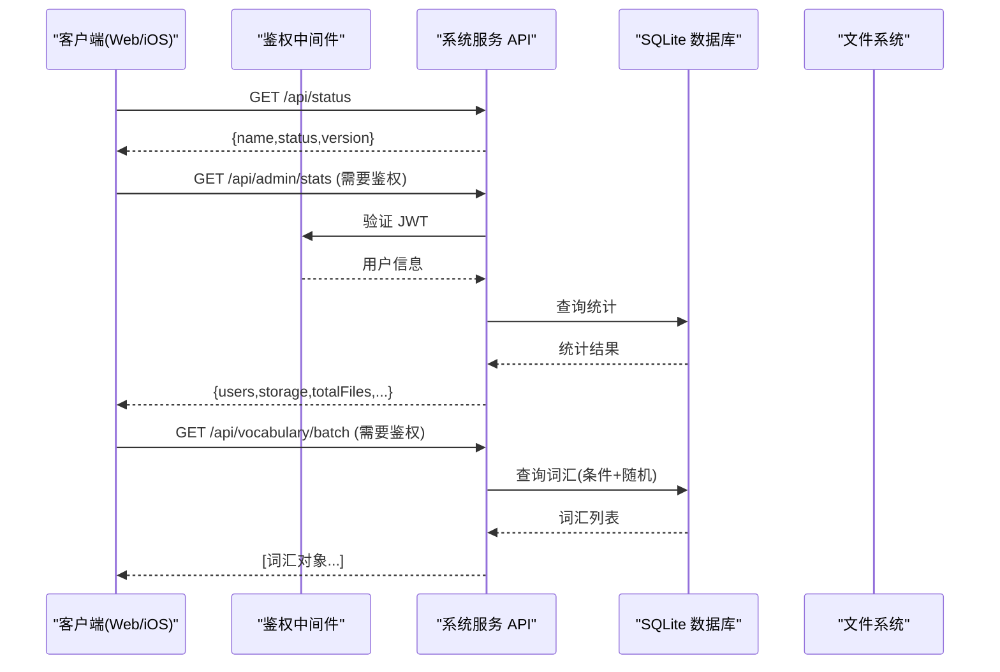
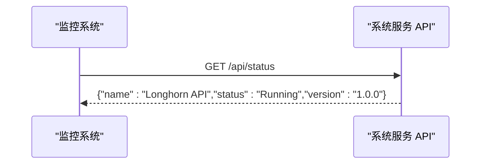
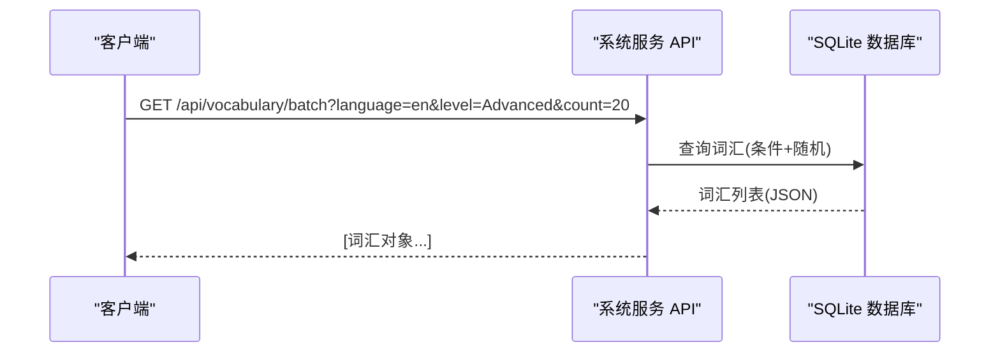
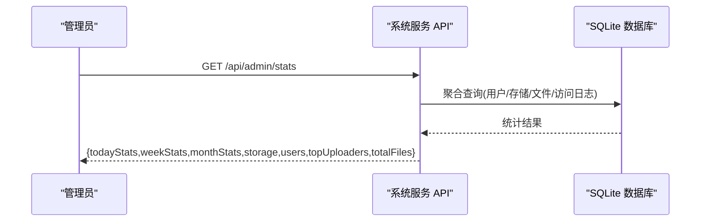
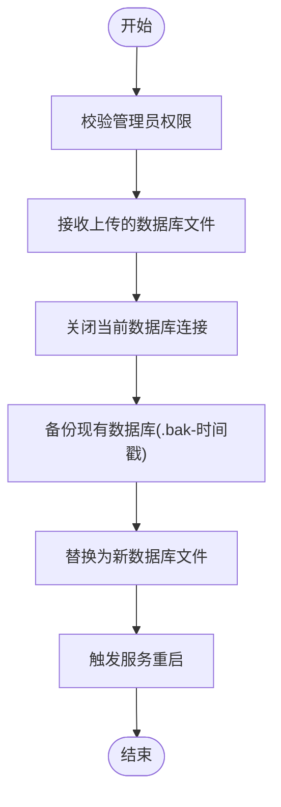
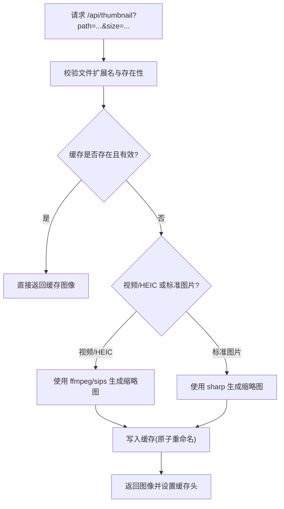
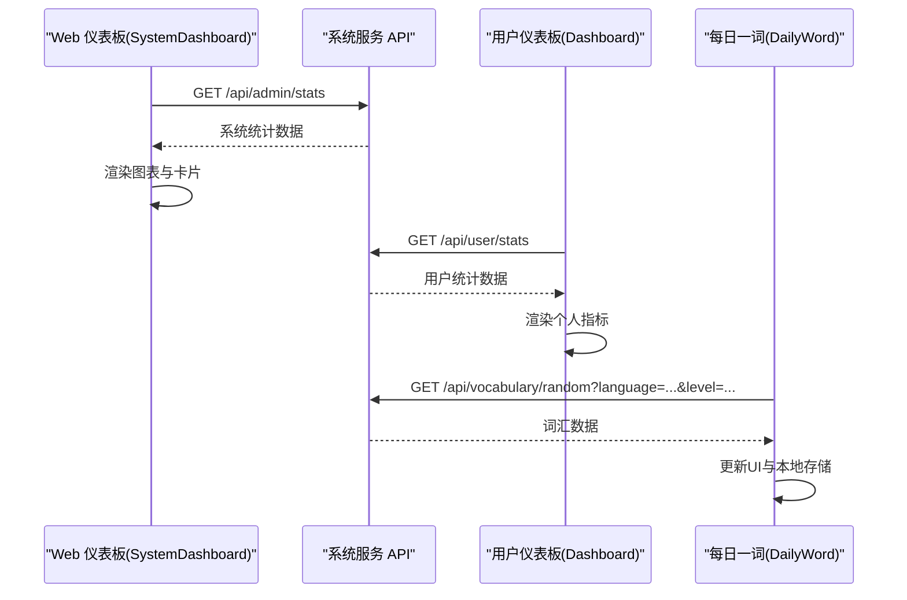
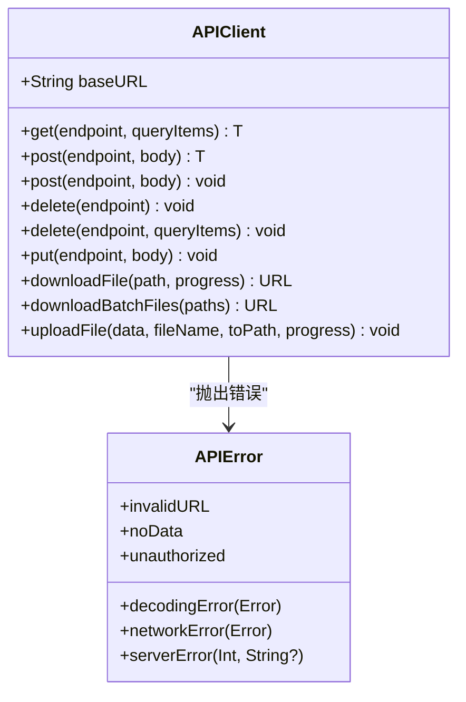
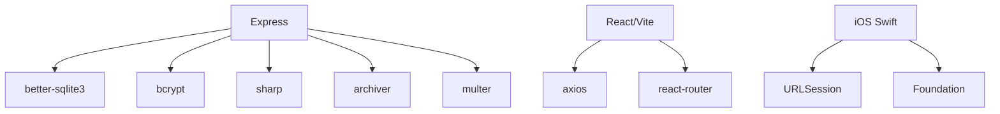

# 系统服务 API

<cite>
**本文档引用的文件**
- [server/index.js](file://server/index.js)
- [client/src/App.tsx](file://client/src/App.tsx)
- [client/src/components/SystemDashboard.tsx](file://client/src/components/SystemDashboard.tsx)
- [client/src/components/Dashboard.tsx](file://client/src/components/Dashboard.tsx)
- [client/src/components/DailyWord.tsx](file://client/src/components/DailyWord.tsx)
- [ios/LonghornApp/Services/APIClient.swift](file://ios/LonghornApp/Services/APIClient.swift)
- [scripts/health-check.sh](file://scripts/health-check.sh)
- [scripts/diagnose-performance.sh](file://scripts/diagnose-performance.sh)
- [server/data/vocab/en.json](file://server/data/vocab/en.json)
</cite>

## 目录
1. [简介](#简介)
2. [项目结构](#项目结构)
3. [核心组件](#核心组件)
4. [架构总览](#架构总览)
5. [详细组件分析](#详细组件分析)
6. [依赖关系分析](#依赖关系分析)
7. [性能考虑](#性能考虑)
8. [故障排除指南](#故障排除指南)
9. [结论](#结论)
10. [附录](#附录)

## 简介
本文件面向系统管理员与开发人员，系统性梳理 Longhorn 的系统服务 API，包括健康检查、系统状态、词汇表管理、缓存清理、系统监控与统计、备份与恢复、以及前端仪表板与移动端状态数据来源与更新机制。文档以实际代码为依据，提供接口定义、调用流程、数据模型与可视化图表，帮助快速理解与维护系统。

## 项目结构
Longhorn 采用前后端分离架构：后端基于 Node.js + Express 提供 REST API；前端使用 React/Vite 构建 Web 仪表板；iOS 使用 Swift 开发移动端应用。系统服务 API 主要集中在后端 server/index.js 中，前端通过 axios 调用，iOS 通过自定义 APIClient 封装网络层。

**图表来源**
- [server/index.js](file://server/index.js#L16-L31)
- [client/src/App.tsx](file://client/src/App.tsx#L1-L635)
- [ios/LonghornApp/Services/APIClient.swift](file://ios/LonghornApp/Services/APIClient.swift#L1-L326)

**章节来源**
- [server/index.js](file://server/index.js#L16-L31)
- [client/src/App.tsx](file://client/src/App.tsx#L1-L635)
- [ios/LonghornApp/Services/APIClient.swift](file://ios/LonghornApp/Services/APIClient.swift#L1-L326)

## 核心组件
- 健康检查与状态接口：提供服务可用性检测与基础状态信息。
- 词汇表管理：支持批量获取、随机获取与按条件筛选的词汇查询。
- 系统监控与统计：提供用户、存储、文件等维度的系统统计。
- 管理功能：数据库恢复、分享集合管理、回收站清理等。
- 缓存与缩略图：缩略图生成与缓存策略，优化图片加载性能。
- 前端与移动端数据来源：仪表板与每日一词等组件的数据拉取与更新机制。

**章节来源**
- [server/index.js](file://server/index.js#L477-L479)
- [server/index.js](file://server/index.js#L431-L475)
- [client/src/components/SystemDashboard.tsx](file://client/src/components/SystemDashboard.tsx#L15-L34)
- [server/index.js](file://server/index.js#L3082-L3118)
- [server/index.js](file://server/index.js#L483-L679)

## 架构总览
系统服务 API 的调用链路如下：前端/移动端发起 HTTP 请求，后端进行鉴权与权限校验，访问数据库与文件系统，返回标准化 JSON 响应。健康检查与状态接口无需鉴权，其余接口均需携带 Bearer Token。

**图表来源**
- [server/index.js](file://server/index.js#L477-L479)
- [server/index.js](file://server/index.js#L431-L475)
- [client/src/components/SystemDashboard.tsx](file://client/src/components/SystemDashboard.tsx#L42-L56)

**章节来源**
- [server/index.js](file://server/index.js#L268-L295)
- [server/index.js](file://server/index.js#L431-L475)
- [client/src/components/SystemDashboard.tsx](file://client/src/components/SystemDashboard.tsx#L42-L56)

## 详细组件分析

### 健康检查与系统状态接口
- 接口路径：/api/status
- 方法：GET
- 功能：返回服务名称、运行状态与版本号，用于健康检查与服务发现。
- 认证：无需鉴权
- 返回示例：包含 name、status、version 字段的对象

**图表来源**
- [server/index.js](file://server/index.js#L477-L479)

**章节来源**
- [server/index.js](file://server/index.js#L477-L479)

### 词汇表管理接口
- 批量获取接口：/api/vocabulary/batch
  - 方法：GET
  - 查询参数：language（可选）、level（可选）、count（可选，最大 50）
  - 功能：按条件筛选并随机返回指定数量的词汇，示例字段包含单词、音标、释义、词性、例句等
  - 认证：需要鉴权
  - 数据来源：数据库 vocabulary 表，示例种子位于 server/data/vocab/*.json

**图表来源**
- [server/index.js](file://server/index.js#L431-L475)
- [server/data/vocab/en.json](file://server/data/vocab/en.json#L1-L227)

**章节来源**
- [server/index.js](file://server/index.js#L431-L475)
- [server/data/vocab/en.json](file://server/data/vocab/en.json#L1-L227)

### 系统监控与统计接口
- 管理统计接口：/api/admin/stats
  - 方法：GET
  - 功能：返回系统级统计数据，包括今日/周/月上传统计、存储使用分布、用户总数与活跃数、文件总数、部门存储占比、Top 上传者等
  - 认证：需要 Admin 权限
  - 数据来源：多表聚合查询，涉及用户、文件、访问日志等

- 用户统计接口：/api/user/stats
  - 方法：GET
  - 功能：返回当前用户的上传数量、存储使用量、分享数量等
  - 认证：需要鉴权
  - 数据来源：用户相关统计与访问日志

**图表来源**
- [client/src/components/SystemDashboard.tsx](file://client/src/components/SystemDashboard.tsx#L15-L34)
- [client/src/components/SystemDashboard.tsx](file://client/src/components/SystemDashboard.tsx#L42-L56)

**章节来源**
- [client/src/components/SystemDashboard.tsx](file://client/src/components/SystemDashboard.tsx#L15-L34)
- [client/src/components/SystemDashboard.tsx](file://client/src/components/SystemDashboard.tsx#L42-L56)
- [client/src/components/Dashboard.tsx](file://client/src/components/Dashboard.tsx#L37-L55)

### 管理功能：数据库恢复
- 接口路径：/api/admin/restore-db
- 方法：POST
- 功能：管理员上传新的数据库文件，执行备份与替换，并触发服务重启
- 认证：需要 Admin 权限
- 流程：关闭数据库连接 → 备份现有数据库 → 替换新数据库 → 返回成功消息 → 进程退出由进程管理器重启

**图表来源**
- [server/index.js](file://server/index.js#L3082-L3118)

**章节来源**
- [server/index.js](file://server/index.js#L3082-L3118)

### 缓存与缩略图接口
- 接口路径：/api/thumbnail
- 方法：GET
- 功能：根据文件路径生成 WebP 缩略图并缓存，支持预览模式与尺寸控制
- 支持格式：标准图片（jpg/png/gif/webp/bmp/tiff）与视频/HEIC（通过 ffmpeg/sips 处理）
- 缓存策略：基于文件路径与尺寸生成缓存键，缓存文件存在且更新时间晚于源文件时直接返回
- 并发控制：缩略图生成队列限制并发数，避免 CPU/IO 过载

**图表来源**
- [server/index.js](file://server/index.js#L483-L679)

**章节来源**
- [server/index.js](file://server/index.js#L483-L679)

### 前端仪表板与移动端状态数据来源
- Web 仪表板：SystemDashboard 组件通过 /api/admin/stats 获取系统统计，周期性轮询更新，展示用户数、存储使用、文件总数、部门存储分布与 Top 上传者。
- 用户个人仪表板：Dashboard 组件通过 /api/user/stats 获取个人统计，展示上传数量、存储使用量、分享数量等。
- 每日一词：DailyWord 组件通过 /api/vocabulary/random 获取随机词汇，支持语言与难度切换，本地持久化难度设置。

**图表来源**
- [client/src/components/SystemDashboard.tsx](file://client/src/components/SystemDashboard.tsx#L42-L56)
- [client/src/components/Dashboard.tsx](file://client/src/components/Dashboard.tsx#L37-L55)
- [client/src/components/DailyWord.tsx](file://client/src/components/DailyWord.tsx#L19-L36)

**章节来源**
- [client/src/components/SystemDashboard.tsx](file://client/src/components/SystemDashboard.tsx#L42-L56)
- [client/src/components/Dashboard.tsx](file://client/src/components/Dashboard.tsx#L37-L55)
- [client/src/components/DailyWord.tsx](file://client/src/components/DailyWord.tsx#L19-L36)

### iOS 端网络层与数据获取
- APIClient 封装了统一的网络请求方法，支持 GET/POST/DELETE/PUT，自动添加 Authorization 头与 JSON 内容类型。
- 支持超时配置与错误处理，包含无效 URL、无数据、解码错误、网络错误、服务器错误与未授权等错误类型。
- 适用于文件下载、批量下载、上传等场景，为移动端状态展示与数据同步提供基础能力。

**图表来源**
- [ios/LonghornApp/Services/APIClient.swift](file://ios/LonghornApp/Services/APIClient.swift#L11-L35)
- [ios/LonghornApp/Services/APIClient.swift](file://ios/LonghornApp/Services/APIClient.swift#L69-L108)

**章节来源**
- [ios/LonghornApp/Services/APIClient.swift](file://ios/LonghornApp/Services/APIClient.swift#L1-L326)

## 依赖关系分析
- 服务器端依赖：Express、better-sqlite3、bcrypt、sharp、archiver、multer 等。
- 前端依赖：axios、react-router、lucide-react 等。
- iOS 依赖：Foundation、URLSession、JSON 解析与编码。
- 运维脚本：health-check.sh、diagnose-performance.sh 等辅助系统健康检查与性能诊断。

**图表来源**
- [server/index.js](file://server/index.js#L1-L14)
- [client/src/App.tsx](file://client/src/App.tsx#L1-L20)
- [ios/LonghornApp/Services/APIClient.swift](file://ios/LonghornApp/Services/APIClient.swift#L53-L64)

**章节来源**
- [server/index.js](file://server/index.js#L1-L14)
- [client/src/App.tsx](file://client/src/App.tsx#L1-L20)
- [ios/LonghornApp/Services/APIClient.swift](file://ios/LonghornApp/Services/APIClient.swift#L53-L64)

## 性能考虑
- 压缩与缓存：启用 gzip 压缩与静态资源缓存，减少带宽与延迟。
- 缩略图并发控制：限制缩略图生成并发数，避免 CPU/IO 过载。
- ETag 与条件请求：文件列表接口使用 ETag 与 If-None-Match 实现缓存命中，降低重复传输。
- 数据库 WAL 模式：开启 WAL 模式提升并发读写性能。
- 健康检查与诊断：提供本地健康检查与性能诊断脚本，便于快速定位问题。

**章节来源**
- [server/index.js](file://server/index.js#L418-L427)
- [server/index.js](file://server/index.js#L555-L577)
- [server/index.js](file://server/index.js#L2337-L2342)
- [scripts/health-check.sh](file://scripts/health-check.sh#L1-L114)
- [scripts/diagnose-performance.sh](file://scripts/diagnose-performance.sh#L1-L31)

## 故障排除指南
- 健康检查：使用 health-check.sh 检查后端/前端服务端口状态，必要时自动启动。
- 性能诊断：使用 diagnose-performance.sh 生成性能报告，包含 PM2 进程状态与本地 API 响应时间测试。
- 缩略图生成失败：检查 ffmpeg/sips 是否可用，查看缩略图缓存目录权限与磁盘空间。
- 权限不足：确认用户角色与路径权限，Admin 可见全部部门，普通用户仅可见自身与授权范围。
- 数据库恢复：确保上传文件格式正确，恢复后由进程管理器自动重启服务。

**章节来源**
- [scripts/health-check.sh](file://scripts/health-check.sh#L1-L114)
- [scripts/diagnose-performance.sh](file://scripts/diagnose-performance.sh#L1-L31)
- [server/index.js](file://server/index.js#L3082-L3118)

## 结论
Longhorn 的系统服务 API 提供了完整的健康检查、系统状态、词汇表管理、缓存与缩略图、系统统计与管理功能。通过前后端分离架构与移动端网络封装，实现了稳定的数据来源与更新机制。建议在生产环境中结合健康检查与性能诊断脚本，定期巡检服务状态与资源使用情况，确保系统高可用与高性能。

## 附录
- 接口清单与调用方式详见各组件章节。
- 前端与移动端数据来源与更新策略详见“前端仪表板与移动端状态数据来源”与“iOS 端网络层与数据获取”。