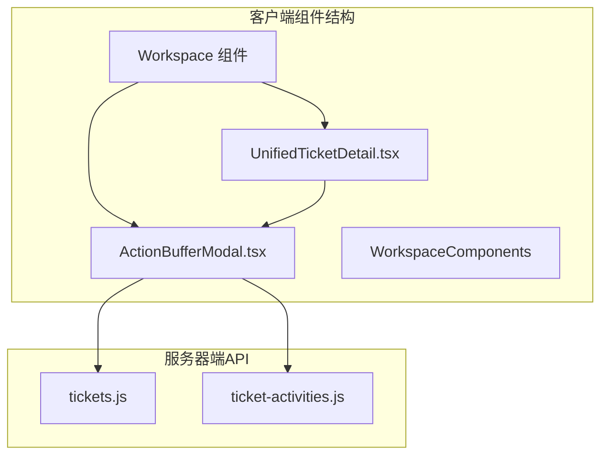
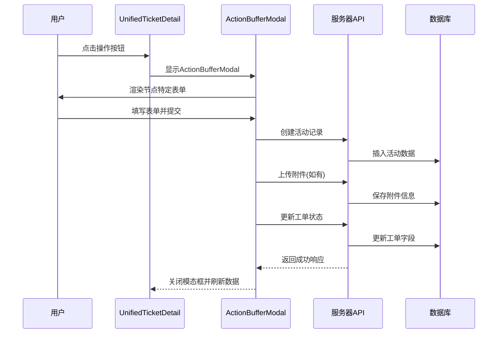
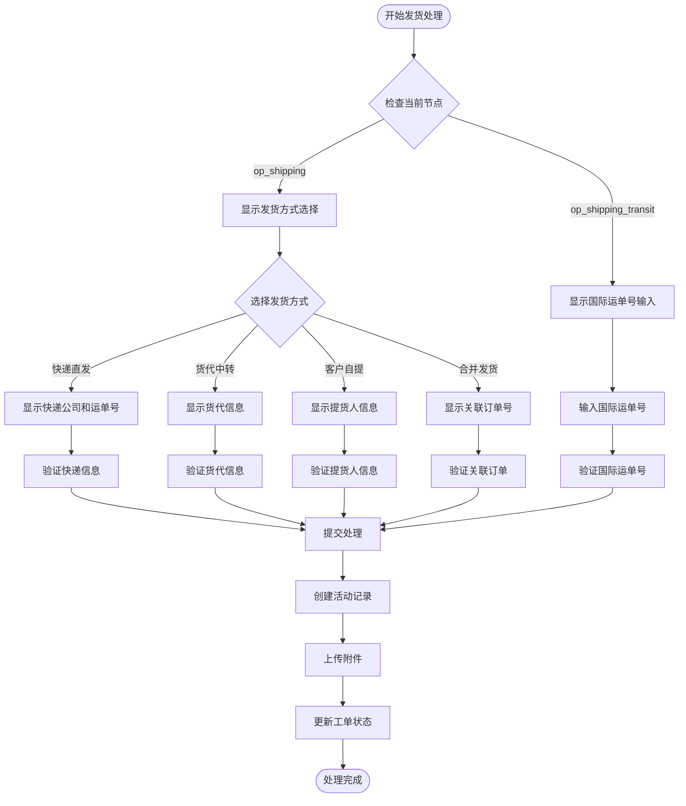
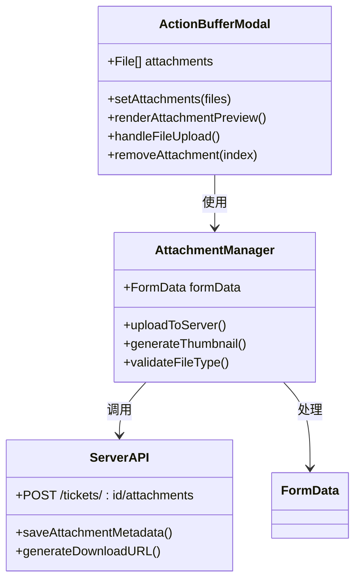
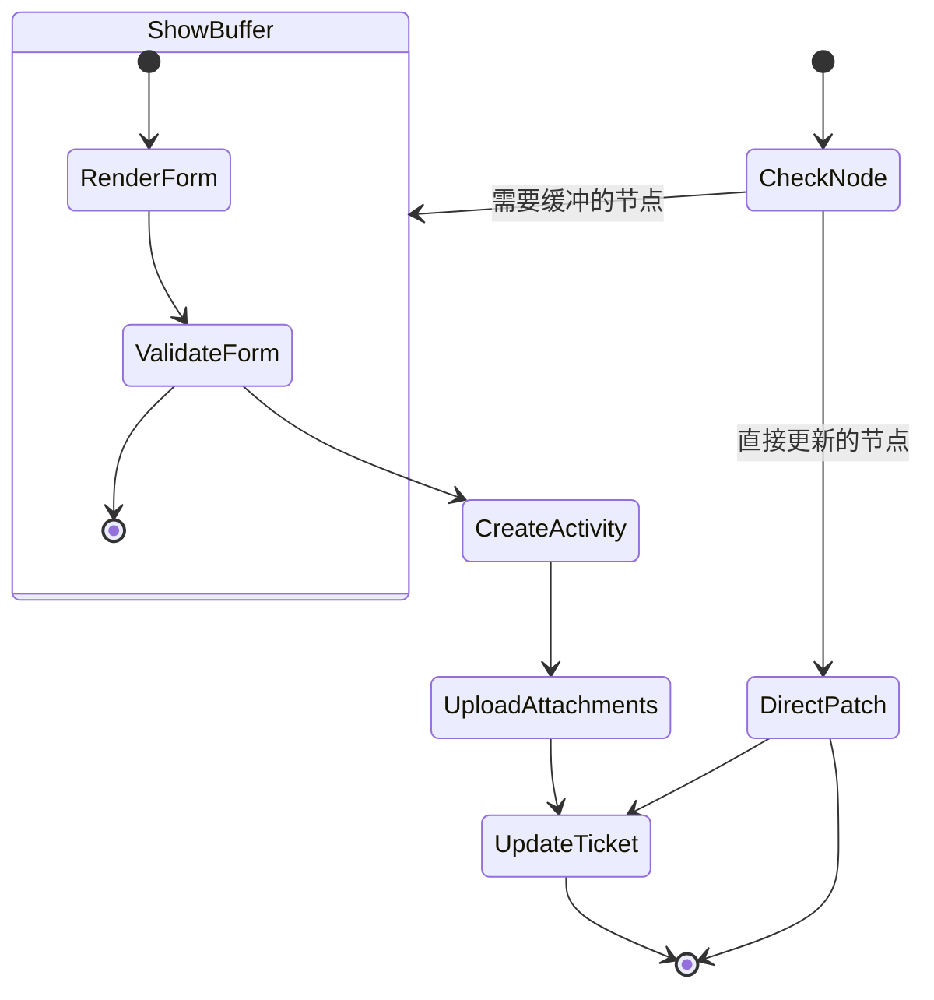
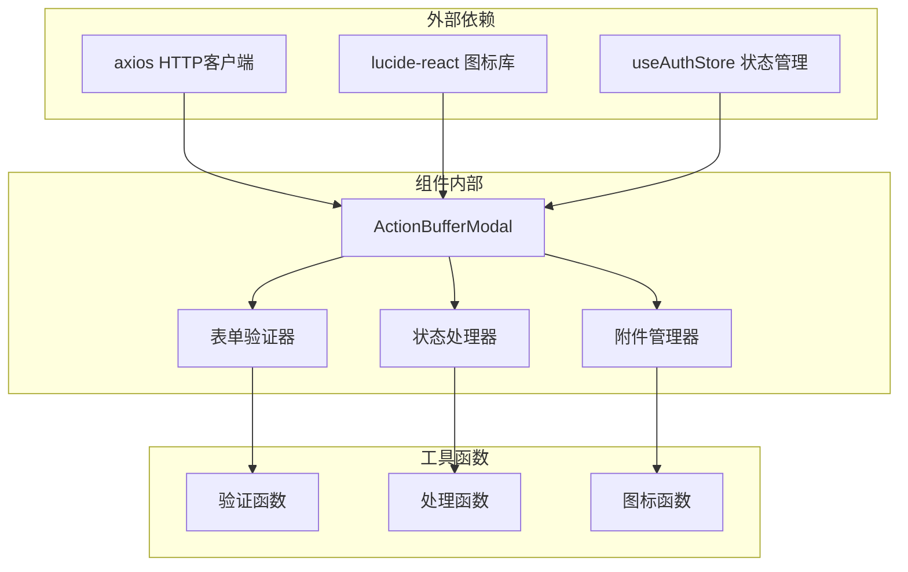
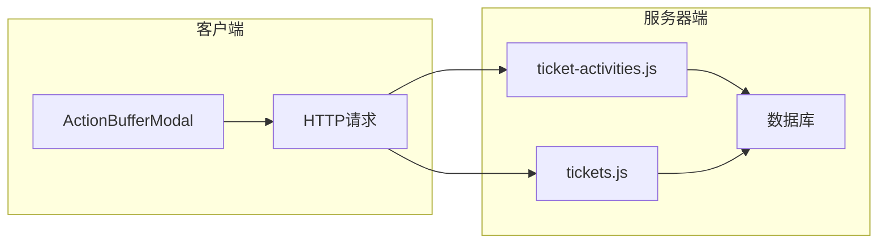

# Action Buffer Modal

<cite>
**本文档引用的文件**
- [ActionBufferModal.tsx](file://client/src/components/Workspace/ActionBufferModal.tsx)
- [UnifiedTicketDetail.tsx](file://client/src/components/Workspace/UnifiedTicketDetail.tsx)
- [index.ts](file://client/src/components/Workspace/index.ts)
- [tickets.js](file://server/service/routes/tickets.js)
- [ticket-activities.js](file://server/service/routes/ticket-activities.js)
</cite>

## 目录
1. [简介](#简介)
2. [项目结构](#项目结构)
3. [核心组件](#核心组件)
4. [架构概览](#架构概览)
5. [详细组件分析](#详细组件分析)
6. [依赖关系分析](#依赖关系分析)
7. [性能考虑](#性能考虑)
8. [故障排除指南](#故障排除指南)
9. [结论](#结论)

## 简介

Action Buffer Modal 是 Longhorn 工单管理系统中的一个关键组件，用于在执行重要工单操作前收集必要的信息和确认。该模态框提供了标准化的操作缓冲机制，确保每个工单状态转换都经过适当的验证和记录。

该组件支持多种工单节点的状态转换，包括维修、发货、财务审核等关键业务流程，并为每个节点提供特定的表单字段和验证逻辑。

## 项目结构

Action Buffer Modal 组件位于客户端的 Workspace 组件目录中，与统一工单详情页面紧密集成：

**图表来源**
- [ActionBufferModal.tsx](file://client/src/components/Workspace/ActionBufferModal.tsx#L1-L581)
- [UnifiedTicketDetail.tsx](file://client/src/components/Workspace/UnifiedTicketDetail.tsx#L584-L600)
- [tickets.js](file://server/service/routes/tickets.js#L1572-L1845)
- [ticket-activities.js](file://server/service/routes/ticket-activities.js#L253-L375)

**章节来源**
- [ActionBufferModal.tsx](file://client/src/components/Workspace/ActionBufferModal.tsx#L1-L50)
- [index.ts](file://client/src/components/Workspace/index.ts#L1-L10)

## 核心组件

### ActionBufferModal 组件

ActionBufferModal 是一个高度模块化的 React 组件，支持多种工单节点的状态转换。组件的核心特性包括：

- **动态表单渲染**：根据当前工单节点动态显示相应的表单字段
- **多节点支持**：支持维修、发货、财务审核、收货等多个业务节点
- **文件附件上传**：支持图片和文档附件的上传和管理
- **实时验证**：针对不同节点提供特定的表单验证逻辑
- **状态转换**：执行工单状态转换并更新相关字段

### 支持的工单节点

组件支持以下主要工单节点的状态转换：

| 节点代码 | 节点名称 | 功能描述 |
|---------|----------|----------|
| `op_repairing` | 维修中 | 收集维修内容和测试结果 |
| `op_shipping` | 打包发货 | 选择发货方式并填写物流信息 |
| `op_shipping_transit` | 待补外销单号 | 补充国际运单号 |
| `ms_review` | 商务审核 | 审核商业方案和报价 |
| `ms_closing` | 最终结案 | 确认结案并添加备注 |
| `ge_review` | 财务审核 | 财务收款确认 |
| `op_receiving` | 待收货 | 收货确认和序列号校验 |
| `submitted` | 已提交 | 收货确认 |

**章节来源**
- [ActionBufferModal.tsx](file://client/src/components/Workspace/ActionBufferModal.tsx#L31-L347)

## 架构概览

Action Buffer Modal 采用分层架构设计，实现了前端组件与后端服务的清晰分离：

**图表来源**
- [UnifiedTicketDetail.tsx](file://client/src/components/Workspace/UnifiedTicketDetail.tsx#L584-L600)
- [ActionBufferModal.tsx](file://client/src/components/Workspace/ActionBufferModal.tsx#L386-L502)
- [tickets.js](file://server/service/routes/tickets.js#L1576-L1845)
- [ticket-activities.js](file://server/service/routes/ticket-activities.js#L257-L375)

## 详细组件分析

### 发货节点处理流程

发货节点是最复杂的处理逻辑，支持四种不同的发货方式：

**图表来源**
- [ActionBufferModal.tsx](file://client/src/components/Workspace/ActionBufferModal.tsx#L59-L170)
- [ActionBufferModal.tsx](file://client/src/components/Workspace/ActionBufferModal.tsx#L354-L367)
- [ActionBufferModal.tsx](file://client/src/components/Workspace/ActionBufferModal.tsx#L448-L494)

### 文件附件处理机制

组件支持多种类型的文件附件上传，包括图片和文档：

**图表来源**
- [ActionBufferModal.tsx](file://client/src/components/Workspace/ActionBufferModal.tsx#L140-L151)
- [ActionBufferModal.tsx](file://client/src/components/Workspace/ActionBufferModal.tsx#L436-L446)
- [ticket-activities.js](file://server/service/routes/ticket-activities.js#L338-L375)

### 状态转换逻辑

组件实现了智能的状态转换逻辑，根据不同节点和工单类型决定是否需要缓冲模态框：

**图表来源**
- [UnifiedTicketDetail.tsx](file://client/src/components/Workspace/UnifiedTicketDetail.tsx#L584-L600)
- [ActionBufferModal.tsx](file://client/src/components/Workspace/ActionBufferModal.tsx#L386-L502)

**章节来源**
- [ActionBufferModal.tsx](file://client/src/components/Workspace/ActionBufferModal.tsx#L386-L502)
- [UnifiedTicketDetail.tsx](file://client/src/components/Workspace/UnifiedTicketDetail.tsx#L584-L600)

## 依赖关系分析

### 前端依赖关系

Action Buffer Modal 组件具有清晰的依赖层次结构：

**图表来源**
- [ActionBufferModal.tsx](file://client/src/components/Workspace/ActionBufferModal.tsx#L1-L5)
- [ActionBufferModal.tsx](file://client/src/components/Workspace/ActionBufferModal.tsx#L18-L25)

### 后端API集成

组件与服务器端API的集成关系：

**图表来源**
- [ActionBufferModal.tsx](file://client/src/components/Workspace/ActionBufferModal.tsx#L421-L493)
- [ticket-activities.js](file://server/service/routes/ticket-activities.js#L257-L375)
- [tickets.js](file://server/service/routes/tickets.js#L1576-L1845)

**章节来源**
- [ActionBufferModal.tsx](file://client/src/components/Workspace/ActionBufferModal.tsx#L1-L5)
- [UnifiedTicketDetail.tsx](file://client/src/components/Workspace/UnifiedTicketDetail.tsx#L584-L600)

## 性能考虑

### 优化策略

1. **条件渲染**：仅在需要时渲染特定节点的表单字段
2. **状态管理**：使用局部状态管理减少不必要的重渲染
3. **文件上传优化**：支持批量文件上传和预览
4. **错误处理**：提供友好的错误提示和恢复机制

### 内存管理

组件实现了有效的内存管理策略：
- 附件文件在组件卸载时自动清理
- 表单数据在提交后重置
- 网络请求超时处理

## 故障排除指南

### 常见问题及解决方案

| 问题类型 | 症状 | 解决方案 |
|----------|------|----------|
| 表单验证失败 | 提交按钮禁用或显示错误信息 | 检查必填字段是否完整填写 |
| 文件上传失败 | 附件无法上传或显示错误 | 确认文件格式和大小限制 |
| 状态更新失败 | 工单状态未更新 | 检查网络连接和权限设置 |
| 模态框不显示 | ActionBufferModal 不出现 | 验证节点是否在强制缓冲列表中 |

### 调试技巧

1. **开发者工具**：使用浏览器开发者工具监控网络请求
2. **日志输出**：在关键步骤添加console.log语句
3. **状态检查**：验证组件状态和props传递
4. **API测试**：直接调用服务器端API验证功能

**章节来源**
- [ActionBufferModal.tsx](file://client/src/components/Workspace/ActionBufferModal.tsx#L386-L502)

## 结论

Action Buffer Modal 组件是 Longhorn 工单管理系统中的关键基础设施，它通过提供标准化的操作缓冲机制，确保了工单流程的规范性和可追溯性。组件的设计充分考虑了业务复杂性和用户体验，在保证功能完整性的同时，也注重了性能和可维护性。

该组件的成功实施为整个工单系统的稳定运行奠定了坚实基础，其模块化的设计也为未来的功能扩展提供了良好的架构支撑。