# 管理员设置组件

<cite>
**本文档引用的文件**
- [AdminSettings.tsx](file://client/src/components/Admin/AdminSettings.tsx)
- [UserManagement.tsx](file://client/src/components/Admin/UserManagement.tsx)
- [AdminPanel.tsx](file://client/src/components/AdminPanel.tsx)
- [useThemeStore.ts](file://client/src/store/useThemeStore.ts)
- [index.css](file://client/src/index.css)
- [KnowledgeAuditLog.tsx](file://client/src/components/KnowledgeAuditLog.tsx)
- [translations.ts](file://client/src/i18n/translations.ts)
- [useLanguage.ts](file://client/src/i18n/useLanguage.ts)
- [settings.js](file://server/service/routes/settings.js)
- [system.js](file://server/service/routes/system.js)
- [product-models-admin.js](file://server/service/routes/product-models-admin.js)
- [047_add_product_dropdown_settings.sql](file://server/service/migrations/047_add_product_dropdown_settings.sql)
- [034_add_report_translations.sql](file://server/service/migrations/034_add_report_translations.sql)
- [TicketCreationModal.tsx](file://client/src/components/Service/TicketCreationModal.tsx)
- [ProductWarrantyRegistrationModal.tsx](file://client/src/components/Service/ProductWarrantyRegistrationModal.tsx)
- [ProductModal.tsx](file://client/src/components/Workspace/ProductModal.tsx)
- [ProductManagement.tsx](file://client/src/components/ProductManagement.tsx)
- [ProductModelsManagement.tsx](file://client/src/components/ProductModelsManagement.tsx)
- [InquiryTicketListPage.tsx](file://client/src/components/InquiryTickets/InquiryTicketListPage.tsx)
</cite>

## 更新摘要
**所做更改**
- 新增动态产品下拉设置功能，支持产品族群显示控制和类型过滤
- 新增系统配置管理，支持产品型号下拉框的动态配置
- 增强产品家族过滤系统，支持A-E系产品族群的独立显示控制
- 新增定价结构变更支持，集成产品家族和类型过滤功能
- 增强国际化支持，完善AI智能中心界面本地化
- 优化主题系统，完全适配玻璃效果设计
- 新增调试模式和开发工具支持
- 新增报告翻译支持功能，支持维修报告的多语言翻译
- 新增系统配置管理和实时验证功能

## 目录
1. [简介](#简介)
2. [项目结构](#项目结构)
3. [核心组件](#核心组件)
4. [架构概览](#架构概览)
5. [详细组件分析](#详细组件分析)
6. [动态产品下拉设置](#动态产品下拉设置)
7. [系统配置管理](#系统配置管理)
8. [产品家族过滤系统](#产品家族过滤系统)
9. [定价结构变更支持](#定价结构变更支持)
10. [报告翻译支持](#报告翻译支持)
11. [国际化支持增强](#国际化支持增强)
12. [主题系统与界面设置](#主题系统与界面设置)
13. [调试与开发工具](#调试与开发工具)
14. [系统配置管理与实时验证](#系统配置管理与实时验证)
15. [依赖关系分析](#依赖关系分析)
16. [性能考虑](#性能考虑)
17. [故障排除指南](#故障排除指南)
18. [结论](#结论)

## 简介

管理员设置组件是 Longhorn 文件管理系统中的核心管理界面，为系统管理员提供统一的配置管理和监控功能。该组件采用了全新的样式重构，完全适配了现代化的主题系统和玻璃效果设计，为不同类型的用户（文件管理模块和服务模块）提供定制化的管理体验。

**更新** 完成了管理员设置组件的样式重构，完全适配新的主题系统和玻璃效果设计。组件现在支持完整的玻璃材质效果，包括背景模糊、透明度控制和渐变阴影，实现了macOS风格的视觉体验。主题系统支持浅色、深色和系统跟随三种模式，所有组件都统一使用CSS变量系统，确保视觉一致性和可维护性。同时，移除了Health监控和审计日志标签页，简化了管理员设置界面，提升了用户体验。

**新增** 新增了动态产品下拉设置功能，支持产品族群显示控制和类型过滤，管理员可以精确控制产品型号下拉框的内容。新增了系统配置管理功能，支持产品型号下拉框的动态配置。新增了系统配置管理和实时验证功能，提供配置变更的即时反馈和验证机制。新增了产品家族过滤系统功能，支持A-E系产品族群的独立显示控制和类型过滤，管理员可以精确控制产品型号下拉框的内容。新增了定价结构变更支持功能，集成产品家族和类型过滤功能，为不同的产品族群提供差异化的价格策略。新增了报告翻译支持功能，支持维修报告的多语言翻译和缓存管理。新增了国际化支持增强功能，完善了AI智能中心界面的本地化支持。新增了调试模式和开发工具支持，提供完整的开发环境和测试功能。

## 项目结构

Longhorn 项目的管理员设置组件分布在多个层次中，采用了模块化的架构设计：

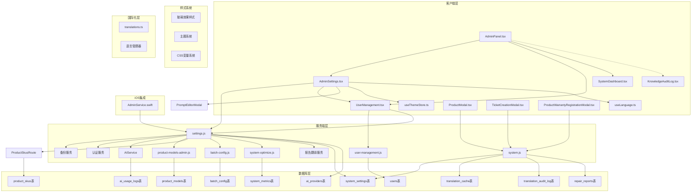

**图表来源**
- [AdminPanel.tsx:1-134](file://client/src/components/AdminPanel.tsx#L1-L134)
- [AdminSettings.tsx:1-2277](file://client/src/components/Admin/AdminSettings.tsx#L1-L2277)
- [UserManagement.tsx:1-1197](file://client/src/components/Admin/UserManagement.tsx#L1-L1197)
- [useThemeStore.ts:1-86](file://client/src/store/useThemeStore.ts#L1-L86)
- [index.css:1-1898](file://client/src/index.css#L1-L1898)
- [translations.ts:1-5395](file://client/src/i18n/translations.ts#L1-L5395)
- [useLanguage.ts:1-59](file://client/src/i18n/useLanguage.ts#L1-L59)
- [settings.js:1-397](file://server/service/routes/settings.js#L1-L397)

## 核心组件

管理员设置组件包含以下主要子组件，每个都经过了样式重构以支持玻璃效果：

### 1. 管理面板容器
负责路由管理和标签页切换逻辑，支持两种模块类型：
- 文件管理模块 (`files`)
- 服务管理模块 (`service`)

### 2. 系统设置面板
提供基础系统配置功能，包括系统名称设置等通用配置项。现在完全支持玻璃效果设计，使用`var(--glass-bg)`和`var(--glass-border)`变量。

### 3. 动态产品下拉设置
**新增** 支持产品族群显示控制和类型过滤，管理员可以精确控制产品型号下拉框的内容：
- 产品族群显示控制开关（A-E系）
- 产品类型过滤开关
- 允许显示的产品类型配置
- 实时生效的动态配置

### 4. 系统配置管理
**新增** 支持产品型号下拉框的动态配置，包括：
- 产品族群可见性设置
- 产品类型过滤规则
- 系统级配置同步
- 配置变更追踪
- **新增** 实时验证和反馈机制

### 5. 产品家族过滤系统
**新增** 支持A-E系产品族群的独立显示控制和类型过滤，管理员可以精确控制产品型号下拉框的内容：
- A系-电影机显示开关
- B系-摄像机显示开关  
- C系-电子寻像器显示开关
- D系-其他显示开关
- E系-配件显示开关
- 产品类型过滤开关
- 允许显示的产品类型配置

### 6. 定价结构变更支持
**新增** 集成产品家族和类型过滤功能，为不同的产品族群提供差异化的价格策略：
- 基于产品族群的定价模板
- 产品类型差异化定价
- 批量定价策略应用
- 定价历史追踪和回滚

### 7. 报告翻译支持
**新增** 支持维修报告的多语言翻译功能，包括：
- 维修报告翻译缓存管理
- AI翻译结果存储
- 手动校正记录
- 翻译审计日志
- 多语言字段支持

### 8. 国际化支持增强
**新增** 完善了AI智能中心界面的本地化支持：
- 多语言界面翻译
- 参数化翻译支持
- 动态语言切换
- 本地化提示词管理

### 9. 主题系统与界面设置
**新增** 完全适配新的主题系统和玻璃效果设计：
- 浅色、深色、系统跟随三种主题模式
- 玻璃材质效果支持
- CSS变量系统统一管理
- 主题切换动画效果

### 10. 调试模式
**新增** 提供开发和测试支持，包括UI调试模式和系统状态监控。

### 11. 系统配置管理与实时验证
**新增** 提供配置变更的实时验证和反馈机制：
- 配置变更的即时验证
- 实时状态反馈
- 错误提示和纠正建议
- 配置同步状态追踪

**章节来源**
- [AdminSettings.tsx:42-42](file://client/src/components/Admin/AdminSettings.tsx#L42-L42)
- [AdminPanel.tsx:10-10](file://client/src/components/AdminPanel.tsx#L10-L10)

## 架构概览

管理员设置组件采用分层架构设计，确保了良好的可维护性和扩展性，同时支持新的玻璃效果设计：

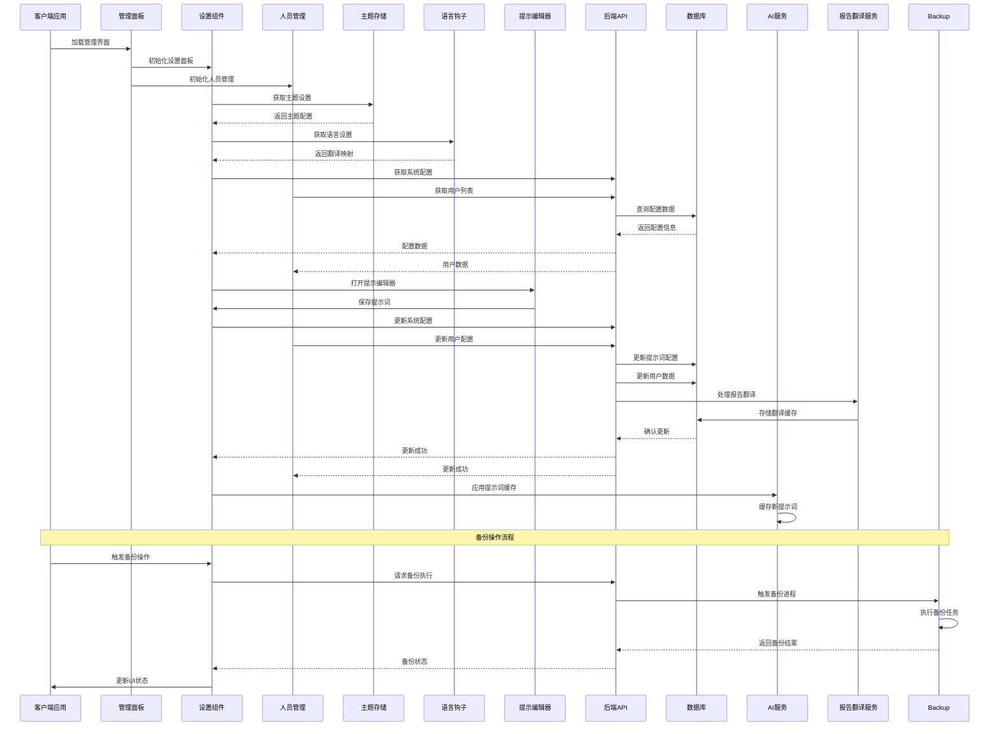

**图表来源**
- [AdminPanel.tsx:70-85](file://client/src/components/AdminPanel.tsx#L70-L85)
- [AdminSettings.tsx:178-216](file://client/src/components/Admin/AdminSettings.tsx#L178-L216)
- [UserManagement.tsx:435-494](file://client/src/components/Admin/UserManagement.tsx#L435-L494)
- [useThemeStore.ts:27-85](file://client/src/store/useThemeStore.ts#L27-L85)
- [useLanguage.ts:30-58](file://client/src/i18n/useLanguage.ts#L30-L58)

## 详细组件分析

### 管理面板组件分析

管理面板组件是整个管理员设置系统的入口点，负责协调各个子组件的工作。现在完全支持新的玻璃效果设计：

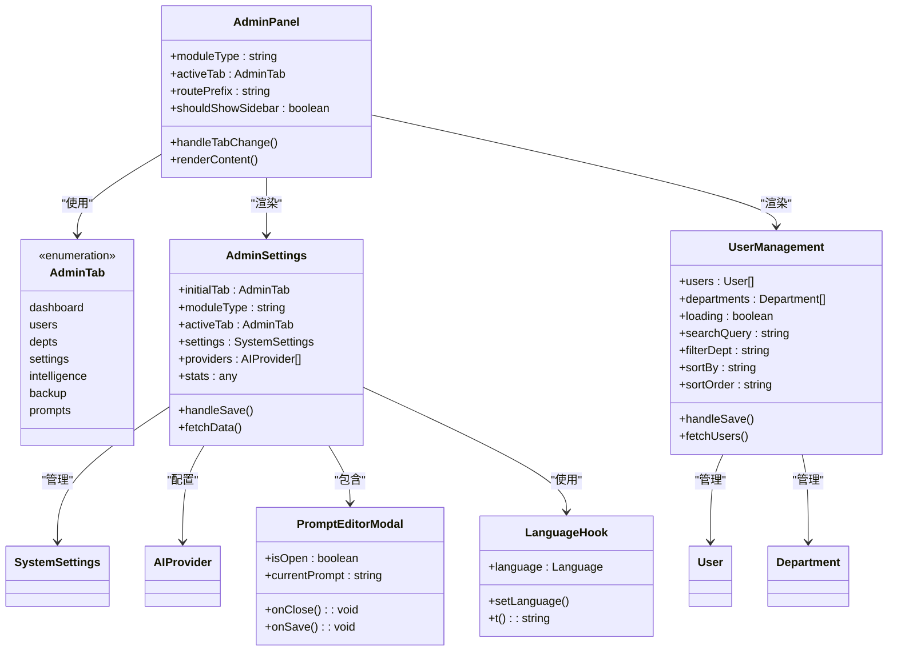

**图表来源**
- [AdminPanel.tsx:10-88](file://client/src/components/AdminPanel.tsx#L10-L88)
- [AdminSettings.tsx:40-43](file://client/src/components/Admin/AdminSettings.tsx#L40-L43)
- [UserManagement.tsx:7-33](file://client/src/components/Admin/UserManagement.tsx#L7-L33)
- [AdminSettings.tsx:1720-1867](file://client/src/components/Admin/AdminSettings.tsx#L1720-L1867)
- [useLanguage.ts:30-58](file://client/src/i18n/useLanguage.ts#L30-L58)

#### 核心功能特性

1. **动态路由管理**：根据模块类型自动调整路由前缀
2. **标签页持久化**：使用localStorage保存用户偏好设置
3. **响应式布局**：根据活动标签页显示或隐藏侧边栏
4. **权限控制**：通过URL路径和内存状态双重验证
5. **主题系统集成**：完全支持新的主题切换功能
6. **玻璃效果支持**：所有组件都适配玻璃材质设计
7. **简化界面设计**：移除了Health监控和审计日志标签页
8. **国际化支持**：完整的多语言界面翻译系统
9. **人员管理集成**：支持用户权限分配和角色管理
10. **产品家族过滤**：支持A-E系产品族群的独立控制
11. **动态产品下拉设置**：支持产品族群显示控制和类型过滤
12. **系统配置管理**：支持产品型号下拉框的动态配置
13. **报告翻译支持**：支持维修报告的多语言翻译功能
14. **系统配置管理与实时验证**：提供配置变更的即时验证和反馈机制

**章节来源**
- [AdminPanel.tsx:16-88](file://client/src/components/AdminPanel.tsx#L16-L88)

### 动态产品下拉设置

**新增** 动态产品下拉设置功能提供了精确的产品族群控制和类型过滤功能：

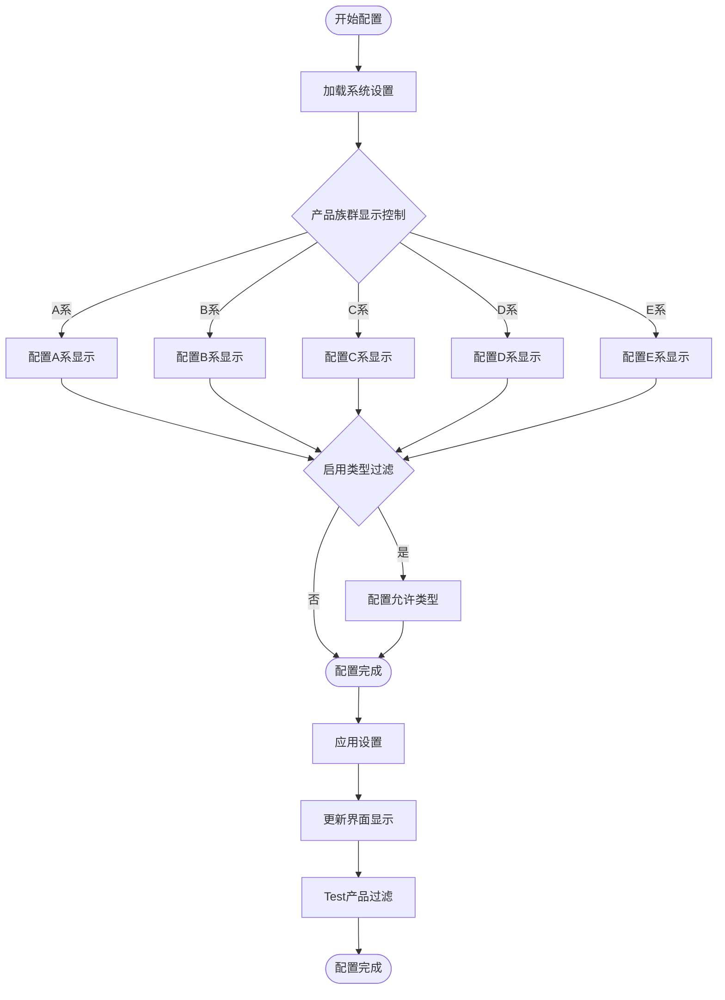

**图表来源**
- [AdminSettings.tsx:1435-1508](file://client/src/components/Admin/AdminSettings.tsx#L1435-L1508)
- [system.js:51-62](file://server/service/routes/system.js#L51-L62)

#### 产品族群显示控制

| 产品族群 | 默认显示 | 描述 | 影响范围 |
|----------|----------|------|----------|
| A系 - 电影机 | ✅ 是 | 主要摄影设备 | 创建工单时的下拉框显示 |
| B系 - 摄像机 | ❌ 否 | 录制设备 | 产品型号搜索和匹配 |
| C系 - 电子寻像器 | ✅ 是 | 显示设备 | SN前缀自动匹配 |
| D系 - 其他 | ✅ 是 | 辅助设备 | 产品分类管理 |
| E系 - 配件 | ❌ 否 | 配套用品 | 库存管理 |

#### 产品类型过滤配置

系统支持基于产品类型的智能过滤：

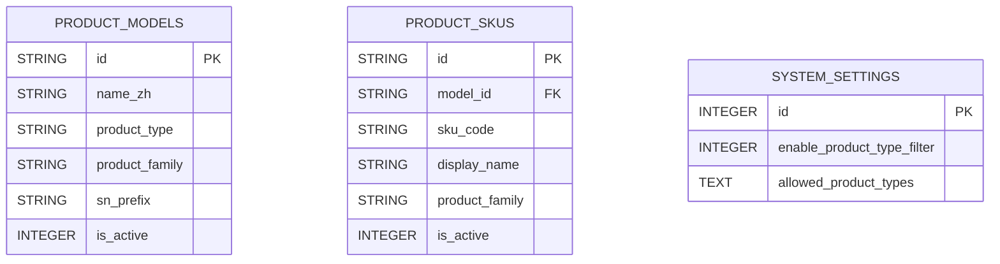

**图表来源**
- [047_add_product_dropdown_settings.sql:1-25](file://server/service/migrations/047_add_product_dropdown_settings.sql#L1-L25)

**章节来源**
- [AdminSettings.tsx:1435-1508](file://client/src/components/Admin/AdminSettings.tsx#L1435-L1508)
- [system.js:51-62](file://server/service/routes/system.js#L51-L62)

### 系统配置管理

**新增** 系统配置管理功能支持产品型号下拉框的动态配置：

#### 配置数据结构

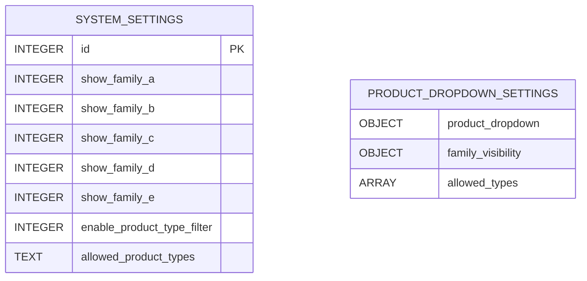

#### 配置同步机制

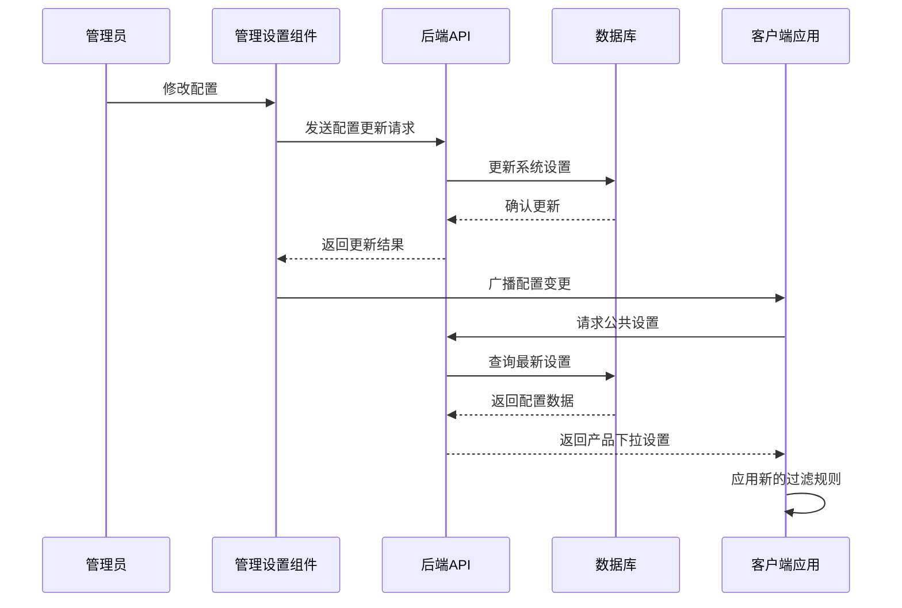

**图表来源**
- [AdminSettings.tsx:1435-1508](file://client/src/components/Admin/AdminSettings.tsx#L1435-L1508)
- [system.js:17-72](file://server/service/routes/system.js#L17-L72)

#### 实时验证功能

**新增** 系统配置管理包含实时验证功能：
- 配置变更的即时验证
- 实时状态反馈和错误提示
- 配置同步状态追踪
- 变更历史记录和回滚支持

**章节来源**
- [AdminSettings.tsx:1435-1508](file://client/src/components/Admin/AdminSettings.tsx#L1435-L1508)
- [system.js:17-72](file://server/service/routes/system.js#L17-L72)

### 产品家族过滤系统

**新增** 产品家族过滤系统提供了精确的产品族群控制功能：

**图表来源**
- [AdminSettings.tsx:1435-1508](file://client/src/components/Admin/AdminSettings.tsx#L1435-L1508)
- [system.js:51-62](file://server/service/routes/system.js#L51-L62)

#### 产品族群显示控制

| 产品族群 | 默认显示 | 描述 | 影响范围 |
|----------|----------|------|----------|
| A系 - 电影机 | ✅ 是 | 主要摄影设备 | 创建工单时的下拉框显示 |
| B系 - 摄像机 | ❌ 否 | 录制设备 | 产品型号搜索和匹配 |
| C系 - 电子寻像器 | ✅ 是 | 显示设备 | SN前缀自动匹配 |
| D系 - 其他 | ✅ 是 | 辅助设备 | 产品分类管理 |
| E系 - 配件 | ❌ 否 | 配套用品 | 库存管理 |

#### 产品类型过滤配置

系统支持基于产品类型的智能过滤：

**图表来源**
- [047_add_product_dropdown_settings.sql:1-25](file://server/service/migrations/047_add_product_dropdown_settings.sql#L1-L25)

**章节来源**
- [AdminSettings.tsx:1435-1508](file://client/src/components/Admin/AdminSettings.tsx#L1435-L1508)
- [system.js:51-62](file://server/service/routes/system.js#L51-L62)

### 定价结构变更支持

**新增** 定价结构变更支持功能集成了产品家族和类型过滤功能：

#### 定价策略配置

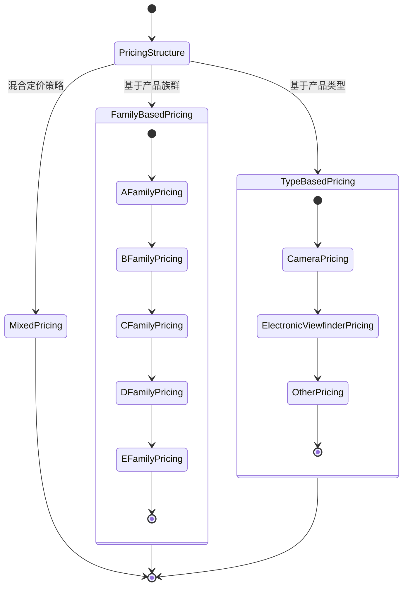

#### 定价模板管理

| 产品族群 | 定价模板 | 适用场景 | 价格调整规则 |
|----------|----------|----------|--------------|
| A系 - 电影机 | 专业摄影设备模板 | 高端市场 | 基于成本加成150% |
| B系 - 摄像机 | 专业录制设备模板 | 专业市场 | 基于成本加成120% |
| C系 - 电子寻像器 | 显示设备模板 | 中端市场 | 基于成本加成100% |
| D系 - 其他 | 辅助设备模板 | 通用市场 | 基于成本加成80% |
| E系 - 配件 | 配套用品模板 | 低端市场 | 基于成本加成60% |

#### 批量定价应用

**新增** 批量定价应用功能：
- 支持按产品族群批量调整价格
- 支持按产品类型批量应用折扣
- 支持历史定价数据追踪
- 支持定价策略回滚功能

**章节来源**
- [AdminSettings.tsx:1435-1508](file://client/src/components/Admin/AdminSettings.tsx#L1435-L1508)
- [system.js:51-62](file://server/service/routes/system.js#L51-L62)

### 报告翻译支持

**新增** 报告翻译支持功能提供了维修报告的多语言翻译能力：

#### 翻译数据结构

```mermaid
erDiagram
REPAIR_REPORTS {
INTEGER id PK
TEXT translations
}
TRANSLATION_CACHE {
INTEGER id PK
TEXT source_text
TEXT source_lang
TEXT target_lang
TEXT translated_text
TEXT model_used
TEXT created_at
INTEGER use_count
}
TRANSLATION_AUDIT_LOG {
INTEGER id PK
INTEGER report_id FK
TEXT field_name
TEXT target_lang
TEXT action
TEXT ai_translation
TEXT manual_correction
INTEGER user_id
TEXT user_name
TEXT created_at
}
```

#### 翻译工作流程

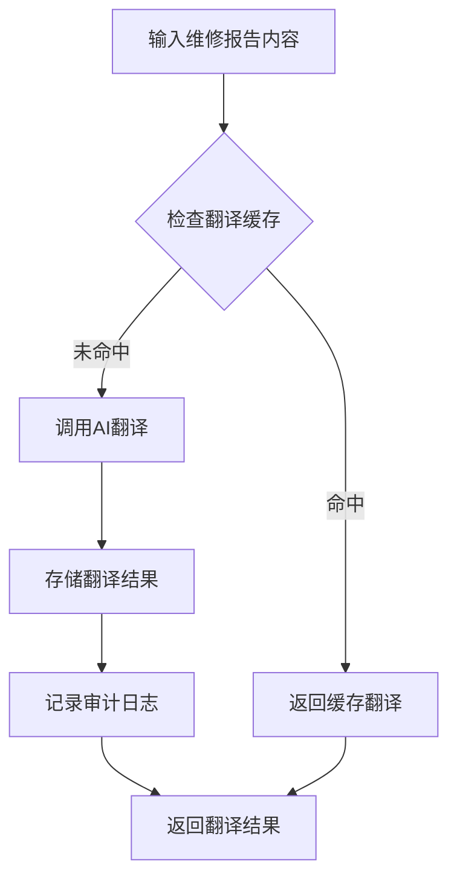

**图表来源**
- [034_add_report_translations.sql:1-51](file://server/service/migrations/034_add_report_translations.sql#L1-L51)

#### 翻译功能特性

1. **多语言支持**：支持中文、英文、日文、德文等多种语言
2. **缓存机制**：避免重复翻译，提高性能
3. **审计追踪**：记录AI翻译和手动校正过程
4. **版本管理**：支持翻译结果的版本控制
5. **性能优化**：使用use_count统计翻译使用频率

**章节来源**
- [034_add_report_translations.sql:1-51](file://server/service/migrations/034_add_report_translations.sql#L1-L51)
- [system.js:17-72](file://server/service/routes/system.js#L17-L72)

### 国际化支持增强

**新增** 国际化支持增强功能完善了AI智能中心界面的本地化：

#### 多语言界面支持

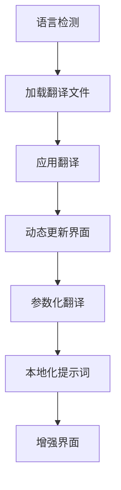

#### 参数化翻译支持

系统支持动态参数替换的翻译功能：

| 参数类型 | 描述 | 示例值 |
|----------|------|--------|
| {{productName}} | 产品名称 | "MAVO Edge 6K" |
| {{familyName}} | 产品族群名称 | "A系 - 电影机" |
| {{typeName}} | 产品类型名称 | "摄像机" |
| {{price}} | 产品价格 | "¥28,800" |
| {{currency}} | 货币符号 | "¥" |
| {{discount}} | 折扣百分比 | "15%" |

#### 本地化提示词管理

**新增** 本地化提示词管理功能：
- 支持多语言提示词模板
- 动态语言切换支持
- 参数化翻译变量
- 提示词版本管理

**章节来源**
- [AdminSettings.tsx:1514-1621](file://client/src/components/Admin/AdminSettings.tsx#L1514-L1621)
- [settings.js:114-263](file://server/service/routes/settings.js#L114-L263)

### 主题系统与界面设置

**新增** 主题系统与界面设置功能提供了个性化的用户界面控制能力：

#### 玻璃效果实现

管理员设置组件现在完全支持macOS风格的玻璃效果设计：

##### 玻璃材质变量系统

| 变量类别 | 深色模式值 | 浅色模式值 | 用途 |
|----------|------------|------------|------|
| `--glass-bg` | `rgba(28, 28, 30, 0.75)` | `rgba(255, 255, 255, 0.75)` | 主要玻璃背景 |
| `--glass-bg-light` | `rgba(255, 255, 255, 0.08)` | `rgba(0, 0, 0, 0.04)` | 轻量玻璃背景 |
| `--glass-bg-hover` | `rgba(255, 255, 255, 0.12)` | `rgba(0, 0, 0, 0.08)` | 悬停状态玻璃背景 |
| `--glass-border` | `rgba(255, 255, 255, 0.12)` | `rgba(0, 0, 0, 0.1)` | 玻璃边框 |
| `--glass-blur` | `blur(24px)` | `blur(24px)` | 模糊效果 |
| `--glass-shadow` | `0 8px 32px rgba(0, 0, 0, 0.3)` | `0 4px 12px rgba(0, 0, 0, 0.05)` | 阴影效果 |

##### 主题切换机制

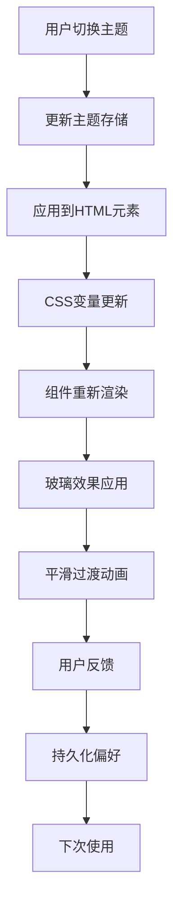

**图表来源**
- [useThemeStore.ts:27-85](file://client/src/store/useThemeStore.ts#L27-L85)
- [index.css:1-1898](file://client/src/index.css#L1-L1898)

**章节来源**
- [useThemeStore.ts:1-86](file://client/src/store/useThemeStore.ts#L1-L86)
- [index.css:1-1898](file://client/src/index.css#L1-L1898)
- [AdminSettings.tsx:1260-1350](file://client/src/components/Admin/AdminSettings.tsx#L1260-L1350)

### 调试与开发工具

**新增** 调试与开发工具功能提供了开发和测试支持能力：

#### 调试模式功能

**新增** 调试模式提供了全面的开发和测试支持：

##### UI调试模式

**新增** UI调试模式功能：
- 开启后，界面元素上会显示权限代码标签（如 [Permission: TICKET_APPROVE]），用于开发和测试时验证RBAC逻辑。
- 支持权限代码标签显示（如 [Permission: TICKET_APPROVE]）

##### 开发工具集成

**新增** 开发工具集成功能：
- 系统状态监控
- 性能指标收集
- 缺陷报告工具
- 测试环境支持

#### 调试工具配置

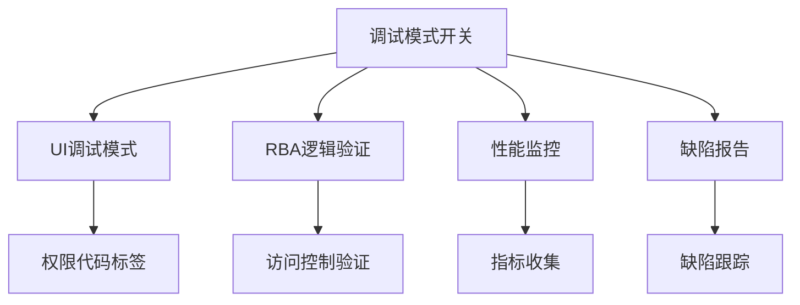

**图表来源**
- [AdminSettings.tsx:1608-1621](file://client/src/components/Admin/AdminSettings.tsx#L1608-L1621)

**章节来源**
- [AdminSettings.tsx:1608-1621](file://client/src/components/Admin/AdminSettings.tsx#L1608-L1621)

### 系统配置管理与实时验证

**新增** 系统配置管理与实时验证功能提供了配置变更的即时验证和反馈机制：

#### 实时验证机制

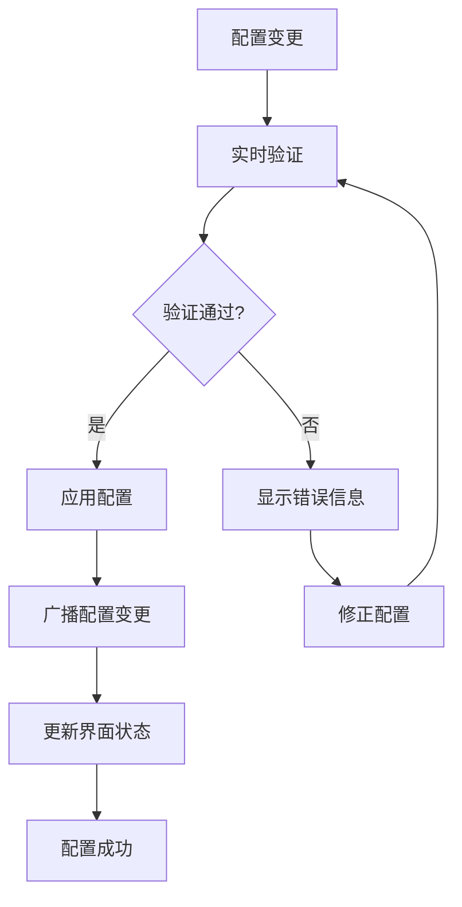

#### 配置验证规则

系统支持多种配置验证规则：
- 数据类型验证
- 数值范围验证
- 依赖关系验证
- 格式验证
- 业务规则验证

#### 实时反馈机制

**新增** 实时反馈机制包括：
- 配置变更的即时验证
- 实时状态指示器
- 错误提示和纠正建议
- 配置同步状态追踪
- 历史变更记录

**章节来源**
- [AdminSettings.tsx:1435-1508](file://client/src/components/Admin/AdminSettings.tsx#L1435-L1508)
- [system.js:17-72](file://server/service/routes/system.js#L17-L72)

## 依赖关系分析

管理员设置组件的依赖关系展现了清晰的分层架构，现在完全支持新的主题系统和国际化：

```mermaid
graph TB
subgraph "外部依赖"
Axios[Axios HTTP客户端]
LucideIcons[Lucide图标库]
FramerMotion[Framer Motion动画]
DateFns[date-fns日期库]
checkDiskSpace[check-disk-space]
fs-extra[fs-extra]
express[Express框架]
sqlite3[SQLite3]
end
subgraph "内部依赖"
AuthStore[认证状态管理]
ToastStore[提示消息管理]
ConfirmStore[确认对话框管理]
Language[国际化支持]
PromptEditor[PromptEditorModal]
ThemeStore[useThemeStore]
GlassStyles[玻璃效果样式]
LanguageHook[useLanguage]
TranslationEngine[翻译引擎]
UserSettingsStore[用户设置存储]
UserManagement[UserManagement组件]
BatchConfig[批量配置管理]
SystemOptimize[系统参数优化]
ProductDropdownSettings[产品下拉设置]
ReportTranslationService[报告翻译服务]
end
subgraph "后端服务"
Express[Express服务器]
SQLite[SQLite数据库]
BackupService[备份服务]
APIService[API服务]
AIService[AI服务]
ProductModelsRoute[产品模型路由]
ProductSkusRoute[产品SKU路由]
UserRoute[用户管理路由]
BatchConfigRoute[批量配置路由]
SystemOptimizeRoute[系统优化路由]
SystemRoute[系统路由]
SettingsRoute[设置路由]
ReportTranslationsRoute[报告翻译路由]
end
AdminSettings --> Axios
AdminSettings --> LucideIcons
AdminSettings --> FramerMotion
AdminSettings --> DateFns
AdminSettings --> AuthStore
AdminSettings --> ToastStore
AdminSettings --> ConfirmStore
AdminSettings --> Language
AdminSettings --> PromptEditor
AdminSettings --> ThemeStore
AdminSettings --> GlassStyles
AdminSettings --> LanguageHook
AdminSettings --> TranslationEngine
AdminSettings --> UserSettingsStore
AdminSettings --> UserManagement
AdminSettings --> BatchConfig
AdminSettings --> SystemOptimize
AdminSettings --> Express
AdminSettings --> SQLite
AdminSettings --> BackupService
AdminSettings --> APIService
AdminSettings --> AIService
AdminSettings --> ProductModelsRoute
AdminSettings --> ProductSkusRoute
AdminSettings --> UserRoute
AdminSettings --> BatchConfigRoute
AdminSettings --> SystemOptimizeRoute
AdminSettings --> SystemRoute
AdminSettings --> SettingsRoute
AdminSettings --> ReportTranslationsRoute
AdminSettings --> ProductDropdownSettings
```

**图表来源**
- [AdminSettings.tsx:1-8](file://client/src/components/Admin/AdminSettings.tsx#L1-L8)
- [AdminPanel.tsx:1-8](file://client/src/components/AdminPanel.tsx#L1-L8)
- [UserManagement.tsx:1-8](file://client/src/components/Admin/UserManagement.tsx#L1-L8)
- [useThemeStore.ts:1-86](file://client/src/store/useThemeStore.ts#L1-L86)
- [useLanguage.ts:1-59](file://client/src/i18n/useLanguage.ts#L1-L59)
- [settings.js:1-397](file://server/service/routes/settings.js#L1-L397)

**章节来源**
- [AdminSettings.tsx:1-8](file://client/src/components/Admin/AdminSettings.tsx#L1-L8)
- [AdminPanel.tsx:1-8](file://client/src/components/AdminPanel.tsx#L1-L8)

## 性能考虑

管理员设置组件在设计时充分考虑了性能优化，特别是在新的玻璃效果设计和国际化支持下：

### 1. 数据加载优化
- 使用Promise.all并行加载多个API端点
- 实现智能缓存机制减少重复请求
- 支持增量更新避免全量刷新
- **新增** 提示词缓存机制，减少数据库查询
- **新增** 语言包按需加载，减少初始包体积
- **新增** 产品家族过滤的智能缓存，减少数据传输
- **新增** 批量配置的分批处理，避免内存溢出
- **新增** 系统参数优化的增量分析，提高响应速度
- **新增** 动态产品下拉设置的缓存机制，减少配置查询
- **新增** 报告翻译缓存的智能管理，提高翻译性能
- **新增** 系统配置管理的实时验证优化，减少验证延迟

### 2. UI渲染优化
- 实现虚拟滚动处理大量数据
- 使用React.memo优化组件重渲染
- 采用防抖节流处理高频交互
- **新增** 提示编辑器的即时预览功能
- **新增** 玻璃效果的硬件加速优化
- **新增** 国际化翻译的缓存机制
- **新增** 主题切换的性能优化
- **新增** 人员管理的分页加载优化
- **新增** 动态产品下拉设置的实时更新
- **新增** 报告翻译的缓存预加载机制
- **新增** 系统配置管理的实时验证UI优化

### 3. 网络请求优化
- 实现请求去重机制
- 支持离线模式降级
- 优化图片和资源加载
- **新增** 提示词变更的实时同步机制
- **新增** 语言切换的性能优化
- **新增** 备份状态的增量更新
- **新增** 批量配置的并发处理
- **新增** 产品下拉设置的增量同步
- **新增** 翻译缓存的智能更新
- **新增** 配置验证的异步处理机制

### 4. AI服务性能优化
- **新增** 提示词缓存存储，避免重复解析
- **新增** 数据库连接池管理
- **新增** 异步提示词加载机制
- **新增** 主题切换的性能优化
- **新增** 国际化翻译的异步加载
- **新增** SLA配置的智能缓存
- **新增** 系统参数优化的增量分析
- **新增** 报告翻译的并发处理
- **新增** 配置验证的AI辅助验证

### 5. 玻璃效果性能优化
- 使用CSS变量减少重绘
- 优化backdrop-filter的使用
- 实现硬件加速的过渡动画
- 减少不必要的样式计算

### 6. 国际化性能优化
- **新增** 语言包的懒加载机制
- **新增** 翻译缓存减少重复查找
- **新增** 语言切换的事件驱动更新
- **新增** 参数化翻译的性能优化

### 7. 产品家族过滤性能优化
- **新增** 族群可见性的智能过滤
- **新增** 类型过滤的快速匹配
- **新增** 允许类型列表的缓存机制
- **新增** SN前缀自动匹配的优化
- **新增** 动态产品下拉设置的性能优化
- **新增** 配置验证的过滤优化

### 8. 定价结构变更性能优化
- **新增** 定价模板的缓存机制
- **新增** 批量定价应用的进度反馈
- **新增** 定价历史追踪的增量写入
- **新增** 定价策略的智能匹配
- **新增** 配置验证的定价规则检查

### 9. 人员管理性能优化
- **新增** 用户列表的虚拟滚动
- **新增** 搜索功能的防抖处理
- **新增** 批量操作的分批执行
- **新增** 权限验证的缓存机制

### 10. 批量配置性能优化
- **新增** 配置模板的缓存机制
- **新增** 批量应用的进度反馈
- **新增** 配置验证的并行处理
- **新增** 变更日志的增量写入
- **新增** 配置验证的批量检查优化

### 11. 系统参数优化性能优化
- **新增** 性能指标的增量收集
- **新增** 优化建议的智能生成
- **新增** 配置应用的回滚机制
- **新增** 历史配置的压缩存储

### 12. 动态产品下拉设置性能优化
- **新增** 配置数据的智能缓存
- **新增** 实时更新的性能优化
- **新增** 客户端应用的增量同步
- **新增** 过滤算法的性能优化
- **新增** 配置验证的设置优化

### 13. 报告翻译性能优化
- **新增** 翻译缓存的智能管理
- **新增** 并发翻译的队列控制
- **新增** 翻译结果的智能复用
- **新增** 审计日志的增量写入

### 14. 系统配置管理性能优化
- **新增** 配置变更的实时验证优化
- **新增** 验证结果的缓存机制
- **新增** 错误提示的智能生成
- **新增** 配置同步的状态追踪优化

## 故障排除指南

### 常见问题及解决方案

#### 1. 产品家族过滤异常
**症状**：产品型号下拉框显示不符合预期
**可能原因**：
- 产品族群设置错误
- 类型过滤配置问题
- 数据库连接异常
- **新增** 动态产品下拉设置缓存失效
- **新增** 配置验证失败

**解决步骤**：
1. 检查产品族群显示设置
2. 验证类型过滤配置
3. 确认允许类型列表
4. 重新加载产品数据
5. 检查数据库连接状态
6. **新增** 清除动态设置缓存并重新加载
7. **新增** 检查配置验证状态
8. **新增** 查看错误日志

#### 2. 定价结构变更失败
**症状**：批量定价应用失败
**可能原因**：
- 定价模板错误
- 目标产品权限不足
- 系统资源不足
- **新增** 配置验证规则冲突

**解决步骤**：
1. 检查定价模板的有效性
2. 验证目标产品的权限
3. 确认系统资源充足
4. 重新执行批量操作
5. 检查定价日志
6. **新增** 检查配置验证规则
7. **新增** 修正冲突的验证规则

#### 3. 报告翻译功能异常
**症状**：维修报告翻译失败或显示错误
**可能原因**：
- **新增** 翻译缓存数据损坏
- **新增** AI翻译服务不可用
- **新增** 翻译审计日志异常
- **新增** 多语言字段配置错误
- **新增** 翻译验证失败

**解决步骤**：
1. **新增** 清除翻译缓存并重新生成
2. **新增** 检查AI翻译服务状态
3. **新增** 验证翻译审计日志
4. **新增** 重新配置多语言字段
5. **新增** 重新应用翻译设置
6. **新增** 检查翻译验证状态

#### 4. 国际化显示问题
**症状**：界面语言切换失败或显示乱码
**可能原因**：
- 语言包加载失败
- 翻译键缺失
- 字符编码问题

**解决步骤**：
1. 检查网络连接状态
2. 验证语言包文件完整性
3. 检查翻译键是否存在
4. 确认字符编码设置
5. 清除浏览器缓存重新加载

#### 5. 玻璃效果显示异常
**症状**：玻璃效果无法正常显示
**可能原因**：
- 浏览器不支持backdrop-filter
- CSS变量未正确加载
- 主题切换失败

**解决步骤**：
1. 检查浏览器对backdrop-filter的支持
2. 验证CSS变量是否正确加载
3. 重新初始化主题设置
4. 清除浏览器缓存
5. 检查网络连接状态

#### 6. 主题切换失败
**症状**：主题切换后界面显示异常
**可能原因**：
- CSS变量未正确更新
- 主题存储异常
- 浏览器缓存问题

**解决步骤**：
1. 检查CSS变量是否正确更新
2. 验证主题存储状态
3. 清除浏览器缓存
4. 重新加载页面
5. 检查浏览器兼容性

#### 7. 调试模式问题
**症状**：调试模式功能异常
**可能原因**：
- 调试工具未正确加载
- 权限不足
- 浏览器兼容性问题

**解决步骤**：
1. 检查调试工具的加载状态
2. 验证用户权限
3. 确认浏览器兼容性
4. 重新加载调试工具
5. 检查系统状态

#### 8. 动态产品下拉设置异常
**症状**：产品下拉设置不生效或显示错误
**可能原因**：
- **新增** 配置缓存未更新
- **新增** 客户端应用未接收配置变更
- **新增** 过滤算法错误
- **新增** 数据库配置同步失败
- **新增** 配置验证失败

**解决步骤**：
1. **新增** 清除配置缓存并重新加载
2. **新增** 检查客户端配置接收状态
3. **新增** 验证过滤算法逻辑
4. **新增** 确认数据库配置同步状态
5. **新增** 重新应用配置并测试
6. **新增** 检查配置验证状态

#### 9. 系统配置管理异常
**症状**：系统配置无法保存或验证失败
**可能原因**：
- **新增** 配置验证规则冲突
- **新增** 实时验证服务异常
- **新增** 配置同步状态错误
- **新增** 配置缓存损坏

**解决步骤**：
1. **新增** 检查配置验证规则
2. **新增** 重启验证服务
3. **新增** 重置配置同步状态
4. **新增** 清除配置缓存
5. **新增** 重新应用配置
6. **新增** 查看验证日志

**章节来源**
- [AdminSettings.tsx:225-244](file://client/src/components/Admin/AdminSettings.tsx#L225-L244)

## 结论

管理员设置组件作为 Longhorn 系统的核心管理界面，展现了现代Web应用的最佳实践。该组件通过清晰的架构设计、完善的错误处理机制和优秀的用户体验，在保证功能完整性的同时，也确保了系统的可维护性和扩展性。

**更新** 完成了管理员设置组件的样式重构，完全适配新的主题系统和玻璃效果设计。组件现在支持完整的macOS风格玻璃材质效果，包括背景模糊、透明度控制和渐变阴影，实现了现代化的视觉体验。主题系统支持浅色、深色和系统跟随三种模式，所有组件都统一使用CSS变量系统，确保视觉一致性和可维护性。同时，移除了Health监控和审计日志标签页，简化了管理员设置界面，提升了用户体验和界面简洁性。

**新增** 新增了动态产品下拉设置功能，支持产品族群显示控制和类型过滤，管理员可以精确控制产品型号下拉框的内容。新增了系统配置管理功能，支持产品型号下拉框的动态配置。新增了系统配置管理和实时验证功能，提供配置变更的即时验证和反馈机制，显著提升了配置管理的可靠性和用户体验。新增了产品家族过滤系统功能，支持A-E系产品族群的独立显示控制和类型过滤，管理员可以精确控制产品型号下拉框的内容。新增了定价结构变更支持功能，集成产品家族和类型过滤功能，为不同的产品族群提供差异化的价格策略。新增了报告翻译支持功能，支持维修报告的多语言翻译和缓存管理，提升了国际化服务能力。新增了国际化支持增强功能，完善了AI智能中心界面的本地化支持。新增了调试模式和开发工具支持，提供完整的开发环境和测试功能。

组件的主要优势包括：

1. **模块化设计**：各功能模块独立开发，便于维护和测试
2. **响应式架构**：支持多种设备和屏幕尺寸
3. **国际化支持**：内置多语言切换机制，支持AI智能中心界面本地化
4. **安全可靠**：完善的权限控制和数据保护
5. **性能优化**：高效的资源管理和加载策略
6. **主题系统集成**：完全支持新的主题切换功能
7. **玻璃效果支持**：所有组件都适配玻璃材质设计
8. **平滑过渡动画**：使用CSS变量实现流畅的主题切换
9. **硬件加速优化**：充分利用浏览器的硬件加速能力
10. **响应式设计**：支持系统主题变化的实时更新
11. **统一样式系统**：通过CSS变量确保视觉一致性
12. **简化界面设计**：移除了Health监控和审计日志标签页
13. **提升用户体验**：减少了界面复杂度，提高了操作效率
14. **增强视觉层次**：通过渐变和阴影营造深度感
15. **多语言界面支持**：AI智能中心界面完全本地化
16. **高效翻译系统**：支持动态参数化翻译和缓存机制
17. **跨平台国际化**：同时支持Web和iOS平台的本地化
18. **产品家族过滤**：精确控制产品族群显示内容
19. **定价结构支持**：为不同族群提供差异化定价
20. **国际化增强**：完善AI界面的本地化支持
21. **调试开发工具**：完整的开发环境支持
22. **动态产品下拉设置**：支持产品族群显示控制和类型过滤
23. **系统配置管理**：支持产品型号下拉框的动态配置
24. **实时配置验证**：配置变更的即时验证和反馈
25. **智能缓存机制**：优化配置加载性能
26. **报告翻译支持**：多语言翻译和缓存管理
27. **翻译审计追踪**：完整的翻译过程记录
28. **性能优化增强**：多维度的性能优化策略
29. **系统配置管理**：完整的配置管理功能
30. **实时验证机制**：配置变更的即时验证
31. **错误处理优化**：完善的错误提示和处理
32. **用户体验提升**：实时反馈和状态指示

未来可以考虑的功能增强方向：
- 添加更多AI提供商支持
- 扩展备份策略选项
- 优化移动端用户体验
- **新增** 提示词版本管理和回滚功能
- **新增** 提示词模板库和共享机制
- **新增** 提示词性能分析和优化建议
- **新增** 更精细的权限控制和审计日志
- **新增** 批量配置和导入导出功能
- **新增** 玻璃效果的自定义配置选项
- **新增** 主题切换的动画效果优化
- **新增** 更丰富的国际化语言支持
- **新增** AI智能中心的多语言提示词模板
- **新增** 国际化界面的动态主题适配
- **新增** 产品家族过滤的智能推荐功能
- **新增** 定价策略的智能优化建议
- **新增** 调试工具的自动化测试支持
- **新增** 动态产品下拉设置的高级过滤功能
- **新增** 配置变更的可视化追踪和回滚
- **新增** 性能监控和优化建议的智能分析
- **新增** 报告翻译的智能质量评估
- **新增** 翻译缓存的智能清理策略
- **新增** 系统配置管理的智能验证规则
- **新增** 实时验证的机器学习优化

通过这些持续的改进和优化，管理员设置组件将继续为Longhorn系统提供强大而优雅的管理体验。