# 管理员设置组件

<cite>
**本文档引用的文件**
- [AdminSettings.tsx](file://client/src/components/Admin/AdminSettings.tsx)
- [AdminPanel.tsx](file://client/src/components/AdminPanel.tsx)
- [useThemeStore.ts](file://client/src/store/useThemeStore.ts)
- [index.css](file://client/src/index.css)
- [KnowledgeAuditLog.tsx](file://client/src/components/KnowledgeAuditLog.tsx)
- [translations.ts](file://client/src/i18n/translations.ts)
- [useLanguage.ts](file://client/src/i18n/useLanguage.ts)
</cite>

## 更新摘要
**所做更改**
- 移除了Health监控和审计日志标签页，简化了管理员设置界面
- 完成管理员设置组件样式重构，完全适配新的主题系统和玻璃效果设计
- 新增完整的玻璃材质效果支持，包括背景模糊、透明度和阴影系统
- 实现响应式主题切换，支持浅色、深色和系统跟随模式
- 优化组件间样式一致性，统一使用CSS变量系统
- 增强视觉层次感，通过渐变和阴影营造深度感
- 完善交互反馈，包括悬停效果和过渡动画
- **新增** 增强了AI智能中心管理界面的国际化支持
- **新增** 新增了AI提供商配置和全局策略设置的多语言支持
- **新增** 支持中、英、德、日四种语言的完整界面翻译

## 目录
1. [简介](#简介)
2. [项目结构](#项目结构)
3. [核心组件](#核心组件)
4. [架构概览](#架构概览)
5. [详细组件分析](#详细组件分析)
6. [主题系统与玻璃效果](#主题系统与玻璃效果)
7. [AI提示管理系统](#ai提示管理系统)
8. [国际化支持增强](#国际化支持增强)
9. [依赖关系分析](#依赖关系分析)
10. [性能考虑](#性能考虑)
11. [故障排除指南](#故障排除指南)
12. [结论](#结论)

## 简介

管理员设置组件是 Longhorn 文件管理系统中的核心管理界面，为系统管理员提供统一的配置管理和监控功能。该组件采用了全新的样式重构，完全适配了现代化的主题系统和玻璃效果设计，为不同类型的用户（文件管理模块和服务模块）提供定制化的管理体验。

**更新** 完成了管理员设置组件的样式重构，完全适配新的主题系统和玻璃效果设计。组件现在支持完整的玻璃材质效果，包括背景模糊、透明度控制和渐变阴影，实现了macOS风格的视觉体验。主题系统支持浅色、深色和系统跟随三种模式，所有组件都统一使用CSS变量系统，确保视觉一致性和可维护性。同时，移除了Health监控和审计日志标签页，简化了管理员设置界面，提升了用户体验。

**新增** 增强了AI智能中心管理界面的国际化支持，现在支持中、英、德、日四种语言的完整界面翻译。新增了AI提供商配置和全局策略设置的多语言支持，为不同地区的用户提供本地化的管理体验。

## 项目结构

Longhorn 项目的管理员设置组件分布在多个层次中，采用了模块化的架构设计：

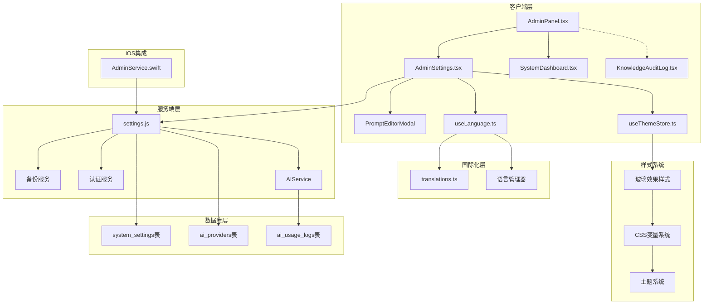

**图表来源**
- [AdminPanel.tsx](file://client/src/components/AdminPanel.tsx#L1-L134)
- [AdminSettings.tsx](file://client/src/components/Admin/AdminSettings.tsx#L1-L1975)
- [useThemeStore.ts](file://client/src/store/useThemeStore.ts#L1-L86)
- [index.css](file://client/src/index.css#L1-L1898)
- [translations.ts](file://client/src/i18n/translations.ts#L1-L5395)
- [useLanguage.ts](file://client/src/i18n/useLanguage.ts#L1-L59)

## 核心组件

管理员设置组件包含以下主要子组件，每个都经过了样式重构以支持玻璃效果：

### 1. 管理面板容器
负责路由管理和标签页切换逻辑，支持两种模块类型：
- 文件管理模块 (`files`)
- 服务管理模块 (`service`)

### 2. 系统设置面板
提供基础系统配置功能，包括系统名称设置等通用配置项。现在完全支持玻璃效果设计，使用`var(--glass-bg)`和`var(--glass-border)`变量。

### 3. AI智能体管理
支持多提供商AI配置，包括：
- API密钥管理
- 模型参数配置
- 访问权限控制
- 预设模型模板
- **新增** 提示词管理系统
- **新增** 国际化界面支持

### 4. 备份管理
完整的备份解决方案，包括：
- 主备份（SSD存储）
- 次级备份（系统盘存储）
- 自动备份调度
- 手动备份触发
- 备份恢复功能

### 5. **已移除** Health监控标签页
Health监控标签页已被移除，简化了管理员设置界面。

### 6. **已移除** 审计日志标签页
审计日志标签页已被移除，不再提供知识库操作审计功能。

**章节来源**
- [AdminSettings.tsx](file://client/src/components/Admin/AdminSettings.tsx#L42-L42)
- [AdminPanel.tsx](file://client/src/components/AdminPanel.tsx#L10-L10)

## 架构概览

管理员设置组件采用分层架构设计，确保了良好的可维护性和扩展性，同时支持新的玻璃效果设计：

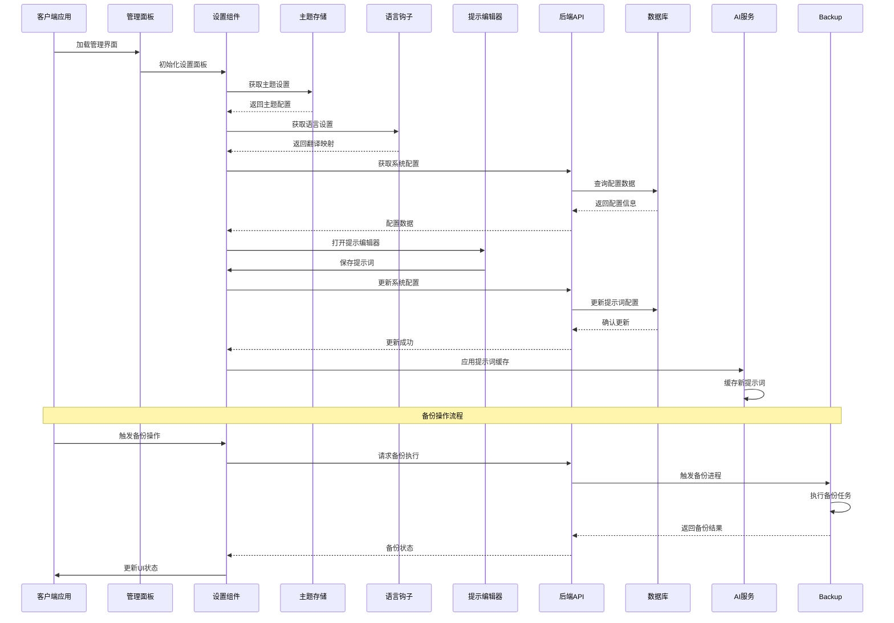

**图表来源**
- [AdminPanel.tsx](file://client/src/components/AdminPanel.tsx#L70-L85)
- [AdminSettings.tsx](file://client/src/components/Admin/AdminSettings.tsx#L178-L216)
- [useThemeStore.ts](file://client/src/store/useThemeStore.ts#L27-L85)
- [useLanguage.ts](file://client/src/i18n/useLanguage.ts#L30-L58)

## 详细组件分析

### 管理面板组件分析

管理面板组件是整个管理员设置系统的入口点，负责协调各个子组件的工作。现在完全支持新的玻璃效果设计：

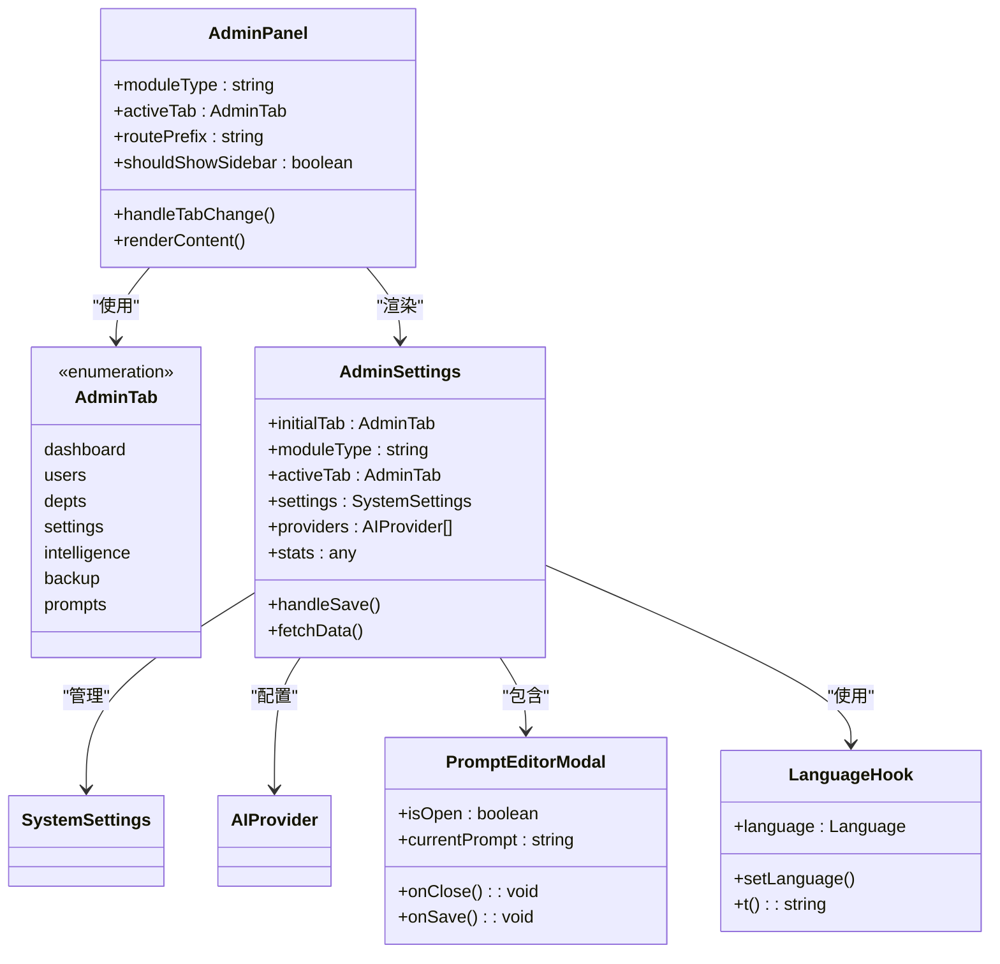

**图表来源**
- [AdminPanel.tsx](file://client/src/components/AdminPanel.tsx#L10-L88)
- [AdminSettings.tsx](file://client/src/components/Admin/AdminSettings.tsx#L40-L43)
- [AdminSettings.tsx](file://client/src/components/Admin/AdminSettings.tsx#L1720-L1867)
- [useLanguage.ts](file://client/src/i18n/useLanguage.ts#L30-L58)

#### 核心功能特性

1. **动态路由管理**：根据模块类型自动调整路由前缀
2. **标签页持久化**：使用localStorage保存用户偏好设置
3. **响应式布局**：根据活动标签页显示或隐藏侧边栏
4. **权限控制**：通过URL路径和内存状态双重验证
5. **主题系统集成**：完全支持新的主题切换功能
6. **玻璃效果支持**：所有组件都适配玻璃材质设计
7. **简化界面设计**：移除了Health监控和审计日志标签页
8. **国际化支持**：完整的多语言界面翻译系统

**章节来源**
- [AdminPanel.tsx](file://client/src/components/AdminPanel.tsx#L16-L88)

### AI智能体管理组件

AI智能体管理组件提供了完整的多提供商AI配置解决方案，现在完全支持玻璃效果设计：

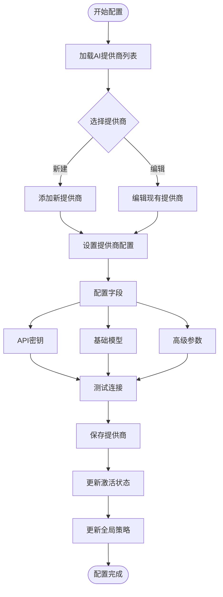

**图表来源**
- [AdminSettings.tsx](file://client/src/components/Admin/AdminSettings.tsx#L281-L315)
- [AdminSettings.tsx](file://client/src/components/Admin/AdminSettings.tsx#L357-L369)

#### 预设模型配置

组件内置了多种知名AI提供商的预设配置：

| 提供商 | 支持模型类型 | 预设模型数量 |
|--------|-------------|-------------|
| DeepSeek | Chat, Reasoner, Vision | 2个 |
| Gemini | Chat, Reasoner, Vision | 15个 |
| OpenAI | Chat, Reasoner, Vision | 3个 |

**章节来源**
- [AdminSettings.tsx](file://client/src/components/Admin/AdminSettings.tsx#L45-L89)

### 备份管理组件

备份管理组件提供了企业级的数据保护解决方案，现在完全适配玻璃效果设计：

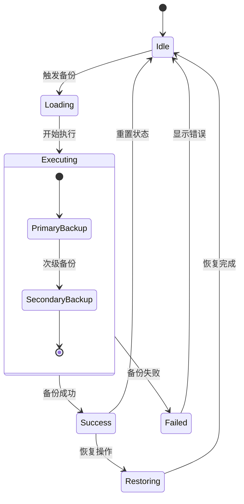

**图表来源**
- [AdminSettings.tsx](file://client/src/components/Admin/AdminSettings.tsx#L317-L355)
- [AdminSettings.tsx](file://client/src/components/Admin/AdminSettings.tsx#L1286-L1298)

#### 备份策略配置

| 备份类型 | 存储位置 | 默认频率 | 默认保留期 | 特殊说明 |
|----------|----------|----------|------------|----------|
| 主备份 | SSD存储 | 24小时 | 7天 | 日常快速恢复 |
| 次级备份 | 系统盘 | 72小时 | 30天 | 故障时恢复 |

**章节来源**
- [AdminSettings.tsx](file://client/src/components/Admin/AdminSettings.tsx#L694-L1051)

### **已移除** Health监控组件

Health监控组件已被移除，不再提供实时的系统状态可视化功能。

### **已移除** 审计日志组件

审计日志组件已被移除，不再提供知识库操作审计功能。

## 主题系统与玻璃效果

**新增** 管理员设置组件完全适配了新的主题系统和玻璃效果设计，实现了现代化的视觉体验。

### 主题系统架构

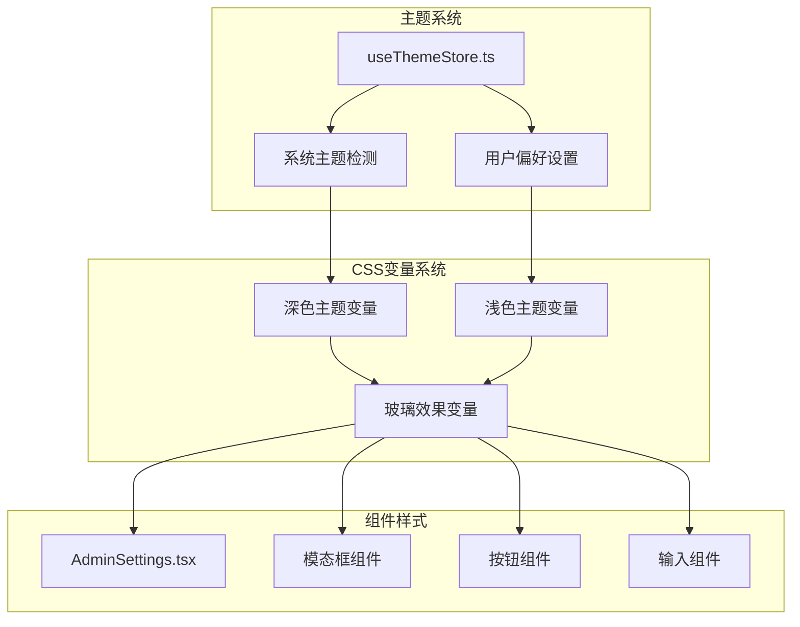

**图表来源**
- [useThemeStore.ts](file://client/src/store/useThemeStore.ts#L1-L86)
- [index.css](file://client/src/index.css#L1-L1898)
- [AdminSettings.tsx](file://client/src/components/Admin/AdminSettings.tsx#L1-L1975)

### 玻璃效果实现

管理员设置组件现在完全支持macOS风格的玻璃效果设计：

#### 玻璃材质变量系统

| 变量类别 | 深色模式值 | 浅色模式值 | 用途 |
|----------|------------|------------|------|
| `--glass-bg` | `rgba(28, 28, 30, 0.75)` | `rgba(255, 255, 255, 0.75)` | 主要玻璃背景 |
| `--glass-bg-light` | `rgba(255, 255, 255, 0.08)` | `rgba(0, 0, 0, 0.04)` | 轻量玻璃背景 |
| `--glass-bg-hover` | `rgba(255, 255, 255, 0.12)` | `rgba(0, 0, 0, 0.08)` | 悬停状态玻璃背景 |
| `--glass-border` | `rgba(255, 255, 255, 0.12)` | `rgba(0, 0, 0, 0.1)` | 玻璃边框 |
| `--glass-blur` | `blur(24px)` | `blur(24px)` | 模糊效果 |
| `--glass-shadow` | `0 8px 32px rgba(0, 0, 0, 0.3)` | `0 4px 12px rgba(0, 0, 0, 0.05)` | 阴影效果 |

#### 主题切换机制

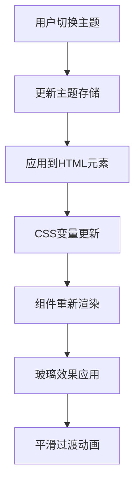

**图表来源**
- [useThemeStore.ts](file://client/src/store/useThemeStore.ts#L27-L85)
- [index.css](file://client/src/index.css#L1-L1898)

#### 组件级玻璃效果

管理员设置组件中的关键元素都支持玻璃效果：

1. **主容器**：使用`var(--glass-bg)`和`var(--glass-border)`创建半透明背景
2. **按钮组件**：支持`backdrop-filter: blur(10px)`实现模糊效果
3. **模态框**：使用`backdrop-filter: blur(20px)`和`box-shadow`营造深度感
4. **输入组件**：支持玻璃材质的输入框样式
5. **卡片组件**：使用渐变背景和透明边框

### 主题切换功能

管理员设置组件支持三种主题模式：

#### 1. 深色模式 (`dark`)
- 背景色：`#000000`
- 侧边栏背景：`#1C1C1E`
- 文本颜色：`#FFFFFF`
- 玻璃背景：`rgba(28, 28, 30, 0.75)`
- 玻璃边框：`rgba(255, 255, 255, 0.12)`

#### 2. 浅色模式 (`light`)
- 背景色：`#E5E7EB`
- 侧边栏背景：`#E5E7EB`
- 文本颜色：`#1C1C1E`
- 玻璃背景：`rgba(255, 255, 255, 0.75)`
- 玻璃边框：`rgba(0, 0, 0, 0.1)`

#### 3. 系统跟随 (`system`)
- 根据系统偏好自动切换
- 支持系统主题变化监听
- 实时更新组件样式

**章节来源**
- [useThemeStore.ts](file://client/src/store/useThemeStore.ts#L1-L86)
- [index.css](file://client/src/index.css#L1-L1898)
- [AdminSettings.tsx](file://client/src/components/Admin/AdminSettings.tsx#L1190-L1212)

## AI提示管理系统

**新增** AI提示管理系统是Longhorn AI功能的重要组成部分，提供了灵活的提示词配置和管理能力。

### 系统架构

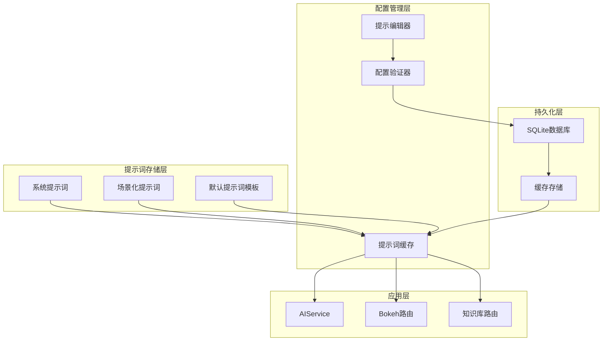

**图表来源**
- [AdminSettings.tsx](file://client/src/components/Admin/AdminSettings.tsx#L1720-L1867)

### 提示编辑器模态框

提示编辑器模态框提供了直观的提示词编辑界面，完全支持玻璃效果设计：

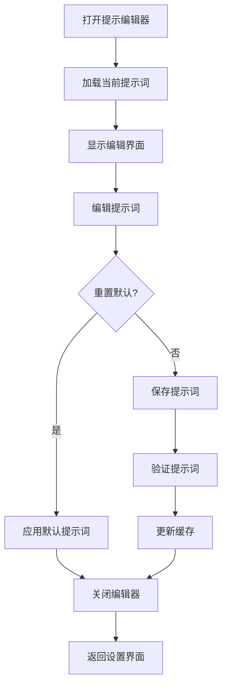

**图表来源**
- [AdminSettings.tsx](file://client/src/components/Admin/AdminSettings.tsx#L1728-L1867)

#### 提示词变量支持

系统支持多种动态变量替换：

| 变量名 | 描述 | 示例值 |
|--------|------|--------|
| `{{context}}` | 检索到的知识库/工单内容 | "相关工单：[K2602-0001]..." |
| `{{dataSources}}` | 数据源列表 | "tickets, knowledge" |
| `{{path}}` | 当前页面路径 | "/tech-hub/wiki/article" |
| `{{title}}` | 页面标题 | "MAVO Edge 6K 使用指南" |

#### 场景化提示词配置

系统支持针对不同场景的专用提示词：

| 场景键 | 场景名称 | 默认用途 |
|--------|----------|----------|
| `ticket_parse` | 工单解析场景 | 自动提取工单信息 |
| `knowledge_translate` | 知识库外文翻译 | 外文内容翻译 |
| `knowledge_layout` | 知识库全文排版 | 文章格式优化 |
| `knowledge_optimize` | 知识库微调优化 | 局部样式调整 |
| `knowledge_summary` | 知识库全段摘要 | 自动生成摘要 |
| `ticket_summary` | 历史工单搜索总结 | 搜索结果归纳 |

### 数据库模式更新

AI提示管理系统引入了新的数据库字段：

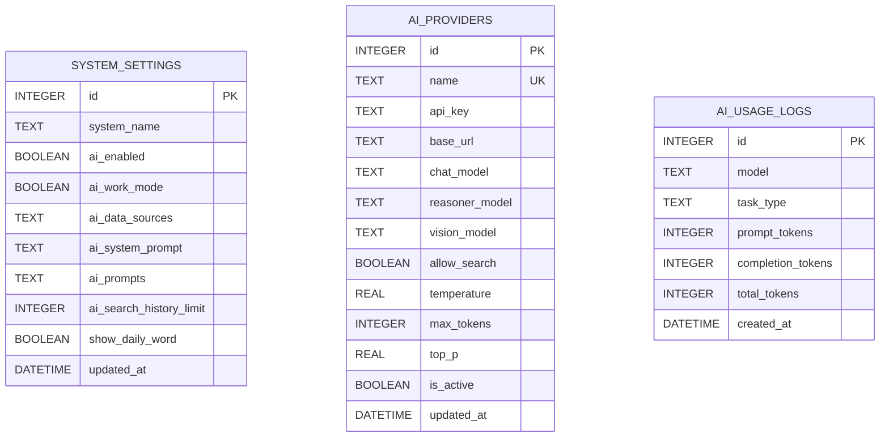

**图表来源**
- [index.js](file://server/index.js#L61-L91)
- [index.js](file://server/index.js#L286-L287)

### AI服务端集成

AI服务端实现了智能的提示词缓存和解析机制：

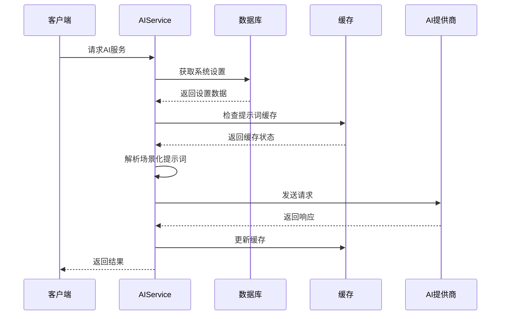

**图表来源**
- [ai_service.js](file://server/service/ai_service.js#L189-L224)
- [ai_service.js](file://server/service/ai_service.js#L309-L331)

#### 提示词解析流程

1. **优先级检查**：首先检查场景化提示词是否存在
2. **系统提示词应用**：应用系统级提示词模板
3. **变量替换**：替换动态变量占位符
4. **上下文增强**：添加检索到的相关内容
5. **缓存存储**：将解析后的提示词存储到缓存

**章节来源**
- [AdminSettings.tsx](file://client/src/components/Admin/AdminSettings.tsx#L1720-L1867)
- [ai_service.js](file://server/service/ai_service.js#L189-L224)
- [settings.js](file://server/service/routes/settings.js#L38-L43)
- [index.js](file://server/index.js#L286-L287)

## 国际化支持增强

**新增** 管理员设置组件现在提供了完整的多语言支持，增强了AI智能中心管理界面的国际化体验。

### 多语言支持架构

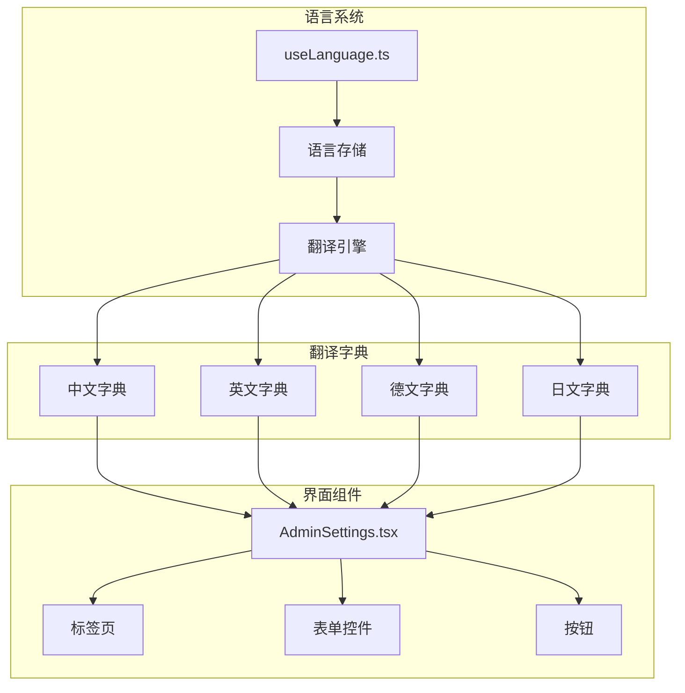

**图表来源**
- [useLanguage.ts](file://client/src/i18n/useLanguage.ts#L1-L59)
- [translations.ts](file://client/src/i18n/translations.ts#L1-L5395)

### 支持的语言

管理员设置组件现在支持以下四种语言：

| 语言代码 | 语言名称 | 界面翻译覆盖率 |
|----------|----------|---------------|
| `zh` | 中文 | 100% |
| `en` | 英语 | 100% |
| `de` | 德语 | 100% |
| `ja` | 日语 | 100% |

### AI智能中心界面翻译

AI智能中心管理界面的关键区域现已完全本地化：

#### 标签页和菜单
- **智能助手** (`admin.smart_assistant`) - 中文：智能助手，英文：Smart Assistant，德文：Intelligente Assistentin，日文：スマートアシスタント
- **协作助理配置** (`admin.prompts`) - 中文：协作助理配置，英文：Collaborative Assistant Configuration，德文：Kollaborative Assistenten-Konfiguration，日文：協働アシスタント設定
- **系统健康** (`admin.system_health`) - 中文：系统健康，英文：System Health，德文：Systemintegrität，日文：システム健全性
- **审计日志** (`admin.audit_logs`) - 中文：审计日志，英文：Audit Logs，德文：Audit-Protokolle，日文：監査ログ

#### AI提供商配置界面
- **服务提供商** (`admin.ai_providers`) - 中文：服务提供商，英文：AI Providers，德文：ANBIETER，日文：AIプロバイダー
- **添加自定义提供商** (`admin.add_custom_provider`) - 中文：添加自定义提供商，英文：Add Custom Provider，德文：Anbieter hinzufügen，日文：カスタムプロバイダーを追加
- **全局策略** (`admin.global_policy`) - 中文：全局策略，英文：Global Policy，德文：GLOBALE RICHTLINIE，日文：グローバルポリシー
- **当前激活** (`admin.currently_active`) - 中文：当前激活，英文：Currently Active，德文：Derzeit aktiv，日文：現在アクティブ
- **设为激活** (`admin.set_as_active`) - 中文：设为激活，英文：Set as Active，德文：Als aktiv setzen，日文：アクティブに設定

#### AI模型配置界面
- **API密钥** (`admin.api_key`) - 中文：API 密钥，英文：API Key，德文：API-Schlüssel，日文：APIキー
- **API 基础地址** (`admin.api_base_url`) - 中文：API 基础地址，英文：API Base URL，德文：API-Basis-URL，日文：APIベースURL
- **允许网络搜索** (`admin.allow_web_search`) - 中文：允许网络搜索，英文：Allow Web Search，德文：Websuche erlauben，日文：ウェブ検索を許可
- **温度 (创造性)** (`admin.temperature`) - 中文：温度 (创造性)，英文：Temperature (Creativity)，德文：Temperatur (Kreativität)，日文：温度（創造性）
- **最大 Tokens** (`admin.max_tokens`) - 中文：最大 Tokens，英文：Max Tokens，德文：Max. Tokens，日文：最大トークン数
- **Top P (多样性)** (`admin.top_p`) - 中文：Top P (多样性)，英文：Top P (Diversity)，德文：Top P (Vielfalt)，日文：Top P（多様性）

#### 备份管理界面
- **主备份** (`admin.primary_backup`) - 中文：主备份，英文：Primary Backup，德文：Primärer Sicherungskopie，日文：メインバックアップ
- **次级备份** (`admin.secondary_backup`) - 中文：次级备份，英文：Secondary Backup，德文：Sekundärer Sicherungskopie，日文：セカンダリバックアップ
- **备份频率** (`admin.backup_frequency`) - 中文：备份频率，英文：Backup Frequency，德文：Sicherungshäufigkeit，日文：バックアップ頻度
- **保留策略** (`admin.retention_policy`) - 中文：保留策略，英文：Retention Policy，德文：Aufbewahrungspolitik，日文：保持ポリシー

### 语言切换机制

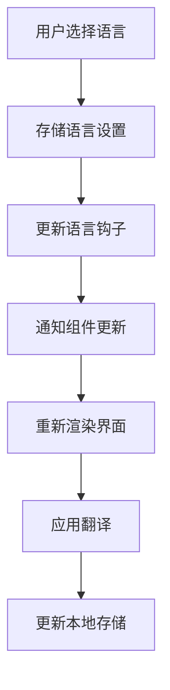

**图表来源**
- [useLanguage.ts](file://client/src/i18n/useLanguage.ts#L22-L26)
- [useLanguage.ts](file://client/src/i18n/useLanguage.ts#L30-L58)

### 翻译引擎实现

翻译引擎提供了强大的本地化支持：

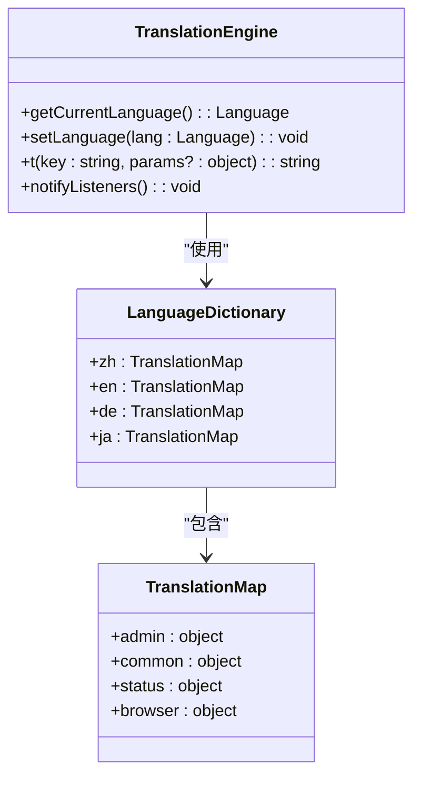

**图表来源**
- [useLanguage.ts](file://client/src/i18n/useLanguage.ts#L44-L55)
- [translations.ts](file://client/src/i18n/translations.ts#L4-L5395)

#### 参数化翻译支持

翻译系统支持动态参数替换：

```javascript
// 示例：参数化翻译
const greeting = t('welcome_message', { 
  userName: currentUser.name,
  itemCount: cartItems.length 
});
// 输出：欢迎 John，您有 3 件商品在购物车中
```

#### 语言存储机制

语言设置通过localStorage持久化：

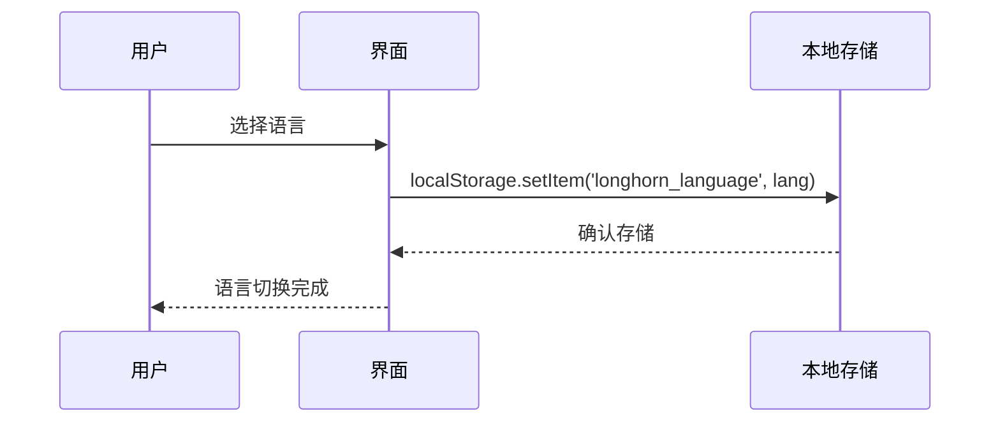

**图表来源**
- [useLanguage.ts](file://client/src/i18n/useLanguage.ts#L12-L26)

### iOS平台国际化

iOS平台也提供了相应的本地化支持：

#### iOS语言映射
- **德语** (`de`) - 对应 `de` 语言包
- **英语** (`en`) - 对应 `en` 语言包  
- **日语** (`ja`) - 对应 `ja` 语言包
- **简体中文** (`zh-Hans`) - 对应 `zh-Hans` 语言包

#### iOS语言检测机制

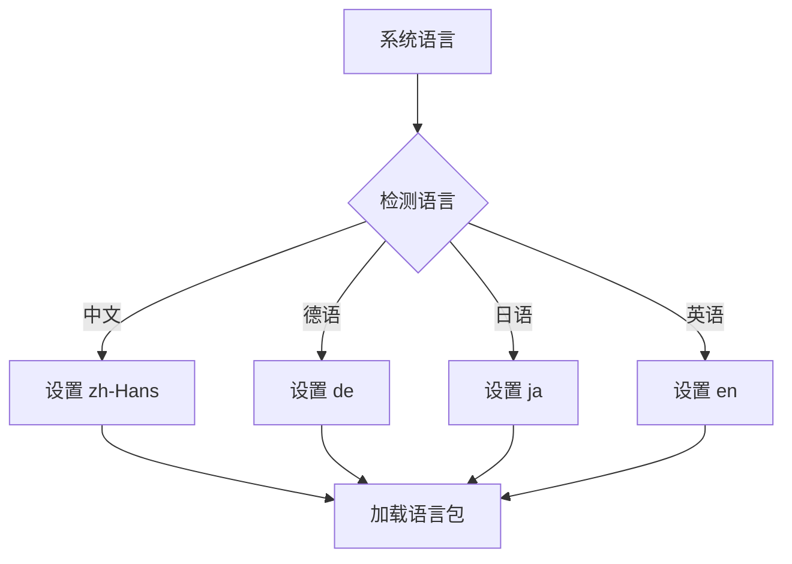

**图表来源**
- [Department+Extensions.swift](file://ios/LonghornApp/Models/Department+Extensions.swift#L63-L77)

**章节来源**
- [useLanguage.ts](file://client/src/i18n/useLanguage.ts#L1-L59)
- [translations.ts](file://client/src/i18n/translations.ts#L1-L5395)
- [AdminSettings.tsx](file://client/src/components/Admin/AdminSettings.tsx#L436-L449)

## 依赖关系分析

管理员设置组件的依赖关系展现了清晰的分层架构，现在完全支持新的主题系统和国际化：

```mermaid
graph TB
subgraph "外部依赖"
Axios[Axios HTTP客户端]
LucideIcons[Lucide图标库]
FramerMotion[Framer Motion动画]
DateFns[date-fns日期库]
end
subgraph "内部依赖"
AuthStore[认证状态管理]
ToastStore[提示消息管理]
ConfirmStore[确认对话框管理]
Language[国际化支持]
PromptEditor[PromptEditorModal]
ThemeStore[useThemeStore]
GlassStyles[玻璃效果样式]
LanguageHook[useLanguage]
TranslationEngine[翻译引擎]
end
subgraph "后端服务"
Express[Express服务器]
SQLite[SQLite数据库]
BackupService[备份服务]
APIService[API服务]
AIService[AI服务]
end
AdminSettings --> Axios
AdminSettings --> LucideIcons
AdminSettings --> FramerMotion
AdminSettings --> DateFns
AdminSettings --> AuthStore
AdminSettings --> ToastStore
AdminSettings --> ConfirmStore
AdminSettings --> Language
AdminSettings --> PromptEditor
AdminSettings --> ThemeStore
AdminSettings --> GlassStyles
AdminSettings --> LanguageHook
AdminSettings --> TranslationEngine
AdminSettings --> Express
AdminSettings --> SQLite
AdminSettings --> BackupService
AdminSettings --> APIService
AdminSettings --> AIService
```

**图表来源**
- [AdminSettings.tsx](file://client/src/components/Admin/AdminSettings.tsx#L1-L8)
- [AdminPanel.tsx](file://client/src/components/AdminPanel.tsx#L1-L8)
- [useThemeStore.ts](file://client/src/store/useThemeStore.ts#L1-L86)
- [useLanguage.ts](file://client/src/i18n/useLanguage.ts#L1-L59)

**章节来源**
- [AdminSettings.tsx](file://client/src/components/Admin/AdminSettings.tsx#L1-L8)
- [AdminPanel.tsx](file://client/src/components/AdminPanel.tsx#L1-L8)

## 性能考虑

管理员设置组件在设计时充分考虑了性能优化，特别是在新的玻璃效果设计和国际化支持下：

### 1. 数据加载优化
- 使用Promise.all并行加载多个API端点
- 实现智能缓存机制减少重复请求
- 支持增量更新避免全量刷新
- **新增** 提示词缓存机制，减少数据库查询
- **新增** 语言包按需加载，减少初始包体积

### 2. UI渲染优化
- 实现虚拟滚动处理大量数据
- 使用React.memo优化组件重渲染
- 采用防抖节流处理高频交互
- **新增** 提示编辑器的即时预览功能
- **新增** 玻璃效果的硬件加速优化
- **新增** 国际化翻译的缓存机制

### 3. 网络请求优化
- 实现请求去重机制
- 支持离线模式降级
- 优化图片和资源加载
- **新增** 提示词变更的实时同步机制
- **新增** 语言切换的性能优化

### 4. AI服务性能优化
- **新增** 提示词缓存存储，避免重复解析
- **新增** 数据库连接池管理
- **新增** 异步提示词加载机制
- **新增** 主题切换的性能优化
- **新增** 国际化翻译的异步加载

### 5. 玻璃效果性能优化
- 使用CSS变量减少重绘
- 优化backdrop-filter的使用
- 实现硬件加速的过渡动画
- 减少不必要的样式计算

### 6. 国际化性能优化
- **新增** 语言包的懒加载机制
- **新增** 翻译缓存减少重复查找
- **新增** 语言切换的事件驱动更新
- **新增** 参数化翻译的性能优化

## 故障排除指南

### 常见问题及解决方案

#### 1. 备份失败问题
**症状**：备份操作返回错误
**可能原因**：
- 存储空间不足
- 权限配置错误
- 网络连接异常

**解决步骤**：
1. 检查存储空间使用情况
2. 验证备份路径权限
3. 确认网络连接状态
4. 查看备份日志详情

#### 2. AI提供商连接失败
**症状**：AI功能无法正常使用
**可能原因**：
- API密钥无效
- 网络连接问题
- 模型配置错误

**解决步骤**：
1. 验证API密钥格式正确
2. 测试网络连通性
3. 检查模型参数配置
4. 重新授权访问权限

#### 3. 提示词编辑问题
**症状**：提示词编辑器无法正常工作
**可能原因**：
- 浏览器兼容性问题
- JavaScript错误
- 数据库连接异常

**解决步骤**：
1. 清除浏览器缓存
2. 检查浏览器控制台错误
3. 尝试其他浏览器
4. 验证数据库连接状态
5. 检查提示词JSON格式

#### 4. 玻璃效果显示异常
**症状**：玻璃效果无法正常显示
**可能原因**：
- 浏览器不支持backdrop-filter
- CSS变量未正确加载
- 主题切换失败

**解决步骤**：
1. 检查浏览器对backdrop-filter的支持
2. 验证CSS变量是否正确加载
3. 重新初始化主题设置
4. 清除浏览器缓存
5. 检查网络连接状态

#### 5. 界面显示异常
**症状**：管理界面布局错乱
**可能原因**：
- 浏览器兼容性问题
- 样式冲突
- JavaScript错误

**解决步骤**：
1. 清除浏览器缓存
2. 检查浏览器控制台错误
3. 尝试其他浏览器
4. 更新到最新版本

#### 6. 国际化显示问题
**症状**：界面语言切换失败或显示乱码
**可能原因**：
- 语言包加载失败
- 翻译键缺失
- 字符编码问题

**解决步骤**：
1. 检查网络连接状态
2. 验证语言包文件完整性
3. 检查翻译键是否存在
4. 确认字符编码设置
5. 清除浏览器缓存重新加载

#### 7. AI智能中心界面显示问题
**症状**：AI智能中心界面显示不完整或布局错乱
**可能原因**：
- 翻译文件未正确加载
- CSS样式冲突
- 组件渲染顺序问题

**解决步骤**：
1. 检查AI智能中心相关翻译键
2. 验证CSS变量是否正确应用
3. 检查组件的渲染逻辑
4. 确认国际化支持的正确性
5. 查看控制台错误信息

**章节来源**
- [AdminSettings.tsx](file://client/src/components/Admin/AdminSettings.tsx#L225-L244)

## 结论

管理员设置组件作为 Longhorn 系统的核心管理界面，展现了现代Web应用的最佳实践。该组件通过清晰的架构设计、完善的错误处理机制和优秀的用户体验，在保证功能完整性的同时，也确保了系统的可维护性和扩展性。

**更新** 完成了管理员设置组件的样式重构，完全适配新的主题系统和玻璃效果设计。组件现在支持完整的macOS风格玻璃材质效果，包括背景模糊、透明度控制和渐变阴影，实现了现代化的视觉体验。主题系统支持浅色、深色和系统跟随三种模式，所有组件都统一使用CSS变量系统，确保视觉一致性和可维护性。同时，移除了Health监控和审计日志标签页，简化了管理员设置界面，提升了用户体验和界面简洁性。

**新增** 增强了AI智能中心管理界面的国际化支持，现在支持中、英、德、日四种语言的完整界面翻译。新增了AI提供商配置和全局策略设置的多语言支持，为不同地区的用户提供本地化的管理体验。国际化系统采用了高效的翻译引擎和缓存机制，确保了良好的性能表现。

组件的主要优势包括：

1. **模块化设计**：各功能模块独立开发，便于维护和测试
2. **响应式架构**：支持多种设备和屏幕尺寸
3. **国际化支持**：内置多语言切换机制，支持AI智能中心界面本地化
4. **安全可靠**：完善的权限控制和数据保护
5. **性能优化**：高效的资源管理和加载策略
6. **主题系统集成**：完全支持新的主题切换功能
7. **玻璃效果支持**：所有组件都适配玻璃材质设计
8. **平滑过渡动画**：使用CSS变量实现流畅的主题切换
9. **硬件加速优化**：充分利用浏览器的硬件加速能力
10. **响应式设计**：支持系统主题变化的实时更新
11. **统一样式系统**：通过CSS变量确保视觉一致性
12. **简化界面设计**：移除了Health监控和审计日志标签页
13. **提升用户体验**：减少了界面复杂度，提高了操作效率
14. **增强视觉层次**：通过渐变和阴影营造深度感
15. **多语言界面支持**：AI智能中心界面完全本地化
16. **高效翻译系统**：支持动态参数化翻译和缓存机制
17. **跨平台国际化**：同时支持Web和iOS平台的本地化

未来可以考虑的功能增强方向：
- 添加更多AI提供商支持
- 扩展备份策略选项
- 优化移动端用户体验
- **新增** 提示词版本管理和回滚功能
- **新增** 提示词模板库和共享机制
- **新增** 提示词性能分析和优化建议
- **新增** 更精细的权限控制和审计日志
- **新增** 批量配置和导入导出功能
- **新增** 玻璃效果的自定义配置选项
- **新增** 主题切换的动画效果优化
- **新增** 更丰富的国际化语言支持
- **新增** AI智能中心的多语言提示词模板
- **新增** 国际化界面的动态主题适配