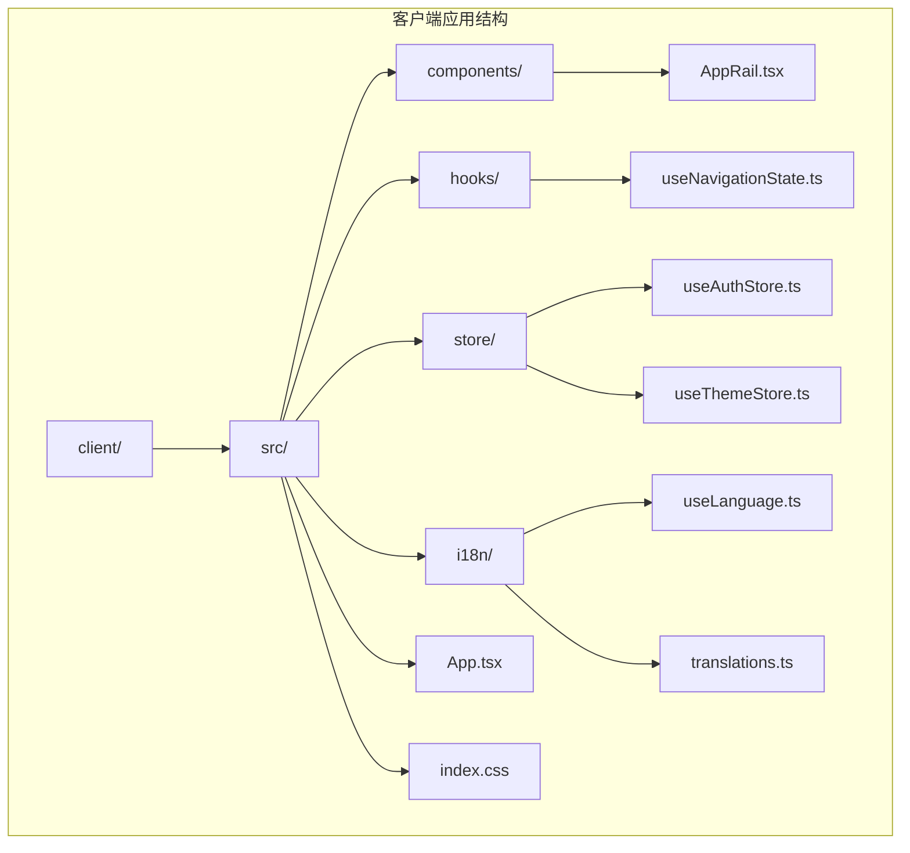
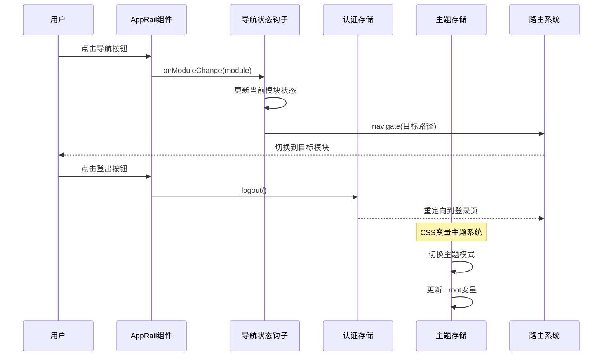
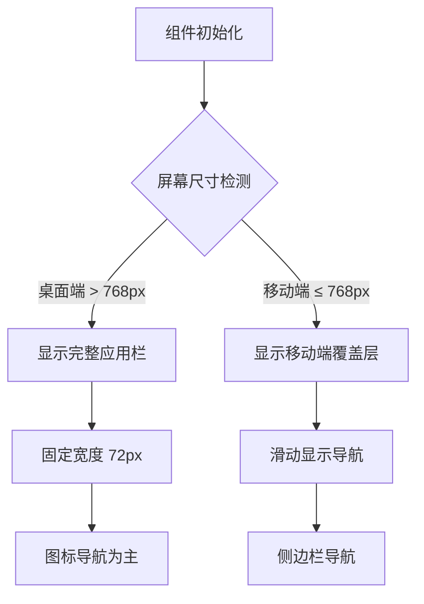
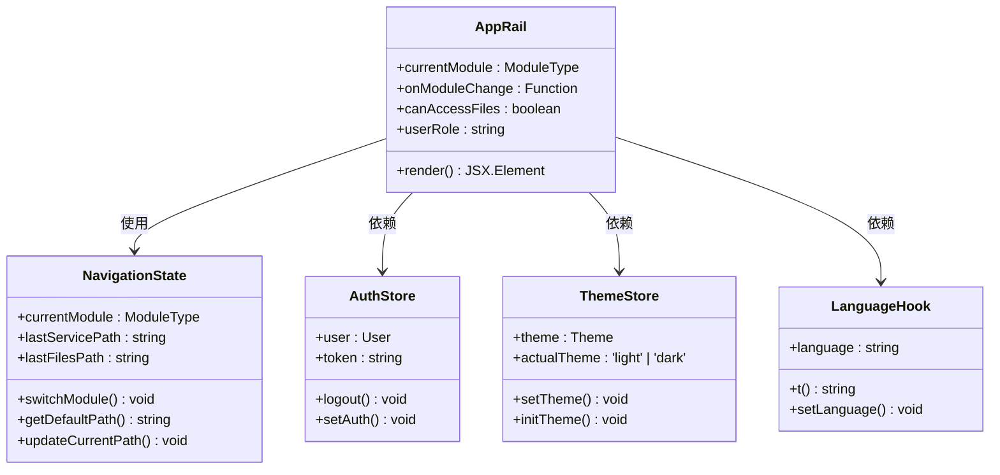
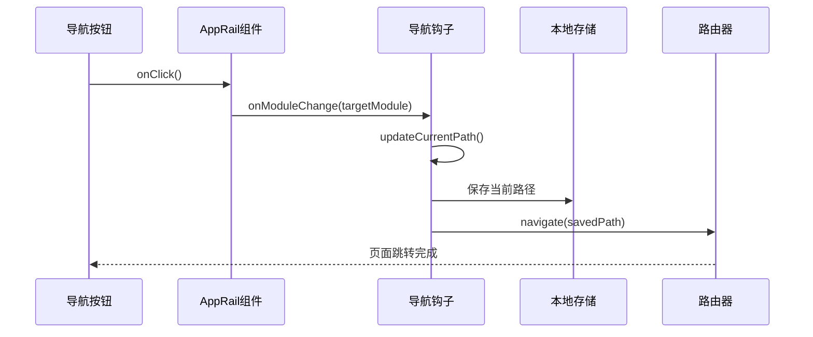
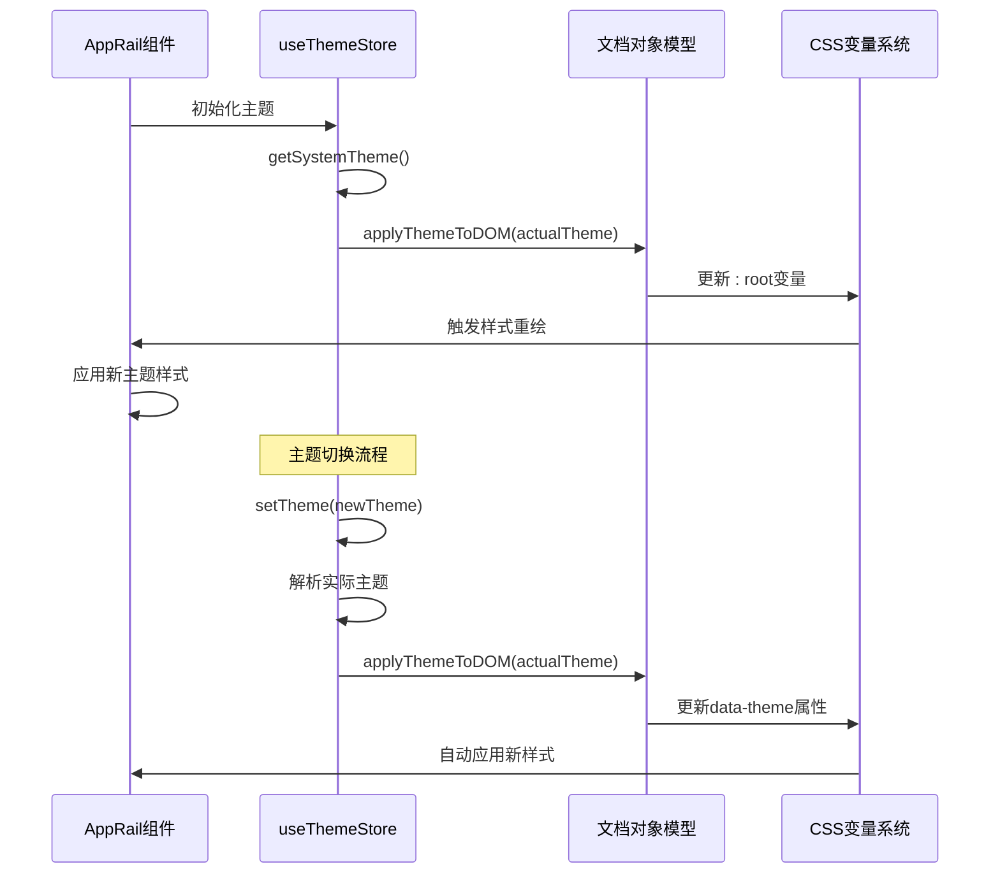
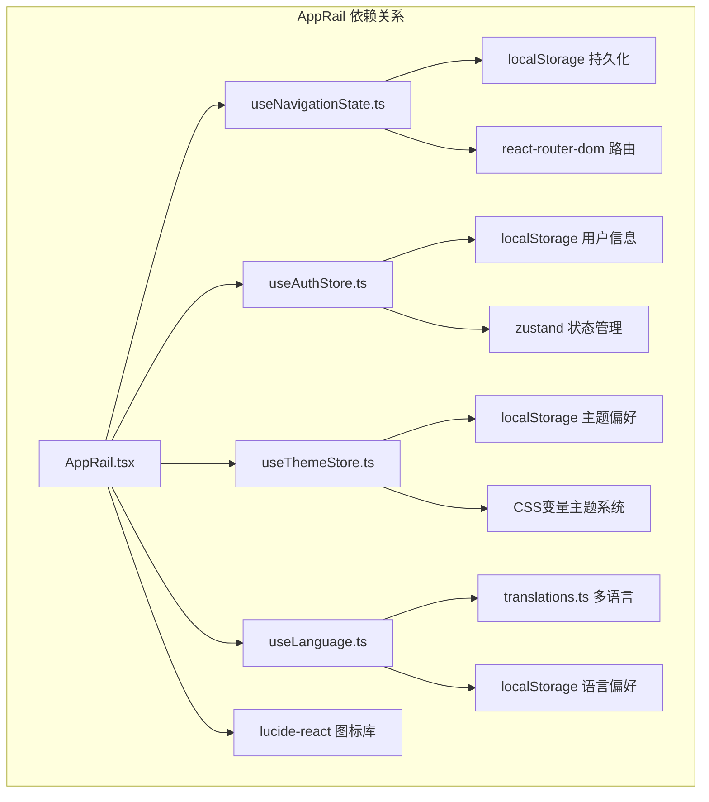
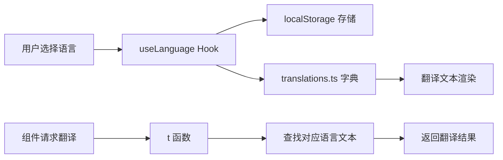

# AppRail 应用栏组件

<cite>
**本文档引用的文件**
- [AppRail.tsx](file://client/src/components/AppRail.tsx)
- [useNavigationState.ts](file://client/src/hooks/useNavigationState.ts)
- [useAuthStore.ts](file://client/src/store/useAuthStore.ts)
- [useLanguage.ts](file://client/src/i18n/useLanguage.ts)
- [translations.ts](file://client/src/i18n/translations.ts)
- [App.tsx](file://client/src/App.tsx)
- [index.css](file://client/src/index.css)
- [useThemeStore.ts](file://client/src/store/useThemeStore.ts)
- [AdminSettings.tsx](file://client/src/components/Admin/AdminSettings.tsx)
</cite>

## 更新摘要
**变更内容**
- 更新了主题系统分析章节，重点展示AppRail组件如何利用CSS变量系统实现统一主题管理
- 新增了CSS变量系统与主题存储的集成分析
- 扩展了AppRail组件样式系统的技术细节说明

## 目录
1. [简介](#简介)
2. [项目结构](#项目结构)
3. [核心组件](#核心组件)
4. [架构概览](#架构概览)
5. [详细组件分析](#详细组件分析)
6. [依赖关系分析](#依赖关系分析)
7. [性能考虑](#性能考虑)
8. [故障排除指南](#故障排除指南)
9. [结论](#结论)

## 简介

AppRail 是 Longhorn 应用中的核心导航组件，采用垂直应用栏设计，提供模块化导航功能。该组件实现了响应式设计，支持桌面端和移动端的不同交互模式，并集成了国际化支持、权限管理和状态持久化等功能。

**更新** AppRail 组件现已深度集成 Longhorn 系统的 CSS 变量主题系统，通过统一的 CSS 变量实现深浅色主题切换和品牌色彩管理。组件位于应用界面的左侧，采用极简的设计风格，通过图标和简洁的布局提供清晰的功能导航。组件支持三个主要模块：服务模块（Workbench）、文件模块和系统管理模块，并根据用户角色动态显示相应的导航项。

## 项目结构

AppRail 组件作为客户端 React 应用的一部分，位于以下目录结构中：



**图表来源**
- [AppRail.tsx](file://client/src/components/AppRail.tsx#L1-L141)
- [useNavigationState.ts](file://client/src/hooks/useNavigationState.ts#L1-L175)
- [useAuthStore.ts](file://client/src/store/useAuthStore.ts#L1-L31)
- [useThemeStore.ts](file://client/src/store/useThemeStore.ts#L1-L86)

**章节来源**
- [AppRail.tsx](file://client/src/components/AppRail.tsx#L1-L141)
- [App.tsx](file://client/src/App.tsx#L54-L94)

## 核心组件

### AppRail 组件架构

AppRail 组件是一个纯函数式组件，采用 TypeScript 编写，具有以下核心特性：

#### 组件属性接口
```typescript
interface AppRailProps {
  currentModule: ModuleType;
  onModuleChange: (module: ModuleType) => void;
  canAccessFiles: boolean;
  userRole: string;
}
```

#### 模块类型定义
组件支持两种主要模块类型：
- **service**: 服务模块，包含工单管理、服务记录等功能
- **files**: 文件模块，包含文件浏览、分享、回收站等功能

#### 动态权限控制
组件根据用户角色动态显示导航项：
- **Admin 角色**: 显示系统管理入口
- **其他角色**: 根据 canAccessFiles 参数决定是否显示文件模块

**更新** 服务模块现在支持三层架构的统一导航，包括：
- **Workbench**: 咨询工单、RMA返厂单、经销商维修单
- **Tech Hub**: 知识库、智能问答、公告与培训
- **Archives**: 客户档案、设备资产、物料与价目

**章节来源**
- [AppRail.tsx](file://client/src/components/AppRail.tsx#L7-L19)
- [useNavigationState.ts](file://client/src/hooks/useNavigationState.ts#L11-L175)

## 架构概览

AppRail 组件在整个应用架构中扮演着关键的导航角色，通过以下方式与其他组件协作：



**图表来源**
- [AppRail.tsx](file://client/src/components/AppRail.tsx#L42-L78)
- [useNavigationState.ts](file://client/src/hooks/useNavigationState.ts#L135-L146)
- [useAuthStore.ts](file://client/src/store/useAuthStore.ts#L25-L29)
- [useThemeStore.ts](file://client/src/store/useThemeStore.ts#L33-L37)

## 详细组件分析

### 设计模式与实现

#### 响应式设计模式
AppRail 采用了响应式设计模式，通过 CSS 变量和媒体查询实现不同屏幕尺寸下的适配：



**图表来源**
- [AppRail.tsx](file://client/src/components/AppRail.tsx#L23-L82)
- [index.css](file://client/src/index.css#L152-L164)

#### 状态管理模式
组件采用 React Hooks 实现状态管理，结合本地存储实现状态持久化：



**图表来源**
- [AppRail.tsx](file://client/src/components/AppRail.tsx#L14-L21)
- [useNavigationState.ts](file://client/src/hooks/useNavigationState.ts#L97-L165)
- [useAuthStore.ts](file://client/src/store/useAuthStore.ts#L17-L30)
- [useThemeStore.ts](file://client/src/store/useThemeStore.ts#L27-L85)
- [useLanguage.ts](file://client/src/i18n/useLanguage.ts#L30-L58)

### 核心功能实现

#### 模块切换机制
AppRail 通过 `onModuleChange` 回调函数实现模块间的无缝切换：



**图表来源**
- [AppRail.tsx](file://client/src/components/AppRail.tsx#L42-L67)
- [useNavigationState.ts](file://client/src/hooks/useNavigationState.ts#L135-L146)

#### 权限控制机制
组件根据用户角色动态渲染导航项，确保安全性和用户体验：

| 用户角色 | 可访问模块 | 特殊权限 |
|---------|-----------|----------|
| Admin | service, files, admin | 完全系统管理权限 |
| Lead | service, files | 部门管理权限 |
| Member | service, files | 个人空间权限 |

**更新** 服务模块现在支持三层架构的统一访问：
- **Workbench**: 咨询工单、RMA返厂单、经销商维修单
- **Tech Hub**: 知识库、智能问答、公告与培训
- **Archives**: 客户档案、设备资产、物料与价目

**章节来源**
- [AppRail.tsx](file://client/src/components/AppRail.tsx#L64-L73)
- [useNavigationState.ts](file://client/src/hooks/useNavigationState.ts#L172-L174)

### 样式系统分析

#### CSS 变量主题系统架构

AppRail 组件深度集成了 Longhorn 系统的 CSS 变量主题系统，实现了统一的主题管理：

```mermaid
graph TB
subgraph "CSS变量主题系统"
A[:root] --> B[深色主题变量]
A --> C[浅色主题变量]
B --> D[--accent-blue: #FFD200]
B --> E[--text-main: #FFFFFF]
B --> F[--glass-bg-hover: rgba(255,255,255,0.12)]
C --> G[--accent-blue: #E6BD00]
C --> H[--text-main: #1C1C1E]
C --> I[--glass-bg-hover: rgba(0,0,0,0.08)]
end
subgraph "AppRail组件样式"
J[.app-rail] --> K[background: var(--bg-main)]
J --> L[border-right: 1px solid var(--glass-border)]
M[.rail-item] --> N[color: var(--text-secondary)]
M --> O[background: transparent]
P[.rail-item:hover] --> Q[background: var(--glass-bg-hover)]
R[.rail-item.active] --> S[background: var(--accent-blue)]
T[Logo区域] --> U[backgroundColor: var(--accent-blue)]
end
subgraph "主题存储集成"
V[useThemeStore] --> W[applyThemeToDOM]
W --> X[document.documentElement.setAttribute]
X --> Y[data-theme="light|dark"]
end
subgraph "动态样式应用"
Z[组件内联样式] --> AA[var(--text-secondary)]
Z --> AB[var(--accent-blue)]
Z --> AC[var(--glass-bg-hover)]
end
```

**图表来源**
- [index.css](file://client/src/index.css#L4-L101)
- [AppRail.tsx](file://client/src/components/AppRail.tsx#L72-L135)
- [useThemeStore.ts](file://client/src/store/useThemeStore.ts#L19-L25)

#### 主题变量系统详解

AppRail 组件使用了以下关键 CSS 变量：

**基础颜色变量**
- `--accent-blue`: 主色调（金黄色），用于激活状态和品牌标识
- `--text-main`: 主要文字颜色，深浅主题自动切换
- `--text-secondary`: 次要文字颜色，用于导航标签和辅助信息

**玻璃拟态变量**
- `--glass-bg-hover`: 悬停状态背景色，支持透明度和模糊效果
- `--glass-border`: 边框颜色，实现毛玻璃边框效果
- `--glass-shadow`: 阴影效果，增强层次感

**交互状态样式**
组件实现了丰富的交互状态，包括悬停、激活和登出状态：

| 状态 | 样式特征 | CSS 变量使用 | 应用场景 |
|------|----------|--------------|----------|
| 默认 | 半透明背景，浅色文字 | `var(--text-secondary)` | 导航项默认状态 |
| 悬停 | 亮色背景，高亮文字 | `var(--glass-bg-hover)` | 鼠标悬停效果 |
| 激活 | 金色背景，黑色文字 | `var(--accent-blue)` | 当前选中模块 |
| 登出 | 小尺寸图标，居中对齐 | `var(--text-main)` | 底部操作按钮 |

**更新** AppRail 组件通过以下方式利用 CSS 变量系统：

1. **Logo区域**: 使用 `var(--accent-blue)` 设置品牌标识背景色
2. **导航项**: 使用 `var(--text-secondary)` 和 `var(--glass-bg-hover)` 实现统一的视觉层次
3. **激活状态**: 使用 `var(--accent-blue)` 和 `var(--glass-shadow)` 创建突出的品牌识别
4. **内联样式**: 在组件内部直接使用 CSS 变量实现动态主题切换

#### 主题存储与应用机制

AppRail 组件通过 `useThemeStore` 实现主题状态管理：



**图表来源**
- [useThemeStore.ts](file://client/src/store/useThemeStore.ts#L33-L37)
- [useThemeStore.ts](file://client/src/store/useThemeStore.ts#L19-L25)
- [index.css](file://client/src/index.css#L4-L5)

**章节来源**
- [AppRail.tsx](file://client/src/components/AppRail.tsx#L113-L145)
- [index.css](file://client/src/index.css#L3-L49)
- [useThemeStore.ts](file://client/src/store/useThemeStore.ts#L19-L25)

## 依赖关系分析

### 组件间依赖关系



**图表来源**
- [AppRail.tsx](file://client/src/components/AppRail.tsx#L1-L5)
- [useNavigationState.ts](file://client/src/hooks/useNavigationState.ts#L8-L9)
- [useAuthStore.ts](file://client/src/store/useAuthStore.ts#L1-L1)
- [useThemeStore.ts](file://client/src/store/useThemeStore.ts#L1-L2)

### 外部依赖分析

#### 图标系统
AppRail 使用 lucide-react 图标库，提供了丰富的矢量图标支持：

| 功能模块 | 对应图标 | 用途描述 |
|---------|----------|----------|
| 服务模块 | Headphones | 代表客户服务功能 |
| 文件模块 | FolderOpen | 代表文件管理功能 |
| 系统管理 | Network | 代表系统管理功能 |
| 登出功能 | LogOut | 代表用户退出功能 |

#### 国际化支持
组件集成了完整的多语言支持系统，支持中文、英文、德文和日文：



**图表来源**
- [useLanguage.ts](file://client/src/i18n/useLanguage.ts#L44-L55)
- [translations.ts](file://client/src/i18n/translations.ts#L4-L800)

**章节来源**
- [AppRail.tsx](file://client/src/components/AppRail.tsx#L2-L3)
- [useLanguage.ts](file://client/src/i18n/useLanguage.ts#L1-L59)

## 性能考虑

### 渲染优化策略

#### React.memo 优化
虽然当前实现没有显式的 React.memo 包装，但组件本身结构简单，渲染开销较小。对于复杂场景，可以考虑添加 memo 优化：

```typescript
const AppRail = React.memo(({ 
  currentModule, 
  onModuleChange, 
  canAccessFiles, 
  userRole 
}: AppRailProps) => {
  // 组件实现
});
```

#### 图标懒加载
lucide-react 支持 Tree Shaking，只有使用的图标会被打包，减少了不必要的资源加载。

#### 样式优化
组件使用内联样式和 CSS 变量，避免了复杂的样式计算，提高了渲染性能。

### 内存管理

#### 事件监听器清理
组件正确处理了事件监听器的生命周期，避免内存泄漏。

#### 状态持久化
通过 localStorage 实现的状态持久化，减少了每次刷新时的数据重新计算。

## 故障排除指南

### 常见问题诊断

#### 导航模块切换失效
**症状**: 点击导航按钮无反应
**可能原因**:
1. `onModuleChange` 回调函数未正确传递
2. 路由配置错误
3. localStorage 访问权限问题

**解决方案**:
1. 检查父组件是否正确传递回调函数
2. 验证路由配置是否包含目标模块路径
3. 确认浏览器允许使用 localStorage

#### 权限显示异常
**症状**: 文件模块或系统管理模块显示不正确
**可能原因**:
1. 用户角色信息获取失败
2. `canAccessFilesModule` 函数逻辑错误
3. 权限检查时机不当

**解决方案**:
1. 检查用户认证状态
2. 验证角色判断逻辑
3. 确保权限检查在正确的生命周期执行

#### 国际化文本显示问题
**症状**: 导航文本显示为键名而非实际文本
**可能原因**:
1. 翻译字典缺失相应键值
2. 语言切换逻辑错误
3. localStorage 数据损坏

**解决方案**:
1. 检查 translations.ts 中是否存在对应键值
2. 验证语言切换功能
3. 清除 localStorage 中的语言设置重新测试

#### 主题切换异常
**症状**: AppRail 组件颜色不随主题变化
**可能原因**:
1. CSS 变量未正确更新
2. 主题存储状态异常
3. 浏览器缓存问题

**解决方案**:
1. 检查 `useThemeStore` 是否正确应用主题
2. 验证 `applyThemeToDOM` 函数是否执行
3. 刷新页面清除浏览器缓存

### 调试工具使用

#### 浏览器开发者工具
1. **Elements 面板**: 检查 DOM 结构和样式类名
2. **Console 面板**: 查看 JavaScript 错误和警告
3. **Application 面板**: 检查 localStorage 和 Cookie
4. **Network 面板**: 监控 API 请求和响应

#### React DevTools
1. **Components 标签**: 查看组件树和 props 状态
2. **Profiler 标签**: 分析组件渲染性能
3. **Hooks 标签**: 检查 Hook 状态和依赖

**章节来源**
- [useNavigationState.ts](file://client/src/hooks/useNavigationState.ts#L71-L92)
- [useLanguage.ts](file://client/src/i18n/useLanguage.ts#L12-L26)

## 结论

AppRail 应用栏组件是一个设计精良、功能完善的导航组件，体现了现代前端开发的最佳实践。其主要优势包括：

### 技术优势
1. **模块化设计**: 清晰的职责分离和组件边界
2. **响应式架构**: 优秀的跨设备兼容性
3. **状态管理**: 合理的状态持久化和生命周期管理
4. **国际化支持**: 完整的多语言解决方案
5. **性能优化**: 高效的渲染和资源管理

### 架构特点
1. **松耦合**: 通过 Props 和回调函数实现组件通信
2. **高内聚**: 每个模块职责明确，功能集中
3. **可扩展性**: 易于添加新的导航模块和功能
4. **可维护性**: 清晰的代码结构和注释

**更新** 最重要的改进是支持了 Longhorn 系统的 CSS 变量主题系统：
- **统一主题管理**: 通过 `:root` CSS 变量实现全局主题控制
- **动态主题切换**: 支持深浅色模式和系统跟随模式
- **品牌一致性**: 确保所有组件使用相同的色彩体系
- **性能优化**: CSS 变量比内联样式的性能更好

AppRail 组件为 Longhorn 应用提供了稳定可靠的导航基础，是整个应用架构的重要组成部分。其设计理念和实现方式为类似项目的开发提供了良好的参考模板。