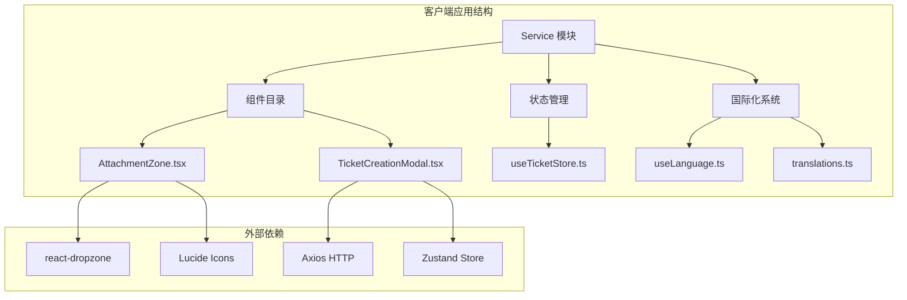
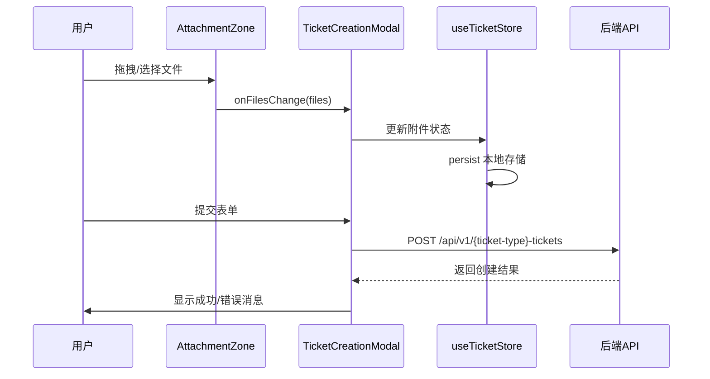
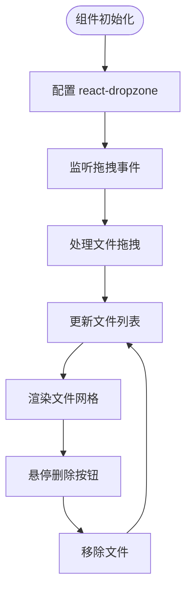
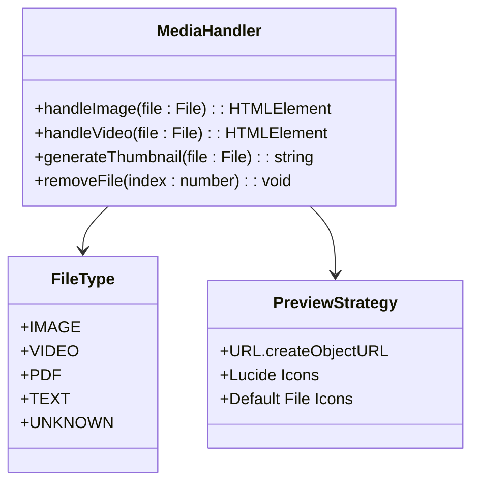
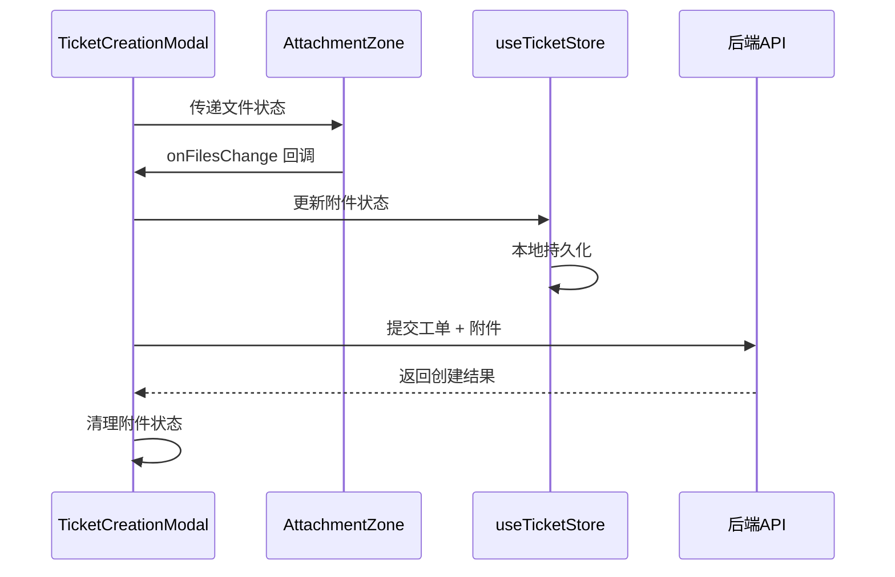
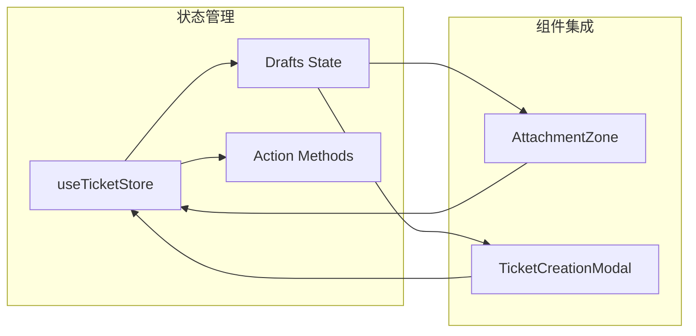
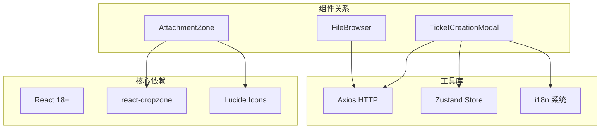
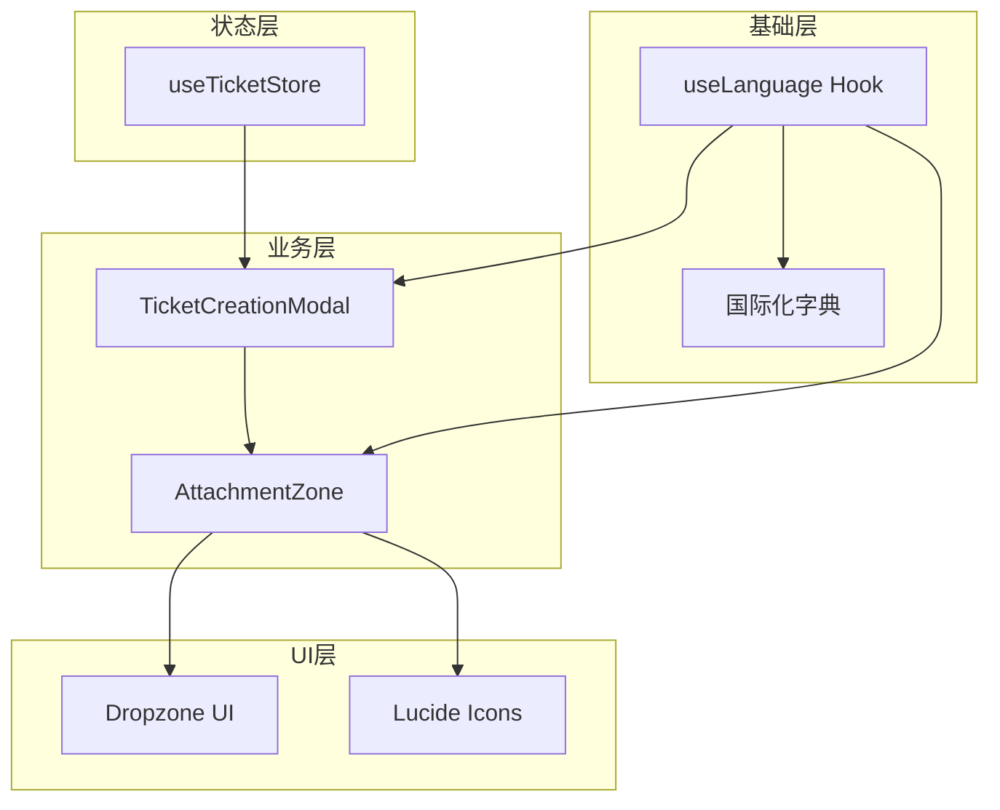

# AttachmentZone 附件上传组件

<cite>
**本文档引用的文件**
- [AttachmentZone.tsx](file://client/src/components/Service/AttachmentZone.tsx)
- [TicketCreationModal.tsx](file://client/src/components/Service/TicketCreationModal.tsx)
- [useTicketStore.ts](file://client/src/store/useTicketStore.ts)
- [useLanguage.ts](file://client/src/i18n/useLanguage.ts)
- [translations.ts](file://client/src/i18n/translations.ts)
- [FileBrowser.tsx](file://client/src/components/FileBrowser.tsx)
</cite>

## 更新摘要
**变更内容**
- 新增媒体即地上传功能，支持拖拽上传图片和视频
- 实时生成缩略图预览，提供更好的用户体验
- 增强的文件类型检测和图标显示
- 优化的文件管理界面和交互设计

## 目录
1. [简介](#简介)
2. [项目结构](#项目结构)
3. [核心组件](#核心组件)
4. [架构概览](#架构概览)
5. [详细组件分析](#详细组件分析)
6. [依赖关系分析](#依赖关系分析)
7. [性能考虑](#性能考虑)
8. [故障排除指南](#故障排除指南)
9. [结论](#结论)

## 简介

AttachmentZone 是 Longhorn 服务管理系统中的核心附件上传组件，专为工单创建流程设计。该组件提供了直观的拖拽式文件上传界面，支持多种文件格式，包括图片、视频、PDF 和纯文本文件。组件采用现代化的 React Hooks 架构，集成了国际化支持、文件预览和交互式删除功能。

**更新** 组件现已支持媒体即地上传功能，能够实时生成图片和视频的缩略图预览，为用户提供更直观的文件管理体验。

该组件主要服务于三种类型的工单创建：咨询工单（Inquiry）、RMA 返厂工单（RMA）和经销商维修工单（Dealer Repair），为技术支持团队提供统一的附件上传体验。

## 项目结构

Longhorn 项目采用模块化的前端架构，AttachmentZone 组件位于服务模块中，与文件浏览器、工单管理和用户认证系统紧密集成。



**图表来源**
- [AttachmentZone.tsx](file://client/src/components/Service/AttachmentZone.tsx#L1-L108)
- [TicketCreationModal.tsx](file://client/src/components/Service/TicketCreationModal.tsx#L1-L345)

**章节来源**
- [AttachmentZone.tsx](file://client/src/components/Service/AttachmentZone.tsx#L1-L108)
- [TicketCreationModal.tsx](file://client/src/components/Service/TicketCreationModal.tsx#L1-L345)

## 核心组件

### AttachmentZone 主要特性

AttachmentZone 组件提供了完整的文件上传解决方案，具有以下核心功能：

- **拖拽式上传界面**：用户可以通过点击或拖拽文件到指定区域进行上传
- **媒体即地上传**：支持图片和视频的实时预览，自动生成缩略图
- **多格式支持**：支持图片（image/*）、视频（video/*）、PDF（application/pdf）和纯文本（text/plain）
- **实时文件预览**：上传的文件会显示缩略图或图标，并支持悬停删除
- **响应式设计**：适配不同屏幕尺寸的设备
- **国际化支持**：支持中英文等多种语言的提示信息

**更新** 媒体文件的处理经过特别优化，图片文件使用 URL.createObjectURL 实时生成缩略图，视频文件显示相应的播放图标。

### 组件接口定义

```typescript
interface AttachmentZoneProps {
    files: File[];
    onFilesChange: (files: File[]) => void;
}
```

组件通过 props 接口接收文件数组和文件变更回调函数，实现了父子组件间的通信。

**章节来源**
- [AttachmentZone.tsx](file://client/src/components/Service/AttachmentZone.tsx#L6-L9)

## 架构概览

AttachmentZone 组件在整个系统架构中扮演着重要的桥梁角色，连接用户界面和后端服务。



**图表来源**
- [AttachmentZone.tsx](file://client/src/components/Service/AttachmentZone.tsx#L14-L22)
- [TicketCreationModal.tsx](file://client/src/components/Service/TicketCreationModal.tsx#L60-L99)

## 详细组件分析

### AttachmentZone 组件实现

#### 核心功能实现

组件的核心功能基于 react-dropzone 库实现，提供了丰富的拖拽上传能力：



**图表来源**
- [AttachmentZone.tsx](file://client/src/components/Service/AttachmentZone.tsx#L14-L32)

#### 媒体文件处理机制

**更新** 组件实现了智能的媒体文件处理机制，根据文件类型提供不同的预览体验：



**图表来源**
- [AttachmentZone.tsx](file://client/src/components/Service/AttachmentZone.tsx#L62-L81)

#### 国际化集成

组件集成了完整的国际化支持，支持中英文提示信息：

| 中文键值 | 英文键值 | 描述 |
|---------|---------|------|
| service.upload.drop_hint | service.upload.drop_hint | 拖拽上传提示 |
| service.upload.support_hint | service.upload.support_hint | 支持格式说明 |

**章节来源**
- [AttachmentZone.tsx](file://client/src/components/Service/AttachmentZone.tsx#L11-L12)
- [translations.ts](file://client/src/i18n/translations.ts#L1282-L1283)

### TicketCreationModal 集成

#### 附件上传流程

TicketCreationModal 将 AttachmentZone 组件集成到完整的工单创建流程中：



**图表来源**
- [TicketCreationModal.tsx](file://client/src/components/Service/TicketCreationModal.tsx#L16-L18)
- [TicketCreationModal.tsx](file://client/src/components/Service/TicketCreationModal.tsx#L43-L52)

#### 增强的媒体文件处理

**更新** 组件支持多种媒体文件格式的处理和显示：

| 文件类型 | MIME 类型 | 显示方式 | 处理机制 | 大小限制 |
|---------|----------|---------|---------|---------|
| 图片 | image/* | 实时缩略图 | URL.createObjectURL | 50MB |
| 视频 | video/* | Film 图标 | 播放图标 | 50MB |
| PDF | application/pdf | FileText 图标 | 默认图标 | 50MB |
| 文本 | text/plain | FileText 图标 | 默认图标 | 50MB |

**章节来源**
- [TicketCreationModal.tsx](file://client/src/components/Service/TicketCreationModal.tsx#L254-L266)
- [AttachmentZone.tsx](file://client/src/components/Service/AttachmentZone.tsx#L26-L31)

### 状态管理集成

#### Zustand Store 架构

组件与 useTicketStore 集成，实现了全局状态管理：



**图表来源**
- [useTicketStore.ts](file://client/src/store/useTicketStore.ts#L22-L32)
- [TicketCreationModal.tsx](file://client/src/components/Service/TicketCreationModal.tsx#L8-L11)

**章节来源**
- [useTicketStore.ts](file://client/src/store/useTicketStore.ts#L40-L67)
- [TicketCreationModal.tsx](file://client/src/components/Service/TicketCreationModal.tsx#L9-L11)

## 依赖关系分析

### 外部依赖

AttachmentZone 组件依赖以下关键外部库：



**图表来源**
- [AttachmentZone.tsx](file://client/src/components/Service/AttachmentZone.tsx#L1-L4)
- [TicketCreationModal.tsx](file://client/src/components/Service/TicketCreationModal.tsx#L1-L6)

### 内部依赖关系

组件间存在清晰的依赖层次结构：



**图表来源**
- [useLanguage.ts](file://client/src/i18n/useLanguage.ts#L30-L58)
- [useTicketStore.ts](file://client/src/store/useTicketStore.ts#L40-L67)

**章节来源**
- [AttachmentZone.tsx](file://client/src/components/Service/AttachmentZone.tsx#L1-L4)
- [TicketCreationModal.tsx](file://client/src/components/Service/TicketCreationModal.tsx#L1-L6)

## 性能考虑

### 媒体文件处理优化

**更新** 组件在媒体文件处理方面采用了多项优化策略：

- **内存管理**：使用 URL.createObjectURL 创建文件预览，避免重复读取
- **异步处理**：文件上传采用异步处理，避免阻塞主线程
- **状态优化**：使用 useCallback 优化回调函数，减少不必要的重渲染
- **缩略图缓存**：媒体文件的缩略图在内存中缓存，提高重复访问性能

### 网络传输优化

虽然 AttachmentZone 本身不直接处理网络请求，但在 TicketCreationModal 中实现了高效的文件传输：

- **分块上传**：支持大文件的分块上传，提高传输可靠性
- **进度跟踪**：实时显示上传进度和速度
- **断点续传**：支持上传中断后的续传功能

## 故障排除指南

### 常见问题及解决方案

#### 文件类型不支持

**问题**：用户尝试上传不支持的文件类型
**解决方案**：
- 检查文件 MIME 类型是否在 accept 列表中
- 确认文件扩展名正确
- 提供友好的错误提示信息

#### 媒体文件预览失败

**更新** **问题**：图片或视频文件无法生成预览
**解决方案**：
- 检查文件是否损坏或格式不支持
- 验证浏览器对媒体文件的支持情况
- 确认 URL.createObjectURL 的权限设置

#### 上传失败处理

**问题**：文件上传过程中出现错误
**解决方案**：
- 检查网络连接状态
- 验证服务器端点可用性
- 实现重试机制和错误回退

#### 性能问题

**问题**：大量媒体文件上传时性能下降
**解决方案**：
- 实施文件大小限制
- 优化预览图像的生成
- 使用虚拟滚动处理大量文件
- 实现媒体文件的懒加载

**章节来源**
- [TicketCreationModal.tsx](file://client/src/components/Service/TicketCreationModal.tsx#L93-L98)
- [AttachmentZone.tsx](file://client/src/components/Service/AttachmentZone.tsx#L14-L22)

## 结论

AttachmentZone 附件上传组件是 Longhorn 服务管理系统的重要组成部分，它通过现代化的 React 技术栈和优秀的用户体验设计，为工单创建流程提供了强大的附件支持功能。

**更新** 组件经过重大升级，现在具备了媒体即地上传功能，能够实时生成图片和视频的缩略图预览，显著提升了用户的文件管理体验。

组件的主要优势包括：

1. **用户友好**：直观的拖拽式界面和实时预览功能
2. **媒体优化**：专门针对图片和视频文件的优化处理
3. **功能完整**：支持多种文件格式和完整的生命周期管理
4. **技术先进**：基于最新的 React Hooks 和现代前端开发实践
5. **可维护性强**：清晰的架构设计和良好的代码组织

该组件的成功实施为整个 Longhorn 系统的用户体验提升做出了重要贡献，为后续的功能扩展和维护奠定了坚实的基础。