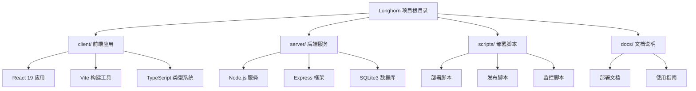
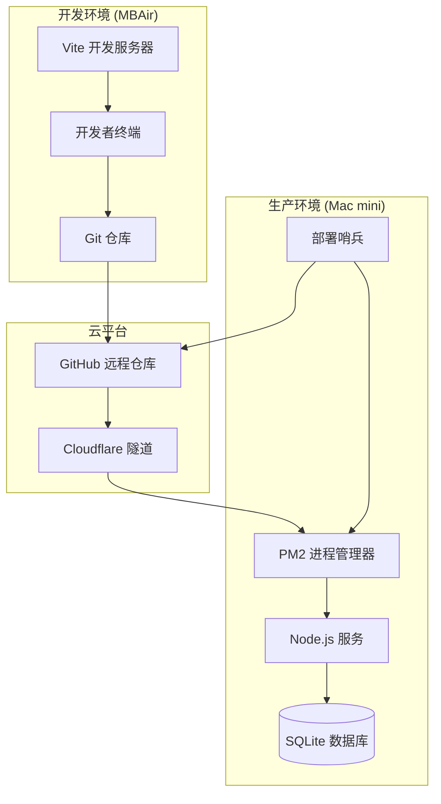
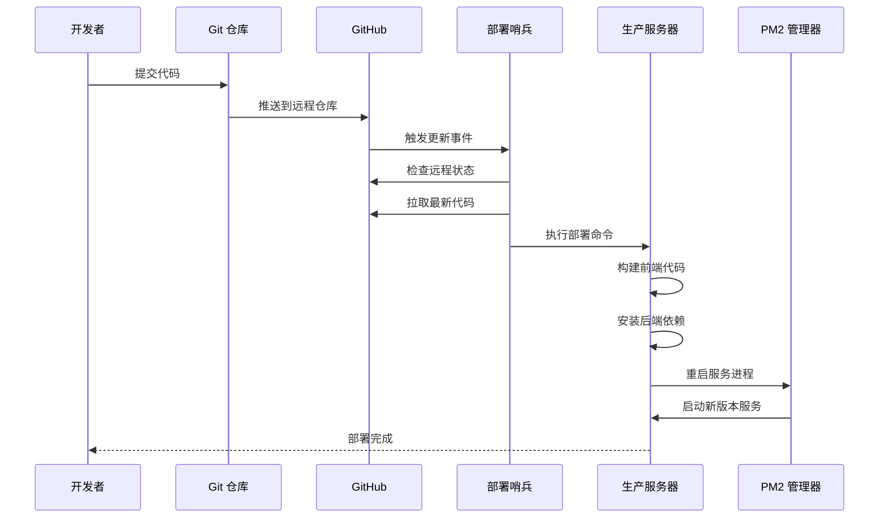
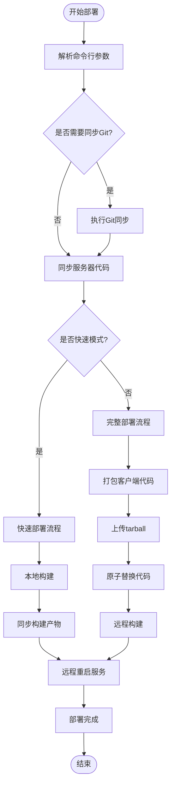
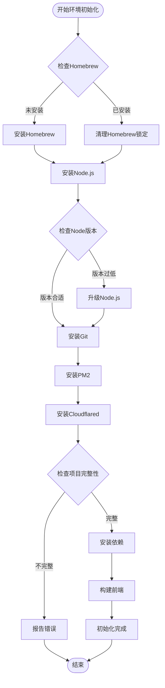
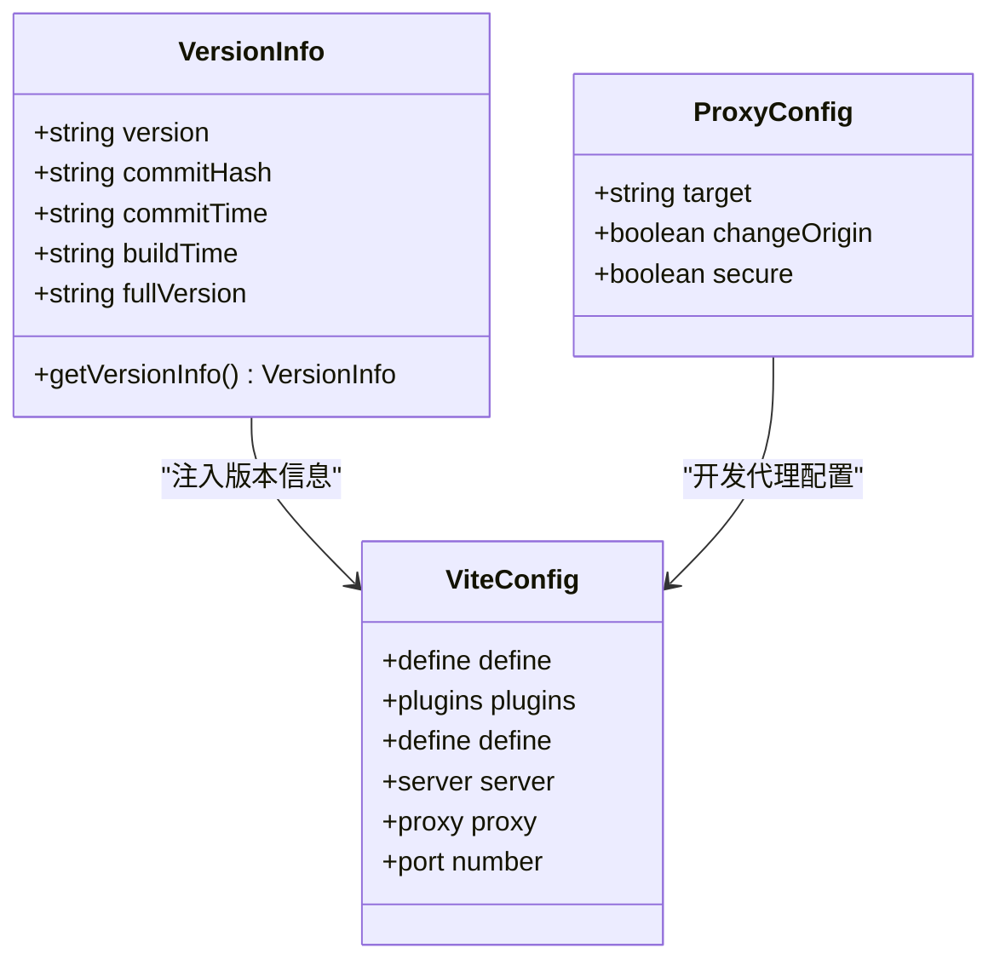
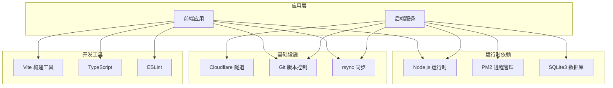
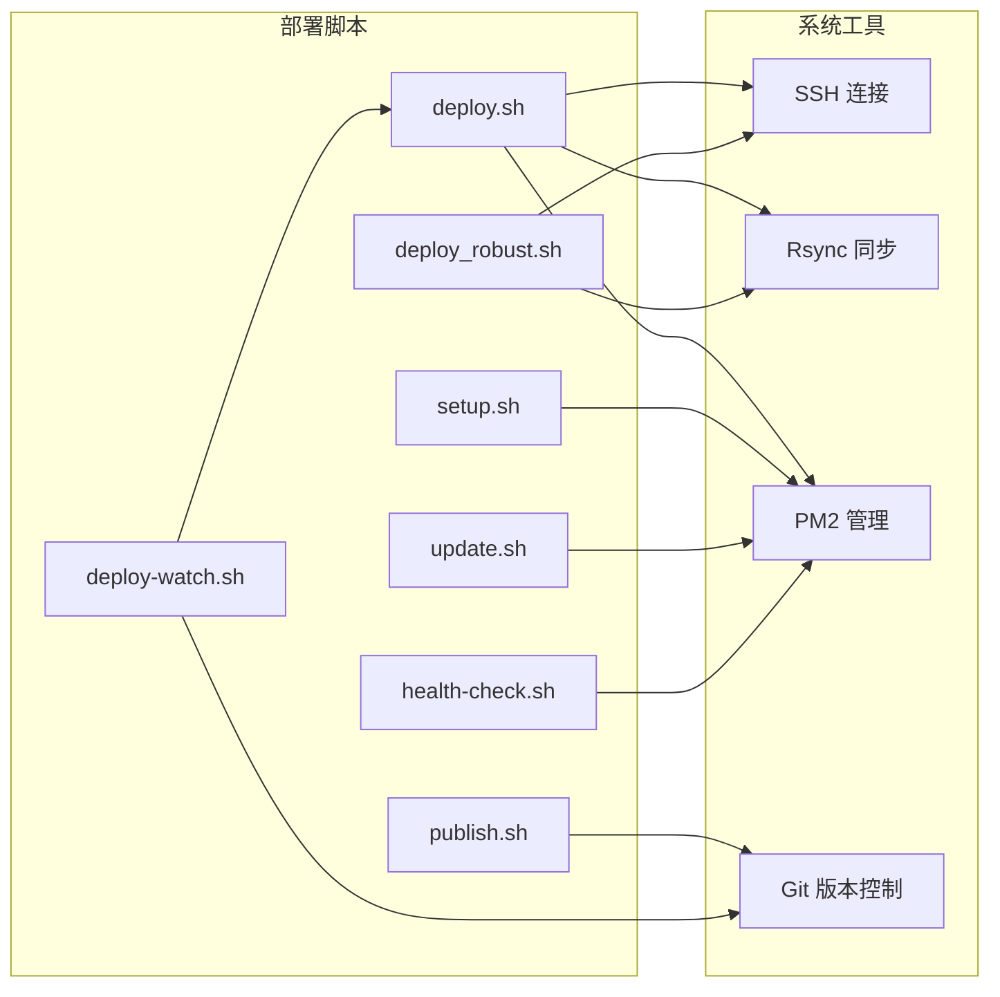

# 自动化部署

<cite>
**本文档引用的文件**
- [deploy.sh](file://scripts/deploy.sh)
- [deploy_robust.sh](file://scripts/deploy_robust.sh)
- [publish.sh](file://scripts/publish.sh)
- [setup.sh](file://scripts/setup.sh)
- [update.sh](file://scripts/update.sh)
- [deploy-watch.sh](file://scripts/deploy-watch.sh)
- [ecosystem.config.js](file://scripts/ecosystem.config.js)
- [health-check.sh](file://scripts/health-check.sh)
- [package.json](file://package.json)
- [client/package.json](file://client/package.json)
- [server/package.json](file://server/package.json)
- [vite.config.ts](file://client/vite.config.ts)
- [deployment.md](file://docs/deployment.md)
- [FULL_DEPLOYMENT_RECAP.md](file://docs/FULL_DEPLOYMENT_RECAP.md)
- [QUICK_DEPLOY.md](file://docs/QUICK_DEPLOY.md)
</cite>

## 目录
1. [简介](#简介)
2. [项目结构](#项目结构)
3. [核心组件](#核心组件)
4. [架构概览](#架构概览)
5. [详细组件分析](#详细组件分析)
6. [依赖关系分析](#依赖关系分析)
7. [性能考虑](#性能考虑)
8. [故障排除指南](#故障排除指南)
9. [结论](#结论)

## 简介

Longhorn 项目是一个基于 React + Node.js + SQLite 的现代化文档管理系统，采用了完整的自动化部署解决方案。该项目实现了从开发机到生产服务器的端到端自动化部署流程，包括一键发布、自动更新、健康检查等核心功能。

系统采用 Cloudflare 隧道实现全球访问，PM2 进程管理器确保服务稳定性，Git 作为版本控制和触发机制，实现了真正的"无人值守"自动化部署。

## 项目结构

Longhorn 项目采用前后端分离的架构设计，主要包含以下核心目录：

**图表来源**
- [package.json](file://package.json#L1-L14)
- [client/package.json](file://client/package.json#L1-L49)
- [server/package.json](file://server/package.json#L1-L39)

**章节来源**
- [package.json](file://package.json#L1-L14)
- [client/package.json](file://client/package.json#L1-L49)
- [server/package.json](file://server/package.json#L1-L39)

## 核心组件

### 部署脚本系统

Longhorn 项目提供了多个专门的部署脚本来满足不同的部署需求：

#### 快速部署脚本 (deploy.sh)
- **功能特性**：支持快速模式和完整模式两种部署方式
- **快速模式**：本地构建 + 远程同步，约10秒完成部署
- **完整模式**：原子化 tarball 部署，确保部署一致性
- **智能同步**：使用 rsync 进行增量同步，排除不必要的文件

#### 稳健部署脚本 (deploy_robust.sh)
- **设计目的**：无压缩、带暂停的稳健部署模式
- **适用场景**：网络不稳定或需要更可靠的部署过程
- **增强稳定性**：在关键步骤之间添加延迟，提高成功率

#### 发布脚本 (publish.sh)
- **自动化发布**：自动更新日志、记录版本哈希并推送到远程仓库
- **Git 集成**：完整的 Git 工作流程集成
- **版本追踪**：生成详细的版本信息和时间戳

**章节来源**
- [deploy.sh](file://scripts/deploy.sh#L1-L167)
- [deploy_robust.sh](file://scripts/deploy_robust.sh#L1-L68)
- [publish.sh](file://scripts/publish.sh#L1-L60)

### 环境初始化系统

#### 设置脚本 (setup.sh)
- **自动化环境配置**：一键安装和配置生产环境所需的所有工具
- **Homebrew 管理**：智能处理 Homebrew 锁定和缓存问题
- **依赖安装**：自动安装 Node.js、Git、PM2、Cloudflared 等核心组件
- **项目完整性检查**：验证项目结构的完整性

#### 更新脚本 (update.sh)
- **服务器端更新**：在生产服务器上执行的更新脚本
- **集群模式支持**：支持 PM2 集群模式的进程管理
- **自动重启**：自动停止旧进程并启动新进程

**章节来源**
- [setup.sh](file://scripts/setup.sh#L1-L112)
- [update.sh](file://scripts/update.sh#L1-L33)

### 监控和维护工具

#### 健康检查脚本 (health-check.sh)
- **多服务监控**：检查后端服务和前端服务的运行状态
- **数据库完整性**：自动检查和修复数据库结构问题
- **自动恢复**：支持自动启动停止的服务

#### 自动部署哨兵 (deploy-watch.sh)
- **持续监控**：每60秒检查远程仓库的更新状态
- **自动部署**：检测到更新后自动执行部署流程
- **无人值守**：实现真正的自动化部署体验

**章节来源**
- [health-check.sh](file://scripts/health-check.sh#L1-L115)
- [deploy-watch.sh](file://scripts/deploy-watch.sh#L1-L34)

## 架构概览

Longhorn 的自动化部署架构采用了分层设计，实现了开发、测试、生产的完整自动化流程：

**图表来源**
- [FULL_DEPLOYMENT_RECAP.md](file://docs/FULL_DEPLOYMENT_RECAP.md#L1-L144)
- [ecosystem.config.js](file://scripts/ecosystem.config.js#L1-L41)

### 核心部署流程

**图表来源**
- [deploy-watch.sh](file://scripts/deploy-watch.sh#L8-L33)
- [deploy.sh](file://scripts/deploy.sh#L70-L91)

**章节来源**
- [FULL_DEPLOYMENT_RECAP.md](file://docs/FULL_DEPLOYMENT_RECAP.md#L1-L144)
- [deployment.md](file://docs/deployment.md#L1-L111)

## 详细组件分析

### 部署脚本深度分析

#### 快速部署脚本 (deploy.sh) 核心逻辑

**图表来源**
- [deploy.sh](file://scripts/deploy.sh#L25-L161)

#### 完整部署模式详细流程

完整部署模式通过原子化操作确保部署的一致性和可靠性：

1. **代码打包**：创建包含客户端代码的 tarball
2. **远程传输**：将 tarball 上传到生产服务器
3. **原子替换**：使用临时备份确保部署过程的原子性
4. **远程构建**：在服务器上执行完整的构建流程
5. **服务重启**：使用 PM2 管理器优雅重启服务

**章节来源**
- [deploy.sh](file://scripts/deploy.sh#L94-L161)

### 环境初始化系统

#### setup.sh 智能环境配置

setup.sh 脚本实现了高度智能化的环境初始化：

**图表来源**
- [setup.sh](file://scripts/setup.sh#L37-L104)

**章节来源**
- [setup.sh](file://scripts/setup.sh#L1-L112)

### 进程管理配置

#### PM2 集群配置分析

ecosystem.config.js 提供了生产级别的进程管理配置：

| 配置项 | 值 | 说明 |
|--------|-----|------|
| `instances` | `'max'` | 使用所有可用CPU核心（M1 Mac Mini为8核） |
| `exec_mode` | `'cluster'` | 集群模式，提高并发处理能力 |
| `autorestart` | `true` | 自动重启，提高系统稳定性 |
| `max_memory_restart` | `'500M'` | 内存限制，防止内存泄漏 |
| `PORT` | `4000` | 服务监听端口 |
| `NODE_ENV` | `'production'` | 生产环境配置 |

**章节来源**
- [ecosystem.config.js](file://scripts/ecosystem.config.js#L1-L41)

### 前端构建配置

#### Vite 构建系统

vite.config.ts 实现了智能的版本管理和开发服务器配置：

**图表来源**
- [vite.config.ts](file://client/vite.config.ts#L11-L62)
- [vite.config.ts](file://client/vite.config.ts#L80-L91)

**章节来源**
- [vite.config.ts](file://client/vite.config.ts#L1-L94)

## 依赖关系分析

### 核心依赖层次

**图表来源**
- [client/package.json](file://client/package.json#L12-L33)
- [server/package.json](file://server/package.json#L15-L37)
- [package.json](file://package.json#L4-L13)

### 部署脚本依赖关系

**图表来源**
- [deploy.sh](file://scripts/deploy.sh#L55-L91)
- [deploy_robust.sh](file://scripts/deploy_robust.sh#L47-L67)
- [deploy-watch.sh](file://scripts/deploy-watch.sh#L20-L25)

**章节来源**
- [client/package.json](file://client/package.json#L12-L33)
- [server/package.json](file://server/package.json#L15-L37)
- [package.json](file://package.json#L4-L13)

## 性能考虑

### 部署性能优化

Longhorn 项目在部署性能方面采用了多项优化策略：

#### 快速部署模式优势
- **本地构建**：前端构建在开发机上完成，减少服务器负载
- **增量同步**：使用 rsync 进行增量文件同步，避免全量传输
- **并行处理**：构建和同步操作可以并行执行
- **智能排除**：排除不必要的文件和目录，减少传输时间

#### 完整部署模式保障
- **原子操作**：确保部署过程的原子性，避免部分更新问题
- **缓存管理**：智能管理 node_modules 缓存，提高后续部署速度
- **回滚机制**：通过备份机制实现快速回滚

### 运行时性能配置

#### PM2 集群模式
- **多核利用**：充分利用 M1 Mac Mini 的8核处理器
- **内存管理**：设置合理的内存限制，防止内存泄漏
- **自动重启**：配置自动重启策略，提高系统稳定性

#### 健康检查机制
- **端口监控**：实时监控服务端口状态
- **数据库检查**：定期检查数据库结构完整性
- **自动恢复**：支持自动启动停止的服务

**章节来源**
- [deploy.sh](file://scripts/deploy.sh#L5-L7)
- [ecosystem.config.js](file://scripts/ecosystem.config.js#L7-L22)
- [health-check.sh](file://scripts/health-check.sh#L14-L52)

## 故障排除指南

### 常见部署问题

#### Git 相关问题
| 问题类型 | 症状 | 解决方案 |
|----------|------|----------|
| PAT 令牌认证失败 | `Invalid username or token` | 使用 Personal Access Token 替代密码 |
| Git 拉取超时 | 连接不稳定 | 检查网络连接和代理设置 |
| 分支冲突 | 合并失败 | 使用 `git reset --hard HEAD` 清理本地修改 |

#### 服务器部署问题
| 问题类型 | 症状 | 解决方案 |
|----------|------|----------|
| 权限不足 | rsync 失败 | 检查 SSH 密钥配置和文件权限 |
| 端口占用 | 服务启动失败 | 使用 `lsof -i :4000` 查找占用进程 |
| 内存不足 | 构建失败 | 清理缓存或增加系统内存 |

#### 服务运行问题
| 问题类型 | 症状 | 解决方案 |
|----------|------|----------|
| PM2 进程崩溃 | 服务不可用 | 使用 `pm2 logs longhorn` 查看错误日志 |
| 数据库连接失败 | API 请求超时 | 检查 SQLite 文件权限和磁盘空间 |
| 前端资源加载失败 | 页面空白 | 检查构建产物和静态资源路径 |

### 监控和诊断工具

#### 健康检查脚本功能
- **多服务状态检查**：同时检查后端和前端服务状态
- **数据库完整性验证**：自动检测和修复数据库结构问题
- **自动服务恢复**：支持自动启动停止的服务
- **交互式操作**：提供确认机制，避免误操作

#### 日志管理
- **PM2 日志**：使用 `pm2 logs` 查看实时日志
- **应用日志**：检查 `server/server.log` 文件
- **部署日志**：查看部署脚本的输出信息

**章节来源**
- [health-check.sh](file://scripts/health-check.sh#L1-L115)
- [deployment.md](file://docs/deployment.md#L59-L111)

## 结论

Longhorn 项目的自动化部署系统展现了现代软件工程的最佳实践，实现了从开发到生产的完整自动化流程。通过精心设计的脚本系统、智能的环境配置和完善的监控机制，该项目为类似的企业级应用提供了一个可复制的部署模板。

### 主要优势

1. **高度自动化**：从代码提交到服务上线的全流程自动化
2. **多模式部署**：支持快速部署和完整部署两种模式
3. **智能监控**：实时监控服务状态和自动恢复机制
4. **版本追踪**：完整的版本信息和变更记录
5. **环境隔离**：开发环境和生产环境的严格分离

### 技术亮点

- **Cloudflare 隧道**：实现安全的全球访问
- **PM2 集群**：充分利用硬件资源
- **Git 驱动**：以版本控制为核心的操作流程
- **原子部署**：确保部署过程的可靠性和一致性

这个部署系统不仅提高了开发效率，更重要的是建立了可持续的运维体系，为项目的长期发展奠定了坚实基础。