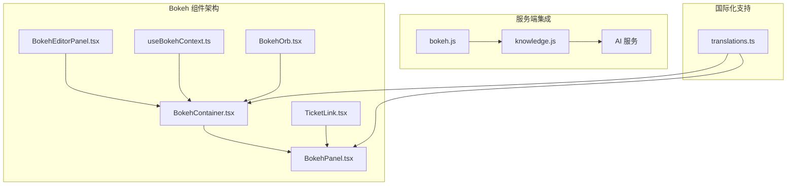
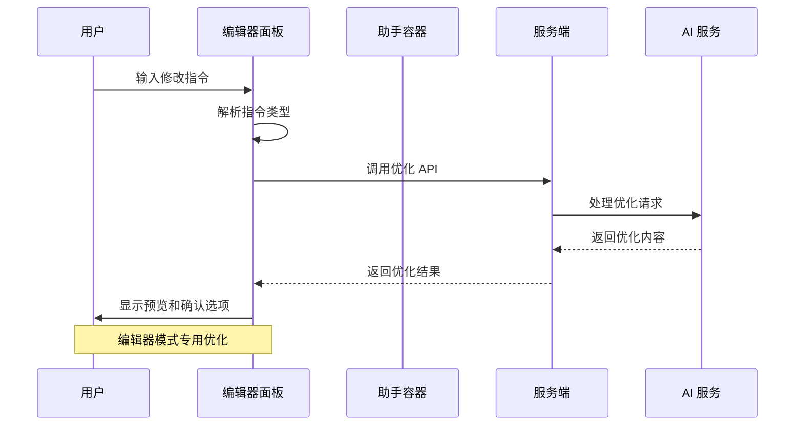
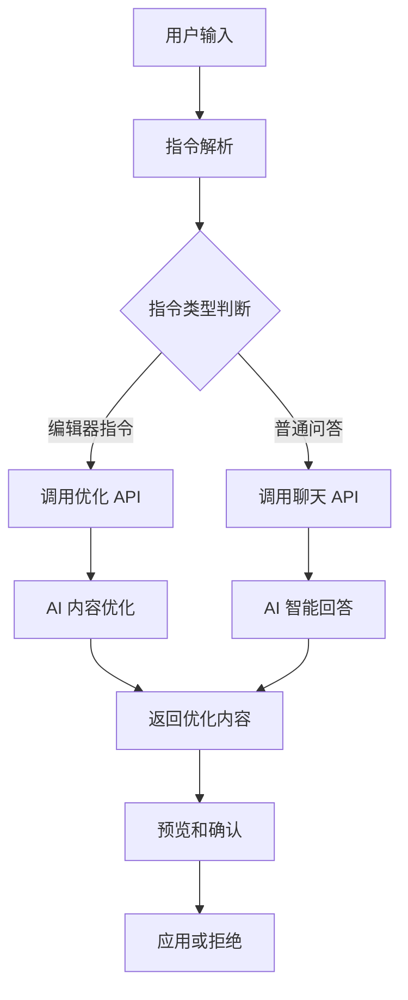
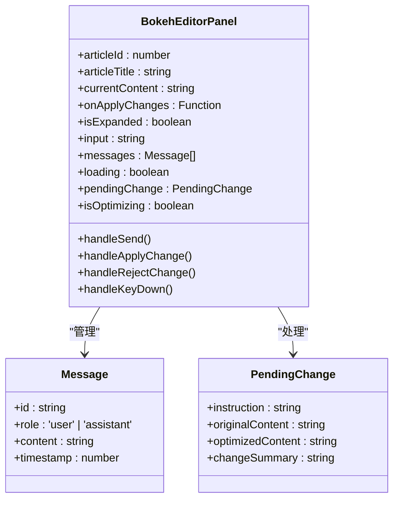
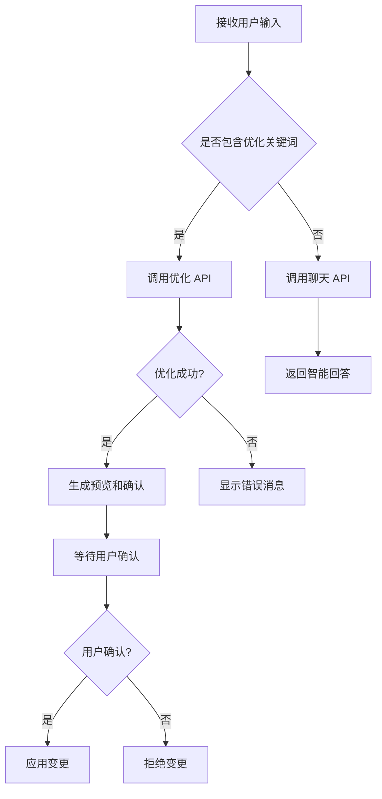
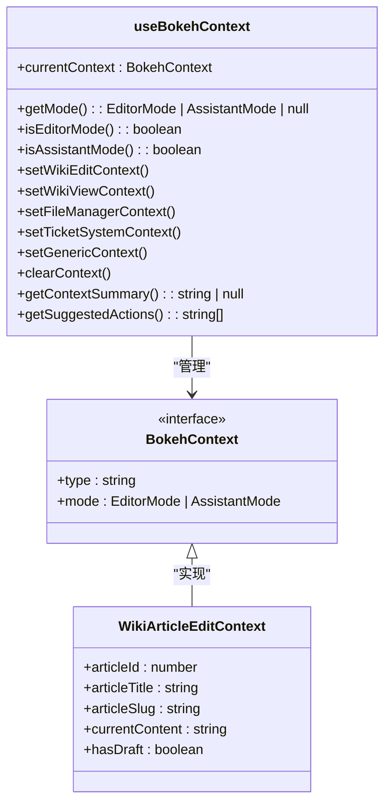
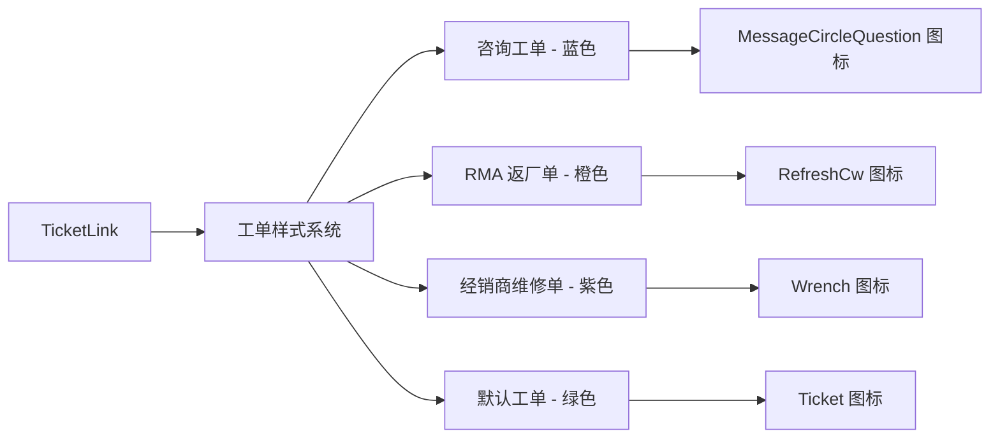
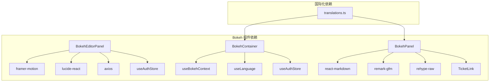
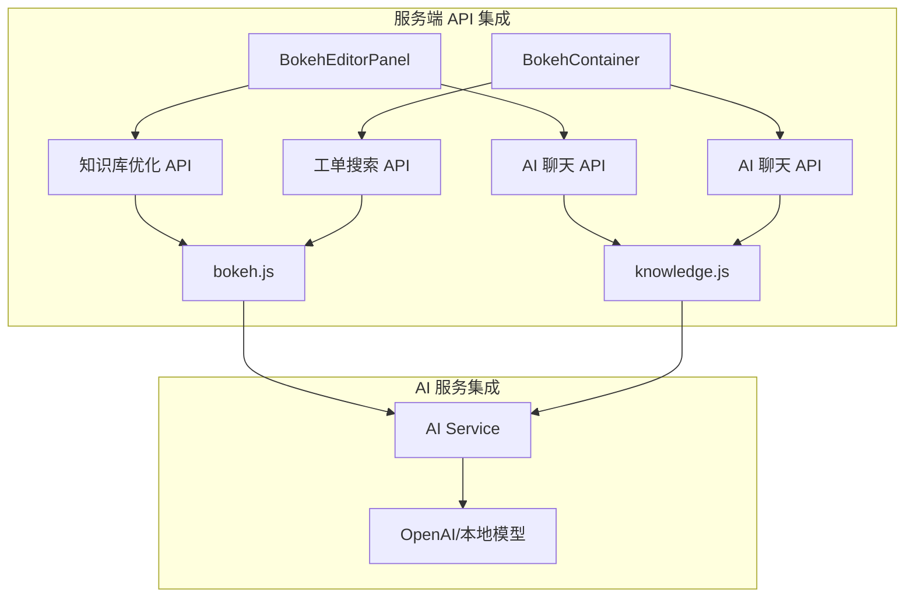
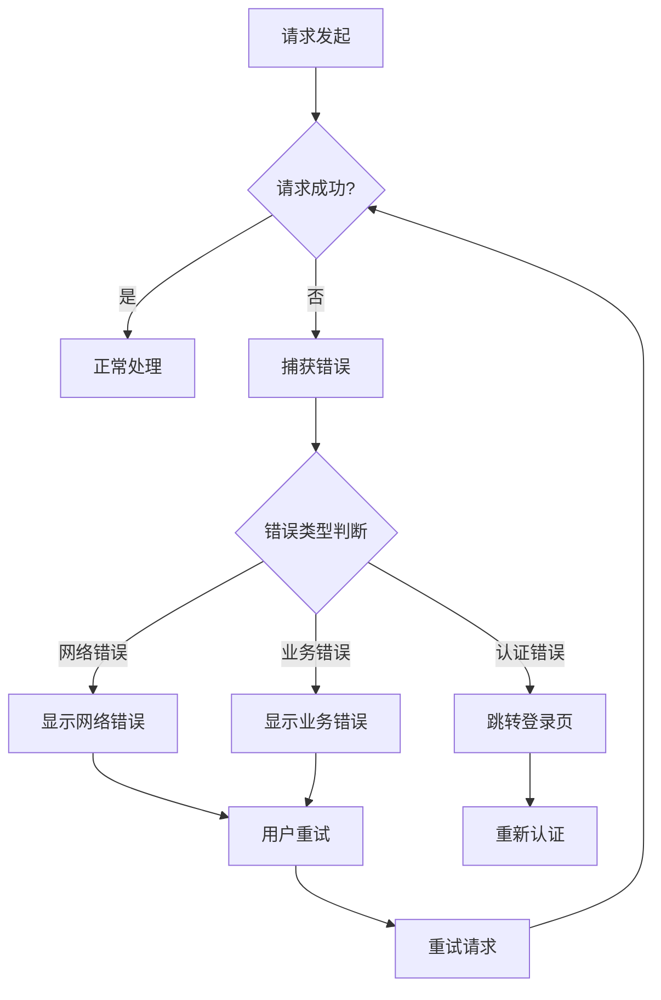

# Bokeh 编辑器面板组件

<cite>
**本文档引用的文件**
- [BokehEditorPanel.tsx](file://client/src/components/Bokeh/BokehEditorPanel.tsx)
- [BokehContainer.tsx](file://client/src/components/Bokeh/BokehContainer.tsx)
- [BokehPanel.tsx](file://client/src/components/Bokeh/BokehPanel.tsx)
- [useBokehContext.ts](file://client/src/store/useBokehContext.ts)
- [BokehOrb.tsx](file://client/src/components/Bokeh/BokehOrb.tsx)
- [TicketLink.tsx](file://client/src/components/Bokeh/TicketLink.tsx)
- [bokeh.js](file://server/service/routes/bokeh.js)
- [knowledge.js](file://server/service/routes/knowledge.js)
- [App.tsx](file://client/src/App.tsx)
- [translations.ts](file://client/src/i18n/translations.ts)
</cite>

## 目录
1. [简介](#简介)
2. [项目结构](#项目结构)
3. [核心组件](#核心组件)
4. [架构概览](#架构概览)
5. [详细组件分析](#详细组件分析)
6. [依赖关系分析](#依赖关系分析)
7. [性能考虑](#性能考虑)
8. [故障排除指南](#故障排除指南)
9. [结论](#结论)

## 简介

Bokeh 编辑器面板组件是 Longhorn 项目中的一个智能化编辑辅助系统，专门为 Wiki 编辑器提供 AI 驱动的内容优化和修改功能。该组件采用浮动面板设计，提供直观的编辑器内嵌助手，支持实时内容优化、格式调整和智能建议。

该系统的核心特点包括：
- 编辑器内嵌的 Bokeh 助手面板
- 支持多种内容优化指令（排版、格式、图片调整等）
- 实时 AI 内容优化和预览功能
- 上下文感知的智能建议
- 无缝集成的知识库优化功能

## 项目结构

Bokeh 编辑器面板组件位于客户端的 Bokeh 目录中，采用模块化设计，包含以下主要文件：

**图表来源**
- [BokehEditorPanel.tsx:1-550](file://client/src/components/Bokeh/BokehEditorPanel.tsx#L1-L550)
- [BokehContainer.tsx:1-167](file://client/src/components/Bokeh/BokehContainer.tsx#L1-L167)
- [BokehPanel.tsx:1-724](file://client/src/components/Bokeh/BokehPanel.tsx#L1-L724)

**章节来源**
- [BokehEditorPanel.tsx:1-550](file://client/src/components/Bokeh/BokehEditorPanel.tsx#L1-L550)
- [BokehContainer.tsx:1-167](file://client/src/components/Bokeh/BokehContainer.tsx#L1-L167)
- [BokehPanel.tsx:1-724](file://client/src/components/Bokeh/BokehPanel.tsx#L1-L724)

## 核心组件

### BokehEditorPanel - 编辑器内嵌助手

BokehEditorPanel 是专门针对 Wiki 编辑器设计的内嵌助手组件，提供实时的内容优化功能：

**主要功能特性：**
- 底部栏按钮触发的浮动面板设计
- 快速操作建议（优化排版、检查格式、精简内容）
- 实时内容优化和预览
- 智能指令识别和处理
- 与编辑器的双向数据交互

**技术实现要点：**
- 使用 Framer Motion 提供流畅的动画效果
- 支持键盘快捷键（⌘+Enter 发送）
- 内置点击外部自动关闭功能
- 集成认证令牌的安全机制

### BokehContainer - 全局助手容器

BokehContainer 作为全局的助手容器，提供完整的聊天界面和上下文管理：

**核心功能：**
- 全局快捷键触发（Cmd+K / Ctrl+K）
- 拖拽和调整大小的浮动面板
- 上下文感知的内容优化
- 智能建议和操作指导

**上下文管理系统：**
- Wiki 文章编辑上下文
- Wiki 文章浏览上下文
- 文件管理器上下文
- 工单系统上下文
- 通用页面上下文

### BokehPanel - 主要聊天界面

BokehPanel 提供完整的聊天体验，支持多种交互模式：

**界面特性：**
- 可拖拽的浮动窗口设计
- 支持调整大小的面板
- Markdown 格式支持
- 工单链接的智能解析和展示

**交互功能：**
- 实时消息滚动
- 输入验证和处理
- 加载状态指示
- 快速操作建议

**章节来源**
- [BokehEditorPanel.tsx:38-550](file://client/src/components/Bokeh/BokehEditorPanel.tsx#L38-L550)
- [BokehContainer.tsx:17-167](file://client/src/components/Bokeh/BokehContainer.tsx#L17-L167)
- [BokehPanel.tsx:117-724](file://client/src/components/Bokeh/BokehPanel.tsx#L117-L724)

## 架构概览

Bokeh 编辑器面板组件采用分层架构设计，实现了客户端组件与服务端 API 的无缝集成：

**图表来源**
- [BokehEditorPanel.tsx:60-182](file://client/src/components/Bokeh/BokehEditorPanel.tsx#L60-L182)
- [knowledge.js:2561-2712](file://server/service/routes/knowledge.js#L2561-L2712)

### 数据流架构

**图表来源**
- [BokehEditorPanel.tsx:90-168](file://client/src/components/Bokeh/BokehEditorPanel.tsx#L90-L168)
- [BokehContainer.tsx:50-138](file://client/src/components/Bokeh/BokehContainer.tsx#L50-L138)

**章节来源**
- [useBokehContext.ts:94-252](file://client/src/store/useBokehContext.ts#L94-L252)
- [bokeh.js:1-619](file://server/service/routes/bokeh.js#L1-L619)

## 详细组件分析

### BokehEditorPanel 组件深度分析

BokehEditorPanel 是编辑器内嵌的核心组件，专为 Wiki 编辑器优化而设计：

#### 核心数据结构

**图表来源**
- [BokehEditorPanel.tsx:17-36](file://client/src/components/Bokeh/BokehEditorPanel.tsx#L17-L36)

#### 快速操作建议系统

组件内置了针对正文内容的快速操作建议：

| 操作类型 | 示例指令 | 功能描述 |
|---------|---------|----------|
| 排版优化 | "优化排版" | 改善内容格式和结构 |
| 格式检查 | "检查格式" | 修复格式问题 |
| 内容精简 | "精简内容" | 删除冗余部分 |

#### 指令识别和处理流程

**图表来源**
- [BokehEditorPanel.tsx:90-142](file://client/src/components/Bokeh/BokehEditorPanel.tsx#L90-L142)

**章节来源**
- [BokehEditorPanel.tsx:54-182](file://client/src/components/Bokeh/BokehEditorPanel.tsx#L54-L182)

### BokehContainer 和 BokehPanel 组件分析

#### 上下文感知系统

useBokehContext 存储管理器提供了强大的上下文感知能力：

**图表来源**
- [useBokehContext.ts:67-92](file://client/src/store/useBokehContext.ts#L67-L92)

#### 国际化支持

组件全面支持多语言国际化：

| 功能类别 | 中文键名 | 英文翻译 |
|---------|---------|----------|
| 悬浮提示 | bokeh.orb.tooltip | Ask Bokeh (⌘K) |
| 欢迎消息 | bokeh.welcome | 有什么我可以帮您的？ |
| 连接错误 | bokeh.error.connection | 无法连接服务器，请检查网络连接。 |
| 编辑上下文 | bokeh.context.editing | 正在编辑文章 |
| 输入提示 | bokeh.input.editor_hint | 输入修改指令，如：把标题改为黄色... |

**章节来源**
- [useBokehContext.ts:185-251](file://client/src/store/useBokehContext.ts#L185-L251)
- [translations.ts:1861-1918](file://client/src/i18n/translations.ts#L1861-L1918)

### TicketLink 组件分析

TicketLink 组件提供了工单链接的智能解析和展示功能：

#### 工单类型样式系统

**图表来源**
- [TicketLink.tsx:10-52](file://client/src/components/Bokeh/TicketLink.tsx#L10-L52)

#### 工单链接解析算法

组件支持两种工单链接格式：

1. **复杂格式**：`[K2602-0001|123|inquiry]`
   - 第一部分：工单编号
   - 第二部分：工单 ID
   - 第三部分：工单类型

2. **简单格式**：`[RMA-D-2601-0004]`
   - 自动识别工单类型（RMA、SVC 等）

**章节来源**
- [TicketLink.tsx:112-167](file://client/src/components/Bokeh/TicketLink.tsx#L112-L167)

## 依赖关系分析

### 客户端依赖关系

**图表来源**
- [BokehEditorPanel.tsx:8-15](file://client/src/components/Bokeh/BokehEditorPanel.tsx#L8-L15)
- [BokehPanel.tsx:1-8](file://client/src/components/Bokeh/BokehPanel.tsx#L1-L8)

### 服务端集成依赖

**图表来源**
- [knowledge.js:2556-2712](file://server/service/routes/knowledge.js#L2556-L2712)
- [bokeh.js:23-249](file://server/service/routes/bokeh.js#L23-L249)

**章节来源**
- [App.tsx:71-165](file://client/src/App.tsx#L71-L165)

## 性能考虑

### 前端性能优化

1. **组件懒加载**：Bokeh 组件采用按需加载策略，减少初始包体积
2. **状态管理优化**：使用 Zustand 进行轻量级状态管理
3. **渲染优化**：使用 React.memo 和 useMemo 优化重新渲染
4. **动画性能**：Framer Motion 提供硬件加速的动画效果

### 后端性能优化

1. **数据库索引优化**：工单搜索使用 FTS5 全文搜索引擎
2. **缓存策略**：AI 生成内容的智能缓存机制
3. **并发处理**：异步处理多个优化请求
4. **资源限制**：AI 请求的超时和重试机制

## 故障排除指南

### 常见问题和解决方案

| 问题类型 | 症状 | 解决方案 |
|---------|------|----------|
| 认证失败 | 无法发送消息 | 检查用户令牌有效性 |
| 优化失败 | AI 服务不可用 | 验证 AI 服务配置 |
| 搜索无结果 | 工单搜索失败 | 检查数据库连接 |
| 格式错误 | 内容显示异常 | 验证 HTML 格式 |

### 错误处理机制

组件提供了完善的错误处理机制：

**图表来源**
- [BokehEditorPanel.tsx:169-181](file://client/src/components/Bokeh/BokehEditorPanel.tsx#L169-L181)

**章节来源**
- [BokehEditorPanel.tsx:169-181](file://client/src/components/Bokeh/BokehEditorPanel.tsx#L169-L181)

## 结论

Bokeh 编辑器面板组件是一个功能完善、架构清晰的智能化编辑辅助系统。它通过以下关键特性为用户提供卓越的编辑体验：

1. **无缝集成**：与现有 Wiki 编辑器完美集成，提供透明的优化体验
2. **智能优化**：基于 AI 的内容优化和格式调整功能
3. **上下文感知**：根据不同的编辑场景提供针对性的建议和工具
4. **用户体验**：直观的浮动面板设计和流畅的交互体验
5. **扩展性**：模块化的架构设计便于功能扩展和维护

该组件系统展现了现代前端开发的最佳实践，包括组件化设计、状态管理、国际化支持和性能优化等方面。通过合理的架构设计和实现细节，Bokeh 编辑器面板为 Longhorn 项目提供了强大的内容创作和编辑能力。