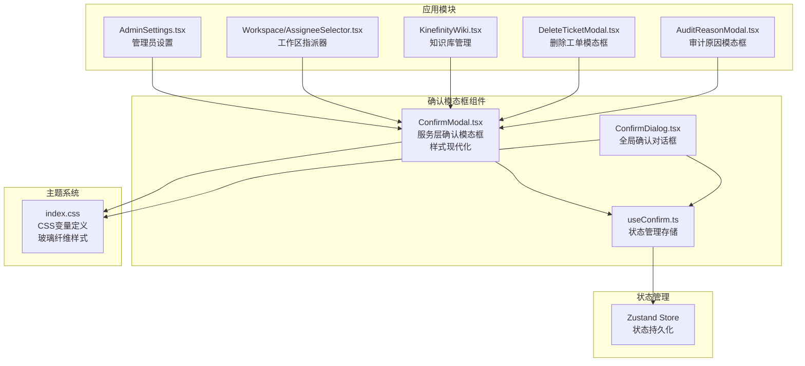
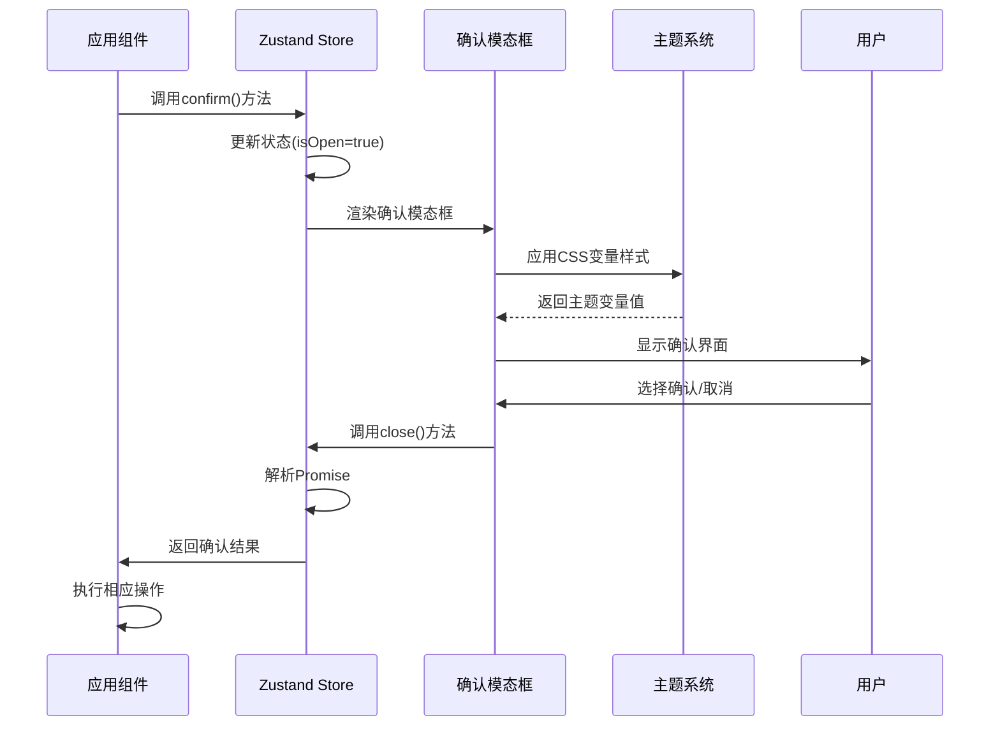
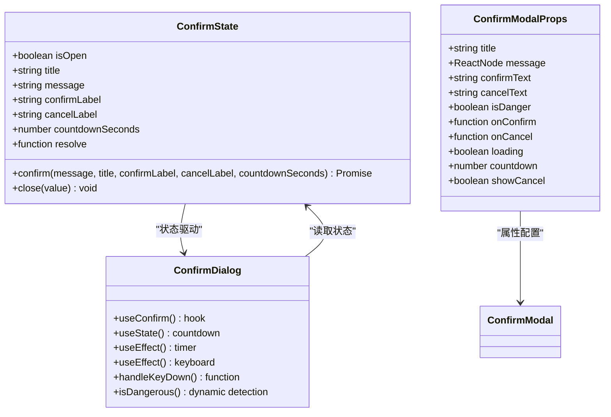
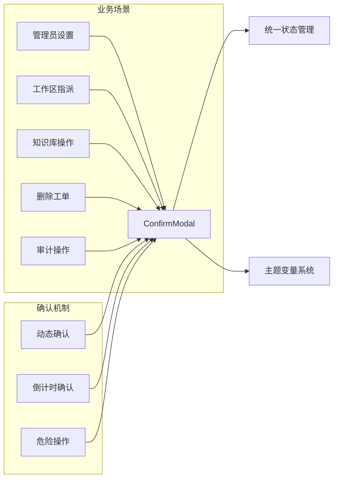
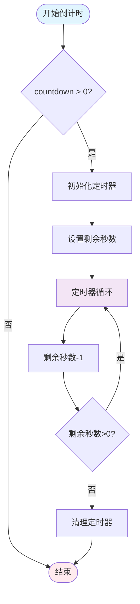
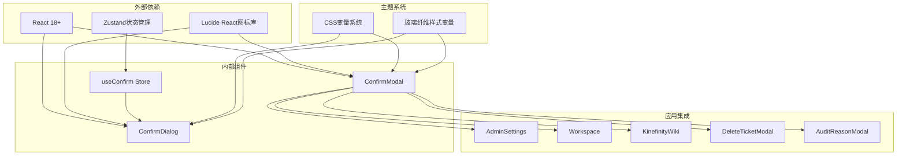

# 确认模态框增强功能文档

<cite>
**本文档引用的文件**
- [ConfirmModal.tsx](file://client/src/components/Service/ConfirmModal.tsx)
- [useConfirm.ts](file://client/src/store/useConfirm.ts)
- [ConfirmDialog.tsx](file://client/src/components/ConfirmDialog.tsx)
- [AdminSettings.tsx](file://client/src/components/Admin/AdminSettings.tsx)
- [AssigneeSelector.tsx](file://client/src/components/Workspace/AssigneeSelector.tsx)
- [KinefinityWiki.tsx](file://client/src/components/KinefinityWiki.tsx)
- [DeleteTicketModal.tsx](file://client/src/components/Service/DeleteTicketModal.tsx)
- [AuditReasonModal.tsx](file://client/src/components/Service/AuditReasonModal.tsx)
- [index.css](file://client/src/index.css)
</cite>

## 更新摘要
**所做更改**
- 更新了ConfirmModal组件的样式现代化实现，使用一致的玻璃纤维边框和文本颜色变量
- 改进了视觉效果和主题适配的一致性
- 优化了组件间的样式协调和主题变量使用
- 增强了倒计时机制的视觉反馈和交互体验

## 目录
1. [简介](#简介)
2. [项目结构概览](#项目结构概览)
3. [核心组件分析](#核心组件分析)
4. [架构设计](#架构设计)
5. [详细组件分析](#详细组件分析)
6. [依赖关系分析](#依赖关系分析)
7. [性能考虑](#性能考虑)
8. [故障排除指南](#故障排除指南)
9. [总结](#总结)

## 简介

确认模态框增强功能是Longhorn项目中的一个重要UI组件改进，旨在提供更加丰富和用户友好的确认交互体验。该功能通过引入倒计时机制、危险操作标识、以及多种确认模式，显著提升了系统的安全性和用户体验。

**更新亮点**：本次更新重点实现了ConfirmModal组件的样式现代化，采用统一的玻璃纤维边框和文本颜色变量，确保了视觉效果的一致性和主题适配的完整性。

本功能主要包含两个核心组件：
- **ConfirmModal**: 服务层专用的确认模态框，支持倒计时和加载状态，现已实现样式现代化
- **ConfirmDialog**: 全局确认对话框，基于Zustand状态管理

这些组件被广泛应用于项目的各个功能模块，包括工单管理、知识库操作、系统设置等关键业务场景。

## 项目结构概览

确认模态框功能在项目中的组织结构如下：

**图表来源**
- [ConfirmModal.tsx:1-109](file://client/src/components/Service/ConfirmModal.tsx#L1-L109)
- [ConfirmDialog.tsx:1-198](file://client/src/components/ConfirmDialog.tsx#L1-L198)
- [useConfirm.ts:1-42](file://client/src/store/useConfirm.ts#L1-L42)
- [index.css:1-2404](file://client/src/index.css#L1-L2404)

## 核心组件分析

### ConfirmModal组件

ConfirmModal是服务层专用的确认模态框组件，经过样式现代化更新后具有以下核心特性：

**主要功能特性：**
- 支持倒计时确认机制（countdown参数）
- 危险操作视觉标识（isDanger参数）
- 加载状态处理（loading参数）
- 自定义文本标签（confirmText、cancelText）
- 可选取消按钮显示控制（showCancel参数）

**样式现代化更新**：
- **玻璃纤维边框**：使用 `var(--glass-border)` 变量实现统一的毛玻璃边框效果
- **文本颜色变量**：使用 `var(--text-main)` 和 `var(--text-secondary)` 确保主题适配
- **阴影效果**：采用 `var(--glass-shadow-lg)` 提供一致的深度感
- **背景透明度**：使用 `var(--bg-secondary)` 实现毛玻璃背景效果

**技术实现要点：**
- 使用React Hooks进行状态管理
- 实现倒计时逻辑和定时器清理
- 支持键盘事件监听
- 提供完整的样式定制选项

**更新** 增强了倒计时显示逻辑，支持动态倒计时显示和按钮禁用状态，并实现了统一的玻璃纤维样式系统

**图表来源**
- [ConfirmModal.tsx:47-100](file://client/src/components/Service/ConfirmModal.tsx#L47-L100)

### ConfirmDialog组件

ConfirmDialog是基于Zustand状态管理的全局确认对话框：

**核心特性：**
- 基于Zustand的状态管理模式
- 支持键盘快捷键（Esc、Enter）
- 动态危险操作检测
- 平滑的动画过渡效果
- 响应式主题色彩映射

**状态管理：**
- isOpen: 控制模态框显示状态
- title/message: 确认信息内容
- confirmLabel/cancelLabel: 按钮标签
- countdownSeconds: 倒计时秒数
- resolve: Promise解析函数

**更新** 改进了视觉效果，包括渐变背景、阴影效果和悬停动画，同时保持了与ConfirmModal的样式一致性

**图表来源**
- [ConfirmDialog.tsx:1-198](file://client/src/components/ConfirmDialog.tsx#L1-L198)
- [useConfirm.ts:1-42](file://client/src/store/useConfirm.ts#L1-L42)

## 架构设计

确认模态框功能采用分层架构设计，确保了组件的可复用性和维护性：

**图表来源**
- [useConfirm.ts:23-41](file://client/src/store/useConfirm.ts#L23-L41)
- [ConfirmDialog.tsx:6-34](file://client/src/components/ConfirmDialog.tsx#L6-L34)

## 详细组件分析

### 状态管理架构

**图表来源**
- [useConfirm.ts:3-13](file://client/src/store/useConfirm.ts#L3-L13)
- [ConfirmModal.tsx:5-16](file://client/src/components/Service/ConfirmModal.tsx#L5-L16)
- [ConfirmDialog.tsx:7-8](file://client/src/components/ConfirmDialog.tsx#L7-L8)

### 应用场景集成

确认模态框功能在多个业务场景中得到应用：

**图表来源**
- [AdminSettings.tsx:244-275](file://client/src/components/Admin/AdminSettings.tsx#L244-L275)
- [AssigneeSelector.tsx:296-352](file://client/src/components/Workspace/AssigneeSelector.tsx#L296-L352)
- [KinefinityWiki.tsx:320-338](file://client/src/components/KinefinityWiki.tsx#L320-L338)

### 倒计时机制实现

倒计时功能是确认模态框增强的核心特性之一：

**更新** 改进了倒计时状态管理，增加了实时倒计时显示和按钮状态同步，同时优化了视觉反馈效果

**图表来源**
- [ConfirmModal.tsx:32-45](file://client/src/components/Service/ConfirmModal.tsx#L32-L45)
- [ConfirmDialog.tsx:19-24](file://client/src/components/ConfirmDialog.tsx#L19-L24)

### 加载状态增强功能

**新增** 加载状态处理增强了用户操作反馈：

- **Loading状态**: 当操作正在进行时显示"处理中..."文本
- **按钮禁用**: 加载期间禁用确认按钮防止重复提交
- **透明度调整**: 加载状态下按钮透明度降低提供视觉反馈
- **光标状态**: 加载期间显示禁止光标指示不可交互

**更新** 增强了倒计时状态同步和视觉反馈的故障排除指导

**章节来源**
- [ConfirmModal.tsx:85-100](file://client/src/components/Service/ConfirmModal.tsx#L85-L100)
- [ConfirmDialog.tsx:153-192](file://client/src/components/ConfirmDialog.tsx#L153-L192)

### 样式现代化实现

**新增** ConfirmModal组件的样式现代化实现：

- **统一玻璃纤维边框**: 使用 `var(--glass-border)` 变量确保边框样式一致性
- **主题适配文本颜色**: 使用 `var(--text-main)` 和 `var(--text-secondary)` 实现自动主题适配
- **阴影系统集成**: 采用 `var(--glass-shadow-lg)` 提供统一的深度感
- **背景透明度**: 使用 `var(--bg-secondary)` 实现毛玻璃背景效果
- **颜色变量优化**: 危险操作使用 `var(--accent-red, #EF4444)` 作为回退方案

**章节来源**
- [ConfirmModal.tsx:54-58](file://client/src/components/Service/ConfirmModal.tsx#L54-L58)
- [ConfirmModal.tsx:60-61](file://client/src/components/Service/ConfirmModal.tsx#L60-L61)
- [ConfirmModal.tsx:78-84](file://client/src/components/Service/ConfirmModal.tsx#L78-L84)
- [ConfirmModal.tsx:91](file://client/src/components/Service/ConfirmModal.tsx#L91)

## 依赖关系分析

确认模态框功能的依赖关系呈现清晰的层次结构：

**图表来源**
- [ConfirmModal.tsx:1-3](file://client/src/components/Service/ConfirmModal.tsx#L1-L3)
- [ConfirmDialog.tsx:1-4](file://client/src/components/ConfirmDialog.tsx#L1-L4)
- [useConfirm.ts:1-1](file://client/src/store/useConfirm.ts#L1-L1)
- [index.css:36-46](file://client/src/index.css#L36-L46)

### 组件间通信机制

确认模态框组件间的通信采用以下模式：

1. **状态共享**: 通过Zustand store实现跨组件状态共享
2. **事件传递**: 使用回调函数进行父子组件通信
3. **属性传递**: 通过props向下传递配置参数
4. **全局事件**: 使用window事件进行跨组件通知
5. **主题变量**: 通过CSS变量实现样式的一致性

**章节来源**
- [useConfirm.ts:15-41](file://client/src/store/useConfirm.ts#L15-L41)
- [ConfirmDialog.tsx:6-34](file://client/src/components/ConfirmDialog.tsx#L6-L34)

## 性能考虑

确认模态框功能在设计时充分考虑了性能优化：

### 内存管理
- 定时器自动清理，防止内存泄漏
- 组件卸载时清理所有事件监听器
- 状态更新使用批量处理避免重复渲染

### 渲染优化
- 条件渲染减少DOM节点创建
- CSS变量替代内联样式的动态计算
- Portal渲染避免DOM树过深

### 状态管理优化
- Zustand轻量级状态管理
- 精确的状态订阅减少不必要的重渲染
- 异步状态更新避免阻塞主线程

**更新** 优化了动画性能，使用CSS3硬件加速和流畅的缓动函数，同时减少了不必要的样式计算

## 故障排除指南

### 常见问题及解决方案

**问题1: 倒计时不生效**
- 检查countdown参数是否正确传递
- 确认定时器是否被正确清理
- 验证组件卸载时的清理逻辑

**问题2: 确认对话框无法关闭**
- 检查close函数调用链
- 验证Promise解析逻辑
- 确认状态重置逻辑

**问题3: 样式显示异常**
- 检查CSS变量定义
- 验证主题切换逻辑
- 确认响应式布局适配

**问题4: 加载状态不显示**
- 检查loading参数传递
- 验证按钮状态同步逻辑
- 确认样式覆盖规则

**问题5: 玻璃纤维样式不一致**
- 检查 `var(--glass-border)` 变量定义
- 验证主题切换时的变量更新
- 确认组件间样式变量的统一使用

**更新** 增加了倒计时状态同步和视觉反馈的故障排除指导，以及玻璃纤维样式一致性的检查清单

**章节来源**
- [ConfirmModal.tsx:32-45](file://client/src/components/Service/ConfirmModal.tsx#L32-L45)
- [ConfirmDialog.tsx:19-34](file://client/src/components/ConfirmDialog.tsx#L19-L34)

### 调试技巧

1. **状态监控**: 使用浏览器开发者工具监控Zustand状态变化
2. **事件追踪**: 添加console.log跟踪事件触发顺序
3. **性能分析**: 使用React Profiler分析组件渲染性能
4. **内存检查**: 监控组件卸载时的内存释放情况
5. **CSS变量调试**: 使用开发者工具检查CSS变量的实际值

## 总结

确认模态框增强功能通过引入倒计时机制、危险操作标识和统一的状态管理，显著提升了Longhorn项目的用户体验和安全性。**本次样式现代化更新**进一步强化了这一功能的价值：

**技术优势：**
- 模块化设计便于维护和扩展
- 统一的状态管理确保一致性
- 灵活的配置选项适应不同场景需求
- **新增** 样式现代化确保视觉效果的一致性和主题适配的完整性

**用户体验提升：**
- 倒计时机制防止误操作
- 危险操作明确提示增加安全性
- 平滑的动画过渡提升交互质量
- 加载状态提供实时操作反馈
- **新增** 统一的玻璃纤维样式提供现代感的视觉体验

**应用价值：**
- 广泛应用于核心业务流程
- 提升系统整体可靠性
- 为后续功能扩展奠定基础
- **新增** 建立了统一的样式设计规范

**更新亮点：**
- ConfirmModal组件实现样式现代化，使用一致的玻璃纤维边框和文本颜色变量
- 改进了视觉效果和主题适配的一致性
- 优化了组件间的样式协调
- 增强了整体的用户体验和品牌一致性

该功能的成功实施为Longhorn项目提供了可靠的确认交互框架，为未来的功能开发和用户体验优化奠定了坚实基础。样式现代化的实现确保了组件在不同主题和设备上的表现一致性，为用户提供了更加专业和现代的应用体验。