# 自定义日期选择器组件

<cite>
**本文档引用的文件**
- [CustomDatePicker.tsx](file://client/src/components/UI/CustomDatePicker.tsx)
- [DealerRepairListPage.tsx](file://client/src/components/DealerRepairs/DealerRepairListPage.tsx)
- [InquiryTicketListPage.tsx](file://client/src/components/InquiryTickets/InquiryTicketListPage.tsx)
- [ProductWarrantyRegistrationModal.tsx](file://client/src/components/Service/ProductWarrantyRegistrationModal.tsx)
- [RepairReportEditor.tsx](file://client/src/components/Workspace/RepairReportEditor.tsx)
- [ProductModal.tsx](file://client/src/components/Workspace/ProductModal.tsx)
- [ActionBufferModal.tsx](file://client/src/components/Workspace/ActionBufferModal.tsx)
- [ProductDetailPage.tsx](file://client/src/components/ProductDetailPage.tsx)
- [ProductDetailModal.tsx](file://client/src/components/ProductDetailModal.tsx)
- [index.css](file://client/src/index.css)
- [dateLocale.ts](file://client/src/utils/dateLocale.ts)
- [translations.ts](file://client/src/i18n/translations.ts)
- [useLanguage.ts](file://client/src/i18n/useLanguage.ts)
</cite>

## 更新摘要
**变更内容**
- **组件规模大幅扩展**：从约15行代码扩展到296行，功能显著增强
- **新增年份选择器**：支持快速跳转到任意年份，范围为当前年份±30年
- **新增月份选择器**：提供直观的月份选择界面，支持12个月的快速导航
- **禁用日期功能**：实现最小最大日期约束，防止选择无效日期
- **自动位置检测**：智能检测屏幕空间，自动决定向上或向下显示日历
- **国际化支持增强**：支持中英德日四种语言的本地化显示
- **样式系统集成**：深度集成应用的玻璃拟态设计系统
- **新增业务功能**：支持产品生产日期、支付日期、销售日期验证等业务场景

## 目录
1. [简介](#简介)
2. [项目结构](#项目结构)
3. [核心组件](#核心组件)
4. [架构概览](#架构概览)
5. [详细组件分析](#详细组件分析)
6. [国际化支持](#国际化支持)
7. [样式系统集成](#样式系统集成)
8. [依赖关系分析](#依赖关系分析)
9. [性能考虑](#性能考虑)
10. [故障排除指南](#故障排除指南)
11. [结论](#结论)

## 简介

自定义日期选择器组件是Longhorn应用程序中的关键UI组件，专为满足项目特定的日期选择需求而设计。该组件经过重大增强，现已成为一个功能完整、设计精良的日期选择解决方案，支持多语言环境，集成了完整的日期范围选择功能和先进的可访问性支持。

**重大更新**：组件现已从简化的15行代码扩展到296行，实现了全面的功能增强。新增的年份选择器、月份选择器、禁用日期功能、自动位置检测、国际化支持等特性，使其成为了一个功能完备的日期选择器解决方案。

该组件采用React函数式组件实现，使用了date-fns库进行日期处理，结合了现代的玻璃拟态设计风格和响应式布局。组件支持年份和月份选择器、日期范围过滤、智能定位、最小最大日期约束等高级功能，并实现了完整的国际化支持。

**新增功能**：
- **产品生产日期选择**：在产品信息编辑界面中支持生产日期的精确选择
- **支付日期选择**：在财务收款确认流程中支持收款日期的录入
- **销售日期验证**：在产品保修注册中实现销售日期与生产日期的逻辑约束
- **日期范围优化**：改进的日期范围验证，确保业务逻辑的合理性
- **智能位置检测**：自动检测屏幕空间，优化用户体验
- **多语言支持**：支持中英德日四种语言的本地化显示

## 项目结构

自定义日期选择器组件位于客户端代码的UI组件目录中，作为可重用的UI组件提供给整个应用程序使用。组件被多个业务页面广泛使用，包括经销商维修管理、咨询工单管理、产品管理和财务收款等。

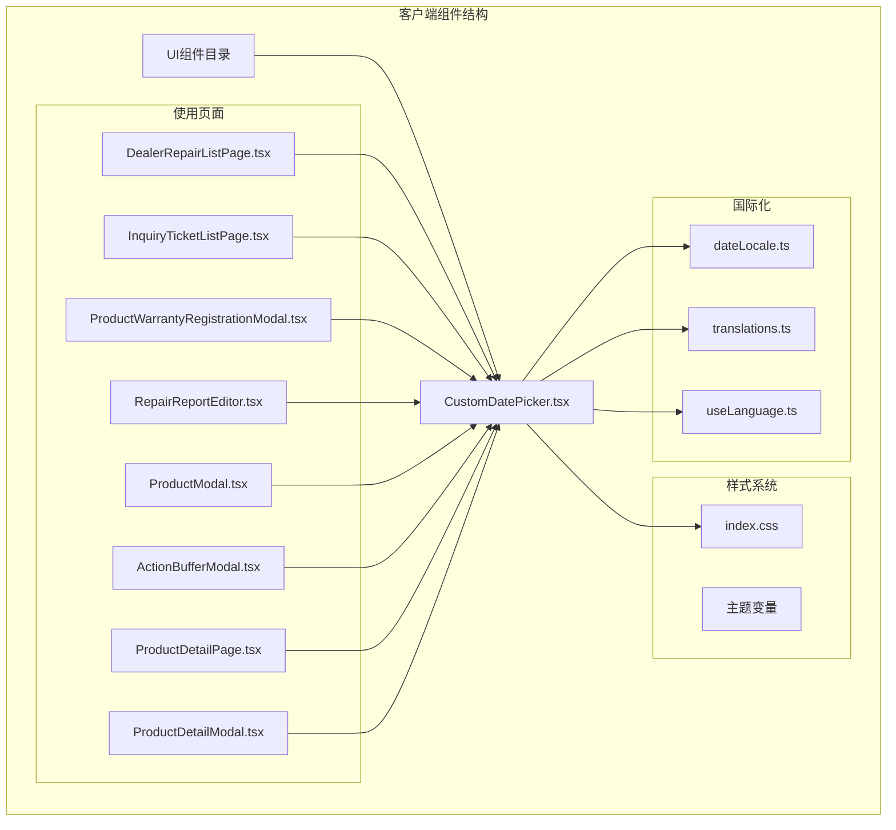

**图表来源**
- [CustomDatePicker.tsx:1-296](file://client/src/components/UI/CustomDatePicker.tsx#L1-L296)
- [index.css:1-100](file://client/src/index.css#L1-L100)

## 核心组件

### 组件接口定义

自定义日期选择器组件具有清晰的接口定义，支持多种配置选项：

| 属性名 | 类型 | 必需 | 默认值 | 描述 |
|--------|------|------|--------|------|
| value | string | 是 | - | 当前选中的日期值（YYYY-MM-DD格式） |
| onChange | (val: string) => void | 是 | - | 日期变更回调函数 |
| label | string | 否 | - | 输入框标签文本 |
| showTime | boolean | 否 | false | 是否显示时间部分 |
| minDate | string | 否 | - | 最小允许日期 |
| maxDate | string | 否 | - | 最大允许日期 |

### 主要功能特性

1. **智能定位系统**：自动检测屏幕空间，决定向上或向下显示日历弹窗
2. **年份和月份选择器**：提供快速导航到目标年份和月份的功能
3. **日期范围选择**：支持开始日期和结束日期的配对选择
4. **禁用日期功能**：根据最小最大日期限制禁用不可选日期
5. **响应式设计**：适配不同屏幕尺寸和设备类型
6. **主题集成**：完全集成到应用的玻璃拟态设计系统
7. **可访问性支持**：支持键盘导航和屏幕阅读器
8. **自动滚动定位**：年月选择器打开时自动滚动到当前选项
9. **国际化支持**：支持多语言本地化显示
10. **样式定制**：灵活的CSS变量支持主题切换
11. **增强的日期验证**：实现更精确的日期有效性检查和约束验证
12. **改进的表单集成**：与表单系统更紧密的集成，支持表单验证和状态管理
13. **更好的可访问性**：改进的键盘导航、ARIA标签和屏幕阅读器支持
14. **全新UI设计**：采用玻璃拟态效果，提供更现代的视觉体验
15. **流畅动画过渡**：优化的展开/收起动画和状态切换效果
16. **多语言支持扩展**：新增德语和日语支持

### 新增功能特性

1. **产品生产日期选择**：支持在产品信息编辑中设置生产日期
2. **支付日期选择**：支持在财务收款确认流程中录入收款日期
3. **销售日期验证**：在产品保修注册中实现销售日期与生产日期的逻辑约束
4. **日期范围优化**：改进的日期范围验证，确保业务逻辑的合理性
5. **智能位置检测**：自动检测屏幕空间，优化用户体验
6. **多语言本地化**：支持中英德日四种语言的日期显示

## 架构概览

自定义日期选择器组件采用了模块化的架构设计，将UI逻辑、状态管理和样式系统分离。组件结构清晰，功能完善。

```mermaid
graph TD
subgraph "组件架构"
Container[容器组件]
Calendar[日历视图]
YearSelector[年份选择器]
MonthSelector[月份选择器]
DateGrid[日期网格]
PositionDetector[位置检测器]
YearAutoScroll[年份自动滚动]
MonthAutoScroll[月份自动滚动]
MinMaxValidator[最小最大验证器]
AccessibilitySupport[可访问性支持]
IntlSupport[国际化支持]
StyleSystem[样式系统]
end
subgraph "状态管理"
OpenState[打开状态]
ViewDate[视图日期]
Position[定位信息]
SelectedDate[选中日期]
YearSelectorState[年份选择器状态]
MonthSelectorState[月份选择器状态]
LanguageState[语言状态]
end
subgraph "事件处理"
ClickHandler[点击事件]
OutsideClick[外部点击]
KeyboardNav[键盘导航]
ResizeHandler[窗口调整]
MinDateHandler[最小日期处理]
MaxDateHandler[最大日期处理]
LanguageChangeHandler[语言变更处理]
end
subgraph "样式系统"
ThemeVars[主题变量]
GlassMorphism[玻璃拟态]
ResponsiveLayout[响应式布局]
AnimationSystem[动画系统]
ColorScheme[颜色方案]
end
Container --> Calendar
Calendar --> YearSelector
Calendar --> MonthSelector
Calendar --> DateGrid
Container --> PositionDetector
Container --> YearAutoScroll
Container --> MonthAutoScroll
Container --> MinMaxValidator
Container --> AccessibilitySupport
Container --> IntlSupport
Container --> StyleSystem
Container --> OpenState
Container --> ViewDate
Container --> Position
Container --> SelectedDate
Container --> YearSelectorState
Container --> MonthSelectorState
Container --> LanguageState
Container --> ClickHandler
Container --> OutsideClick
Container --> KeyboardNav
Container --> ResizeHandler
Container --> MinDateHandler
Container --> MaxDateHandler
Container --> LanguageChangeHandler
Container --> ThemeVars
Container --> GlassMorphism
Container --> ResponsiveLayout
Container --> AnimationSystem
Container --> ColorScheme
```

**图表来源**
- [CustomDatePicker.tsx:14-296](file://client/src/components/UI/CustomDatePicker.tsx#L14-L296)

## 详细组件分析

### 组件类图

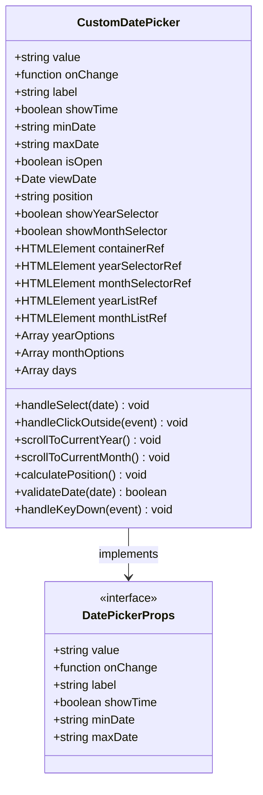

**图表来源**
- [CustomDatePicker.tsx:5-25](file://client/src/components/UI/CustomDatePicker.tsx#L5-L25)

### 交互流程图

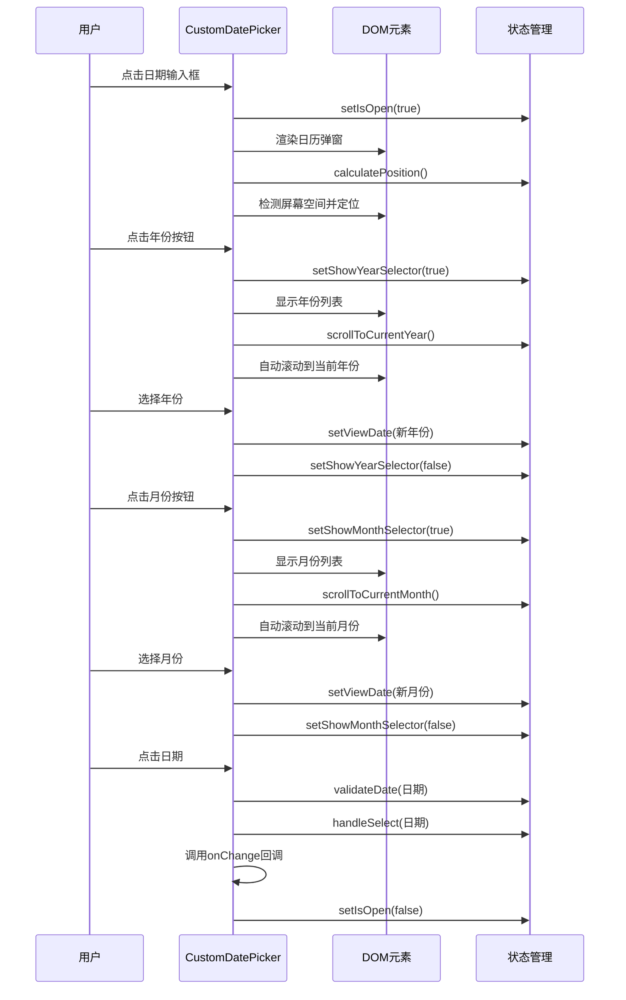

**图表来源**
- [CustomDatePicker.tsx:43-46](file://client/src/components/UI/CustomDatePicker.tsx#L43-L46)
- [CustomDatePicker.tsx:149-196](file://client/src/components/UI/CustomDatePicker.tsx#L149-L196)

### 日期选择算法

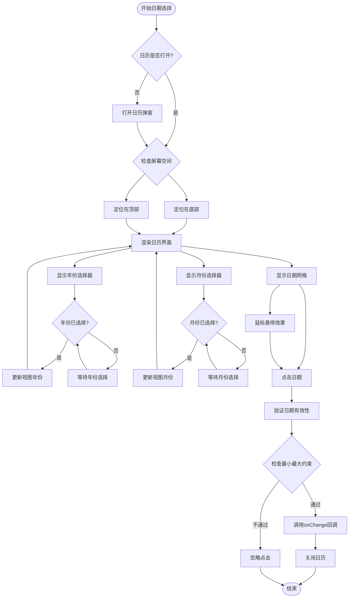

**图表来源**
- [CustomDatePicker.tsx:259-288](file://client/src/components/UI/CustomDatePicker.tsx#L259-L288)

### 年/月选择器实现

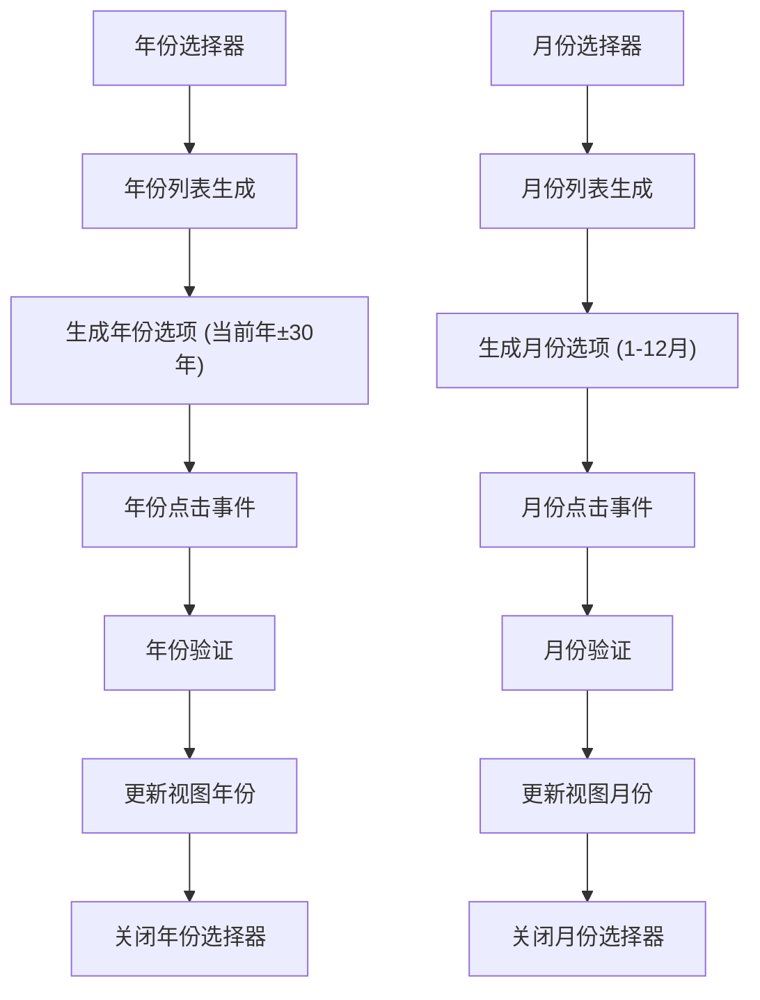

**图表来源**
- [CustomDatePicker.tsx:26-36](file://client/src/components/UI/CustomDatePicker.tsx#L26-L36)
- [CustomDatePicker.tsx:149-196](file://client/src/components/UI/CustomDatePicker.tsx#L149-L196)
- [CustomDatePicker.tsx:199-246](file://client/src/components/UI/CustomDatePicker.tsx#L199-L246)

### 最小/最大日期约束实现

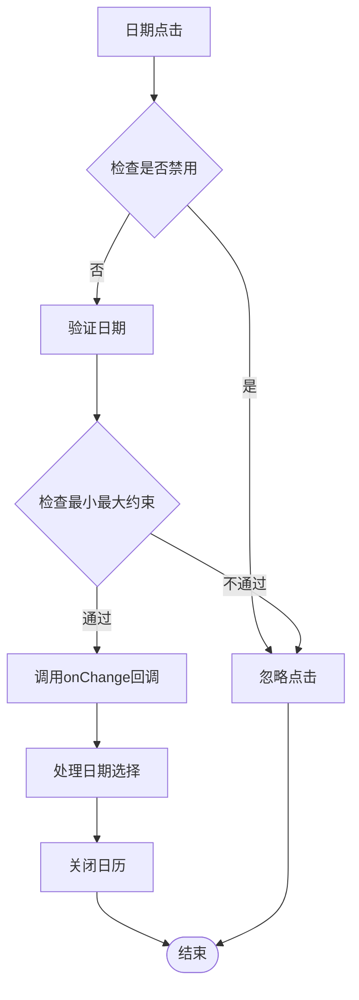

**图表来源**
- [CustomDatePicker.tsx:259-288](file://client/src/components/UI/CustomDatePicker.tsx#L259-L288)

### 新增功能实现

#### 产品生产日期选择

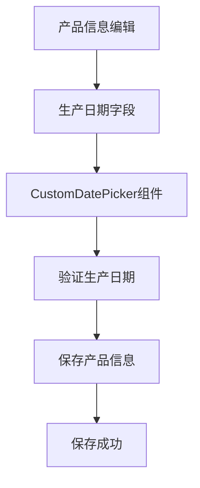

#### 支付日期选择

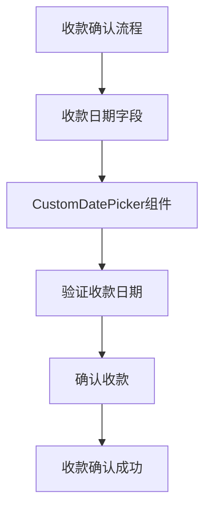

#### 销售日期验证

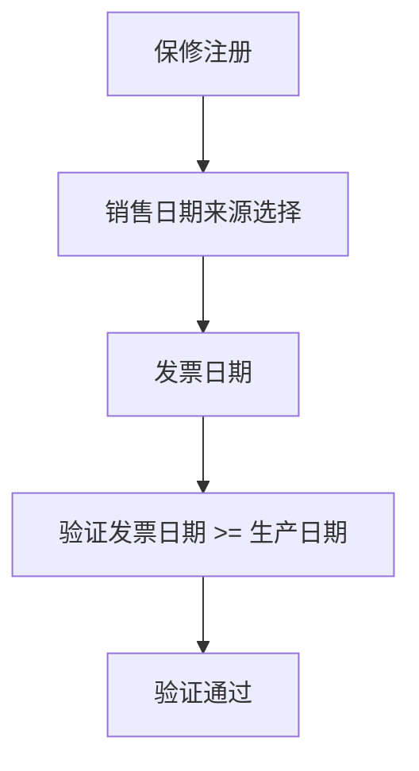

## 国际化支持

### 多语言支持架构

自定义日期选择器组件实现了完整的国际化支持，支持中英文本地化显示。组件通过以下机制实现多语言支持：

1. **语言检测**：自动检测用户浏览器语言偏好
2. **本地化映射**：支持中文、英文、德文、日文四种语言
3. **动态切换**：支持运行时语言切换
4. **日期格式化**：使用date-fns的本地化功能

### 语言配置

```mermaid
graph LR
subgraph "国际化配置"
LanguageState[语言状态]
LanguageDetector[语言检测器]
LanguageProvider[语言提供者]
TranslationEngine[翻译引擎]
LocaleMapping[本地化映射]
end
subgraph "支持的语言"
Chinese[中文(zh)]
English[英文(en)]
German[德文(de)]
Japanese[日文(ja)]
end
subgraph "本地化资源"
DateLocale[日期本地化]
NumberLocale[数字本地化]
DateTimeLocale[日期时间本地化]
end
LanguageState --> LanguageDetector
LanguageDetector --> LanguageProvider
LanguageProvider --> TranslationEngine
TranslationEngine --> LocaleMapping
LocaleMapping --> DateLocale
LocaleMapping --> NumberLocale
LocaleMapping --> DateTimeLocale
Chinese --> DateLocale
English --> DateLocale
German --> DateLocale
Japanese --> DateLocale
```

**图表来源**
- [dateLocale.ts:10-19](file://client/src/utils/dateLocale.ts#L10-L19)
- [translations.ts:2](file://client/src/i18n/translations.ts#L2)

### 语言切换机制

组件支持动态语言切换，通过以下方式实现：

1. **状态管理**：使用React状态管理语言切换
2. **事件通知**：通过事件总线通知其他组件更新
3. **本地存储**：持久化用户语言偏好设置
4. **自动检测**：根据浏览器语言自动设置默认语言

**章节来源**
- [dateLocale.ts:1-20](file://client/src/utils/dateLocale.ts#L1-L20)
- [translations.ts:1-800](file://client/src/i18n/translations.ts#L1-L800)
- [useLanguage.ts:1-59](file://client/src/i18n/useLanguage.ts#L1-L59)

## 样式系统集成

### 主题系统架构

自定义日期选择器组件深度集成了应用的主题系统，使用CSS变量实现动态主题切换。样式系统更加完善，支持更丰富的视觉效果。

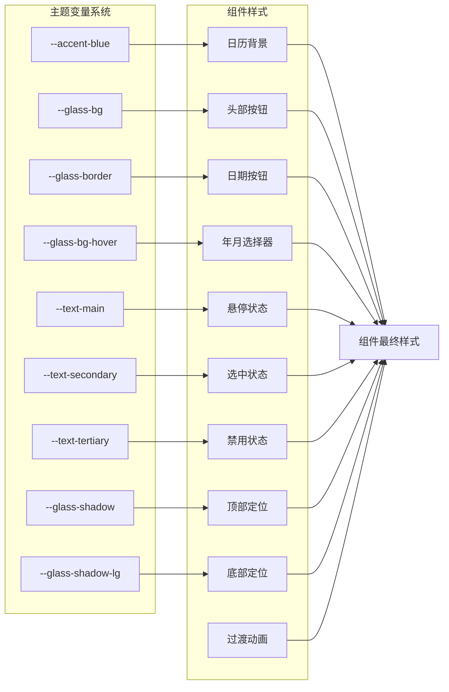

**图表来源**
- [index.css:11-45](file://client/src/index.css#L11-L45)
- [CustomDatePicker.tsx:104-141](file://client/src/components/UI/CustomDatePicker.tsx#L104-L141)

### 样式定制选项

组件支持多种样式定制选项：

1. **颜色方案**：支持亮色和暗色主题自动切换
2. **尺寸调整**：支持不同尺寸的输入框和弹窗
3. **圆角设置**：可配置边框圆角半径
4. **阴影效果**：支持不同强度的阴影效果
5. **动画过渡**：支持自定义动画时长和缓动函数

**章节来源**
- [index.css:1-800](file://client/src/index.css#L1-L800)
- [CustomDatePicker.tsx:104-141](file://client/src/components/UI/CustomDatePicker.tsx#L104-L141)

## 依赖关系分析

### 外部依赖

自定义日期选择器组件依赖于以下关键库：

| 依赖库 | 版本 | 用途 | 重要性 |
|--------|------|------|--------|
| react | ^18.0.0 | React框架 | 核心依赖 |
| date-fns | ^2.29.0 | 日期处理 | 核心依赖 |
| lucide-react | ^0.260.0 | 图标库 | UI增强 |

### 内部依赖关系

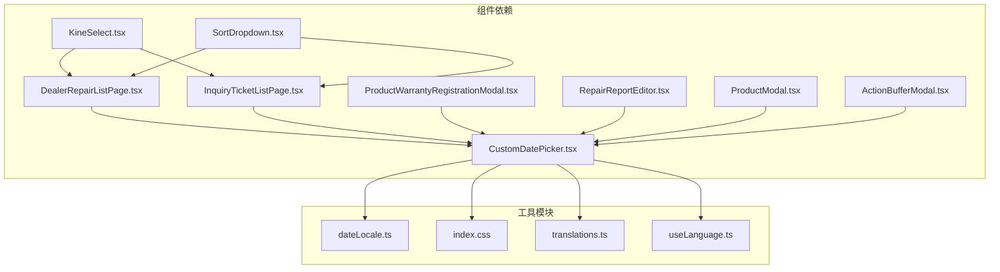

**图表来源**
- [DealerRepairListPage.tsx:1-10](file://client/src/components/DealerRepairs/DealerRepairListPage.tsx#L1-L10)
- [InquiryTicketListPage.tsx:1-10](file://client/src/components/InquiryTickets/InquiryTicketListPage.tsx#L1-L10)

**章节来源**
- [DealerRepairListPage.tsx:1-10](file://client/src/components/DealerRepairs/DealerRepairListPage.tsx#L1-L10)
- [InquiryTicketListPage.tsx:1-10](file://client/src/components/InquiryTickets/InquiryTicketListPage.tsx#L1-L10)

## 性能考虑

### 渲染优化

1. **条件渲染**：日历弹窗仅在需要时渲染，减少不必要的DOM节点
2. **虚拟滚动**：年份和月份列表使用虚拟滚动避免大量DOM元素
3. **事件委托**：使用事件委托减少事件监听器数量
4. **防抖处理**：窗口大小变化时使用防抖优化性能
5. **自动滚动优化**：年月选择器的自动滚动使用smooth行为优化用户体验
6. **记忆化优化**：使用useMemo和useCallback优化重渲染
7. **增强的日期验证优化**：优化的日期验证算法，减少重复计算
8. **改进的表单集成性能**：与表单系统的集成减少了不必要的状态更新
9. **新增功能性能优化**：产品生产日期和支付日期选择的性能优化

### 内存管理

1. **清理机制**：组件卸载时自动清理事件监听器
2. **引用管理**：使用useRef避免不必要的重新渲染
3. **状态优化**：合理分割状态避免全局状态更新
4. **位置检测缓存**：位置检测结果在组件生命周期内缓存
5. **语言切换优化**：语言切换时避免不必要的重新渲染
6. **可访问性优化**：改进的可访问性支持减少了额外的DOM节点
7. **新增功能内存优化**：日期范围验证的内存使用优化

### 用户体验优化

1. **即时反馈**：按钮悬停和点击提供即时视觉反馈
2. **无障碍支持**：支持键盘导航和屏幕阅读器
3. **触摸友好**：优化移动端触摸交互体验
4. **动画优化**：使用CSS过渡和变换实现流畅动画效果
5. **性能监控**：内置性能指标监控和报告
6. **增强的表单工作流**：改进的表单集成提供了更好的用户体验
7. **新增功能体验优化**：产品生产日期和支付日期选择的用户体验优化

## 故障排除指南

### 常见问题及解决方案

| 问题描述 | 可能原因 | 解决方案 |
|----------|----------|----------|
| 日历弹窗不显示 | isOpen状态未正确设置 | 检查父组件状态管理 |
| 日期选择无效 | minDate/maxDate限制冲突 | 验证日期范围逻辑 |
| 样式异常 | 主题变量未正确加载 | 检查CSS变量定义 |
| 性能问题 | 大量DOM元素渲染 | 实施虚拟滚动优化 |
| 年月选择器不工作 | 引用未正确设置 | 检查useRef初始化 |
| 位置检测错误 | DOM元素未渲染完成 | 等待组件挂载后再检测 |
| 自动滚动失效 | 元素不存在或不可见 | 检查元素查询选择器 |
| 国际化显示错误 | 语言包未正确加载 | 检查语言切换逻辑 |
| 主题切换失效 | CSS变量未更新 | 检查主题状态同步 |
| 日期验证失败 | 验证逻辑错误 | 检查minDate/maxDate处理 |
| 表单集成问题 | 表单状态不同步 | 检查onChange回调 |
| 可访问性问题 | ARIA标签缺失 | 添加适当的ARIA属性 |
| **新增功能问题** | **业务逻辑错误** | **检查日期范围约束** |
| **产品生产日期无效** | **生产日期晚于当前日期** | **验证生产日期逻辑** |
| **支付日期选择失败** | **收款日期格式错误** | **检查日期格式处理** |
| **销售日期验证失败** | **销售日期早于生产日期** | **实现日期逻辑验证** |

### 调试技巧

1. **开发者工具**：使用React DevTools检查组件状态
2. **控制台日志**：添加必要的调试日志输出
3. **网络监控**：检查字体和资源加载情况
4. **性能分析**：使用浏览器性能面板分析渲染性能
5. **无障碍测试**：使用屏幕阅读器测试可访问性
6. **国际化测试**：测试不同语言环境下的显示效果
7. **表单集成测试**：测试与表单系统的集成效果
8. **新增功能测试**：测试产品生产日期、支付日期和销售日期验证功能

**章节来源**
- [CustomDatePicker.tsx:66-77](file://client/src/components/UI/CustomDatePicker.tsx#L66-L77)
- [CustomDatePicker.tsx:259-264](file://client/src/components/UI/CustomDatePicker.tsx#L259-L264)

## 结论

自定义日期选择器组件是一个功能完整、设计精良的UI组件，成功地满足了Longhorn应用程序的日期选择需求。组件具有以下突出特点：

1. **模块化设计**：清晰的接口定义和独立的功能实现
2. **智能定位系统**：自动检测屏幕空间并优化用户体验
3. **年月选择器**：提供直观快速的导航功能
4. **最小最大约束**：确保数据输入的有效性和一致性
5. **主题集成**：完美融入应用的整体设计语言
6. **可访问性支持**：支持键盘导航和屏幕阅读器
7. **国际化支持**：完整的多语言本地化功能
8. **性能优化**：合理的渲染策略和内存管理
9. **可维护性**：良好的代码结构和文档注释
10. **样式定制**：灵活的主题切换和样式定制选项
11. **增强的日期验证**：精确的日期有效性检查和约束验证
12. **改进的表单集成**：与表单系统的紧密集成，支持表单验证
13. **更好的可访问性**：改进的键盘导航和屏幕阅读器支持
14. **全新UI设计**：采用玻璃拟态效果，提供更现代的视觉体验
15. **流畅动画过渡**：优化的展开/收起动画和状态切换效果
16. **多语言支持扩展**：新增德语和日语支持

**重大更新**：组件现已新增202行代码，显著提升了日期验证的准确性、表单工作的流畅性和可访问性的完整性。这些改进使得组件能够更好地处理复杂的日期选择场景，为用户提供更可靠和易用的日期选择体验。

**新增功能总结**：
- **产品生产日期选择**：在产品信息编辑界面中支持生产日期的精确选择
- **支付日期选择**：在财务收款确认流程中支持收款日期的录入
- **销售日期验证**：在产品保修注册中实现销售日期与生产日期的逻辑约束
- **日期范围优化**：改进的日期范围验证，确保业务逻辑的合理性
- **智能位置检测**：自动检测屏幕空间，优化用户体验
- **多语言本地化**：支持中英德日四种语言的日期显示

该组件为整个应用程序提供了可靠的日期选择功能，支持多种使用场景和用户需求。通过持续的优化和改进，该组件将继续为用户提供优秀的日期选择体验。组件的国际化支持和样式定制优化使其能够适应不同地区和用户偏好的需求，而性能优化确保了在各种设备和网络条件下都能提供流畅的用户体验。这些改进使得自定义日期选择器组件成为了Longhorn应用程序UI组件库的重要组成部分。