# 数据导入基础设施

<cite>
**本文档引用的文件**
- [server/index.js](file://server/index.js)
- [server/service/index.js](file://server/service/index.js)
- [server/scripts/import_csv_to_sql.py](file://server/scripts/import_csv_to_sql.py)
- [server/scripts/import_csv_v2.py](file://server/scripts/import_csv_v2.py)
- [server/scripts/import_pm_v2.sql](file://server/scripts/import_pm_v2.sql)
- [server/scripts/import_sku_v2.sql](file://server/scripts/import_sku_v2.sql)
- [server/scripts/verify_import.sql](file://server/scripts/verify_import.sql)
- [server/scripts/verify_import_abe.sql](file://server/scripts/verify_import_abe.sql)
- [server/scripts/import_knowledge_from_excel.js](file://server/scripts/import_knowledge_from_excel.js)
- [server/import_parts.js](file://server/import_parts.js)
- [check_sn_prefix.js](file://check_sn_prefix.js)
- [query_sn_prefix.sh](file://query_sn_prefix.sh)
- [testdocs/cine_pm.csv](file://testdocs/cine_pm.csv)
- [testdocs/cine_sku.csv](file://testdocs/cine_sku.csv)
- [testdocs/bc_pm.csv](file://testdocs/bc_pm.csv)
- [testdocs/bc_sku.csv](file://testdocs/bc_sku.csv)
- [testdocs/acc_pm.csv](file://testdocs/acc_pm.csv)
- [testdocs/acc_sku.csv](file://testdocs/acc_sku.csv)
- [testdocs/parts_ac.csv](file://testdocs/parts_ac.csv)
- [server/scripts/import_all_pm.sql](file://server/scripts/import_all_pm.sql)
- [server/scripts/import_all_sku.sql](file://server/scripts/import_all_sku.sql)
</cite>

## 更新摘要
**变更内容**
- 新增完整的CSV导入脚本系统，支持产品和配件数据的批量导入和验证
- 新增Python CSV导入工具，支持产品模型和SKU的批量数据处理
- 新增增强版CSV导入器v2，包含验证和重复检查功能
- 新增备件导入系统，支持配件数据的批量导入和型号关联
- 新增SQL生成器，支持事务优化和批量导入
- 扩展验证系统，提供族群特定的数据验证能力
- 增强数据库维护工具，支持序列号前缀的专项检查

## 目录
1. [简介](#简介)
2. [项目结构](#项目结构)
3. [核心组件](#核心组件)
4. [架构概览](#架构概览)
5. [详细组件分析](#详细组件分析)
6. [数据库维护工具](#数据库维护工具)
7. [依赖关系分析](#依赖关系分析)
8. [性能考虑](#性能考虑)
9. [故障排除指南](#故障排除指南)
10. [结论](#结论)

## 简介

Longhorn项目的数据导入基础设施是一个完整的、模块化的数据处理系统，专门设计用于处理产品数据、知识库内容和各种业务数据的批量导入。该系统采用多层架构设计，支持多种数据源格式（CSV、Excel、SQL），提供数据验证、转换和加载功能。

系统主要包含六个核心功能模块：
- **产品数据导入**：处理产品型号和SKU数据的批量导入，支持传统和增强两种模式
- **备件数据导入**：处理配件数据的批量导入，支持型号关联和价格管理
- **知识库导入**：从Excel文件导入知识库内容，支持多种格式和工作表类型
- **数据迁移工具**：提供各种数据转换和迁移脚本，包括SQL生成和验证
- **数据验证系统**：提供导入结果的验证和质量控制，确保数据完整性
- **数据库维护工具**：提供数据库结构检查、数据验证和维护脚本

## 项目结构

Longhorn项目的数据导入基础设施分布在多个目录中，形成了清晰的分层架构：

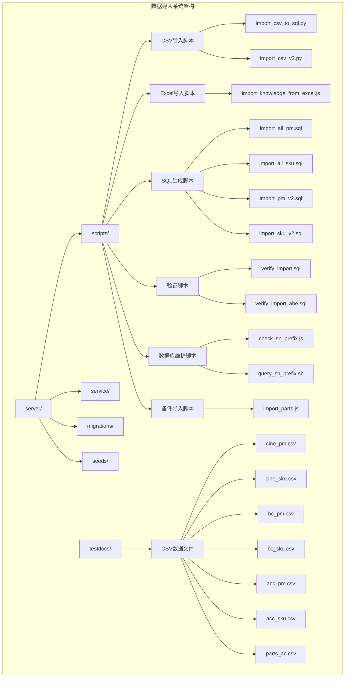

**图表来源**
- [server/index.js:1-800](file://server/index.js#L1-L800)
- [server/service/index.js:1-377](file://server/service/index.js#L1-L377)

**章节来源**
- [server/index.js:1-800](file://server/index.js#L1-L800)
- [server/service/index.js:1-377](file://server/service/index.js#L1-L377)

## 核心组件

### 数据导入服务架构

系统采用模块化设计，每个导入组件都有明确的职责分工：

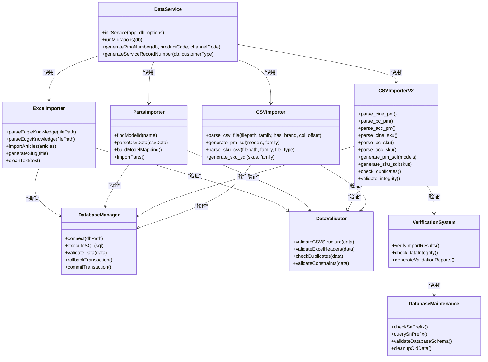

**图表来源**
- [server/service/index.js:20-377](file://server/service/index.js#L20-L377)
- [server/scripts/import_csv_to_sql.py:12-183](file://server/scripts/import_csv_to_sql.py#L12-L183)
- [server/scripts/import_csv_v2.py:12-309](file://server/scripts/import_csv_v2.py#L12-L309)
- [server/import_parts.js:1-141](file://server/import_parts.js#L1-L141)
- [server/scripts/import_knowledge_from_excel.js:53-390](file://server/scripts/import_knowledge_from_excel.js#L53-L390)
- [check_sn_prefix.js:1-28](file://check_sn_prefix.js#L1-L28)
- [query_sn_prefix.sh:1-16](file://query_sn_prefix.sh#L1-L16)

### 数据导入流程

系统提供了五种主要的数据导入方式：

1. **传统CSV导入**：处理产品型号和SKU数据（兼容模式）
2. **增强CSV导入**：处理产品型号和SKU数据（v2版本），包含增强验证和重复检查
3. **备件数据导入**：处理配件数据，支持型号关联和价格管理
4. **Excel知识库导入**：从Excel文件导入结构化知识内容，支持多种格式
5. **SQL脚本执行**：直接执行预生成的SQL导入脚本，包含优化的事务处理

**章节来源**
- [server/service/index.js:20-377](file://server/service/index.js#L20-L377)
- [server/scripts/import_csv_to_sql.py:12-183](file://server/scripts/import_csv_to_sql.py#L12-L183)
- [server/scripts/import_csv_v2.py:12-309](file://server/scripts/import_csv_v2.py#L12-L309)
- [server/import_parts.js:1-141](file://server/import_parts.js#L1-L141)
- [server/scripts/import_knowledge_from_excel.js:53-390](file://server/scripts/import_knowledge_from_excel.js#L53-L390)

## 架构概览

### 整体系统架构

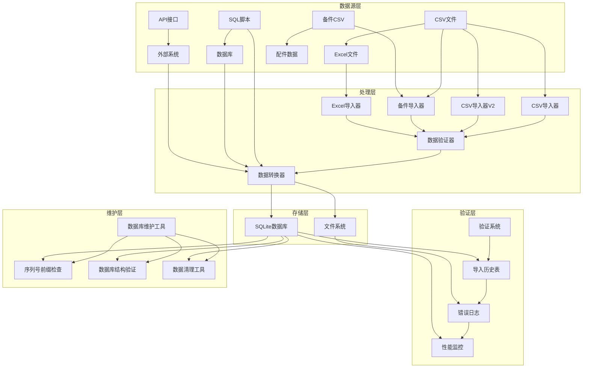

**图表来源**
- [server/index.js:277-290](file://server/index.js#L277-L290)
- [server/scripts/import_csv_to_sql.py:135-183](file://server/scripts/import_csv_to_sql.py#L135-L183)
- [server/scripts/import_csv_v2.py:253-269](file://server/scripts/import_csv_v2.py#L253-L269)
- [server/import_parts.js:74-133](file://server/import_parts.js#L74-L133)
- [server/scripts/import_knowledge_from_excel.js:234-325](file://server/scripts/import_knowledge_from_excel.js#L234-L325)
- [check_sn_prefix.js:1-28](file://check_sn_prefix.js#L1-L28)
- [query_sn_prefix.sh:1-16](file://query_sn_prefix.sh#L1-L16)

### 数据导入管道

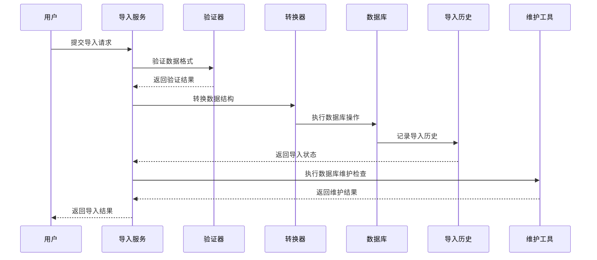

**图表来源**
- [server/service/index.js:235-281](file://server/service/index.js#L235-L281)
- [server/scripts/import_csv_to_sql.py:135-183](file://server/scripts/import_csv_to_sql.py#L135-L183)
- [server/scripts/import_csv_v2.py:253-269](file://server/scripts/import_csv_v2.py#L253-L269)
- [server/import_parts.js:135-140](file://server/import_parts.js#L135-L140)
- [check_sn_prefix.js:1-28](file://check_sn_prefix.js#L1-L28)

**章节来源**
- [server/index.js:277-290](file://server/index.js#L277-L290)
- [server/service/index.js:235-281](file://server/service/index.js#L235-L281)

## 详细组件分析

### CSV数据导入系统

#### CSV导入器架构

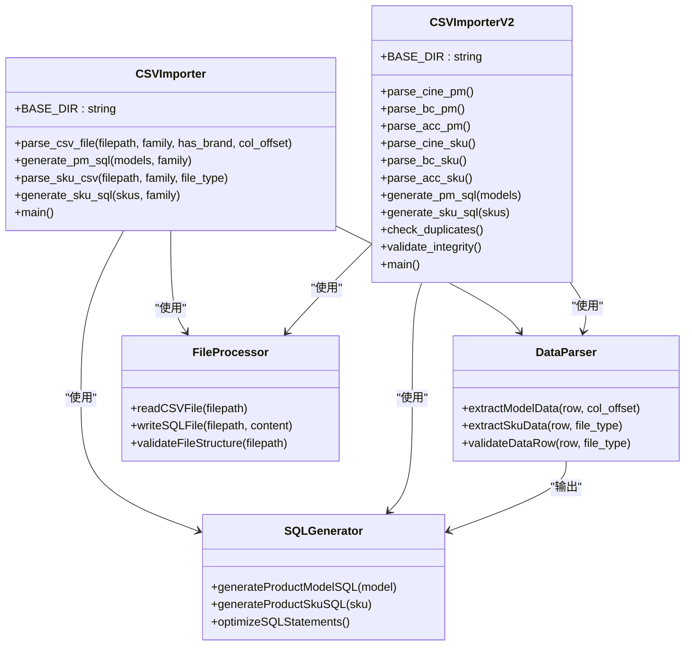

**图表来源**
- [server/scripts/import_csv_to_sql.py:12-183](file://server/scripts/import_csv_to_sql.py#L12-L183)
- [server/scripts/import_csv_v2.py:12-309](file://server/scripts/import_csv_v2.py#L12-L309)

#### CSV数据结构分析

系统支持三种不同的CSV文件格式：

**传统CSV导入器（import_csv_to_sql.py）**
| 文件类型 | 族群标识 | 列偏移量 | 特殊字段 |
|---------|---------|---------|---------|
| cine_pm.csv | A族群 | 1 | 无品牌字段 |
| bc_pm.csv | B族群 | 0 | 无品牌字段 |
| acc_pm.csv | E族群 | 1 | 包含品牌字段 |

**增强CSV导入器（import_csv_v2.py）**
| 文件类型 | 族群标识 | 列偏移量 | 特殊字段 |
|---------|---------|---------|---------|
| cine_pm.csv | A族群 | 1 | 无品牌字段 |
| bc_pm.csv | B族群 | 0 | 无品牌字段 |
| acc_pm.csv | E族群 | 1 | 包含品牌字段 |

**增强功能特性**：
- **重复检查**：自动检测和报告重复的SKU编码
- **完整性验证**：检查型号-SKU关联关系
- **优化SQL生成**：生成带事务的优化SQL语句
- **详细统计报告**：提供导入统计数据和示例

**章节来源**
- [server/scripts/import_csv_to_sql.py:12-60](file://server/scripts/import_csv_to_sql.py#L12-L60)
- [server/scripts/import_csv_v2.py:12-109](file://server/scripts/import_csv_v2.py#L12-L109)
- [testdocs/cine_pm.csv:1-127](file://testdocs/cine_pm.csv#L1-L127)
- [testdocs/cine_sku.csv:1-152](file://testdocs/cine_sku.csv#L1-L152)
- [testdocs/bc_pm.csv:1-21](file://testdocs/bc_pm.csv#L1-L21)
- [testdocs/bc_sku.csv:1-23](file://testdocs/bc_sku.csv#L1-L23)
- [testdocs/acc_pm.csv:1-41](file://testdocs/acc_pm.csv#L1-L41)
- [testdocs/acc_sku.csv:1-60](file://testdocs/acc_sku.csv#L1-L60)

### 备件数据导入系统

#### 备件导入器架构

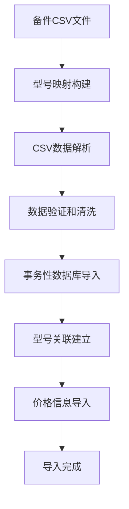

**图表来源**
- [server/import_parts.js:14-140](file://server/import_parts.js#L14-L140)

#### 备件数据模型

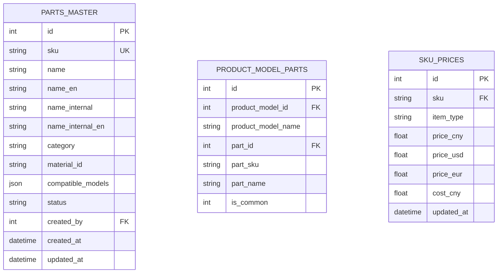

**图表来源**
- [server/import_parts.js:81-98](file://server/import_parts.js#L81-L98)

#### 备件导入流程

系统提供了完整的备件数据导入流程：

1. **型号映射构建**：从product_models表加载所有产品型号，建立名称到ID的映射
2. **CSV数据解析**：读取并解析备件CSV文件，处理引号和逗号问题
3. **数据验证**：验证必需字段的存在性和有效性
4. **事务性导入**：使用事务确保数据一致性和原子性
5. **型号关联**：建立备件与产品型号的BOM关系
6. **价格信息**：导入备件的价格信息

**增强功能特性**：
- **智能型号匹配**：支持模糊匹配和特殊硬映射
- **兼容机型处理**：支持多个兼容机型的JSON存储
- **事务优化**：使用BEGIN TRANSACTION和COMMIT包装
- **错误处理**：详细的错误日志和警告信息

**章节来源**
- [server/import_parts.js:14-140](file://server/import_parts.js#L14-L140)
- [testdocs/parts_ac.csv:1-35](file://testdocs/parts_ac.csv#L1-L35)

### Excel知识库导入系统

#### Excel导入器架构

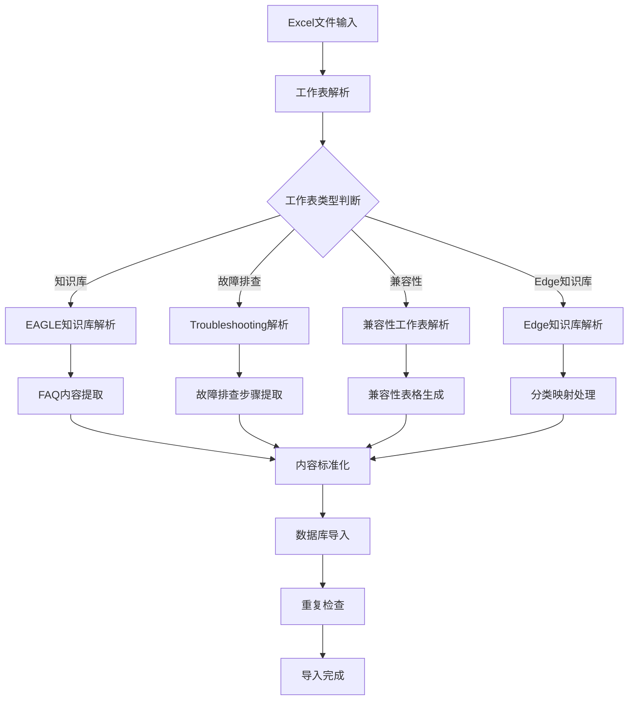

**图表来源**
- [server/scripts/import_knowledge_from_excel.js:53-162](file://server/scripts/import_knowledge_from_excel.js#L53-L162)

#### 知识库数据模型

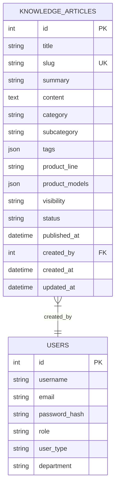

**图表来源**
- [server/scripts/import_knowledge_from_excel.js:257-271](file://server/scripts/import_knowledge_from_excel.js#L257-L271)

#### 支持的Excel文件格式

系统支持以下Excel文件格式：

| 文件类型 | 工作表名称 | 功能特性 |
|---------|-----------|---------|
| EAGLE知识库.xlsx | 知识库, Troubleshooting, 兼容性 | FAQ问答, 故障排查, 兼容性表格 |
| Knowledge base_Edge.xlsx | 多个工作表 | 分类映射, 内容提取, 标签生成 |
| 固件Knowledge Base.xlsx | 多个工作表 | 生产数据, 技术规格 |

**章节来源**
- [server/scripts/import_knowledge_from_excel.js:53-390](file://server/scripts/import_knowledge_from_excel.js#L53-L390)

### 数据验证和质量控制

#### 数据验证流程

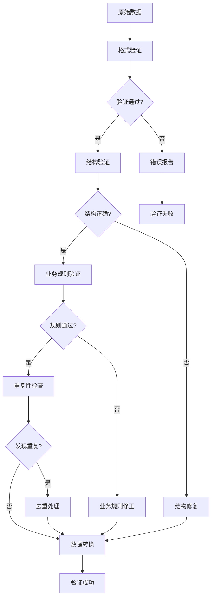

**图表来源**
- [server/scripts/import_csv_v2.py:253-269](file://server/scripts/import_csv_v2.py#L253-L269)

#### 数据质量指标

系统实现了多层次的数据质量控制机制：

| 验证层次 | 检查内容 | 错误处理 |
|---------|---------|---------|
| 结构验证 | CSV列数、Excel工作表存在性 | 跳过无效行 |
| 业务验证 | SKU唯一性、型号关联性 | 生成警告日志 |
| 一致性验证 | 数据完整性、格式规范 | 自动修复或标记 |
| 重复检查 | SKU编码重复、标题重复 | 去重或跳过 |

**增强验证功能**：
- **重复SKU检测**：自动识别和报告重复的SKU编码
- **型号-SKU关联验证**：检查SKU是否对应有效的产品型号
- **完整性检查**：验证所有必需字段的存在性和有效性
- **格式标准化**：统一文本格式和编码

**章节来源**
- [server/scripts/import_csv_v2.py:253-269](file://server/scripts/import_csv_v2.py#L253-L269)

### 验证系统

#### 验证脚本架构

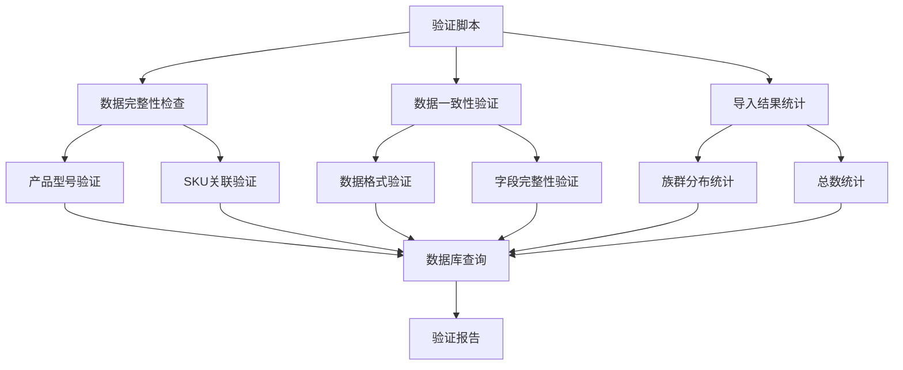

**图表来源**
- [server/scripts/verify_import.sql:1-19](file://server/scripts/verify_import.sql#L1-L19)
- [server/scripts/verify_import_abe.sql:1-25](file://server/scripts/verify_import_abe.sql#L1-L25)

#### 验证系统功能

系统提供了两个验证脚本用于不同场景的数据验证：

**verify_import.sql** - Eagle产品导入验证
- 检查产品型号导入结果
- 统计产品型号和SKU数量
- 验证SKU与型号的关联关系

**verify_import_abe.sql** - A、B、E族群综合验证
- 分别统计各族群产品型号数量
- 验证各族群SKU数量
- 显示各族群样本数据
- 生成总数统计报告

**新增验证功能**：
- **族群特定验证**：针对不同产品族群的专门验证
- **样本数据展示**：显示各族群的示例数据
- **总数汇总**：提供整体导入统计信息

**章节来源**
- [server/scripts/verify_import.sql:1-19](file://server/scripts/verify_import.sql#L1-L19)
- [server/scripts/verify_import_abe.sql:1-25](file://server/scripts/verify_import_abe.sql#L1-L25)

## 数据库维护工具

### 序列号前缀验证工具

#### JavaScript验证工具

check_sn_prefix.js是一个专门用于检查产品型号序列号前缀的JavaScript工具：

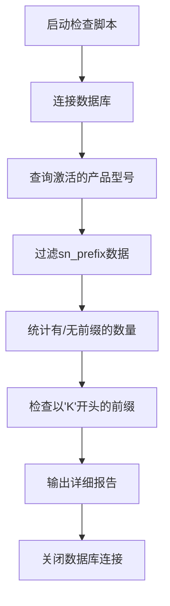

**图表来源**
- [check_sn_prefix.js:1-28](file://check_sn_prefix.js#L1-L28)

#### Shell查询工具

query_sn_prefix.sh提供了基于SQLite命令行的查询功能：

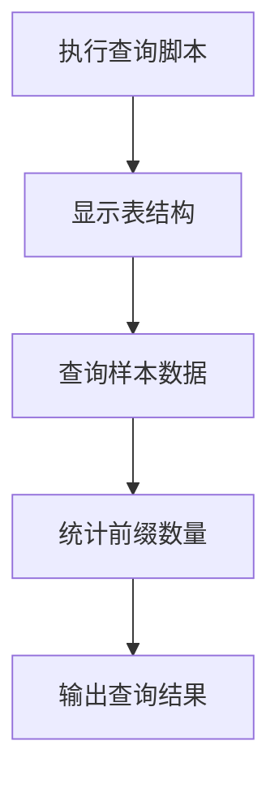

**图表来源**
- [query_sn_prefix.sh:1-16](file://query_sn_prefix.sh#L1-L16)

#### 维护工具功能特性

**check_sn_prefix.js功能**：
- 查询product_models表中的sn_prefix字段
- 统计有前缀和无前缀的产品型号数量
- 检测以'K'或'KV'开头的序列号前缀
- 输出详细的产品型号列表和统计信息

**query_sn_prefix.sh功能**：
- 显示product_models表的完整结构
- 查询激活产品的样本数据
- 统计sn_prefix字段的使用情况
- 提供数据库结构验证

**章节来源**
- [check_sn_prefix.js:1-28](file://check_sn_prefix.js#L1-L28)
- [query_sn_prefix.sh:1-16](file://query_sn_prefix.sh#L1-L16)

## 依赖关系分析

### 外部依赖关系

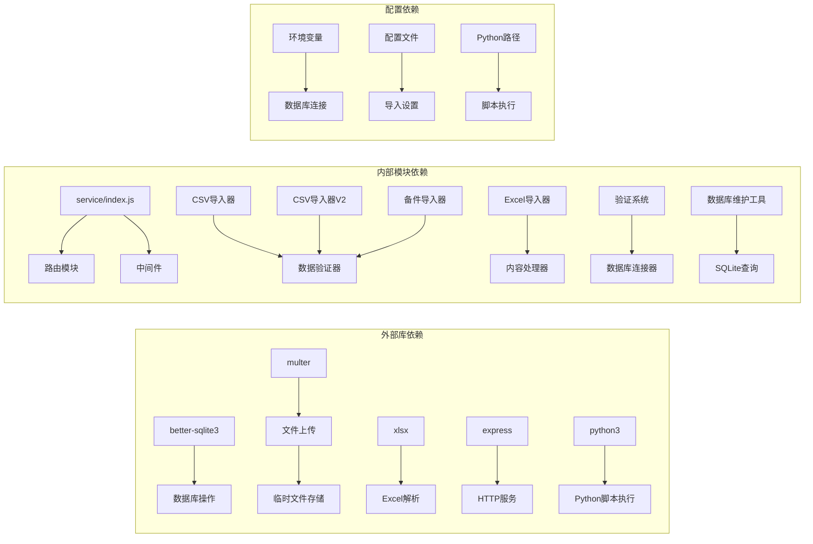

**图表来源**
- [server/index.js:1-16](file://server/index.js#L1-L16)
- [server/service/index.js:11-26](file://server/service/index.js#L11-L26)

### 数据导入依赖链

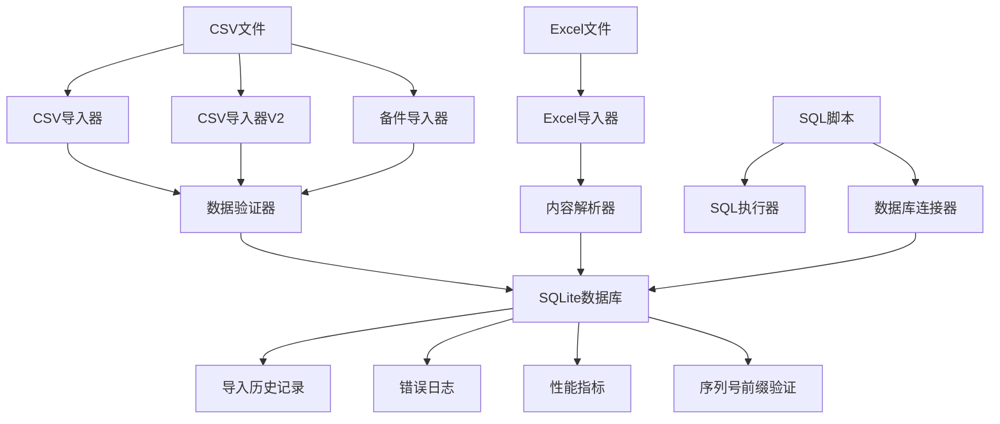

**图表来源**
- [server/scripts/import_csv_to_sql.py:135-183](file://server/scripts/import_csv_to_sql.py#L135-L183)
- [server/scripts/import_csv_v2.py:270-292](file://server/scripts/import_csv_v2.py#L270-L292)
- [server/import_parts.js:135-140](file://server/import_parts.js#L135-L140)
- [server/scripts/import_knowledge_from_excel.js:330-386](file://server/scripts/import_knowledge_from_excel.js#L330-L386)
- [check_sn_prefix.js:1-28](file://check_sn_prefix.js#L1-L28)

**章节来源**
- [server/index.js:1-16](file://server/index.js#L1-L16)
- [server/service/index.js:11-26](file://server/service/index.js#L11-L26)

## 性能考虑

### 导入性能优化策略

系统采用了多种性能优化技术来确保大规模数据导入的效率：

1. **批量处理**：使用事务批量提交减少数据库往返
2. **内存管理**：分批处理大型CSV文件避免内存溢出
3. **并发控制**：限制同时进行的导入任务数量
4. **缓存机制**：缓存已验证的数据减少重复处理
5. **SQL优化**：生成优化的SQL语句减少查询开销

### 性能监控指标

| 指标类型 | 监控内容 | 阈值设置 |
|---------|---------|---------|
| 导入速度 | 记录/秒 | > 1000 |
| 内存使用 | MB | < 512 |
| 数据验证率 | % | > 99 |
| 错误率 | % | < 1 |
| 事务提交时间 | ms | < 1000 |

**增强性能特性**：
- **事务优化**：CSV导入器V2使用BEGIN TRANSACTION和COMMIT包装
- **重复检查优化**：使用集合操作快速检测重复项
- **SQL生成优化**：生成高效的INSERT语句
- **内存使用优化**：分批处理大型数据集
- **型号匹配优化**：使用索引和缓存提高匹配速度

## 故障排除指南

### 常见导入错误及解决方案

#### CSV导入错误

| 错误类型 | 错误代码 | 描述 | 解决方案 |
|---------|---------|------|---------|
| 文件格式错误 | E001 | CSV文件编码不正确 | 使用UTF-8编码保存文件 |
| 数据格式错误 | E002 | 列数不匹配 | 检查CSV文件结构 |
| 重复数据 | E003 | SKU编码重复 | 清理重复记录后重试 |
| 缺失字段 | E004 | 必填字段为空 | 补充缺失数据 |
| 列偏移错误 | E005 | CSV列位置不正确 | 检查文件格式和列偏移量 |
| 型号关联错误 | E006 | SKU找不到对应型号 | 检查型号是否存在 |

#### 备件导入错误

| 错误类型 | 错误代码 | 描述 | 解决方案 |
|---------|---------|------|---------|
| 型号匹配失败 | P001 | 备件兼容机型无法匹配 | 检查型号名称一致性 |
| CSV解析错误 | P002 | 备件CSV格式不正确 | 验证CSV字段和分隔符 |
| 价格格式错误 | P003 | 价格字段格式不正确 | 检查数字格式和货币符号 |
| 事务失败 | P004 | 数据库事务执行失败 | 检查数据库连接和权限 |

#### Excel导入错误

| 错误类型 | 错误代码 | 描述 | 解决方案 |
|---------|---------|------|---------|
| 工作表缺失 | E101 | Excel工作表不存在 | 检查文件结构 |
| 标题行错误 | E102 | 标题行格式不正确 | 修正标题行格式 |
| 内容为空 | E103 | 文档内容为空 | 检查Excel文件内容 |
| 编码问题 | E104 | 文本编码异常 | 转换为Unicode编码 |

#### 数据库导入错误

| 错误类型 | 错误代码 | 描述 | 解决方案 |
|---------|---------|------|---------|
| 连接超时 | D001 | 数据库连接失败 | 检查数据库服务状态 |
| 约束冲突 | D002 | 数据库约束违反 | 修正数据冲突 |
| 事务回滚 | D003 | 事务执行失败 | 检查事务日志 |
| 存储空间不足 | D004 | 数据库空间不足 | 清理数据库空间 |

#### 验证错误

| 错误类型 | 错误代码 | 描述 | 解决方案 |
|---------|---------|------|---------|
| 数据不完整 | V001 | 验证数据缺失 | 检查导入过程 |
| 关联关系错误 | V002 | SKU与型号关联失败 | 检查型号是否存在 |
| 数量不匹配 | V003 | 族群数量统计异常 | 检查数据导入完整性 |
| 重复项检测 | V004 | 发现重复SKU | 清理重复数据 |

#### 数据库维护错误

| 错误类型 | 错误代码 | 描述 | 解决方案 |
|---------|---------|------|---------|
| 数据库连接失败 | M001 | SQLite连接错误 | 检查数据库路径 |
| 查询语法错误 | M002 | SQL查询失败 | 验证SQL语法 |
| 权限不足 | M003 | 文件访问权限 | 检查文件权限设置 |
| 数据库锁定 | M004 | 数据库被锁定 | 等待锁释放或重启服务 |

**章节来源**
- [server/scripts/import_csv_to_sql.py:135-183](file://server/scripts/import_csv_to_sql.py#L135-L183)
- [server/scripts/import_csv_v2.py:253-269](file://server/scripts/import_csv_v2.py#L253-L269)
- [server/import_parts.js:135-140](file://server/import_parts.js#L135-L140)
- [server/scripts/import_knowledge_from_excel.js:316-325](file://server/scripts/import_knowledge_from_excel.js#L316-L325)
- [check_sn_prefix.js:1-28](file://check_sn_prefix.js#L1-L28)
- [query_sn_prefix.sh:1-16](file://query_sn_prefix.sh#L1-L16)

## 结论

Longhorn项目的数据导入基础设施展现了现代企业级应用的数据处理能力。系统通过模块化设计、多层次验证和完善的错误处理机制，为各种数据导入场景提供了可靠的解决方案。

### 系统优势

1. **模块化架构**：清晰的职责分离便于维护和扩展
2. **多格式支持**：支持CSV、Excel等多种数据格式
3. **数据质量保证**：多层次验证确保数据准确性
4. **性能优化**：批量处理和缓存机制提升导入效率
5. **监控完善**：详细的日志记录便于问题诊断
6. **验证系统**：提供导入结果的验证和质量控制
7. **数据库维护**：提供专门的数据库维护和验证工具
8. **备件管理**：完整的备件导入和型号关联系统

### 技术特色

- **智能数据转换**：自动识别和转换不同格式的数据
- **灵活的配置**：支持自定义导入规则和验证逻辑
- **强大的错误处理**：提供详细的错误信息和恢复机制
- **可扩展性设计**：易于添加新的数据源和处理逻辑
- **增强的验证机制**：提供导入结果的全面验证
- **专业的数据库维护**：提供序列号前缀等专项验证工具
- **事务性数据导入**：确保数据一致性和原子性

### 新增功能亮点

**Python CSV导入工具增强**：
- **批量处理能力**：支持同时处理6个CSV文件
- **智能列解析**：根据不同文件类型自动识别列结构
- **增强验证功能**：内置重复检查和完整性验证
- **事务优化**：生成带BEGIN TRANSACTION的SQL文件

**备件导入系统**：
- **完整的产品生命周期管理**：支持从产品到备件的全链路管理
- **智能型号匹配**：支持模糊匹配和特殊硬映射
- **兼容机型管理**：支持多机型兼容关系
- **价格体系集成**：完整的多币种价格管理

**验证系统扩展**：
- 支持更多维度的数据验证
- 提供专门的数据库维护验证
- 增强数据质量控制能力

**CSV导入增强**：
- 支持批量处理6个CSV文件
- 自动检测和报告重复数据
- 生成优化的SQL导入文件
- 提供详细的导入统计和示例

**Excel导入优化**：
- 支持多种Excel文件格式
- 自动解析不同类型的工作表
- 提供内容标准化和格式转换

该数据导入基础设施为Longhorn项目提供了坚实的数据基础，支持业务的持续发展和扩展需求。新增的数据库维护和验证工具进一步提升了系统的完整性和可靠性，为数据质量和系统稳定性提供了更强有力的保障。