# 数据导入基础设施

<cite>
**本文档引用的文件**
- [server/index.js](file://server/index.js)
- [server/scripts/import_csv_to_sql.py](file://server/scripts/import_csv_to_sql.py)
- [server/scripts/import_csv_v2.py](file://server/scripts/import_csv_v2.py)
- [server/scripts/import_knowledge_from_excel.js](file://server/scripts/import_knowledge_from_excel.js)
- [server/scripts/import_knowledge_from_pdf.js](file://server/scripts/import_knowledge_from_pdf.js)
- [server/scripts/import_dealers_from_tickets.js](file://server/scripts/import_dealers_from_tickets.js)
- [server/scripts/import_all_pm.sql](file://server/scripts/import_all_pm.sql)
- [server/scripts/import_all_sku.sql](file://server/scripts/import_all_sku.sql)
- [server/scripts/import_pm_v2.sql](file://server/scripts/import_pm_v2.sql)
- [server/scripts/verify_import.sql](file://server/scripts/verify_import.sql)
- [server/scripts/verify_import_abe.sql](file://server/scripts/verify_import_abe.sql)
- [server/package.json](file://server/package.json)
- [server/service/routes/products.js](file://server/service/routes/products.js)
</cite>

## 目录
1. [简介](#简介)
2. [项目结构](#项目结构)
3. [核心组件](#核心组件)
4. [架构概览](#架构概览)
5. [详细组件分析](#详细组件分析)
6. [依赖关系分析](#依赖关系分析)
7. [性能考虑](#性能考虑)
8. [故障排除指南](#故障排除指南)
9. [结论](#结论)

## 简介

Longhorn项目的数据导入基础设施是一个完整的数据处理和转换系统，专门设计用于处理产品数据、知识库内容和经销商信息的批量导入。该系统支持多种数据源格式，包括CSV文件、Excel文件、PDF文档等，并提供了强大的数据验证、转换和导入功能。

该基础设施的核心目标是：
- 提供统一的数据导入接口
- 支持多种数据格式的自动转换
- 确保数据质量和完整性
- 提供可追溯的导入历史记录
- 实现高效的数据处理和批量导入

## 项目结构

数据导入基础设施主要分布在以下目录结构中：

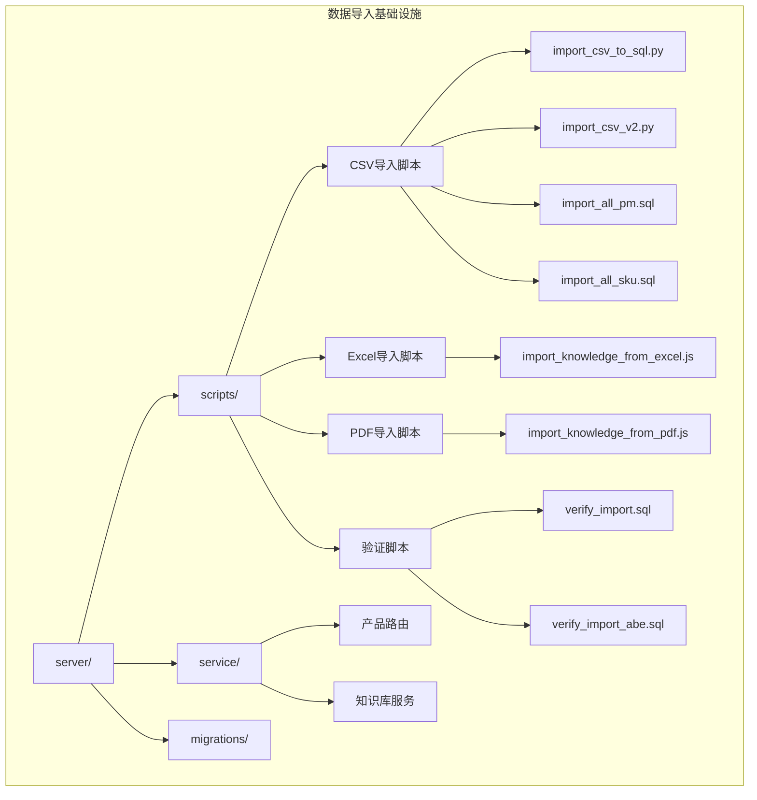

**图表来源**
- [server/index.js:1-800](file://server/index.js#L1-L800)
- [server/package.json:1-41](file://server/package.json#L1-L41)

**章节来源**
- [server/index.js:1-800](file://server/index.js#L1-L800)
- [server/package.json:1-41](file://server/package.json#L1-L41)

## 核心组件

### 1. 数据导入引擎

数据导入引擎是整个基础设施的核心，负责协调各种导入任务和数据处理流程。

**主要特性：**
- 支持多种数据格式（CSV、Excel、PDF、JSON）
- 自动数据验证和清洗
- 批量处理和事务管理
- 错误处理和恢复机制
- 导入历史追踪

### 2. CSV数据处理模块

专门用于处理CSV格式的产品数据导入。

**功能特点：**
- 多族群产品数据支持（A、B、E族群）
- 动态列解析和映射
- 数据标准化和验证
- 自动生成SQL导入脚本

### 3. 知识库导入模块

处理Excel和PDF格式的知识库内容导入。

**处理能力：**
- Excel文件解析和数据提取
- PDF文档内容提取和结构化
- 文档结构识别和章节分割
- 多语言内容支持

### 4. 数据验证系统

提供全面的数据质量保证机制。

**验证功能：**
- 数据完整性检查
- 重复数据检测
- 格式验证
- 业务规则验证

**章节来源**
- [server/scripts/import_csv_to_sql.py:1-183](file://server/scripts/import_csv_to_sql.py#L1-L183)
- [server/scripts/import_csv_v2.py:1-309](file://server/scripts/import_csv_v2.py#L1-L309)
- [server/scripts/import_knowledge_from_excel.js:1-390](file://server/scripts/import_knowledge_from_excel.js#L1-L390)
- [server/scripts/import_knowledge_from_pdf.js:1-293](file://server/scripts/import_knowledge_from_pdf.js#L1-L293)

## 架构概览

数据导入基础设施采用分层架构设计，确保了系统的可扩展性和维护性：

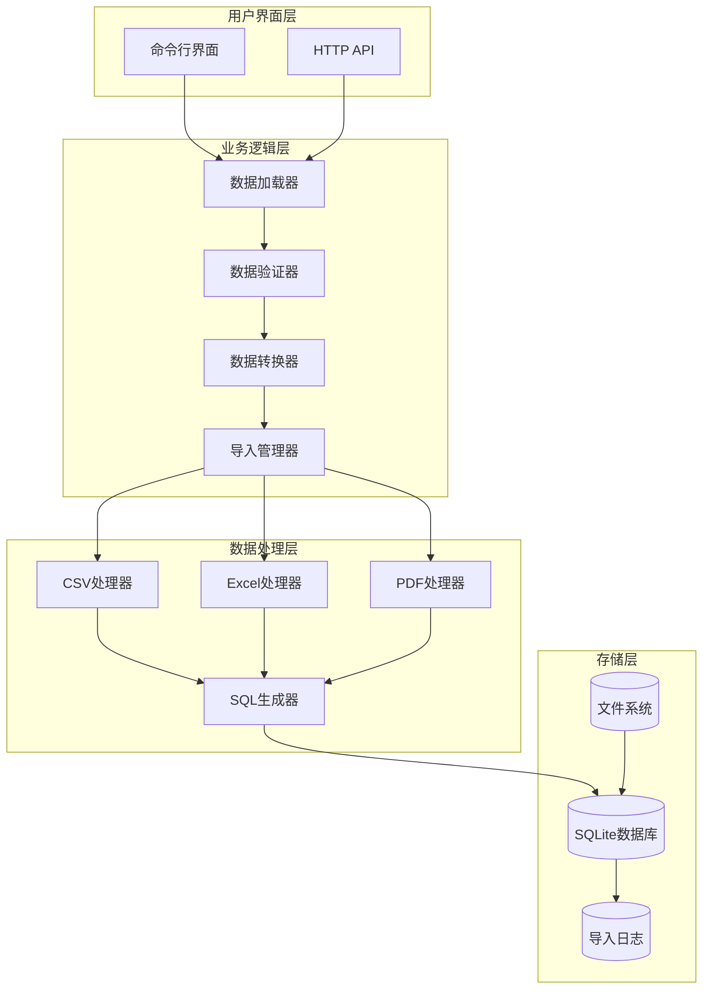

**图表来源**
- [server/index.js:1-800](file://server/index.js#L1-L800)
- [server/scripts/import_csv_to_sql.py:1-183](file://server/scripts/import_csv_to_sql.py#L1-L183)

### 数据流处理流程

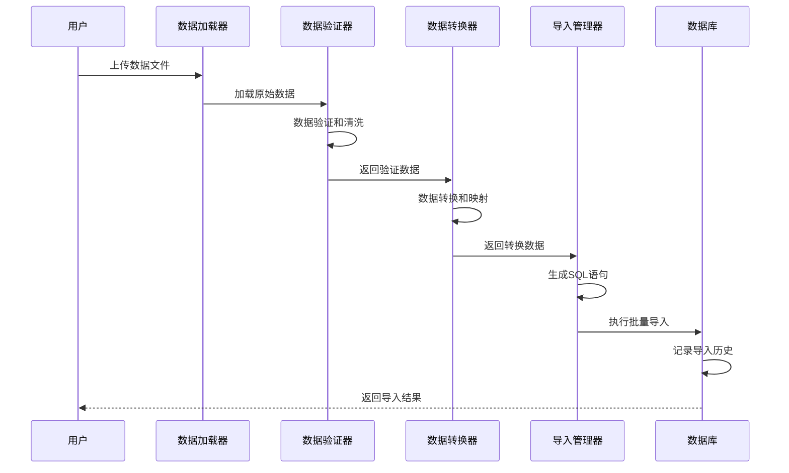

**图表来源**
- [server/scripts/import_csv_v2.py:222-309](file://server/scripts/import_csv_v2.py#L222-L309)
- [server/scripts/import_knowledge_from_excel.js:234-325](file://server/scripts/import_knowledge_from_excel.js#L234-L325)

**章节来源**
- [server/index.js:1-800](file://server/index.js#L1-L800)

## 详细组件分析

### CSV数据导入系统

#### 数据解析器

CSV数据导入系统提供了两个版本的数据解析器，以适应不同的数据格式需求：

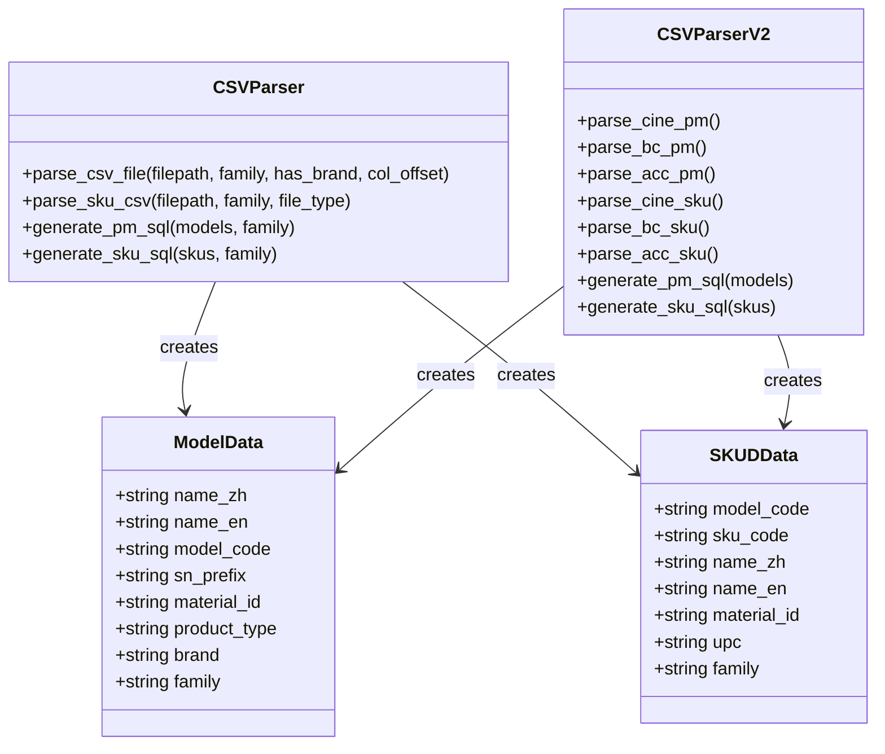

**图表来源**
- [server/scripts/import_csv_to_sql.py:12-183](file://server/scripts/import_csv_to_sql.py#L12-L183)
- [server/scripts/import_csv_v2.py:12-309](file://server/scripts/import_csv_v2.py#L12-L309)

#### 数据验证流程

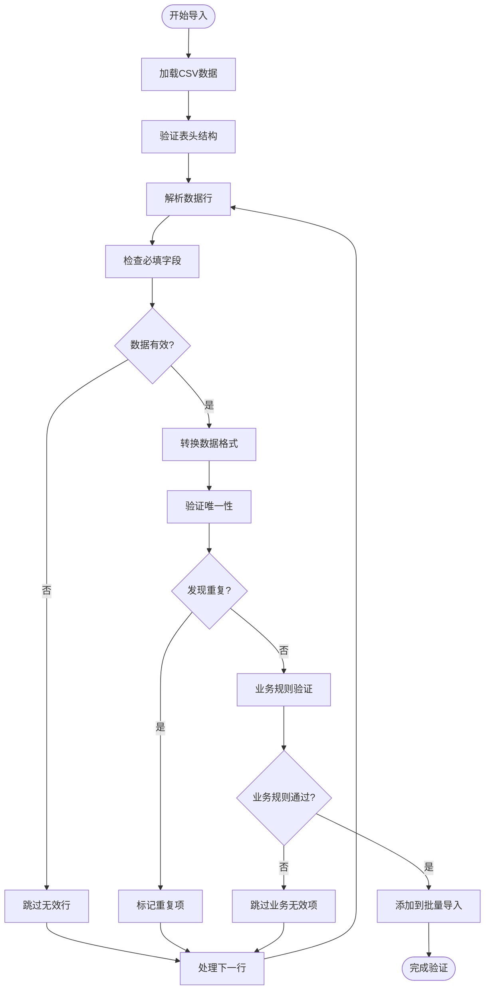

**图表来源**
- [server/scripts/import_csv_v2.py:253-269](file://server/scripts/import_csv_v2.py#L253-L269)

**章节来源**
- [server/scripts/import_csv_to_sql.py:12-183](file://server/scripts/import_csv_to_sql.py#L12-L183)
- [server/scripts/import_csv_v2.py:12-309](file://server/scripts/import_csv_v2.py#L12-L309)

### 知识库导入系统

#### Excel数据导入器

知识库Excel导入系统能够处理复杂的多工作表Excel文件：

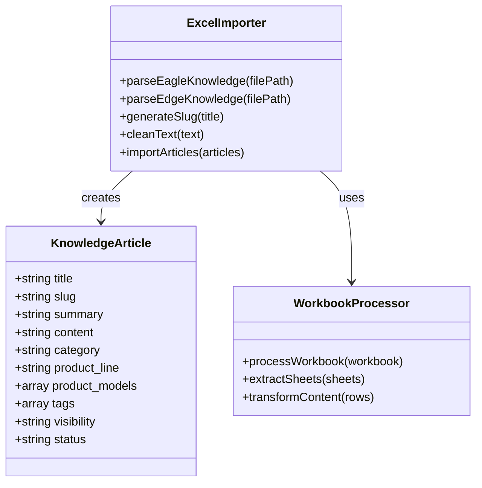

**图表来源**
- [server/scripts/import_knowledge_from_excel.js:53-325](file://server/scripts/import_knowledge_from_excel.js#L53-L325)

#### PDF文档解析器

PDF文档导入系统提供了智能的文档内容提取和结构化功能：

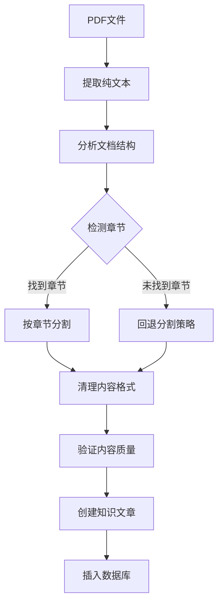

**图表来源**
- [server/scripts/import_knowledge_from_pdf.js:43-134](file://server/scripts/import_knowledge_from_pdf.js#L43-L134)

**章节来源**
- [server/scripts/import_knowledge_from_excel.js:1-390](file://server/scripts/import_knowledge_from_excel.js#L1-L390)
- [server/scripts/import_knowledge_from_pdf.js:1-293](file://server/scripts/import_knowledge_from_pdf.js#L1-L293)

### 数据验证和质量控制系统

#### 导入验证器

数据验证系统提供了多层次的数据质量保证：

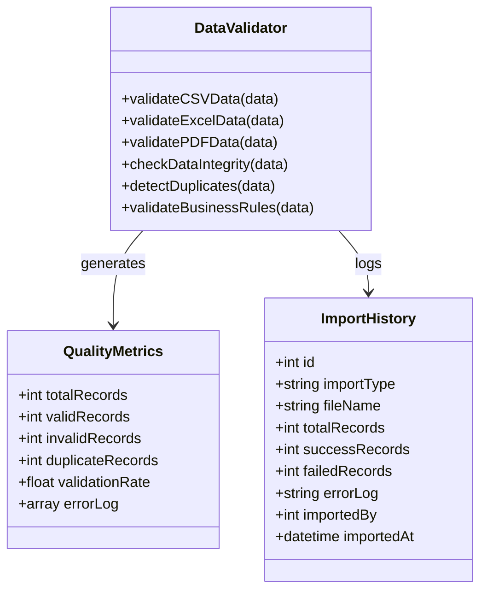

**图表来源**
- [server/scripts/import_csv_v2.py:253-269](file://server/scripts/import_csv_v2.py#L253-L269)
- [server/index.js:277-289](file://server/index.js#L277-L289)

**章节来源**
- [server/scripts/verify_import.sql:1-19](file://server/scripts/verify_import.sql#L1-L19)
- [server/scripts/verify_import_abe.sql:1-25](file://server/scripts/verify_import_abe.sql#L1-L25)

## 依赖关系分析

数据导入基础设施的依赖关系体现了清晰的分层架构：

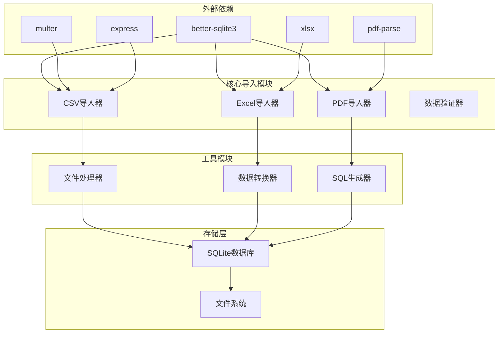

**图表来源**
- [server/package.json:15-39](file://server/package.json#L15-L39)

### 数据库模式依赖

导入系统依赖于特定的数据库模式来存储导入的数据：

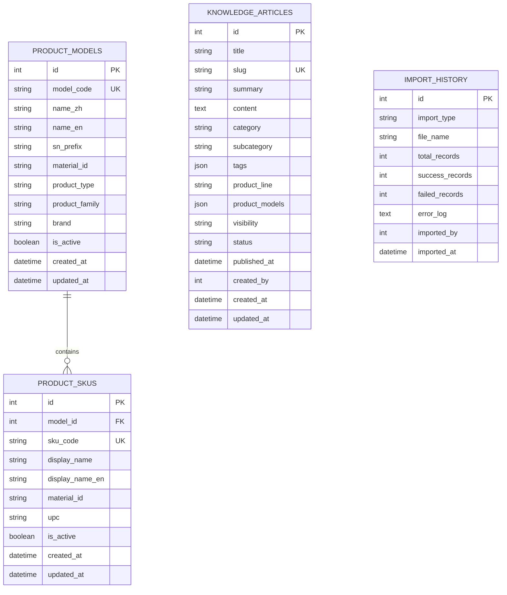

**图表来源**
- [server/index.js:159-289](file://server/index.js#L159-L289)

**章节来源**
- [server/package.json:15-39](file://server/package.json#L15-L39)
- [server/index.js:159-289](file://server/index.js#L159-L289)

## 性能考虑

### 批量处理优化

数据导入系统采用了多种性能优化策略：

1. **事务批处理**：所有导入操作都在事务中执行，确保数据一致性并提高性能
2. **内存管理**：大文件处理时采用流式读取，避免内存溢出
3. **并发控制**：合理控制同时进行的导入任务数量
4. **索引优化**：在导入前禁用不必要的索引，在导入后重建

### 内存使用优化

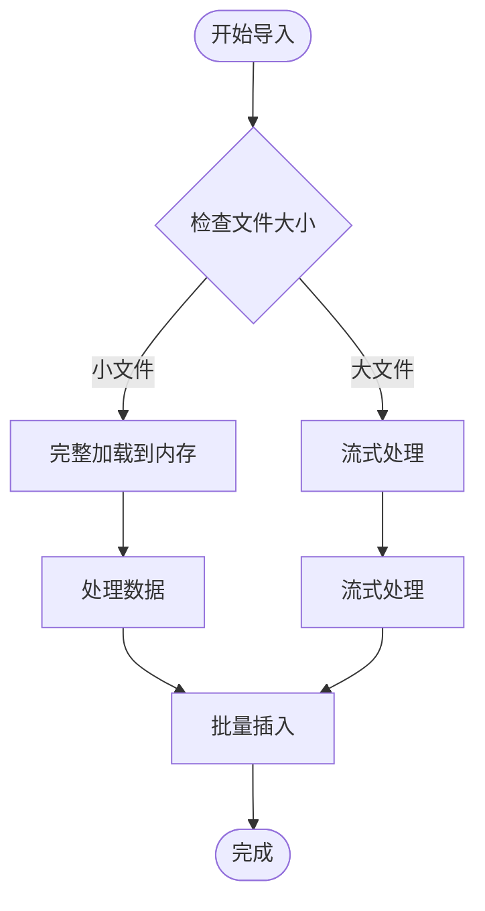

### 导入性能监控

系统提供了详细的性能监控和日志记录功能：

- 导入时间统计
- 数据处理速度监控
- 错误率跟踪
- 内存使用情况

## 故障排除指南

### 常见问题诊断

#### CSV导入问题

**问题1：列解析错误**
- 检查CSV文件的编码格式
- 验证表头行的正确性
- 确认列偏移量设置

**问题2：数据类型不匹配**
- 检查数据格式的一致性
- 验证必填字段的存在
- 确认数据范围的有效性

#### Excel导入问题

**问题1：工作表解析失败**
- 检查工作表名称的准确性
- 验证Excel文件的完整性
- 确认数据区域的正确性

**问题2：内容提取不完整**
- 检查PDF页面的可读性
- 验证文档的加密状态
- 确认字体的嵌入情况

### 错误处理机制

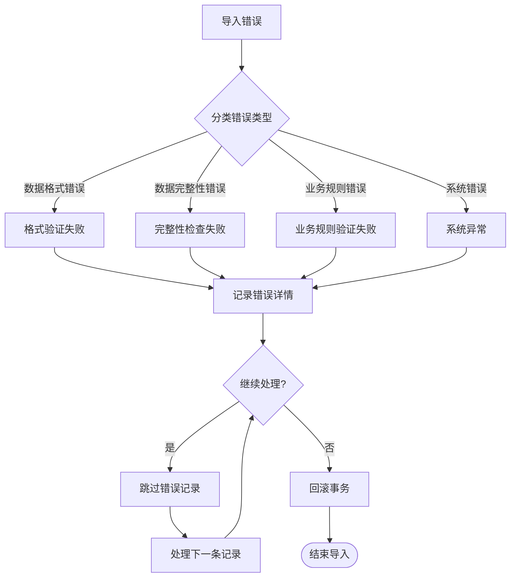

### 调试和日志

系统提供了全面的日志记录功能：

1. **详细的操作日志**：记录每个导入步骤的详细信息
2. **错误追踪**：提供完整的错误堆栈信息
3. **性能指标**：监控导入过程的性能表现
4. **数据对比**：显示导入前后的数据变化

**章节来源**
- [server/scripts/import_csv_v2.py:253-269](file://server/scripts/import_csv_v2.py#L253-L269)
- [server/scripts/import_knowledge_from_excel.js:316-319](file://server/scripts/import_knowledge_from_excel.js#L316-L319)

## 结论

Longhorn项目的数据导入基础设施是一个功能完善、架构清晰的数据处理系统。它成功地解决了多源异构数据的统一导入问题，提供了强大的数据验证和质量保证机制。

### 主要优势

1. **多格式支持**：支持CSV、Excel、PDF等多种数据格式
2. **自动化程度高**：从数据解析到导入的全流程自动化
3. **质量保证**：多层次的数据验证和错误处理机制
4. **可扩展性**：模块化的架构设计便于功能扩展
5. **性能优化**：批处理和事务管理确保高效的导入性能

### 技术特色

- **智能数据解析**：自动识别和处理不同的数据格式
- **灵活的映射机制**：支持复杂的数据转换和映射规则
- **完善的错误处理**：提供详细的错误信息和恢复机制
- **可追溯性**：完整的导入历史记录和审计功能

### 应用价值

该数据导入基础设施不仅满足了当前的业务需求，还为未来的数据集成和扩展奠定了坚实的基础。通过标准化的数据导入流程，企业可以更高效地管理和利用其数据资产，提升整体的运营效率和决策质量。