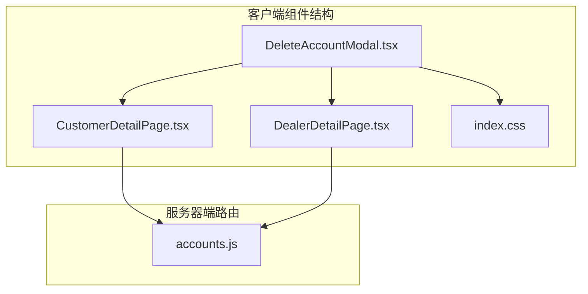
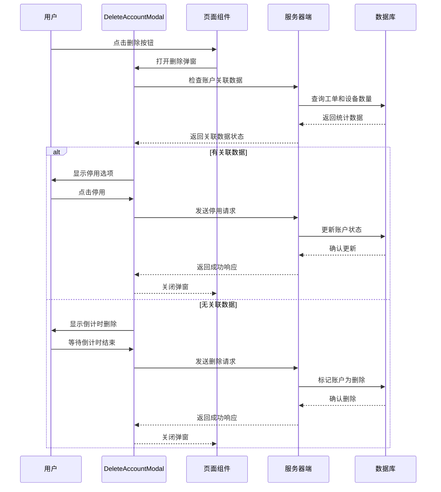
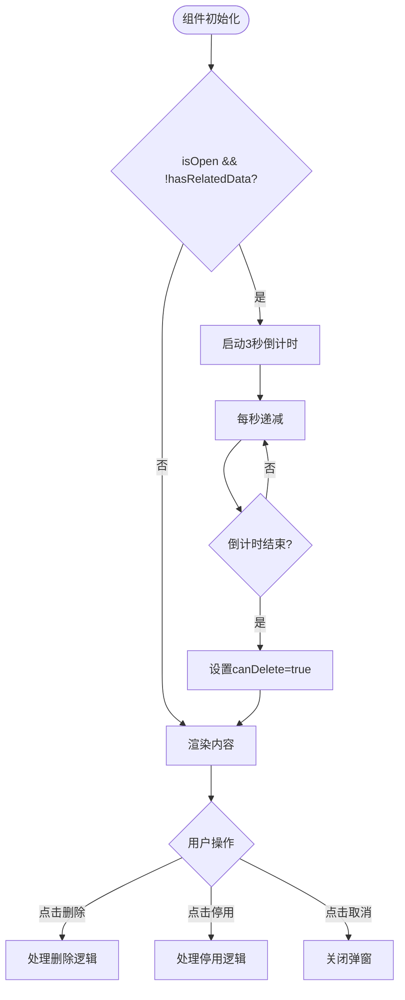
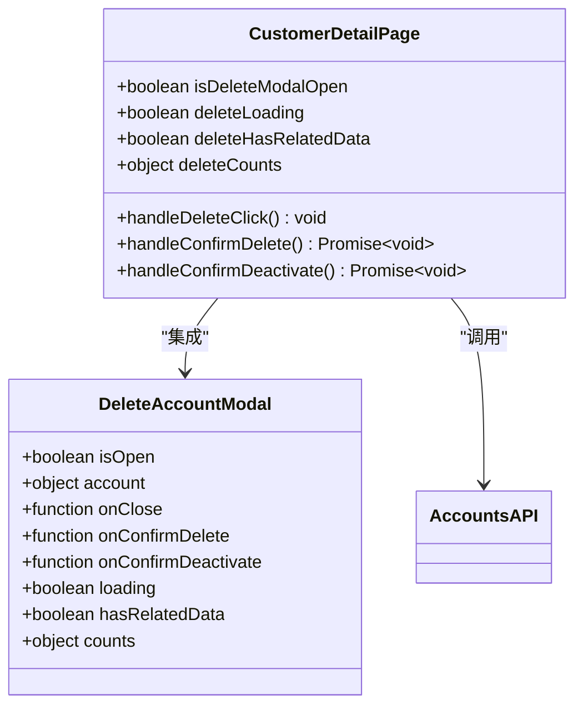
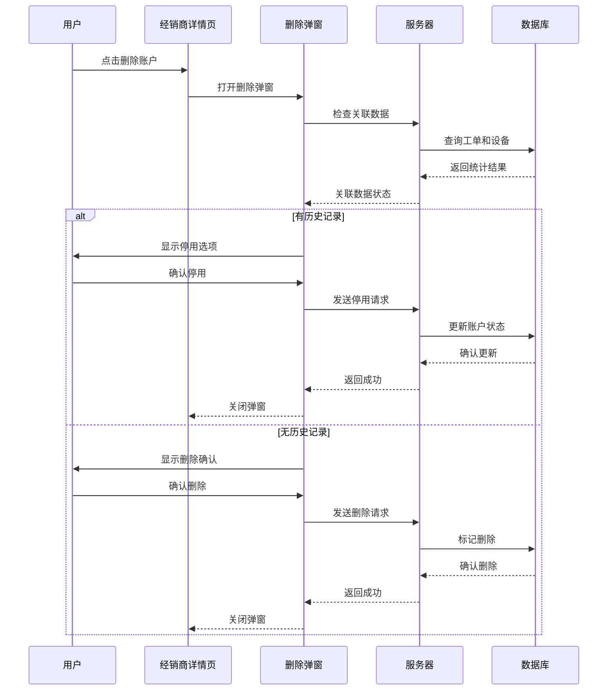
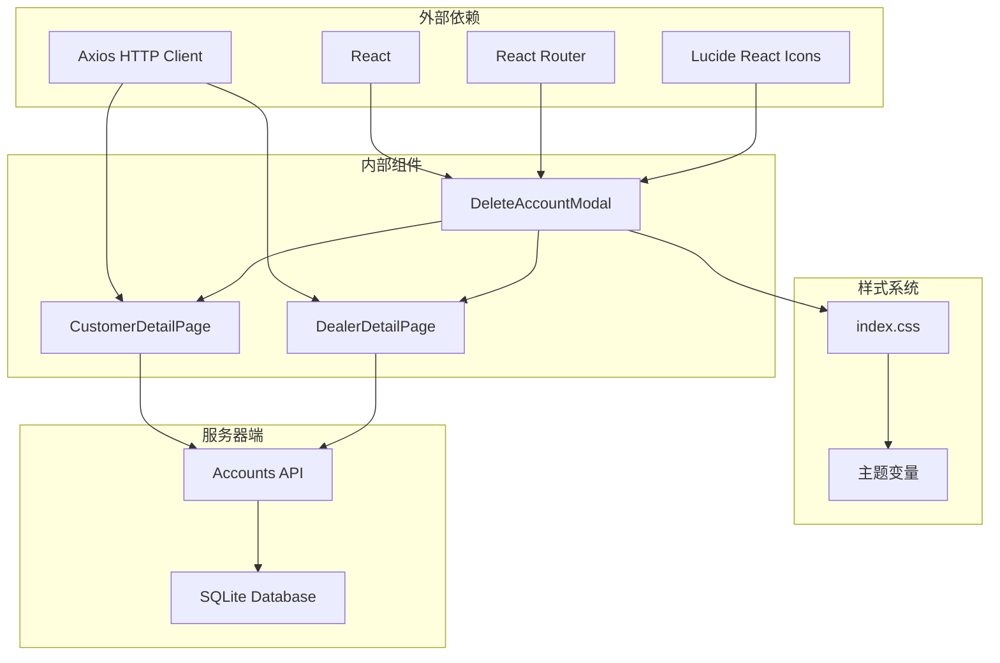

# 删除账户弹窗

<cite>
**本文档引用的文件**
- [DeleteAccountModal.tsx](file://client/src/components/DeleteAccountModal.tsx)
- [CustomerDetailPage.tsx](file://client/src/components/CustomerDetailPage.tsx)
- [DealerDetailPage.tsx](file://client/src/components/DealerDetailPage.tsx)
- [accounts.js](file://server/service/routes/accounts.js)
- [index.css](file://client/src/index.css)
</cite>

## 更新摘要
**变更内容**
- 更新倒计时确认机制的实现细节
- 新增关联数据检测和双模式操作流程
- 增强样式系统和玻璃拟态设计集成
- 完善导航集成和用户体验优化

## 目录
1. [简介](#简介)
2. [项目结构](#项目结构)
3. [核心组件](#核心组件)
4. [架构概览](#架构概览)
5. [详细组件分析](#详细组件分析)
6. [依赖关系分析](#依赖关系分析)
7. [性能考虑](#性能考虑)
8. [故障排除指南](#故障排除指南)
9. [结论](#结论)

## 简介

删除账户弹窗是一个用于安全删除客户或经销商账户的用户界面组件。该组件提供了两种删除模式：软删除（标记删除）和停用功能，确保系统数据的完整性和业务连续性。

该组件采用现代化的玻璃拟态设计风格，支持倒计时确认机制，为用户提供直观的安全操作体验。组件能够智能检测账户关联数据，并根据检测结果提供相应的操作选项。

**更新** 组件现已支持3秒倒计时确认机制，增强了用户操作的安全性和防误触能力。

## 项目结构

删除账户弹窗组件位于客户端React应用的组件目录中，与相关的页面组件协同工作：



**图表来源**
- [DeleteAccountModal.tsx:1-333](file://client/src/components/DeleteAccountModal.tsx#L1-L333)
- [CustomerDetailPage.tsx:1245-1255](file://client/src/components/CustomerDetailPage.tsx#L1245-L1255)
- [DealerDetailPage.tsx:743-753](file://client/src/components/DealerDetailPage.tsx#L743-L753)

**章节来源**
- [DeleteAccountModal.tsx:1-333](file://client/src/components/DeleteAccountModal.tsx#L1-L333)
- [CustomerDetailPage.tsx:1-200](file://client/src/components/CustomerDetailPage.tsx#L1-L200)

## 核心组件

删除账户弹窗组件具有以下核心特性：

### 主要功能特性
- **双模式删除**：支持软删除（标记删除）和停用功能
- **智能检测**：自动检测账户关联数据并提供相应操作
- **倒计时确认**：提供3秒倒计时防止误操作
- **响应式设计**：适配不同屏幕尺寸和设备类型
- **无障碍访问**：支持键盘导航和屏幕阅读器
- **导航集成**：支持关联数据的快速跳转

### 组件接口定义

```typescript
interface DeleteAccountModalProps {
    isOpen: boolean;
    account: { id: number; name: string; account_type: string } | null;
    onClose: () => void;
    onConfirmDelete: () => void;
    onConfirmDeactivate: () => void;
    loading?: boolean;
    hasRelatedData?: boolean;
    counts?: {
        tickets: number;
        inquiry_tickets?: number;
        rma_tickets?: number;
        dealer_repairs?: number;
        devices: number;
    };
}
```

**更新** 新增了关联数据检测和导航功能的接口定义。

**章节来源**
- [DeleteAccountModal.tsx:5-21](file://client/src/components/DeleteAccountModal.tsx#L5-L21)

## 架构概览

删除账户弹窗采用分层架构设计，实现了清晰的职责分离：



**更新** 架构流程现在包含了倒计时确认和关联数据检测的完整流程。

**图表来源**
- [DeleteAccountModal.tsx:37-56](file://client/src/components/DeleteAccountModal.tsx#L37-L56)
- [CustomerDetailPage.tsx:335-367](file://client/src/components/CustomerDetailPage.tsx#L335-L367)
- [accounts.js:1093-1187](file://server/service/routes/accounts.js#L1093-L1187)

## 详细组件分析

### DeleteAccountModal 组件

DeleteAccountModal 是一个高度模块化的React组件，实现了完整的删除账户功能：

#### 组件状态管理



**更新** 新增了倒计时确认的状态管理流程。

**图表来源**
- [DeleteAccountModal.tsx:37-56](file://client/src/components/DeleteAccountModal.tsx#L37-L56)
- [DeleteAccountModal.tsx:300-325](file://client/src/components/DeleteAccountModal.tsx#L300-L325)

#### 设计模式实现

组件采用了多种设计模式来确保代码的可维护性和扩展性：

1. **状态提升模式**：将状态管理提升到父组件，便于组件间通信
2. **条件渲染模式**：根据账户状态动态渲染不同的UI元素
3. **倒计时模式**：使用useEffect实现精确的倒计时控制
4. **事件委托模式**：通过onClick事件处理用户交互
5. **导航集成模式**：支持关联数据的快速跳转

#### 样式系统集成

组件深度集成了项目的CSS变量系统，实现了主题的一致性：

```css
/* 主要颜色变量 */
--accent-blue: #FFD200; /* 金色主色调 */
--accent-red: #EF4444; /* 红色警告色 */
--glass-bg: rgba(28, 28, 30, 0.75); /* 玻璃背景 */
--glass-shadow: 0 8px 32px rgba(0, 0, 0, 0.3); /* 玻璃阴影 */

/* 边框和边角半径 */
--glass-border: rgba(255, 255, 255, 0.12); /* 玻璃边框 */
--radius-lg: 16px; /* 大圆角 */
```

**更新** 样式系统现在包含了更多的CSS变量和玻璃拟态效果。

**章节来源**
- [DeleteAccountModal.tsx:82-107](file://client/src/components/DeleteAccountModal.tsx#L82-L107)
- [index.css:11-52](file://client/src/index.css#L11-L52)

### 页面集成组件

#### 客户详情页面集成

CustomerDetailPage 实现了删除账户功能的完整流程：



**更新** 页面集成现在包含了完整的倒计时和关联数据检测流程。

**图表来源**
- [CustomerDetailPage.tsx:119-124](file://client/src/components/CustomerDetailPage.tsx#L119-L124)
- [CustomerDetailPage.tsx:328-367](file://client/src/components/CustomerDetailPage.tsx#L328-L367)

#### 经销商详情页面集成

DealerDetailPage 提供了类似的删除功能，针对经销商账户进行了专门优化：



**更新** 经销商页面的集成流程现在包含了倒计时确认和导航功能。

**图表来源**
- [DealerDetailPage.tsx:743-753](file://client/src/components/DealerDetailPage.tsx#L743-L753)
- [accounts.js:1093-1187](file://server/service/routes/accounts.js#L1093-L1187)

**章节来源**
- [CustomerDetailPage.tsx:1245-1255](file://client/src/components/CustomerDetailPage.tsx#L1245-L1255)
- [DealerDetailPage.tsx:743-753](file://client/src/components/DealerDetailPage.tsx#L743-L753)

## 依赖关系分析

删除账户弹窗组件的依赖关系展现了清晰的层次结构：



**更新** 依赖关系现在包含了倒计时确认和导航功能的相关依赖。

**图表来源**
- [DeleteAccountModal.tsx:1-3](file://client/src/components/DeleteAccountModal.tsx#L1-L3)
- [CustomerDetailPage.tsx:1-8](file://client/src/components/CustomerDetailPage.tsx#L1-L8)

### 核心依赖说明

1. **React 生态系统**：使用现代React Hooks进行状态管理
2. **路由系统**：集成React Router实现页面导航
3. **图标系统**：使用Lucide React提供一致的图标体验
4. **HTTP客户端**：Axios用于API通信
5. **样式系统**：CSS变量驱动的主题系统
6. **倒计时系统**：useEffect和setInterval实现精确计时

**章节来源**
- [DeleteAccountModal.tsx:1-3](file://client/src/components/DeleteAccountModal.tsx#L1-L3)
- [CustomerDetailPage.tsx:1-8](file://client/src/components/CustomerDetailPage.tsx#L1-L8)

## 性能考虑

删除账户弹窗组件在设计时充分考虑了性能优化：

### 渲染优化
- **条件渲染**：仅在需要时渲染相关的内容区域
- **状态最小化**：避免不必要的状态更新
- **事件防抖**：防止重复触发删除操作
- **倒计时优化**：使用useEffect清理确保内存安全

### 内存管理
- **清理定时器**：在组件卸载时清理所有定时器
- **资源释放**：及时释放网络请求和事件监听器
- **状态清理**：确保组件卸载时清除所有副作用

### 网络优化
- **错误处理**：完善的错误捕获和用户反馈
- **加载状态**：显示操作进度，提升用户体验
- **防重复提交**：loading状态防止重复操作

**更新** 性能考虑现在包含了倒计时优化和内存管理的具体实现。

## 故障排除指南

### 常见问题及解决方案

#### 删除操作失败
**问题描述**：删除请求返回409状态码
**可能原因**：
- 账户存在关联的历史记录
- 权限不足
- 网络连接问题

**解决步骤**：
1. 检查账户关联数据统计
2. 确认用户权限级别
3. 验证网络连接状态
4. 查看服务器端日志

#### 倒计时异常
**问题描述**：倒计时显示异常或不工作
**可能原因**：
- useEffect清理函数未正确执行
- 组件状态同步问题
- 浏览器兼容性问题
- 内存泄漏

**解决步骤**：
1. 检查useEffect依赖数组
2. 验证组件卸载逻辑
3. 测试不同浏览器环境
4. 使用React DevTools检查组件状态

#### 样式显示问题
**问题描述**：弹窗样式不符合预期
**可能原因**：
- CSS变量未正确加载
- 主题切换冲突
- 样式优先级问题
- 玻璃拟态效果异常

**解决步骤**：
1. 检查CSS变量定义
2. 验证主题配置
3. 调整样式优先级
4. 检查backdrop-filter兼容性

**更新** 故障排除指南现在包含了倒计时异常和样式显示问题的详细解决方案。

**章节来源**
- [CustomerDetailPage.tsx:342-352](file://client/src/components/CustomerDetailPage.tsx#L342-L352)
- [DeleteAccountModal.tsx:37-56](file://client/src/components/DeleteAccountModal.tsx#L37-L56)

## 结论

删除账户弹窗组件是一个设计精良、功能完整的用户界面组件。它成功地平衡了安全性、可用性和性能要求，为用户提供了直观而可靠的操作体验。

### 主要成就
- **安全第一**：通过倒计时确认和关联数据检测确保操作安全
- **用户体验**：简洁明了的界面设计和流畅的交互流程
- **技术实现**：现代化的React开发实践和最佳编程规范
- **可维护性**：清晰的代码结构和完善的错误处理机制
- **智能检测**：自动关联数据检测和双模式操作选择

**更新** 组件现在具备了更强大的安全性和用户体验优化。

### 技术亮点
- 智能的账户状态检测和响应
- 灵活的倒计时确认机制
- 深度集成的样式系统
- 完善的错误处理和用户反馈
- 关联数据导航集成
- 多模式操作支持

该组件为整个Longhorn系统的账户管理功能奠定了坚实的基础，体现了高质量软件工程的标准和实践。