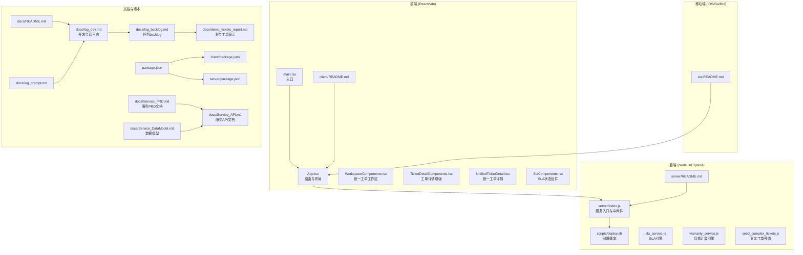
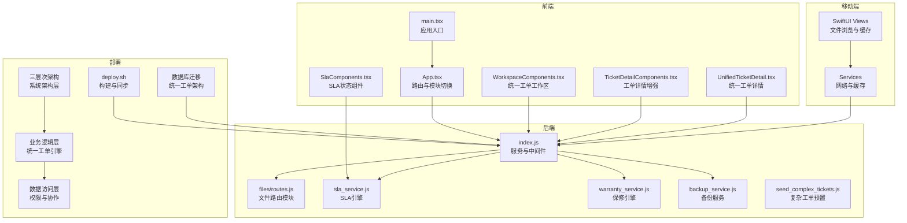
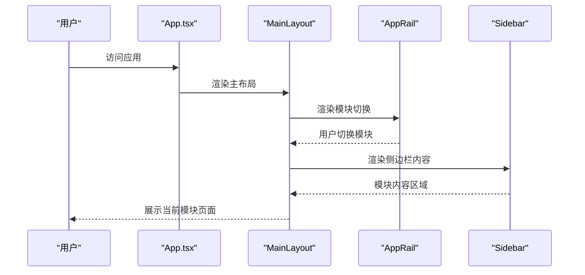
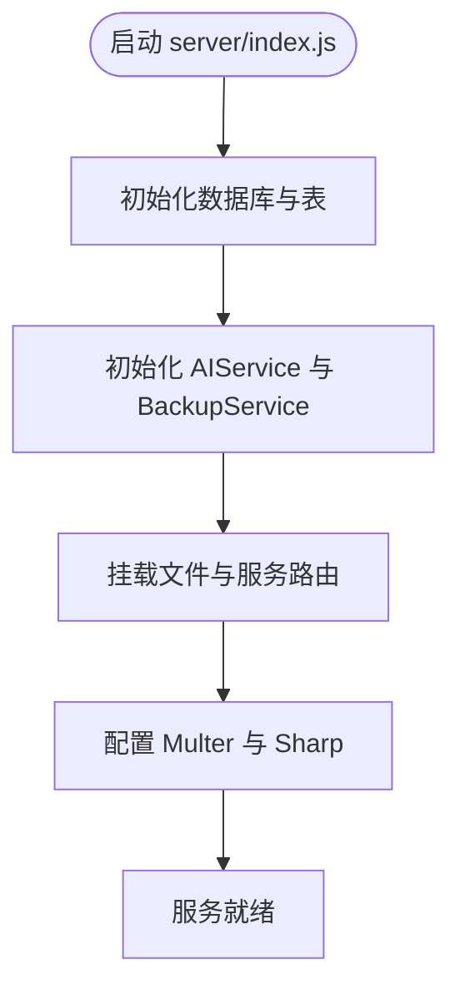
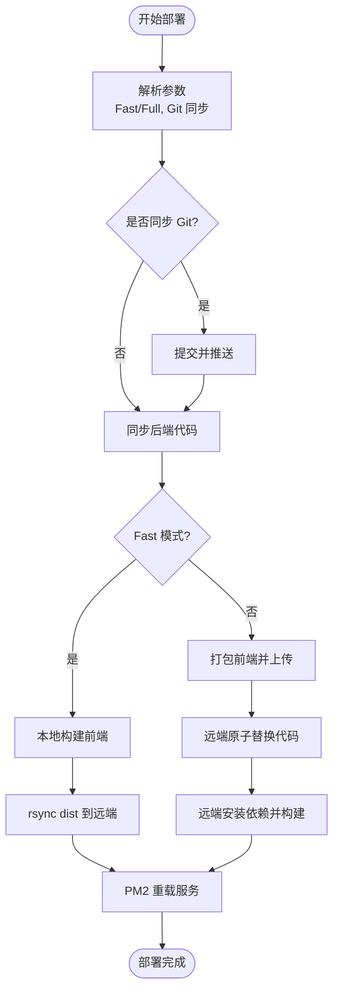
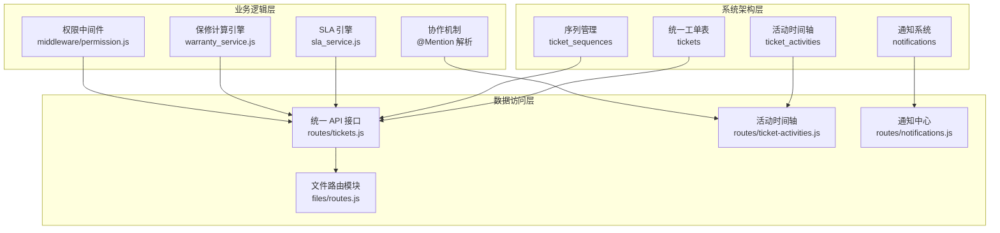
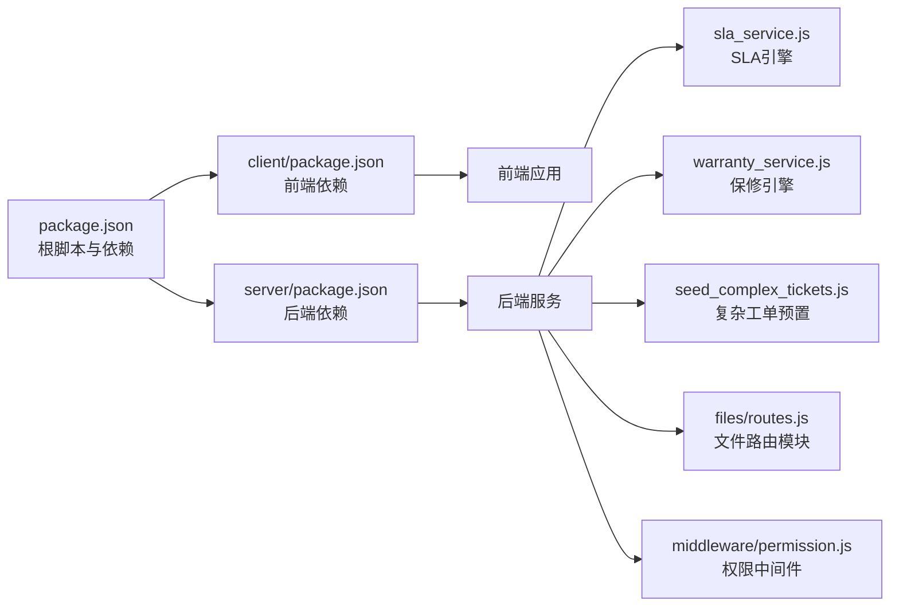

# 开发日志

<cite>
**本文档引用的文件**
- [docs/log_dev.md](file://docs/log_dev.md)
- [docs/log_backlog.md](file://docs/log_backlog.md)
- [docs/demo_tickets_report.md](file://docs/demo_tickets_report.md)
- [docs/log_prompt.md](file://docs/log_prompt.md)
- [docs/README.md](file://docs/README.md)
- [scripts/deploy.sh](file://scripts/deploy.sh)
- [client/README.md](file://client/README.md)
- [server/README.md](file://server/README.md)
- [ios/README.md](file://ios/README.md)
- [package.json](file://package.json)
- [client/package.json](file://client/package.json)
- [server/package.json](file://server/package.json)
- [client/src/main.tsx](file://client/src/main.tsx)
- [client/src/App.tsx](file://client/src/App.tsx)
- [server/index.js](file://server/index.js)
- [client/src/components/Workspace/WorkspaceComponents.tsx](file://client/src/components/Workspace/WorkspaceComponents.tsx)
- [client/src/components/Workspace/TicketDetailComponents.tsx](file://client/src/components/Workspace/TicketDetailComponents.tsx)
- [client/src/components/Workspace/UnifiedTicketDetail.tsx](file://client/src/components/Workspace/UnifiedTicketDetail.tsx)
- [client/src/components/Tickets/SlaComponents.tsx](file://client/src/components/Tickets/SlaComponents.tsx)
- [server/service/sla_service.js](file://server/service/sla_service.js)
- [server/service/warranty_service.js](file://server/service/warranty_service.js)
- [server/scripts/seed_complex_tickets.js](file://server/scripts/seed_complex_tickets.js)
- [server/longhorn.db](file://server/longhorn.db)
- [docs/Service_API.md](file://docs/Service_API.md)
- [docs/Service_PRD.md](file://docs/Service_PRD.md)
- [docs/Service_DataModel.md](file://docs/Service_DataModel.md)
</cite>

## 更新摘要
**所做更改**
- 新增统一工单系统开发进度跟踪，包含完整的开发会话日志和任务 backlog
- 添加复杂工单演示报告，展示统一工单系统的实际应用场景
- 更新架构图以反映 P2 架构升级后的统一工单系统
- 增强前端组件分析，重点介绍 Workspace 组件群和统一工单详情页
- 完善依赖关系分析，突出 SLA 引擎和通知系统的重要性
- 新增三层次架构实施的日志记录和开发过程跟踪

## 目录
1. [简介](#简介)
2. [项目结构](#项目结构)
3. [核心组件](#核心组件)
4. [架构总览](#架构总览)
5. [详细组件分析](#详细组件分析)
6. [统一工单系统开发进度](#统一工单系统开发进度)
7. [复杂工单演示报告](#复杂工单演示报告)
8. [三层次架构实施跟踪](#三层次架构实施跟踪)
9. [依赖关系分析](#依赖关系分析)
10. [性能考量](#性能考量)
11. [故障排查指南](#故障排查指南)
12. [结论](#结论)
13. [附录](#附录)

## 简介
本文件是对 Longhorn 项目的开发日志与项目结构的系统化梳理与可视化呈现。文档以"开发日志"为核心线索，结合统一工单系统的开发进度、复杂工单演示报告以及 Prompt 日志、部署脚本与多端实现，帮助读者快速理解项目在前端、后端与移动端的演进脉络、关键变更与工程实践。

**更新** 新增统一工单系统的完整开发进度跟踪，包含从 P2 架构升级到复杂工单演示的全过程记录。特别关注三层次架构实施的日志记录和开发过程跟踪，涵盖系统架构升级、组件重构、权限管理、协作机制等多个维度的详细实施过程。

## 项目结构
Longhorn 是一个前后端分离的现代化知识与工单管理平台，包含：
- 前端（React/Vite）：文件浏览、搜索、分享、权限管理、知识库与工单模块
- 后端（Node.js/Express）：文件管理、分片上传、分享、认证、知识库导入与搜索、系统设置与备份
- 移动端（iOS/SwiftUI）：与网页端一致的文件浏览、预览与缓存体验
- 文档与脚本：统一工单系统开发日志、任务 backlog、复杂工单演示报告与自动化文档更新

**图表来源**
- [client/src/App.tsx:122-200](file://client/src/App.tsx#L122-L200)
- [client/src/main.tsx:1-12](file://client/src/main.tsx#L1-L12)
- [server/index.js:1-120](file://server/index.js#L1-L120)
- [scripts/deploy.sh:1-167](file://scripts/deploy.sh#L1-L167)
- [docs/README.md:1-19](file://docs/README.md#L1-L19)
- [docs/log_dev.md:1-120](file://docs/log_dev.md#L1-L120)
- [docs/log_backlog.md:1-218](file://docs/log_backlog.md#L1-L218)
- [docs/demo_tickets_report.md:1-156](file://docs/demo_tickets_report.md#L1-L156)
- [docs/log_prompt.md:1-120](file://docs/log_prompt.md#L1-L120)
- [client/README.md:1-35](file://client/README.md#L1-L35)
- [server/README.md:1-32](file://server/README.md#L1-L32)
- [ios/README.md:1-27](file://ios/README.md#L1-L27)
- [package.json:1-18](file://package.json#L1-L18)
- [client/package.json:1-63](file://client/package.json#L1-L63)
- [server/package.json:1-41](file://server/package.json#L1-L41)
- [docs/Service_API.md:1-200](file://docs/Service_API.md#L1-L200)
- [docs/Service_PRD.md](file://docs/Service_PRD.md)
- [docs/Service_DataModel.md](file://docs/Service_DataModel.md)

**章节来源**
- [client/README.md:1-35](file://client/README.md#L1-L35)
- [server/README.md:1-32](file://server/README.md#L1-L32)
- [ios/README.md:1-27](file://ios/README.md#L1-L27)
- [docs/README.md:1-19](file://docs/README.md#L1-L19)

## 核心组件
- 前端应用入口与路由：负责模块化布局、权限控制与页面跳转
- 后端服务入口：提供认证、文件管理、知识库导入与搜索、系统设置与备份
- 部署脚本：支持快速与全量两种部署模式，自动化构建与 PM2 重载
- 文档与日志：统一工单系统开发日志、任务 backlog、复杂工单演示报告与 Prompt 日志记录每次迭代的技术产出与版本演进

**更新** 新增统一工单系统核心组件，包括 Workspace 组件群、TicketDetailComponents 和 SLA 状态组件。特别关注三层次架构的实施，包括系统架构层、业务逻辑层和数据访问层的详细实现。

**章节来源**
- [client/src/main.tsx:1-12](file://client/src/main.tsx#L1-L12)
- [client/src/App.tsx:122-200](file://client/src/App.tsx#L122-L200)
- [server/index.js:1-120](file://server/index.js#L1-L120)
- [scripts/deploy.sh:1-167](file://scripts/deploy.sh#L1-L167)

## 架构总览
前端通过路由与状态管理组织模块化界面，后端以 Express 提供 REST API，移动端通过网络层与缓存层与后端协同。部署脚本贯穿构建、同步与重启流程，确保快速上线与热重载。统一工单系统采用 P2 架构，实现工单类型的统一管理与跨模块协作。

**图表来源**
- [client/src/App.tsx:122-200](file://client/src/App.tsx#L122-L200)
- [client/src/main.tsx:1-12](file://client/src/main.tsx#L1-L12)
- [client/src/components/Workspace/WorkspaceComponents.tsx](file://client/src/components/Workspace/WorkspaceComponents.tsx)
- [client/src/components/Workspace/TicketDetailComponents.tsx](file://client/src/components/Workspace/TicketDetailComponents.tsx)
- [client/src/components/Workspace/UnifiedTicketDetail.tsx](file://client/src/components/Workspace/UnifiedTicketDetail.tsx)
- [client/src/components/Tickets/SlaComponents.tsx](file://client/src/components/Tickets/SlaComponents.tsx)
- [server/index.js:1-120](file://server/index.js#L1-L120)
- [scripts/deploy.sh:1-167](file://scripts/deploy.sh#L1-L167)
- [server/service/sla_service.js](file://server/service/sla_service.js)
- [server/service/warranty_service.js](file://server/service/warranty_service.js)
- [server/scripts/seed_complex_tickets.js](file://server/scripts/seed_complex_tickets.js)

## 详细组件分析

### 前端应用与路由（App.tsx）
- 模块化布局：通过 AppRail 与 Sidebar 实现桌面端常驻导航与移动端抽屉
- 权限控制：根据用户角色与模块访问权限动态渲染路由
- 模块划分：文件模块、服务模块（工单、知识库、经销商与客户管理等）
- 全局组件：Bokeh 容器、工单创建弹窗、Toast 与确认对话框

**图表来源**
- [client/src/App.tsx:72-120](file://client/src/App.tsx#L72-L120)

**章节来源**
- [client/src/App.tsx:122-200](file://client/src/App.tsx#L122-L200)

### 后端服务入口与中间件（server/index.js）
- 初始化：数据库、JWT、Multer、Sharp、AIService、BackupService
- 路由挂载：文件路由模块化、服务相关路由
- 数据库：系统设置、AI 提供商、用户与权限、产品与工单等核心表
- 存储：DISK_A 作为模拟分布式存储根目录，支持上传、分片与缩略图

**图表来源**
- [server/index.js:1-120](file://server/index.js#L1-L120)

**章节来源**
- [server/index.js:1-120](file://server/index.js#L1-L120)

### 部署脚本（scripts/deploy.sh）
- 快速模式：本地构建前端产物，rsync 同步至远端，PM2 重载
- 全量模式：打包前端代码，原子替换远端代码，远端安装依赖并构建
- Git 同步：可选的本地提交与推送流程

**图表来源**
- [scripts/deploy.sh:1-167](file://scripts/deploy.sh#L1-L167)

**章节来源**
- [scripts/deploy.sh:1-167](file://scripts/deploy.sh#L1-L167)

### 开发日志与 Prompt 日志（docs/log_dev.md, docs/log_prompt.md）
- 开发日志：记录每次会话的任务完成情况、技术产出与版本迭代
- Prompt 日志：记录用户提示与 Agent 回应，体现功能演进与修复路径
- 示例：品牌化对齐、UI/UX 精修、知识库导入优化、搜索召回增强、状态持久化与导航修复、备份系统实现等

**更新** 新增统一工单系统开发日志，涵盖 P2 架构升级、Workspace 重构、复杂工单演示等内容。特别记录三层次架构实施过程中的关键节点和里程碑。

**章节来源**
- [docs/log_dev.md:1-1908](file://docs/log_dev.md#L1-L1908)
- [docs/log_prompt.md:1-2503](file://docs/log_prompt.md#L1-L2503)

## 统一工单系统开发进度

### P2 架构升级（已完成 100%）
**阶段 2.5：导航与集成** ✅
- 侧边栏分组重构：MANAGEMENT/WORKSPACE/OPERATIONS/KNOWLEDGE/ARCHIVES
- 角色统一：Manager→Lead, Staff→Member（数据库迁移）
- Files 入口修复：Lead 角色现在可访问 Files 模块
- 版本发布：v12.2.1 已部署至 mini 服务器

**阶段 2.1：数据基础** ✅
- 数据库迁移：020_p2_unified_tickets.sql, 021_migrate_tickets_data.js
- SLA 引擎：sla_service.js（时长矩阵/状态检测/超时计数）
- 保修计算引擎：warranty_service.js
- 向后兼容 API 适配层：legacy-adapter.js

**阶段 2.2：权限与协作** ✅
- 穿透式权限中间件：middleware/permission.js
- @Mention 解析与通知：ticket-activities.js
- participants 管理 API + 活动时间轴 API

**阶段 2.3：前端重构** ✅
- Workspace 组件群：WorkspaceComponents.tsx
- 工单详情页增强：TicketDetailComponents.tsx
- Overview 仪表盘：OverviewDashboard.tsx
- View As 权限组件：ViewAsComponents.tsx
- 导航架构重构：ServiceNavigation.tsx（独立模块化导航）

**阶段 2.4：验证与调优** ✅
- 数据迁移验证：本地 43 条 / 远程 48 条
- SLA 验证脚本：scripts/validate_sla.js
- 权限场景测试：scripts/test_view_as.js（93.8% 通过率）
- 性能优化索引

**章节来源**
- [docs/log_backlog.md:8-39](file://docs/log_backlog.md#L8-L39)
- [server/service/sla_service.js](file://server/service/sla_service.js)
- [server/service/warranty_service.js](file://server/service/warranty_service.js)

### 复杂工单演示预置（v12.2.8）
- 强校验和预置了 10 个满足 P2 业务特性的复杂测试工单
- 跨越 VIP/RMA 等真实服务场景
- 处理了跨表查询的 accounts 外键兼容
- 通过 /upd 强制更新版本并部署上线

**章节来源**
- [docs/log_dev.md:514-521](file://docs/log_dev.md#L514-L521)
- [server/scripts/seed_complex_tickets.js](file://server/scripts/seed_complex_tickets.js)

## 复杂工单演示报告

### 最新预置的 10 个复杂工单详情报告

#### [K2603-0001-DEMO] Waiver request for out-of-warranty repair
- **类型**: `INQUIRY`  **状态**: `in_progress`  **当前节点**: `ms_review`
- **指派给**: Effy  **创建者**: Effy
- **创建时间**: 2026/3/1 10:07:34

**沟通与活动节点流**：
- **[10:07:34] System** (status_change): 状态变更: draft → ms_review
- **[10:17:34] System** (comment): @Manager 这个客户很强势，这次能不能免单？(VIP 客户)
- **[10:18:34] System** (system_event): Effy 发起了审批申请 类型：报价豁免 (Waiver) 金额：$800.00 → $0.00 理由：VIP 客户关系维护 状态：待经理审批
- **[10:22:34] System** (system_event): Manager 已批准备注：同意，但请提醒客户下次必须按流程。
- **[11:02:34] System** (comment): 收到，已经和客户沟通完毕！

#### [RMA-C-2603-001-DEMO] Sensor artifact during 8K record
- **类型**: `RMA`  **状态**: `in_progress`  **当前节点**: `op_diagnosing`
- **指派给**: ZhangOP  **创建者**: admin
- **创建时间**: 2026/3/1 09:07:34

**沟通与活动节点流**：
- **[10:07:34] System** (comment): Received device. The IB snapshot shows Netflix US, MAVO Edge 8K. Dealer is ProAV. Running CMOS test.
- **[11:06:34] System** (system_event): SLA 已经超时 (P0)

#### [RMA-C-2603-010-DEMO] SDI port loose
- **类型**: `RMA`  **状态**: `in_progress`  **当前节点**: `op_repairing`
- **指派给**: ZhangOP  **创建者**: Effy
- **创建时间**: 2026/2/27 11:07:34

**沟通与活动节点流**：
- **[09:07:34] System** (system_event): SLA Breach: Overdue by 2 hours.
- **[10:07:34] System** (comment): @ZhangOP 这个单子卡了很久了，Netflix 明天要机器首映，今晚加紧修出来！
- **[11:02:34] System** (comment): @cathy 收到，已经去物料房领了配件，晚上搞定并发测试。

**章节来源**
- [docs/demo_tickets_report.md:1-156](file://docs/demo_tickets_report.md#L1-L156)

## 三层次架构实施跟踪

### 系统架构层（System Architecture Layer）
- **统一工单表设计**：tickets 表统一管理所有工单类型，包含统一的活动时间轴 ticket_activities
- **序列管理**：ticket_sequences 提供统一的编号生成机制
- **通知系统**：notifications 表统一管理各类系统通知
- **数据库迁移**：020_p2_unified_tickets.sql 完成架构升级

### 业务逻辑层（Business Logic Layer）
- **SLA 引擎**：sla_service.js 实现时长矩阵、状态检测、超时计数
- **保修计算引擎**：warranty_service.js 实现复杂的保修核算逻辑
- **权限中间件**：middleware/permission.js 实现穿透式权限控制
- **协作机制**：@Mention 解析与自动通知

### 数据访问层（Data Access Layer）
- **统一 API 接口**：routes/tickets.js 提供统一的工单 CRUD 操作
- **活动时间轴**：routes/ticket-activities.js 管理工单活动记录
- **通知中心**：routes/notifications.js 提供通知管理 API
- **文件路由模块化**：files/routes.js 独立管理文件操作

**图表来源**
- [server/service/sla_service.js](file://server/service/sla_service.js)
- [server/service/warranty_service.js](file://server/service/warranty_service.js)
- [server/service/middleware/permission.js](file://server/service/middleware/permission.js)
- [server/files/routes.js](file://server/files/routes.js)

**章节来源**
- [server/service/sla_service.js](file://server/service/sla_service.js)
- [server/service/warranty_service.js](file://server/service/warranty_service.js)
- [server/service/middleware/permission.js](file://server/service/middleware/permission.js)
- [server/files/routes.js](file://server/files/routes.js)

## 依赖关系分析
- 根级 package.json 提供统一脚本与依赖
- 前端 package.json 管理 React、Vite、国际化与状态管理等依赖
- 后端 package.json 管理 Express、SQLite、Multer、Sharp、OpenAI 等依赖
- 版本号：根版本 v1.5.34，前端 v12.1.78，后端 v1.5.51

**更新** 新增统一工单系统相关依赖，包括 SLA 引擎、保修计算引擎和复杂工单预置脚本。特别关注三层次架构实施中的依赖关系变化。

**图表来源**
- [package.json:1-18](file://package.json#L1-L18)
- [client/package.json:1-63](file://client/package.json#L1-L63)
- [server/package.json:1-41](file://server/package.json#L1-L41)
- [server/service/sla_service.js](file://server/service/sla_service.js)
- [server/service/warranty_service.js](file://server/service/warranty_service.js)
- [server/scripts/seed_complex_tickets.js](file://server/scripts/seed_complex_tickets.js)
- [server/files/routes.js](file://server/files/routes.js)
- [server/service/middleware/permission.js](file://server/service/middleware/permission.js)

**章节来源**
- [package.json:1-18](file://package.json#L1-L18)
- [client/package.json:1-63](file://client/package.json#L1-L63)
- [server/package.json:1-41](file://server/package.json#L1-L41)

## 性能考量
- 前端构建：Vite 快速冷启动与热更新，生产构建按需打包
- 后端性能：WAL 模式数据库、Multer 分片上传、Sharp 图像处理、PM2 集群与热重载
- 移动端缓存：智能缓存与后台刷新，SWR 模式提升用户体验
- 部署效率：快速模式本地构建、远端同步与 PM2 重载，显著缩短上线时间
- 统一工单系统：SLA 引擎优化、数据迁移验证、权限场景测试提升系统稳定性
- 三层次架构：系统架构层的统一设计减少重复代码，业务逻辑层的模块化提高可维护性

## 故障排查指南
- 部署失败
  - 现象：rsync 或 PM2 重载失败
  - 排查：检查 SSH 连接、远端路径与权限、本地构建是否成功
  - 参考：部署脚本中的错误处理与日志输出
- 前端构建错误
  - 现象：TypeScript 编译或 Vite 构建失败
  - 排查：检查依赖安装、类型定义与路由配置
  - 参考：前端 README 与 package.json
- 后端服务异常
  - 现象：数据库连接、文件存储或 AI 服务异常
  - 排查：检查数据库初始化、存储路径与环境变量、AI 提供商配置
  - 参考：后端 README 与 server/index.js
- 统一工单系统异常
  - 现象：SLA 超时、工单状态异常、权限验证失败
  - 排查：检查 SLA 引擎配置、数据迁移脚本、权限中间件
  - 参考：sla_service.js、权限中间件与数据库迁移脚本
- 三层次架构问题
  - 现象：系统架构层数据不一致、业务逻辑层性能下降、数据访问层权限错误
  - 排查：检查三层之间的接口契约、数据一致性、权限控制
  - 参考：各层的实现文件与相关配置

**章节来源**
- [scripts/deploy.sh:1-167](file://scripts/deploy.sh#L1-L167)
- [client/README.md:1-35](file://client/README.md#L1-L35)
- [server/README.md:1-32](file://server/README.md#L1-L32)
- [server/index.js:1-120](file://server/index.js#L1-L120)

## 结论
本开发日志系统梳理了 Longhorn 在前端、后端与移动端的关键演进路径，涵盖 UI/UX 优化、知识库导入与搜索增强、状态持久化与导航修复、备份系统实现与部署自动化等重要里程碑。**更新** 新增统一工单系统的完整开发进度跟踪，包括 P2 架构升级、Workspace 组件重构、SLA 引擎实现和复杂工单演示预置。特别关注三层次架构实施的日志记录和开发过程跟踪，形成从系统架构层到业务逻辑层再到数据访问层的完整实施路径。

通过文档与脚本的协同，项目形成了可追溯、可复现、可快速上线的工程化体系。三层次架构的实施为系统的可扩展性和可维护性奠定了坚实基础，统一工单系统的开发为后续的功能扩展提供了清晰的架构指导。

## 附录
- 项目文档集合：PRD、部署手册、快速上线参考、远程开发指南
- 版本与脚本：根级与子项目版本号、统一部署与构建脚本
- 统一工单系统文档：开发日志、任务 backlog、复杂工单演示报告
- 三层次架构文档：系统架构设计、业务逻辑实现、数据访问层规范

**章节来源**
- [docs/README.md:1-19](file://docs/README.md#L1-L19)
- [package.json:1-18](file://package.json#L1-L18)
- [client/package.json:1-63](file://client/package.json#L1-L63)
- [server/package.json:1-41](file://server/package.json#L1-L41)
- [docs/log_dev.md:1-1908](file://docs/log_dev.md#L1-L1908)
- [docs/log_backlog.md:1-218](file://docs/log_backlog.md#L1-L218)
- [docs/demo_tickets_report.md:1-156](file://docs/demo_tickets_report.md#L1-L156)
- [docs/Service_API.md:1-200](file://docs/Service_API.md#L1-L200)
- [docs/Service_PRD.md](file://docs/Service_PRD.md)
- [docs/Service_DataModel.md](file://docs/Service_DataModel.md)