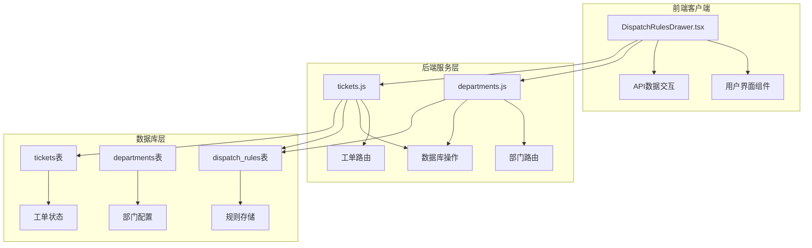
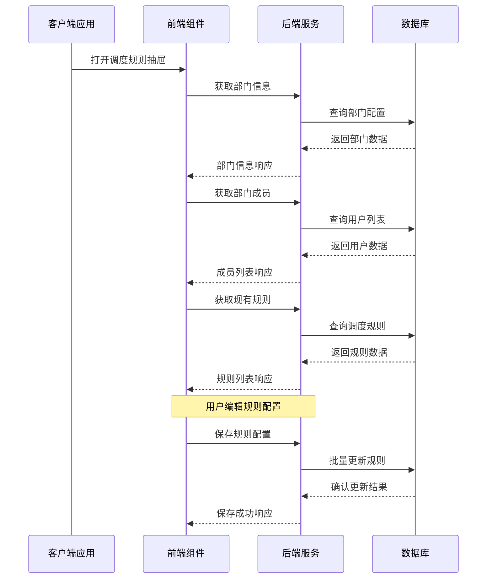
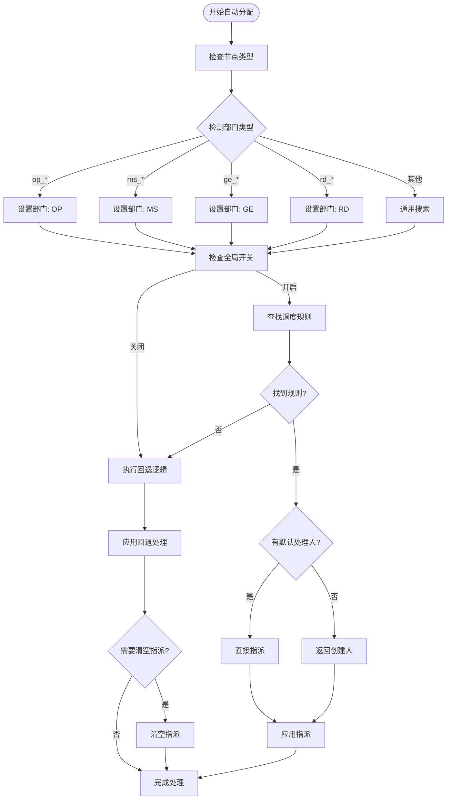
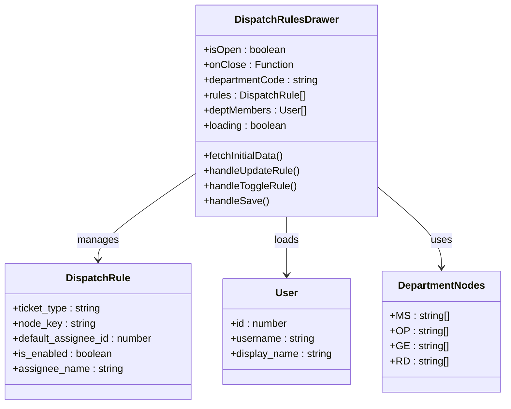
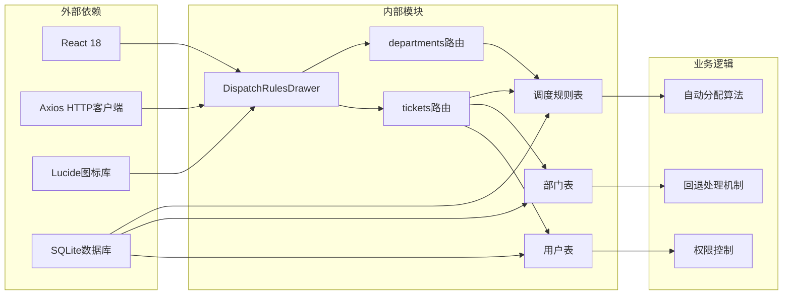

# 调度规则系统

<cite>
**本文档引用的文件**
- [DispatchRulesDrawer.tsx](file://client/src/components/Service/DispatchRulesDrawer.tsx)
- [departments.js](file://server/service/routes/departments.js)
- [tickets.js](file://server/service/routes/tickets.js)
- [026_dispatch_rules.sql](file://server/service/migrations/026_dispatch_rules.sql)
- [028_add_department_code.sql](file://server/service/migrations/028_add_department_code.sql)
</cite>

## 目录
1. [简介](#简介)
2. [项目结构](#项目结构)
3. [核心组件](#核心组件)
4. [架构概览](#架构概览)
5. [详细组件分析](#详细组件分析)
6. [依赖关系分析](#依赖关系分析)
7. [性能考虑](#性能考虑)
8. [故障排除指南](#故障排除指南)
9. [结论](#结论)

## 简介

调度规则系统是Longhorn工单管理系统中的核心自动化组件，负责根据部门、工单类型和节点状态自动分配工单处理人员。该系统实现了"乒乓模型"的智能分发机制，通过配置化的规则管理，确保工单在不同部门和节点间的高效流转。

系统支持四种主要部门类型：MS（管理/客服）、OP（运营/技师）、GE（通用审核）和RD（研发），每个部门都有其特定的节点流程和默认处理规则。当工单进入某个节点时，系统会根据预设规则自动指派给相应的处理人员，如果没有匹配规则，则按照预定义的回退逻辑进行处理。

## 项目结构

调度规则系统采用前后端分离的架构设计，主要包含以下组件：

**图表来源**
- [DispatchRulesDrawer.tsx](file://client/src/components/Service/DispatchRulesDrawer.tsx#L1-L380)
- [departments.js](file://server/service/routes/departments.js#L1-L164)
- [tickets.js](file://server/service/routes/tickets.js#L130-L364)

**章节来源**
- [DispatchRulesDrawer.tsx](file://client/src/components/Service/DispatchRulesDrawer.tsx#L1-L380)
- [departments.js](file://server/service/routes/departments.js#L1-L164)

## 核心组件

### 前端调度规则抽屉组件

前端组件提供了可视化的规则配置界面，支持实时编辑和预览功能：

- **规则配置界面**：基于React开发的现代化抽屉式界面
- **部门节点映射**：支持MS、OP、GE、RD四个部门的节点配置
- **用户选择器**：动态加载部门成员进行默认处理人配置
- **状态切换**：支持启用/停用规则的即时切换
- **批量操作**：支持一次性保存多个规则配置

### 后端规则管理服务

后端提供了完整的RESTful API接口，支持规则的增删改查操作：

- **规则查询接口**：获取指定部门的所有调度规则
- **批量更新接口**：支持一次性更新多个规则配置
- **权限控制**：基于角色的访问控制（Lead/Admin）
- **数据验证**：严格的输入参数验证和错误处理

### 数据库规则存储

系统使用SQLite数据库存储调度规则，具有以下特点：

- **唯一约束**：确保每个部门、工单类型和节点的规则唯一性
- **外键关联**：与部门和用户表建立关联关系
- **JSON扩展**：预留配置字段用于未来功能扩展
- **时间戳记录**：自动记录创建和更新时间

**章节来源**
- [DispatchRulesDrawer.tsx](file://client/src/components/Service/DispatchRulesDrawer.tsx#L12-L32)
- [departments.js](file://server/service/routes/departments.js#L31-L95)
- [026_dispatch_rules.sql](file://server/service/migrations/026_dispatch_rules.sql#L4-L17)

## 架构概览

调度规则系统采用三层架构设计，实现了清晰的职责分离：

**图表来源**
- [DispatchRulesDrawer.tsx](file://client/src/components/Service/DispatchRulesDrawer.tsx#L67-L96)
- [departments.js](file://server/service/routes/departments.js#L34-L95)

系统的核心工作流程包括三个主要阶段：

1. **规则匹配阶段**：根据工单类型、节点状态和部门信息查找匹配的调度规则
2. **回退处理阶段**：当没有匹配规则时，按照预定义的回退逻辑进行处理
3. **自动分配阶段**：执行工单自动指派并记录相关活动

## 详细组件分析

### 调度规则自动分配算法

系统的核心算法实现了智能的工单自动分配功能：

**图表来源**
- [tickets.js](file://server/service/routes/tickets.js#L133-L364)

### 部门特定的回退逻辑

不同部门有不同的回退处理策略：

| 部门类型 | 回退策略 | 处理逻辑 |
|---------|---------|---------|
| OP (运营/技师) | 待认领池 | 无规则时放入部门待认领池 |
| MS (管理/客服) | 层级回退 | 优先返回本部门原处理人，否则返回部门负责人，最后返回创建人 |
| GE/RD (通用/研发) | 负责人优先 | 优先返回部门负责人，否则返回创建人 |

### 前端用户界面组件

前端组件提供了直观的可视化配置界面：

**图表来源**
- [DispatchRulesDrawer.tsx](file://client/src/components/Service/DispatchRulesDrawer.tsx#L6-L32)

**章节来源**
- [tickets.js](file://server/service/routes/tickets.js#L133-L364)
- [DispatchRulesDrawer.tsx](file://client/src/components/Service/DispatchRulesDrawer.tsx#L48-L380)

## 依赖关系分析

调度规则系统涉及多个层面的依赖关系：

**图表来源**
- [DispatchRulesDrawer.tsx](file://client/src/components/Service/DispatchRulesDrawer.tsx#L1-L5)
- [departments.js](file://server/service/routes/departments.js#L1-L8)
- [tickets.js](file://server/service/routes/tickets.js#L1-L20)

系统的主要依赖包括：

- **前端框架**：React 18提供组件化开发基础
- **HTTP客户端**：Axios用于前后端数据通信
- **数据库引擎**：SQLite提供轻量级数据存储解决方案
- **图标系统**：Lucide提供统一的视觉元素

**章节来源**
- [DispatchRulesDrawer.tsx](file://client/src/components/Service/DispatchRulesDrawer.tsx#L1-L5)
- [departments.js](file://server/service/routes/departments.js#L1-L8)

## 性能考虑

调度规则系统在设计时充分考虑了性能优化：

### 数据库查询优化
- 使用索引优化部门代码查询
- 通过UNIQUE约束避免重复规则
- 批量操作减少数据库往返次数

### 前端渲染优化
- 懒加载部门成员数据
- 实时状态更新避免不必要的重渲染
- 缓存机制减少重复请求

### 算法复杂度分析
- 规则查找：O(1)平均时间复杂度
- 回退逻辑：O(log n)时间复杂度
- 批量更新：O(n)时间复杂度

## 故障排除指南

### 常见问题及解决方案

**问题1：规则无法保存**
- 检查用户权限是否具备Lead/Admin角色
- 验证规则格式是否正确
- 确认数据库连接状态

**问题2：自动分配不生效**
- 检查全局开关是否开启
- 验证部门节点映射是否正确
- 确认用户权限配置

**问题3：回退逻辑异常**
- 检查部门负责人配置
- 验证用户部门归属
- 确认工单创建人权限

### 调试工具和方法

系统提供了完善的日志记录机制：

- **前端调试**：浏览器开发者工具查看网络请求
- **后端日志**：控制台输出详细的处理过程
- **数据库监控**：SQL查询执行计划分析

**章节来源**
- [departments.js](file://server/service/routes/departments.js#L57-L95)
- [tickets.js](file://server/service/routes/tickets.js#L361-L364)

## 结论

调度规则系统通过精心设计的架构和算法，实现了工单管理的智能化和自动化。系统的主要优势包括：

1. **高度可配置性**：支持灵活的规则配置和部门特定的处理逻辑
2. **智能回退机制**：确保在各种情况下都能找到合适的处理方案
3. **用户友好界面**：提供直观的可视化配置工具
4. **性能优化设计**：通过多种技术手段保证系统的高效运行

该系统为Longhorn工单管理提供了坚实的自动化基础，能够显著提高工单处理效率和质量，同时保持良好的可维护性和扩展性。