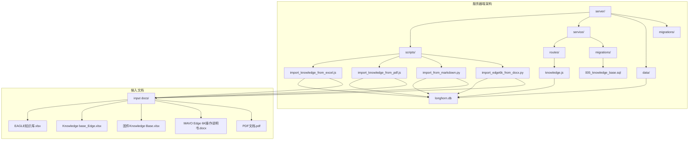
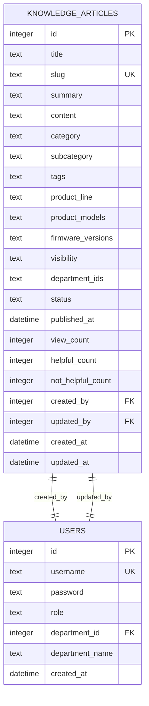
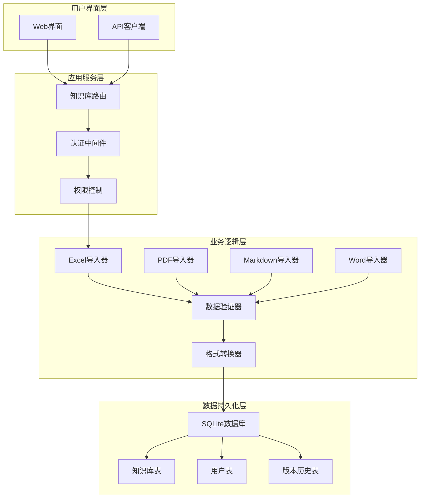
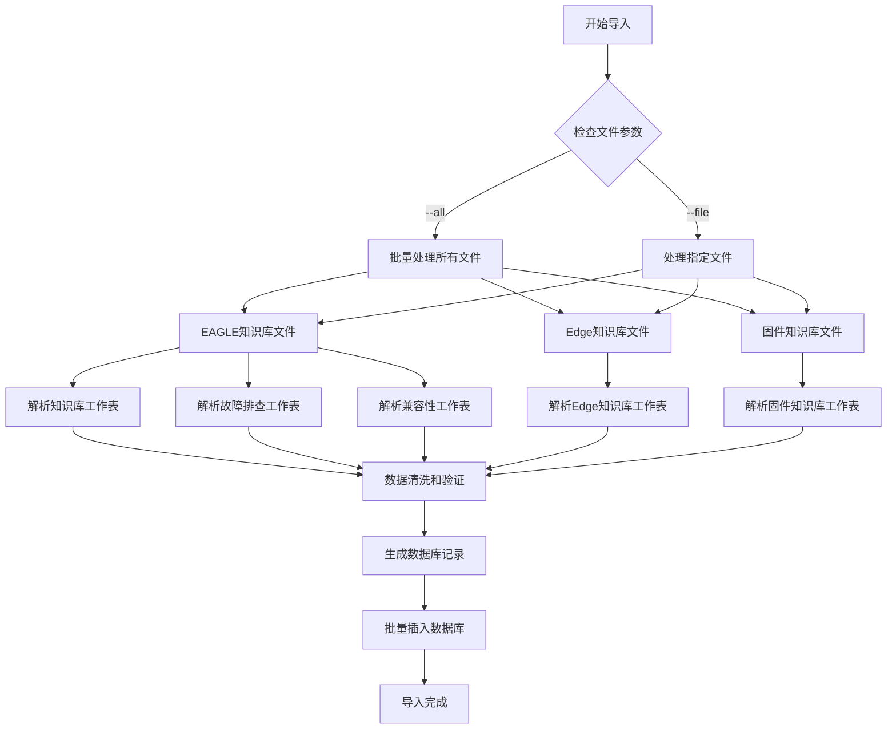
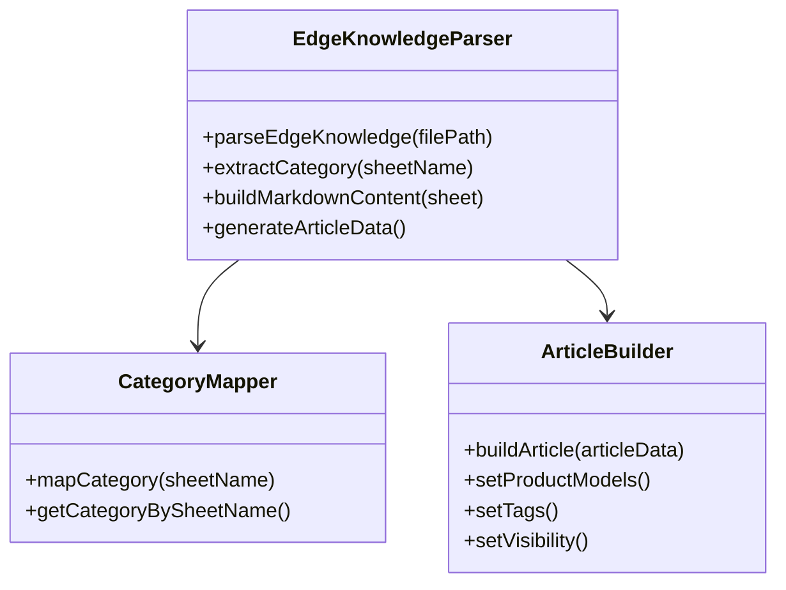
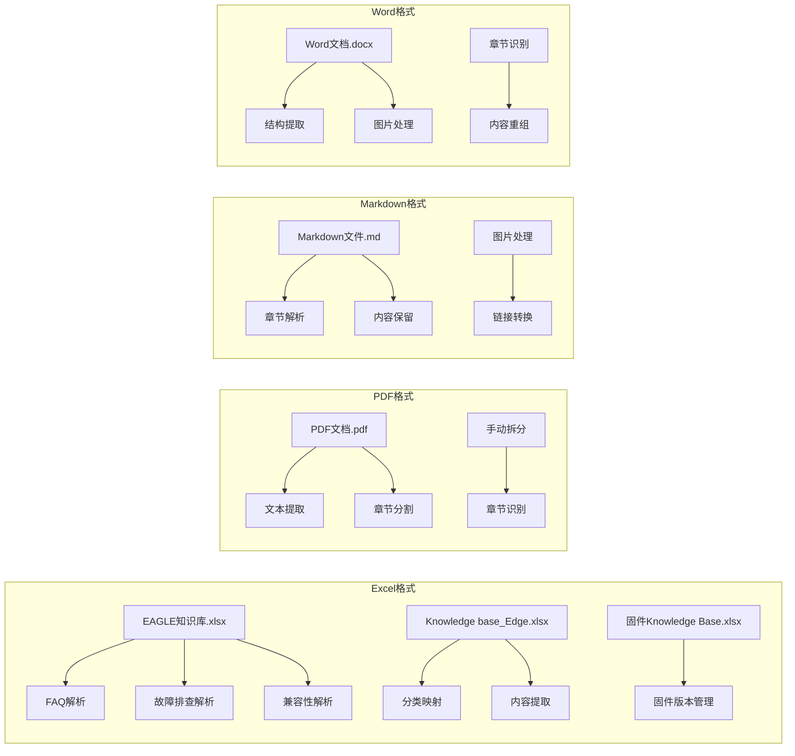
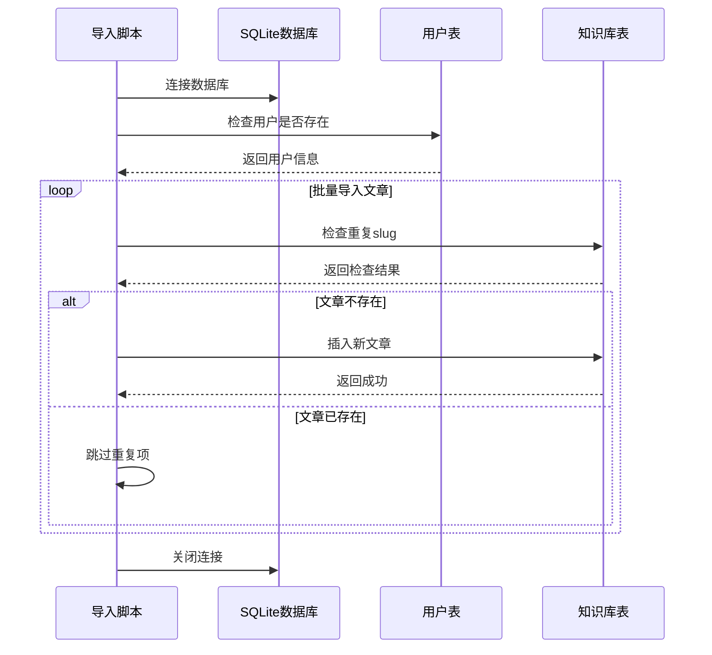
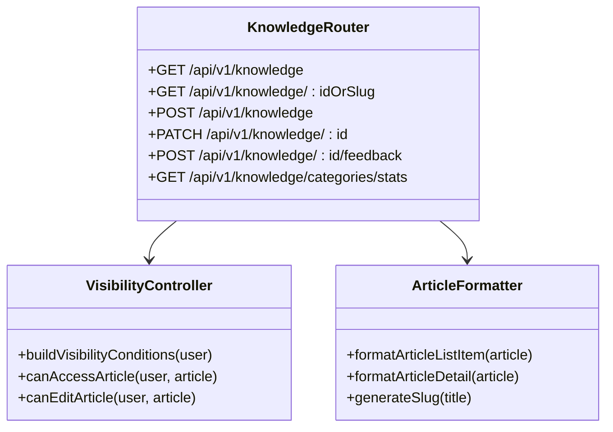
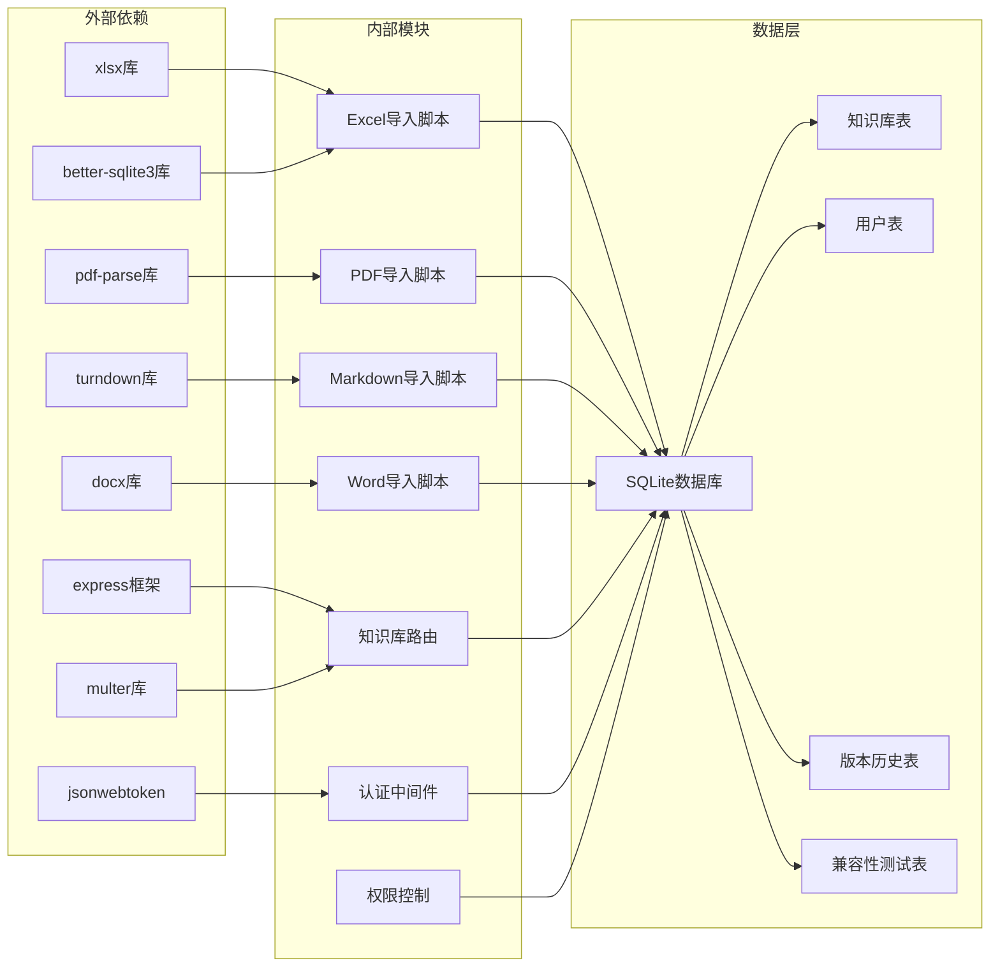

# Excel知识库导入脚本

<cite>
**本文档中引用的文件**
- [import_knowledge_from_excel.js](file://server/scripts/import_knowledge_from_excel.js)
- [knowledge.js](file://server/service/routes/knowledge.js)
- [005_knowledge_base.sql](file://server/service/migrations/005_knowledge_base.sql)
- [package.json](file://server/package.json)
- [index.js](file://server/index.js)
- [apply_service_migrations.js](file://server/apply_service_migrations.js)
- [service/index.js](file://server/service/index.js)
- [import_knowledge_from_pdf.js](file://server/scripts/import_knowledge_from_pdf.js)
- [import_from_markdown.py](file://server/scripts/import_from_markdown.py)
- [import_edge6k_from_docx.py](file://server/scripts/import_edge6k_from_docx.py)
</cite>

## 更新摘要
**所做更改**
- 新增了对多种Excel导入格式的支持说明
- 更新了数据处理能力和增强功能的描述
- 增加了与其他导入脚本的对比分析
- 完善了架构图和数据流图

## 目录
1. [简介](#简介)
2. [项目结构](#项目结构)
3. [核心组件](#核心组件)
4. [架构概览](#架构概览)
5. [详细组件分析](#详细组件分析)
6. [依赖关系分析](#依赖关系分析)
7. [性能考虑](#性能考虑)
8. [故障排除指南](#故障排除指南)
9. [结论](#结论)

## 简介

Excel知识库导入脚本是Longhorn系统中的重要工具，用于将Excel格式的知识库文档转换为结构化的数据库记录。该脚本支持多种Excel文件格式，包括EAGLE知识库、MAVO Edge知识库和固件知识库，能够自动解析不同工作表的数据并将其导入到SQLite数据库中。

**更新** 新增了对多种导入格式的全面支持，包括Excel、PDF、Markdown和Word文档等多种格式的处理能力。

该系统采用分层架构设计，包含数据导入层、业务逻辑层和数据持久化层，确保知识库数据的准确性和完整性。通过可视化的界面和API接口，用户可以轻松管理和访问知识库内容。

## 项目结构

Longhorn系统的知识库导入功能分布在以下关键目录中：

**图表来源**
- [import_knowledge_from_excel.js](file://server/scripts/import_knowledge_from_excel.js#L1-L390)
- [knowledge.js](file://server/service/routes/knowledge.js#L1-L1563)
- [005_knowledge_base.sql](file://server/service/migrations/005_knowledge_base.sql#L1-L214)

**章节来源**
- [import_knowledge_from_excel.js](file://server/scripts/import_knowledge_from_excel.js#L1-L390)
- [knowledge.js](file://server/service/routes/knowledge.js#L1-L1563)

## 核心组件

### 导入脚本核心功能

导入脚本包含以下主要功能模块：

1. **Excel文件解析器**：支持多种Excel格式和工作表结构
2. **数据清洗器**：处理文本清理和格式标准化
3. **数据库导入器**：将结构化数据写入SQLite数据库
4. **文件管理器**：处理输入输出文件路径和验证

**更新** 新增了对PDF、Markdown和Word文档的综合导入支持，形成了多格式一体化的知识库导入解决方案。

### 数据库模式

知识库系统采用完整的数据库模式设计，支持多层级的可见性控制：

**图表来源**
- [005_knowledge_base.sql](file://server/service/migrations/005_knowledge_base.sql#L10-L50)

**章节来源**
- [005_knowledge_base.sql](file://server/service/migrations/005_knowledge_base.sql#L1-L214)

## 架构概览

系统采用分层架构设计，确保功能模块的清晰分离和可维护性：

**图表来源**
- [knowledge.js](file://server/service/routes/knowledge.js#L9-L1563)
- [import_knowledge_from_excel.js](file://server/scripts/import_knowledge_from_excel.js#L1-L390)

## 详细组件分析

### Excel导入处理器

导入处理器负责解析不同格式的Excel文件并提取结构化数据：

**图表来源**
- [import_knowledge_from_excel.js](file://server/scripts/import_knowledge_from_excel.js#L53-L162)
- [import_knowledge_from_excel.js](file://server/scripts/import_knowledge_from_excel.js#L167-L229)

#### EAGLE知识库解析器

EAGLE知识库解析器专门处理EAGLE产品的知识库数据：

| 工作表名称 | 数据类型 | 字段映射 |
|-----------|----------|----------|
| 知识库 | FAQ类型 | 问题(Question) → 标题, 外部回答(External Answer) → 内容, 内部回答/Internal Answer) → 内容 |
| 故障排查 | Troubleshooting类型 | 现象(Phenomenon) → 标题, 步骤(Steps) → 内容 |
| 兼容性 | Compatibility类型 | 多列数据 → 表格内容 |

#### Edge知识库解析器

Edge知识库解析器处理MAVO Edge系列产品的知识库数据：

**图表来源**
- [import_knowledge_from_excel.js](file://server/scripts/import_knowledge_from_excel.js#L167-L229)

**章节来源**
- [import_knowledge_from_excel.js](file://server/scripts/import_knowledge_from_excel.js#L53-L162)
- [import_knowledge_from_excel.js](file://server/scripts/import_knowledge_from_excel.js#L167-L229)

### 多格式导入器对比

系统现在支持多种格式的导入，每种格式都有其特定的处理方式：

**图表来源**
- [import_knowledge_from_excel.js](file://server/scripts/import_knowledge_from_excel.js#L53-L229)
- [import_knowledge_from_pdf.js](file://server/scripts/import_knowledge_from_pdf.js#L43-L134)
- [import_from_markdown.py](file://server/scripts/import_from_markdown.py#L21-L66)
- [import_edge6k_from_docx.py](file://server/scripts/import_edge6k_from_docx.py#L110-L170)

### 数据库导入器

数据库导入器负责将解析后的数据安全地写入SQLite数据库：

**图表来源**
- [import_knowledge_from_excel.js](file://server/scripts/import_knowledge_from_excel.js#L234-L325)

**章节来源**
- [import_knowledge_from_excel.js](file://server/scripts/import_knowledge_from_excel.js#L234-L325)

### 知识库API服务

知识库API服务提供完整的RESTful接口来管理知识库内容：

**图表来源**
- [knowledge.js](file://server/service/routes/knowledge.js#L9-L1563)

**章节来源**
- [knowledge.js](file://server/service/routes/knowledge.js#L16-L111)
- [knowledge.js](file://server/service/routes/knowledge.js#L117-L179)

## 依赖关系分析

系统依赖关系图展示了各个组件之间的相互作用：

**图表来源**
- [package.json](file://server/package.json#L15-L37)
- [import_knowledge_from_excel.js](file://server/scripts/import_knowledge_from_excel.js#L10-L13)
- [knowledge.js](file://server/service/routes/knowledge.js#L7-L18)

**章节来源**
- [package.json](file://server/package.json#L15-L37)

## 性能考虑

### 数据导入优化

系统在数据导入过程中采用了多项性能优化策略：

1. **批量处理**：使用批量插入减少数据库往返次数
2. **事务管理**：通过事务确保数据一致性
3. **索引优化**：为常用查询字段建立索引
4. **内存管理**：合理控制内存使用避免溢出

**更新** 新增了对多格式导入的性能优化，包括PDF文本提取的分块处理、Word文档的大文件处理等。

### 查询性能

知识库查询系统针对不同用户角色进行了性能优化：

- **全文搜索**：使用FTS5引擎支持快速文本搜索
- **条件过滤**：基于用户权限的动态SQL构建
- **分页机制**：支持大数据集的高效分页
- **缓存策略**：对热门内容进行缓存

## 故障排除指南

### 常见问题及解决方案

| 问题类型 | 症状描述 | 解决方案 |
|---------|----------|----------|
| Excel文件读取错误 | 报告文件不存在或格式错误 | 检查文件路径和Excel格式兼容性 |
| 数据库连接失败 | 无法连接到longhorn.db | 验证数据库文件权限和路径 |
| 导入重复数据 | 出现重复文章记录 | 检查slug唯一性约束 |
| 权限访问问题 | 403 Forbidden错误 | 验证用户角色和部门权限 |
| 性能问题 | 导入速度慢或查询响应慢 | 优化索引和查询语句 |
| **新增** PDF解析失败 | PDF内容提取异常 | 检查PDF文件完整性，使用备用解析器 |
| **新增** Markdown格式错误 | 章节分割不正确 | 验证Markdown语法，检查标题层级 |
| **新增** Word文档导入失败 | 图片提取或章节识别错误 | 确认Word版本兼容性，检查文档结构 |

### 调试工具

系统提供了多种调试和监控工具：

1. **日志记录**：详细的导入过程日志
2. **错误报告**：具体的错误信息和堆栈跟踪
3. **性能监控**：导入时间和资源使用情况
4. **数据验证**：导入前后数据完整性检查

**章节来源**
- [import_knowledge_from_excel.js](file://server/scripts/import_knowledge_from_excel.js#L316-L325)

## 结论

Excel知识库导入脚本为Longhorn系统提供了一个强大而灵活的知识库管理解决方案。通过模块化的架构设计和完善的错误处理机制，该系统能够高效地处理各种格式的Excel知识库数据，并将其转换为结构化的数据库记录。

**更新** 系统现已发展为多格式一体化的知识库导入平台，支持Excel、PDF、Markdown和Word等多种文档格式，形成了完整的知识库内容管理生态系统。

系统的主要优势包括：

1. **多格式支持**：支持多种Excel文件格式和工作表结构
2. **灵活的权限控制**：基于用户角色和部门的多层级访问控制
3. **完整的生命周期管理**：从导入、存储到查询的完整流程
4. **高性能设计**：优化的数据库查询和缓存策略
5. **易于扩展**：模块化的架构便于功能扩展和维护
6. ****新增** 多格式集成**：统一的导入接口支持多种文档格式
7. ****新增** 智能解析**：针对不同格式的优化解析算法
8. ****新增** 错误恢复**：完善的错误处理和数据恢复机制

该系统为企业的知识管理提供了坚实的技术基础，能够有效提升知识共享和协作效率。随着多格式支持的增强，系统能够更好地适应企业多样化的知识管理需求，为不同类型的文档提供统一的导入和管理体验。