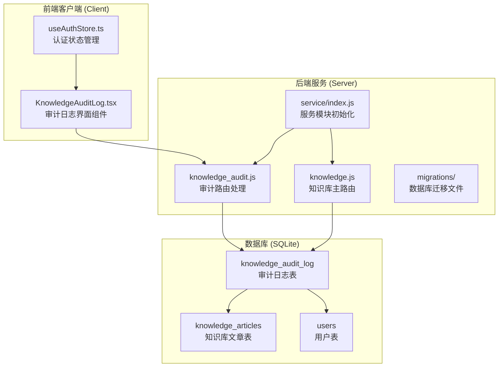
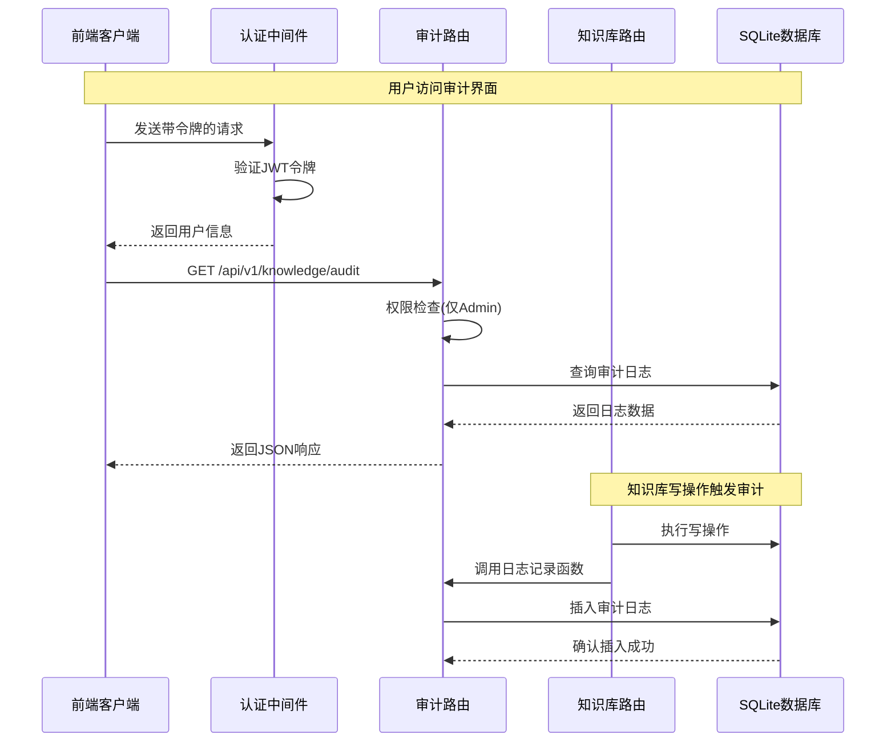
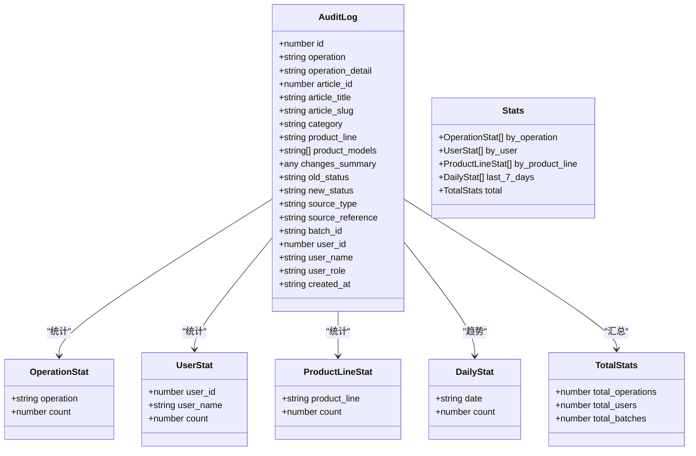
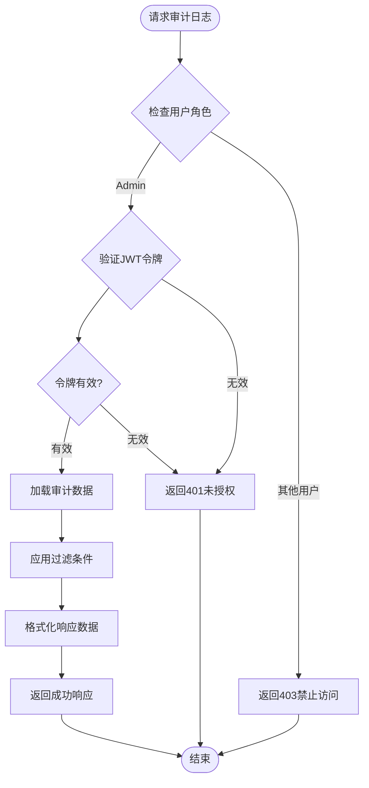
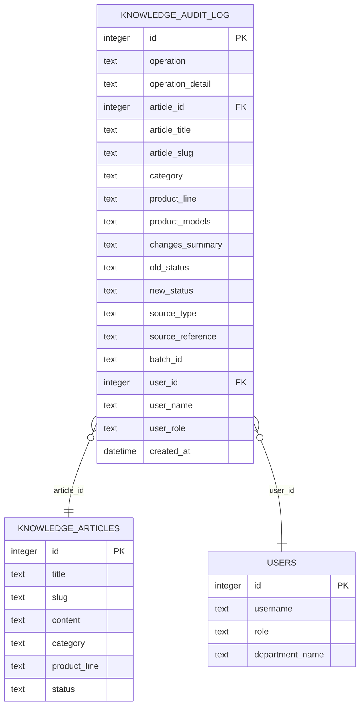
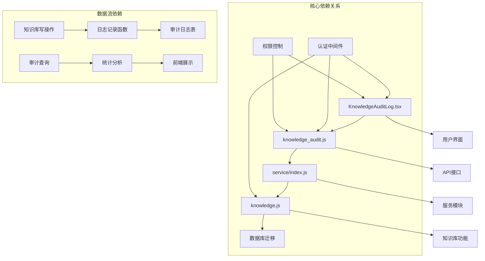

# 知识审计日志系统

<cite>
**本文档引用的文件**
- [client/src/components/KnowledgeAuditLog.tsx](file://client/src/components/KnowledgeAuditLog.tsx)
- [server/service/routes/knowledge_audit.js](file://server/service/routes/knowledge_audit.js)
- [server/migrations/add_knowledge_audit_log.sql](file://server/migrations/add_knowledge_audit_log.sql)
- [server/service/routes/knowledge.js](file://server/service/routes/knowledge.js)
- [server/service/index.js](file://server/service/index.js)
- [server/index.js](file://server/index.js)
</cite>

## 目录
1. [简介](#简介)
2. [项目结构](#项目结构)
3. [核心组件](#核心组件)
4. [架构概览](#架构概览)
5. [详细组件分析](#详细组件分析)
6. [依赖关系分析](#依赖关系分析)
7. [性能考虑](#性能考虑)
8. [故障排除指南](#故障排除指南)
9. [结论](#结论)

## 简介

知识审计日志系统是Longhorn知识库管理系统中的一个关键安全和合规组件，专门用于追踪和监控所有知识库的写操作。该系统确保了知识库数据变更的完整性和可追溯性，为管理员提供了全面的操作审计能力。

系统能够记录创建、更新、删除、导入、发布和归档等所有知识库写操作，包括操作详情、变更摘要、操作人信息以及相关的产品线和文章信息。通过这个系统，管理员可以实时监控知识库的使用情况，识别异常操作，并满足企业级的安全审计要求。

## 项目结构

Longhorn项目的知识审计日志系统采用前后端分离的架构设计，主要分布在以下目录结构中：

**图表来源**
- [client/src/components/KnowledgeAuditLog.tsx](file://client/src/components/KnowledgeAuditLog.tsx#L1-L599)
- [server/service/routes/knowledge_audit.js](file://server/service/routes/knowledge_audit.js#L1-L281)
- [server/service/routes/knowledge.js](file://server/service/routes/knowledge.js#L1-L800)

**章节来源**
- [client/src/components/KnowledgeAuditLog.tsx](file://client/src/components/KnowledgeAuditLog.tsx#L1-L599)
- [server/service/routes/knowledge_audit.js](file://server/service/routes/knowledge_audit.js#L1-L281)
- [server/service/routes/knowledge.js](file://server/service/routes/knowledge.js#L1-L800)

## 核心组件

### 前端审计界面组件

前端的`KnowledgeAuditLog.tsx`组件提供了完整的审计日志管理界面，具有以下核心功能：

- **权限控制**：仅管理员用户可访问审计功能
- **实时数据展示**：显示所有知识库写操作的历史记录
- **多维度过滤**：支持按操作类型、产品线、时间范围等条件筛选
- **分页浏览**：支持大数据量的日志分页查看
- **统计分析**：提供操作总数、用户分布、产品线统计等关键指标

### 后端审计路由

后端的`knowledge_audit.js`路由模块负责处理所有审计相关的API请求：

- **日志记录**：提供统一的日志记录接口
- **数据查询**：支持复杂的条件查询和统计分析
- **权限验证**：确保只有授权用户才能访问审计数据
- **批量处理**：支持批量导入操作的审计跟踪

### 数据库架构

审计日志系统使用SQLite数据库存储所有操作记录，包含以下关键表结构：

- **knowledge_audit_log**：主审计日志表，存储所有操作详情
- **索引优化**：为常用查询条件建立索引以提升性能
- **外键约束**：确保数据完整性，关联用户和文章信息

**章节来源**
- [client/src/components/KnowledgeAuditLog.tsx](file://client/src/components/KnowledgeAuditLog.tsx#L64-L150)
- [server/service/routes/knowledge_audit.js](file://server/service/routes/knowledge_audit.js#L9-L281)
- [server/migrations/add_knowledge_audit_log.sql](file://server/migrations/add_knowledge_audit_log.sql#L1-L50)

## 架构概览

知识审计日志系统采用分层架构设计，确保了系统的可维护性和扩展性：

**图表来源**
- [server/service/routes/knowledge_audit.js](file://server/service/routes/knowledge_audit.js#L80-L190)
- [server/service/routes/knowledge.js](file://server/service/routes/knowledge.js#L295-L312)
- [server/service/index.js](file://server/service/index.js#L90-L92)

系统的核心交互流程包括：

1. **权限验证**：所有审计请求都必须通过JWT令牌验证
2. **数据查询**：支持多种过滤条件的复杂查询
3. **日志记录**：自动捕获所有知识库写操作
4. **统计分析**：提供多维度的数据统计和可视化

## 详细组件分析

### 审计日志数据模型

审计日志系统使用标准化的数据模型来记录所有知识库操作：

**图表来源**
- [client/src/components/KnowledgeAuditLog.tsx](file://client/src/components/KnowledgeAuditLog.tsx#L12-L44)

### 操作类型和颜色映射

系统定义了六种标准的操作类型，并为每种操作类型分配了特定的颜色标识：

| 操作类型 | 中文名称 | 颜色代码 | 用途 |
|---------|---------|---------|------|
| create | 创建 | #10b981 | 新建知识文章 |
| update | 更新 | #3b82f6 | 修改现有文章 |
| delete | 删除 | #ef4444 | 移除知识文章 |
| import | 导入 | #8b5cf6 | 批量导入内容 |
| publish | 发布 | #f59e0b | 发布到公共可见 |
| archive | 归档 | #6b7280 | 将文章标记为归档 |

### 权限控制系统

审计系统实施了严格的权限控制机制：

**图表来源**
- [client/src/components/KnowledgeAuditLog.tsx](file://client/src/components/KnowledgeAuditLog.tsx#L84-L101)
- [server/service/routes/knowledge_audit.js](file://server/service/routes/knowledge_audit.js#L82-L88)

**章节来源**
- [client/src/components/KnowledgeAuditLog.tsx](file://client/src/components/KnowledgeAuditLog.tsx#L46-L62)
- [server/service/routes/knowledge_audit.js](file://server/service/routes/knowledge_audit.js#L82-L88)

### 数据库设计和索引策略

审计日志系统使用SQLite作为数据存储，采用了优化的数据库设计：

**图表来源**
- [server/migrations/add_knowledge_audit_log.sql](file://server/migrations/add_knowledge_audit_log.sql#L4-L41)

系统建立了多个索引来优化查询性能：

- `idx_audit_operation`: 按操作类型查询优化
- `idx_audit_article`: 按文章ID查询优化  
- `idx_audit_user`: 按用户ID查询优化
- `idx_audit_time`: 按时间排序优化
- `idx_audit_batch`: 按批次ID查询优化
- `idx_audit_product`: 按产品线查询优化

**章节来源**
- [server/migrations/add_knowledge_audit_log.sql](file://server/migrations/add_knowledge_audit_log.sql#L43-L50)

## 依赖关系分析

知识审计日志系统与其他组件的依赖关系如下：

**图表来源**
- [server/service/index.js](file://server/service/index.js#L90-L92)
- [server/service/routes/knowledge.js](file://server/service/routes/knowledge.js#L295-L312)

系统的关键依赖特性：

1. **模块化设计**：各组件职责明确，便于维护和扩展
2. **松耦合架构**：前端和后端通过API接口通信
3. **统一权限控制**：所有访问都经过认证和授权验证
4. **自动日志记录**：知识库写操作自动触发审计记录

**章节来源**
- [server/service/index.js](file://server/service/index.js#L90-L92)
- [server/service/routes/knowledge.js](file://server/service/routes/knowledge.js#L295-L312)

## 性能考虑

知识审计日志系统在设计时充分考虑了性能优化：

### 查询优化策略

1. **索引优化**：为常用查询字段建立索引
2. **分页查询**：默认每页50条记录，支持大数据量浏览
3. **条件过滤**：支持多条件组合查询，减少不必要的数据传输
4. **JSON字段处理**：对JSON格式的字段进行延迟解析

### 缓存和性能监控

- **前端缓存**：审计统计结果在组件挂载时获取一次
- **数据库连接池**：使用Better-SQLite3的高效连接管理
- **查询优化**：使用预编译语句防止SQL注入和提升执行效率

### 扩展性考虑

- **水平扩展**：SQLite支持WAL模式，适合高并发读取
- **垂直扩展**：可通过增加索引和优化查询进一步提升性能
- **监控指标**：系统会记录所有查询和错误信息，便于性能分析

## 故障排除指南

### 常见问题和解决方案

#### 权限相关问题

**问题**：普通用户无法访问审计日志页面
**原因**：用户角色不是Admin
**解决**：确保用户具有管理员权限

**问题**：401未授权错误
**原因**：JWT令牌无效或已过期
**解决**：重新登录获取新的访问令牌

#### 数据查询问题

**问题**：审计日志查询结果为空
**原因**：过滤条件过于严格或时间段设置不当
**解决**：调整过滤条件或扩大时间范围

**问题**：分页数据显示异常
**原因**：页面大小设置过大或网络问题
**解决**：调整页面大小或检查网络连接

#### 性能问题

**问题**：审计日志加载缓慢
**原因**：数据库查询过于复杂或数据量过大
**解决**：优化查询条件或考虑数据库升级

### 调试和监控

系统提供了完善的调试和监控机制：

- **控制台日志**：记录所有审计操作和错误信息
- **API响应**：详细的错误信息和状态码
- **数据库监控**：查询执行时间和性能指标
- **用户反馈**：友好的错误提示和恢复建议

**章节来源**
- [client/src/components/KnowledgeAuditLog.tsx](file://client/src/components/KnowledgeAuditLog.tsx#L124-L129)
- [server/service/routes/knowledge_audit.js](file://server/service/routes/knowledge_audit.js#L183-L189)

## 结论

知识审计日志系统是Longhorn知识库管理平台的重要组成部分，它提供了完整、可靠、高效的审计功能。系统的主要优势包括：

1. **全面的审计覆盖**：记录所有知识库写操作，确保数据变更的可追溯性
2. **强大的权限控制**：严格的Admin权限验证，保障系统安全性
3. **用户友好的界面**：直观的过滤和搜索功能，便于日常使用
4. **高性能设计**：优化的数据库结构和查询策略，支持大规模数据处理
5. **模块化架构**：清晰的组件分离，便于维护和扩展

该系统不仅满足了当前的审计需求，还为未来的功能扩展奠定了坚实的基础。通过持续的优化和改进，知识审计日志系统将继续为Longhorn平台提供可靠的审计保障。