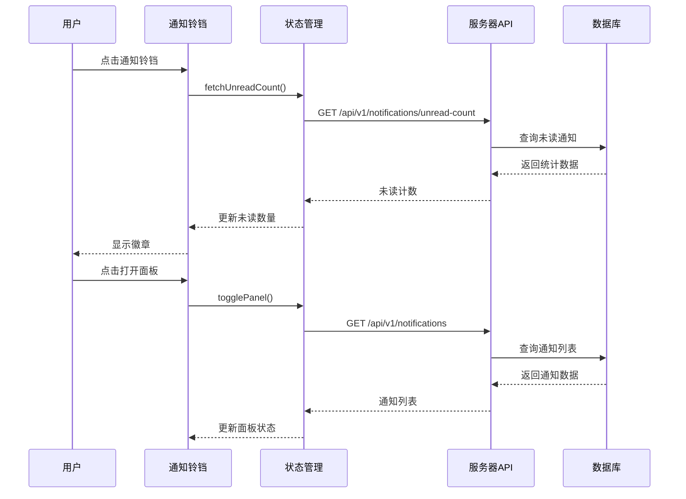
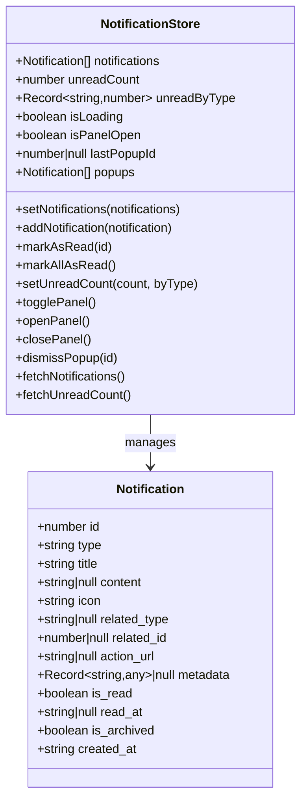
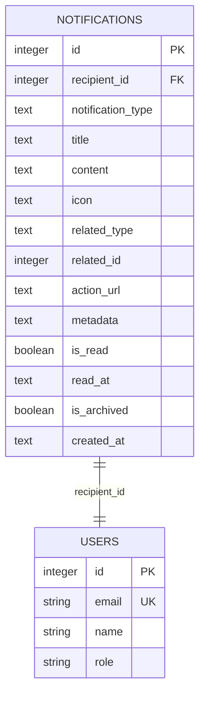
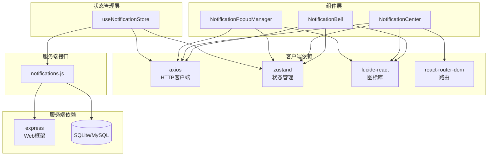

# 通知中心组件

<cite>
**本文档引用的文件**
- [NotificationCenter.tsx](file://client/src/components/Notifications/NotificationCenter.tsx)
- [NotificationBell.tsx](file://client/src/components/Notifications/NotificationBell.tsx)
- [NotificationPopupManager.tsx](file://client/src/components/Notifications/NotificationPopupManager.tsx)
- [index.ts](file://client/src/components/Notifications/index.ts)
- [useNotificationStore.ts](file://client/src/store/useNotificationStore.ts)
- [notifications.js](file://server/service/routes/notifications.js)
- [020_p2_unified_tickets.sql](file://server/service/migrations/020_p2_unified_tickets.sql)
- [App.tsx](file://client/src/App.tsx)
</cite>

## 目录
1. [简介](#简介)
2. [项目结构](#项目结构)
3. [核心组件](#核心组件)
4. [架构概览](#架构概览)
5. [详细组件分析](#详细组件分析)
6. [依赖关系分析](#依赖关系分析)
7. [性能考虑](#性能考虑)
8. [故障排除指南](#故障排除指南)
9. [结论](#结论)

## 简介

通知中心组件是 Longhorn 项目中的重要功能模块，采用 macOS 26 风格设计，提供完整的通知管理和展示功能。该组件包括通知铃铛、通知中心面板和弹窗管理器三个核心部分，实现了从通知获取到用户交互的完整闭环。

系统使用 Kine Yellow (#FFD700)、Kine Green (#10B981)、Kine Red (#EF4444) 和 Kine Blue (#3B82F6) 等主题色彩，提供直观的通知状态指示和用户体验。

## 项目结构

通知中心组件位于客户端的组件目录中，采用模块化设计：

```mermaid
graph TB
subgraph "通知中心组件结构"
NC[NotificationCenter.tsx<br/>通知中心面板]
NB[NotificationBell.tsx<br/>通知铃铛]
NPM[NotificationPopupManager.tsx<br/>弹窗管理器]
US[useNotificationStore.ts<br/>状态管理]
IDX[index.ts<br/>导出索引]
end
subgraph "服务端接口"
NR[notifications.js<br/>通知路由]
DB[(数据库)<br/>notifications 表]
end
NC --> US
NB --> US
NPM --> US
US --> NR
NR --> DB
```

**图表来源**
- [NotificationCenter.tsx:1-440](file://client/src/components/Notifications/NotificationCenter.tsx#L1-L440)
- [NotificationBell.tsx:1-124](file://client/src/components/Notifications/NotificationBell.tsx#L1-L124)
- [NotificationPopupManager.tsx:1-170](file://client/src/components/Notifications/NotificationPopupManager.tsx#L1-L170)
- [useNotificationStore.ts:1-170](file://client/src/store/useNotificationStore.ts#L1-L170)

**章节来源**
- [NotificationCenter.tsx:1-440](file://client/src/components/Notifications/NotificationCenter.tsx#L1-L440)
- [NotificationBell.tsx:1-124](file://client/src/components/Notifications/NotificationBell.tsx#L1-L124)
- [NotificationPopupManager.tsx:1-170](file://client/src/components/Notifications/NotificationPopupManager.tsx#L1-L170)
- [index.ts:1-7](file://client/src/components/Notifications/index.ts#L1-L7)

## 核心组件

通知中心组件包含三个主要部分：

### 通知铃铛 (NotificationBell)
负责显示未读通知数量和触发通知面板的交互入口。支持动态刷新间隔配置和动画效果。

### 通知中心面板 (NotificationCenter)
提供完整的通知列表展示，支持标记已读、批量操作和点击跳转功能。

### 弹窗管理器 (NotificationPopupManager)
实现 macOS 26 风格的即时通知弹窗，支持自动消失和用户自定义显示时长。

**章节来源**
- [NotificationBell.tsx:14-124](file://client/src/components/Notifications/NotificationBell.tsx#L14-L124)
- [NotificationCenter.tsx:190-440](file://client/src/components/Notifications/NotificationCenter.tsx#L190-L440)
- [NotificationPopupManager.tsx:7-170](file://client/src/components/Notifications/NotificationPopupManager.tsx#L7-L170)

## 架构概览

通知中心采用前后端分离的架构设计，通过 RESTful API 进行数据交互：



**图表来源**
- [useNotificationStore.ts:137-168](file://client/src/store/useNotificationStore.ts#L137-L168)
- [notifications.js:157-196](file://server/service/routes/notifications.js#L157-L196)

## 详细组件分析

### 状态管理 (useNotificationStore)

状态管理器使用 Zustand 实现，提供完整的通知生命周期管理：



**图表来源**
- [useNotificationStore.ts:26-50](file://client/src/store/useNotificationStore.ts#L26-L50)
- [useNotificationStore.ts:10-24](file://client/src/store/useNotificationStore.ts#L10-L24)

### 通知类型和图标映射

系统支持多种通知类型，每种类型都有对应的视觉标识：

| 通知类型 | 描述 | 图标 | 颜色 |
|---------|------|------|------|
| mention | @提及 | @ 符号 | 蓝色 |
| assignment | 工单指派 | 用户图标 | 蓝色 |
| status_change | 状态变更 | 信息图标 | 绿色 |
| sla_warning | SLA 预警 | 警告三角形 | 黄色 |
| sla_breach | SLA 超时 | 警告三角形 | 红色 |
| new_comment | 新评论 | 铃铛 | 绿色 |
| participant_added | 参与者添加 | 用户加号 | 蓝色 |
| snooze_expired | 贪睡到期 | 时钟 | 绿色 |
| system_announce | 系统公告 | 信息图标 | 绿色 |

**章节来源**
- [NotificationCenter.tsx:23-51](file://client/src/components/Notifications/NotificationCenter.tsx#L23-L51)
- [notifications.js:210-220](file://server/service/routes/notifications.js#L210-L220)

### 服务端数据模型

数据库表结构支持完整的通知功能：



**图表来源**
- [020_p2_unified_tickets.sql:205-247](file://server/service/migrations/020_p2_unified_tickets.sql#L205-L247)

**章节来源**
- [020_p2_unified_tickets.sql:204-254](file://server/service/migrations/020_p2_unified_tickets.sql#L204-L254)

### API 接口规范

服务端提供完整的通知管理 API：

| 方法 | 端点 | 功能 | 请求体 | 响应 |
|------|------|------|--------|------|
| GET | /api/v1/notifications | 获取通知列表 | 分页参数 | 通知数组 |
| GET | /api/v1/notifications/unread-count | 获取未读计数 | - | 统计数据 |
| GET | /api/v1/notifications/:id | 获取单个通知 | - | 通知详情 |
| PATCH | /api/v1/notifications/:id/read | 标记已读 | - | 操作结果 |
| PATCH | /api/v1/notifications/read-all | 全部标记已读 | 类型过滤 | 操作结果 |
| PATCH | /api/v1/notifications/:id/archive | 归档通知 | - | 操作结果 |
| DELETE | /api/v1/notifications/:id | 删除通知 | - | 操作结果 |
| DELETE | /api/v1/notifications/clear-all | 清空通知 | permanent=true | 操作结果 |

**章节来源**
- [notifications.js:85-365](file://server/service/routes/notifications.js#L85-L365)

## 依赖关系分析

通知中心组件的依赖关系清晰且模块化：



**图表来源**
- [useNotificationStore.ts:7-8](file://client/src/store/useNotificationStore.ts#L7-L8)
- [notifications.js:8](file://server/service/routes/notifications.js#L8)

**章节来源**
- [useNotificationStore.ts:1-170](file://client/src/store/useNotificationStore.ts#L1-L170)
- [notifications.js:1-475](file://server/service/routes/notifications.js#L1-L475)

## 性能考虑

通知中心组件在设计时充分考虑了性能优化：

### 前端性能优化
- **懒加载**: 通知面板仅在需要时渲染
- **虚拟滚动**: 大量通知时可考虑实现虚拟滚动
- **防抖处理**: 刷新请求进行防抖处理
- **缓存策略**: 本地状态缓存减少重复请求

### 后端性能优化
- **索引优化**: 为常用查询字段建立索引
- **分页查询**: 默认限制每次查询数量
- **条件过滤**: 支持多条件组合查询
- **连接池**: 数据库连接复用

### 网络优化
- **Token 认证**: 使用 Bearer Token 进行身份验证
- **错误处理**: 完善的错误捕获和重试机制
- **超时控制**: 合理的请求超时设置

## 故障排除指南

### 常见问题及解决方案

#### 通知不显示
1. **检查认证状态**: 确保用户已登录且 Token 有效
2. **验证网络连接**: 检查 API 请求是否成功
3. **查看浏览器控制台**: 检查是否有 JavaScript 错误

#### 未读计数不更新
1. **检查轮询设置**: 验证刷新间隔配置
2. **确认事件监听**: 确保系统设置更新事件正常触发
3. **检查 API 响应**: 验证未读计数接口返回正确数据

#### 通知点击无响应
1. **验证 action_url**: 检查通知关联的 URL 是否存在
2. **确认路由配置**: 确保对应路由已正确配置
3. **检查权限**: 验证用户是否有访问权限

**章节来源**
- [NotificationBell.tsx:19-35](file://client/src/components/Notifications/NotificationBell.tsx#L19-L35)
- [useNotificationStore.ts:76-91](file://client/src/store/useNotificationStore.ts#L76-L91)

### 调试工具

#### 开发者工具
- **React DevTools**: 检查组件状态和 props
- **Redux DevTools**: 监控状态变化
- **网络面板**: 查看 API 请求和响应

#### 日志记录
- **错误日志**: 捕获和记录异常信息
- **性能日志**: 监控组件渲染性能
- **用户行为日志**: 追踪用户交互模式

## 结论

通知中心组件是 Longhorn 项目中功能完整、架构清晰的重要组成部分。通过采用现代化的前端技术和合理的后端设计，实现了高效、可靠的实时通知功能。

### 主要优势
- **用户体验优秀**: macOS 26 风格设计，符合现代用户期望
- **功能完整**: 支持通知创建、展示、交互和管理的完整流程
- **性能优化**: 采用多种优化策略确保系统响应速度
- **扩展性强**: 模块化设计便于功能扩展和维护

### 技术亮点
- **状态管理**: 使用 Zustand 实现轻量级状态管理
- **响应式设计**: 支持不同屏幕尺寸和设备
- **国际化支持**: 内置多语言支持机制
- **主题系统**: 完整的主题色彩和样式系统

该组件为 Longhorn 项目提供了坚实的通信基础设施，为用户提供了及时、准确的信息反馈，显著提升了整体用户体验。