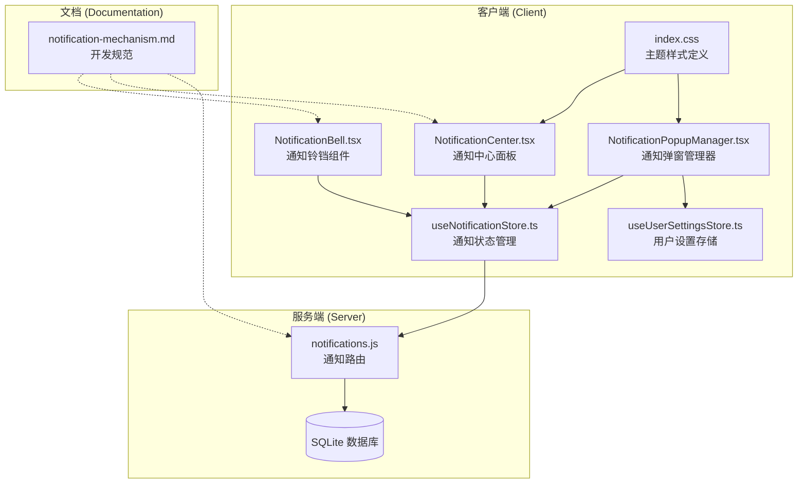
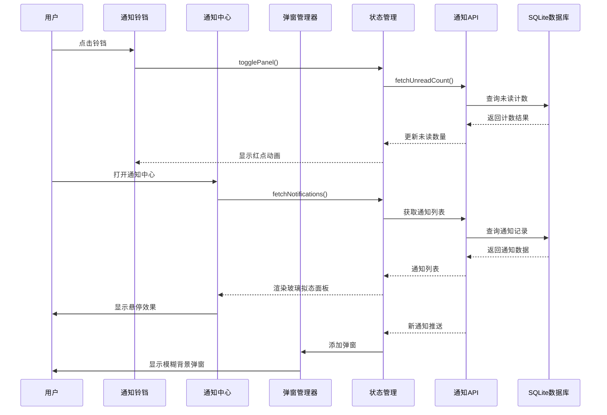
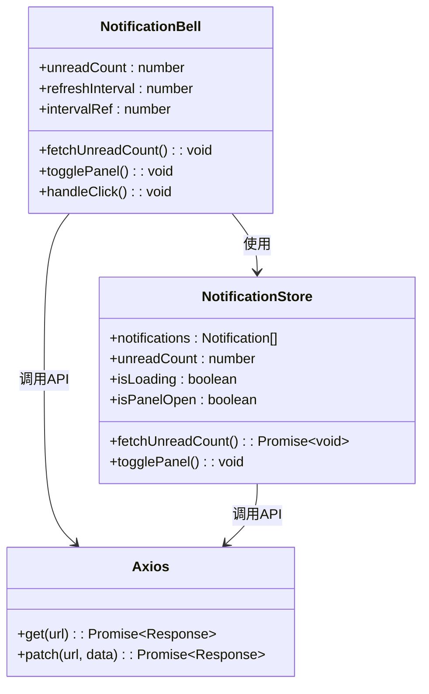
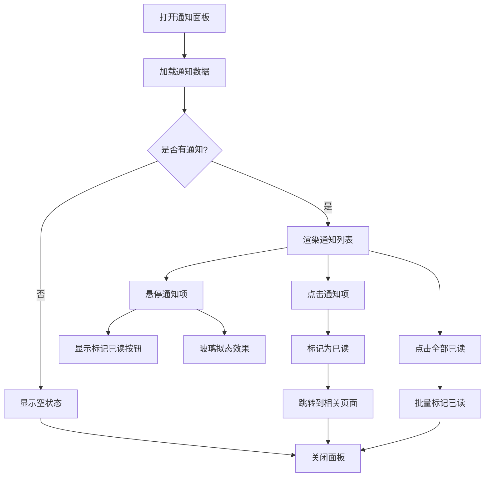
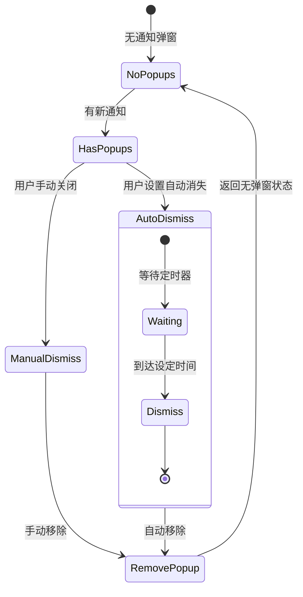
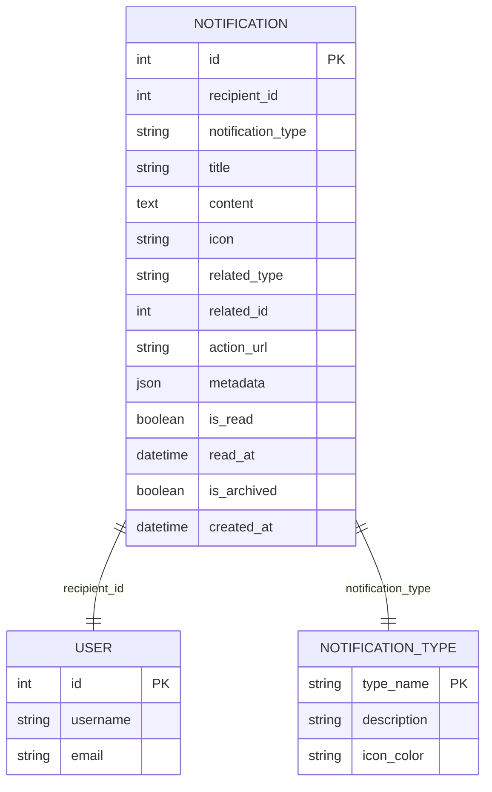
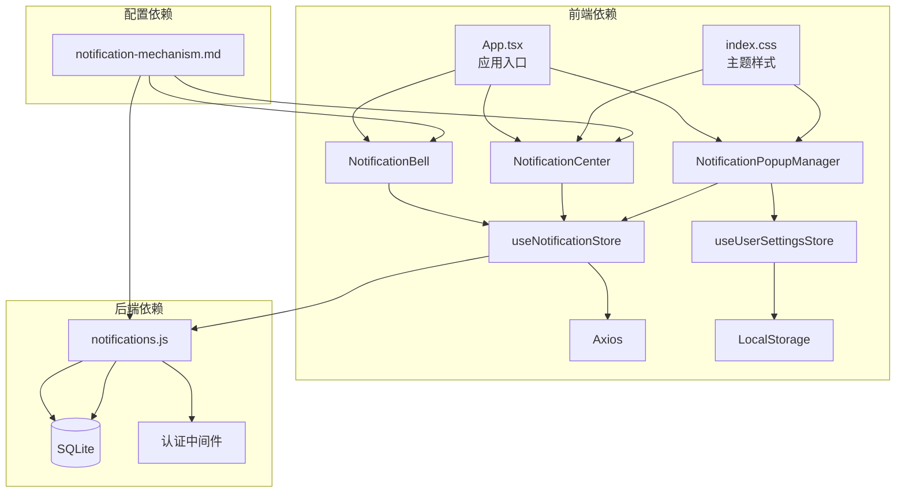

# 通知机制

<cite>
**本文档引用的文件**
- [NotificationBell.tsx](file://client/src/components/Notifications/NotificationBell.tsx)
- [NotificationCenter.tsx](file://client/src/components/Notifications/NotificationCenter.tsx)
- [NotificationPopupManager.tsx](file://client/src/components/Notifications/NotificationPopupManager.tsx)
- [useNotificationStore.ts](file://client/src/store/useNotificationStore.ts)
- [useUserSettingsStore.ts](file://client/src/store/useUserSettingsStore.ts)
- [notifications.js](file://server/service/routes/notifications.js)
- [020_p2_unified_tickets.sql](file://server/service/migrations/020_p2_unified_tickets.sql)
- [notification-mechanism.md](file://docs/kb/notification-mechanism.md)
- [App.tsx](file://client/src/App.tsx)
- [index.css](file://client/src/index.css)
</cite>

## 更新摘要
**变更内容**
- 更新NotificationCenter组件的通知样式和悬停效果
- 改进通知展示体验，增强macOS 26风格的玻璃拟态设计
- 优化通知项的交互反馈和视觉层次

## 目录
1. [简介](#简介)
2. [项目结构](#项目结构)
3. [核心组件](#核心组件)
4. [架构概览](#架构概览)
5. [详细组件分析](#详细组件分析)
6. [依赖关系分析](#依赖关系分析)
7. [性能考虑](#性能考虑)
8. [故障排除指南](#故障排除指南)
9. [结论](#结论)

## 简介

Longhorn 通知机制是一个基于 macOS 26 设计风格的现代化通知系统，旨在提供实时、精准、即时的通知体验。该系统采用前后端分离架构，结合轮询机制和用户设置配置，实现了灵活的通知管理功能。

通知系统的核心目标是保障工单流转的实时感知，降低用户沟通成本，遵循"极简触发、精准推送、即时跳转"的设计原则。系统支持多种通知类型，包括 @提及、工单指派、状态变更、SLA 预警等，并提供了丰富的交互体验。

**更新** 通知中心组件现已完全采用macOS 26风格的玻璃拟态设计，增强了悬停效果和视觉反馈，提供更加沉浸式的用户体验。

## 项目结构

通知机制在项目中的组织结构如下：

**图表来源**
- [NotificationBell.tsx:1-124](file://client/src/components/Notifications/NotificationBell.tsx#L1-L124)
- [NotificationCenter.tsx:1-440](file://client/src/components/Notifications/NotificationCenter.tsx#L1-L440)
- [NotificationPopupManager.tsx:1-170](file://client/src/components/Notifications/NotificationPopupManager.tsx#L1-L170)
- [useNotificationStore.ts:1-170](file://client/src/store/useNotificationStore.ts#L1-L170)
- [useUserSettingsStore.ts:1-27](file://client/src/store/useUserSettingsStore.ts#L1-L27)
- [index.css:36-46](file://client/src/index.css#L36-L46)

**章节来源**
- [NotificationBell.tsx:1-124](file://client/src/components/Notifications/NotificationBell.tsx#L1-L124)
- [NotificationCenter.tsx:1-440](file://client/src/components/Notifications/NotificationCenter.tsx#L1-L440)
- [NotificationPopupManager.tsx:1-170](file://client/src/components/Notifications/NotificationPopupManager.tsx#L1-L170)
- [useNotificationStore.ts:1-170](file://client/src/store/useNotificationStore.ts#L1-L170)
- [useUserSettingsStore.ts:1-27](file://client/src/store/useUserSettingsStore.ts#L1-L27)
- [index.css:36-46](file://client/src/index.css#L36-L46)

## 核心组件

通知系统由四个核心组件构成，每个组件都有明确的职责分工：

### 通知铃铛组件 (NotificationBell)
负责显示未读通知数量，在导航栏中提供通知入口。支持动态刷新间隔配置，可响应系统设置更新事件。采用macOS 26风格的悬停动画效果，提供流畅的视觉反馈。

### 通知中心面板 (NotificationCenter)
提供完整的通知浏览界面，支持按类型筛选、批量标记已读、通知跳转等功能。采用完全的macOS 26玻璃拟态设计，包含精致的悬停效果、渐变背景和动画过渡。

### 通知弹窗管理器 (NotificationPopupManager)
实现基于用户设置的自动弹窗通知，支持自定义停留时间配置，提供非侵入式的后台通知体验。使用增强的悬停效果和模糊背景，确保通知在各种背景下都具有良好的可读性。

### 通知状态管理 (useNotificationStore)
使用 Zustand 状态管理库，提供通知数据的获取、更新、标记已读等核心功能，支持与后端 API 的双向同步。

**更新** 通知中心面板现在完全采用macOS 26风格的玻璃拟态设计，包含：
- 玻璃模糊背景 (backdrop-filter: blur(20px))
- 增强的悬停效果 (var(--glass-bg-hover))
- 精致的边框和阴影效果
- 动画过渡和微交互反馈

**章节来源**
- [NotificationBell.tsx:14-124](file://client/src/components/Notifications/NotificationBell.tsx#L14-L124)
- [NotificationCenter.tsx:190-440](file://client/src/components/Notifications/NotificationCenter.tsx#L190-L440)
- [NotificationPopupManager.tsx:7-170](file://client/src/components/Notifications/NotificationPopupManager.tsx#L7-L170)
- [useNotificationStore.ts:60-170](file://client/src/store/useNotificationStore.ts#L60-L170)

## 架构概览

通知系统的整体架构采用分层设计，从前端到后端形成完整的数据流：

**图表来源**
- [NotificationBell.tsx:38-52](file://client/src/components/Notifications/NotificationBell.tsx#L38-L52)
- [NotificationCenter.tsx:206-225](file://client/src/components/Notifications/NotificationCenter.tsx#L206-L225)
- [NotificationPopupManager.tsx:13-23](file://client/src/components/Notifications/NotificationPopupManager.tsx#L13-L23)
- [useNotificationStore.ts:120-168](file://client/src/store/useNotificationStore.ts#L120-L168)
- [notifications.js:157-196](file://server/service/routes/notifications.js#L157-L196)

系统采用以下关键设计原则：

1. **实时性**: 通过轮询机制确保通知的及时更新
2. **个性化**: 支持用户自定义通知显示行为
3. **可靠性**: 提供完整的错误处理和降级机制
4. **可扩展性**: 模块化设计便于功能扩展
5. **视觉一致性**: 完全遵循macOS 26设计语言

## 详细组件分析

### 通知铃铛组件分析

NotificationBell 是通知系统的主要入口点，负责向用户提供直观的通知状态反馈：

**图表来源**
- [NotificationBell.tsx:14-124](file://client/src/components/Notifications/NotificationBell.tsx#L14-L124)
- [useNotificationStore.ts:60-170](file://client/src/store/useNotificationStore.ts#L60-L170)

组件特性：
- **动态刷新**: 支持从系统设置获取刷新间隔
- **事件监听**: 响应系统设置更新事件
- **状态管理**: 集成到全局状态管理系统
- **样式定制**: 提供动画效果和视觉反馈
- **悬停动画**: 增强的macOS 26风格悬停效果

**更新** 通知铃铛现在包含脉冲动画效果，当有新通知时会显示轻微的缩放动画，提供更直观的视觉反馈。

**章节来源**
- [NotificationBell.tsx:1-124](file://client/src/components/Notifications/NotificationBell.tsx#L1-L124)

### 通知中心面板分析

NotificationCenter 提供了完整的通知浏览和管理功能，现已完全采用macOS 26风格的玻璃拟态设计：

**图表来源**
- [NotificationCenter.tsx:190-286](file://client/src/components/Notifications/NotificationCenter.tsx#L190-L286)

**更新** 通知中心面板现在包含以下增强功能：
- **玻璃拟态背景**: 使用backdrop-filter: blur(20px)实现毛玻璃效果
- **悬停动画**: 悬停时显示var(--glass-bg-hover)背景色
- **渐变效果**: 未读通知显示蓝色渐变背景
- **平滑过渡**: 所有交互都有0.15秒的过渡动画
- **精致边框**: 使用var(--glass-border)实现半透明边框

**章节来源**
- [NotificationCenter.tsx:1-440](file://client/src/components/Notifications/NotificationCenter.tsx#L1-L440)

### 通知弹窗管理器分析

NotificationPopupManager 实现了基于用户偏好的弹窗通知机制，现在提供增强的视觉体验：

**图表来源**
- [NotificationPopupManager.tsx:7-170](file://client/src/components/Notifications/NotificationPopupManager.tsx#L7-L170)
- [useUserSettingsStore.ts:1-27](file://client/src/store/useUserSettingsStore.ts#L1-L27)

**更新** 弹窗管理器现在包含以下改进：
- **增强的悬停效果**: 鼠标悬停时背景色从rgba(28, 28, 30, 0.75)变为rgba(28, 28, 30, 0.85)
- **模糊背景**: 使用backdropFilter: 'blur(30px)'实现毛玻璃效果
- **动画过渡**: 使用cubic-bezier(0.16, 1, 0.3, 1)的弹性动画
- **半透明边框**: 使用rgba(255, 255, 255, 0.15)的半透明边框

**章节来源**
- [NotificationPopupManager.tsx:1-170](file://client/src/components/Notifications/NotificationPopupManager.tsx#L1-L170)
- [useUserSettingsStore.ts:1-27](file://client/src/store/useUserSettingsStore.ts#L1-L27)

### 通知状态管理分析

useNotificationStore 使用 Zustand 提供高效的状态管理：

**图表来源**
- [020_p2_unified_tickets.sql:205-247](file://server/service/migrations/020_p2_unified_tickets.sql#L205-L247)

**章节来源**
- [useNotificationStore.ts:1-170](file://client/src/store/useNotificationStore.ts#L1-L170)
- [020_p2_unified_tickets.sql:205-247](file://server/service/migrations/020_p2_unified_tickets.sql#L205-L247)

## 依赖关系分析

通知系统各组件之间的依赖关系如下：

**图表来源**
- [App.tsx:77-84](file://client/src/App.tsx#L77-L84)
- [useNotificationStore.ts:8-9](file://client/src/store/useNotificationStore.ts#L8-L9)
- [index.css:36-46](file://client/src/index.css#L36-L46)

**更新** 主题样式现在为所有通知组件提供统一的macOS 26风格支持，包括：
- 玻璃拟态变量 (--glass-bg, --glass-bg-hover)
- 动画过渡变量 (--transition-fast, --transition-smooth)
- 色彩方案 (Kine Yellow, Kine Green, Kine Red, Kine Blue)

**章节来源**
- [App.tsx:77-84](file://client/src/App.tsx#L77-L84)
- [index.css:36-46](file://client/src/index.css#L36-L46)

## 性能考虑

通知系统在设计时充分考虑了性能优化：

### 前端性能优化
- **状态缓存**: 使用 Zustand 提供高性能的状态管理
- **懒加载**: 通知面板按需加载，避免不必要的渲染
- **虚拟滚动**: 大量通知时采用虚拟滚动技术
- **防抖处理**: 轮询请求添加防抖机制，避免频繁请求
- **CSS动画**: 使用transform和opacity属性优化动画性能

### 后端性能优化
- **索引优化**: 为常用查询字段建立索引
- **分页查询**: 默认限制每次查询数量，支持分页
- **条件过滤**: 支持多条件组合查询，减少数据传输
- **连接池**: 使用连接池管理数据库连接

### 缓存策略
- **本地缓存**: 用户设置和部分数据缓存在本地存储
- **CDN 加速**: 静态资源通过 CDN 加速
- **压缩传输**: API 响应启用 Gzip 压缩

**更新** 新增的视觉效果经过性能优化：
- 玻璃拟态效果使用硬件加速的backdrop-filter
- 悬停动画使用transform属性而非改变布局
- CSS变量减少重复计算

## 故障排除指南

### 常见问题及解决方案

**问题1: 通知不显示或显示延迟**
- 检查网络连接是否正常
- 验证认证令牌是否有效
- 确认系统设置中的刷新间隔配置
- 查看浏览器控制台是否有错误信息

**问题2: 通知弹窗不消失**
- 检查用户设置中的通知持续时间配置
- 确认定时器是否正确初始化
- 验证弹窗管理器的生命周期
- 检查CSS变量是否正确加载

**问题3: 通知状态不同步**
- 检查 API 请求是否成功
- 验证数据库连接状态
- 确认状态更新的事务完整性

**问题4: 性能问题**
- 检查轮询频率设置
- 优化数据库查询语句
- 实施适当的缓存策略
- 验证CSS动画性能

**问题5: 视觉效果异常**
- 检查浏览器对backdrop-filter的支持
- 验证CSS变量是否正确加载
- 确认主题模式设置
- 检查是否有CSS冲突

**章节来源**
- [useNotificationStore.ts:76-111](file://client/src/store/useNotificationStore.ts#L76-L111)
- [NotificationBell.tsx:20-35](file://client/src/components/Notifications/NotificationBell.tsx#L20-L35)

## 结论

Longhorn 通知机制通过精心设计的架构和实现，为用户提供了现代化、高效、可靠的通知体验。系统采用模块化设计，前后端分离，支持灵活的配置和扩展。

**更新** 最新的版本显著改进了视觉体验，完全采用了macOS 26设计语言：
- **沉浸式玻璃拟态**: 通知中心和弹窗都采用毛玻璃效果
- **流畅的动画过渡**: 所有交互都有0.15-0.4秒的平滑动画
- **增强的悬停反馈**: 提供直观的视觉层次感
- **一致的主题色彩**: 使用Kine Yellow、Kine Green、Kine Red、Kine Blue主题色

主要优势包括：
- **用户体验优秀**: macOS 26 设计风格，交互流畅自然
- **功能完整**: 支持多种通知类型和丰富的交互功能
- **性能优异**: 优化的前端状态管理和后端查询性能
- **视觉卓越**: 完全采用现代设计语言，提供沉浸式体验
- **易于维护**: 清晰的代码结构和完善的文档规范

未来可以考虑的改进方向：
- 实现实时 WebSocket 通知推送
- 增加通知模板系统
- 扩展移动端通知支持
- 实施更精细的通知过滤规则
- 添加更多自定义视觉效果选项

该通知系统为 Longhorn 平台的工单流转提供了强有力的支持，有效提升了用户的协作效率和工作体验。最新的视觉改进使其成为平台中最优雅的组件之一。