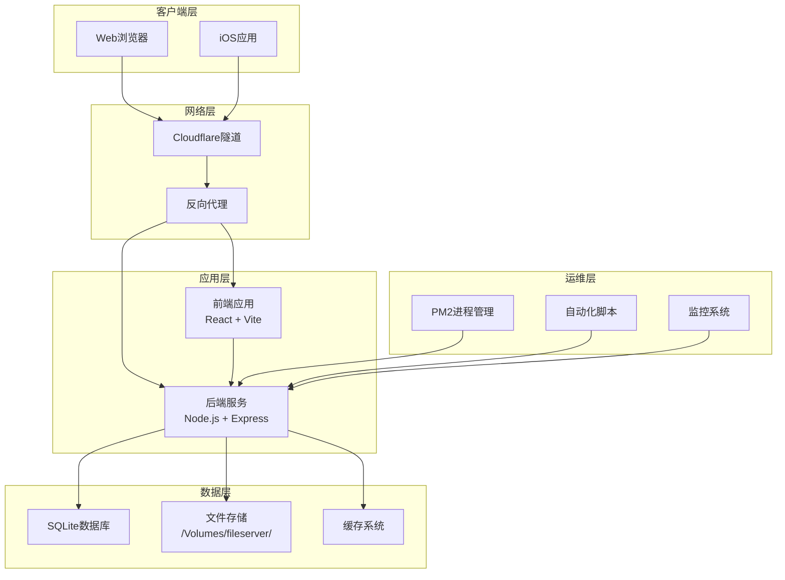
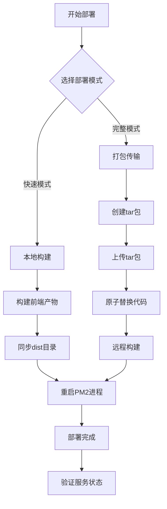
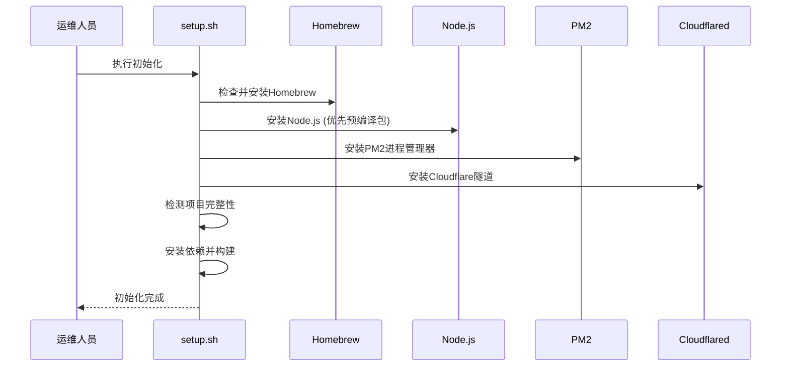
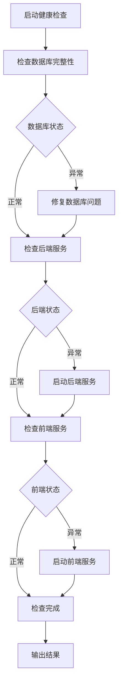
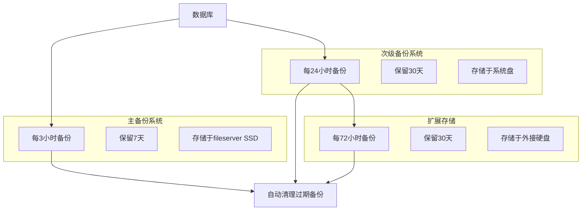
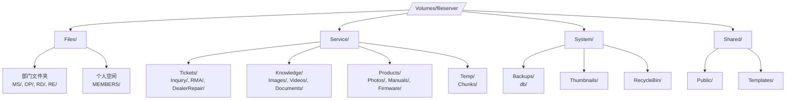
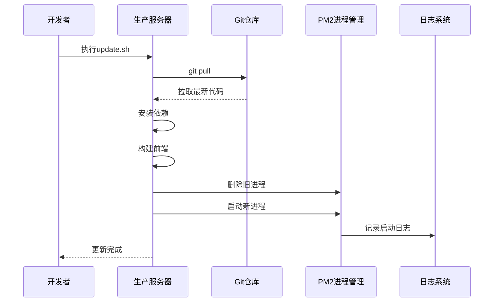
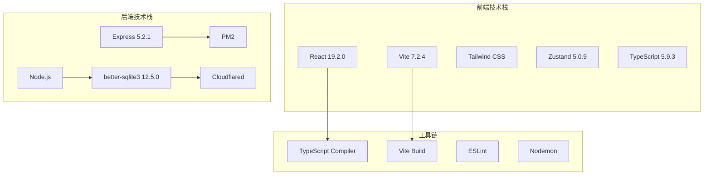
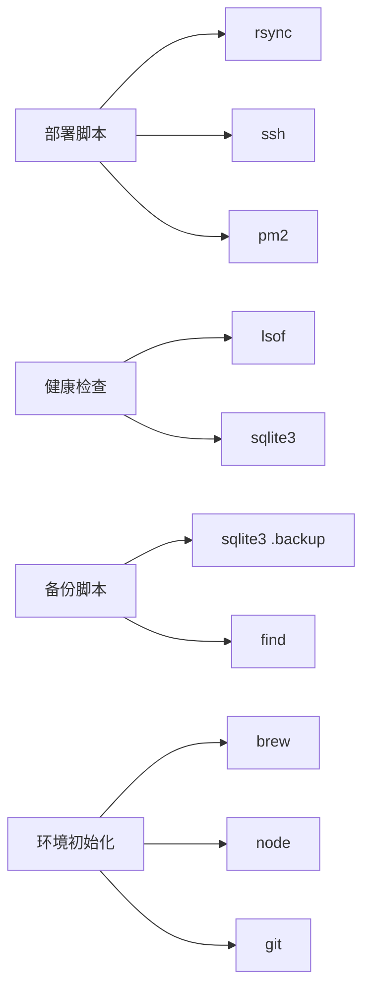
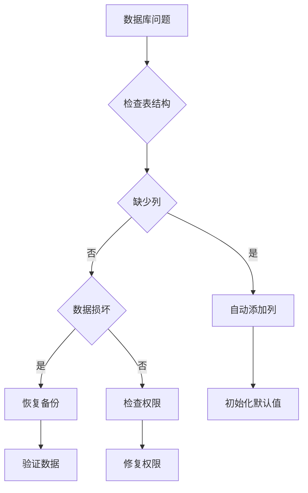

# 运维手册

<cite>
**本文档引用的文件**
- [OPS.md](file://docs/OPS.md)
- [deploy.sh](file://scripts/deploy.sh)
- [setup.sh](file://scripts/setup.sh)
- [update.sh](file://scripts/update.sh)
- [health-check.sh](file://scripts/health-check.sh)
- [ecosystem.config.js](file://scripts/ecosystem.config.js)
- [secondary_backup.sh](file://scripts/secondary_backup.sh)
- [migrate_remote_db.sh](file://scripts/migrate_remote_db.sh)
- [sync-db.sh](file://scripts/sync-db.sh)
- [fix_folders.js](file://scripts/fix_folders.js)
- [check_backup.js](file://server/check_backup.js)
- [server/package.json](file://server/package.json)
- [client/package.json](file://client/package.json)
</cite>

## 目录
1. [简介](#简介)
2. [项目结构](#项目结构)
3. [核心组件](#核心组件)
4. [架构概览](#架构概览)
5. [详细组件分析](#详细组件分析)
6. [依赖关系分析](#依赖关系分析)
7. [性能考虑](#性能考虑)
8. [故障排除指南](#故障排除指南)
9. [结论](#结论)
10. [附录](#附录)

## 简介
本运维手册面向Longhorn系统的开发者和运维人员，提供从本地开发到生产部署的完整操作指南。Longhorn是一个基于React前端和Node.js后端的企业协作平台，支持文件管理、工单处理、知识库等功能。

## 项目结构
Longhorn项目采用前后端分离架构，主要包含以下核心目录：

```mermaid
graph TB
subgraph "项目根目录"
A[client/] -- 前端应用
B[server/] -- 后端服务
C[scripts/] -- 运维脚本
D[docs/] -- 文档
E[ios/] -- iOS客户端
end
subgraph "client/ 目录结构"
F[src/] -- 源代码
G[public/] -- 静态资源
H[dist/] -- 构建产物
I[node_modules/] -- 依赖包
end
subgraph "server/ 目录结构"
J[routes/] -- API路由
K[migrations/] -- 数据库迁移
L[scripts/] -- 服务脚本
M[data/] -- 数据文件
N[service/] -- 业务服务
end
```

**图表来源**
- [项目结构](file://.)

**章节来源**
- [项目结构](file://.)

## 核心组件
Longhorn系统由多个相互协作的组件构成，每个组件都有明确的职责分工：

### 前端组件
- **React应用**: 基于Vite构建的现代化前端界面
- **UI组件库**: 使用Tailwind CSS和自定义组件
- **状态管理**: Zustand状态管理库
- **国际化**: 支持多语言切换

### 后端组件
- **Express服务器**: RESTful API服务
- **SQLite数据库**: 轻量级数据存储
- **文件服务**: 支持大文件分块上传
- **备份服务**: 自动化数据备份机制

### 运维组件
- **PM2进程管理**: 应用进程守护和负载均衡
- **Cloudflare隧道**: 安全的公网访问
- **自动化脚本**: 部署、监控、备份等运维任务

**章节来源**
- [client/package.json](file://client/package.json#L1-L63)
- [server/package.json](file://server/package.json#L1-L41)

## 架构概览



**图表来源**
- [OPS.md](file://docs/OPS.md#L74-L90)
- [ecosystem.config.js](file://scripts/ecosystem.config.js#L1-L41)

## 详细组件分析

### 部署系统

#### 部署脚本架构
Longhorn提供了两种部署模式，满足不同场景的需求：



**图表来源**
- [deploy.sh](file://scripts/deploy.sh#L70-L161)

#### 部署流程详解
部署脚本支持以下特性：
- **双模式部署**: 快速模式(10秒)和完整模式(60秒)
- **Git集成**: 可选的代码提交和推送功能
- **原子操作**: 完整模式确保部署过程的原子性
- **智能重启**: 使用PM2的reload机制保持服务连续性

**章节来源**
- [deploy.sh](file://scripts/deploy.sh#L1-L167)

### 环境初始化

#### 初始化脚本功能
setup.sh脚本提供了一键化的环境初始化能力：



**图表来源**
- [setup.sh](file://scripts/setup.sh#L1-L112)

**章节来源**
- [setup.sh](file://scripts/setup.sh#L1-L112)

### 健康监控系统

#### 健康检查架构
健康检查脚本提供了全面的服务状态监控：



**图表来源**
- [health-check.sh](file://scripts/health-check.sh#L82-L115)

#### 数据库完整性检查
健康检查脚本特别关注数据库的完整性，包括：
- **必需列检查**: 确保users表包含last_login列
- **自动修复**: 缺失列时自动添加并初始化
- **数据一致性**: 验证关键数据结构的完整性

**章节来源**
- [health-check.sh](file://scripts/health-check.sh#L1-L115)

### 备份系统

#### 备份策略架构
Longhorn实现了多层次的数据备份策略：



**图表来源**
- [OPS.md](file://docs/OPS.md#L132-L156)

#### 备份实现细节
- **主备份**: 使用SQLite的在线备份功能，确保数据一致性
- **次级备份**: 定期备份到系统盘，提供额外的安全保障
- **扩展备份**: 通过secondary_backup.sh脚本实现72小时备份
- **自动清理**: 按保留策略自动清理过期备份文件

**章节来源**
- [OPS.md](file://docs/OPS.md#L132-L156)
- [secondary_backup.sh](file://scripts/secondary_backup.sh#L1-L50)

### 文件存储架构

#### 文件系统设计
Longhorn采用了统一的文件存储架构：



**图表来源**
- [OPS.md](file://docs/OPS.md#L84-L130)

**章节来源**
- [OPS.md](file://docs/OPS.md#L84-L130)

### 更新管理系统

#### 更新流程架构
更新管理提供了灵活的部署选项：



**图表来源**
- [update.sh](file://scripts/update.sh#L1-L33)

**章节来源**
- [update.sh](file://scripts/update.sh#L1-L33)

## 依赖关系分析

### 技术栈依赖



**图表来源**
- [client/package.json](file://client/package.json#L1-L63)
- [server/package.json](file://server/package.json#L1-L41)

### 运维工具依赖



**图表来源**
- [deploy.sh](file://scripts/deploy.sh#L55-L65)
- [health-check.sh](file://scripts/health-check.sh#L14-L22)

**章节来源**
- [client/package.json](file://client/package.json#L1-L63)
- [server/package.json](file://server/package.json#L1-L41)

## 性能考虑

### 集群部署优化
Longhorn采用PM2的集群模式实现水平扩展：

- **CPU核心利用**: 使用`max`实例数充分利用M1芯片的8核性能
- **内存限制**: 设置500MB内存上限，防止内存泄漏导致系统不稳定
- **优雅重启**: 支持`reload`而非`restart`，保持服务连续性
- **自动重启**: 最多重启10次，间隔1秒，避免无限循环

### 文件传输优化
- **增量同步**: rsync的`--delete`参数确保目录结构一致
- **压缩传输**: 使用`-z`选项减少网络传输时间
- **排除规则**: 智能排除node_modules、日志等不需要传输的文件

### 数据库性能
- **索引优化**: 定期维护数据库索引提高查询性能
- **连接池**: better-sqlite3提供高效的数据库连接管理
- **缓存策略**: 实现缩略图和临时文件的缓存机制

## 故障排除指南

### 常见部署问题

#### 部署失败排查
1. **权限问题**: 确保SSH密钥配置正确
2. **磁盘空间**: 检查服务器磁盘空间充足
3. **网络连接**: 验证Cloudflare隧道连接状态
4. **端口占用**: 检查4000端口是否被其他进程占用

#### 构建错误处理
- **TypeScript错误**: 修复所有编译错误后再部署
- **依赖安装失败**: 清理node_modules后重新安装
- **静态资源缺失**: 验证dist目录包含完整的构建产物

**章节来源**
- [deploy.sh](file://scripts/deploy.sh#L16-L18)

### 数据库问题诊断

#### 数据库完整性检查


**图表来源**
- [health-check.sh](file://scripts/health-check.sh#L35-L52)

#### 数据库迁移
- **远程迁移**: 使用migrate_remote_db.sh脚本执行数据库迁移
- **本地修复**: 通过sync-db.sh将修复后的数据库同步到服务器
- **验证检查**: 使用check_backup.js验证备份设置

**章节来源**
- [migrate_remote_db.sh](file://scripts/migrate_remote_db.sh#L1-L19)
- [sync-db.sh](file://scripts/sync-db.sh#L1-L28)
- [check_backup.js](file://server/check_backup.js#L1-L6)

### 文件系统问题

#### 目录结构修复
使用fix_folders.js脚本自动修复文件夹结构问题：
- **部门合并**: 将研发中心合并到研发部
- **文件夹重命名**: 统一文件夹命名规范
- **内容迁移**: 安全地迁移文件夹内容

**章节来源**
- [fix_folders.js](file://scripts/fix_folders.js#L1-L62)

## 结论
Longhorn运维体系提供了完整的自动化解决方案，涵盖了从开发环境搭建到生产部署的各个环节。通过合理的架构设计和完善的运维脚本，确保了系统的稳定性、可维护性和可扩展性。

关键优势包括：
- **双模式部署**: 满足不同场景的部署需求
- **多层次备份**: 提供可靠的数据安全保障
- **自动化监控**: 实时监控系统健康状态
- **统一文件管理**: 规范化的文件存储架构

## 附录

### 快速参考

#### 常用命令
- **部署**: `./scripts/deploy.sh` (快速模式)
- **完整部署**: `./scripts/deploy.sh --full` (完整模式)
- **Git部署**: `./scripts/deploy.sh --git` (带Git操作)
- **环境初始化**: `./scripts/setup.sh`
- **健康检查**: `./scripts/health-check.sh`
- **系统更新**: `./scripts/update.sh`

#### 环境变量
- **NODE_ENV**: production
- **PORT**: 4000
- **DATABASE_PATH**: server/longhorn.db

#### 关键端口
- **前端开发**: 3001
- **后端服务**: 4000
- **SSH访问**: 22