# 配件目录页面文档

<cite>
**本文档引用的文件**
- [PartsCatalogPage.tsx](file://client/src/components/PartsManagement/PartsCatalogPage.tsx)
- [PartsDetailPage.tsx](file://client/src/components/PartsManagement/PartsDetailPage.tsx)
- [PartsEditModal.tsx](file://client/src/components/PartsManagement/PartsEditModal.tsx)
- [index.ts](file://client/src/components/PartsManagement/index.ts)
- [App.tsx](file://client/src/App.tsx)
- [parts-master.js](file://server/service/routes/parts-master.js)
- [parts.js](file://server/service/routes/parts.js)
- [031_parts_master.sql](file://server/service/migrations/031_parts_master.sql)
- [007_parts_inventory.sql](file://server/service/migrations/007_parts_inventory.sql)
- [PartsInventoryPage.tsx](file://client/src/components/PartsManagement/PartsInventoryPage.tsx)
- [PartsConsumptionPage.tsx](file://client/src/components/PartsManagement/PartsConsumptionPage.tsx)
- [PartsSettlementPage.tsx](file://client/src/components/PartsManagement/PartsSettlementPage.tsx)
</cite>

## 目录
1. [项目概述](#项目概述)
2. [项目结构](#项目结构)
3. [核心组件](#核心组件)
4. [架构概览](#架构概览)
5. [详细组件分析](#详细组件分析)
6. [依赖关系分析](#依赖关系分析)
7. [性能考虑](#性能考虑)
8. [故障排除指南](#故障排除指南)
9. [结论](#结论)

## 项目概述

配件目录页面是Longhorn维修管理系统中的核心功能模块，提供了一个完整的配件管理解决方案。该系统支持配件的全生命周期管理，包括基础信息维护、价格管理、兼容性配置、库存跟踪和结算管理。

系统采用前后端分离架构，前端使用React + TypeScript构建现代化的用户界面，后端基于Node.js和Express提供RESTful API服务。数据库采用SQLite进行数据持久化存储。

## 项目结构

### 前端组件结构

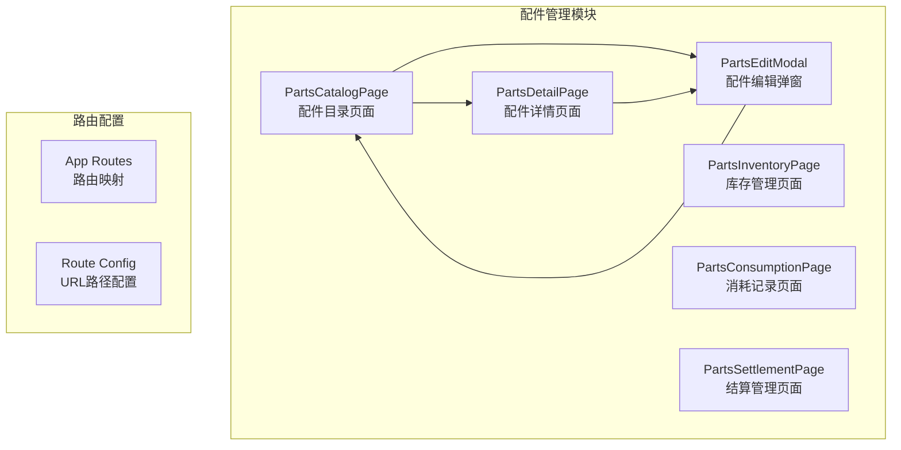

**图表来源**
- [PartsCatalogPage.tsx:103-651](file://client/src/components/PartsManagement/PartsCatalogPage.tsx#L103-L651)
- [index.ts:1-13](file://client/src/components/PartsManagement/index.ts#L1-L13)
- [App.tsx:276-281](file://client/src/App.tsx#L276-L281)

### 后端API架构

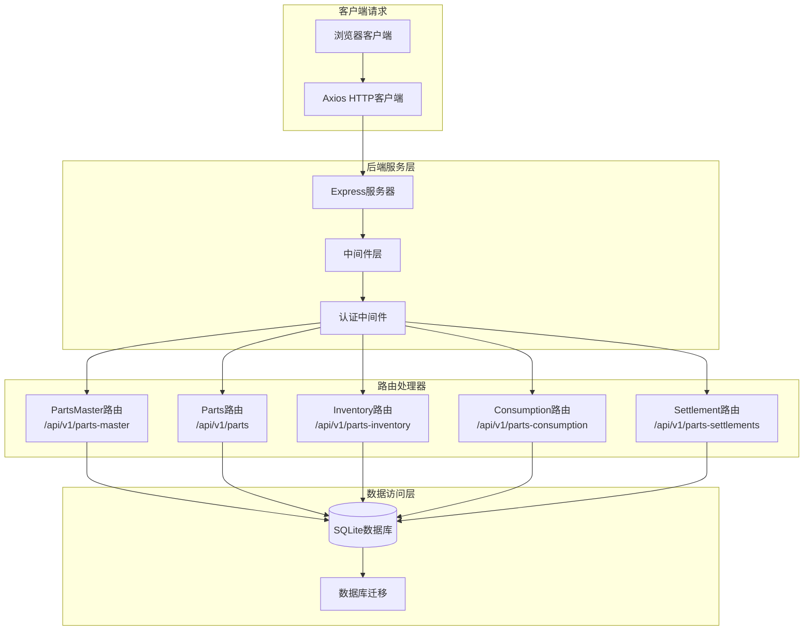

**图表来源**
- [parts-master.js:8-636](file://server/service/routes/parts-master.js#L8-L636)
- [parts.js:9-659](file://server/service/routes/parts.js#L9-L659)

**章节来源**
- [PartsCatalogPage.tsx:1-654](file://client/src/components/PartsManagement/PartsCatalogPage.tsx#L1-L654)
- [index.ts:1-13](file://client/src/components/PartsManagement/index.ts#L1-L13)
- [App.tsx:276-281](file://client/src/App.tsx#L276-L281)

## 核心组件

### 配件目录页面 (PartsCatalogPage)

配件目录页面是整个配件管理系统的入口界面，提供了以下核心功能：

#### 主要特性
- **响应式表格设计**：支持列宽调整、排序和搜索功能
- **产品族群筛选**：按产品系列（A-E）进行智能筛选
- **深色/浅色主题**：完全支持暗色模式切换
- **权限控制**：基于用户角色的访问控制
- **实时数据同步**：自动刷新配件列表

#### 数据模型

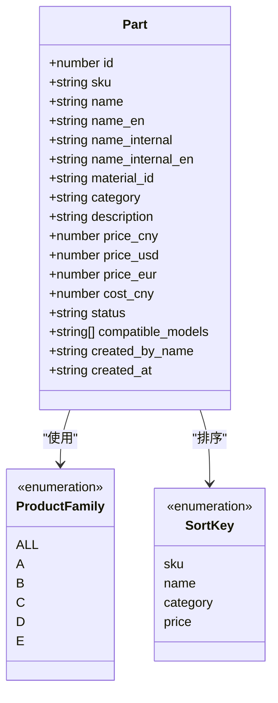

**图表来源**
- [PartsCatalogPage.tsx:43-61](file://client/src/components/PartsManagement/PartsCatalogPage.tsx#L43-L61)

#### 用户交互流程

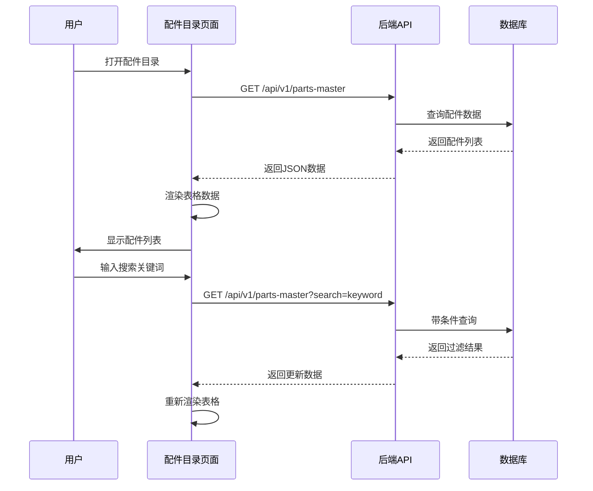

**图表来源**
- [PartsCatalogPage.tsx:137-158](file://client/src/components/PartsManagement/PartsCatalogPage.tsx#L137-L158)
- [parts-master.js:25-159](file://server/service/routes/parts-master.js#L25-L159)

**章节来源**
- [PartsCatalogPage.tsx:103-651](file://client/src/components/PartsManagement/PartsCatalogPage.tsx#L103-L651)

### 配件详情页面 (PartsDetailPage)

配件详情页面提供单个配件的完整信息展示和管理功能：

#### 核心功能
- **基本信息展示**：SKU、名称、分类、状态等
- **价格信息管理**：支持多种货币的价格体系
- **兼容性管理**：关联产品型号和BOM配置
- **操作权限控制**：根据角色显示不同操作按钮
- **历史记录追踪**：显示创建和更新信息

#### 数据流图

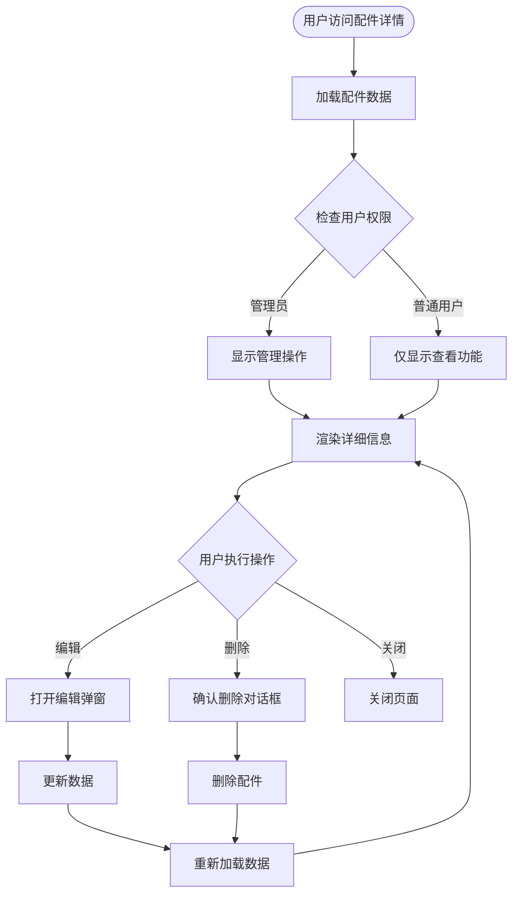

**图表来源**
- [PartsDetailPage.tsx:64-112](file://client/src/components/PartsManagement/PartsDetailPage.tsx#L64-L112)

**章节来源**
- [PartsDetailPage.tsx:64-531](file://client/src/components/PartsManagement/PartsDetailPage.tsx#L64-L531)

### 配件编辑弹窗 (PartsEditModal)

配件编辑弹窗提供了完整的配件信息编辑功能：

#### 功能特性
- **双栏布局设计**：左侧基本信息，右侧价格和兼容性
- **智能表单验证**：必填字段验证和错误提示
- **兼容性模型选择**：支持搜索和添加产品型号
- **价格管理**：支持多币种价格设置
- **实时状态反馈**：使用Toast通知用户操作结果

#### 表单字段设计

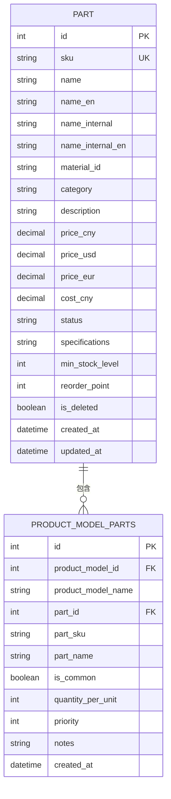

**图表来源**
- [031_parts_master.sql:7-42](file://server/service/migrations/031_parts_master.sql#L7-L42)
- [031_parts_master.sql:132-150](file://server/service/migrations/031_parts_master.sql#L132-L150)

**章节来源**
- [PartsEditModal.tsx:87-630](file://client/src/components/PartsManagement/PartsEditModal.tsx#L87-L630)

## 架构概览

### 整体系统架构

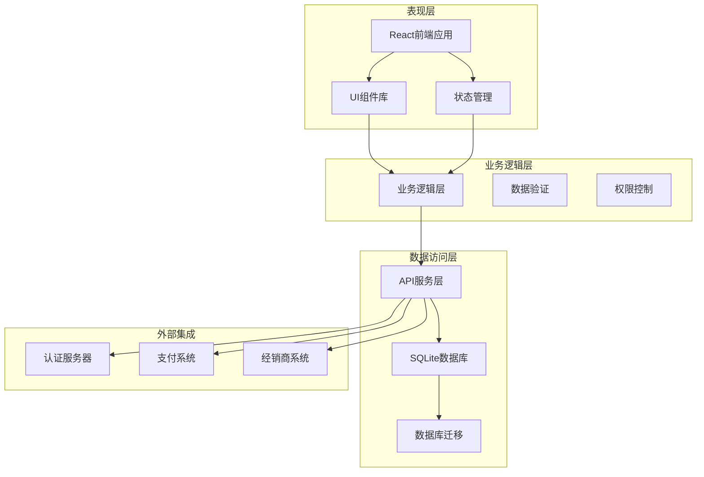

**图表来源**
- [App.tsx:276-281](file://client/src/App.tsx#L276-L281)
- [parts-master.js:8-636](file://server/service/routes/parts-master.js#L8-L636)

### 数据流架构

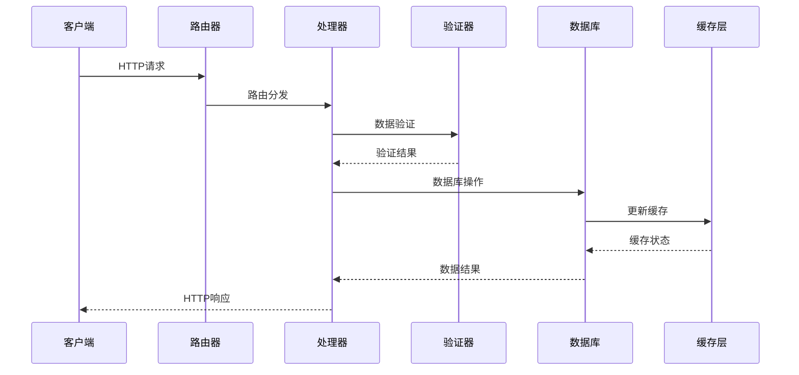

**图表来源**
- [parts-master.js:28-159](file://server/service/routes/parts-master.js#L28-L159)

## 详细组件分析

### 配件目录页面深度分析

#### 状态管理机制

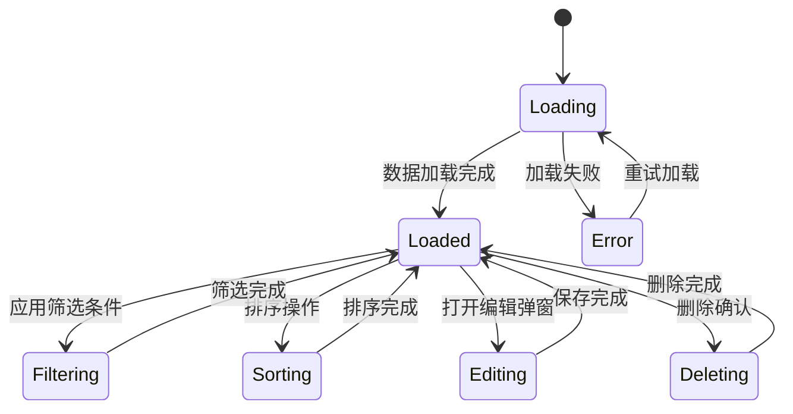

**图表来源**
- [PartsCatalogPage.tsx:108-135](file://client/src/components/PartsManagement/PartsCatalogPage.tsx#L108-L135)

#### 性能优化策略

1. **本地存储优化**
   - 列宽配置持久化存储
   - 自动保存用户偏好设置

2. **数据缓存机制**
   - 模型数据缓存避免重复请求
   - 分页加载减少内存占用

3. **渲染优化**
   - 虚拟滚动支持大数据集
   - 懒加载组件提升初始加载速度

#### 错误处理机制

```mermaid
flowchart TD
Request[发起API请求] --> CheckToken{检查访问令牌}
CheckToken --> |无效| RedirectLogin[重定向到登录页]
CheckToken --> |有效| SendRequest[发送请求]
SendRequest --> Response{收到响应}
Response --> |成功| ParseData[解析数据]
Response --> |失败| HandleError[处理错误]
ParseData --> RenderTable[渲染表格]
HandleError --> ShowError[显示错误信息]
ShowError --> Retry[允许重试]
Retry --> SendRequest
RedirectLogin --> [*]
RenderTable --> [*]
```

**图表来源**
- [PartsCatalogPage.tsx:137-158](file://client/src/components/PartsManagement/PartsCatalogPage.tsx#L137-L158)

**章节来源**
- [PartsCatalogPage.tsx:103-651](file://client/src/components/PartsManagement/PartsCatalogPage.tsx#L103-L651)

### 后端API设计分析

#### 配件主数据API

后端API提供了完整的配件管理功能，包括CRUD操作、权限控制和数据验证：

##### 核心API端点

| 端点 | 方法 | 功能描述 | 权限要求 |
|------|------|----------|----------|
| `/api/v1/parts-master` | GET | 获取配件列表 | 查看权限 |
| `/api/v1/parts-master` | POST | 创建新配件 | 管理权限 |
| `/api/v1/parts-master/:id` | GET | 获取配件详情 | 查看权限 |
| `/api/v1/parts-master/:id` | PATCH | 更新配件信息 | 管理权限 |
| `/api/v1/parts-master/:id` | DELETE | 删除配件 | 管理权限 |

##### 数据验证规则

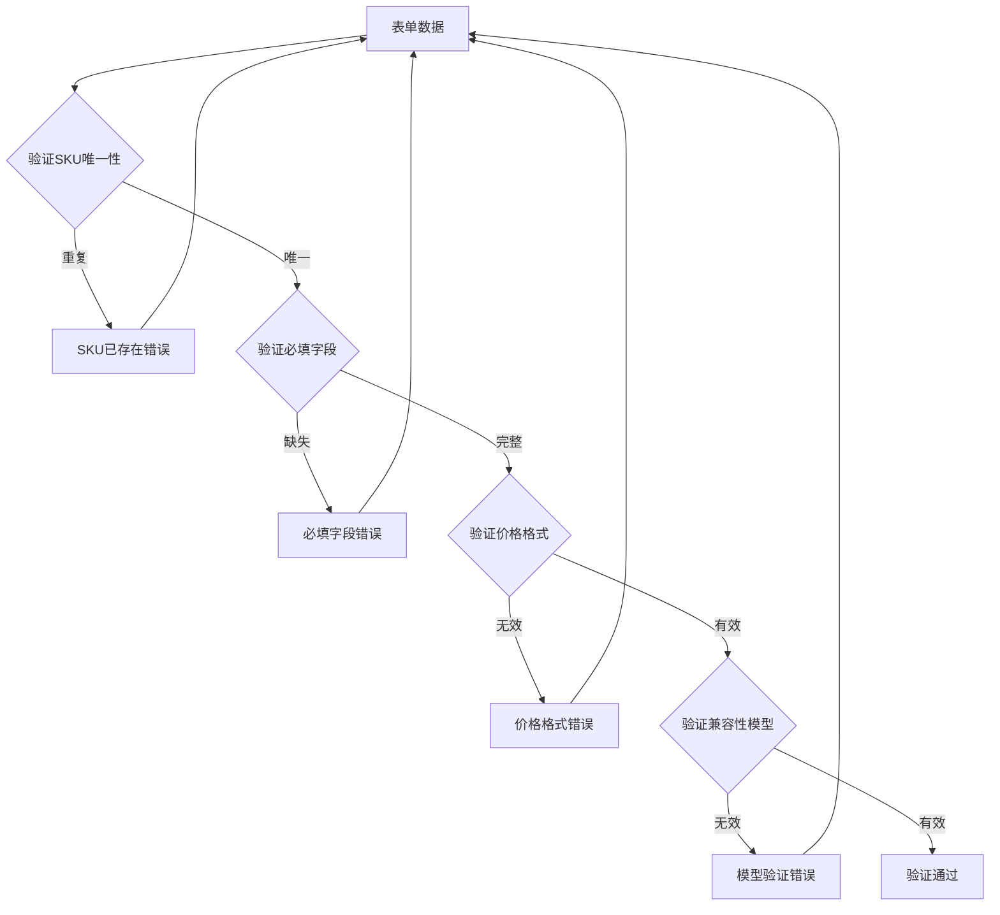

**图表来源**
- [parts-master.js:232-338](file://server/service/routes/parts-master.js#L232-L338)

**章节来源**
- [parts-master.js:25-636](file://server/service/routes/parts-master.js#L25-L636)

### 数据库设计分析

#### 核心数据表结构

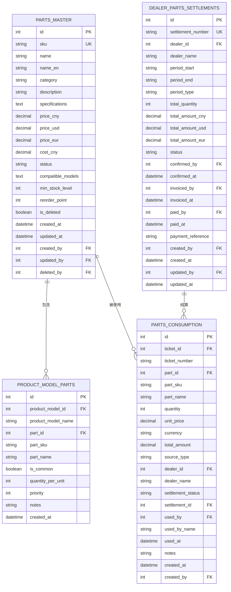

**图表来源**
- [031_parts_master.sql:7-189](file://server/service/migrations/031_parts_master.sql#L7-L189)

**章节来源**
- [031_parts_master.sql:1-226](file://server/service/migrations/031_parts_master.sql#L1-L226)

## 依赖关系分析

### 前端依赖关系

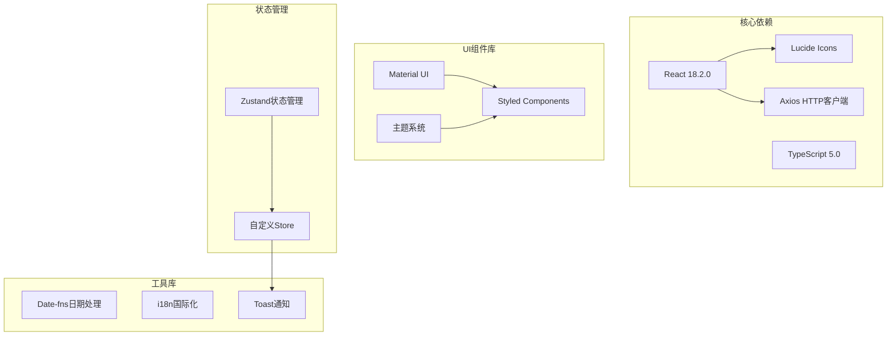

**图表来源**
- [PartsCatalogPage.tsx:12-21](file://client/src/components/PartsManagement/PartsCatalogPage.tsx#L12-L21)

### 后端依赖关系

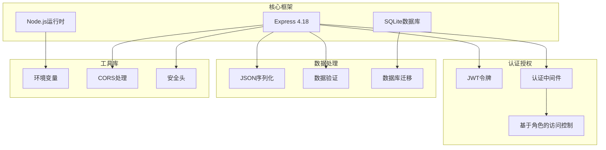

**图表来源**
- [parts-master.js:6-8](file://server/service/routes/parts-master.js#L6-L8)

**章节来源**
- [PartsCatalogPage.tsx:12-21](file://client/src/components/PartsManagement/PartsCatalogPage.tsx#L12-L21)
- [parts-master.js:6-8](file://server/service/routes/parts-master.js#L6-L8)

## 性能考虑

### 前端性能优化

1. **虚拟滚动实现**
   - 大数据集使用虚拟滚动减少DOM节点
   - 滚动性能优化避免重绘

2. **懒加载策略**
   - 路由级别的代码分割
   - 组件级别的动态导入

3. **缓存机制**
   - HTTP缓存头部设置
   - 浏览器缓存策略

### 后端性能优化

1. **数据库索引优化**
   - 为常用查询字段建立索引
   - 复合索引优化复杂查询

2. **查询优化**
   - 分页查询避免全表扫描
   - 连接查询优化

3. **缓存策略**
   - Redis缓存热点数据
   - 数据库查询结果缓存

## 故障排除指南

### 常见问题诊断

#### 配件列表加载失败

**症状**：配件目录页面显示加载错误

**可能原因**：
1. 访问令牌过期或无效
2. 网络连接问题
3. 数据库查询超时

**解决步骤**：
1. 检查用户认证状态
2. 验证网络连接稳定性
3. 查看服务器日志
4. 重启API服务

#### 配件编辑保存失败

**症状**：编辑配件信息后无法保存

**可能原因**：
1. SKU重复冲突
2. 必填字段缺失
3. 数据库连接异常

**解决步骤**：
1. 检查SKU唯一性
2. 验证表单数据完整性
3. 重启数据库服务
4. 检查磁盘空间

#### 权限访问问题

**症状**：用户无法执行管理操作

**可能原因**：
1. 用户角色权限不足
2. 部门权限限制
3. 配置错误

**解决步骤**：
1. 检查用户角色配置
2. 验证部门权限设置
3. 更新权限配置
4. 重新登录系统

**章节来源**
- [PartsCatalogPage.tsx:137-158](file://client/src/components/PartsManagement/PartsCatalogPage.tsx#L137-L158)
- [PartsDetailPage.tsx:114-147](file://client/src/components/PartsManagement/PartsDetailPage.tsx#L114-L147)

## 结论

配件目录页面作为Longhorn维修管理系统的核心功能模块，展现了现代Web应用开发的最佳实践。系统通过清晰的架构设计、完善的权限控制和优秀的用户体验，为维修配件管理提供了全面的解决方案。

### 主要优势

1. **模块化设计**：组件职责明确，便于维护和扩展
2. **权限控制**：基于角色的细粒度权限管理
3. **用户体验**：响应式设计和流畅的交互体验
4. **数据完整性**：严格的验证机制确保数据质量
5. **性能优化**：多层缓存和优化策略提升系统性能

### 技术亮点

1. **前后端分离**：清晰的职责划分和独立演进能力
2. **数据库设计**：规范化的表结构和索引优化
3. **API设计**：RESTful风格和版本化管理
4. **状态管理**：高效的前端状态管理方案
5. **错误处理**：完善的错误捕获和用户反馈机制

该系统为后续的功能扩展和性能优化奠定了坚实的基础，能够满足不断增长的业务需求。