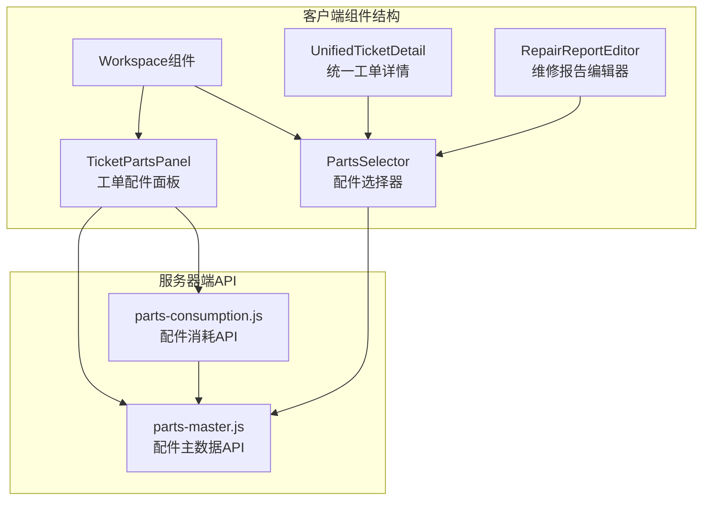
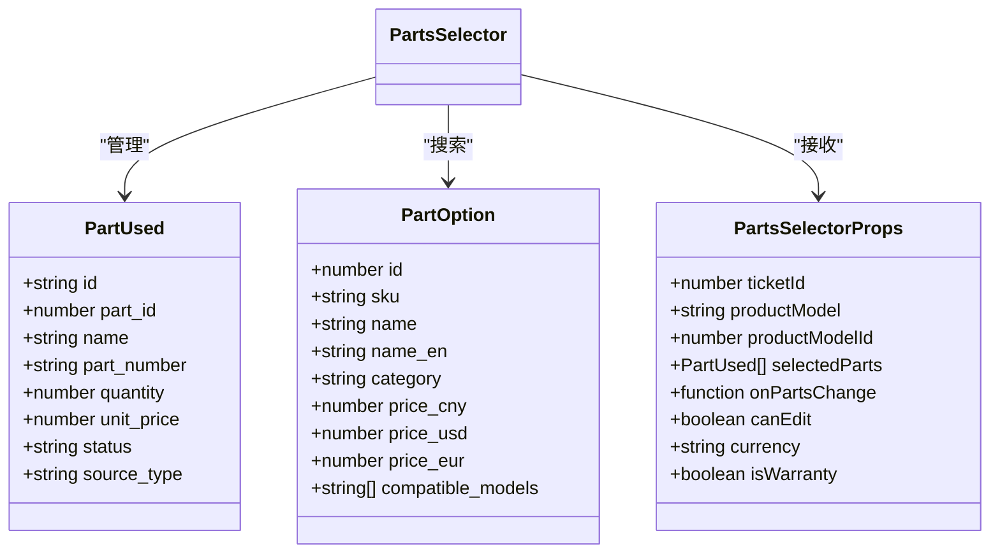
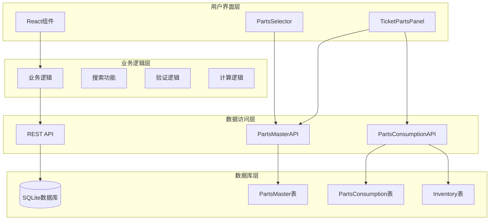
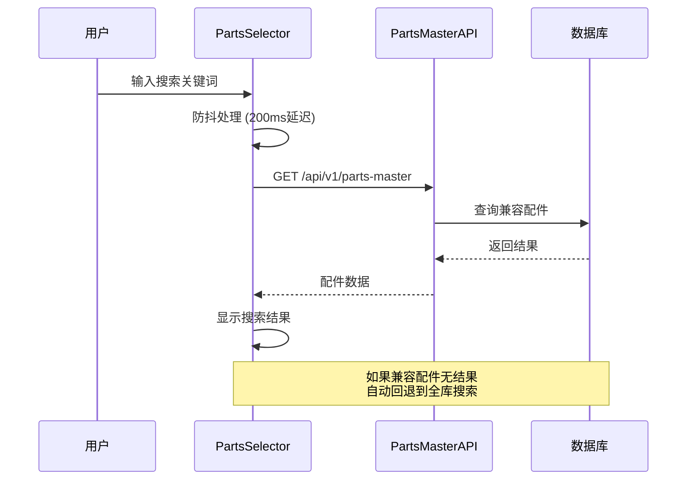
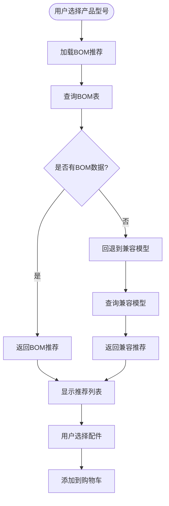
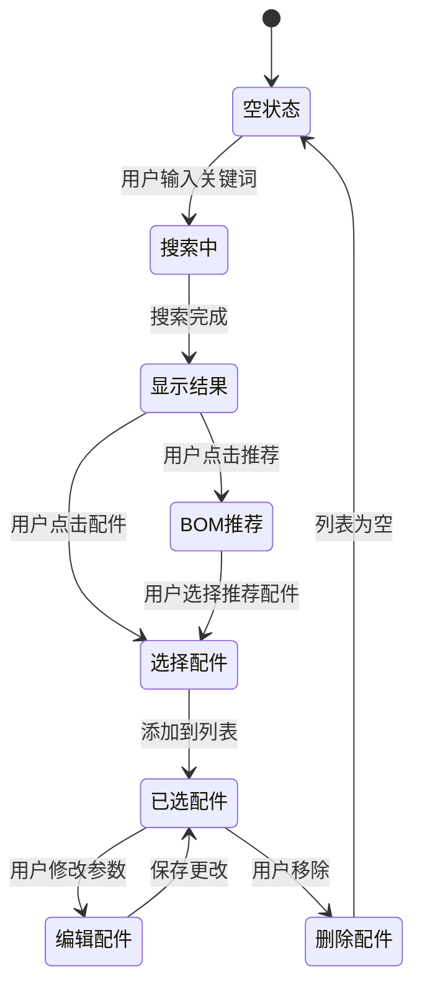
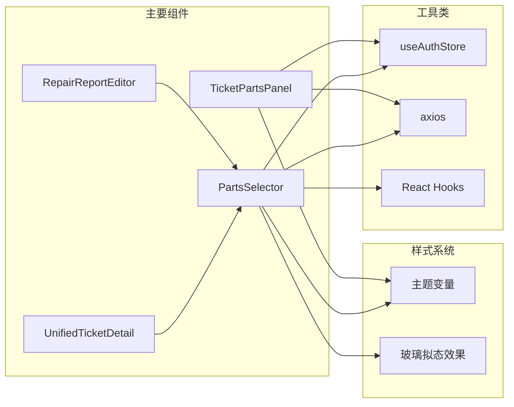
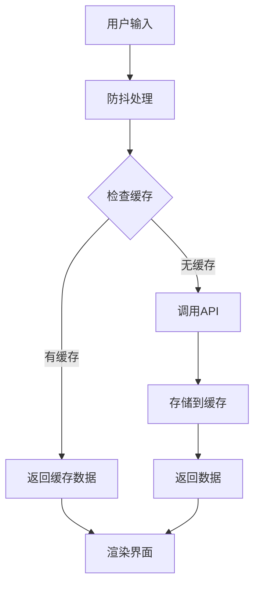

# 配件选择器组件

<cite>
**本文档引用的文件**
- [PartsSelector.tsx](file://client/src/components/Workspace/PartsSelector.tsx)
- [TicketPartsPanel.tsx](file://client/src/components/PartsManagement/TicketPartsPanel.tsx)
- [parts-master.js](file://server/service/routes/parts-master.js)
- [parts-consumption.js](file://server/service/routes/parts-consumption.js)
- [UnifiedTicketDetail.tsx](file://client/src/components/Workspace/UnifiedTicketDetail.tsx)
- [RepairReportEditor.tsx](file://client/src/components/Workspace/RepairReportEditor.tsx)
- [UnifiedTicketDetailPage.tsx](file://client/src/components/Service/UnifiedTicketDetailPage.tsx)
</cite>

## 目录
1. [简介](#简介)
2. [项目结构](#项目结构)
3. [核心组件](#核心组件)
4. [架构概览](#架构概览)
5. [详细组件分析](#详细组件分析)
6. [依赖关系分析](#依赖关系分析)
7. [性能考虑](#性能考虑)
8. [故障排除指南](#故障排除指南)
9. [结论](#结论)

## 简介

配件选择器组件是Longhorn维修管理系统中的核心功能模块，专门用于在工单维修报告中选择和管理配件。该组件提供了完整的配件选择、搜索、BOM推荐和手动添加功能，支持多种配件来源类型和状态管理。

该组件采用现代化的React Hooks架构，集成了防抖搜索、下拉选择、实时价格计算和完整的错误处理机制。系统支持多币种定价、配件状态跟踪和来源类型管理，为维修服务提供了全面的配件管理解决方案。

## 项目结构

配件选择器组件位于客户端组件树的Workspace目录下，与相关的工单管理和配件管理功能紧密集成：

**图表来源**
- [PartsSelector.tsx:1-754](file://client/src/components/Workspace/PartsSelector.tsx#L1-L754)
- [TicketPartsPanel.tsx:1-507](file://client/src/components/PartsManagement/TicketPartsPanel.tsx#L1-L507)
- [parts-master.js:1-635](file://server/service/routes/parts-master.js#L1-L635)
- [parts-consumption.js:1-489](file://server/service/routes/parts-consumption.js#L1-L489)

**章节来源**
- [PartsSelector.tsx:1-754](file://client/src/components/Workspace/PartsSelector.tsx#L1-L754)
- [TicketPartsPanel.tsx:1-507](file://client/src/components/PartsManagement/TicketPartsPanel.tsx#L1-L507)

## 核心组件

### 配件选择器组件 (PartsSelector)

PartsSelector是整个配件管理系统的中央组件，提供了完整的配件选择和管理功能：

**主要功能特性：**
- 实时配件搜索和过滤
- BOM推荐系统集成
- 手动添加非标准配件
- 多币种价格显示
- 配件状态和来源管理
- 实时价格计算

**核心接口定义：**

**图表来源**
- [PartsSelector.tsx:12-44](file://client/src/components/Workspace/PartsSelector.tsx#L12-L44)

**章节来源**
- [PartsSelector.tsx:53-62](file://client/src/components/Workspace/PartsSelector.tsx#L53-L62)
- [PartsSelector.tsx:12-44](file://client/src/components/Workspace/PartsSelector.tsx#L12-L44)

### 工单配件面板 (TicketPartsPanel)

TicketPartsPanel提供了更高级的工单配件管理功能，主要用于工单详情页面：

**核心功能：**
- 配件消耗记录管理
- 批量添加和删除
- 结算状态跟踪
- 统计数据分析

**章节来源**
- [TicketPartsPanel.tsx:65-507](file://client/src/components/PartsManagement/TicketPartsPanel.tsx#L65-L507)

## 架构概览

配件选择器组件采用了分层架构设计，确保了良好的可维护性和扩展性：

**图表来源**
- [parts-master.js:28-157](file://server/service/routes/parts-master.js#L28-L157)
- [parts-consumption.js:28-132](file://server/service/routes/parts-consumption.js#L28-L132)

**章节来源**
- [parts-master.js:1-635](file://server/service/routes/parts-master.js#L1-L635)
- [parts-consumption.js:1-489](file://server/service/routes/parts-consumption.js#L1-L489)

## 详细组件分析

### 配件选择器核心实现

#### 搜索和过滤机制

配件选择器实现了智能的搜索和过滤功能，支持多种搜索模式：

**图表来源**
- [PartsSelector.tsx:98-131](file://client/src/components/Workspace/PartsSelector.tsx#L98-L131)
- [parts-master.js:28-157](file://server/service/routes/parts-master.js#L28-L157)

#### BOM推荐系统

BOM（物料清单）推荐系统提供了基于产品型号的智能配件推荐：

**图表来源**
- [PartsSelector.tsx:168-187](file://client/src/components/Workspace/PartsSelector.tsx#L168-L187)
- [parts-master.js:492-606](file://server/service/routes/parts-master.js#L492-L606)

#### 手动添加功能

手动添加功能允许用户添加非标准配件：

**章节来源**
- [PartsSelector.tsx:232-253](file://client/src/components/Workspace/PartsSelector.tsx#L232-L253)

### 数据流和状态管理

#### 配件选择流程

**图表来源**
- [PartsSelector.tsx:189-230](file://client/src/components/Workspace/PartsSelector.tsx#L189-L230)

#### 价格计算和货币转换

组件支持多币种定价，根据用户选择的货币显示相应的价格：

**章节来源**
- [PartsSelector.tsx:255-263](file://client/src/components/Workspace/PartsSelector.tsx#L255-L263)

### 服务器端API集成

#### 配件主数据API

服务器端提供了完整的配件主数据管理API：

**核心端点：**
- `GET /api/v1/parts-master` - 获取配件列表
- `GET /api/v1/parts-master/:id` - 获取配件详情  
- `POST /api/v1/parts-master` - 创建配件
- `PATCH /api/v1/parts-master/:id` - 更新配件
- `DELETE /api/v1/parts-master/:id` - 删除配件
- `GET /api/v1/parts-master/bom` - 获取BOM推荐

**章节来源**
- [parts-master.js:28-157](file://server/service/routes/parts-master.js#L28-L157)
- [parts-master.js:492-606](file://server/service/routes/parts-master.js#L492-L606)

#### 配件消耗API

配件消耗API负责管理工单中的配件使用记录：

**核心端点：**
- `GET /api/v1/parts-consumption` - 获取消耗记录列表
- `GET /api/v1/parts-consumption/summary` - 获取消耗统计
- `POST /api/v1/parts-consumption` - 记录配件消耗
- `PATCH /api/v1/parts-consumption/:id/settlement` - 更新结算状态
- `DELETE /api/v1/parts-consumption/:id` - 删除消耗记录

**章节来源**
- [parts-consumption.js:28-132](file://server/service/routes/parts-consumption.js#L28-L132)
- [parts-consumption.js:238-369](file://server/service/routes/parts-consumption.js#L238-L369)

## 依赖关系分析

### 组件间依赖关系

**图表来源**
- [PartsSelector.tsx:7-10](file://client/src/components/Workspace/PartsSelector.tsx#L7-L10)
- [TicketPartsPanel.tsx:7-16](file://client/src/components/PartsManagement/TicketPartsPanel.tsx#L7-L16)

### 外部依赖分析

**主要外部依赖：**
- **axios**: HTTP客户端，用于API通信
- **lucide-react**: 图标库，提供统一的图标系统
- **React**: 核心框架，使用Hooks进行状态管理
- **本地存储**: useAuthStore用于认证状态管理

**章节来源**
- [PartsSelector.tsx:7-10](file://client/src/components/Workspace/PartsSelector.tsx#L7-L10)
- [TicketPartsPanel.tsx:7-16](file://client/src/components/PartsManagement/TicketPartsPanel.tsx#L7-L16)

## 性能考虑

### 搜索优化策略

配件选择器采用了多项性能优化措施：

1. **防抖搜索**: 200ms延迟避免频繁API调用
2. **智能回退**: 兼容配件无结果时自动回退到全库搜索
3. **分页加载**: 限制每次搜索返回100条结果
4. **内存管理**: 自动清理事件监听器和定时器

### 数据缓存机制

组件实现了多层次的数据缓存策略：

**图表来源**
- [PartsSelector.tsx:162-165](file://client/src/components/Workspace/PartsSelector.tsx#L162-L165)

### 错误处理和重试机制

组件具备完善的错误处理能力：

1. **网络错误处理**: 自动捕获和显示API调用错误
2. **用户反馈**: 提供清晰的错误信息和重试选项
3. **状态恢复**: 错误发生时保持组件状态稳定

## 故障排除指南

### 常见问题和解决方案

#### 搜索功能异常

**问题症状：** 搜索框无响应或返回空结果

**可能原因：**
1. API服务不可用
2. 网络连接问题
3. 搜索关键词过短

**解决方案：**
1. 检查API服务状态
2. 验证网络连接
3. 确保搜索关键词至少2个字符

#### BOM推荐不显示

**问题症状：** BOM推荐按钮不可用或无推荐结果

**可能原因：**
1. 产品型号ID缺失
2. BOM表中无相关记录
3. 兼容模型匹配失败

**解决方案：**
1. 确保正确设置productModelId
2. 检查BOM表数据完整性
3. 验证产品型号名称匹配

#### 配件添加失败

**问题症状：** 手动添加的配件无法保存

**可能原因：**
1. 必填字段缺失
2. 权限不足
3. 数据验证失败

**解决方案：**
1. 填写所有必填字段
2. 检查用户权限
3. 验证数据格式

**章节来源**
- [PartsSelector.tsx:87-95](file://client/src/components/Workspace/PartsSelector.tsx#L87-L95)
- [TicketPartsPanel.tsx:123-147](file://client/src/components/PartsManagement/TicketPartsPanel.tsx#L123-L147)

### 调试技巧

1. **开发者工具**: 使用浏览器开发者工具监控网络请求
2. **日志输出**: 在关键位置添加console.log调试信息
3. **状态检查**: 使用React DevTools检查组件状态变化
4. **API测试**: 直接调用API端点验证数据格式

## 结论

配件选择器组件是一个功能完整、架构清晰的维修管理系统核心模块。它成功地整合了现代前端开发的最佳实践，包括：

**技术优势：**
- 响应式设计和用户体验优化
- 完善的错误处理和状态管理
- 高效的搜索和数据加载机制
- 灵活的权限控制和数据验证

**业务价值：**
- 提高维修服务效率
- 确保配件使用的准确性和可追溯性
- 支持多币种和多来源的配件管理
- 提供完整的统计和分析功能

该组件为Longhorn维修管理系统奠定了坚实的技术基础，为未来的功能扩展和性能优化提供了良好的架构支撑。通过持续的改进和优化，该组件将继续为用户提供优质的配件管理体验。