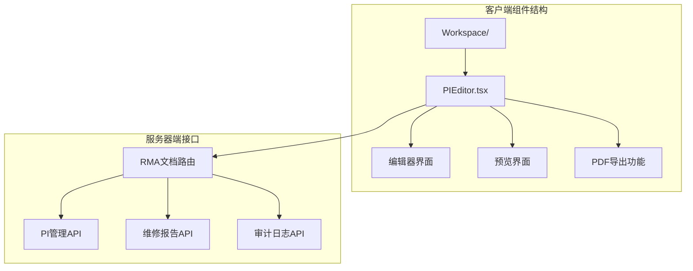
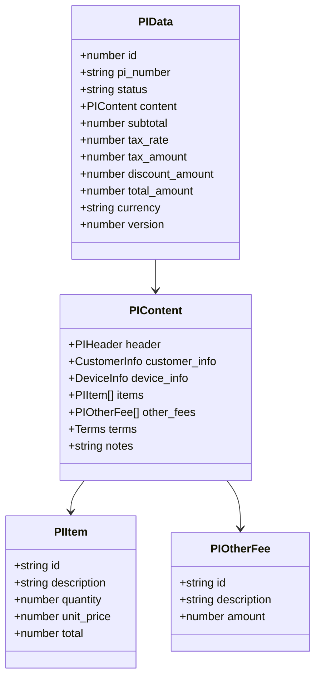
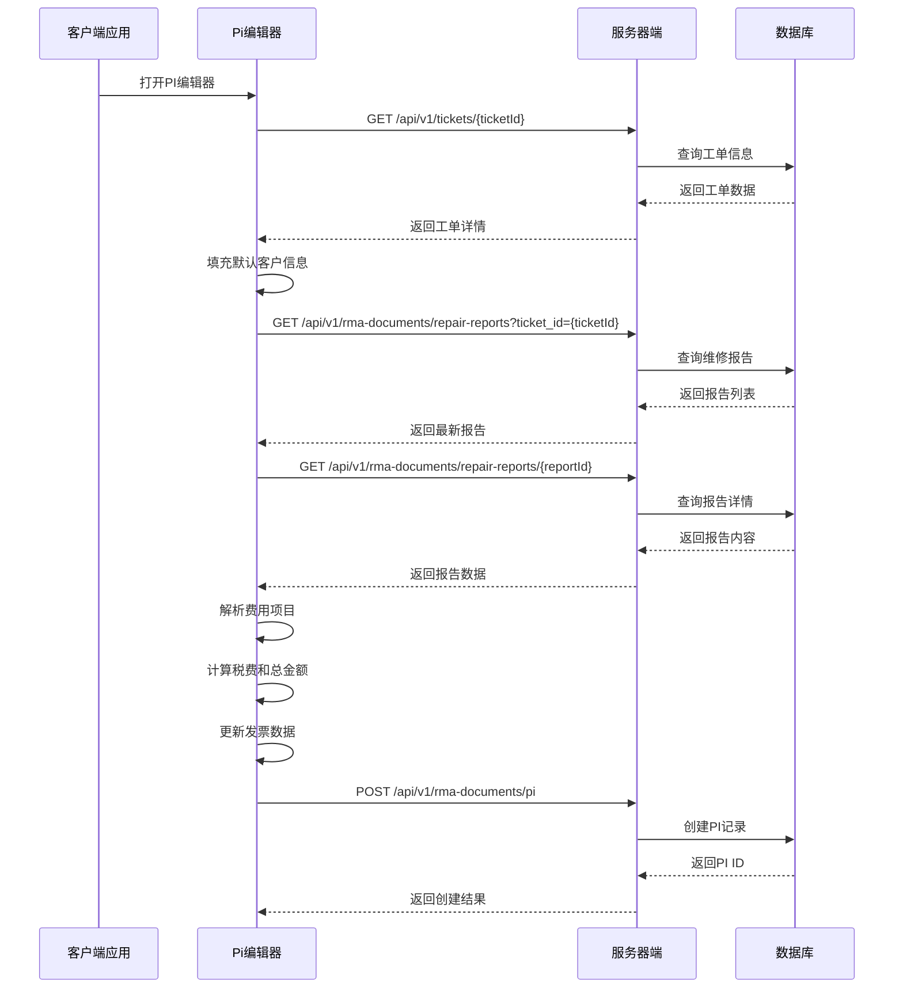
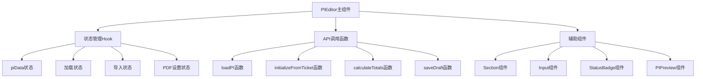
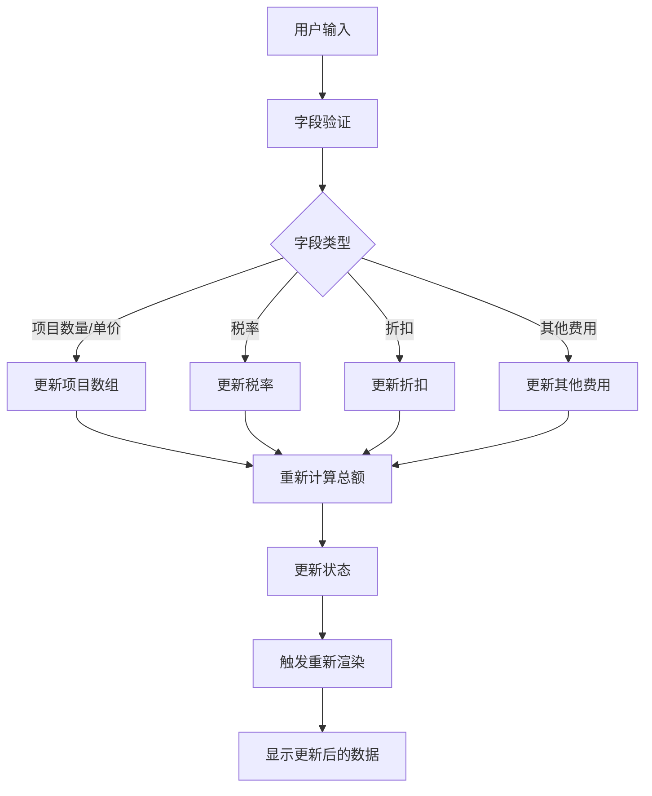
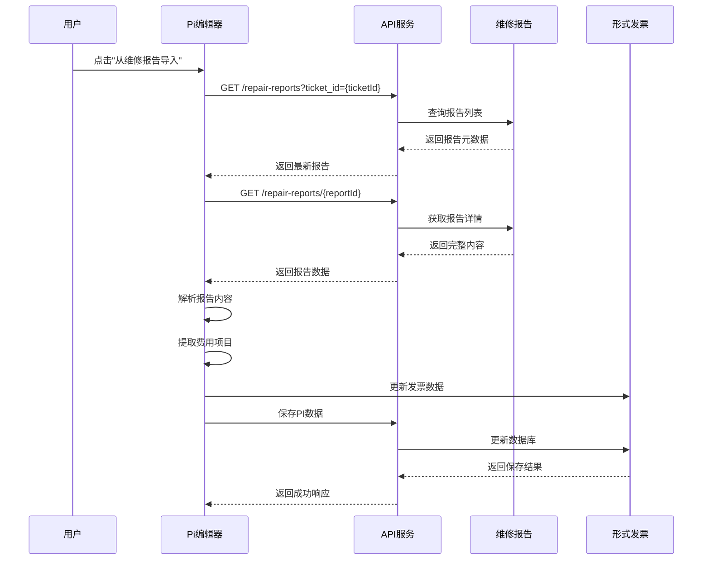
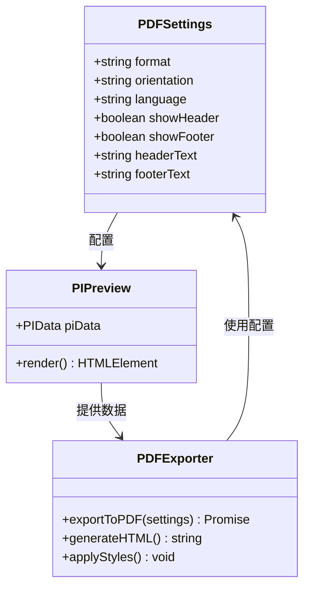
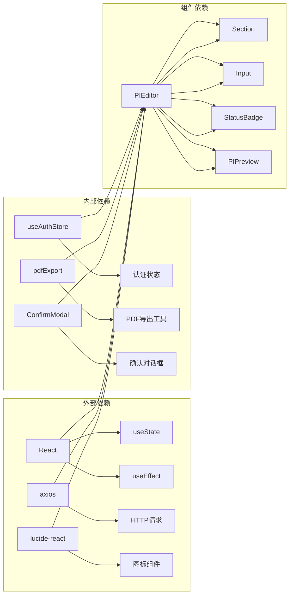

# Pi Editor 组件

<cite>
**本文档引用的文件**
- [PIEditor.tsx](file://client/src/components/Workspace/PIEditor.tsx)
- [rma-documents.js](file://server/service/routes/rma-documents.js)
</cite>

## 目录
1. [简介](#简介)
2. [项目结构](#项目结构)
3. [核心组件](#核心组件)
4. [架构概览](#架构概览)
5. [详细组件分析](#详细组件分析)
6. [依赖关系分析](#依赖关系分析)
7. [性能考虑](#性能考虑)
8. [故障排除指南](#故障排除指南)
9. [结论](#结论)

## 简介

Pi Editor 是 Longhorn 项目中的一个关键组件，用于创建和管理形式发票（Proforma Invoice, PI）。该组件提供了一个完整的发票编辑界面，支持从维修报告导入费用、实时计算税费、PDF 导出等功能。它采用现代化的 React 架构设计，结合 TypeScript 类型系统，确保代码的可维护性和可靠性。

该组件主要服务于售后服务流程，通过与服务器端的 RMA 文档管理系统集成，实现了发票的完整生命周期管理，包括草稿创建、审核流程、发布管理和版本控制。

## 项目结构

Pi Editor 组件位于客户端的 Workspace 组件目录中，采用模块化的设计方式：

**图表来源**
- [PIEditor.tsx:105-1210](file://client/src/components/Workspace/PIEditor.tsx#L105-L1210)
- [rma-documents.js:1-1507](file://server/service/routes/rma-documents.js#L1-L1507)

**章节来源**
- [PIEditor.tsx:1-1370](file://client/src/components/Workspace/PIEditor.tsx#L1-L1370)
- [rma-documents.js:1-1507](file://server/service/routes/rma-documents.js#L1-L1507)

## 核心组件

Pi Editor 组件是一个功能完整的 React 函数式组件，具有以下核心特性：

### 数据模型结构

组件使用了精心设计的数据结构来管理发票信息：

**图表来源**
- [PIEditor.tsx:19-77](file://client/src/components/Workspace/PIEditor.tsx#L19-L77)
- [PIEditor.tsx:59-77](file://client/src/components/Workspace/PIEditor.tsx#L59-L77)

### 主要功能特性

1. **多标签页界面**：提供编辑和预览两个视图模式
2. **自动数据填充**：从工单信息自动填充客户和设备信息
3. **维修报告集成**：支持从维修报告导入费用项目
4. **实时计算**：动态计算税费和总金额
5. **PDF导出**：支持自定义格式的发票导出
6. **状态管理**：完整的文档状态流转控制

**章节来源**
- [PIEditor.tsx:105-1210](file://client/src/components/Workspace/PIEditor.tsx#L105-L1210)

## 架构概览

Pi Editor 采用了前后端分离的架构设计，通过 RESTful API 进行通信：

**图表来源**
- [PIEditor.tsx:190-320](file://client/src/components/Workspace/PIEditor.tsx#L190-L320)
- [rma-documents.js:77-137](file://server/service/routes/rma-documents.js#L77-L137)

**章节来源**
- [PIEditor.tsx:149-188](file://client/src/components/Workspace/PIEditor.tsx#L149-L188)
- [rma-documents.js:216-279](file://server/service/routes/rma-documents.js#L216-L279)

## 详细组件分析

### 组件架构设计

Pi Editor 采用了清晰的组件分层架构：

**图表来源**
- [PIEditor.tsx:105-147](file://client/src/components/Workspace/PIEditor.tsx#L105-L147)
- [PIEditor.tsx:1213-1250](file://client/src/components/Workspace/PIEditor.tsx#L1213-L1250)

### 数据流处理

组件内部实现了复杂的数据流处理机制：

**图表来源**
- [PIEditor.tsx:502-525](file://client/src/components/Workspace/PIEditor.tsx#L502-L525)
- [PIEditor.tsx:493-500](file://client/src/components/Workspace/PIEditor.tsx#L493-L500)

### 维修报告导入流程

组件提供了智能的维修报告导入功能：

**图表来源**
- [PIEditor.tsx:322-430](file://client/src/components/Workspace/PIEditor.tsx#L322-L430)
- [rma-documents.js:766-829](file://server/service/routes/rma-documents.js#L766-L829)

**章节来源**
- [PIEditor.tsx:322-491](file://client/src/components/Workspace/PIEditor.tsx#L322-L491)

### PDF导出功能

组件集成了灵活的 PDF 导出功能：

**图表来源**
- [PIEditor.tsx:127-135](file://client/src/components/Workspace/PIEditor.tsx#L127-L135)
- [PIEditor.tsx:654-673](file://client/src/components/Workspace/PIEditor.tsx#L654-L673)

**章节来源**
- [PIEditor.tsx:1110-1206](file://client/src/components/Workspace/PIEditor.tsx#L1110-L1206)

## 依赖关系分析

Pi Editor 组件的依赖关系展现了清晰的模块化设计：

**图表来源**
- [PIEditor.tsx:1-8](file://client/src/components/Workspace/PIEditor.tsx#L1-L8)

### 外部库依赖

组件使用了现代化的前端技术栈：

| 依赖库 | 版本 | 用途 |
|--------|------|------|
| react | 最新 | 核心框架 |
| lucide-react | 图标库 | UI图标 |
| axios | HTTP客户端 | API通信 |
| @types/react | 类型定义 | TypeScript支持 |

### 内部模块依赖

组件内部模块间的关系清晰明确：

- **状态管理**：通过 React Hooks 实现本地状态管理
- **API集成**：封装了完整的 RMA 文档 API 调用
- **UI组件**：提供可复用的子组件
- **工具函数**：包含 PDF 导出等辅助功能

**章节来源**
- [PIEditor.tsx:1-1370](file://client/src/components/Workspace/PIEditor.tsx#L1-L1370)

## 性能考虑

Pi Editor 组件在设计时充分考虑了性能优化：

### 渲染优化

1. **条件渲染**：根据状态动态选择渲染内容
2. **懒加载**：仅在需要时加载维修报告数据
3. **防抖处理**：对频繁的输入操作进行节流

### 内存管理

1. **状态清理**：组件卸载时清理相关状态
2. **事件监听**：正确移除事件监听器
3. **资源释放**：及时释放 PDF 导出相关的 DOM 引用

### 网络优化

1. **缓存策略**：合理使用浏览器缓存
2. **并发控制**：限制同时进行的 API 请求
3. **错误重试**：实现智能的错误重试机制

## 故障排除指南

### 常见问题及解决方案

#### 数据加载失败

**问题症状**：编辑器显示加载中状态但长时间无法完成

**可能原因**：
- 网络连接不稳定
- 权限不足访问相关数据
- 服务器端 API 错误

**解决步骤**：
1. 检查网络连接状态
2. 验证用户权限
3. 查看浏览器开发者工具中的网络请求
4. 重新加载页面

#### 维修报告导入失败

**问题症状**：点击导入按钮后无响应或显示错误

**可能原因**：
- 工单关联的维修报告不存在
- 维修报告格式不符合预期
- 服务器端权限验证失败

**解决步骤**：
1. 确认工单确实存在维修报告
2. 检查维修报告的状态是否为已发布或草稿
3. 验证用户是否有访问权限
4. 查看控制台错误信息

#### PDF 导出失败

**问题症状**：点击导出按钮后出现错误提示

**可能原因**：
- 预览内容为空
- 浏览器兼容性问题
- PDF 生成库冲突

**解决步骤**：
1. 确保发票内容不为空
2. 尝试在不同浏览器中导出
3. 检查浏览器控制台是否有 JavaScript 错误
4. 验证 PDF 导出库的版本兼容性

**章节来源**
- [PIEditor.tsx:182-187](file://client/src/components/Workspace/PIEditor.tsx#L182-L187)
- [PIEditor.tsx:424-427](file://client/src/components/Workspace/PIEditor.tsx#L424-L427)

## 结论

Pi Editor 组件是 Longhorn 项目中一个设计精良、功能完备的发票管理工具。它通过现代化的 React 架构和 TypeScript 类型系统，实现了高度的代码质量和可维护性。

### 主要优势

1. **用户体验优秀**：直观的界面设计和流畅的操作体验
2. **功能完整**：涵盖了发票管理的各个环节
3. **扩展性强**：模块化的架构便于功能扩展
4. **性能优化**：合理的性能考虑确保良好的响应速度

### 技术亮点

1. **类型安全**：完整的 TypeScript 类型定义
2. **状态管理**：清晰的状态流转和管理
3. **API集成**：完善的服务器端 API 集成
4. **错误处理**：健壮的错误处理和恢复机制

### 改进建议

1. **国际化支持**：增加多语言支持功能
2. **模板管理**：提供发票模板定制功能
3. **批量操作**：支持批量发票处理
4. **移动端适配**：优化移动端用户体验

Pi Editor 组件为 Longhorn 项目的售后服务流程提供了强有力的技术支撑，是整个系统中不可或缺的重要组成部分。