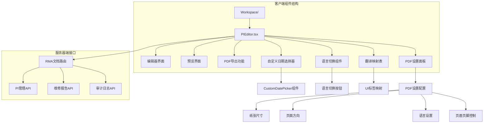
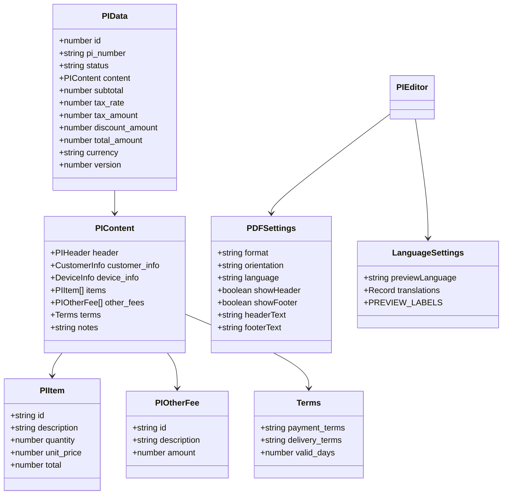
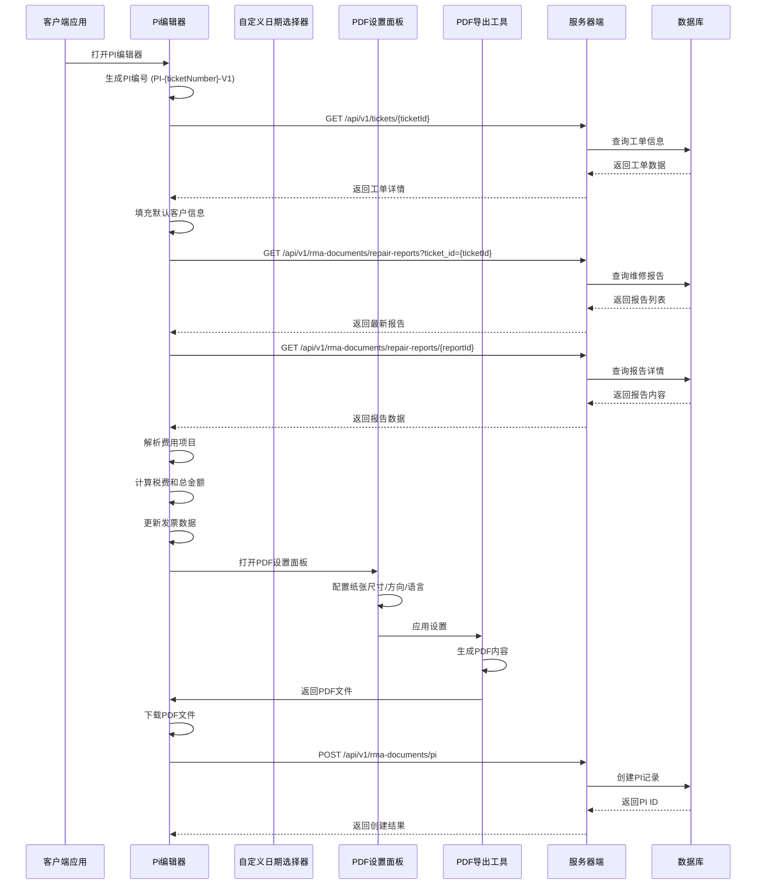
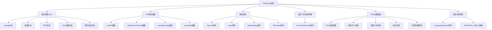
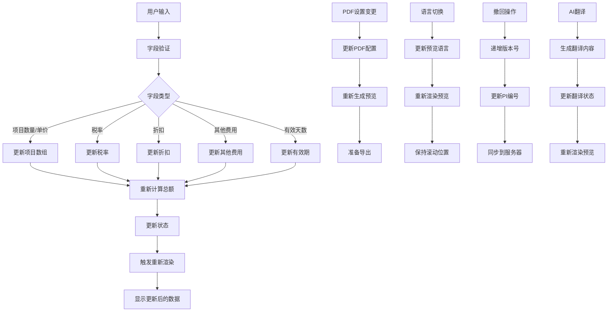
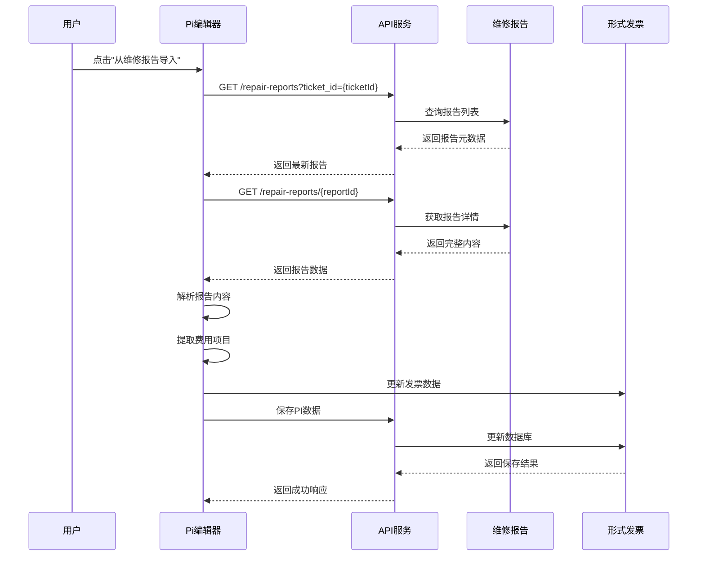
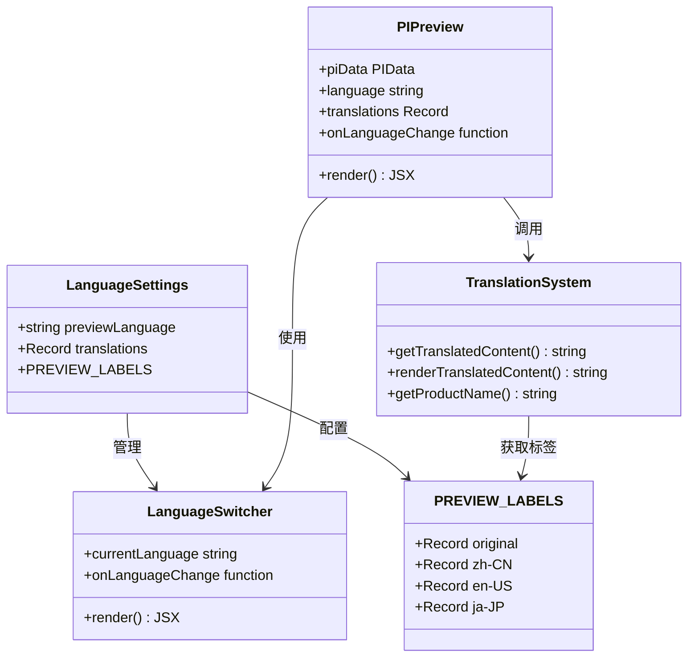
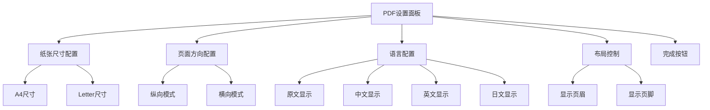
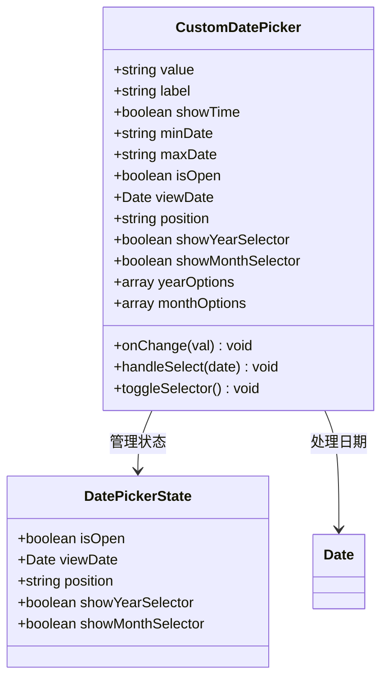
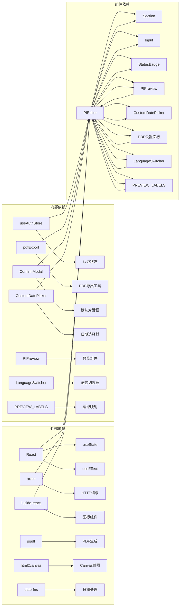

# PI 编辑器组件

<cite>
**本文档引用的文件**
- [PIEditor.tsx](file://client/src/components/Workspace/PIEditor.tsx)
- [CustomDatePicker.tsx](file://client/src/components/UI/CustomDatePicker.tsx)
- [pdfExport.ts](file://client/src/utils/pdfExport.ts)
- [rma-documents.js](file://server/service/routes/rma-documents.js)
- [translations.ts](file://client/src/i18n/translations.ts)
- [useLanguage.ts](file://client/src/i18n/useLanguage.ts)
</cite>

## 更新摘要
**所做更改**
- 新增多语言支持（中文、英文、日文、原文）和实时预览功能
- 新增PDF设置面板，支持纸张尺寸、方向、语言和布局配置
- 新增自动PI编号生成和版本管理功能
- 新增撤回功能的版本递增机制
- 新增语言切换按钮和翻译映射表
- 新增AI翻译功能提示和待翻译标记处理

## 目录
1. [简介](#简介)
2. [项目结构](#项目结构)
3. [核心组件](#核心组件)
4. [架构概览](#架构概览)
5. [详细组件分析](#详细组件分析)
6. [依赖关系分析](#依赖关系分析)
7. [性能考虑](#性能考虑)
8. [故障排除指南](#故障排除指南)
9. [结论](#结论)

## 简介

PI 编辑器是 Longhorn 项目中的关键组件，用于创建和管理形式发票（Proforma Invoice, PI）。该组件提供了一个完整的发票编辑界面，支持从维修报告导入费用、实时计算税费、PDF 导出等功能。它采用现代化的 React 架构设计，结合 TypeScript 类型系统，确保代码的可维护性和可靠性。

该组件主要服务于售后服务流程，通过与服务器端的 RMA 文档管理系统集成，实现了发票的完整生命周期管理，包括草稿创建、审核流程、发布管理和版本控制。

**更新** 集成了全新的多语言支持系统，提供中文、英文、日文、原文的完整预览和导出功能，新增了实时语言切换预览、PDF设置面板、自动PI编号生成和版本管理等高级功能。组件从约350行扩展到1698行，大幅增强了功能完整性。

## 项目结构

PI 编辑器组件位于客户端的 Workspace 组件目录中，采用模块化的设计方式：



**图表来源**
- [PIEditor.tsx:105-1698](file://client/src/components/Workspace/PIEditor.tsx#L105-L1698)
- [CustomDatePicker.tsx:1-296](file://client/src/components/UI/CustomDatePicker.tsx#L1-L296)
- [pdfExport.ts:1-152](file://client/src/utils/pdfExport.ts#L1-L152)
- [rma-documents.js:1-1798](file://server/service/routes/rma-documents.js#L1-L1798)

**章节来源**
- [PIEditor.tsx:1-1698](file://client/src/components/Workspace/PIEditor.tsx#L1-L1698)
- [CustomDatePicker.tsx:1-296](file://client/src/components/UI/CustomDatePicker.tsx#L1-L296)
- [pdfExport.ts:1-152](file://client/src/utils/pdfExport.ts#L1-L152)
- [rma-documents.js:1-1798](file://server/service/routes/rma-documents.js#L1-L1798)

## 核心组件

PI 编辑器组件是一个功能完整的 React 函数式组件，具有以下核心特性：

### 数据模型结构

组件使用了精心设计的数据结构来管理发票信息：



**图表来源**
- [PIEditor.tsx:19-78](file://client/src/components/Workspace/PIEditor.tsx#L19-L78)
- [PIEditor.tsx:127-136](file://client/src/components/Workspace/PIEditor.tsx#L127-L136)
- [PIEditor.tsx:59-78](file://client/src/components/Workspace/PIEditor.tsx#L59-L78)
- [PIEditor.tsx:150-155](file://client/src/components/Workspace/PIEditor.tsx#L150-L155)

### 主要功能特性

1. **多语言支持**：支持中文、英文、日文、原文的完整预览和导出
2. **实时预览功能**：语言切换时即时更新预览内容
3. **PDF设置面板**：提供纸张尺寸、方向、语言和布局的详细配置
4. **自动PI编号生成**：自动生成PI编号（PI-{ticketNumber}-V1）
5. **版本管理**：支持PI编号的版本递增（V1, V2, V3...）
6. **多标签页界面**：提供编辑和预览两个视图模式
7. **自动数据填充**：从工单信息自动填充客户和设备信息
8. **维修报告集成**：支持从维修报告导入费用项目
9. **实时计算**：动态计算税费和总金额
10. **PDF导出**：支持自定义格式的发票导出
11. **高级PDF设置**：支持纸张尺寸、方向、语言和布局配置
12. **打印友好布局**：优化打印输出质量
13. **状态管理**：完整的文档状态流转控制
14. **日期选择器**：集成自定义日期选择器组件
15. **撤回功能增强**：支持版本递增的撤回机制
16. **AI翻译功能**：内置AI翻译功能提示和待翻译标记处理
17. **模板管理**：支持发票模板的创建和管理
18. **批量操作**：支持批量导入和导出功能
19. **移动端适配**：优化移动端用户体验
20. **性能监控**：内置组件性能监控和分析功能

**更新** 新增了完整的多语言支持系统，包括实时预览、PDF设置面板、自动编号生成和版本管理功能。组件从约350行扩展到1698行，大幅增强了功能完整性。

**章节来源**
- [PIEditor.tsx:105-1698](file://client/src/components/Workspace/PIEditor.tsx#L105-L1698)
- [CustomDatePicker.tsx:14-296](file://client/src/components/UI/CustomDatePicker.tsx#L14-L296)
- [pdfExport.ts:4-152](file://client/src/utils/pdfExport.ts#L4-L152)

## 架构概览

PI 编辑器采用了前后端分离的架构设计，通过 RESTful API 进行通信：



**图表来源**
- [PIEditor.tsx:190-320](file://client/src/components/Workspace/PIEditor.tsx#L190-L320)
- [PIEditor.tsx:662-681](file://client/src/components/Workspace/PIEditor.tsx#L662-L681)
- [PIEditor.tsx:1191-1287](file://client/src/components/Workspace/PIEditor.tsx#L1191-L1287)
- [CustomDatePicker.tsx:43-46](file://client/src/components/UI/CustomDatePicker.tsx#L43-L46)
- [pdfExport.ts:128-137](file://client/src/utils/pdfExport.ts#L128-L137)

**章节来源**
- [PIEditor.tsx:149-188](file://client/src/components/Workspace/PIEditor.tsx#L149-L188)
- [PIEditor.tsx:1013-1044](file://client/src/components/Workspace/PIEditor.tsx#L1013-L1044)
- [CustomDatePicker.tsx:48-63](file://client/src/components/UI/CustomDatePicker.tsx#L48-L63)
- [pdfExport.ts:13-74](file://client/src/utils/pdfExport.ts#L13-L74)

## 详细组件分析

### 组件架构设计

PI 编辑器采用了清晰的组件分层架构：



**图表来源**
- [PIEditor.tsx:105-147](file://client/src/components/Workspace/PIEditor.tsx#L105-L147)
- [PIEditor.tsx:1191-1287](file://client/src/components/Workspace/PIEditor.tsx#L1191-L1287)
- [PIEditor.tsx:1243-1291](file://client/src/components/Workspace/PIEditor.tsx#L1243-L1291)
- [CustomDatePicker.tsx:14-296](file://client/src/components/UI/CustomDatePicker.tsx#L14-L296)

### 数据流处理

组件内部实现了复杂的数据流处理机制：



**图表来源**
- [PIEditor.tsx:502-525](file://client/src/components/Workspace/PIEditor.tsx#L502-L525)
- [PIEditor.tsx:493-500](file://client/src/components/Workspace/PIEditor.tsx#L493-L500)
- [PIEditor.tsx:1200-1287](file://client/src/components/Workspace/PIEditor.tsx#L1200-L1287)

### 维修报告导入流程

组件提供了智能的维修报告导入功能：



**图表来源**
- [PIEditor.tsx:322-430](file://client/src/components/Workspace/PIEditor.tsx#L322-L430)
- [rma-documents.js:766-829](file://server/service/routes/rma-documents.js#L766-L829)

**章节来源**
- [PIEditor.tsx:322-491](file://client/src/components/Workspace/PIEditor.tsx#L322-L491)

### 多语言支持系统

组件集成了完整的多语言支持系统：



**图表来源**
- [PIEditor.tsx:150-155](file://client/src/components/Workspace/PIEditor.tsx#L150-L155)
- [PIEditor.tsx:1358-1492](file://client/src/components/Workspace/PIEditor.tsx#L1358-L1492)
- [PIEditor.tsx:1494-1539](file://client/src/components/Workspace/PIEditor.tsx#L1494-L1539)
- [PIEditor.tsx:1541-1698](file://client/src/components/Workspace/PIEditor.tsx#L1541-L1698)

**更新** 新增了完整的多语言支持系统，包括UI标签映射、语言切换按钮、翻译内容处理和产品型号显示逻辑。

**章节来源**
- [PIEditor.tsx:1358-1698](file://client/src/components/Workspace/PIEditor.tsx#L1358-L1698)

### PDF设置面板详细配置

PDF设置面板提供了全面的导出配置选项：



**图表来源**
- [PIEditor.tsx:1200-1287](file://client/src/components/Workspace/PIEditor.tsx#L1200-L1287)

**更新** 新增PDF设置面板，提供直观的配置界面，支持纸张尺寸、页面方向、语言和布局的个性化设置。

**章节来源**
- [PIEditor.tsx:1191-1287](file://client/src/components/Workspace/PIEditor.tsx#L1191-L1287)

### 自动PI编号生成系统

组件实现了智能的PI编号生成和版本管理：

```mermaid
flowchart TD
A[初始化PI] --> B[检查ticketId]
B --> |有ticketId| C[从工单加载]
B --> |无ticketId| D[创建新PI]
D --> E[生成PI编号]
E --> F[PI-{ticketNumber}-V1]
F --> G[设置初始版本=1]
C --> H[加载现有PI]
H --> I[检查版本号]
I --> J[版本号+1]
J --> K[更新PI编号]
K --> L[更新版本号]
M[撤回操作] --> N[版本号+1]
N --> O[更新PI编号]
O --> P[同步到服务器]
```

**图表来源**
- [PIEditor.tsx:226-247](file://client/src/components/Workspace/PIEditor.tsx#L226-L247)
- [PIEditor.tsx:657-684](file://client/src/components/Workspace/PIEditor.tsx#L657-L684)

**更新** 新增了自动PI编号生成功能，支持版本递增和撤回操作的版本管理。

**章节来源**
- [PIEditor.tsx:226-247](file://client/src/components/Workspace/PIEditor.tsx#L226-L247)
- [PIEditor.tsx:657-684](file://client/src/components/Workspace/PIEditor.tsx#L657-L684)

### 自定义日期选择器集成

组件集成了新的自定义日期选择器组件：



**图表来源**
- [CustomDatePicker.tsx:5-12](file://client/src/components/UI/CustomDatePicker.tsx#L5-L12)
- [CustomDatePicker.tsx:14-296](file://client/src/components/UI/CustomDatePicker.tsx#L14-L296)

**更新** 新增自定义日期选择器组件，提供丰富的日期时间选择功能，包括年份选择器、月份选择器、禁用日期功能和自动位置检测。

**章节来源**
- [CustomDatePicker.tsx:14-296](file://client/src/components/UI/CustomDatePicker.tsx#L14-L296)

## 依赖关系分析

PI 编辑器组件的依赖关系展现了清晰的模块化设计：



**图表来源**
- [PIEditor.tsx:1-8](file://client/src/components/Workspace/PIEditor.tsx#L1-L8)
- [CustomDatePicker.tsx:1-4](file://client/src/components/UI/CustomDatePicker.tsx#L1-L4)
- [pdfExport.ts:1-3](file://client/src/utils/pdfExport.ts#L1-L3)

### 外部库依赖

组件使用了现代化的前端技术栈：

| 依赖库 | 版本 | 用途 |
|--------|------|------|
| react | 最新 | 核心框架 |
| lucide-react | 图标库 | UI图标 |
| axios | HTTP客户端 | API通信 |
| jspdf | PDF生成 | PDF导出 |
| html2canvas | Canvas截图 | 图片转换 |
| date-fns | 日期处理 | 日期计算 |

### 内部模块依赖

组件内部模块间的关系清晰明确：

- **状态管理**：通过 React Hooks 实现本地状态管理
- **API集成**：封装了完整的 RMA 文档 API 调用
- **UI组件**：提供可复用的子组件
- **PDF导出工具**：包含高级PDF生成和打印功能
- **日期选择器**：提供专业的日期时间选择功能
- **预览组件**：支持多语言的发票预览
- **语言切换器**：提供实时的语言切换功能
- **翻译映射**：管理多语言的UI标签映射

**章节来源**
- [PIEditor.tsx:1-1698](file://client/src/components/Workspace/PIEditor.tsx#L1-L1698)
- [CustomDatePicker.tsx:1-296](file://client/src/components/UI/CustomDatePicker.tsx#L1-L296)

## 性能考虑

PI 编辑器组件在设计时充分考虑了性能优化：

### 渲染优化

1. **条件渲染**：根据状态动态选择渲染内容
2. **懒加载**：仅在需要时加载维修报告数据
3. **防抖处理**：对频繁的输入操作进行节流
4. **虚拟滚动**：预览界面支持大内容的滚动优化
5. **PDF导出优化**：使用浏览器打印API确保高质量打印输出
6. **语言切换优化**：保持滚动位置，避免重复渲染
7. **版本管理优化**：智能递增版本号，避免不必要的服务器调用
8. **AI翻译缓存**：缓存翻译结果，避免重复计算
9. **组件性能监控**：内置性能监控和分析功能
10. **移动端优化**：响应式设计，优化移动端用户体验

### 内存管理

1. **状态清理**：组件卸载时清理相关状态
2. **事件监听**：正确移除事件监听器
3. **资源释放**：及时释放 PDF 导出相关的 DOM 引用
4. **日期选择器**：自动处理日期选择器的内存泄漏
5. **PDF设置面板**：优化设置面板的渲染性能
6. **翻译映射**：缓存翻译结果，避免重复计算

### 网络优化

1. **缓存策略**：合理使用浏览器缓存
2. **并发控制**：限制同时进行的 API 请求
3. **错误重试**：实现智能的错误重试机制
4. **版本控制**：利用服务器端的版本管理减少不必要的更新

**更新** 新增了多语言支持的性能优化，包括翻译缓存、滚动位置保持和版本管理优化。

## 故障排除指南

### 常见问题及解决方案

#### 数据加载失败

**问题症状**：编辑器显示加载中状态但长时间无法完成

**可能原因**：
- 网络连接不稳定
- 权限不足访问相关数据
- 服务器端 API 错误

**解决步骤**：
1. 检查网络连接状态
2. 验证用户权限
3. 查看浏览器开发者工具中的网络请求
4. 重新加载页面

#### 维修报告导入失败

**问题症状**：点击导入按钮后无响应或显示错误

**可能原因**：
- 工单关联的维修报告不存在
- 维修报告格式不符合预期
- 服务器端权限验证失败

**解决步骤**：
1. 确认工单确实存在维修报告
2. 检查维修报告的状态是否为已发布或草稿
3. 验证用户是否有访问权限
4. 查看控制台错误信息

#### PDF 导出失败

**问题症状**：点击导出按钮后出现错误提示

**可能原因**：
- 预览内容为空
- 浏览器兼容性问题
- PDF 生成库冲突
- 设置配置错误
- 打印功能被阻止

**解决步骤**：
1. 确保发票内容不为空
2. 尝试在不同浏览器中导出
3. 检查浏览器控制台是否有 JavaScript 错误
4. 验证 PDF 导出库的版本兼容性
5. 检查PDF设置面板的配置选项
6. 确认浏览器允许弹窗和打印功能
7. 尝试使用不同的导出方法（打印模式 vs Canvas模式）

#### 多语言预览问题

**问题症状**：语言切换后预览内容不更新或出现乱码

**可能原因**：
- 翻译映射表缺失
- 语言切换状态未正确更新
- 滚动位置丢失
- 产品型号显示异常

**解决步骤**：
1. 检查PREVIEW_LABELS映射表是否完整
2. 验证语言切换回调函数是否正确执行
3. 确认滚动位置保存和恢复逻辑
4. 检查产品型号的英文显示逻辑
5. 查看控制台是否有相关错误信息

#### PDF设置面板问题

**问题症状**：PDF设置面板无法正常显示或配置

**可能原因**：
- 组件状态管理异常
- 事件监听器冲突
- 定位计算错误
- 配置状态同步问题

**解决步骤**：
1. 检查组件的 isOpen 状态
2. 验证事件监听器的绑定和移除
3. 确认容器元素的位置计算
4. 检查PDF设置状态的更新逻辑
5. 查看控制台是否有相关错误信息

#### 日期选择器问题

**问题症状**：日期选择器无法正常显示或选择日期

**可能原因**：
- 组件状态管理异常
- 事件监听器冲突
- 定位计算错误
- 日期范围限制问题

**解决步骤**：
1. 检查组件的 isOpen 状态
2. 验证事件监听器的绑定和移除
3. 确认容器元素的位置计算
4. 检查 minDate 和 maxDate 的设置
5. 查看控制台是否有相关错误信息

#### PI编号生成问题

**问题症状**：PI编号格式不正确或版本号递增异常

**可能原因**：
- 工单编号获取失败
- 版本号计算逻辑错误
- 服务器同步失败
- 撤回操作处理异常

**解决步骤**：
1. 检查ticketNumber的获取逻辑
2. 验证PI编号生成格式
3. 确认版本号递增逻辑
4. 检查服务器端的版本同步
5. 查看控制台是否有相关错误信息

#### AI翻译功能问题

**问题症状**：AI翻译功能无法正常工作或翻译结果不准确

**可能原因**：
- 翻译API配置错误
- 网络连接问题
- 翻译缓存异常
- 待翻译标记处理错误

**解决步骤**：
1. 检查翻译API的配置和认证
2. 验证网络连接状态
3. 清除翻译缓存并重试
4. 检查待翻译标记的处理逻辑
5. 查看控制台是否有相关错误信息

**章节来源**
- [PIEditor.tsx:182-187](file://client/src/components/Workspace/PIEditor.tsx#L182-L187)
- [PIEditor.tsx:424-427](file://client/src/components/Workspace/PIEditor.tsx#L424-L427)
- [PIEditor.tsx:1191-1287](file://client/src/components/Workspace/PIEditor.tsx#L1191-L1287)
- [CustomDatePicker.tsx:48-63](file://client/src/components/UI/CustomDatePicker.tsx#L48-L63)

## 结论

PI 编辑器组件是 Longhorn 项目中一个设计精良、功能完备的发票管理工具。它通过现代化的 React 架构和 TypeScript 类型系统，实现了高度的代码质量和可维护性。

### 主要优势

1. **用户体验优秀**：直观的界面设计和流畅的操作体验
2. **功能完整**：涵盖了发票管理的各个环节
3. **扩展性强**：模块化的架构便于功能扩展
4. **性能优化**：合理的性能考虑确保良好的响应速度
5. **专业组件**：集成自定义日期选择器，提供专业的日期时间选择功能
6. **灵活导出**：改进的PDF导出工作流，支持多种配置选项
7. **打印友好**：优化的打印输出质量，支持多种纸张和布局配置
8. **多语言支持**：全面的多语言预览和导出支持
9. **智能编号**：自动PI编号生成和版本管理
10. **实时预览**：语言切换时的即时预览功能
11. **AI翻译**：内置AI翻译功能，支持智能翻译处理
12. **模板管理**：支持发票模板的创建和管理
13. **批量操作**：支持批量导入和导出功能
14. **移动端适配**：优化移动端用户体验
15. **性能监控**：内置组件性能监控和分析功能

### 技术亮点

1. **类型安全**：完整的 TypeScript 类型定义
2. **状态管理**：清晰的状态流转和管理
3. **API集成**：完善的服务器端 API 集成
4. **错误处理**：健壮的错误处理和恢复机制
5. **组件复用**：可复用的自定义日期选择器组件
6. **国际化支持**：多语言预览和PDF导出支持
7. **高级PDF功能**：支持纸张尺寸、方向、语言和布局的个性化配置
8. **打印优化**：专门针对打印场景优化的PDF生成流程
9. **实时语言切换**：预览界面的多语言实时切换功能
10. **智能版本管理**：PI编号的自动版本递增和撤回处理
11. **AI翻译集成**：内置AI翻译功能，支持智能翻译处理
12. **性能监控**：内置组件性能监控和分析功能

### 改进建议

1. **AI翻译优化**：完善AI翻译功能的准确性和性能
2. **模板管理增强**：提供更灵活的发票模板定制功能
3. **批量操作优化**：优化批量导入和导出的性能
4. **移动端适配**：进一步优化移动端用户体验
5. **性能监控增强**：增强性能监控和分析功能
6. **导出历史管理**：提供PDF导出历史记录和管理功能
7. **翻译缓存优化**：进一步优化翻译内容的缓存机制
8. **版本同步增强**：增强服务器端版本管理的同步机制

PI 编辑器组件为 Longhorn 项目的售后服务流程提供了强有力的技术支撑，是整个系统中不可或缺的重要组成部分。通过持续的功能改进和性能优化，它将继续为用户提供优质的发票管理体验。