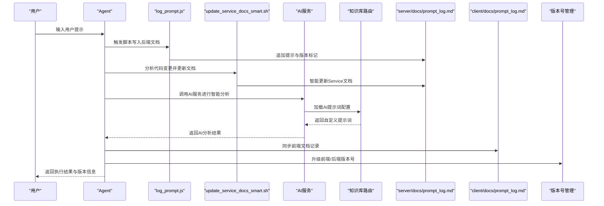
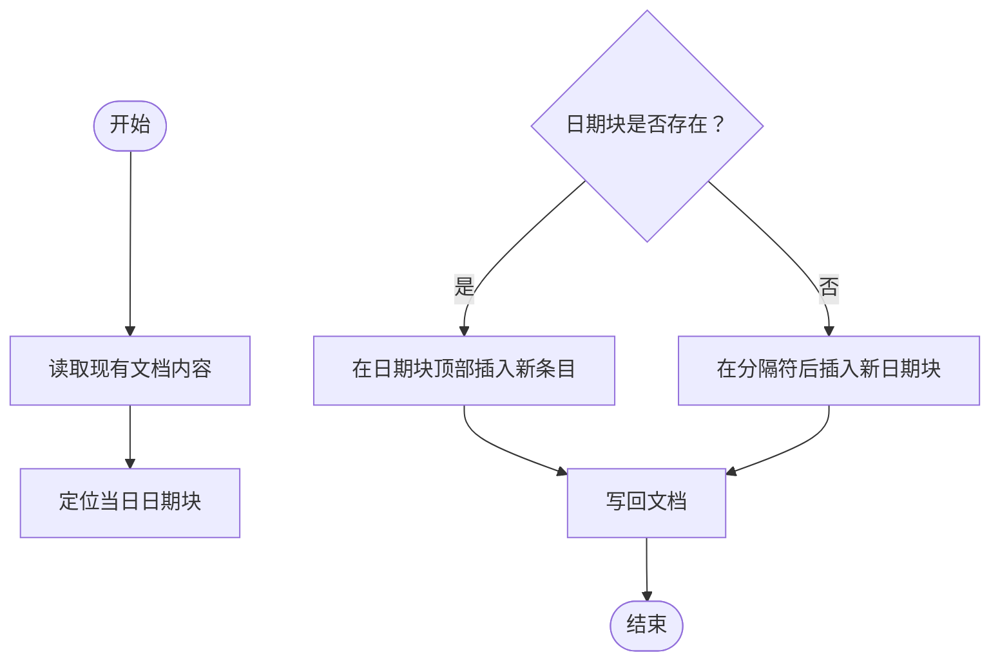
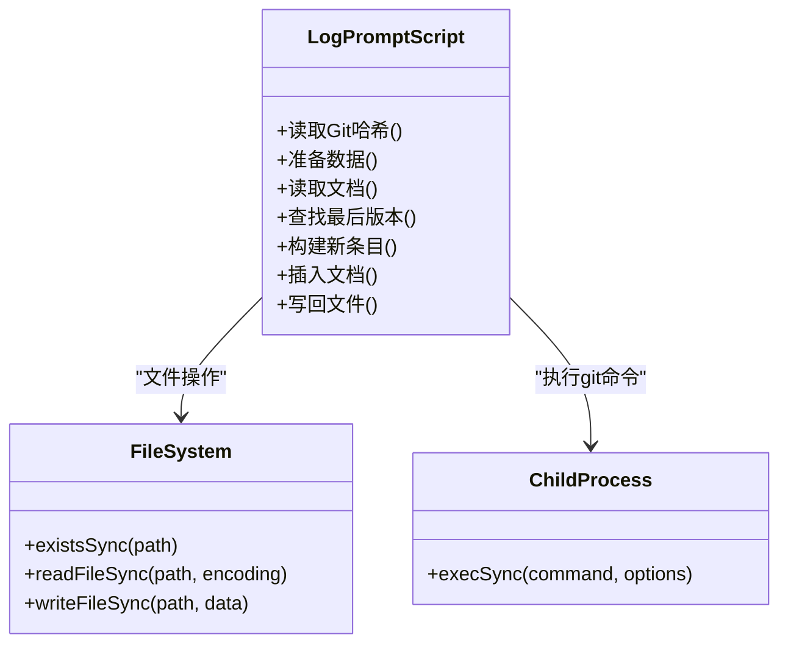
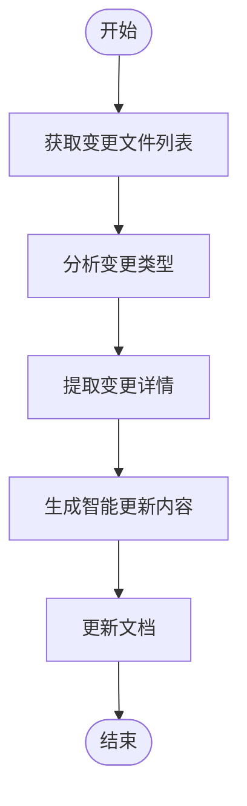
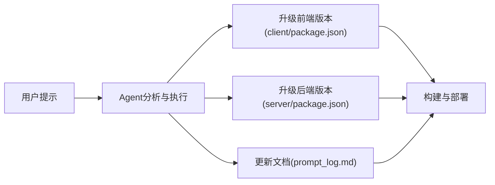
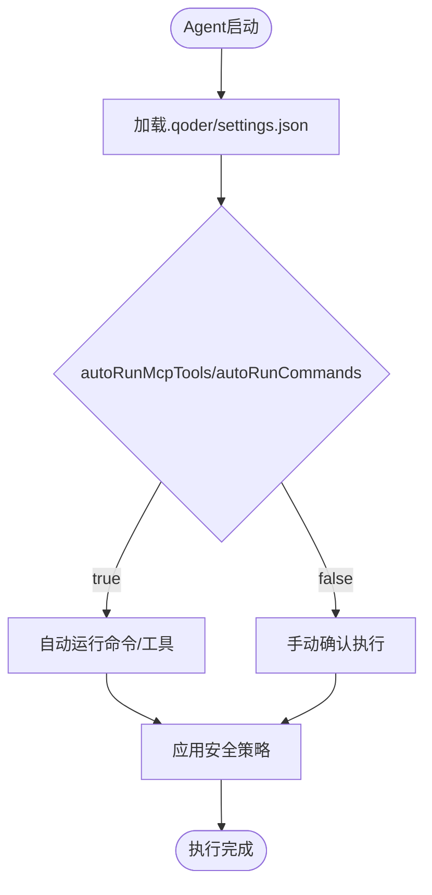
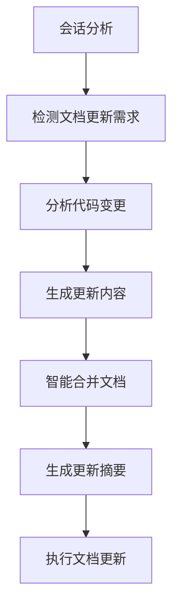
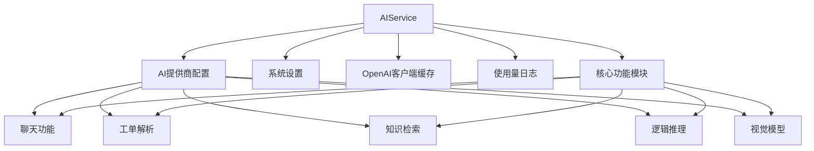
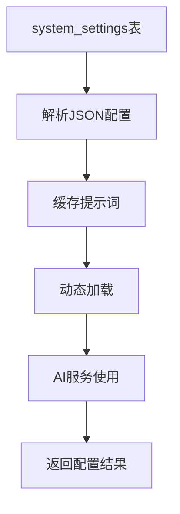
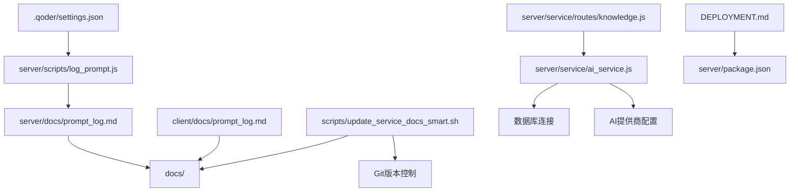

# 提示工程文档

<cite>
**本文档引用的文件**
- [docs/log_prompt.md](file://docs/log_prompt.md)
- [client/docs/prompt_log.md](file://client/docs/prompt_log.md)
- [server/docs/prompt_log.md](file://server/docs/prompt_log.md)
- [server/scripts/log_prompt.js](file://server/scripts/log_prompt.js)
- [server/service/ai_service.js](file://server/service/ai_service.js)
- [scripts/update_service_docs_smart.sh](file://scripts/update_service_docs_smart.sh)
- [.qoder/settings.json](file://.qoder/settings.json)
- [client/package.json](file://client/package.json)
- [server/package.json](file://server/package.json)
- [docs/README.md](file://docs/README.md)
- [DEPLOYMENT.md](file://DEPLOYMENT.md)
- [server/service/routes/knowledge.js](file://server/service/routes/knowledge.js)
</cite>

## 更新摘要
**所做更改**
- 新增AI服务集成章节，详细介绍智能文档更新机制
- 更新智能文档更新脚本分析，增加AI服务支持
- 新增Agent智能文档更新机制说明
- 更新架构总览，加入AI服务集成
- 新增智能文档更新流程图
- 新增知识库AI提示词管理机制
- 新增AI服务配置与权限控制说明

## 目录
1. [简介](#简介)
2. [项目结构](#项目结构)
3. [核心组件](#核心组件)
4. [架构总览](#架构总览)
5. [详细组件分析](#详细组件分析)
6. [智能文档更新机制](#智能文档更新机制)
7. [AI服务集成](#ai服务集成)
8. [知识库AI提示词管理](#知识库ai提示词管理)
9. [依赖关系分析](#依赖关系分析)
10. [性能考量](#性能考量)
11. [故障排除指南](#故障排除指南)
12. [结论](#结论)

## 简介
本文件系统性梳理 Longhorn 项目的提示工程实践，围绕 Prompt 日志记录、自动化文档更新、版本追踪与部署流水线展开。通过对仓库中 prompt_log.md、log_prompt.js 脚本、Qoder 安全配置与版本号管理的深入分析，总结出一套可复用的提示工程工作流，既服务于前端 Web 客户端（React/Vite），也覆盖后端 Node.js 服务端（Express/better-sqlite3），并延伸到 iOS 客户端的 UI 优化与文档维护。

**更新** 本版本增加了智能文档更新机制和AI服务集成，实现了基于代码变更的自动化文档更新和智能分析功能。新增了知识库AI提示词管理系统，支持动态配置和个性化定制。

## 项目结构
Longhorn 项目采用多模块组织方式，核心与提示工程相关的目录与文件如下：
- docs/：集中存放产品与技术文档，包含 prompt_log.md、README.md 等
- client/：前端 React 应用，包含 docs/ 子目录下的 prompt_log.md 与 package.json
- server/：后端 Node.js 应用，包含 docs/ 子目录下的 prompt_log.md、scripts/ 脚本与 package.json
- .qoder/：Agent 工作流与安全配置，包含 settings.json
- scripts/：智能文档更新脚本，包含 update_service_docs_smart.sh

```mermaid
graph TB
subgraph "文档层"
DOCS["docs/README.md"]
PROMPT_LOG["docs/prompt_log.md"]
CLIENT_PROMPT["client/docs/prompt_log.md"]
SERVER_PROMPT["server/docs/prompt_log.md"]
END
subgraph "前端客户端"
CLIENT_PKG["client/package.json"]
CLIENT_DOCS["client/docs/"]
END
subgraph "后端服务端"
SERVER_PKG["server/package.json"]
SERVER_DOCS["server/docs/"]
SCRIPTS["server/scripts/log_prompt.js"]
AI_SERVICE["server/service/ai_service.js"]
KNOWLEDGE_ROUTE["server/service/routes/knowledge.js"]
END
subgraph "Agent与安全"
QODER[".qoder/settings.json"]
SMART_SCRIPTS["scripts/update_service_docs_smart.sh"]
DEPLOYMENT["DEPLOYMENT.md"]
END
DOCS --> PROMPT_LOG
DOCS --> CLIENT_PROMPT
DOCS --> SERVER_PROMPT
CLIENT_DOCS --> CLIENT_PKG
SERVER_DOCS --> SERVER_PKG
SCRIPTS --> SERVER_DOCS
AI_SERVICE --> SERVER_DOCS
KNOWLEDGE_ROUTE --> AI_SERVICE
QODER --> SCRIPTS
SMART_SCRIPTS --> DOCS
DEPLOYMENT --> SERVER_PKG
```

**图表来源**
- [docs/README.md:1-19](file://docs/README.md#L1-L19)
- [docs/log_prompt.md:1-50](file://docs/log_prompt.md#L1-L50)
- [client/docs/prompt_log.md:1-50](file://client/docs/prompt_log.md#L1-L50)
- [server/docs/prompt_log.md:1-21](file://server/docs/prompt_log.md#L1-L21)
- [client/package.json:1-65](file://client/package.json#L1-L65)
- [server/package.json:1-40](file://server/package.json#L1-L40)
- [server/scripts/log_prompt.js:1-110](file://server/scripts/log_prompt.js#L1-L110)
- [server/service/ai_service.js:1-666](file://server/service/ai_service.js#L1-L666)
- [scripts/update_service_docs_smart.sh:1-292](file://scripts/update_service_docs_smart.sh#L1-L292)
- [.qoder/settings.json:1-35](file://.qoder/settings.json#L1-L35)
- [DEPLOYMENT.md:1-94](file://DEPLOYMENT.md#L1-L94)

**章节来源**
- [docs/README.md:1-19](file://docs/README.md#L1-L19)
- [docs/log_prompt.md:1-100](file://docs/log_prompt.md#L1-L100)
- [client/docs/prompt_log.md:1-194](file://client/docs/prompt_log.md#L1-L194)
- [server/docs/prompt_log.md:1-21](file://server/docs/prompt_log.md#L1-L21)
- [client/package.json:1-65](file://client/package.json#L1-L65)
- [server/package.json:1-40](file://server/package.json#L1-L40)
- [server/scripts/log_prompt.js:1-110](file://server/scripts/log_prompt.js#L1-L110)
- [server/service/ai_service.js:1-666](file://server/service/ai_service.js#L1-L666)
- [scripts/update_service_docs_smart.sh:1-292](file://scripts/update_service_docs_smart.sh#L1-L292)
- [.qoder/settings.json:1-35](file://.qoder/settings.json#L1-L35)
- [DEPLOYMENT.md:1-94](file://DEPLOYMENT.md#L1-L94)

## 核心组件
- Prompt 日志记录系统：通过 docs/prompt_log.md、client/docs/prompt_log.md、server/docs/prompt_log.md 三处文档记录用户提示与 Agent 回应，形成需求演进的历史轨迹。
- 自动化脚本：server/scripts/log_prompt.js 用于将用户提示写入后端文档，自动识别 Git 版本并标记"代码变更/无变更"。
- 智能文档更新机制：scripts/update_service_docs_smart.sh 基于代码变更自动分析并更新 Service PRD 和 API 文档。
- AI服务集成：server/service/ai_service.js 提供智能问答、工单解析、知识检索等AI能力。
- 知识库AI提示词管理：server/service/routes/knowledge.js 支持从数据库动态加载AI提示词配置。
- 版本号管理：前端 client/package.json 与后端 server/package.json 分别维护版本号，配合部署脚本实现平滑发布。
- Agent 安全配置：.qoder/settings.json 控制命令运行模式与权限，支持 autoRun 与 commandConfirmation 等策略。

**章节来源**
- [docs/log_prompt.md:1-200](file://docs/log_prompt.md#L1-L200)
- [client/docs/prompt_log.md:1-194](file://client/docs/prompt_log.md#L1-L194)
- [server/docs/prompt_log.md:1-21](file://server/docs/prompt_log.md#L1-L21)
- [server/scripts/log_prompt.js:1-110](file://server/scripts/log_prompt.js#L1-L110)
- [scripts/update_service_docs_smart.sh:1-292](file://scripts/update_service_docs_smart.sh#L1-L292)
- [server/service/ai_service.js:1-666](file://server/service/ai_service.js#L1-L666)
- [server/service/routes/knowledge.js:60-81](file://server/service/routes/knowledge.js#L60-L81)
- [client/package.json:1-65](file://client/package.json#L1-L65)
- [server/package.json:1-40](file://server/package.json#L1-L40)
- [.qoder/settings.json:1-35](file://.qoder/settings.json#L1-L35)

## 架构总览
提示工程工作流由"用户提示 → Agent 分析 → 自动化记录 → 智能文档更新 → AI服务集成 → 版本发布 → 文档同步"构成，贯穿前端、后端与 Agent 层。



**图表来源**
- [server/scripts/log_prompt.js:1-110](file://server/scripts/log_prompt.js#L1-L110)
- [scripts/update_service_docs_smart.sh:1-292](file://scripts/update_service_docs_smart.sh#L1-L292)
- [server/service/ai_service.js:1-666](file://server/service/ai_service.js#L1-L666)
- [server/service/routes/knowledge.js:60-81](file://server/service/routes/knowledge.js#L60-L81)
- [docs/log_prompt.md:1-100](file://docs/log_prompt.md#L1-L100)
- [client/docs/prompt_log.md:1-194](file://client/docs/prompt_log.md#L1-L194)
- [client/package.json:1-65](file://client/package.json#L1-L65)
- [server/package.json:1-40](file://server/package.json#L1-L40)

## 详细组件分析

### 组件A：Prompt 日志记录系统
- 文档结构：采用"日期 → 条目标题 → 用户提示 → Agent 回应 → 结果/版本标记"的标准化格式，便于追溯与审计。
- 多端协同：docs/prompt_log.md 作为总览，client/docs/prompt_log.md 与 server/docs/prompt_log.md 分别记录前端与后端侧的交互细节。
- 版本追踪：在条目末尾标注 Git 版本哈希与"代码变更/无变更"状态，确保发布可验证。



**图表来源**
- [server/scripts/log_prompt.js:26-105](file://server/scripts/log_prompt.js#L26-L105)
- [docs/log_prompt.md:1-100](file://docs/log_prompt.md#L1-L100)

**章节来源**
- [docs/log_prompt.md:1-200](file://docs/log_prompt.md#L1-L200)
- [client/docs/prompt_log.md:1-194](file://client/docs/prompt_log.md#L1-L194)
- [server/docs/prompt_log.md:1-21](file://server/docs/prompt_log.md#L1-L21)

### 组件B：自动化脚本 log_prompt.js
- 功能职责：接收用户提示参数，读取 Git 短哈希，构建新条目，插入到文档指定位置，写回文件。
- 插入策略：优先在当日日期块内顶部插入；若无日期块，则在文档分隔符后插入新的日期块。
- 版本标记：比较当前哈希与文档中最近一次版本标记，自动标注"代码变更/无变更"。



**图表来源**
- [server/scripts/log_prompt.js:1-110](file://server/scripts/log_prompt.js#L1-L110)

**章节来源**
- [server/scripts/log_prompt.js:1-110](file://server/scripts/log_prompt.js#L1-L110)

### 组件C：智能文档更新机制
- 智能分析：基于代码变更自动分析 Service PRD 和 API 文档的更新需求。
- 变更检测：自动检测路由文件、组件文件、服务文件等的变更情况。
- 内容提取：从代码变更中提取新增/修改的API接口和功能特性。
- 文档更新：智能生成文档更新内容，保留原有文档结构。



**图表来源**
- [scripts/update_service_docs_smart.sh:21-93](file://scripts/update_service_docs_smart.sh#L21-L93)

**章节来源**
- [scripts/update_service_docs_smart.sh:1-292](file://scripts/update_service_docs_smart.sh#L1-L292)

### 组件D：版本号管理与发布
- 前端版本：client/package.json 中 version 字段（如 12.3.174）用于标识客户端版本。
- 后端版本：server/package.json 中 version 字段（如 1.8.42）用于标识服务端版本。
- 发布流程：结合部署脚本与文档更新，确保版本号与实际发布状态一致。



**图表来源**
- [client/package.json:1-65](file://client/package.json#L1-L65)
- [server/package.json:1-40](file://server/package.json#L1-L40)
- [docs/log_prompt.md:1-100](file://docs/log_prompt.md#L1-L100)

**章节来源**
- [client/package.json:1-65](file://client/package.json#L1-L65)
- [server/package.json:1-40](file://server/package.json#L1-L40)
- [docs/log_prompt.md:1-100](file://docs/log_prompt.md#L1-L100)

### 组件E：Agent 安全与运行模式
- 命令白名单：.qoder/settings.json 中 allowedCommands 定义允许的命令集合。
- 运行模式：autoRunCommands 与 autoRunMcpTools 控制是否自动运行命令与 MCP 工具。
- 安全策略：commandConfirmation=false 允许免确认自动执行，需谨慎评估风险。



**图表来源**
- [.qoder/settings.json:1-35](file://.qoder/settings.json#L1-L35)

**章节来源**
- [.qoder/settings.json:1-35](file://.qoder/settings.json#L1-L35)

## 智能文档更新机制

### Agent智能文档更新
Agent具备三种文档更新模式，基于会话上下文智能分析和梳理：

- **PromptLog**：忠实记录所有用户prompt和agent简要输出，按时间倒序排列，确保完整的历史追溯。
- **DevLog**：基于会话分析技术，抽象梳理开发完成的事项、发生的事项，形成结构化的开发日志。
- **Backlog**：根据会话上下文分析和跟进待办事项状态，动态跟踪计划实施进度。

### 智能分析流程
Agent通过以下步骤实现智能文档更新：

1. **会话分析**：分析用户与Agent的对话上下文，识别文档更新需求
2. **变更检测**：扫描代码库变更，识别需要更新的文档类型
3. **内容生成**：基于变更分析生成相应的文档更新内容
4. **智能合并**：将新内容与现有文档结构智能合并，保持文档完整性



**章节来源**
- [docs/log_prompt.md:1480-1545](file://docs/log_prompt.md#L1480-L1545)

## AI服务集成

### AIService核心功能
server/service/ai_service.js 提供了完整的AI服务集成，支持多种智能功能：

- **智能问答**：基于Bokeh助手的人工智能聊天功能
- **工单解析**：自动解析原始文本中的工单信息
- **知识检索**：基于用户查询的知识库检索和推荐
- **权限控制**：支持严格工作模式和数据源访问控制
- **多模型支持**：支持多种AI提供商和模型配置

### AI服务架构


**图表来源**
- [server/service/ai_service.js:1-666](file://server/service/ai_service.js#L1-L666)

### AI功能详解

#### 聊天功能（Bokeh Assistant）
- **历史感知**：支持上下文对话和历史工单引用
- **多数据源**：整合工单系统和知识库信息
- **严格模式**：支持工作模式，拒绝无关闲聊
- **权限控制**：基于用户角色的数据访问控制

#### 工单解析功能
- **结构化提取**：从原始文本中提取标准工单字段
- **产品识别**：自动识别Kinefinity产品型号
- **服务类型分类**：智能判断服务类型和紧急程度
- **JSON格式输出**：保证数据结构的一致性和可处理性

#### 知识检索功能
- **全文搜索**：支持中文和英文的混合搜索
- **语义相似度**：基于FTS5的高级搜索算法
- **权限过滤**：根据用户角色过滤可见内容
- **结果增强**：提供相关性和来源信息

**章节来源**
- [server/service/ai_service.js:1-666](file://server/service/ai_service.js#L1-L666)

## 知识库AI提示词管理

### 动态提示词加载机制
server/service/routes/knowledge.js 实现了从数据库动态加载AI提示词的功能：

- **配置存储**：AI提示词存储在 system_settings 表的 ai_prompts 字段中
- **实时加载**：运行时从数据库读取并解析JSON配置
- **默认回退**：当数据库配置不可用时使用默认提示词
- **缓存机制**：支持提示词的动态更新和即时生效

### 提示词应用场景
- **工单解析**：自定义工单提取规则和字段映射
- **聊天助手**：个性化AI助手的角色设定和行为规范
- **知识检索**：优化搜索策略和结果排序规则
- **内容生成**：文章排版优化和摘要生成的指导原则



**图表来源**
- [server/service/routes/knowledge.js:67-81](file://server/service/routes/knowledge.js#L67-L81)

**章节来源**
- [server/service/routes/knowledge.js:60-81](file://server/service/routes/knowledge.js#L60-L81)

## 依赖关系分析
- 文档依赖：server/scripts/log_prompt.js 依赖 server/docs/prompt_log.md；client/docs/prompt_log.md 与 server/docs/prompt_log.md 共同依赖 docs/log_prompt.md 的总体结构。
- 智能更新依赖：scripts/update_service_docs_smart.sh 依赖 Git 提交历史和代码变更分析。
- AI服务依赖：server/service/ai_service.js 依赖数据库连接和AI提供商配置。
- 知识库集成：server/service/routes/knowledge.js 依赖 AIService 进行AI功能扩展。
- 版本依赖：前端与后端版本号相互独立，但通过发布流程保持一致。
- Agent 依赖：.qoder/settings.json 影响脚本执行的安全与自动化行为。



**图表来源**
- [server/scripts/log_prompt.js:1-110](file://server/scripts/log_prompt.js#L1-L110)
- [scripts/update_service_docs_smart.sh:1-292](file://scripts/update_service_docs_smart.sh#L1-L292)
- [server/service/ai_service.js:1-666](file://server/service/ai_service.js#L1-L666)
- [server/service/routes/knowledge.js:60-81](file://server/service/routes/knowledge.js#L60-L81)
- [server/docs/prompt_log.md:1-21](file://server/docs/prompt_log.md#L1-L21)
- [client/docs/prompt_log.md:1-194](file://client/docs/prompt_log.md#L1-L194)
- [docs/log_prompt.md:1-100](file://docs/log_prompt.md#L1-L100)
- [.qoder/settings.json:1-35](file://.qoder/settings.json#L1-L35)
- [DEPLOYMENT.md:1-94](file://DEPLOYMENT.md#L1-L94)

**章节来源**
- [server/scripts/log_prompt.js:1-110](file://server/scripts/log_prompt.js#L1-L110)
- [scripts/update_service_docs_smart.sh:1-292](file://scripts/update_service_docs_smart.sh#L1-L292)
- [server/service/ai_service.js:1-666](file://server/service/ai_service.js#L1-L666)
- [server/service/routes/knowledge.js:60-81](file://server/service/routes/knowledge.js#L60-L81)
- [server/docs/prompt_log.md:1-21](file://server/docs/prompt_log.md#L1-L21)
- [client/docs/prompt_log.md:1-194](file://client/docs/prompt_log.md#L1-L194)
- [docs/log_prompt.md:1-100](file://docs/log_prompt.md#L1-L100)
- [.qoder/settings.json:1-35](file://.qoder/settings.json#L1-L35)
- [DEPLOYMENT.md:1-94](file://DEPLOYMENT.md#L1-L94)

## 性能考量
- 文档写入性能：log_prompt.js 采用同步文件读写，适合小规模日志追加；若日志量增长，建议引入异步写入与缓冲队列。
- 智能更新性能：update_service_docs_smart.sh 依赖Git命令执行，建议在CI环境中使用缓存策略减少重复分析。
- AI服务性能：AIService使用客户端缓存机制，支持多提供商配置，建议合理设置超时和重试参数。
- 提示词加载性能：知识库AI提示词采用数据库实时加载，建议实现缓存机制避免频繁查询。
- 版本号一致性：前端与后端版本号独立管理，建议在 CI 中统一版本号生成与校验，避免发布不一致。
- Agent 自动化：autoRunMcpTools 与 autoRunCommands 提升效率，但需配合严格的 allowedCommands 白名单与审计日志。

## 故障排除指南
- 文档未更新：检查 server/scripts/log_prompt.js 是否正确写入 server/docs/prompt_log.md；确认 Git 环境可用以获取哈希。
- 智能更新失败：检查 scripts/update_service_docs_smart.sh 的Git权限和文件访问权限。
- AI服务错误：验证AI提供商配置、API密钥和网络连接；检查数据库连接和FTS5索引状态。
- 提示词加载失败：检查 system_settings 表中 ai_prompts 字段的JSON格式；确认数据库连接正常。
- 版本号不一致：核对 client/package.json 与 server/package.json 的版本字段，确保发布前已同步升级。
- Agent 自动执行失败：检查 .qoder/settings.json 中 commandConfirmation 与 allowedCommands 配置，必要时开启手动确认模式。

**章节来源**
- [server/scripts/log_prompt.js:1-110](file://server/scripts/log_prompt.js#L1-L110)
- [scripts/update_service_docs_smart.sh:1-292](file://scripts/update_service_docs_smart.sh#L1-L292)
- [server/service/ai_service.js:1-666](file://server/service/ai_service.js#L1-L666)
- [server/service/routes/knowledge.js:60-81](file://server/service/routes/knowledge.js#L60-L81)
- [client/package.json:1-65](file://client/package.json#L1-L65)
- [server/package.json:1-40](file://server/package.json#L1-L40)
- [.qoder/settings.json:1-35](file://.qoder/settings.json#L1-L35)

## 结论
Longhorn 项目的提示工程实践通过标准化的 Prompt 日志记录、自动化脚本与版本号管理，形成了从需求收集到发布验证的闭环。新增的智能文档更新机制和AI服务集成为项目带来了更强大的自动化能力，支持基于代码变更的智能文档更新和多模态AI服务集成。

**更新** 本版本的重大更新包括智能文档更新机制的实施、AI服务集成的完善、知识库AI提示词管理系统的建立，以及Agent安全配置的优化。这些改进显著提升了项目的自动化水平和智能化程度，为后续的持续集成和智能运维奠定了坚实基础。

建议在未来持续优化脚本的异步写入、加强 Agent 的安全审计、实现AI提示词的动态缓存机制，并在 CI 中统一版本号策略，以进一步提升工程效率与可维护性。