# 维修报告编辑器组件

<cite>
**本文档引用的文件**
- [RepairReportEditor.tsx](file://client/src/components/Workspace/RepairReportEditor.tsx)
- [rma-documents.js](file://server/service/routes/rma-documents.js)
- [018_add_op_repair_report_type.sql](file://server/migrations/018_add_op_repair_report_type.sql)
</cite>

## 目录
1. [简介](#简介)
2. [项目结构](#项目结构)
3. [核心组件](#核心组件)
4. [架构概览](#架构概览)
5. [详细组件分析](#详细组件分析)
6. [依赖关系分析](#依赖关系分析)
7. [性能考虑](#性能考虑)
8. [故障排除指南](#故障排除指南)
9. [结论](#结论)

## 简介

维修报告编辑器组件是长horn服务管理系统中的核心功能模块，用于创建、编辑和管理RMA（退货授权）维修报告文档。该组件提供了完整的维修报告生命周期管理，包括数据录入、实时计算、状态管理和PDF导出等功能。

该组件支持两种工作模式：
- **MS模式**：市场/服务部门专用，提供完整的编辑功能
- **OP模式**：运营节点模式，自动保存并简化界面

## 项目结构

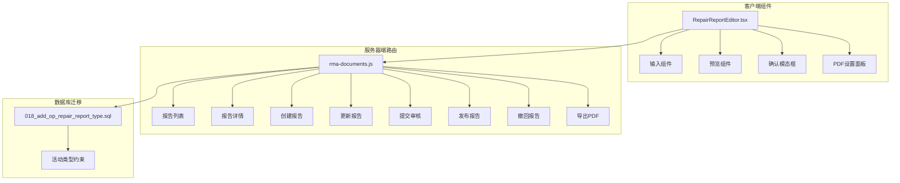

**图表来源**
- [RepairReportEditor.tsx:1-1786](file://client/src/components/Workspace/RepairReportEditor.tsx#L1-L1786)
- [rma-documents.js:1-1507](file://server/service/routes/rma-documents.js#L1-L1507)

**章节来源**
- [RepairReportEditor.tsx:1-1786](file://client/src/components/Workspace/RepairReportEditor.tsx#L1-L1786)
- [rma-documents.js:1-1507](file://server/service/routes/rma-documents.js#L1-L1507)

## 核心组件

### 数据模型架构

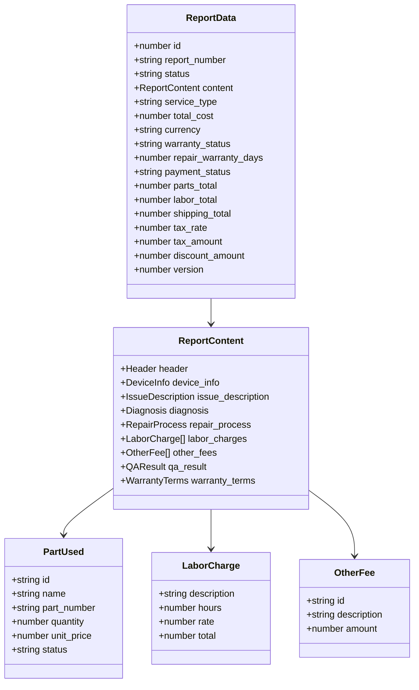

**图表来源**
- [RepairReportEditor.tsx:79-104](file://client/src/components/Workspace/RepairReportEditor.tsx#L79-L104)
- [RepairReportEditor.tsx:19-39](file://client/src/components/Workspace/RepairReportEditor.tsx#L19-L39)

### 状态管理流程

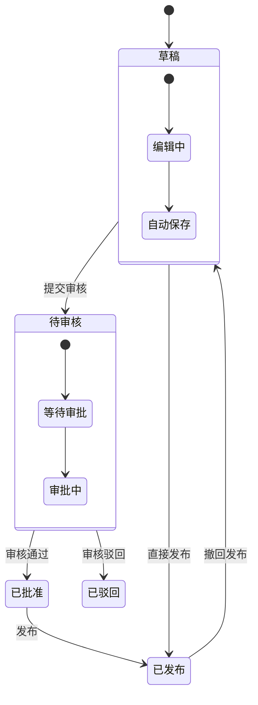

**图表来源**
- [RepairReportEditor.tsx:168-184](file://client/src/components/Workspace/RepairReportEditor.tsx#L168-L184)
- [rma-documents.js:1057-1163](file://server/service/routes/rma-documents.js#L1057-L1163)

**章节来源**
- [RepairReportEditor.tsx:79-104](file://client/src/components/Workspace/RepairReportEditor.tsx#L79-L104)
- [RepairReportEditor.tsx:168-184](file://client/src/components/Workspace/RepairReportEditor.tsx#L168-L184)

## 架构概览

### 前端架构设计

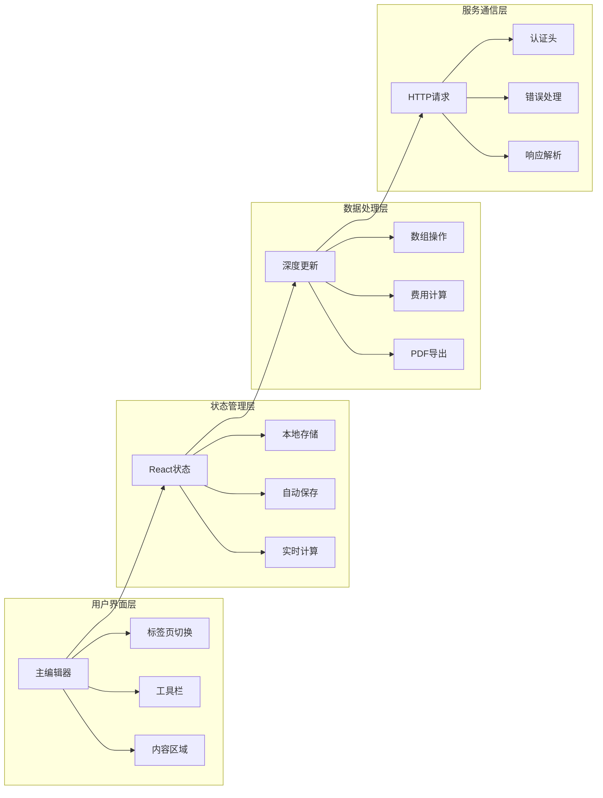

**图表来源**
- [RepairReportEditor.tsx:144-146](file://client/src/components/Workspace/RepairReportEditor.tsx#L144-L146)
- [RepairReportEditor.tsx:201-210](file://client/src/components/Workspace/RepairReportEditor.tsx#L201-L210)

### 后端API架构

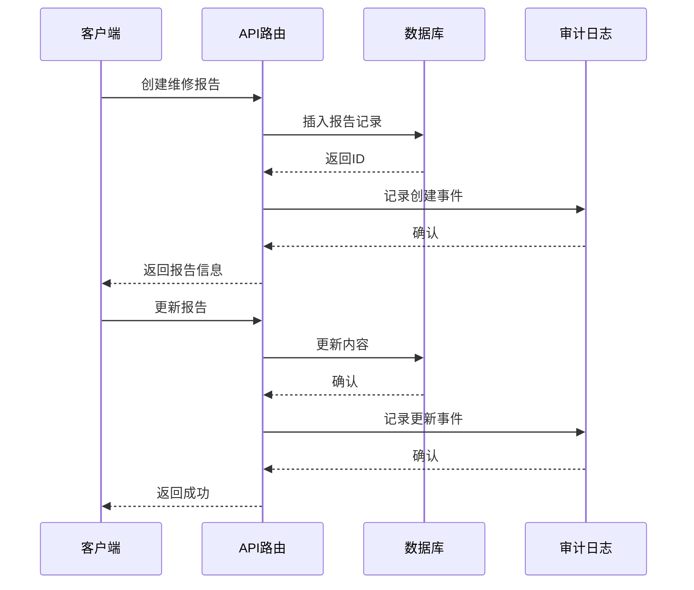

**图表来源**
- [rma-documents.js:906-967](file://server/service/routes/rma-documents.js#L906-L967)
- [rma-documents.js:969-1055](file://server/service/routes/rma-documents.js#L969-L1055)

**章节来源**
- [RepairReportEditor.tsx:144-146](file://client/src/components/Workspace/RepairReportEditor.tsx#L144-L146)
- [rma-documents.js:906-1055](file://server/service/routes/rma-documents.js#L906-L1055)

## 详细组件分析

### 主要功能模块

#### 1. 数据初始化与同步

组件在打开时会执行以下初始化流程：

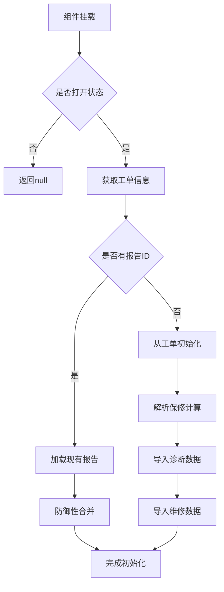

**图表来源**
- [RepairReportEditor.tsx:223-234](file://client/src/components/Workspace/RepairReportEditor.tsx#L223-L234)
- [RepairReportEditor.tsx:236-268](file://client/src/components/Workspace/RepairReportEditor.tsx#L236-L268)
- [RepairReportEditor.tsx:270-411](file://client/src/components/Workspace/RepairReportEditor.tsx#L270-L411)

#### 2. 实时费用计算系统

组件实现了复杂的费用计算逻辑：

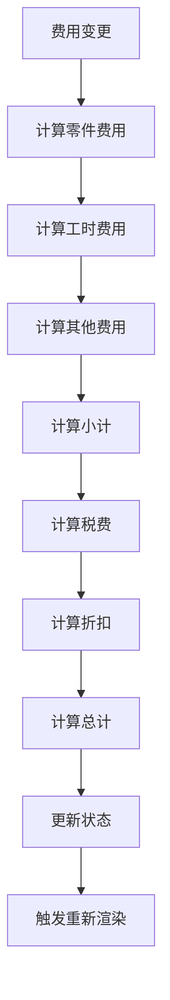

**图表来源**
- [RepairReportEditor.tsx:469-497](file://client/src/components/Workspace/RepairReportEditor.tsx#L469-L497)
- [RepairReportEditor.tsx:500-502](file://client/src/components/Workspace/RepairReportEditor.tsx#L500-L502)

#### 3. 自动保存机制

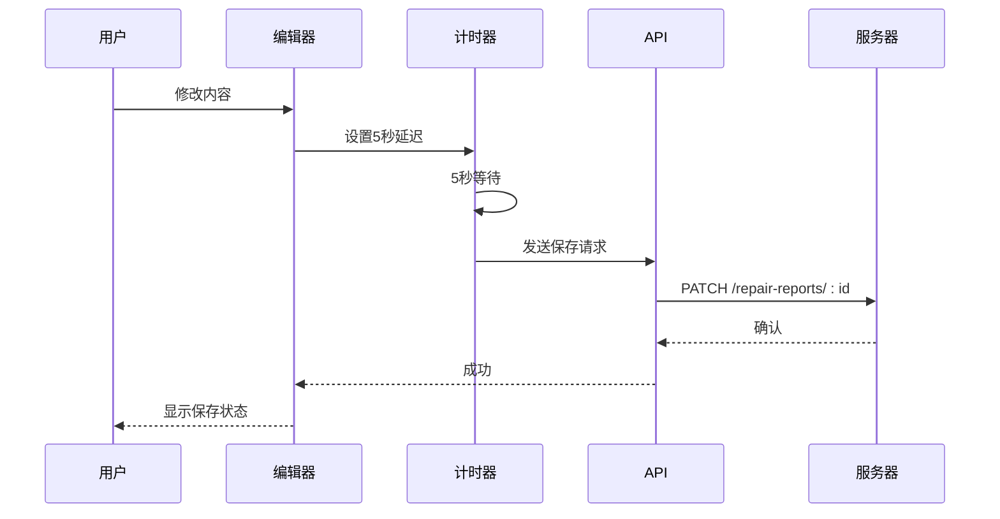

**图表来源**
- [RepairReportEditor.tsx:201-210](file://client/src/components/Workspace/RepairReportEditor.tsx#L201-L210)
- [RepairReportEditor.tsx:548-597](file://client/src/components/Workspace/RepairReportEditor.tsx#L548-L597)

**章节来源**
- [RepairReportEditor.tsx:223-411](file://client/src/components/Workspace/RepairReportEditor.tsx#L223-L411)
- [RepairReportEditor.tsx:469-597](file://client/src/components/Workspace/RepairReportEditor.tsx#L469-L597)

### 辅助组件系统

#### 输入组件体系

组件包含多个专门的输入组件：

| 组件类型 | 功能描述 | 使用场景 |
|---------|----------|----------|
| Section | 章节容器 | 组织内容区块 |
| Input | 文本输入框 | 单行文本输入 |
| TextArea | 多行文本域 | 长文本输入 |
| ArrayField | 数组字段 | 动态列表管理 |
| FeeSubSection | 费用子段 | 费用明细管理 |

#### 状态徽章组件

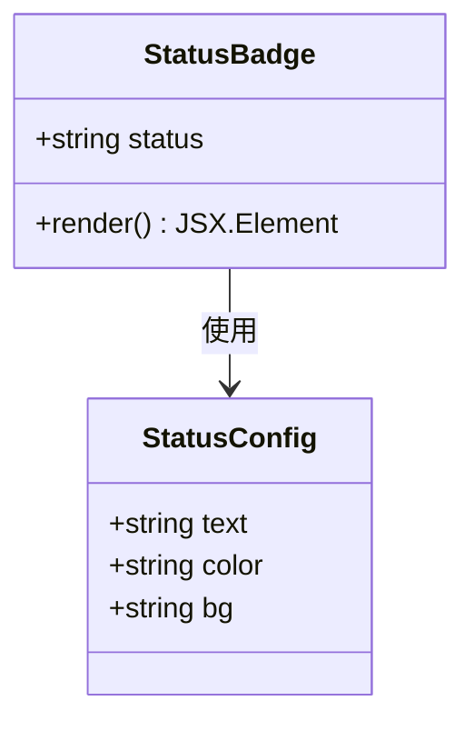

**图表来源**
- [RepairReportEditor.tsx:1473-1487](file://client/src/components/Workspace/RepairReportEditor.tsx#L1473-L1487)

**章节来源**
- [RepairReportEditor.tsx:1407-1471](file://client/src/components/Workspace/RepairReportEditor.tsx#L1407-L1471)
- [RepairReportEditor.tsx:1473-1487](file://client/src/components/Workspace/RepairReportEditor.tsx#L1473-L1487)

## 依赖关系分析

### 前端依赖关系

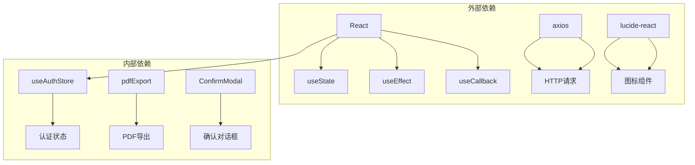

**图表来源**
- [RepairReportEditor.tsx:1-8](file://client/src/components/Workspace/RepairReportEditor.tsx#L1-L8)

### 后端依赖关系

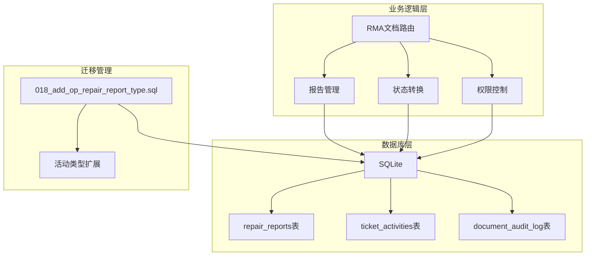

**图表来源**
- [rma-documents.js:1-57](file://server/service/routes/rma-documents.js#L1-L57)
- [018_add_op_repair_report_type.sql:1-56](file://server/migrations/018_add_op_repair_report_type.sql#L1-L56)

**章节来源**
- [RepairReportEditor.tsx:1-8](file://client/src/components/Workspace/RepairReportEditor.tsx#L1-L8)
- [rma-documents.js:1-57](file://server/service/routes/rma-documents.js#L1-L57)

## 性能考虑

### 内存优化策略

1. **深度更新优化**
   - 使用JSON深拷贝避免直接修改引用
   - 只更新必要的状态字段

2. **计算缓存**
   - 费用计算使用useCallback缓存
   - 避免不必要的重新计算

3. **自动保存节流**
   - 5秒防抖延迟减少API调用频率

### 渲染优化

1. **条件渲染**
   - 根据状态动态显示/隐藏组件
   - OP模式下简化界面元素

2. **虚拟滚动**
   - 对于大量数据采用分页或虚拟化

## 故障排除指南

### 常见问题诊断

#### 数据加载失败
- 检查网络连接状态
- 验证认证令牌有效性
- 确认API端点可用性

#### 状态更新异常
- 检查状态转换规则
- 验证权限检查逻辑
- 确认数据库事务完整性

#### PDF导出问题
- 验证预览元素存在
- 检查PDF设置配置
- 确认浏览器兼容性

**章节来源**
- [RepairReportEditor.tsx:262-267](file://client/src/components/Workspace/RepairReportEditor.tsx#L262-L267)
- [RepairReportEditor.tsx:588-596](file://client/src/components/Workspace/RepairReportEditor.tsx#L588-L596)

## 结论

维修报告编辑器组件是一个功能完整、架构清晰的服务管理工具。其主要特点包括：

1. **完整的文档生命周期管理**：从草稿到发布的全流程支持
2. **智能的数据初始化**：自动从工单和诊断活动中提取相关信息
3. **实时的费用计算**：动态计算税费和总金额
4. **灵活的工作模式**：支持MS和OP两种不同的操作模式
5. **强大的权限控制**：基于角色和部门的访问控制
6. **完善的审计追踪**：完整的操作日志记录

该组件为长horn系统的RMA服务提供了坚实的技术基础，能够有效提升服务效率和质量管理水平。