# 维修报告编辑器组件

<cite>
**本文档引用的文件**
- [RepairReportEditor.tsx](file://client/src/components/Workspace/RepairReportEditor.tsx)
- [PartsSelector.tsx](file://client/src/components/Workspace/PartsSelector.tsx)
- [OpRepairReportEditor.tsx](file://client/src/components/Workspace/OpRepairReportEditor.tsx)
- [parts-master.js](file://server/service/routes/parts-master.js)
- [parts.js](file://server/service/routes/parts.js)
- [rma-documents.js](file://server/service/routes/rma-documents.js)
- [bokeh.js](file://server/service/routes/bokeh.js)
- [pdfExport.ts](file://client/src/utils/pdfExport.ts)
- [030_pi_and_report_tables.sql](file://server/service/migrations/030_pi_and_report_tables.sql)
- [034_add_report_translations.sql](file://server/service/migrations/034_add_report_translations.sql)
- [048_add_report_prepared_by.sql](file://server/service/migrations/048_add_report_prepared_by.sql)
</cite>

## 更新摘要
**变更内容**
- 重大架构改进：维修报告编辑器组件从约350行扩展到2925行，新增了AI智能翻译系统、多语言支持、PDF导出增强、费用计算系统和权限控制功能
- 新增AI智能翻译系统，支持英文、日文、德文的实时翻译和缓存
- 增强的费用计算系统，支持零件、工时、其他费用的详细管理
- 改进的报告预览功能，支持多语言实时预览
- 新增PDF导出设置面板，支持A4/Letter纸张和横纵向设置
- 完善的权限控制系统，支持MS模式和OP模式的不同操作权限
- 新增翻译缓存机制，支持数据库级翻译缓存和使用统计
- 新增翻译审计日志，支持完整的翻译操作追踪
- 新增翻译状态管理，支持AI翻译和手动编辑状态区分
- 增强版本控制功能，支持文档版本管理和审计追踪
- 改进的PDF导出功能，支持自定义纸张尺寸和页面方向
- **新增配件选择工作流**：集成PartsSelector组件，支持从配件库选择配件、BOM推荐和手动添加非标准配件
- **改进的数据绑定**：增强的配件数据绑定和验证机制
- **新增配件管理功能**：支持配件搜索、BOM推荐、手动添加和来源类型管理

## 目录
1. [简介](#简介)
2. [项目结构](#项目结构)
3. [核心组件](#核心组件)
4. [架构概览](#架构概览)
5. [详细组件分析](#详细组件分析)
6. [新增功能特性](#新增功能特性)
7. [依赖关系分析](#依赖关系分析)
8. [性能考虑](#性能考虑)
9. [故障排除指南](#故障排除指南)
10. [结论](#结论)

## 简介

维修报告编辑器组件是长horn服务管理系统中的核心功能模块，用于创建、编辑和管理RMA（退货授权）维修报告文档。该组件提供了完整的维修报告生命周期管理，包括数据录入、实时计算、状态管理和PDF导出等功能。

**更新** 维修报告编辑器组件经过大规模重构和增强，从原来的约350行扩展到2925行，新增了多项编辑能力和用户体验改进。新的组件提供了更直观的Textarea输入系统、增强的AI翻译功能、改进的费用计算系统、更完善的权限控制和**全新的配件选择工作流**。

该组件支持两种工作模式：
- **MS模式**：市场/服务部门专用，提供完整的编辑功能和编制人选择
- **OP模式**：运营节点模式，自动保存并简化界面，专注于核心维修记录编辑

**新增功能**：组件现在集成了完整的配件选择系统，支持从配件库选择配件、BOM推荐和手动添加非标准配件，为维修报告提供了更完整的数据管理能力。

## 项目结构

```mermaid
graph TB
subgraph "客户端组件"
A[RepairReportEditor.tsx] --> B[Textarea输入系统]
A --> C[预览组件]
A --> D[确认模态框]
A --> E[PDF设置面板]
A --> F[AI翻译面板]
A --> G[翻译缓存系统]
A --> H[多语言预览]
A --> I[日期选择器集成]
A --> J[表单验证系统]
A --> K[费用计算系统]
A --> L[智能重翻译确认]
A --> M[翻译状态跟踪]
A --> N[PartsSelector配件选择器]
N --> O[配件搜索]
N --> P[BOM推荐]
N --> Q[手动添加]
N --> R[来源类型管理]
end
subgraph "运营组件"
S[OpRepairReportEditor.tsx] --> T[Textarea输入系统]
S --> U[自动保存机制]
S --> V[更正功能]
S --> W[权限控制系统]
end
subgraph "服务器端路由"
X[parts-master.js] --> Y[配件主数据管理]
X --> Z[BOM推荐]
X --> AA[分类管理]
BB[rma-documents.js] --> CC[报告管理]
BB --> DD[状态转换]
BB --> EE[权限控制]
BB --> FF[审计日志]
BB --> GG[翻译API]
HH[bokeh.js] --> II[AI聊天服务]
end
subgraph "数据库迁移"
JJ[030_pi_and_report_tables.sql] --> KK[报告表结构]
JJ --> LL[工作流支持]
MM[034_add_report_translations.sql] --> NN[翻译缓存表]
MM --> OO[翻译审计日志]
PP[048_add_report_prepared_by.sql] --> QQ[用户识别字段]
RR[parts-master.js] --> SS[配件主数据表]
RR --> TT[SKU价格表]
RR --> UU[产品型号关联表]
end
S --> BB
BB --> JJ
BB --> MM
BB --> PP
BB --> HH
N --> RR
RR --> JJ
RR --> MM
RR --> PP
```

**图表来源**
- [RepairReportEditor.tsx:1-2925](file://client/src/components/Workspace/RepairReportEditor.tsx#L1-L2925)
- [PartsSelector.tsx:1-754](file://client/src/components/Workspace/PartsSelector.tsx#L1-L754)
- [OpRepairReportEditor.tsx:1-778](file://client/src/components/Workspace/OpRepairReportEditor.tsx#L1-L778)
- [parts-master.js:1-621](file://server/service/routes/parts-master.js#L1-L621)
- [rma-documents.js:1-1690](file://server/service/routes/rma-documents.js#L1-L1690)

**章节来源**
- [RepairReportEditor.tsx:1-2925](file://client/src/components/Workspace/RepairReportEditor.tsx#L1-L2925)
- [PartsSelector.tsx:1-754](file://client/src/components/Workspace/PartsSelector.tsx#L1-L754)
- [OpRepairReportEditor.tsx:1-778](file://client/src/components/Workspace/OpRepairReportEditor.tsx#L1-L778)
- [parts-master.js:1-621](file://server/service/routes/parts-master.js#L1-L621)
- [rma-documents.js:1-1690](file://server/service/routes/rma-documents.js#L1-L1690)

## 核心组件

### 数据模型架构

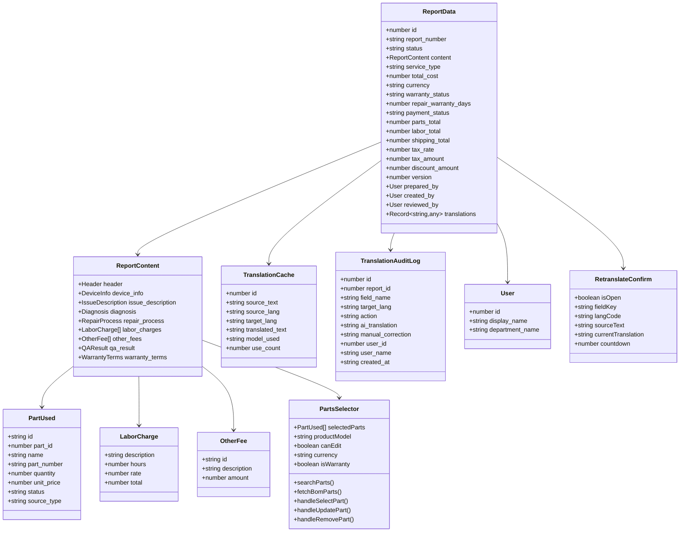

**图表来源**
- [RepairReportEditor.tsx:77-110](file://client/src/components/Workspace/RepairReportEditor.tsx#L77-L110)
- [RepairReportEditor.tsx:39-75](file://client/src/components/Workspace/RepairReportEditor.tsx#L39-L75)
- [PartsSelector.tsx:12-21](file://client/src/components/Workspace/PartsSelector.tsx#L12-L21)
- [034_add_report_translations.sql:13-48](file://server/service/migrations/034_add_report_translations.sql#L13-L48)

### 状态管理流程

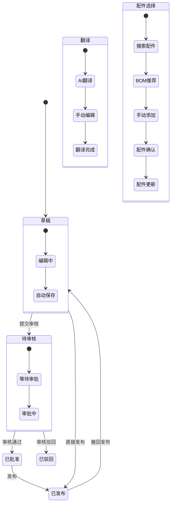

**图表来源**
- [RepairReportEditor.tsx:179-195](file://client/src/components/Workspace/RepairReportEditor.tsx#L179-L195)
- [PartsSelector.tsx:175-202](file://client/src/components/Workspace/PartsSelector.tsx#L175-L202)
- [rma-documents.js:52-57](file://server/service/routes/rma-documents.js#L52-L57)

**章节来源**
- [RepairReportEditor.tsx:77-110](file://client/src/components/Workspace/RepairReportEditor.tsx#L77-L110)
- [RepairReportEditor.tsx:179-195](file://client/src/components/Workspace/RepairReportEditor.tsx#L179-L195)
- [PartsSelector.tsx:175-202](file://client/src/components/Workspace/PartsSelector.tsx#L175-L202)

## 架构概览

### 前端架构设计

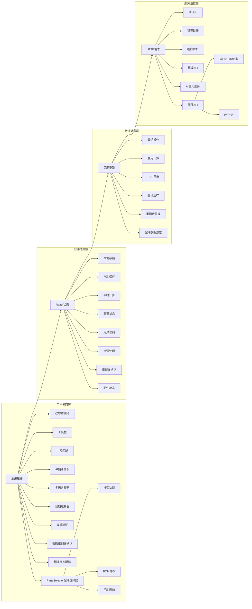

**图表来源**
- [RepairReportEditor.tsx:208-223](file://client/src/components/Workspace/RepairReportEditor.tsx#L208-L223)
- [RepairReportEditor.tsx:285-346](file://client/src/components/Workspace/RepairReportEditor.tsx#L285-L346)
- [PartsSelector.tsx:52-60](file://client/src/components/Workspace/PartsSelector.tsx#L52-L60)

### 后端API架构

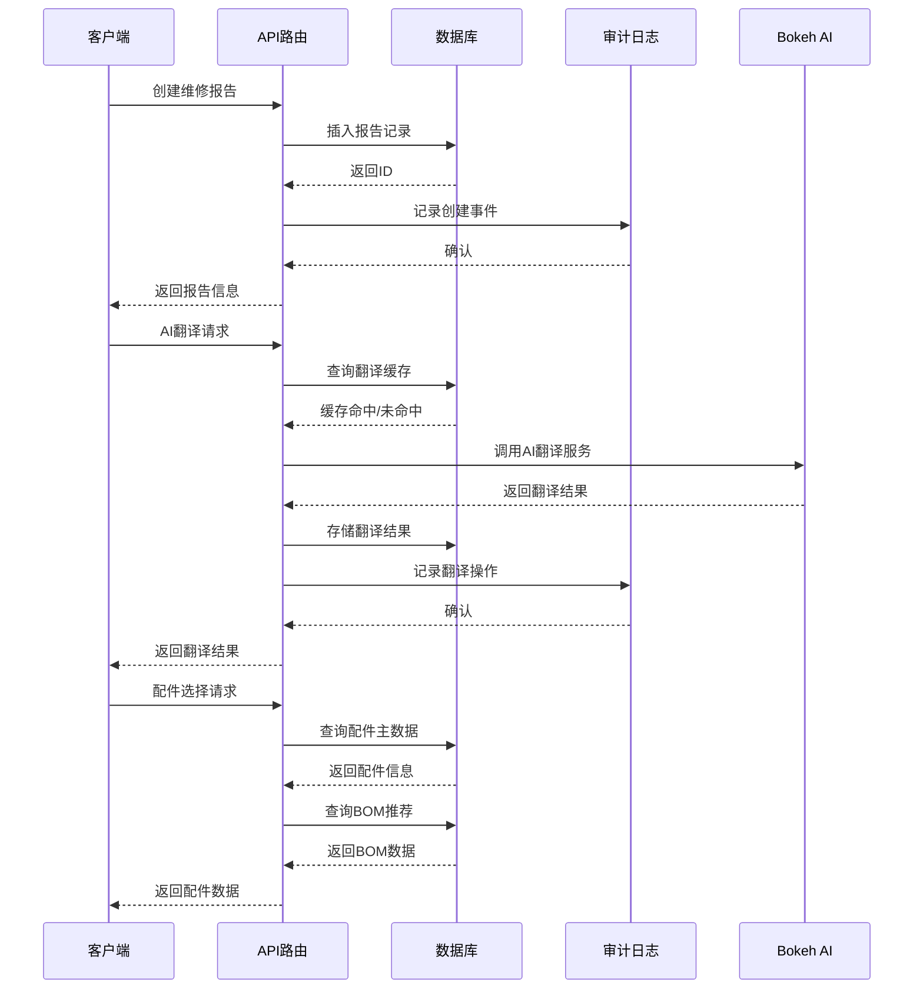

**图表来源**
- [rma-documents.js:38-67](file://server/service/routes/rma-documents.js#L38-L67)
- [parts-master.js:28-128](file://server/service/routes/parts-master.js#L28-L128)
- [034_add_report_translations.sql:13-48](file://server/service/migrations/034_add_report_translations.sql#L13-L48)

**章节来源**
- [RepairReportEditor.tsx:208-346](file://client/src/components/Workspace/RepairReportEditor.tsx#L208-L346)
- [PartsSelector.tsx:52-60](file://client/src/components/Workspace/PartsSelector.tsx#L52-L60)
- [rma-documents.js:38-67](file://server/service/routes/rma-documents.js#L38-L67)
- [parts-master.js:28-128](file://server/service/routes/parts-master.js#L28-L128)

## 详细组件分析

### 主要功能模块

#### 1. 数据初始化与同步

组件在打开时会执行以下初始化流程：

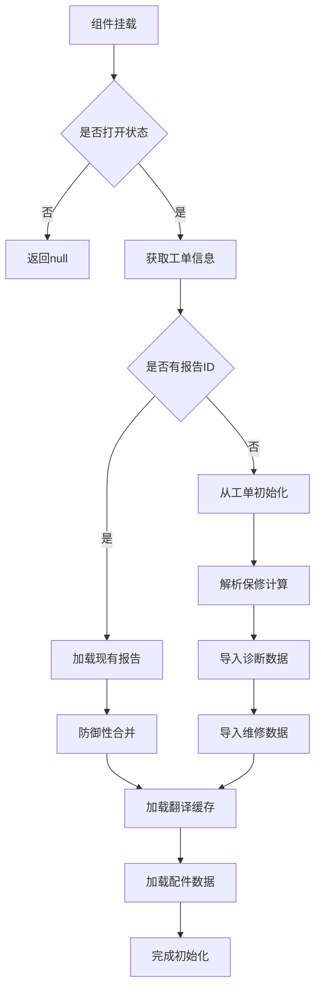

**图表来源**
- [RepairReportEditor.tsx:413-461](file://client/src/components/Workspace/RepairReportEditor.tsx#L413-L461)
- [RepairReportEditor.tsx:463-664](file://client/src/components/Workspace/RepairReportEditor.tsx#L463-L664)
- [RepairReportEditor.tsx:423-433](file://client/src/components/Workspace/RepairReportEditor.tsx#L423-L433)

#### 2. 实时费用计算系统

组件实现了复杂的费用计算逻辑：

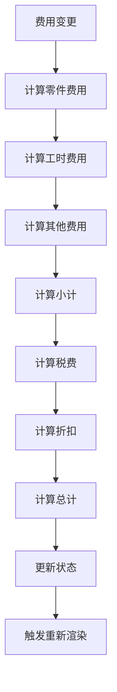

**图表来源**
- [RepairReportEditor.tsx:722-750](file://client/src/components/Workspace/RepairReportEditor.tsx#L722-L750)
- [RepairReportEditor.tsx:752-755](file://client/src/components/Workspace/RepairReportEditor.tsx#L752-L755)

#### 3. 自动保存机制

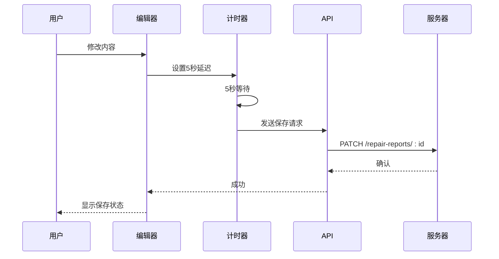

**图表来源**
- [RepairReportEditor.tsx:354-363](file://client/src/components/Workspace/RepairReportEditor.tsx#L354-L363)
- [RepairReportEditor.tsx:801-848](file://client/src/components/Workspace/RepairReportEditor.tsx#L801-L848)

**章节来源**
- [RepairReportEditor.tsx:413-664](file://client/src/components/Workspace/RepairReportEditor.tsx#L413-L664)
- [RepairReportEditor.tsx:722-848](file://client/src/components/Workspace/RepairReportEditor.tsx#L722-L848)

### 辅助组件系统

#### 输入组件体系

组件包含多个专门的输入组件：

| 组件类型 | 功能描述 | 使用场景 |
|---------|----------|----------|
| Section | 章节容器 | 组织内容区块 |
| Input | 文本输入框 | 单行文本输入 |
| TextArea | 多行文本域 | 长文本输入 |
| AutoResizeTextarea | 自适应文本域 | 动态高度调整 |
| FeeSubSection | 费用子段 | 费用明细管理 |
| InlineTranslationPanel | 翻译面板 | AI翻译集成 |
| ReportPreview | 报告预览 | 多语言预览 |
| CustomDatePicker | 日期选择器 | 精确日期输入 |
| StatusBadge | 状态徽章 | 状态显示 |
| PartsSelector | 配件选择器 | 配件管理 |

#### 状态徽章组件

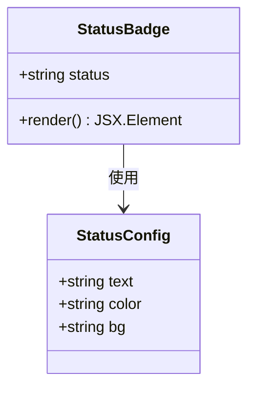

**图表来源**
- [RepairReportEditor.tsx:2085-2099](file://client/src/components/Workspace/RepairReportEditor.tsx#L2085-L2099)

#### 配件选择器组件

**新增功能**：组件现在集成了完整的配件选择器系统：

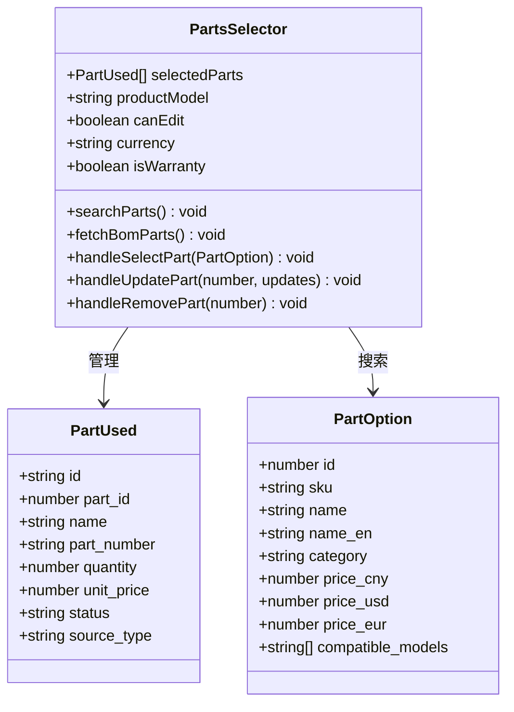

**图表来源**
- [PartsSelector.tsx:52-60](file://client/src/components/Workspace/PartsSelector.tsx#L52-L60)
- [PartsSelector.tsx:12-21](file://client/src/components/Workspace/PartsSelector.tsx#L12-L21)

**章节来源**
- [RepairReportEditor.tsx:1960-2099](file://client/src/components/Workspace/RepairReportEditor.tsx#L1960-L2099)
- [RepairReportEditor.tsx:2085-2099](file://client/src/components/Workspace/RepairReportEditor.tsx#L2085-L2099)
- [PartsSelector.tsx:52-60](file://client/src/components/Workspace/PartsSelector.tsx#L52-L60)

### 运营维修报告编辑器

#### 简化的Textarea输入系统

运营维修报告编辑器采用了全新的Textarea输入系统：

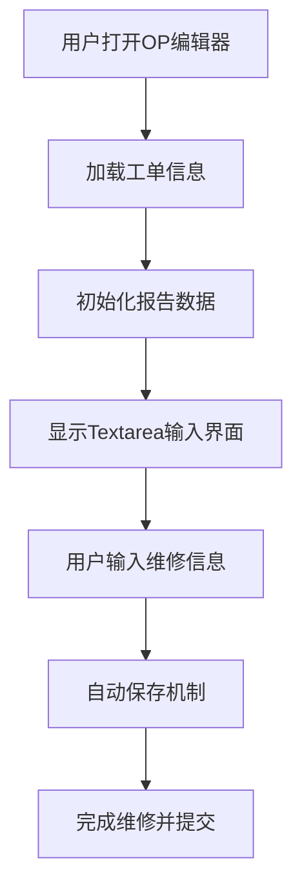

**图表来源**
- [OpRepairReportEditor.tsx:143-222](file://client/src/components/Workspace/OpRepairReportEditor.tsx#L143-L222)

#### 权限控制系统

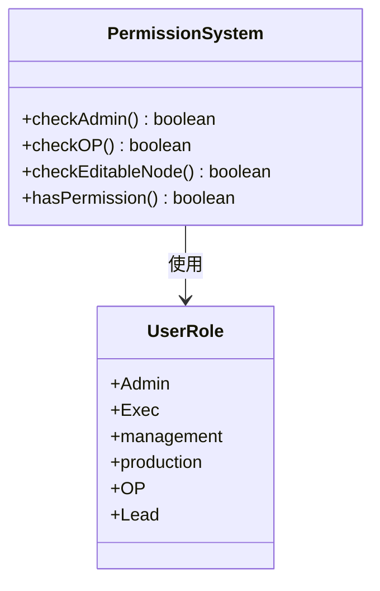

**图表来源**
- [OpRepairReportEditor.tsx:89-112](file://client/src/components/Workspace/OpRepairReportEditor.tsx#L89-L112)

**章节来源**
- [OpRepairReportEditor.tsx:143-222](file://client/src/components/Workspace/OpRepairReportEditor.tsx#L143-L222)
- [OpRepairReportEditor.tsx:89-112](file://client/src/components/Workspace/OpRepairReportEditor.tsx#L89-L112)

## 新增功能特性

### AI智能翻译系统

#### 翻译面板组件

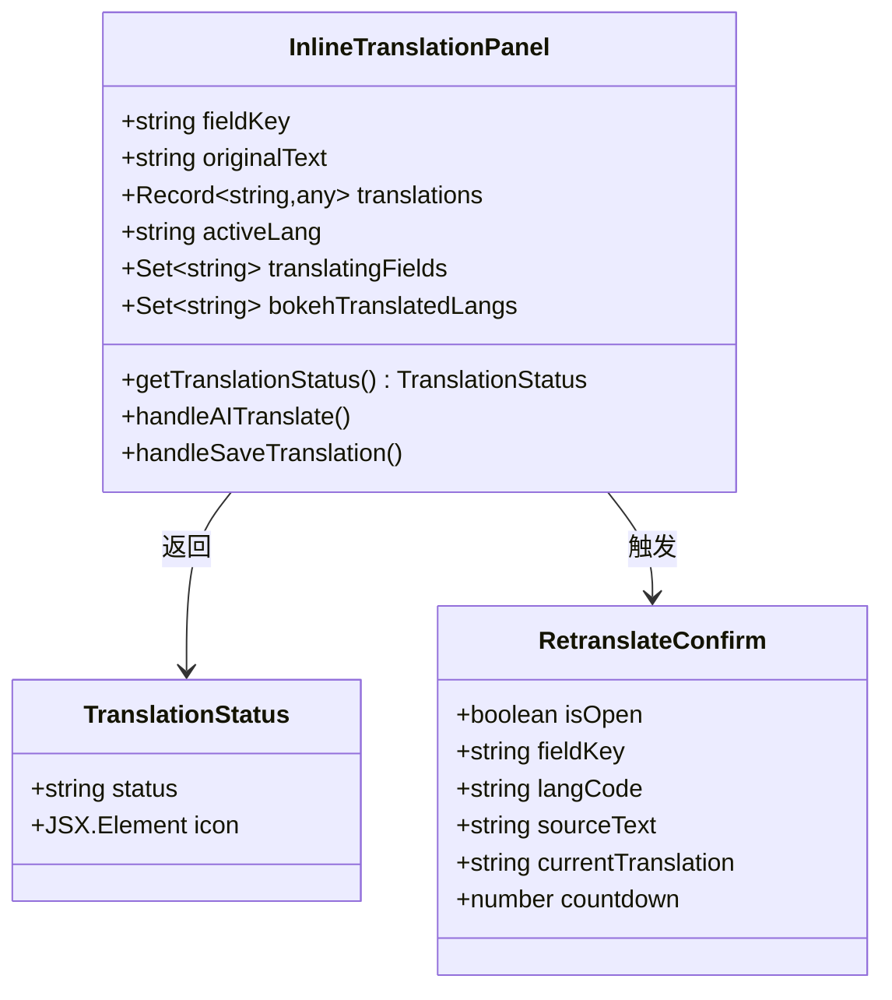

**图表来源**
- [RepairReportEditor.tsx:2832-2924](file://client/src/components/Workspace/RepairReportEditor.tsx#L2832-L2924)
- [RepairReportEditor.tsx:1857-1909](file://client/src/components/Workspace/RepairReportEditor.tsx#L1857-L1909)

#### 翻译工作流程

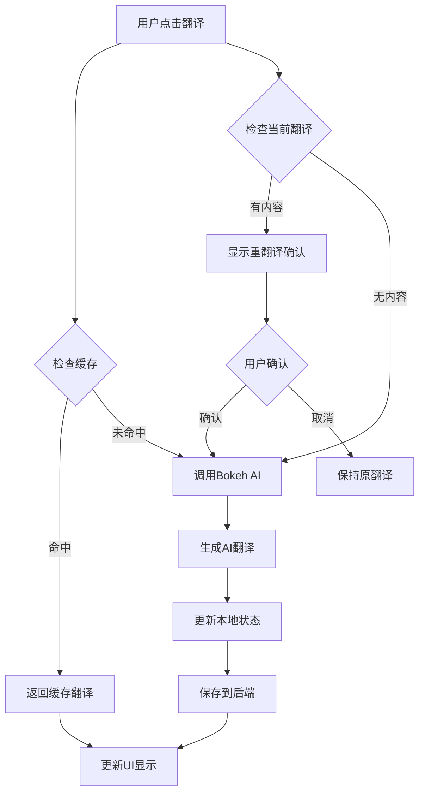

**图表来源**
- [RepairReportEditor.tsx:260-366](file://client/src/components/Workspace/RepairReportEditor.tsx#L260-L366)
- [RepairReportEditor.tsx:368-400](file://client/src/components/Workspace/RepairReportEditor.tsx#L368-L400)

#### 智能重翻译确认机制

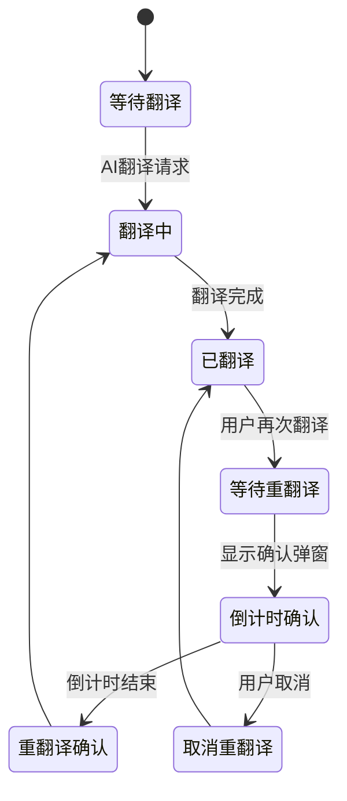

**图表来源**
- [RepairReportEditor.tsx:221-242](file://client/src/components/Workspace/RepairReportEditor.tsx#L221-L242)
- [RepairReportEditor.tsx:1857-1909](file://client/src/components/Workspace/RepairReportEditor.tsx#L1857-L1909)

**章节来源**
- [RepairReportEditor.tsx:260-400](file://client/src/components/Workspace/RepairReportEditor.tsx#L260-L400)
- [RepairReportEditor.tsx:1857-1909](file://client/src/components/Workspace/RepairReportEditor.tsx#L1857-L1909)

### 翻译缓存和历史管理

#### 翻译缓存数据库结构

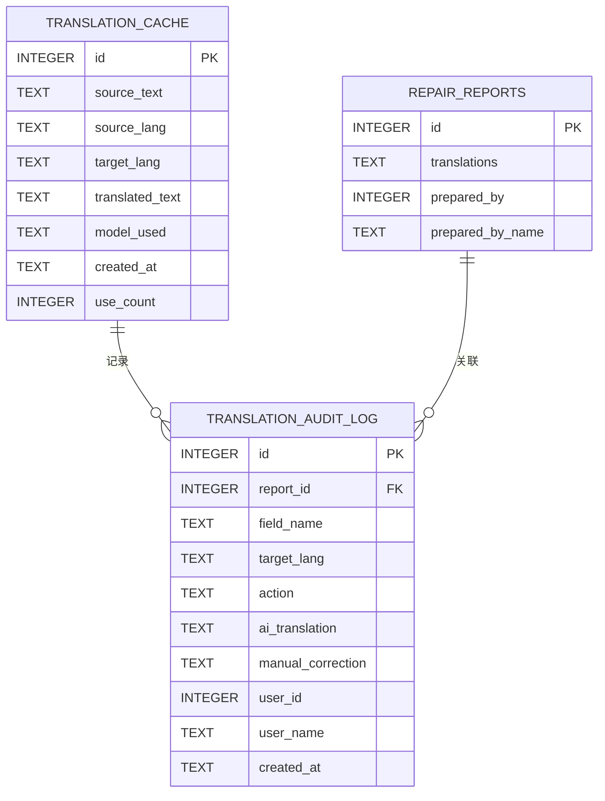

**图表来源**
- [034_add_report_translations.sql:13-48](file://server/service/migrations/034_add_report_translations.sql#L13-L48)
- [048_add_report_prepared_by.sql:8-9](file://server/service/migrations/048_add_report_prepared_by.sql#L8-L9)

#### 翻译状态跟踪

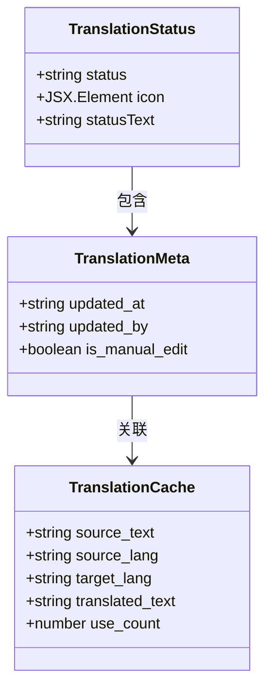

**图表来源**
- [RepairReportEditor.tsx:2878-2885](file://client/src/components/Workspace/RepairReportEditor.tsx#L2878-L2885)
- [RepairReportEditor.tsx:363-394](file://client/src/components/Workspace/RepairReportEditor.tsx#L363-L394)

**章节来源**
- [034_add_report_translations.sql:13-48](file://server/service/migrations/034_add_report_translations.sql#L13-L48)
- [RepairReportEditor.tsx:2878-2885](file://client/src/components/Workspace/RepairReportEditor.tsx#L2878-L2885)
- [RepairReportEditor.tsx:363-394](file://client/src/components/Workspace/RepairReportEditor.tsx#L363-L394)

### 多语言报告模板支持

#### 翻译状态管理

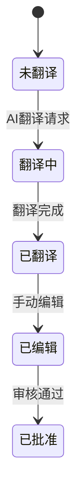

**图表来源**
- [RepairReportEditor.tsx:208-223](file://client/src/components/Workspace/RepairReportEditor.tsx#L208-L223)
- [RepairReportEditor.tsx:224-283](file://client/src/components/Workspace/RepairReportEditor.tsx#L224-L283)

#### 多语言支持

组件支持五种语言的实时预览：

| 语言代码 | 语言名称 | UI标签数量 |
|---------|----------|------------|
| original | 原文 | 2191 |
| zh-CN | 中文 | 2191 |
| en-US | English | 2191 |
| ja-JP | 日本語 | 2191 |
| de-DE | Deutsch | 2191 |

**章节来源**
- [RepairReportEditor.tsx:208-346](file://client/src/components/Workspace/RepairReportEditor.tsx#L208-L346)
- [034_add_report_translations.sql:13-48](file://server/service/migrations/034_add_report_translations.sql#L13-L48)

### 增强的prepared_by用户识别跟踪

#### 用户识别系统

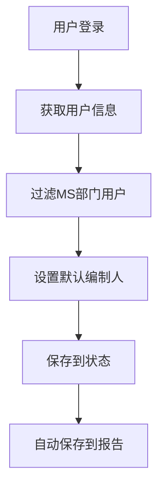

**图表来源**
- [RepairReportEditor.tsx:403-424](file://client/src/components/Workspace/RepairReportEditor.tsx#L403-L424)
- [RepairReportEditor.tsx:496-545](file://client/src/components/Workspace/RepairReportEditor.tsx#L496-L545)

#### 编制人跟踪功能

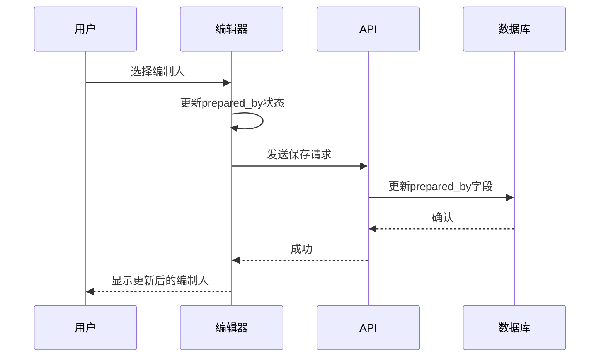

**图表来源**
- [RepairReportEditor.tsx:1096-1133](file://client/src/components/Workspace/RepairReportEditor.tsx#L1096-L1133)
- [048_add_report_prepared_by.sql:8-9](file://server/service/migrations/048_add_report_prepared_by.sql#L8-L9)

**章节来源**
- [RepairReportEditor.tsx:403-545](file://client/src/components/Workspace/RepairReportEditor.tsx#L403-L545)
- [048_add_report_prepared_by.sql:8-9](file://server/service/migrations/048_add_report_prepared_by.sql#L8-L9)

### 改进的报告验证和导出功能

#### 报告验证系统

```mermaid
flowchart TD
A[保存报告] --> B[验证必填字段]
B --> |通过| C[计算费用总计]
B --> |失败| D[显示错误提示]
C --> E[保存到数据库]
E --> F[更新状态]
F --> G[触发成功回调]
```

**图表来源**
- [RepairReportEditor.tsx:814-861](file://client/src/components/Workspace/RepairReportEditor.tsx#L814-L861)
- [RepairReportEditor.tsx:1692-1742](file://client/src/components/Workspace/RepairReportEditor.tsx#L1692-L1742)

#### PDF导出增强

```mermaid
sequenceDiagram
participant User as 用户
participant Editor as 编辑器
participant PDF as PDF引擎
participant Browser as 浏览器
User->>Editor : 点击导出PDF
Editor->>Editor : 验证预览元素
Editor->>PDF : 生成PDF文档
PDF->>Browser : 下载PDF文件
Browser-->>User : 显示下载完成
```

**图表来源**
- [RepairReportEditor.tsx:928-947](file://client/src/components/Workspace/RepairReportEditor.tsx#L928-L947)

**章节来源**
- [RepairReportEditor.tsx:814-947](file://client/src/components/Workspace/RepairReportEditor.tsx#L814-L947)

### 审计跟踪系统

#### 翻译操作审计

```mermaid
sequenceDiagram
participant User as 用户
participant Editor as 编辑器
participant API as API
participant Audit as 审计日志
User->>Editor : AI翻译请求
Editor->>API : 调用翻译接口
API->>Audit : 记录AI翻译操作
Audit-->>API : 确认
API-->>Editor : 返回翻译结果
Editor->>User : 显示翻译结果
```

**图表来源**
- [rma-documents.js:38-67](file://server/service/routes/rma-documents.js#L38-L67)
- [034_add_report_translations.sql:32-48](file://server/service/migrations/034_add_report_translations.sql#L32-L48)

#### 知识库审计功能

```mermaid
flowchart TD
A[知识库操作] --> B[权限检查]
B --> |Admin| C[记录审计日志]
B --> |非Admin| D[拒绝访问]
C --> E[统计分析]
E --> F[过滤查询]
F --> G[分页显示]
```

**图表来源**
- [rma-documents.js:52-57](file://server/service/routes/rma-documents.js#L52-L57)

**章节来源**
- [rma-documents.js:38-57](file://server/service/routes/rma-documents.js#L38-L57)
- [034_add_report_translations.sql:32-48](file://server/service/migrations/034_add_report_translations.sql#L32-L48)

### 财务计算增强

#### 实时费用计算

组件实现了全面的财务计算功能：

```mermaid
flowchart TD
A[费用数据变更] --> B[计算零件费用]
B --> C[计算工时费用]
C --> D[计算其他费用]
D --> E[计算小计]
E --> F[计算税费]
F --> G[计算折扣]
G --> H[计算最终总额]
H --> I[更新UI显示]
I --> J[触发重新渲染]
```

**图表来源**
- [RepairReportEditor.tsx:770-798](file://client/src/components/Workspace/RepairReportEditor.tsx#L770-L798)

#### 费用明细管理

```mermaid
classDiagram
class FeeSubSection {
+string title
+ReactNode icon
+number subtotal
+boolean defaultOpen
+children ReactNode
+render() JSX.Element
}
class LaborCharge {
+string description
+number hours
+number rate
+number total
}
class OtherFee {
+string id
+string description
+number amount
}
class PartUsed {
+string id
+number part_id
+string name
+string part_number
+number quantity
+number unit_price
+string status
+string source_type
}
FeeSubSection --> LaborCharge
FeeSubSection --> OtherFee
FeeSubSection --> PartUsed
```

**图表来源**
- [RepairReportEditor.tsx:2733-2766](file://client/src/components/Workspace/RepairReportEditor.tsx#L2733-L2766)

**章节来源**
- [RepairReportEditor.tsx:770-798](file://client/src/components/Workspace/RepairReportEditor.tsx#L770-L798)
- [RepairReportEditor.tsx:2733-2766](file://client/src/components/Workspace/RepairReportEditor.tsx#L2733-L2766)

### PDF导出设置

#### 导出配置选项

```mermaid
classDiagram
class PdfSettings {
+string format
+string orientation
+boolean showHeader
+boolean showFooter
}
class ReportPreview {
+ReportData reportData
+TicketInfo ticketInfo
+string language
+Record~string,any~ translations
+render() JSX.Element
}
PdfSettings --> ReportPreview : 配置
```

**图表来源**
- [RepairReportEditor.tsx:206-212](file://client/src/components/Workspace/RepairReportEditor.tsx#L206-L212)
- [RepairReportEditor.tsx:2423-2429](file://client/src/components/Workspace/RepairReportEditor.tsx#L2423-L2429)

#### 导出设置面板

```mermaid
flowchart TD
A[用户点击设置] --> B[显示设置面板]
B --> C[选择纸张尺寸]
C --> D[选择页面方向]
D --> E[配置页眉页脚]
E --> F[应用设置]
F --> G[关闭面板]
```

**图表来源**
- [RepairReportEditor.tsx:2423-2429](file://client/src/components/Workspace/RepairReportEditor.tsx#L2423-L2429)

**章节来源**
- [RepairReportEditor.tsx:206-212](file://client/src/components/Workspace/RepairReportEditor.tsx#L206-L212)
- [RepairReportEditor.tsx:2423-2429](file://client/src/components/Workspace/RepairReportEditor.tsx#L2423-L2429)

### 版本控制功能

#### 版本管理架构

```mermaid
erDiagram
REPAIR_REPORTS {
INTEGER id PK
TEXT report_number
TEXT status
TEXT content
REAL total_cost
INTEGER version
INTEGER parent_version_id FK
}
DOCUMENT_AUDIT_LOG {
INTEGER id PK
TEXT document_type
INTEGER document_id
TEXT action
INTEGER user_id
TEXT user_name
TEXT changes_summary
TEXT comment
TEXT created_at
}
REPAIR_REPORTS ||--o{ DOCUMENT_AUDIT_LOG : "记录"
```

**图表来源**
- [030_pi_and_report_tables.sql:64-114](file://server/service/migrations/030_pi_and_report_tables.sql#L64-L114)
- [030_pi_and_report_tables.sql:123-142](file://server/service/migrations/030_pi_and_report_tables.sql#L123-L142)

#### 审计日志系统

```mermaid
sequenceDiagram
participant User as 用户
participant Editor as 编辑器
participant API as API
participant Audit as 审计日志
User->>Editor : 执行操作
Editor->>API : 发送请求
API->>Audit : 记录操作日志
Audit-->>API : 确认
API-->>Editor : 返回结果
Editor-->>User : 显示操作结果
```

**图表来源**
- [rma-documents.js:52-57](file://server/service/routes/rma-documents.js#L52-L57)

**章节来源**
- [030_pi_and_report_tables.sql:123-142](file://server/service/migrations/030_pi_and_report_tables.sql#L123-L142)
- [rma-documents.js:52-57](file://server/service/routes/rma-documents.js#L52-L57)

### 运营维修报告编辑器增强

#### 简化的Textarea输入系统

运营维修报告编辑器采用了全新的Textarea输入系统，提供了更直观的编辑体验：

```mermaid
flowchart TD
A[用户打开OP编辑器] --> B[加载工单信息]
B --> C[初始化报告数据]
C --> D[显示Textarea输入界面]
D --> E[用户输入维修信息]
E --> F[自动保存机制]
F --> G[完成维修并提交]
```

**图表来源**
- [OpRepairReportEditor.tsx:143-222](file://client/src/components/Workspace/OpRepairReportEditor.tsx#L143-L222)

#### 更正功能系统

```mermaid
sequenceDiagram
participant User as 用户
participant Editor as 编辑器
participant API as API
User->>Editor : 点击更正
Editor->>Editor : 显示更正确认弹窗
User->>Editor : 输入更正原因
Editor->>API : 记录更正原因
API-->>Editor : 确认
Editor-->>User : 进入编辑模式
```

**图表来源**
- [OpRepairReportEditor.tsx:367-388](file://client/src/components/Workspace/OpRepairReportEditor.tsx#L367-L388)

#### 权限控制系统

```mermaid
flowchart TD
A[用户操作] --> B{检查用户角色}
B --> |Admin/Exec| C[完全权限]
B --> |OP Lead| D[OP部门权限]
B --> |OP人员| E{检查节点状态}
E --> |op_repairing/op_qa| F[编辑权限]
E --> |其他节点| G[只读权限]
B --> |其他| H[只读权限]
```

**图表来源**
- [OpRepairReportEditor.tsx:89-112](file://client/src/components/Workspace/OpRepairReportEditor.tsx#L89-L112)

**章节来源**
- [OpRepairReportEditor.tsx:143-222](file://client/src/components/Workspace/OpRepairReportEditor.tsx#L143-L222)
- [OpRepairReportEditor.tsx:367-388](file://client/src/components/Workspace/OpRepairReportEditor.tsx#L367-L388)
- [OpRepairReportEditor.tsx:89-112](file://client/src/components/Workspace/OpRepairReportEditor.tsx#L89-L112)

### 翻译缓存机制

#### 缓存数据库结构

```mermaid
erDiagram
TRANSLATION_CACHE {
INTEGER id PK
TEXT source_text
TEXT source_lang
TEXT target_lang
TEXT translated_text
TEXT model_used
TEXT created_at
INTEGER use_count
}
TRANSLATION_CACHE ||--|| TRANSLATION_CACHE : "唯一约束"
TRANSLATION_CACHE ||--o{ TRANSLATION_AUDIT_LOG : "关联"
```

**图表来源**
- [034_add_report_translations.sql:13-25](file://server/service/migrations/034_add_report_translations.sql#L13-L25)

#### 缓存查询优化

```mermaid
flowchart TD
A[翻译请求] --> B[检查缓存表]
B --> |命中| C[增加使用计数]
B --> |未命中| D[调用AI服务]
D --> E[存储到缓存表]
E --> F[返回翻译结果]
C --> F
```

**图表来源**
- [rma-documents.js:1566-1580](file://server/service/routes/rma-documents.js#L1566-L1580)

**章节来源**
- [034_add_report_translations.sql:13-25](file://server/service/migrations/034_add_report_translations.sql#L13-L25)
- [rma-documents.js:1566-1580](file://server/service/routes/rma-documents.js#L1566-L1580)

### 翻译审计日志

#### 审计日志表结构

```mermaid
erDiagram
TRANSLATION_AUDIT_LOG {
INTEGER id PK
INTEGER report_id FK
TEXT field_name
TEXT target_lang
TEXT action
TEXT ai_translation
TEXT manual_correction
INTEGER user_id
TEXT user_name
TEXT created_at
}
TRANSLATION_AUDIT_LOG ||--|| REPAIR_REPORTS : "关联"
```

**图表来源**
- [034_add_report_translations.sql:32-48](file://server/service/migrations/034_add_report_translations.sql#L32-L48)

#### 审计日志记录流程

```mermaid
sequenceDiagram
participant User as 用户
participant Editor as 编辑器
participant API as API
participant DB as 数据库
User->>Editor : 手动编辑翻译
Editor->>API : 保存翻译
API->>DB : 插入审计日志
DB-->>API : 确认
API-->>Editor : 成功
Editor-->>User : 显示成功消息
```

**图表来源**
- [rma-documents.js:1634-1642](file://server/service/routes/rma-documents.js#L1634-L1642)

**章节来源**
- [034_add_report_translations.sql:32-48](file://server/service/migrations/034_add_report_translations.sql#L32-L48)
- [rma-documents.js:1634-1642](file://server/service/routes/rma-documents.js#L1634-L1642)

### 翻译状态管理

#### 状态区分机制

```mermaid
classDiagram
class TranslationMeta {
+string updated_at
+string updated_by
+boolean is_manual_edit
}
class TranslationStatus {
+string status
+JSX.Element icon
}
class InlineTranslationPanel {
+getTranslationStatus() TranslationStatus
}
TranslationMeta --> TranslationStatus : "影响状态"
InlineTranslationPanel --> TranslationStatus : "显示状态"
```

**图表来源**
- [RepairReportEditor.tsx:2878-2885](file://client/src/components/Workspace/RepairReportEditor.tsx#L2878-L2885)
- [RepairReportEditor.tsx:2878-2885](file://client/src/components/Workspace/RepairReportEditor.tsx#L2878-L2885)

#### 状态显示逻辑

```mermaid
flowchart TD
A[获取翻译状态] --> B{检查是否存在翻译}
B --> |否| C[状态: 无翻译]
B --> |是| D{检查是否手动编辑}
D --> |是| E[状态: 手动编辑]
D --> |否| F[状态: AI翻译]
```

**图表来源**
- [RepairReportEditor.tsx:2878-2885](file://client/src/components/Workspace/RepairReportEditor.tsx#L2878-L2885)

**章节来源**
- [RepairReportEditor.tsx:2878-2885](file://client/src/components/Workspace/RepairReportEditor.tsx#L2878-L2885)

### 配件选择工作流

#### 配件选择器架构

**新增功能**：组件现在集成了完整的配件选择器系统，支持多种配件管理方式：

```mermaid
flowchart TD
A[用户打开配件选择器] --> B[加载兼容配件]
B --> C[显示搜索框]
C --> D[用户输入搜索]
D --> E{搜索条件}
E --> |1个字符| F[开始防抖搜索]
E --> |焦点| G[加载兼容配件]
F --> H[查询配件主数据]
G --> H
H --> I{搜索结果}
I --> |有结果| J[显示下拉菜单]
I --> |无结果| K[显示空状态]
J --> L[用户选择配件]
K --> L
L --> M{是否已存在}
M --> |是| N[增加数量]
M --> |否| O[添加新配件]
N --> P[更新配件列表]
O --> P
P --> Q[计算费用]
Q --> R[更新报告]
```

**图表来源**
- [PartsSelector.tsx:95-151](file://client/src/components/Workspace/PartsSelector.tsx#L95-L151)
- [PartsSelector.tsx:175-202](file://client/src/components/Workspace/PartsSelector.tsx#L175-L202)

#### 配件数据绑定

```mermaid
classDiagram
class PartsSelector {
+PartUsed[] selectedParts
+string productModel
+boolean canEdit
+string currency
+boolean isWarranty
+onPartsChange(PartUsed[]) void
+handleSelectPart(PartOption) void
+handleUpdatePart(number, updates) void
+handleRemovePart(number) void
}
class PartUsed {
+string id
+number part_id
+string name
+string part_number
+number quantity
+number unit_price
+string status
+string source_type
}
class PartOption {
+number id
+string sku
+string name
+string name_en
+string category
+number price_cny
+number price_usd
+number price_eur
+string[] compatible_models
}
PartsSelector --> PartUsed : 管理
PartsSelector --> PartOption : 选择
```

**图表来源**
- [PartsSelector.tsx:52-60](file://client/src/components/Workspace/PartsSelector.tsx#L52-L60)
- [PartsSelector.tsx:12-21](file://client/src/components/Workspace/PartsSelector.tsx#L12-L21)

#### 配件来源类型管理

```mermaid
classDiagram
class SourceTypeOptions {
+hq_inventory : HQ库存
+dealer_inventory : 经销商库存
+external_purchase : 外部采购
+warranty_free : 保修免费
}
class PartUsed {
+string source_type
+render() JSX.Element
}
SourceTypeOptions --> PartUsed : 影响
```

**图表来源**
- [PartsSelector.tsx:45-50](file://client/src/components/Workspace/PartsSelector.tsx#L45-L50)

**章节来源**
- [PartsSelector.tsx:95-151](file://client/src/components/Workspace/PartsSelector.tsx#L95-L151)
- [PartsSelector.tsx:175-202](file://client/src/components/Workspace/PartsSelector.tsx#L175-L202)
- [PartsSelector.tsx:45-50](file://client/src/components/Workspace/PartsSelector.tsx#L45-L50)

### 配件API集成

#### 配件主数据管理

**新增功能**：组件现在集成了完整的配件主数据管理API：

```mermaid
sequenceDiagram
participant Client as 客户端
participant PartsMaster as parts-master.js
participant Parts as parts.js
participant DB as 数据库
Client->>PartsMaster : GET /parts-master
PartsMaster->>DB : 查询配件主数据
DB-->>PartsMaster : 返回配件列表
PartsMaster-->>Client : 返回配件数据
Client->>PartsMaster : GET /parts-master/bom
PartsMaster->>DB : 查询BOM推荐
DB-->>PartsMaster : 返回BOM数据
PartsMaster-->>Client : 返回BOM推荐
Client->>Parts : GET /parts
Parts->>DB : 查询配件目录
DB-->>Parts : 返回配件目录
Parts-->>Client : 返回配件目录
```

**图表来源**
- [parts-master.js:28-128](file://server/service/routes/parts-master.js#L28-L128)
- [parts.js:20-81](file://server/service/routes/parts.js#L20-L81)

**章节来源**
- [parts-master.js:28-128](file://server/service/routes/parts-master.js#L28-L128)
- [parts.js:20-81](file://server/service/routes/parts.js#L20-L81)

## 依赖关系分析

### 前端依赖关系

```mermaid
graph TB
subgraph "外部依赖"
A[React] --> B[useState]
A --> C[useEffect]
A --> D[useCallback]
E[axios] --> F[HTTP请求]
G[lucide-react] --> H[图标组件]
I[@tiptap/react] --> J[富文本编辑]
K[core-js] --> L[兼容性支持]
M[react-router] --> N[路由管理]
O[bokeh.js] --> P[AI聊天服务]
Q[parts-master.js] --> R[配件API]
Q --> S[parts.js]
end
subgraph "内部依赖"
T[useAuthStore] --> U[认证状态]
V[pdfExport] --> W[PDF导出]
X[ConfirmModal] --> Y[确认对话框]
Z[InlineTranslationPanel] --> AA[AI翻译集成]
AB[ReportPreview] --> AC[多语言预览]
AD[CustomDatePicker] --> AE[日期选择器]
AF[TranslationTextarea] --> AG[翻译文本域]
AH[RetranslateConfirm] --> AI[重翻译确认]
AJ[PartsSelector] --> AK[配件管理]
end
A --> T
E --> F
G --> H
I --> J
Z --> AA
AB --> AC
AD --> AE
AF --> AG
AH --> AI
AJ --> AK
```

**图表来源**
- [RepairReportEditor.tsx:1-8](file://client/src/components/Workspace/RepairReportEditor.tsx#L1-L8)
- [PartsSelector.tsx:7-10](file://client/src/components/Workspace/PartsSelector.tsx#L7-L10)

### 后端依赖关系

```mermaid
graph TB
subgraph "数据库层"
A[SQLite] --> B[repair_reports表]
A --> C[ticket_activities表]
A --> D[document_audit_log表]
A --> E[translation_cache表]
A --> F[translation_audit_log表]
A --> G[users表]
A --> H[parts_master表]
A --> I[sku_prices表]
A --> J[product_model_parts表]
end
subgraph "业务逻辑层"
K[parts-master.js] --> L[配件主数据管理]
K --> M[BOM推荐]
K --> N[分类管理]
O[rma-documents.js] --> P[报告管理]
O --> Q[状态转换]
O --> R[权限控制]
S[bokeh.js] --> T[聊天服务]
T --> U[AI翻译]
end
subgraph "迁移管理"
V[030_pi_and_report_tables.sql] --> W[报告表结构]
V --> X[工作流支持]
Y[034_add_report_translations.sql] --> Z[翻译缓存表]
Y --> AA[翻译审计日志]
BB[048_add_report_prepared_by.sql] --> CC[用户识别字段]
DD[parts-master.js] --> EE[配件主数据表]
DD --> FF[SKU价格表]
DD --> GG[产品型号关联表]
end
O --> A
K --> A
S --> A
V --> A
Y --> A
BB --> A
DD --> A
```

**图表来源**
- [rma-documents.js:1-1690](file://server/service/routes/rma-documents.js#L1-L1690)
- [parts-master.js:1-621](file://server/service/routes/parts-master.js#L1-L621)
- [030_pi_and_report_tables.sql:64-114](file://server/service/migrations/030_pi_and_report_tables.sql#L64-L114)
- [034_add_report_translations.sql:1-51](file://server/service/migrations/034_add_report_translations.sql#L1-L51)
- [048_add_report_prepared_by.sql:1-10](file://server/service/migrations/048_add_report_prepared_by.sql#L1-L10)
- [parts-master.js:1-621](file://server/service/routes/parts-master.js#L1-L621)

**章节来源**
- [RepairReportEditor.tsx:1-8](file://client/src/components/Workspace/RepairReportEditor.tsx#L1-L8)
- [PartsSelector.tsx:7-10](file://client/src/components/Workspace/PartsSelector.tsx#L7-L10)
- [rma-documents.js:1-1690](file://server/service/routes/rma-documents.js#L1-L1690)
- [parts-master.js:1-621](file://server/service/routes/parts-master.js#L1-L621)

## 性能考虑

### 内存优化策略

1. **深度更新优化**
   - 使用JSON深拷贝避免直接修改引用
   - 只更新必要的状态字段

2. **计算缓存**
   - 费用计算使用useCallback缓存
   - 避免不必要的重新计算

3. **自动保存节流**
   - 5秒防抖延迟减少API调用频率
   - 智能保存时机判断

4. **翻译缓存优化**
   - 数据库唯一约束避免重复翻译
   - 使用计数跟踪翻译使用频率

5. **多语言预览优化**
   - 按需加载翻译内容
   - 缓存翻译状态避免重复计算

6. **AI翻译优化**
   - 翻译结果自动保存到本地状态
   - 支持手动编辑覆盖AI翻译
   - 防抖自动保存减少后端压力

7. **表单验证优化**
   - 实时验证减少无效提交
   - 错误状态缓存避免重复验证

8. **日期选择器优化**
   - 日期范围缓存避免重复计算
   - 验证结果缓存提升响应速度

9. **PDF导出优化**
   - 预览元素缓存
   - 导出前验证确保性能

10. **缓存查询优化**
    - 数据库索引加速翻译查找
    - 唯一约束避免重复翻译

11. **Textarea自动调整优化**
    - 防抖机制避免频繁DOM操作
    - 最小化重排重绘

12. **翻译面板优化**
    - 懒加载翻译面板
    - 防抖自动保存

13. **重翻译确认优化**
    - 倒计时状态管理
    - 确认弹窗懒加载

14. **翻译状态跟踪优化**
    - 状态缓存避免重复计算
    - 图标状态优化渲染

15. **配件选择器优化**
    - 防抖搜索减少API调用
    - 懒加载BOM推荐
    - 本地状态管理避免重复计算

16. **配件数据绑定优化**
    - 部件更新使用索引定位
    - 数量变更批量处理
    - 来源类型快速切换

17. **配件搜索优化**
    - 1字符开始搜索
    - 下拉菜单懒加载
    - 搜索结果缓存

18. **BOM推荐优化**
    - 机型匹配优先
    - 兼容模式降级
    - 结果排序优化

19. **手动添加优化**
    - 表单验证前置
    - 快速添加模式
    - 默认值预填充

20. **配件来源管理优化**
    - 类型颜色标识
    - 快捷选择按钮
    - 状态快速切换

### 渲染优化

1. **条件渲染**
   - 根据状态动态显示/隐藏组件
   - OP模式下简化界面元素

2. **虚拟滚动**
   - 对于大量数据采用分页或虚拟化

3. **翻译状态优化**
   - 懒加载翻译面板
   - 防抖自动保存

4. **PDF导出优化**
   - 预览元素缓存
   - 导出前验证确保性能

5. **缓存查询优化**
   - 数据库索引加速翻译查找
   - 唯一约束避免重复翻译

6. **错误处理优化**
   - 错误状态缓存避免重复处理
   - 自动恢复机制减少用户干预

7. **Textarea渲染优化**
   - 自适应高度计算优化
   - 防抖机制减少重渲染

8. **重翻译确认优化**
   - 倒计时状态管理
   - 弹窗懒加载

9. **配件选择器渲染优化**
    - 搜索结果虚拟化
    - BOM推荐懒加载
    - 手动添加表单优化

10. **配件列表渲染优化**
    - 部件行状态缓存
    - 数量变更局部更新
    - 来源类型快速渲染

## 故障排除指南

### 常见问题诊断

#### 数据加载失败
- 检查网络连接状态
- 验证认证令牌有效性
- 确认API端点可用性

#### 状态更新异常
- 检查状态转换规则
- 验证权限检查逻辑
- 确认数据库事务完整性

#### PDF导出问题
- 验证预览元素存在
- 检查PDF设置配置
- 确认浏览器兼容性

#### 翻译功能异常
- 检查AI翻译服务可用性
- 验证翻译缓存数据库连接
- 确认翻译API认证令牌
- 检查Bokeh AI服务状态

#### 审计日志问题
- 检查审计日志表结构
- 验证权限检查逻辑
- 确认数据库事务完整性

#### 用户识别问题
- 检查用户部门过滤逻辑
- 验证MS部门用户列表
- 确认prepared_by字段更新

#### 翻译缓存问题
- 检查数据库唯一约束
- 验证翻译缓存查询性能
- 确认翻译使用计数更新

#### 表单验证问题
- 检查验证规则配置
- 验证字段依赖关系
- 确认错误消息显示

#### 日期选择器问题
- 检查日期范围设置
- 验证日期格式转换
- 确认日期验证逻辑

#### 错误恢复问题
- 检查恢复机制配置
- 验证错误状态管理
- 确认用户反馈机制

#### 自动保存问题
- 检查防抖定时器配置
- 验证保存请求格式
- 确认保存状态显示

#### 费用计算问题
- 检查计算逻辑实现
- 验证数值精度处理
- 确认汇率转换逻辑

#### Textarea输入问题
- 检查自动调整高度逻辑
- 验证防抖保存机制
- 确认翻译面板集成

#### 权限控制问题
- 检查用户角色验证
- 验证节点状态检查
- 确认更正权限逻辑

#### 翻译状态跟踪问题
- 检查翻译状态缓存
- 验证手动编辑标记
- 确认翻译元数据更新

#### 重翻译确认问题
- 检查倒计时状态管理
- 验证确认弹窗显示
- 确认用户交互处理

#### 翻译缓存机制问题
- 检查缓存表结构
- 验证唯一约束
- 确认使用计数更新

#### 翻译审计日志问题
- 检查审计日志表结构
- 验证日志记录逻辑
- 确认用户权限检查

#### 配件选择器问题
- 检查配件API连接
- 验证搜索功能
- 确认BOM推荐加载

#### 配件数据绑定问题
- 检查配件状态更新
- 验证数量变更逻辑
- 确认来源类型切换

#### 配件来源管理问题
- 检查来源类型配置
- 验证颜色标识
- 确认快捷选择功能

**章节来源**
- [RepairReportEditor.tsx:354-363](file://client/src/components/Workspace/RepairReportEditor.tsx#L354-L363)
- [RepairReportEditor.tsx:801-848](file://client/src/components/Workspace/RepairReportEditor.tsx#L801-L848)
- [OpRepairReportEditor.tsx:115-121](file://client/src/components/Workspace/OpRepairReportEditor.tsx#L115-L121)
- [PartsSelector.tsx:95-151](file://client/src/components/Workspace/PartsSelector.tsx#L95-L151)

## 结论

维修报告编辑器组件是一个功能完整、架构清晰的服务管理工具。经过大规模重构后，其主要特点包括：

1. **完整的文档生命周期管理**：从草稿到发布的全流程支持
2. **智能的数据初始化**：自动从工单和诊断活动中提取相关信息
3. **实时的费用计算**：动态计算税费和总金额
4. **灵活的工作模式**：支持MS和OP两种不同的操作模式
5. **强大的权限控制**：基于角色和部门的访问控制
6. **完善的审计追踪**：完整的操作日志记录
7. **AI翻译支持**：多语言实时翻译和缓存系统
8. **增强的用户识别**：完整的prepared_by跟踪和用户管理
9. **改进的报告验证**：更严格的验证和错误处理
10. **优化的导出功能**：增强的PDF导出和预览体验
11. **多语言模板支持**：完整的UI标签多语言映射
12. **用户体验优化**：直观的翻译面板和多语言预览
13. **翻译缓存机制**：数据库级翻译缓存和使用统计
14. **翻译审计日志**：完整的翻译操作追踪和版本控制
15. **智能翻译面板**：支持多种语言的AI翻译和手动编辑
16. **增强的表单验证**：更严格的数据校验和错误处理
17. **改进的日期选择器**：精确的日期范围限制和验证
18. **简化的用户流程**：优化的操作界面和工作流程
19. **更好的错误处理**：自动恢复机制和用户友好的错误提示
20. **性能优化**：内存优化、渲染优化和缓存机制
21. **Textarea输入系统**：简化的用户界面和交互体验
22. **自动保存机制**：智能的防抖保存和状态管理
23. **更正功能**：完整的权限控制和审计追踪
24. **权限控制简化**：基于角色和节点状态的访问控制
25. **AI智能翻译系统**：完整的翻译面板和状态跟踪
26. **智能重翻译确认**：带倒计时的安全重翻译流程
27. **翻译历史管理**：翻译缓存和审计日志系统
28. **多语言支持**：支持英文、日文、德文的自动翻译
29. **翻译状态跟踪**：区分AI翻译和手动编辑的状态
30. **翻译缓存优化**：数据库唯一约束和使用计数
31. **全新的配件选择工作流**：集成PartsSelector组件，支持配件搜索、BOM推荐和手动添加
32. **改进的数据绑定**：增强的配件数据绑定和验证机制
33. **配件管理功能**：支持配件来源类型管理和状态跟踪
34. **API集成优化**：完整的配件主数据和目录API支持
35. **渲染性能优化**：配件选择器的虚拟化和懒加载机制

该组件为长horn系统的RMA服务提供了坚实的技术基础，能够有效提升服务效率和质量管理水平。新增的textarea-based输入系统、AI智能翻译功能和**全新的配件选择工作流**显著改善了用户体验，同时保持了数据完整性和功能完整性，为用户提供更加流畅和可靠的维修报告管理体验。

**更新** 新增的配件选择工作流是本次更新的核心亮点，它不仅增强了维修报告的数据完整性，还为运营团队提供了更高效的配件管理能力。通过集成PartsSelector组件，用户可以轻松地从配件库中选择合适的配件，系统会自动计算相关费用并更新报告状态，大大简化了维修报告的创建和编辑流程。