# 服务 API 文档

<cite>
**本文档引用的文件**
- [API 文档](file://docs/API_DOCUMENTATION.md)
- [服务 API 设计文档](file://docs/Service_API.md)
- [服务端入口](file://server/index.js)
- [工单路由](file://server/service/routes/tickets.js)
- [权限中间件](file://server/service/middleware/permission.js)
- [上传路由](file://server/service/routes/upload.js)
- [附件计数迁移](file://server/migrations/039_add_attachments_count.sql)
- [附件检查脚本](file://server/scripts/check_attachments.js)
- [工单活动路由](file://server/service/routes/ticket-activities.js)
</cite>

## 更新摘要
**变更内容**
- 新增工单附件管理API端点：POST /api/v1/tickets/:id/attachments 和 DELETE /api/v1/tickets/:id/attachments/:attachId
- 更新工单详情接口文档，支持所有附件返回
- 增强权限控制说明，包含附件上传/删除权限
- 完善附件存储和访问控制机制
- 更新附件查询优化说明

## 目录
1. [简介](#简介)
2. [项目结构](#项目结构)
3. [核心组件](#核心组件)
4. [架构概览](#架构概览)
5. [详细组件分析](#详细组件分析)
6. [依赖关系分析](#依赖关系分析)
7. [性能考虑](#性能考虑)
8. [故障排除指南](#故障排除指南)
9. [结论](#结论)

## 简介

Longhorn 服务 API 是一个基于 Node.js 和 Express 的现代化服务系统，专为 Kinefinity 的产品服务管理而设计。该系统提供了完整的工单管理、客户服务、产品管理和经销商管理功能。

### 主要特性

- **统一工单系统**：支持咨询工单、RMA 返厂单、经销商维修单的统一管理
- **多租户架构**：支持内部员工、经销商、终端客户等多角色访问
- **智能权限控制**：基于部门和角色的细粒度权限管理
- **实时协作**：支持工单参与者协作和通知系统
- **数据安全保障**：完整的审计日志和数据脱敏机制
- **附件管理**：完整的工单附件上传、存储和访问控制

## 项目结构

Longhorn 项目采用模块化的三层架构设计：

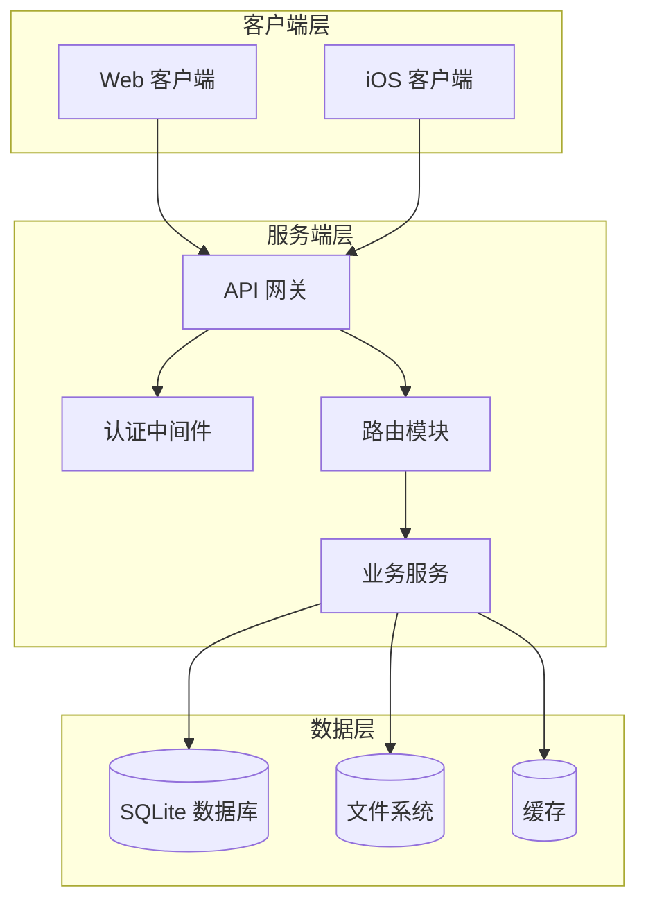

**图表来源**
- [服务端入口:1-800](file://server/index.js#L1-800)
- [前端应用入口:1-800](file://client/src/App.tsx#L1-800)

**章节来源**
- [服务端入口:1-800](file://server/index.js#L1-800)
- [API 文档:1-105](file://docs/API_DOCUMENTATION.md#L1-105)

## 核心组件

### 1. 认证与授权系统

系统采用 JWT 令牌进行身份验证，支持多种用户类型：

| 用户类型 | 权限范围 | 访问范围 |
|---------|----------|----------|
| Admin | 系统管理员 | 全部数据 |
| Exec | 执行官 | 全部数据 |
| Lead | 部门主管 | 部门内数据 |
| Member | 普通成员 | 个人和部门数据 |
| Dealer | 经销商用户 | 自身客户数据

### 2. 工单管理系统

统一的工单架构支持三种工单类型：

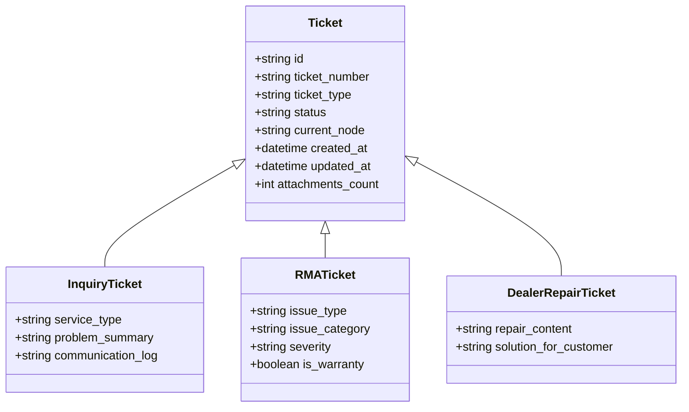

**图表来源**
- [工单路由:1-800](file://server/service/routes/tickets.js#L1-800)

### 3. 数据模型架构

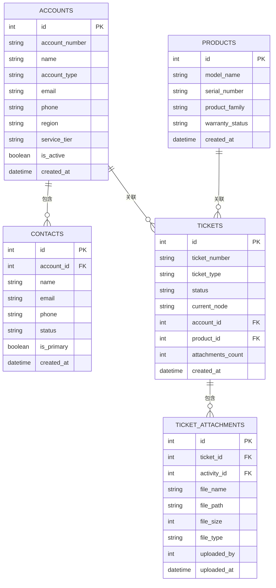

**图表来源**
- [工单路由:1380-1395](file://server/service/routes/tickets.js#L1380-L1395)
- [权限中间件:34-44](file://server/service/middleware/permission.js#L34-L44)
- [附件计数迁移:1-11](file://server/migrations/039_add_attachments_count.sql#L1-L11)

**章节来源**
- [服务 API 设计文档:1-800](file://docs/Service_API.md#L1-800)
- [工单路由:1-800](file://server/service/routes/tickets.js#L1-800)

## 架构概览

### 1. API 设计原则

系统遵循 RESTful API 设计原则，采用版本化 URL 结构：

```
/api/v1/endpoint
```

**响应格式规范**：
```json
{
  "success": true,
  "data": {},
  "meta": {
    "page": 1,
    "page_size": 20,
    "total": 100
  }
}
```

### 2. 错误处理机制

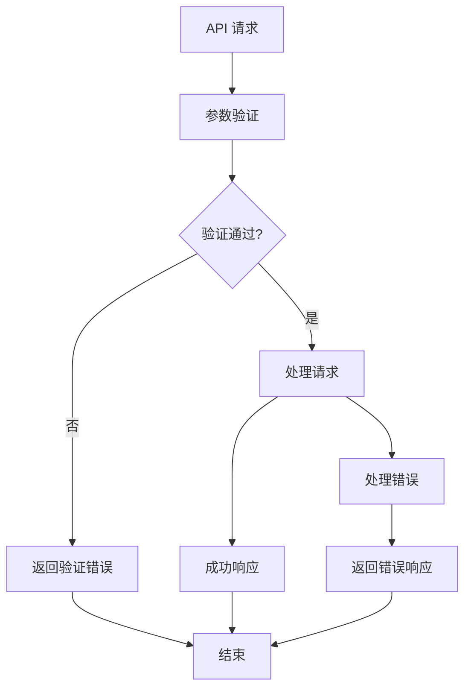

**图表来源**
- [服务端入口:655-729](file://server/index.js#L655-729)

### 3. 权限控制流程

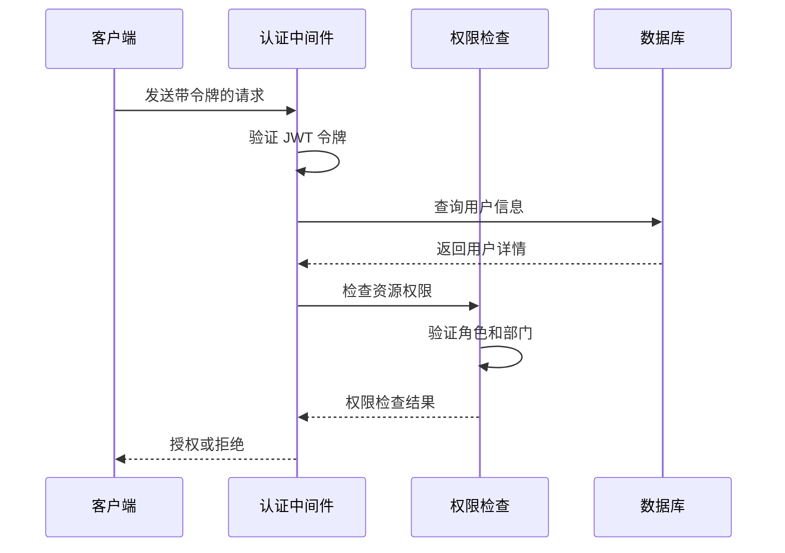

**图表来源**
- [服务端入口:655-729](file://server/index.js#L655-729)
- [权限中间件:34-44](file://server/service/middleware/permission.js#L34-L44)

**章节来源**
- [服务 API 设计文档:35-84](file://docs/Service_API.md#L35-84)
- [服务端入口:655-729](file://server/index.js#L655-729)

## 详细组件分析

### 1. 工单管理 API

#### 1.1 工单创建流程

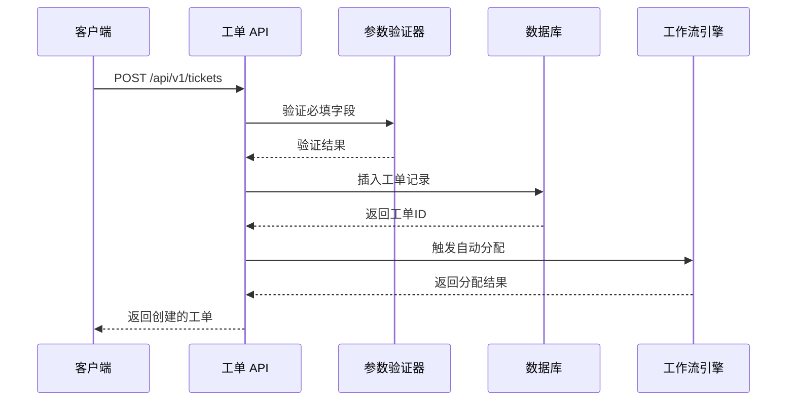

**图表来源**
- [工单路由:557-776](file://server/service/routes/tickets.js#L557-776)

#### 1.2 工单状态流转

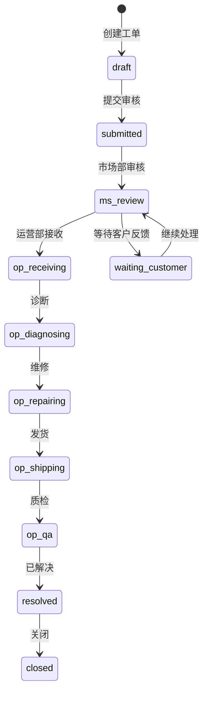

**图表来源**
- [工单路由:56-61](file://server/service/routes/tickets.js#L56-L61)

#### 1.3 工单查询接口

| 接口 | 方法 | 功能 | 权限 |
|------|------|------|------|
| `/api/v1/tickets` | GET | 查询工单列表 | 所有登录用户 |
| `/api/v1/tickets/:id` | GET | 获取工单详情 | 相关用户 |
| `/api/v1/tickets` | POST | 创建新工单 | 市场部、经销商 |
| `/api/v1/tickets/:id` | PATCH | 更新工单 | 相关用户 |
| `/api/v1/tickets/:id/attachments` | POST | 添加附件 | 相关用户 |
| `/api/v1/tickets/:id/attachments/:attachId` | DELETE | 删除附件 | 相关用户 |

**更新** 新增工单附件管理API端点，支持工单级附件上传和删除

#### 1.4 工单附件管理API

**附件上传接口**：
- **URL**: `POST /api/v1/tickets/:id/attachments`
- **权限**: Admin、Exec、MS部门主管、工单创建者
- **文件限制**: 最多10个文件，单个文件大小限制
- **返回**: 附件列表，包含下载URL和缩略图URL

**附件删除接口**：
- **URL**: `DELETE /api/v1/tickets/:id/attachments/:attachId`
- **权限**: Admin、Exec、MS部门主管、附件上传者本人
- **功能**: 删除指定附件并清理文件系统

**权限控制机制**：
- `canUpload()` 函数验证上传权限
- `canDelete()` 函数验证删除权限
- 支持部门级权限继承（MS部门全局读写）

**章节来源**
- [工单路由:2739-2852](file://server/service/routes/tickets.js#L2739-L2852)

### 2. 上下文查询 API

#### 2.1 客户上下文查询

系统提供三种上下文查询方式：

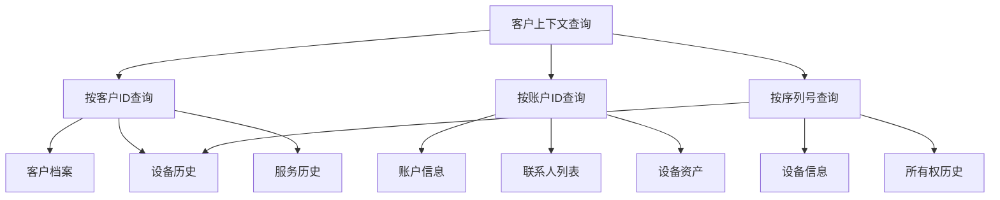

**图表来源**
- [上下文查询路由:12-175](file://server/service/routes/context.js#L12-175)

#### 2.2 数据脱敏机制

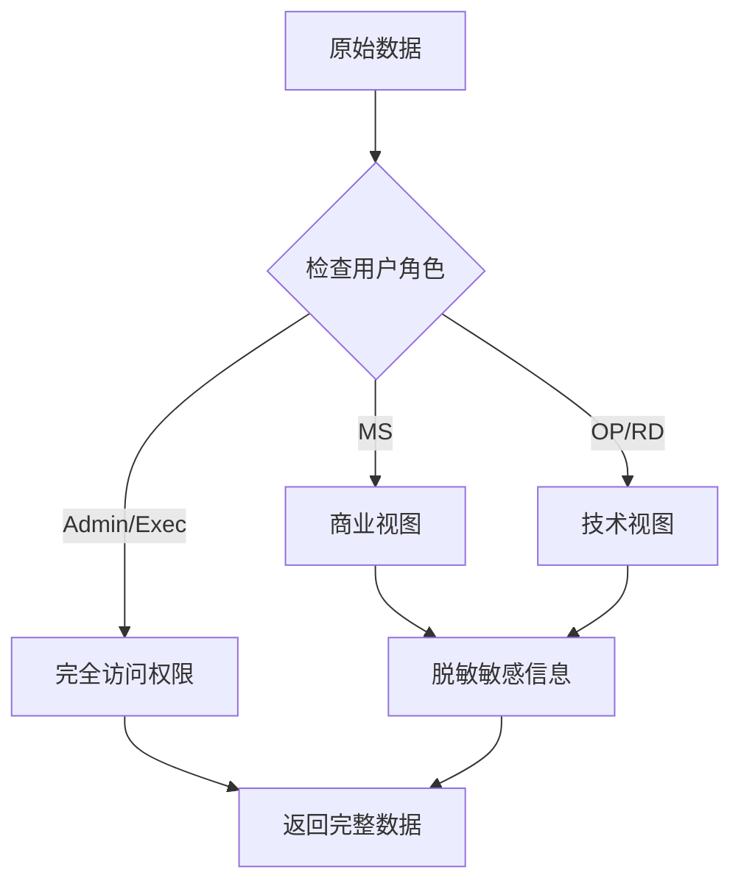

**图表来源**
- [上下文查询路由:137-158](file://server/service/routes/context.js#L137-158)

**章节来源**
- [上下文查询路由:12-484](file://server/service/routes/context.js#L12-484)

### 3. 产品管理 API

#### 3.1 保修管理流程

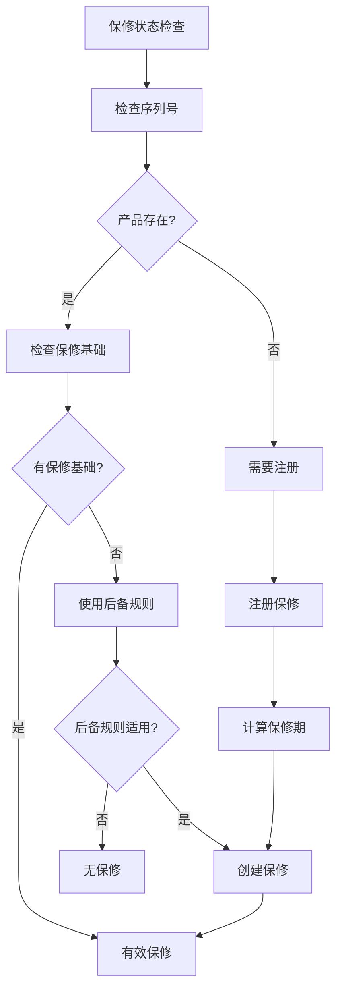

**图表来源**
- [产品路由:37-120](file://server/service/routes/products.js#L37-120)
- [产品路由:136-332](file://server/service/routes/products.js#L136-332)

#### 3.2 保修计算引擎

系统采用瀑布式计算逻辑：

| 优先级 | 条件 | 保修开始日期来源 |
|--------|------|------------------|
| 1 | IoT 激活日期 | IOT_ACTIVATION |
| 2 | 销售发票日期 | INVOICE_PROOF |
| 3 | 手动注册日期 | REGISTRATION |
| 4 | 直销发货日期 + 7天 | DIRECT_SHIPMENT |
| 5 | 经销商发货日期 + 90天 | DEALER_FALLBACK |

**章节来源**
- [产品路由:334-384](file://server/service/routes/products.js#L334-384)

### 4. 客户与经销商管理

#### 4.1 账户架构

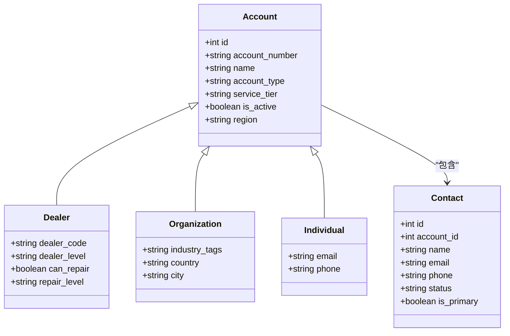

**图表来源**
- [账户路由:1-800](file://server/service/routes/accounts.js#L1-800)

#### 4.2 经销商管理

| 接口 | 方法 | 功能 | 权限 |
|------|------|------|------|
| `/api/v1/dealers` | GET | 获取经销商列表 | 市场部、管理员 |
| `/api/v1/dealers/:id` | GET | 获取经销商详情 | 市场部、管理员 |
| `/api/v1/dealers` | POST | 创建经销商 | 管理员 |
| `/api/v1/dealers/:id` | PATCH | 更新经销商 | 管理员 |
| `/api/v1/dealers/:id/issues` | GET | 获取经销商工单 | 市场部、管理员 |

**章节来源**
- [经销商路由:16-321](file://server/service/routes/dealers.js#L16-321)

### 5. 工单详情接口增强

**更新** 工单详情接口现已支持完整的附件返回：

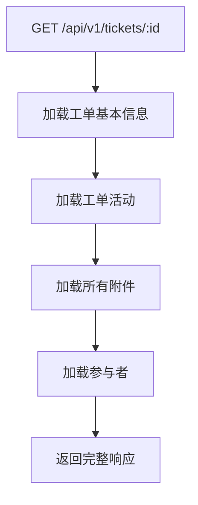

**图表来源**
- [工单路由:1381-1457](file://server/service/routes/tickets.js#L1381-L1457)

**响应结构增强**：
- 新增 `attachments` 数组，包含所有附件信息
- 新增 `attachments_count` 字段，显示附件总数
- 每个附件包含下载URL和缩略图URL

**章节来源**
- [工单路由:1381-1457](file://server/service/routes/tickets.js#L1381-L1457)

### 6. 附件查询优化

**更新** 附件查询已进行优化，支持更高效的工单附件检索：

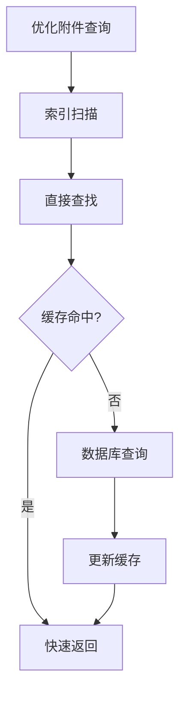

**优化特性**：
- 使用 `ticket_attachments` 表的索引进行快速查找
- 支持工单级附件的批量查询
- 实现附件URL的即时生成，无需额外查询
- 支持图片附件的缩略图URL生成

**章节来源**
- [工单路由:1381-1395](file://server/service/routes/tickets.js#L1381-L1395)

### 7. 权限控制增强

**更新** 权限控制机制已增强，支持更精细的权限管理：

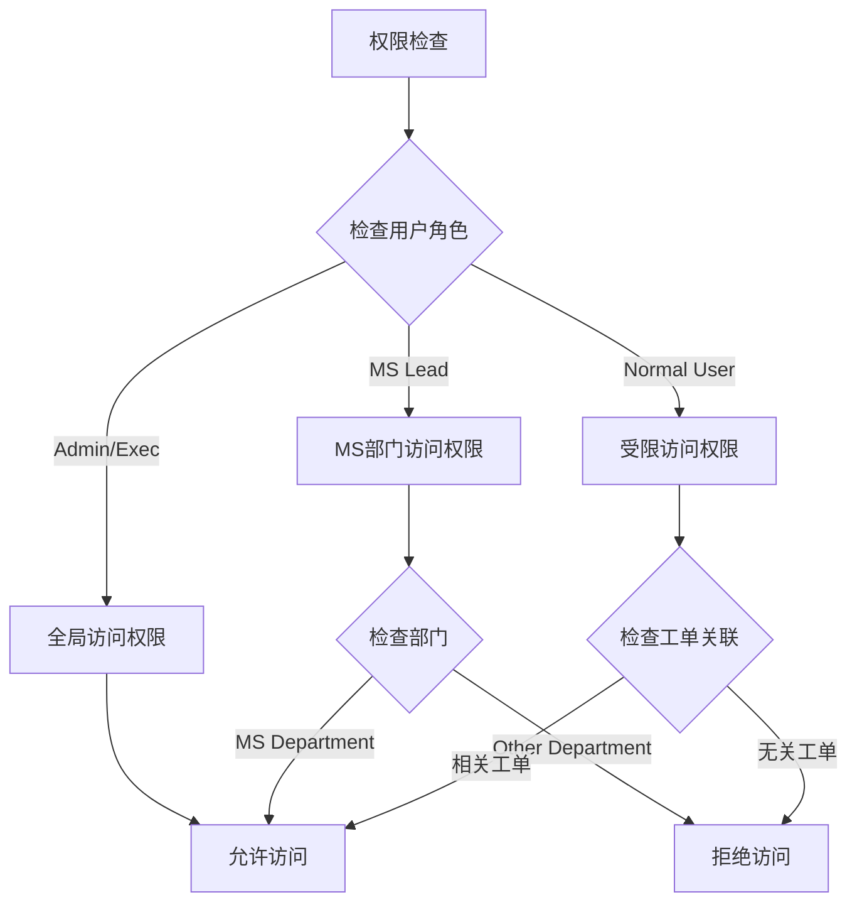

**权限函数增强**：
- `hasGlobalAccess()` 函数判断全局访问权限
- 支持 Admin、Exec、MS 部门人员的全局权限
- 实现部门级权限的精细化控制

**章节来源**
- [权限中间件:34-44](file://server/service/middleware/permission.js#L34-L44)

### 8. 附件存储和访问控制机制

**更新** 附件存储系统已进行全面优化：

**存储架构**：
- **临时文件存储**：使用 `SERVICE_TEMP_DIR` 存储上传的临时文件
- **永久文件存储**：使用 `/Volumes/fileserver/Service` 远程文件服务器
- **目录结构**：`Service/Tickets/{类型}/{工单号}/`

**访问控制**：
- **权限验证**：每个附件访问都必须通过用户权限验证
- **路径安全**：防止目录遍历攻击
- **文件类型限制**：支持的文件类型包括图片和PDF
- **缩略图生成**：自动为图片附件生成缩略图

**章节来源**
- [服务端入口:46-57](file://server/index.js#L46-L57)
- [服务端入口:20-40](file://server/index.js#L20-L40)
- [工单路由:2739-2852](file://server/service/routes/tickets.js#L2739-L2852)

## 依赖关系分析

### 1. 组件耦合度

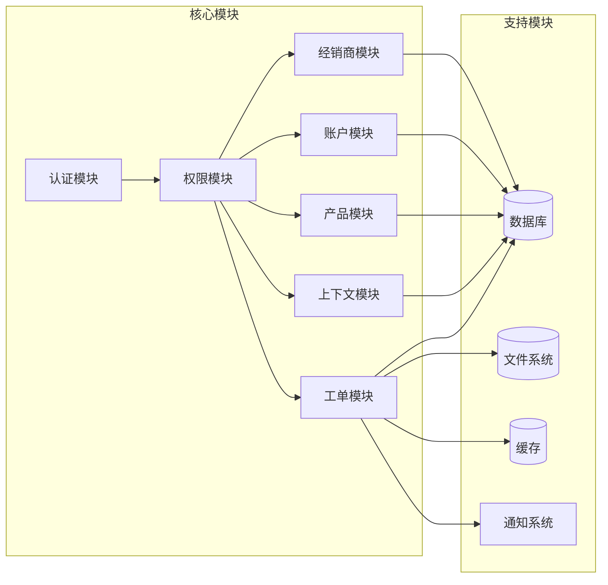

**图表来源**
- [服务端入口:15-23](file://server/index.js#L15-L23)

### 2. 外部依赖

| 依赖项 | 版本 | 用途 |
|--------|------|------|
| Express | 最新稳定版 | Web 框架 |
| Better-SQLite3 | 最新 | 数据库 ORM |
| JWT | 最新 | 身份验证 |
| Multer | 最新 | 文件上传 |
| Sharp | 最新 | 图像处理 |
| Axios | 最新 | HTTP 客户端 |

**章节来源**
- [服务端入口:1-16](file://server/index.js#L1-16)

## 性能考虑

### 1. 缓存策略

系统采用多层次缓存机制：

- **内存缓存**：热点数据缓存
- **数据库缓存**：查询结果缓存
- **文件缓存**：静态资源缓存
- **CDN 缓存**：静态文件加速

### 2. 数据库优化

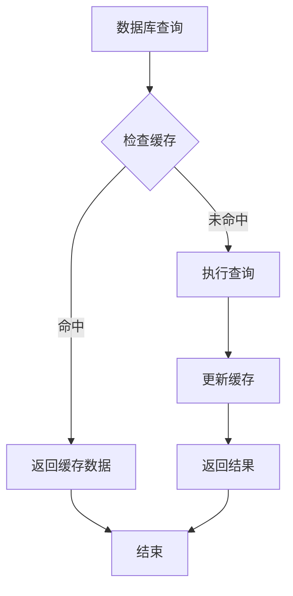

### 3. 并发处理

- **连接池**：数据库连接池管理
- **请求去重**：重复请求去重机制
- **异步处理**：耗时操作异步化
- **限流机制**：防止系统过载

### 4. 附件存储优化

**更新** 附件存储系统已进行优化：

- **临时文件存储**：使用 `SERVICE_TEMP_DIR` 存储上传的临时文件
- **索引优化**：为 `ticket_attachments` 表建立索引
- **批量操作**：支持批量附件上传和删除
- **清理机制**：自动清理过期的临时文件

**章节来源**
- [服务端入口:46-57](file://server/index.js#L46-L57)

## 故障排除指南

### 1. 常见错误类型

| 错误代码 | 描述 | 解决方案 |
|----------|------|----------|
| 401 | 未认证 | 检查 JWT 令牌有效性 |
| 403 | 权限不足 | 验证用户角色和权限 |
| 404 | 资源不存在 | 检查 ID 和路径 |
| 422 | 业务逻辑错误 | 检查输入数据格式 |
| 500 | 服务器错误 | 查看服务器日志 |

### 2. 调试工具

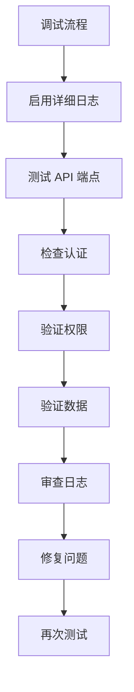

### 3. 性能监控

- **响应时间监控**：关键 API 的响应时间跟踪
- **错误率监控**：异常请求的统计分析
- **资源使用监控**：CPU、内存、磁盘使用情况
- **数据库性能监控**：查询执行时间和慢查询分析

**章节来源**
- [服务端入口:655-729](file://server/index.js#L655-729)

## 结论

Longhorn 服务 API 提供了一个功能完整、架构清晰的服务管理系统。系统的设计充分考虑了现代企业的需求，具有以下优势：

### 核心优势

1. **模块化设计**：清晰的模块分离，便于维护和扩展
2. **安全可靠**：完善的认证授权机制和数据脱敏
3. **性能优化**：多层次缓存和异步处理机制
4. **易于使用**：RESTful API 设计，文档完善
5. **可扩展性**：插件化架构，支持功能扩展
6. **附件管理**：完整的工单附件上传、存储和访问控制

### 发展方向

1. **微服务化**：将大型模块拆分为独立服务
2. **容器化部署**：支持 Docker 和 Kubernetes 部署
3. **实时通信**：集成 WebSocket 支持实时通知
4. **AI 集成**：引入智能客服和自动化处理
5. **移动端优化**：开发专用的移动应用

### 最新更新

**附件管理功能**：
- 新增完整的工单附件管理API
- 支持工单级附件上传和删除
- 增强工单详情接口，返回所有附件信息
- 实现严格的权限控制和访问验证
- 完善附件存储和访问控制机制
- 优化附件查询性能，支持高效检索

**权限控制增强**：
- 新增 `hasGlobalAccess` 函数判断全局访问权限
- 支持 MS 部门的全局读写权限
- 实现部门级权限的精细化控制
- 完善工单级权限的验证机制

该系统为 Kinefinity 的产品服务管理提供了坚实的技术基础，能够满足当前和未来的业务发展需求。